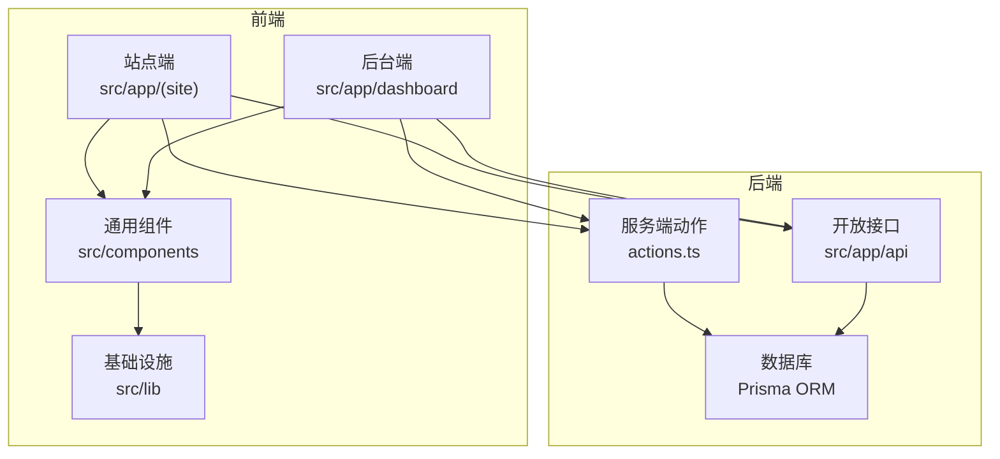
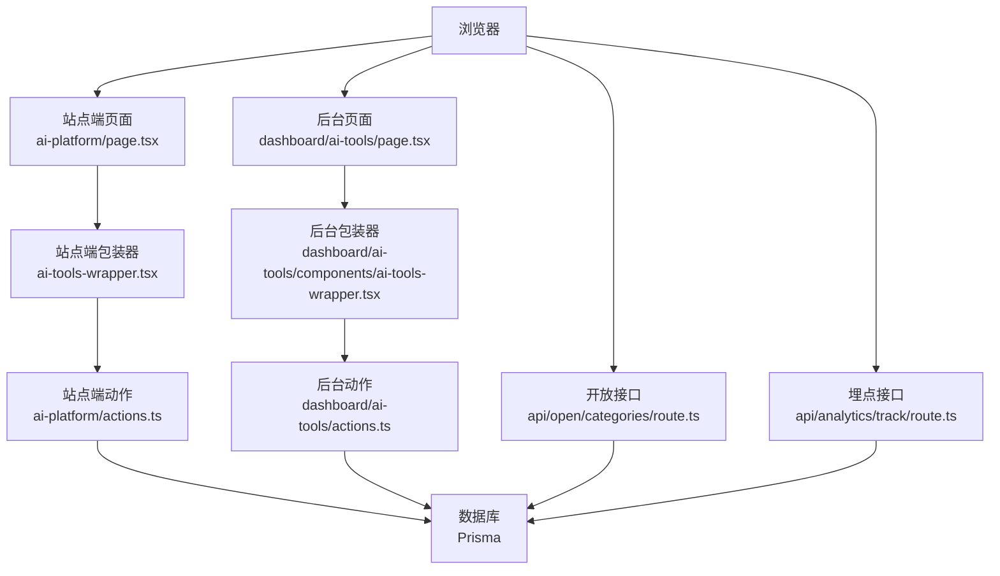
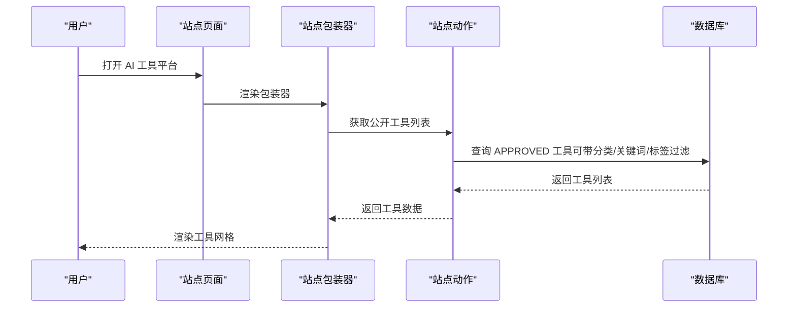
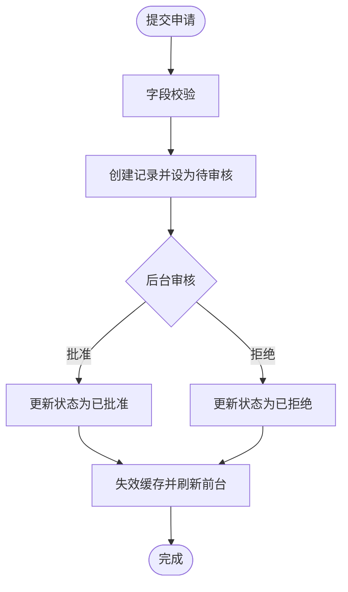
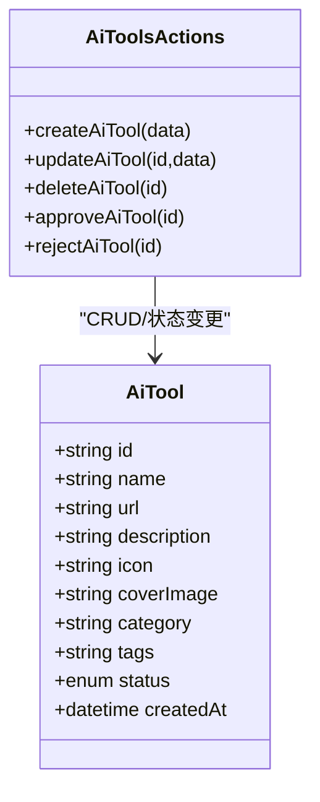
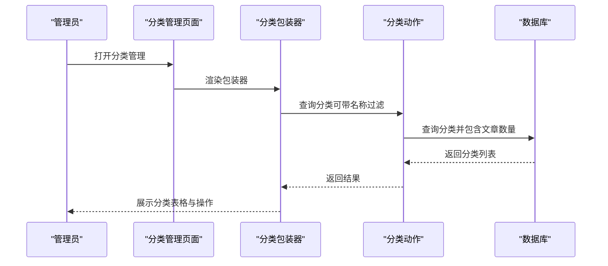
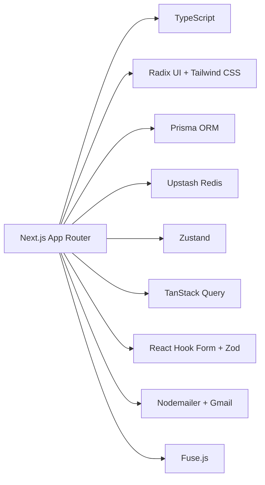

# AI工具平台

<cite>
**本文引用的文件**
- [README.md](file://README.md)
- [package.json](file://package.json)
- [src/app/(site)/ai-platform/page.tsx](file://src/app/(site)/ai-platform/page.tsx)
- [src/app/(site)/ai-platform/components/ai-tools-wrapper.tsx](file://src/app/(site)/ai-platform/components/ai-tools-wrapper.tsx)
- [src/app/(site)/ai-platform/actions.ts](file://src/app/(site)/ai-platform/actions.ts)
- [src/app/dashboard/ai-tools/page.tsx](file://src/app/dashboard/ai-tools/page.tsx)
- [src/app/dashboard/ai-tools/components/ai-tools-wrapper.tsx](file://src/app/dashboard/ai-tools/components/ai-tools-wrapper.tsx)
- [src/app/dashboard/ai-tools/actions.ts](file://src/app/dashboard/ai-tools/actions.ts)
- [src/app/dashboard/ai-tools/schema.ts](file://src/app/dashboard/ai-tools/schema.ts)
- [src/app/dashboard/categories/page.tsx](file://src/app/dashboard/categories/page.tsx)
- [src/app/dashboard/categories/actions.ts](file://src/app/dashboard/categories/actions.ts)
- [src/app/dashboard/categories/schema.ts](file://src/app/dashboard/categories/schema.ts)
- [src/app/api/open/categories/route.ts](file://src/app/api/open/categories/route.ts)
- [src/app/api/analytics/track/route.ts](file://src/app/api/analytics/track/route.ts)
- [src/lib/db.ts](file://src/lib/db.ts)
</cite>

## 目录
1. [简介](#简介)
2. [项目结构](#项目结构)
3. [核心组件](#核心组件)
4. [架构总览](#架构总览)
5. [详细组件分析](#详细组件分析)
6. [依赖关系分析](#依赖关系分析)
7. [性能考量](#性能考量)
8. [故障排查指南](#故障排查指南)
9. [结论](#结论)
10. [附录](#附录)

## 简介
本项目是一个基于 Next.js 的现代化工具平台与博客系统，核心能力包括：
- 用户认证与权限管理
- 博客内容管理（文章、分类、标签、评论）
- AI 工具库：工具展示、申请与审核流程
- 实用工具箱：多种在线工具集合
- 友链管理：友链的提交、审核与管理
- 邮件系统：Gmail 发送、验证码与通知模板、邮件日志与防刷
- 数据分析：网站访问统计与用户行为追踪
- 响应式设计：深色主题与移动端适配

本技术文档聚焦于“AI工具平台”的展示系统设计、工具分类与搜索、申请与审核流程、工具管理功能、前端交互体验、API 接口与数据模型、性能监控与统计、用户反馈机制以及平台扩展性与新工具接入流程。

## 项目结构
项目采用 Next.js App Router 结构，核心目录与职责如下：
- prisma：数据库模式与迁移
- public：静态资源
- scripts：运维与测试脚本
- src/app：页面与路由（含站点端与后台端）
- src/components：通用 UI 组件
- src/hooks：自定义 Hooks
- src/lib：基础设施（数据库、HTTP、邮件、会话等）
- src/store：状态管理（Zustand）

**图表来源**
- [src/app/(site)/ai-platform/page.tsx](file://src/app/(site)/ai-platform/page.tsx#L1-L22)
- [src/app/dashboard/ai-tools/page.tsx:1-33](file://src/app/dashboard/ai-tools/page.tsx#L1-L33)
- [src/app/api/analytics/track/route.ts:1-54](file://src/app/api/analytics/track/route.ts#L1-L54)
- [src/lib/db.ts:1-16](file://src/lib/db.ts#L1-L16)

**章节来源**
- [README.md:54-69](file://README.md#L54-L69)

## 核心组件
- 展示页与骨架屏：站点端 AI 工具平台页使用 Suspense 与 Skeleton 提供首屏占位，提升感知速度。
- 工具包装器：站点端与后台端分别提供 AiToolsWrapper，负责数据获取与传递给客户端组件。
- 服务端动作：封装数据库操作、缓存与路径失效，统一处理工具的增删改查与状态变更。
- 分类管理：后台提供分类的增删改查与缓存，支持按名称模糊查询与计数。
- 开放接口：提供分类列表查询接口，支持过滤“仅返回有关联文章的分类”。
- 数据分析：提供埋点接口，异步写库避免阻塞响应。

**章节来源**
- [src/app/(site)/ai-platform/page.tsx:1-22](file://src/app/(site)/ai-platform/page.tsx#L1-L22)
- [src/app/(site)/ai-platform/components/ai-tools-wrapper.tsx:1-13](file://src/app/(site)/ai-platform/components/ai-tools-wrapper.tsx#L1-L13)
- [src/app/dashboard/ai-tools/components/ai-tools-wrapper.tsx:1-29](file://src/app/dashboard/ai-tools/components/ai-tools-wrapper.tsx#L1-L29)
- [src/app/dashboard/ai-tools/actions.ts:1-144](file://src/app/dashboard/ai-tools/actions.ts#L1-L144)
- [src/app/dashboard/categories/actions.ts:1-96](file://src/app/dashboard/categories/actions.ts#L1-L96)
- [src/app/api/open/categories/route.ts:1-45](file://src/app/api/open/categories/route.ts#L1-L45)
- [src/app/api/analytics/track/route.ts:1-54](file://src/app/api/analytics/track/route.ts#L1-L54)

## 架构总览
平台采用前后端分离的 App Router 架构，数据流以“页面 -> 包装器 -> 动作函数 -> Prisma -> 数据库”为主；开放接口与埋点接口独立于页面层，便于外部调用与统计。

**图表来源**
- [src/app/(site)/ai-platform/page.tsx](file://src/app/(site)/ai-platform/page.tsx#L1-L22)
- [src/app/(site)/ai-platform/components/ai-tools-wrapper.tsx](file://src/app/(site)/ai-platform/components/ai-tools-wrapper.tsx#L1-L13)
- [src/app/(site)/ai-platform/actions.ts](file://src/app/(site)/ai-platform/actions.ts#L1-L58)
- [src/app/dashboard/ai-tools/page.tsx:1-33](file://src/app/dashboard/ai-tools/page.tsx#L1-L33)
- [src/app/dashboard/ai-tools/components/ai-tools-wrapper.tsx:1-29](file://src/app/dashboard/ai-tools/components/ai-tools-wrapper.tsx#L1-L29)
- [src/app/dashboard/ai-tools/actions.ts:1-144](file://src/app/dashboard/ai-tools/actions.ts#L1-L144)
- [src/app/api/open/categories/route.ts:1-45](file://src/app/api/open/categories/route.ts#L1-L45)
- [src/app/api/analytics/track/route.ts:1-54](file://src/app/api/analytics/track/route.ts#L1-L54)
- [src/lib/db.ts:1-16](file://src/lib/db.ts#L1-L16)

## 详细组件分析

### 展示系统设计：工具分类、排序、搜索
- 数据来源与缓存
  - 站点端 AiToolsWrapper 使用 React cache 包裹 getPublicAiTools，减少重复查询。
  - 后台端 AiToolsWrapper 使用 Next.js 不稳定缓存（unstable_cache）+ 标签缓存，支持分页、搜索与状态筛选。
- 过滤与排序
  - 公开展示：按创建时间倒序，仅显示“已批准”状态；支持按分类、关键词、标签过滤。
  - 后台管理：支持按状态（待审核/已批准/已拒绝）与关键词过滤，分页查询。
- 前端交互
  - 展示页使用 Suspense + Skeleton 提升首屏体验；后台页提供分页控件与搜索输入框。
- 性能优化
  - 站点端缓存与后台端缓存结合，配合 revalidateTag/revalidatePath 实现状态变更后的增量刷新。

**图表来源**
- [src/app/(site)/ai-platform/page.tsx](file://src/app/(site)/ai-platform/page.tsx#L1-L22)
- [src/app/(site)/ai-platform/components/ai-tools-wrapper.tsx](file://src/app/(site)/ai-platform/components/ai-tools-wrapper.tsx#L1-L13)
- [src/app/(site)/ai-platform/actions.ts](file://src/app/(site)/ai-platform/actions.ts#L29-L58)

**章节来源**
- [src/app/(site)/ai-platform/components/ai-tools-wrapper.tsx:1-13](file://src/app/(site)/ai-platform/components/ai-tools-wrapper.tsx#L1-L13)
- [src/app/(site)/ai-platform/actions.ts:29-58](file://src/app/(site)/ai-platform/actions.ts#L29-L58)
- [src/app/dashboard/ai-tools/components/ai-tools-wrapper.tsx:1-29](file://src/app/dashboard/ai-tools/components/ai-tools-wrapper.tsx#L1-L29)
- [src/app/dashboard/ai-tools/actions.ts:31-78](file://src/app/dashboard/ai-tools/actions.ts#L31-L78)

### 工具申请与审核流程
- 申请表单与校验
  - 申请接口对名称、URL、描述、分类、标签等字段进行 Zod 校验，并默认状态为“待审核”。
- 审核流程
  - 后台动作提供“批准/拒绝”接口，更新状态并触发缓存失效与路径重建。
- 状态管理
  - 支持三种状态：待审核、已批准、已拒绝；前台仅展示已批准工具。
- 权限与可见性
  - 申请入口面向普通用户；审核入口位于后台管理页面。

**图表来源**
- [src/app/(site)/ai-platform/actions.ts:16-27](file://src/app/(site)/ai-platform/actions.ts#L16-L27)
- [src/app/dashboard/ai-tools/actions.ts:121-143](file://src/app/dashboard/ai-tools/actions.ts#L121-L143)

**章节来源**
- [src/app/(site)/ai-platform/actions.ts:6-27](file://src/app/(site)/ai-platform/actions.ts#L6-L27)
- [src/app/dashboard/ai-tools/actions.ts:121-143](file://src/app/dashboard/ai-tools/actions.ts#L121-L143)

### 工具管理功能：信息维护、状态控制、权限管理
- 信息维护
  - 支持创建、更新、删除工具记录；字段包含名称、URL、描述、图标、封面图、分类、标签、状态。
- 状态控制
  - 提供“批准/拒绝”接口，配合缓存失效策略确保前台即时更新。
- 权限管理
  - 后台管理页面用于工具与分类的维护；具体鉴权逻辑由 NextAuth/Logto 等中间件或服务端动作承担（本仓库未直接展示鉴权代码，但动作函数均在服务端执行，具备基础权限隔离）。
- 路径失效
  - 更新/删除后主动 revalidateTag 与 revalidatePath，保证多页面一致性。

**图表来源**
- [src/app/dashboard/ai-tools/schema.ts:1-15](file://src/app/dashboard/ai-tools/schema.ts#L1-L15)
- [src/app/dashboard/ai-tools/actions.ts:80-143](file://src/app/dashboard/ai-tools/actions.ts#L80-L143)

**章节来源**
- [src/app/dashboard/ai-tools/schema.ts:1-15](file://src/app/dashboard/ai-tools/schema.ts#L1-L15)
- [src/app/dashboard/ai-tools/actions.ts:80-143](file://src/app/dashboard/ai-tools/actions.ts#L80-L143)

### 前端交互设计：动态加载、状态同步、用户体验优化
- 动态加载
  - 展示页使用 Suspense + Skeleton，后台页使用骨架容器，避免白屏与布局抖动。
- 状态同步
  - 服务端动作在变更后调用 revalidateTag/revalidatePath，确保缓存失效与页面重建。
- 用户体验
  - 分页与搜索联动；后台表格展示与分页控件；前台网格布局与占位符提升感知速度。

**章节来源**
- [src/app/(site)/ai-platform/page.tsx:1-22](file://src/app/(site)/ai-platform/page.tsx#L1-L22)
- [src/app/dashboard/ai-tools/page.tsx:1-33](file://src/app/dashboard/ai-tools/page.tsx#L1-L33)
- [src/app/dashboard/ai-tools/actions.ts:90-118](file://src/app/dashboard/ai-tools/actions.ts#L90-L118)

### 工具分类管理实现机制
- 分类 CRUD
  - 支持按名称模糊查询、创建、更新、删除；更新时检查名称与 slug 的唯一性；删除前检查是否仍有文章关联。
- 缓存与排序
  - 使用不稳定缓存与标签缓存，按创建时间倒序；可选择仅返回有关联文章的分类。
- 后台管理
  - 提供分类管理页面与对话框组件，支持编辑与删除操作。

**图表来源**
- [src/app/dashboard/categories/page.tsx:1-21](file://src/app/dashboard/categories/page.tsx#L1-L21)
- [src/app/dashboard/categories/actions.ts:9-31](file://src/app/dashboard/categories/actions.ts#L9-L31)

**章节来源**
- [src/app/dashboard/categories/actions.ts:1-96](file://src/app/dashboard/categories/actions.ts#L1-L96)
- [src/app/api/open/categories/route.ts:15-44](file://src/app/api/open/categories/route.ts#L15-L44)

### API 接口文档
- 开放接口：查询分类列表
  - 方法与路径：GET /api/open/categories
  - 查询参数：
    - hasPosts: 是否仅返回有关联文章的分类（true/false，默认 false）
  - 成功响应：返回分类数组，包含 id、name、slug、description、postCount、createdAt。
  - 认证：需要 API Key（通过 authenticateRequest 验证）。
- 埋点接口：站点访问统计
  - 方法与路径：POST /api/analytics/track
  - 请求体字段：uv、pageUrl、device、referrer（可选）
  - 行为：先返回 200，再在响应后异步写入数据库，避免阻塞。
  - 错误处理：缺失必填字段返回 400；内部错误返回 500。

**章节来源**
- [src/app/api/open/categories/route.ts:1-45](file://src/app/api/open/categories/route.ts#L1-L45)
- [src/app/api/analytics/track/route.ts:1-54](file://src/app/api/analytics/track/route.ts#L1-L54)

### 数据模型说明
- 工具模型（AiTool）
  - 字段：id、name、url、description、icon、coverImage、category、tags、status、createdAt
  - 约束：status 默认值、URL 格式、分类非空、标签可为空
- 分类模型（Category）
  - 字段：id、name、slug、description、icon、color、createdAt
  - 约束：name 长度限制、slug 格式校验、唯一性约束（名称与路径）
- 访问记录模型（SiteVisit）
  - 字段：id、uv、pageUrl、device、referrer、ip、createdAt
  - 用途：站点访问统计与用户行为追踪

**章节来源**
- [src/app/dashboard/ai-tools/schema.ts:1-15](file://src/app/dashboard/ai-tools/schema.ts#L1-L15)
- [src/app/dashboard/categories/schema.ts:1-12](file://src/app/dashboard/categories/schema.ts#L1-L12)
- [src/app/api/analytics/track/route.ts:31-39](file://src/app/api/analytics/track/route.ts#L31-L39)

## 依赖关系分析
- 技术栈
  - 框架：Next.js 16.1.4（App Router）
  - 语言：TypeScript 5
  - UI：Radix UI + Tailwind CSS 4
  - 数据库：PostgreSQL（Prisma ORM）
  - 缓存：Redis（Upstash）
  - 状态管理：Zustand
  - 数据获取：TanStack Query
  - 表单：React Hook Form + Zod
  - 认证：JWT + Argon2（Logto 集成）
  - 邮件：Nodemailer + Gmail SMTP
- 关键依赖
  - @prisma/client、@tanstack/react-query、@upstash/redis、zustand、react-hook-form、zod、fuse.js（用于搜索）

**图表来源**
- [package.json:11-79](file://package.json#L11-L79)

**章节来源**
- [package.json:11-79](file://package.json#L11-L79)
- [README.md:16-27](file://README.md#L16-L27)

## 性能考量
- 缓存策略
  - 站点端：React cache 缓存公开工具列表，减少重复查询。
  - 后台端：unstable_cache + 标签缓存，支持分页、搜索与状态筛选，定时失效（revalidate）。
- 路径失效
  - 创建/更新/删除后调用 revalidateTag 与 revalidatePath，确保多页面一致。
- 异步写库
  - 埋点接口使用 after() 在响应后异步写库，避免阻塞请求。
- 首屏体验
  - 展示页与后台页均使用 Suspense + Skeleton，降低感知延迟。

**章节来源**
- [src/app/(site)/ai-platform/components/ai-tools-wrapper.tsx:5-8](file://src/app/(site)/ai-platform/components/ai-tools-wrapper.tsx#L5-L8)
- [src/app/dashboard/ai-tools/actions.ts:31-64](file://src/app/dashboard/ai-tools/actions.ts#L31-L64)
- [src/app/api/analytics/track/route.ts:28-43](file://src/app/api/analytics/track/route.ts#L28-L43)
- [src/app/(site)/ai-platform/page.tsx:9-17](file://src/app/(site)/ai-platform/page.tsx#L9-L17)
- [src/app/dashboard/ai-tools/page.tsx:23-29](file://src/app/dashboard/ai-tools/page.tsx#L23-L29)

## 故障排查指南
- 数据库连接
  - 确认 DATABASE_URL 环境变量正确；开发环境下启用查询日志以便调试。
- 缓存问题
  - 若出现数据不同步，尝试清除缓存标签或等待 revalidate 时间到期；检查 revalidateTag/revalidatePath 调用位置。
- 埋点异常
  - 检查请求体字段是否完整；确认 IP 解析逻辑（x-forwarded-for）；查看异步写库错误日志。
- 分类删除失败
  - 删除前需确认该分类下无文章关联，否则会抛出错误。

**章节来源**
- [src/lib/db.ts:1-16](file://src/lib/db.ts#L1-L16)
- [src/app/dashboard/ai-tools/actions.ts:104-118](file://src/app/dashboard/ai-tools/actions.ts#L104-L118)
- [src/app/api/analytics/track/route.ts:9-18](file://src/app/api/analytics/track/route.ts#L9-L18)
- [src/app/dashboard/categories/actions.ts:79-95](file://src/app/dashboard/categories/actions.ts#L79-L95)

## 结论
本平台围绕“AI 工具平台”构建了清晰的展示、申请与审核、管理与分类体系，并通过缓存、路径失效与异步写库等手段保障性能与一致性。开放接口与埋点接口为扩展与运营提供了基础能力。后续可在权限细化、搜索算法优化、可视化统计与反馈闭环等方面持续增强。

## 附录
- 快速开始
  - 安装依赖、启动开发服务器、访问本地端口。
- 环境配置
  - 复制 .env.example 并配置数据库、JWT、邮件等必要参数。
- 测试邮件功能
  - 可运行脚本测试邮件发送与日志记录。

**章节来源**
- [README.md:71-125](file://README.md#L71-L125)