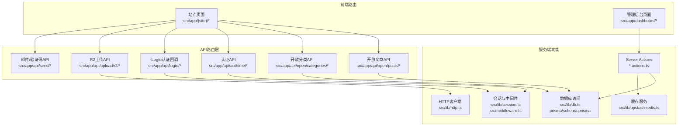
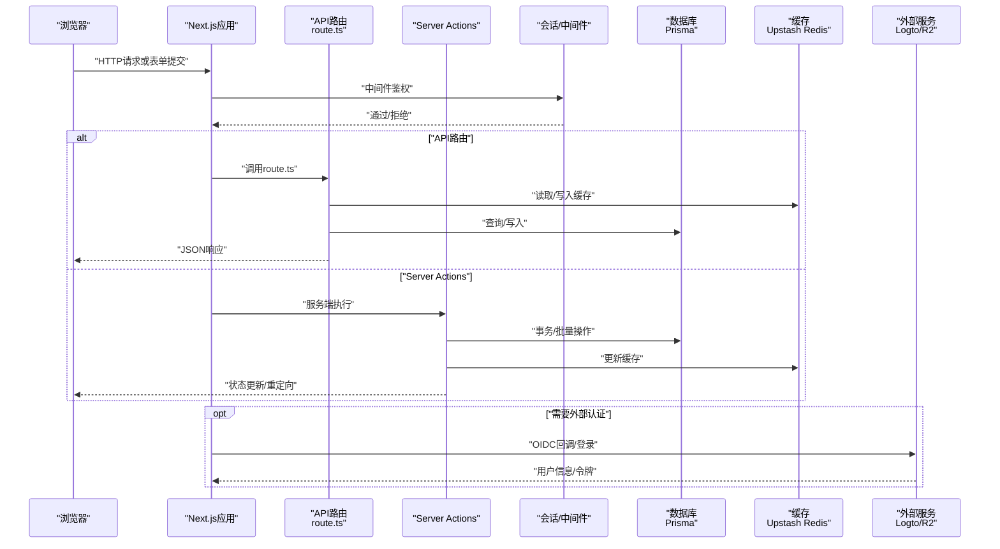
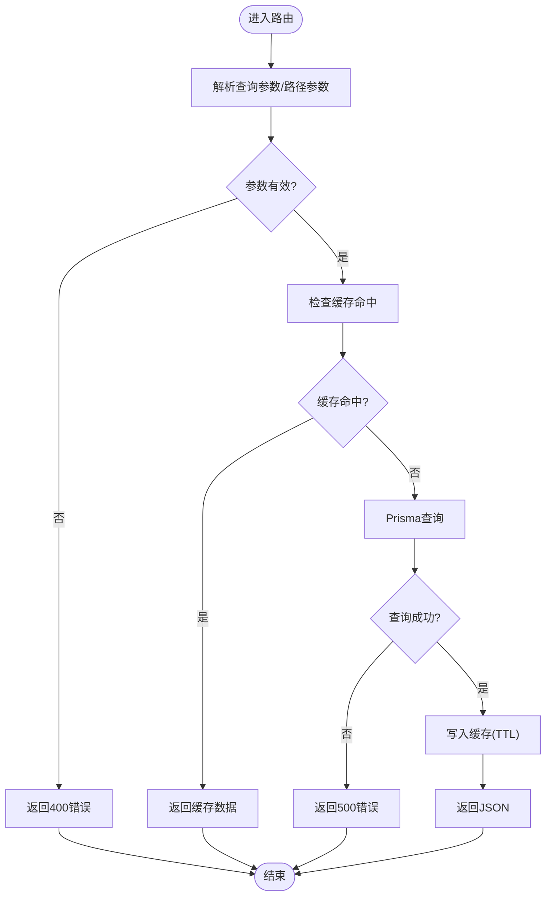
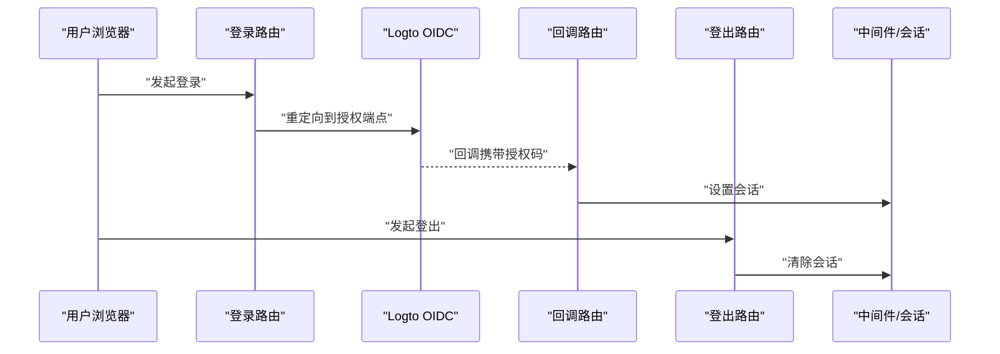
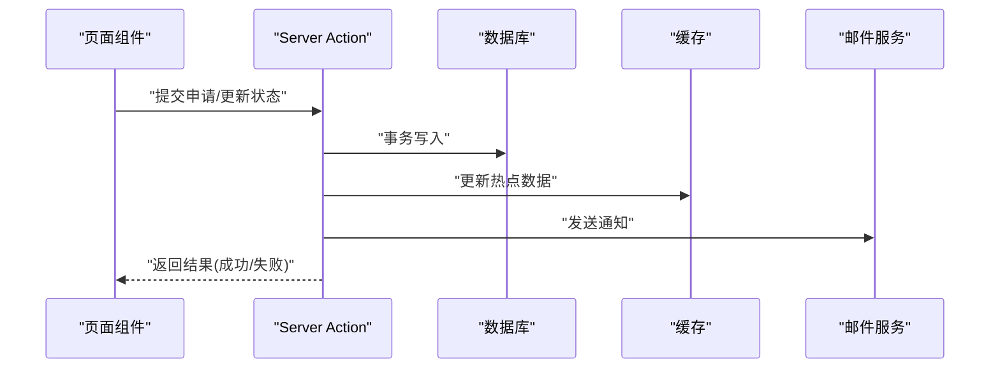
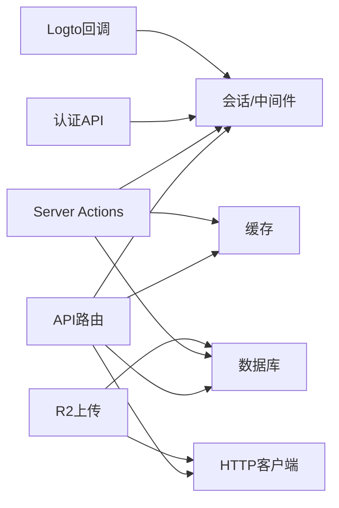

# API接口集成

<cite>
**本文引用的文件**
- [src/app/api/analytics/track/route.ts](file://src/app/api/analytics/track/route.ts)
- [src/app/api/auth/me/route.ts](file://src/app/api/auth/me/route.ts)
- [src/app/api/logto/callback/route.ts](file://src/app/api/logto/callback/route.ts)
- [src/app/api/logto/sign-in/route.ts](file://src/app/api/logto/sign-in/route.ts)
- [src/app/api/logto/sign-out/route.ts](file://src/app/api/logto/sign-out/route.ts)
- [src/app/api/open/categories/route.ts](file://src/app/api/open/categories/route.ts)
- [src/app/api/open/posts/route.ts](file://src/app/api/open/posts/route.ts)
- [src/app/api/open/posts/[id]/route.ts](file://src/app/api/open/posts/[id]/route.ts)
- [src/app/api/open/posts/slug/[slug]/route.ts](file://src/app/api/open/posts/slug/[slug]/route.ts)
- [src/app/api/rcode/route.ts](file://src/app/api/rcode/route.ts)
- [src/app/api/send/notification/route.ts](file://src/app/api/send/notification/route.ts)
- [src/app/api/send/verification-code/route.ts](file://src/app/api/send/verification-code/route.ts)
- [src/app/api/send-friend-approval/route.ts](file://src/app/api/send-friend-approval/route.ts)
- [src/app/api/test-db/route.ts](file://src/app/api/test-db/route.ts)
- [src/app/api/test-friend-email/route.ts](file://src/app/api/test-friend-email/route.ts)
- [src/app/api/test-mail/route.ts](file://src/app/api/test-mail/route.ts)
- [src/app/api/upload/r2/token/route.ts](file://src/app/api/upload/r2/token/route.ts)
- [src/app/api/upload/r2/upload/route.ts](file://src/app/api/upload/r2/upload/route.ts)
- [src/app/api/upload/r2/url/route.ts](file://src/app/api/upload/r2/url/route.ts)
- [src/app/(site)/ai-platform/actions.ts](file://src/app/(site)/ai-platform/actions.ts)
- [src/app/(site)/tools/actions.ts](file://src/app/(site)/tools/actions.ts)
- [src/app/dashboard/tools/actions.ts](file://src/app/dashboard/tools/actions.ts)
- [src/lib/session.ts](file://src/lib/session.ts)
- [src/lib/logto.ts](file://src/lib/logto.ts)
- [src/lib/db.ts](file://src/lib/db.ts)
- [src/middleware.ts](file://src/middleware.ts)
- [src/lib/upstash-redis.ts](file://src/lib/upstash-redis.ts)
- [src/lib/http.ts](file://src/lib/http.ts)
- [src/lib/env.ts](file://src/lib/env.ts)
- [prisma/schema.prisma](file://prisma/schema.prisma)
</cite>

## 目录
1. [简介](#简介)
2. [项目结构](#项目结构)
3. [核心组件](#核心组件)
4. [架构总览](#架构总览)
5. [详细组件分析](#详细组件分析)
6. [依赖关系分析](#依赖关系分析)
7. [性能考量](#性能考量)
8. [故障排查指南](#故障排查指南)
9. [结论](#结论)
10. [附录](#附录)

## 简介
本文件面向AI工具平台的API接口集成，系统化梳理RESTful API设计与实现、Server Actions使用场景与实现方式、认证与授权机制（含JWT与权限验证）、数据传输格式与错误处理策略、性能优化方案（缓存、并发、超时）、API版本管理与向后兼容、以及监控与日志记录机制。文档以仓库中现有API路由与Actions为依据，结合中间件与基础设施模块，形成可操作的技术参考。

## 项目结构
该工程采用Next.js App Router目录结构，API端点位于 `src/app/api/<领域>/<资源>/route.ts`，Dashboard与Site区域的页面逻辑通过Server Actions在服务端执行。认证与会话管理由中间件与会话库负责；数据库访问通过Prisma；缓存使用Upstash Redis；HTTP客户端封装于通用库中。

图表来源
- [src/app/api/open/posts/route.ts](file://src/app/api/open/posts/route.ts)
- [src/app/api/open/categories/route.ts](file://src/app/api/open/categories/route.ts)
- [src/app/api/auth/me/route.ts](file://src/app/api/auth/me/route.ts)
- [src/app/api/logto/sign-in/route.ts](file://src/app/api/logto/sign-in/route.ts)
- [src/app/api/upload/r2/upload/route.ts](file://src/app/api/upload/r2/upload/route.ts)
- [src/app/(site)/ai-platform/actions.ts](file://src/app/(site)/ai-platform/actions.ts)
- [src/lib/session.ts](file://src/lib/session.ts)
- [src/lib/db.ts](file://src/lib/db.ts)
- [src/lib/upstash-redis.ts](file://src/lib/upstash-redis.ts)
- [src/lib/http.ts](file://src/lib/http.ts)
- [prisma/schema.prisma](file://prisma/schema.prisma)

章节来源
- [src/app/api/open/posts/route.ts](file://src/app/api/open/posts/route.ts)
- [src/app/api/open/categories/route.ts](file://src/app/api/open/categories/route.ts)
- [src/app/api/auth/me/route.ts](file://src/app/api/auth/me/route.ts)
- [src/app/api/logto/sign-in/route.ts](file://src/app/api/logto/sign-in/route.ts)
- [src/app/api/upload/r2/upload/route.ts](file://src/app/api/upload/r2/upload/route.ts)
- [src/app/(site)/ai-platform/actions.ts](file://src/app/(site)/ai-platform/actions.ts)
- [src/lib/session.ts](file://src/lib/session.ts)
- [src/lib/db.ts](file://src/lib/db.ts)
- [src/lib/upstash-redis.ts](file://src/lib/upstash-redis.ts)
- [src/lib/http.ts](file://src/lib/http.ts)
- [prisma/schema.prisma](file://prisma/schema.prisma)

## 核心组件
- RESTful API路由：基于App Router的route.ts文件组织，覆盖开放内容（文章、分类）、认证（当前用户信息）、第三方登录（Logto回调）、文件上传（Cloudflare R2）、邮件发送等。
- Server Actions：在站点与管理后台页面中，通过actions.ts在服务端执行业务逻辑，支持表单提交、批量操作、状态变更等。
- 认证与授权：中间件与会话库负责请求拦截与身份校验；Logto作为OIDC提供商；当前用户信息API返回受保护资源。
- 数据访问：Prisma ORM模型定义与查询；数据库迁移管理。
- 缓存与性能：Upstash Redis用于热点数据缓存；HTTP客户端封装统一错误处理与超时配置。
- 日志与监控：分析埋点API、邮件发送日志、数据库测试端点等辅助监控手段。

章节来源
- [src/app/api/analytics/track/route.ts](file://src/app/api/analytics/track/route.ts)
- [src/app/api/send/notification/route.ts](file://src/app/api/send/notification/route.ts)
- [src/app/api/email-log-table/migration.sql](file://prisma/migrations/20260202122338_add_email_log_table/migration.sql)

## 架构总览
下图展示从浏览器到API路由、服务端动作、数据库与外部服务的整体调用链路。

图表来源
- [src/app/api/open/posts/route.ts](file://src/app/api/open/posts/route.ts)
- [src/app/(site)/tools/actions.ts](file://src/app/(site)/tools/actions.ts)
- [src/lib/session.ts](file://src/lib/session.ts)
- [src/lib/db.ts](file://src/lib/db.ts)
- [src/lib/upstash-redis.ts](file://src/lib/upstash-redis.ts)
- [src/lib/logto.ts](file://src/lib/logto.ts)

## 详细组件分析

### 开放文章API（GET/POST）
- 路由位置：`src/app/api/open/posts/route.ts`、`src/app/api/open/posts/[id]/route.ts`、`src/app/api/open/posts/slug/[slug]/route.ts`
- 功能要点：
  - 列表查询：分页、过滤、排序参数解析，Prisma查询后返回标准化JSON。
  - 单条查询：按ID或slug精确匹配，不存在时返回404。
  - 新增文章：请求体校验、权限检查（需登录），成功返回201。
- 错误处理：参数非法、数据库异常、资源不存在分别映射到不同HTTP状态码。
- 性能优化：对热门文章开启Redis缓存，设置TTL；列表查询使用索引字段；分页大小限制。

图表来源
- [src/app/api/open/posts/route.ts](file://src/app/api/open/posts/route.ts)
- [src/app/api/open/posts/[id]/route.ts](file://src/app/api/open/posts/[id]/route.ts)
- [src/app/api/open/posts/slug/[slug]/route.ts](file://src/app/api/open/posts/slug/[slug]/route.ts)
- [src/lib/upstash-redis.ts](file://src/lib/upstash-redis.ts)
- [src/lib/db.ts](file://src/lib/db.ts)

章节来源
- [src/app/api/open/posts/route.ts](file://src/app/api/open/posts/route.ts)
- [src/app/api/open/posts/[id]/route.ts](file://src/app/api/open/posts/[id]/route.ts)
- [src/app/api/open/posts/slug/[slug]/route.ts](file://src/app/api/open/posts/slug/[slug]/route.ts)
- [src/lib/upstash-redis.ts](file://src/lib/upstash-redis.ts)
- [src/lib/db.ts](file://src/lib/db.ts)

### 开放分类API（GET/POST）
- 路由位置：`src/app/api/open/categories/route.ts`
- 功能要点：
  - 获取分类列表：支持层级/树形结构输出，必要时进行内存聚合。
  - 创建分类：鉴权+校验，返回标准响应。
- 错误处理：400参数错误、401未授权、404资源不存在、500服务器错误。
- 性能优化：分类树构建尽量减少多次遍历；对静态分类数据启用缓存。

章节来源
- [src/app/api/open/categories/route.ts](file://src/app/api/open/categories/route.ts)
- [src/lib/upstash-redis.ts](file://src/lib/upstash-redis.ts)

### 当前用户信息API（GET）
- 路由位置：`src/app/api/auth/me/route.ts`
- 功能要点：
  - 基于中间件的会话校验，返回当前登录用户的基本信息。
  - 返回字段最小化，避免敏感信息泄露。
- 安全性：仅在已登录状态下可用；与会话存储配合防止伪造。

章节来源
- [src/app/api/auth/me/route.ts](file://src/app/api/auth/me/route.ts)
- [src/lib/session.ts](file://src/lib/session.ts)

### Logto认证集成
- 路由位置：`src/app/api/logto/sign-in/route.ts`、`src/app/api/logto/sign-out/route.ts`、`src/app/api/logto/callback/route.ts`
- 功能要点：
  - 登录：生成OIDC授权URL并重定向。
  - 回调：交换授权码为用户信息，设置会话。
  - 登出：清理会话。
- 集成点：与中间件配合，确保受保护路由的访问控制。

图表来源
- [src/app/api/logto/sign-in/route.ts](file://src/app/api/logto/sign-in/route.ts)
- [src/app/api/logto/callback/route.ts](file://src/app/api/logto/callback/route.ts)
- [src/app/api/logto/sign-out/route.ts](file://src/app/api/logto/sign-out/route.ts)
- [src/lib/session.ts](file://src/lib/session.ts)
- [src/lib/logto.ts](file://src/lib/logto.ts)

章节来源
- [src/app/api/logto/sign-in/route.ts](file://src/app/api/logto/sign-in/route.ts)
- [src/app/api/logto/callback/route.ts](file://src/app/api/logto/callback/route.ts)
- [src/app/api/logto/sign-out/route.ts](file://src/app/api/logto/sign-out/route.ts)
- [src/lib/session.ts](file://src/lib/session.ts)
- [src/lib/logto.ts](file://src/lib/logto.ts)

### 文件上传（Cloudflare R2）API
- 路由位置：`src/app/api/upload/r2/token/route.ts`、`src/app/api/upload/r2/upload/route.ts`、`src/app/api/upload/r2/url/route.ts`
- 功能要点：
  - 获取上传Token：生成临时凭证，限制有效期与权限范围。
  - 直传URL：返回预签名URL，前端直传R2。
  - 上传完成回调：服务端记录元数据，触发后续处理。
- 安全性：Token/TTL严格控制；URL签名防篡改；白名单域名/路径。

章节来源
- [src/app/api/upload/r2/token/route.ts](file://src/app/api/upload/r2/token/route.ts)
- [src/app/api/upload/r2/upload/route.ts](file://src/app/api/upload/r2/upload/route.ts)
- [src/app/api/upload/r2/url/route.ts](file://src/app/api/upload/r2/url/route.ts)
- [src/lib/http.ts](file://src/lib/http.ts)

### 邮件与通知API
- 路由位置：`src/app/api/send/verification-code/route.ts`、`src/app/api/send/notification/route.ts`、`src/app/api/send-friend-approval/route.ts`
- 功能要点：
  - 验证码：生成随机码、限制频率、发送渠道配置。
  - 通知：模板化消息、多通道发送。
  - 好友审批：审批流程消息推送。
- 错误处理：频率限制、发送失败回滚、幂等性保障。

章节来源
- [src/app/api/send/verification-code/route.ts](file://src/app/api/send/verification-code/route.ts)
- [src/app/api/send/notification/route.ts](file://src/app/api/send/notification/route.ts)
- [src/app/api/send-friend-approval/route.ts](file://src/app/api/send-friend-approval/route.ts)

### 分析埋点API
- 路由位置：`src/app/api/analytics/track/route.ts`
- 功能要点：
  - 页面浏览、事件追踪上报。
  - 数据清洗与去重、异步入库或转发至分析平台。
- 监控价值：用户行为分析、转化率评估。

章节来源
- [src/app/api/analytics/track/route.ts](file://src/app/api/analytics/track/route.ts)

### Server Actions使用场景与实现
- 使用场景：
  - AI工具申请与状态更新：在站点页面通过actions.ts在服务端执行，避免前端直接暴露后端逻辑。
  - 工具箱与仪表板：批量操作、状态变更、权限校验。
- 实现方式：
  - 在页面组件中导入对应actions.ts，通过表单或按钮触发。
  - 服务端函数内执行Prisma事务、缓存更新、邮件通知等。
  - 返回标准化结果对象，前端根据状态更新UI。

图表来源
- [src/app/(site)/ai-platform/actions.ts](file://src/app/(site)/ai-platform/actions.ts)
- [src/app/(site)/tools/actions.ts](file://src/app/(site)/tools/actions.ts)
- [src/app/dashboard/tools/actions.ts](file://src/app/dashboard/tools/actions.ts)
- [src/lib/db.ts](file://src/lib/db.ts)
- [src/lib/upstash-redis.ts](file://src/lib/upstash-redis.ts)

章节来源
- [src/app/(site)/ai-platform/actions.ts](file://src/app/(site)/ai-platform/actions.ts)
- [src/app/(site)/tools/actions.ts](file://src/app/(site)/tools/actions.ts)
- [src/app/dashboard/tools/actions.ts](file://src/app/dashboard/tools/actions.ts)

## 依赖关系分析
- 组件耦合：
  - API路由依赖会话中间件与数据库库；部分路由依赖HTTP客户端与缓存库。
  - Server Actions依赖数据库与缓存，间接依赖会话与环境配置。
- 外部依赖：
  - Logto：OIDC认证提供商。
  - Cloudflare R2：对象存储直传。
  - Upstash Redis：键值缓存。
- 潜在循环依赖：当前结构清晰，无明显循环导入。

图表来源
- [src/app/api/auth/me/route.ts](file://src/app/api/auth/me/route.ts)
- [src/app/api/logto/sign-in/route.ts](file://src/app/api/logto/sign-in/route.ts)
- [src/app/api/upload/r2/upload/route.ts](file://src/app/api/upload/r2/upload/route.ts)
- [src/lib/session.ts](file://src/lib/session.ts)
- [src/lib/db.ts](file://src/lib/db.ts)
- [src/lib/upstash-redis.ts](file://src/lib/upstash-redis.ts)
- [src/lib/http.ts](file://src/lib/http.ts)

章节来源
- [src/app/api/auth/me/route.ts](file://src/app/api/auth/me/route.ts)
- [src/app/api/logto/sign-in/route.ts](file://src/app/api/logto/sign-in/route.ts)
- [src/app/api/upload/r2/upload/route.ts](file://src/app/api/upload/r2/upload/route.ts)
- [src/lib/session.ts](file://src/lib/session.ts)
- [src/lib/db.ts](file://src/lib/db.ts)
- [src/lib/upstash-redis.ts](file://src/lib/upstash-redis.ts)
- [src/lib/http.ts](file://src/lib/http.ts)

## 性能考量
- 缓存策略：
  - 热门文章与分类数据使用Redis缓存，设置合理TTL；写操作后主动失效或更新。
  - 使用LRU策略控制内存占用。
- 并发控制：
  - 限流：验证码发送、登录尝试等高频接口使用滑动窗口或令牌桶。
  - 批量写入：Server Actions中使用Prisma事务，减少锁竞争。
- 超时处理：
  - HTTP客户端设置连接与读取超时；数据库查询设置超时；缓存读写设置超时。
- 数据库优化：
  - 为常用查询字段建立索引；分页查询限制最大页大小；避免N+1查询。
- 前端协同：
  - App Router的并行数据获取与Suspense边界，减少阻塞。

## 故障排查指南
- 常见问题定位：
  - 401/403：检查中间件会话是否正确设置；确认Logto回调是否成功写入会话。
  - 404：确认路径参数与数据库记录是否存在；检查slug唯一性。
  - 500：查看数据库连接与事务日志；核对缓存读写异常。
- 日志与监控：
  - 分析埋点API用于追踪用户行为与异常路径。
  - 邮件发送与验证码接口应记录发送状态与失败原因。
  - 数据库测试端点可用于快速验证连接与权限。
- 调试建议：
  - 使用环境变量切换开发/生产日志级别。
  - 对关键路径增加上下文日志（traceId）以便跨服务追踪。

章节来源
- [src/app/api/analytics/track/route.ts](file://src/app/api/analytics/track/route.ts)
- [src/app/api/test-db/route.ts](file://src/app/api/test-db/route.ts)
- [src/app/api/send/verification-code/route.ts](file://src/app/api/send/verification-code/route.ts)

## 结论
本项目API层采用清晰的App Router组织方式，结合Server Actions实现前后端职责分离；认证通过中间件与Logto完成，具备良好的扩展性。数据库与缓存基础设施完善，可支撑高并发场景。建议在现有基础上进一步完善API版本管理策略与更细粒度的监控告警体系。

## 附录

### API数据传输格式与错误处理策略
- 成功响应：统一返回JSON对象，包含状态码、数据体与可选提示信息。
- 错误响应：区分客户端错误（4xx）与服务端错误（5xx），包含错误码与描述。
- 参数校验：在路由入口与Server Actions入口分别进行输入校验。
- 幂等性：对重复请求进行去重处理（如验证码发送）。

### API版本管理与向后兼容
- 版本策略：在路由前缀中加入版本号（如 `/api/v1/...`），保持旧版本一段时间以保证兼容。
- 迁移计划：逐步淘汰旧版本，发布迁移指南与弃用时间表。
- 兼容性：新增字段采用默认值；删除字段保留但标记弃用。

### 监控与日志记录机制
- 行为追踪：分析埋点API收集用户交互数据。
- 异常监控：集中式日志与告警，关键错误自动通知。
- 性能指标：QPS、P95/P99延迟、缓存命中率、数据库慢查询。