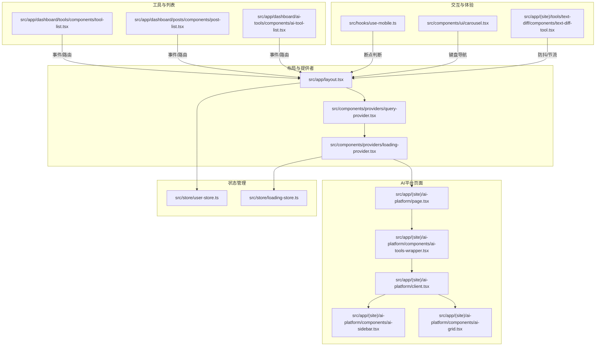
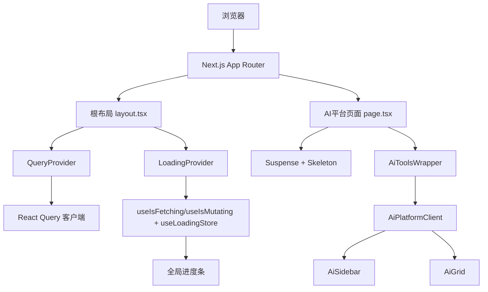
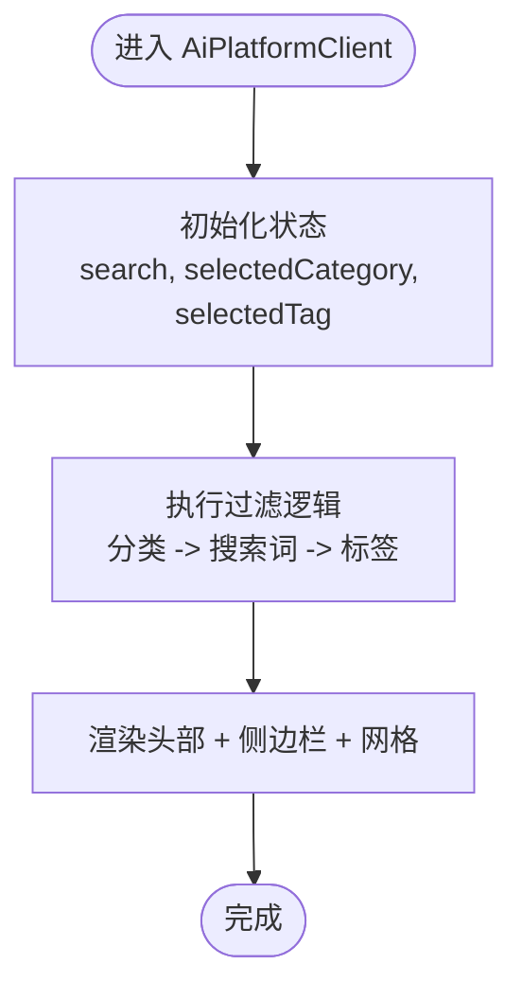
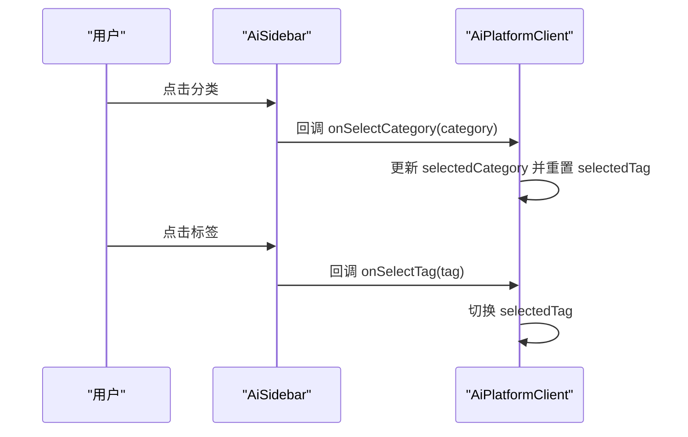
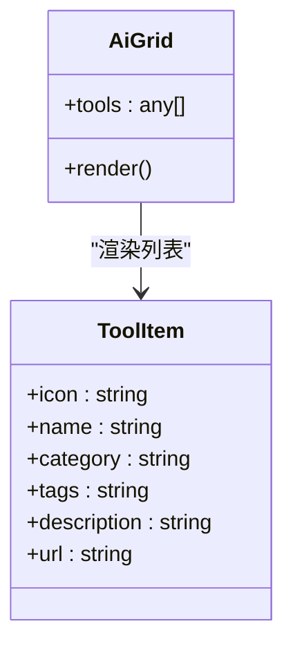
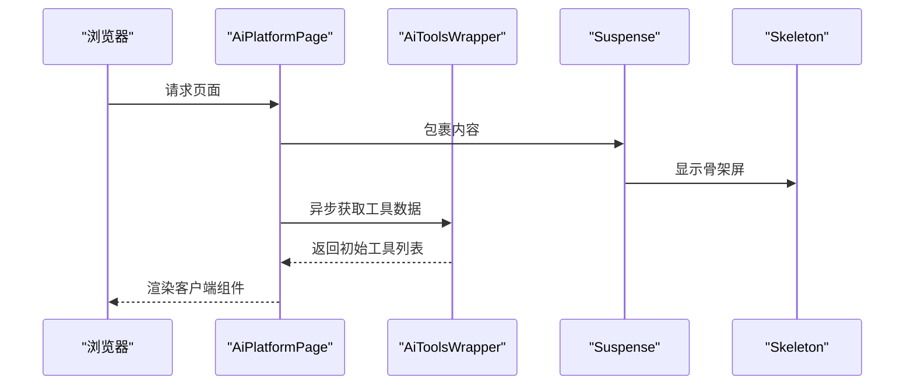
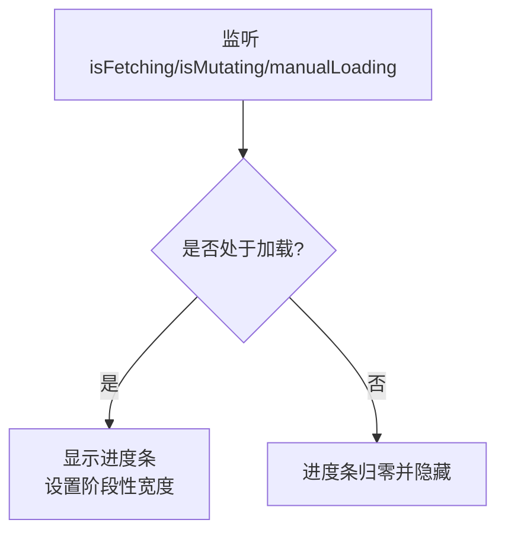
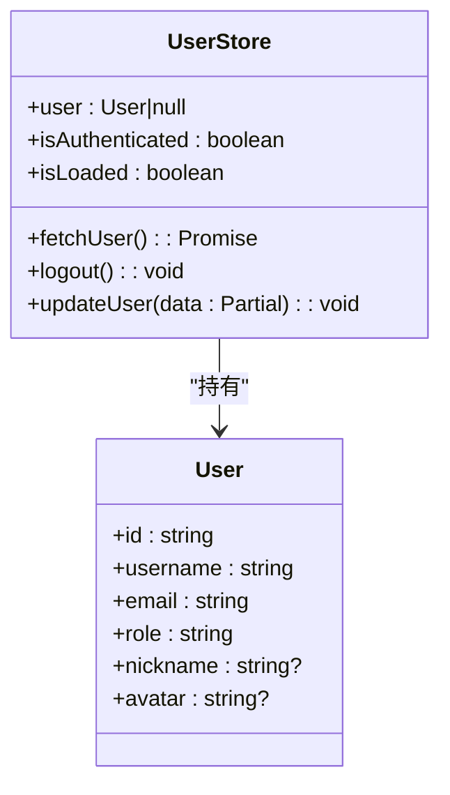
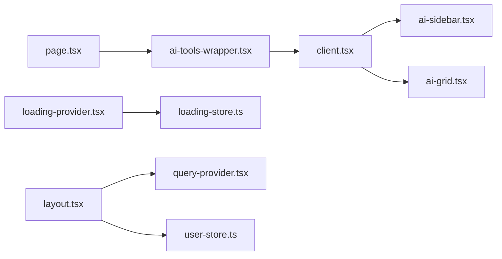

# 前端交互设计

<cite>
**本文引用的文件**
- [src/app/(site)/ai-platform/page.tsx](file://src/app/(site)/ai-platform/page.tsx)
- [src/app/(site)/ai-platform/client.tsx](file://src/app/(site)/ai-platform/client.tsx)
- [src/app/(site)/ai-platform/components/ai-tools-wrapper.tsx](file://src/app/(site)/ai-platform/components/ai-tools-wrapper.tsx)
- [src/app/(site)/ai-platform/components/ai-grid.tsx](file://src/app/(site)/ai-platform/components/ai-grid.tsx)
- [src/app/(site)/ai-platform/components/ai-sidebar.tsx](file://src/app/(site)/ai-platform/components/ai-sidebar.tsx)
- [src/store/user-store.ts](file://src/store/user-store.ts)
- [src/store/loading-store.ts](file://src/store/loading-store.ts)
- [src/components/providers/query-provider.tsx](file://src/components/providers/query-provider.tsx)
- [src/components/providers/loading-provider.tsx](file://src/components/providers/loading-provider.tsx)
- [src/app/layout.tsx](file://src/app/layout.tsx)
- [src/hooks/use-mobile.ts](file://src/hooks/use-mobile.ts)
- [src/app/dashboard/tools/components/tool-list.tsx](file://src/app/dashboard/tools/components/tool-list.tsx)
- [src/app/dashboard/posts/components/post-list.tsx](file://src/app/dashboard/posts/components/post-list.tsx)
- [src/app/dashboard/ai-tools/components/ai-tool-list.tsx](file://src/app/dashboard/ai-tools/components/ai-tool-list.tsx)
- [src/app/(site)/tools/text-diff/components/text-diff-tool.tsx](file://src/app/(site)/tools/text-diff/components/text-diff-tool.tsx)
- [src/components/ui/carousel.tsx](file://src/components/ui/carousel.tsx)
- [next.config.ts](file://next.config.ts)
</cite>

## 目录
1. [简介](#简介)
2. [项目结构](#项目结构)
3. [核心组件](#核心组件)
4. [架构总览](#架构总览)
5. [详细组件分析](#详细组件分析)
6. [依赖关系分析](#依赖关系分析)
7. [性能考虑](#性能考虑)
8. [故障排查指南](#故障排查指南)
9. [结论](#结论)
10. [附录](#附录)

## 简介
本技术文档聚焦于AI工具平台前端交互设计，围绕以下目标展开：客户端组件的状态管理（用户状态、工具状态、应用状态同步）、动态加载与数据刷新机制（Suspense边界、错误边界、加载状态管理）、用户交互优化（防抖节流、事件处理、键盘导航）、前端性能优化策略（代码分割、缓存策略、内存管理）、响应式设计与移动端适配、以及前端调试与测试策略。文档以仓库中实际文件为依据，结合可视化图示帮助读者快速理解系统架构与实现细节。

## 项目结构
该前端采用Next.js App Router组织页面与组件，核心交互集中在“AI工具平台”页面及其子组件中；全局状态通过Zustand管理，数据请求通过React Query统一处理；布局层注入查询客户端与全局加载指示器；部分组件支持移动端自适应。

图表来源
- [src/app/layout.tsx:26-51](file://src/app/layout.tsx#L26-L51)
- [src/components/providers/query-provider.tsx:6-21](file://src/components/providers/query-provider.tsx#L6-L21)
- [src/components/providers/loading-provider.tsx:7-48](file://src/components/providers/loading-provider.tsx#L7-L48)
- [src/app/(site)/ai-platform/page.tsx:7-21](file://src/app/(site)/ai-platform/page.tsx#L7-L21)
- [src/app/(site)/ai-platform/components/ai-tools-wrapper.tsx:10-12](file://src/app/(site)/ai-platform/components/ai-tools-wrapper.tsx#L10-L12)
- [src/app/(site)/ai-platform/client.tsx:13-79](file://src/app/(site)/ai-platform/client.tsx#L13-L79)
- [src/app/(site)/ai-platform/components/ai-sidebar.tsx:28-76](file://src/app/(site)/ai-platform/components/ai-sidebar.tsx#L28-L76)
- [src/app/(site)/ai-platform/components/ai-grid.tsx:5-75](file://src/app/(site)/ai-platform/components/ai-grid.tsx#L5-L75)
- [src/store/user-store.ts:21-48](file://src/store/user-store.ts#L21-L48)
- [src/store/loading-store.ts:12-27](file://src/store/loading-store.ts#L12-L27)
- [src/app/dashboard/tools/components/tool-list.tsx:57-94](file://src/app/dashboard/tools/components/tool-list.tsx#L57-L94)
- [src/app/dashboard/posts/components/post-list.tsx:191-211](file://src/app/dashboard/posts/components/post-list.tsx#L191-L211)
- [src/app/dashboard/ai-tools/components/ai-tool-list.tsx:212-250](file://src/app/dashboard/ai-tools/components/ai-tool-list.tsx#L212-L250)
- [src/hooks/use-mobile.ts:5-18](file://src/hooks/use-mobile.ts#L5-L18)
- [src/components/ui/carousel.tsx:88-99](file://src/components/ui/carousel.tsx#L88-L99)
- [src/app/(site)/tools/text-diff/components/text-diff-tool.tsx:369-380](file://src/app/(site)/tools/text-diff/components/text-diff-tool.tsx#L369-L380)

章节来源
- [src/app/layout.tsx:26-51](file://src/app/layout.tsx#L26-L51)
- [src/app/(site)/ai-platform/page.tsx:7-21](file://src/app/(site)/ai-platform/page.tsx#L7-L21)

## 核心组件
- AI平台客户端容器：负责搜索、分类、标签筛选与工具网格渲染，实现本地过滤逻辑与UI交互。
- 侧边栏：提供分类与热门标签选择，支持选中态样式与切换回调。
- 工具网格：展示工具卡片，包含图标、标题、评分、标签、描述与访问链接。
- 查询提供者与加载提供者：统一管理数据请求缓存与全局加载进度条。
- 用户状态与加载状态：通过Zustand管理用户信息、认证状态与手动加载计数。
- 移动端断点：基于媒体查询的移动端检测钩子，用于条件渲染与布局调整。

章节来源
- [src/app/(site)/ai-platform/client.tsx:13-79](file://src/app/(site)/ai-platform/client.tsx#L13-L79)
- [src/app/(site)/ai-platform/components/ai-sidebar.tsx:28-76](file://src/app/(site)/ai-platform/components/ai-sidebar.tsx#L28-L76)
- [src/app/(site)/ai-platform/components/ai-grid.tsx:5-75](file://src/app/(site)/ai-platform/components/ai-grid.tsx#L5-L75)
- [src/components/providers/query-provider.tsx:6-21](file://src/components/providers/query-provider.tsx#L6-L21)
- [src/components/providers/loading-provider.tsx:7-48](file://src/components/providers/loading-provider.tsx#L7-L48)
- [src/store/user-store.ts:21-48](file://src/store/user-store.ts#L21-L48)
- [src/store/loading-store.ts:12-27](file://src/store/loading-store.ts#L12-L27)
- [src/hooks/use-mobile.ts:5-18](file://src/hooks/use-mobile.ts#L5-L18)

## 架构总览
前端采用分层架构：布局层注入全局提供者，页面层使用Suspense进行数据懒加载，客户端组件负责状态与交互，Zustand与React Query分别承担应用状态与数据请求管理。

图表来源
- [src/app/layout.tsx:26-51](file://src/app/layout.tsx#L26-L51)
- [src/app/(site)/ai-platform/page.tsx:7-21](file://src/app/(site)/ai-platform/page.tsx#L7-L21)
- [src/app/(site)/ai-platform/components/ai-tools-wrapper.tsx:10-12](file://src/app/(site)/ai-platform/components/ai-tools-wrapper.tsx#L10-L12)
- [src/app/(site)/ai-platform/client.tsx:13-79](file://src/app/(site)/ai-platform/client.tsx#L13-L79)
- [src/components/providers/query-provider.tsx:6-21](file://src/components/providers/query-provider.tsx#L6-L21)
- [src/components/providers/loading-provider.tsx:7-48](file://src/components/providers/loading-provider.tsx#L7-L48)

## 详细组件分析

### AI平台客户端容器（状态管理与筛选）
- 状态：维护搜索词、选中分类、选中标签三类用户输入状态。
- 过滤：在客户端对初始工具列表执行多维过滤（分类、名称/描述/标签匹配、标签精确匹配），并在分类切换时重置标签。
- 渲染：组合头部、侧边栏与网格，显示结果数量统计。

图表来源
- [src/app/(site)/ai-platform/client.tsx:13-79](file://src/app/(site)/ai-platform/client.tsx#L13-L79)

章节来源
- [src/app/(site)/ai-platform/client.tsx:13-79](file://src/app/(site)/ai-platform/client.tsx#L13-L79)

### 侧边栏（分类与标签交互）
- 分类：固定类别集合，支持高亮选中态与点击切换。
- 标签：热门标签集合，支持多选/取消，切换选中态样式。
- 行为：分类变更时重置标签；标签点击切换当前值。

图表来源
- [src/app/(site)/ai-platform/components/ai-sidebar.tsx:28-76](file://src/app/(site)/ai-platform/components/ai-sidebar.tsx#L28-L76)
- [src/app/(site)/ai-platform/client.tsx:48-76](file://src/app/(site)/ai-platform/client.tsx#L48-L76)

章节来源
- [src/app/(site)/ai-platform/components/ai-sidebar.tsx:28-76](file://src/app/(site)/ai-platform/components/ai-sidebar.tsx#L28-L76)
- [src/app/(site)/ai-platform/client.tsx:48-76](file://src/app/(site)/ai-platform/client.tsx#L48-L76)

### 工具网格（展示与交互）
- 展示：网格布局，每项包含图标、标题、评分、标签、描述与访问按钮。
- 交互：访问按钮使用外部链接，悬停态增强视觉反馈。

图表来源
- [src/app/(site)/ai-platform/components/ai-grid.tsx:5-75](file://src/app/(site)/ai-platform/components/ai-grid.tsx#L5-L75)

章节来源
- [src/app/(site)/ai-platform/components/ai-grid.tsx:5-75](file://src/app/(site)/ai-platform/components/ai-grid.tsx#L5-L75)

### 数据加载与缓存（Suspense + React Query + React Cache）
- 页面级Suspense：在页面层包裹Suspense，使用骨架屏占位，避免阻塞首屏渲染。
- 数据获取：服务端包装器使用React缓存函数避免重复查询，再传递给客户端组件。
- 查询客户端：配置默认过期时间，提升缓存命中率与响应速度。

图表来源
- [src/app/(site)/ai-platform/page.tsx:7-21](file://src/app/(site)/ai-platform/page.tsx#L7-L21)
- [src/app/(site)/ai-platform/components/ai-tools-wrapper.tsx:10-12](file://src/app/(site)/ai-platform/components/ai-tools-wrapper.tsx#L10-L12)

章节来源
- [src/app/(site)/ai-platform/page.tsx:7-21](file://src/app/(site)/ai-platform/page.tsx#L7-L21)
- [src/app/(site)/ai-platform/components/ai-tools-wrapper.tsx:10-12](file://src/app/(site)/ai-platform/components/ai-tools-wrapper.tsx#L10-L12)
- [src/components/providers/query-provider.tsx:6-21](file://src/components/providers/query-provider.tsx#L6-L21)

### 加载状态管理（全局进度条）
- 触发源：React Query的正在获取/变更状态，或手动加载计数。
- 行为：根据状态变化显示/隐藏进度条，设置阶段性宽度，结束后复位。
- 作用：提供即时反馈，避免用户感知到“空白等待”。

图表来源
- [src/components/providers/loading-provider.tsx:7-48](file://src/components/providers/loading-provider.tsx#L7-L48)
- [src/store/loading-store.ts:12-27](file://src/store/loading-store.ts#L12-L27)

章节来源
- [src/components/providers/loading-provider.tsx:7-48](file://src/components/providers/loading-provider.tsx#L7-L48)
- [src/store/loading-store.ts:12-27](file://src/store/loading-store.ts#L12-L27)

### 用户状态管理（Zustand）
- 字段：用户对象、认证状态、加载完成标记。
- 方法：获取用户信息（API）、登出（跳转至鉴权登出接口）、更新用户信息（浅合并）。
- 生命周期：首次调用后标记加载完成，避免重复请求。

图表来源
- [src/store/user-store.ts:21-48](file://src/store/user-store.ts#L21-L48)

章节来源
- [src/store/user-store.ts:21-48](file://src/store/user-store.ts#L21-L48)

### 响应式设计与移动端适配
- 断点：使用独立钩子检测移动端宽度阈值，便于条件渲染与布局切换。
- 实践：在需要时可结合CSS断点与组件条件渲染实现移动端优化。

章节来源
- [src/hooks/use-mobile.ts:5-18](file://src/hooks/use-mobile.ts#L5-L18)

### 用户交互优化（防抖节流、事件处理、键盘导航）
- 防抖/节流：文本对比工具中提供通用防抖函数，降低频繁触发开销。
- 事件处理：仪表盘列表组件中对键盘事件（如回车）进行处理，同步URL参数并触发路由跳转。
- 键盘导航：轮播组件支持左右箭头键滚动，提供无障碍访问能力。

章节来源
- [src/app/(site)/tools/text-diff/components/text-diff-tool.tsx:369-380](file://src/app/(site)/tools/text-diff/components/text-diff-tool.tsx#L369-L380)
- [src/app/dashboard/tools/components/tool-list.tsx:57-94](file://src/app/dashboard/tools/components/tool-list.tsx#L57-L94)
- [src/components/ui/carousel.tsx:88-99](file://src/components/ui/carousel.tsx#L88-L99)

## 依赖关系分析
- 组件耦合：页面层与客户端容器解耦，通过异步包装器传递初始数据；侧边栏与网格通过回调与状态驱动更新。
- 外部依赖：React Query负责数据请求与缓存；Zustand负责轻量应用状态；Next.js Suspense与骨架屏提升首屏体验。
- 循环依赖：未见明显循环导入；状态与提供者通过单一入口注入，职责清晰。

图表来源
- [src/app/(site)/ai-platform/page.tsx:7-21](file://src/app/(site)/ai-platform/page.tsx#L7-L21)
- [src/app/(site)/ai-platform/components/ai-tools-wrapper.tsx:10-12](file://src/app/(site)/ai-platform/components/ai-tools-wrapper.tsx#L10-L12)
- [src/app/(site)/ai-platform/client.tsx:13-79](file://src/app/(site)/ai-platform/client.tsx#L13-L79)
- [src/app/(site)/ai-platform/components/ai-sidebar.tsx:28-76](file://src/app/(site)/ai-platform/components/ai-sidebar.tsx#L28-L76)
- [src/app/(site)/ai-platform/components/ai-grid.tsx:5-75](file://src/app/(site)/ai-platform/components/ai-grid.tsx#L5-L75)
- [src/components/providers/loading-provider.tsx:7-48](file://src/components/providers/loading-provider.tsx#L7-L48)
- [src/store/loading-store.ts:12-27](file://src/store/loading-store.ts#L12-L27)
- [src/app/layout.tsx:26-51](file://src/app/layout.tsx#L26-L51)
- [src/components/providers/query-provider.tsx:6-21](file://src/components/providers/query-provider.tsx#L6-L21)
- [src/store/user-store.ts:21-48](file://src/store/user-store.ts#L21-L48)

## 性能考虑
- 代码分割与懒加载
  - 使用动态导入按需加载重型组件，减少首屏体积。
  - 在用户意图明确时预加载，缩短感知延迟。
- 缓存策略
  - React Query默认缓存与过期时间，减少重复请求。
  - 服务端React缓存函数避免重复数据库查询。
- 内存管理
  - 使用懒初始化避免每次渲染计算昂贵初始值。
  - 对频繁更新的临时值使用ref，避免不必要重渲染。
- 交互流畅性
  - 使用过渡（transitions）处理非紧急状态更新，保持UI响应。
  - 优先使用Suspense边界，避免阻塞布局渲染。

章节来源
- [src/app/(site)/ai-platform/components/ai-tools-wrapper.tsx:6-8](file://src/app/(site)/ai-platform/components/ai-tools-wrapper.tsx#L6-L8)
- [src/components/providers/query-provider.tsx:10-14](file://src/components/providers/query-provider.tsx#L10-L14)
- [src/app/layout.tsx:38-46](file://src/app/layout.tsx#L38-L46)

## 故障排查指南
- 数据未加载或长时间加载
  - 检查Suspense包裹范围与fallback实现，确认骨架屏是否正确显示。
  - 查看React Query客户端配置与staleTime设置，确认缓存策略是否合理。
- 加载进度条异常
  - 确认LoadingProvider是否被QueryProvider与layout正确包裹。
  - 检查手动加载计数逻辑，确保start/stop成对出现。
- 用户状态不同步
  - 确认用户状态初始化与fetchUser调用时机，避免重复请求。
  - 登出流程检查鉴权登出接口返回行为。
- 交互卡顿或闪烁
  - 对高频事件（滚动、输入）使用过渡或节流/防抖。
  - 检查是否存在不必要的强制布局抖动（如大尺寸图片未设置尺寸）。

章节来源
- [src/app/(site)/ai-platform/page.tsx:9-19](file://src/app/(site)/ai-platform/page.tsx#L9-L19)
- [src/components/providers/query-provider.tsx:6-21](file://src/components/providers/query-provider.tsx#L6-L21)
- [src/components/providers/loading-provider.tsx:7-48](file://src/components/providers/loading-provider.tsx#L7-L48)
- [src/store/user-store.ts:26-42](file://src/store/user-store.ts#L26-L42)
- [src/app/(site)/tools/text-diff/components/text-diff-tool.tsx:369-380](file://src/app/(site)/tools/text-diff/components/text-diff-tool.tsx#L369-L380)

## 结论
本项目通过Suspense与骨架屏优化首屏体验，借助React Query与服务端缓存减少网络压力，使用Zustand管理用户与加载状态，配合全局加载指示器提升交互反馈。组件层面采用本地筛选、键盘导航与移动端断点适配，兼顾可用性与性能。建议持续关注过渡与懒加载策略，进一步完善错误边界与监控埋点，以获得更稳健的用户体验。

## 附录
- 调试与测试策略
  - 使用React DevTools Profiler定位重渲染热点。
  - 在开发阶段开启严格模式与日志，观察状态更新路径。
  - 对关键交互（搜索、筛选、分页）编写端到端测试，覆盖键盘与鼠标事件。
  - 集成性能指标（TTI/LCP/CLS）监控，结合埋点分析用户行为。

章节来源
- [src/app/layout.tsx:26-51](file://src/app/layout.tsx#L26-L51)
- [next.config.ts:5-12](file://next.config.ts#L5-L12)