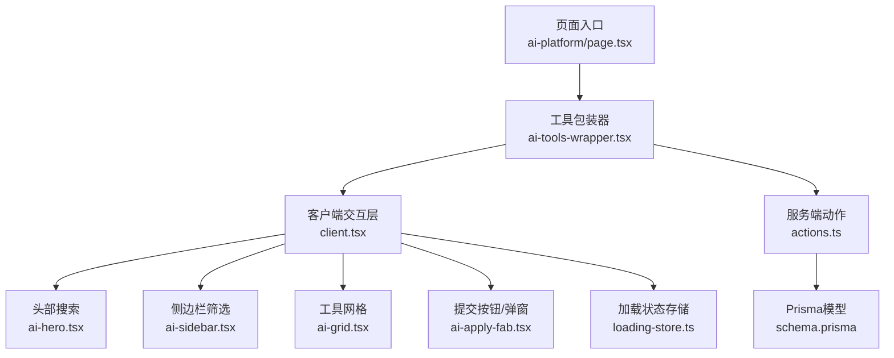
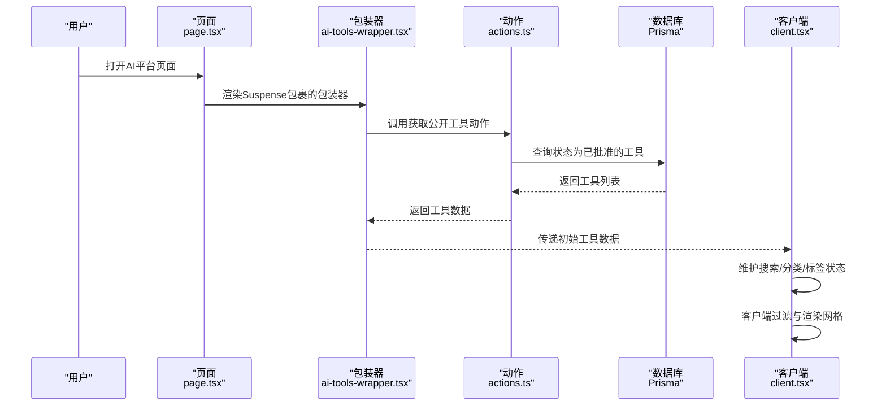
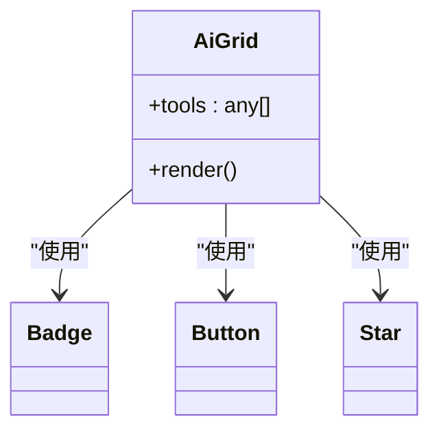
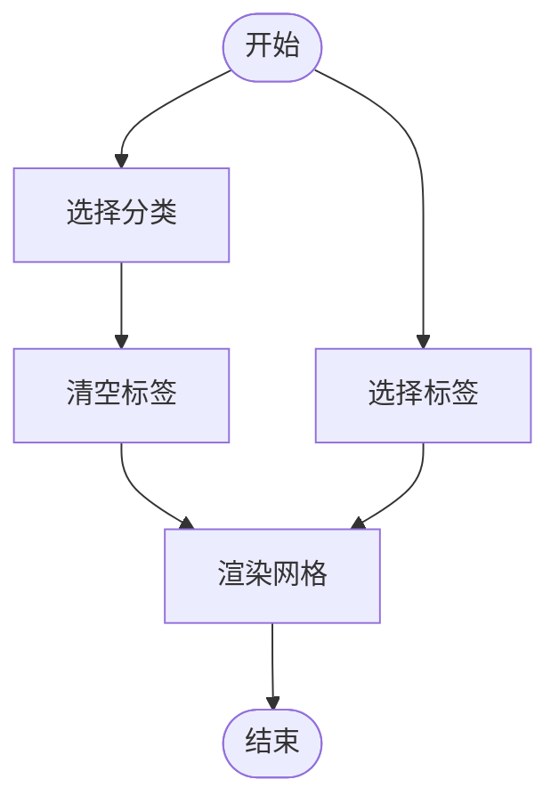
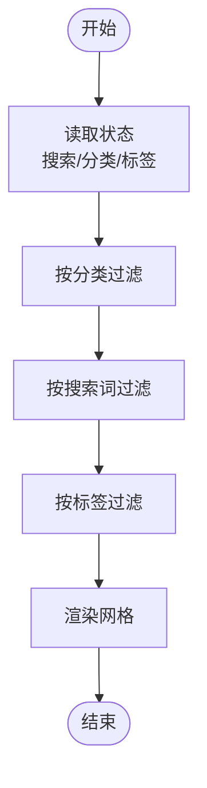
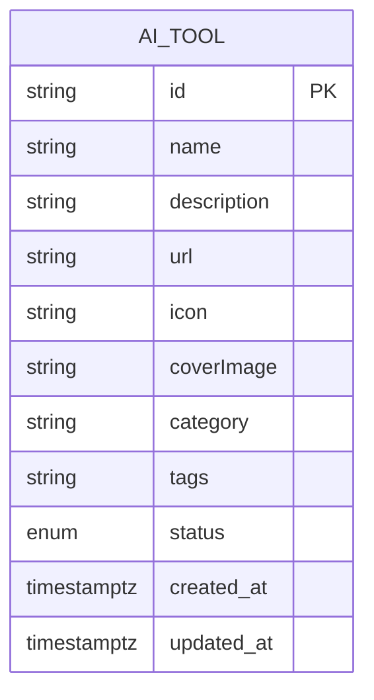
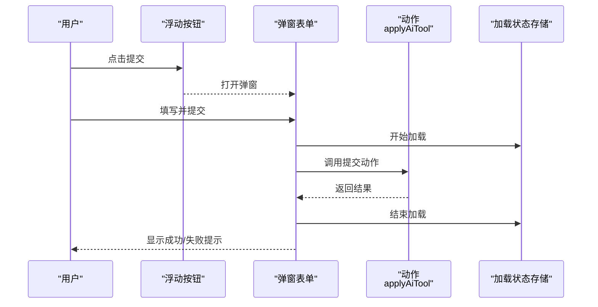
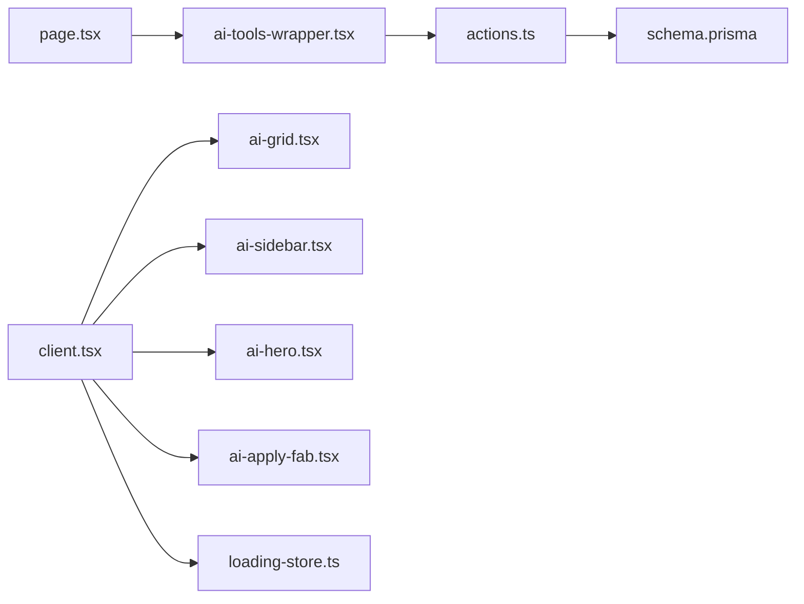

# 工具展示系统

<cite>
**本文引用的文件**
- [src/app/(site)/ai-platform/page.tsx](file://src/app/(site)/ai-platform/page.tsx)
- [src/app/(site)/ai-platform/components/ai-tools-wrapper.tsx](file://src/app/(site)/ai-platform/components/ai-tools-wrapper.tsx)
- [src/app/(site)/ai-platform/client.tsx](file://src/app/(site)/ai-platform/client.tsx)
- [src/app/(site)/ai-platform/components/ai-grid.tsx](file://src/app/(site)/ai-platform/components/ai-grid.tsx)
- [src/app/(site)/ai-platform/components/ai-hero.tsx](file://src/app/(site)/ai-platform/components/ai-hero.tsx)
- [src/app/(site)/ai-platform/components/ai-sidebar.tsx](file://src/app/(site)/ai-platform/components/ai-sidebar.tsx)
- [src/app/(site)/ai-platform/components/ai-apply-fab.tsx](file://src/app/(site)/ai-platform/components/ai-apply-fab.tsx)
- [src/app/(site)/ai-platform/actions.ts](file://src/app/(site)/ai-platform/actions.ts)
- [prisma/schema.prisma](file://prisma/schema.prisma)
- [src/app/dashboard/ai-tools/actions.ts](file://src/app/dashboard/ai-tools/actions.ts)
- [src/app/dashboard/ai-tools/components/ai-tool-list.tsx](file://src/app/dashboard/ai-tools/components/ai-tool-list.tsx)
- [src/store/loading-store.ts](file://src/store/loading-store.ts)
</cite>

## 目录
1. [简介](#简介)
2. [项目结构](#项目结构)
3. [核心组件](#核心组件)
4. [架构总览](#架构总览)
5. [组件详解](#组件详解)
6. [依赖关系分析](#依赖关系分析)
7. [性能优化策略](#性能优化策略)
8. [故障排查指南](#故障排查指南)
9. [结论](#结论)
10. [附录](#附录)

## 简介
本文件面向“AI工具展示系统”的前端实现，聚焦于工具列表展示、筛选与分类、详情页承载能力、状态管理与状态显示、性能优化（懒加载/虚拟滚动/图片优化）、以及SEO与元数据管理等主题。系统采用Next.js App Router模式，结合服务端数据获取与客户端交互，提供从首页到后台管理的完整工具生态。

## 项目结构
- 页面入口位于站点路由下的AI平台页面，采用Suspense骨架屏提升首屏体验。
- 展示层由“工具包装器”负责数据拉取与缓存，客户端组件负责交互与筛选。
- 工具卡片采用网格布局，支持响应式断点；侧边栏提供分类与热门标签筛选；顶部提供搜索框。
- 后台管理提供工具状态变更与再校验，确保公共展示数据一致性。

图表来源
- [src/app/(site)/ai-platform/page.tsx](file://src/app/(site)/ai-platform/page.tsx#L1-L22)
- [src/app/(site)/ai-platform/components/ai-tools-wrapper.tsx](file://src/app/(site)/ai-platform/components/ai-tools-wrapper.tsx#L1-L13)
- [src/app/(site)/ai-platform/client.tsx](file://src/app/(site)/ai-platform/client.tsx#L1-L80)
- [src/app/(site)/ai-platform/components/ai-hero.tsx](file://src/app/(site)/ai-platform/components/ai-hero.tsx#L1-L62)
- [src/app/(site)/ai-platform/components/ai-sidebar.tsx](file://src/app/(site)/ai-platform/components/ai-sidebar.tsx#L1-L77)
- [src/app/(site)/ai-platform/components/ai-grid.tsx](file://src/app/(site)/ai-platform/components/ai-grid.tsx#L1-L76)
- [src/app/(site)/ai-platform/components/ai-apply-fab.tsx](file://src/app/(site)/ai-platform/components/ai-apply-fab.tsx#L1-L230)
- [src/app/(site)/ai-platform/actions.ts](file://src/app/(site)/ai-platform/actions.ts#L1-L58)
- [prisma/schema.prisma:184-198](file://prisma/schema.prisma#L184-L198)
- [src/store/loading-store.ts](file://src/store/loading-store.ts)

章节来源
- [src/app/(site)/ai-platform/page.tsx](file://src/app/(site)/ai-platform/page.tsx#L1-L22)
- [src/app/(site)/ai-platform/components/ai-tools-wrapper.tsx](file://src/app/(site)/ai-platform/components/ai-tools-wrapper.tsx#L1-L13)

## 核心组件
- 页面骨架与预取
  - 使用Suspense与Skeleton提供首屏骨架屏，避免空白等待。
  - revalidate配置用于控制静态生成缓存刷新周期。
- 工具包装器
  - 使用React缓存封装数据获取，避免重复查询，提升SSR/ISR性能。
- 客户端交互层
  - 维护搜索词、分类、标签三要素状态，执行客户端过滤逻辑。
- 工具网格
  - 响应式网格布局，支持空态提示；卡片包含图标/评分/分类/标签/描述/访问按钮。
- 侧边栏筛选
  - 分类筛选与热门标签筛选，支持一键清空标签。
- 头部搜索
  - 集成搜索输入与清空按钮，配合客户端过滤。
- 提交按钮与表单
  - 固定悬浮按钮触发提交弹窗，内置表单校验与加载状态管理。

章节来源
- [src/app/(site)/ai-platform/page.tsx](file://src/app/(site)/ai-platform/page.tsx#L1-L22)
- [src/app/(site)/ai-platform/components/ai-tools-wrapper.tsx](file://src/app/(site)/ai-platform/components/ai-tools-wrapper.tsx#L1-L13)
- [src/app/(site)/ai-platform/client.tsx](file://src/app/(site)/ai-platform/client.tsx#L1-L80)
- [src/app/(site)/ai-platform/components/ai-grid.tsx](file://src/app/(site)/ai-platform/components/ai-grid.tsx#L1-L76)
- [src/app/(site)/ai-platform/components/ai-hero.tsx](file://src/app/(site)/ai-platform/components/ai-hero.tsx#L1-L62)
- [src/app/(site)/ai-platform/components/ai-sidebar.tsx](file://src/app/(site)/ai-platform/components/ai-sidebar.tsx#L1-L77)
- [src/app/(site)/ai-platform/components/ai-apply-fab.tsx](file://src/app/(site)/ai-platform/components/ai-apply-fab.tsx#L1-L230)

## 架构总览
系统采用“服务端数据获取 + 客户端交互”的混合架构：
- 服务端动作负责从数据库筛选工具，返回公共展示所需字段。
- 客户端组件负责UI交互、状态管理与二次过滤。
- 后台管理动作负责工具状态变更与路径再验证，确保公共展示同步更新。

图表来源
- [src/app/(site)/ai-platform/page.tsx](file://src/app/(site)/ai-platform/page.tsx#L1-L22)
- [src/app/(site)/ai-platform/components/ai-tools-wrapper.tsx](file://src/app/(site)/ai-platform/components/ai-tools-wrapper.tsx#L1-L13)
- [src/app/(site)/ai-platform/actions.ts](file://src/app/(site)/ai-platform/actions.ts#L29-L57)
- [prisma/schema.prisma:184-198](file://prisma/schema.prisma#L184-L198)
- [src/app/(site)/ai-platform/client.tsx](file://src/app/(site)/ai-platform/client.tsx#L13-L80)

## 组件详解

### 工具网格组件（AiGrid）
- 功能要点
  - 空态提示：当工具为空时显示友好提示。
  - 响应式网格：移动端1列，中等屏2列，大屏3列，间距统一。
  - 卡片内容：图标/标题/评分/分类徽标/标签/描述/外部访问按钮。
  - 图标回退：无图标时以首字母占位。
- 设计细节
  - 悬停高亮边框与颜色过渡，增强交互反馈。
  - 描述文本截断，避免高度溢出。
- 性能建议
  - 对长列表可考虑虚拟滚动或分页。
  - 图片懒加载与尺寸优化。

图表来源
- [src/app/(site)/ai-platform/components/ai-grid.tsx](file://src/app/(site)/ai-platform/components/ai-grid.tsx#L1-L76)

章节来源
- [src/app/(site)/ai-platform/components/ai-grid.tsx](file://src/app/(site)/ai-platform/components/ai-grid.tsx#L1-L76)

### 侧边栏筛选组件（AiSidebar）
- 功能要点
  - 分类筛选：提供固定分类集合，支持一键切换。
  - 热门标签：提供一组热门标签，支持多选/取消。
  - 交互样式：当前选中项高亮，未选中项悬停变色。
- 状态联动
  - 切换分类时自动清空标签，避免冲突。
- 可扩展性
  - 分类与标签可通过常量数组扩展。

图表来源
- [src/app/(site)/ai-platform/components/ai-sidebar.tsx](file://src/app/(site)/ai-platform/components/ai-sidebar.tsx#L1-L77)

章节来源
- [src/app/(site)/ai-platform/components/ai-sidebar.tsx](file://src/app/(site)/ai-platform/components/ai-sidebar.tsx#L1-L77)

### 头部搜索组件（AiHero）
- 功能要点
  - 集成搜索输入与清空按钮，支持实时输入。
  - 骨架屏与动画增强首屏体验。
- 交互细节
  - 输入存在时显示清空按钮，点击清空输入。
  - 输入框样式与焦点态强调。

章节来源
- [src/app/(site)/ai-platform/components/ai-hero.tsx](file://src/app/(site)/ai-platform/components/ai-hero.tsx#L1-L62)

### 客户端交互层（AiPlatformClient）
- 状态管理
  - 维护搜索词、选中分类、选中标签。
- 过滤逻辑
  - 顺序过滤：先按分类，再按搜索词（名称/描述/标签），最后按标签。
  - 搜索词大小写不敏感，标签精确包含匹配。
- 渲染
  - 顶部标题显示当前分类与数量统计。
  - 将过滤后的工具列表传递给网格组件。

图表来源
- [src/app/(site)/ai-platform/client.tsx](file://src/app/(site)/ai-platform/client.tsx#L13-L80)

章节来源
- [src/app/(site)/ai-platform/client.tsx](file://src/app/(site)/ai-platform/client.tsx#L1-L80)

### 工具包装器与数据获取（AiToolsWrapper + actions）
- 包装器职责
  - 使用React缓存封装数据获取，避免重复查询。
  - 将工具数据传递给客户端组件。
- 服务端动作
  - 获取公开工具：仅返回状态为“已批准”的工具。
  - 支持按分类、搜索词、标签进行条件过滤。
  - 默认按创建时间倒序排列。
- 数据模型
  - 工具实体包含名称、描述、链接、图标、封面图、分类、标签、状态等字段。

图表来源
- [prisma/schema.prisma:184-198](file://prisma/schema.prisma#L184-L198)

章节来源
- [src/app/(site)/ai-platform/components/ai-tools-wrapper.tsx](file://src/app/(site)/ai-platform/components/ai-tools-wrapper.tsx#L1-L13)
- [src/app/(site)/ai-platform/actions.ts](file://src/app/(site)/ai-platform/actions.ts#L29-L57)
- [prisma/schema.prisma:184-198](file://prisma/schema.prisma#L184-L198)

### 提交工具弹窗（AiApplyFab）
- 表单字段
  - 名称、链接、描述、图标、封面图、分类、标签。
- 校验与提交
  - 使用Zod与react-hook-form进行表单校验。
  - 提交后调用服务端动作，重置表单并提示结果。
- 加载状态
  - 使用全局加载状态存储控制提交过程中的加载指示。

图表来源
- [src/app/(site)/ai-platform/components/ai-apply-fab.tsx](file://src/app/(site)/ai-platform/components/ai-apply-fab.tsx#L53-L230)
- [src/app/(site)/ai-platform/actions.ts](file://src/app/(site)/ai-platform/actions.ts#L16-L27)
- [src/store/loading-store.ts](file://src/store/loading-store.ts)

章节来源
- [src/app/(site)/ai-platform/components/ai-apply-fab.tsx](file://src/app/(site)/ai-platform/components/ai-apply-fab.tsx#L1-L230)
- [src/app/(site)/ai-platform/actions.ts](file://src/app/(site)/ai-platform/actions.ts#L1-L58)
- [src/store/loading-store.ts](file://src/store/loading-store.ts)

### 后台状态管理与再校验
- 后台动作
  - 提供获取、创建、更新、删除、审批等操作。
  - 每次变更后对后台与公共展示路径进行再校验，确保数据一致性。
- 列表展示
  - 根据状态渲染不同徽标与操作按钮（如通过/拒绝）。

章节来源
- [src/app/dashboard/ai-tools/actions.ts:66-131](file://src/app/dashboard/ai-tools/actions.ts#L66-L131)
- [src/app/dashboard/ai-tools/components/ai-tool-list.tsx:186-215](file://src/app/dashboard/ai-tools/components/ai-tool-list.tsx#L186-L215)

## 依赖关系分析
- 组件耦合
  - 页面依赖包装器；包装器依赖动作；客户端依赖包装器提供的初始数据。
  - 筛选组件与网格组件通过状态共享实现解耦。
- 外部依赖
  - UI组件来自共享的UI库（按钮、输入框、徽标等）。
  - 动画与过渡依赖Framer Motion与Tailwind类名组合。
- 数据依赖
  - 工具数据来源于Prisma模型，状态字段用于区分展示范围。

图表来源
- [src/app/(site)/ai-platform/page.tsx](file://src/app/(site)/ai-platform/page.tsx#L1-L22)
- [src/app/(site)/ai-platform/components/ai-tools-wrapper.tsx](file://src/app/(site)/ai-platform/components/ai-tools-wrapper.tsx#L1-L13)
- [src/app/(site)/ai-platform/client.tsx](file://src/app/(site)/ai-platform/client.tsx#L1-L80)
- [src/app/(site)/ai-platform/components/ai-grid.tsx](file://src/app/(site)/ai-platform/components/ai-grid.tsx#L1-L76)
- [src/app/(site)/ai-platform/components/ai-hero.tsx](file://src/app/(site)/ai-platform/components/ai-hero.tsx#L1-L62)
- [src/app/(site)/ai-platform/components/ai-sidebar.tsx](file://src/app/(site)/ai-platform/components/ai-sidebar.tsx#L1-L77)
- [src/app/(site)/ai-platform/components/ai-apply-fab.tsx](file://src/app/(site)/ai-platform/components/ai-apply-fab.tsx#L1-L230)
- [src/app/(site)/ai-platform/actions.ts](file://src/app/(site)/ai-platform/actions.ts#L1-L58)
- [prisma/schema.prisma:184-198](file://prisma/schema.prisma#L184-L198)
- [src/store/loading-store.ts](file://src/store/loading-store.ts)

章节来源
- [src/app/(site)/ai-platform/page.tsx](file://src/app/(site)/ai-platform/page.tsx#L1-L22)
- [src/app/(site)/ai-platform/components/ai-tools-wrapper.tsx](file://src/app/(site)/ai-platform/components/ai-tools-wrapper.tsx#L1-L13)
- [src/app/(site)/ai-platform/client.tsx](file://src/app/(site)/ai-platform/client.tsx#L1-L80)
- [src/app/(site)/ai-platform/actions.ts](file://src/app/(site)/ai-platform/actions.ts#L1-L58)
- [prisma/schema.prisma:184-198](file://prisma/schema.prisma#L184-L198)

## 性能优化策略
- 懒加载与骨架屏
  - 页面使用Suspense与Skeleton，缩短首屏空白时间，改善感知性能。
- 数据缓存
  - 使用React缓存封装数据获取，避免重复查询，降低数据库压力。
- 客户端过滤
  - 在客户端进行二次过滤，减少服务端复杂度；对于大数据集建议服务端分页或虚拟滚动。
- 图片优化
  - 卡片内图片建议使用现代格式与合适的尺寸，启用懒加载与占位符。
- 响应式与布局
  - 网格布局按断点自适应，减少DOM层级与重排成本。
- 提交流程
  - 表单提交期间使用加载状态存储，避免重复提交与闪烁。

章节来源
- [src/app/(site)/ai-platform/page.tsx](file://src/app/(site)/ai-platform/page.tsx#L1-L22)
- [src/app/(site)/ai-platform/components/ai-tools-wrapper.tsx](file://src/app/(site)/ai-platform/components/ai-tools-wrapper.tsx#L1-L13)
- [src/app/(site)/ai-platform/client.tsx](file://src/app/(site)/ai-platform/client.tsx#L1-L80)
- [src/app/(site)/ai-platform/components/ai-grid.tsx](file://src/app/(site)/ai-platform/components/ai-grid.tsx#L1-L76)
- [src/app/(site)/ai-platform/components/ai-apply-fab.tsx](file://src/app/(site)/ai-platform/components/ai-apply-fab.tsx#L1-L230)
- [src/store/loading-store.ts](file://src/store/loading-store.ts)

## 故障排查指南
- 工具未显示
  - 检查工具状态是否为“已批准”，仅该状态会出现在公共展示。
  - 确认筛选条件（分类/标签/搜索词）是否过于严格。
- 提交失败
  - 查看表单校验错误信息，确认必填字段与URL格式。
  - 观察加载状态是否正确关闭，避免误以为提交失败。
- 数据未更新
  - 后台修改后需等待再校验生效，或手动触发相关路径再校验。
- 性能问题
  - 大列表建议引入虚拟滚动或分页；检查图片是否过大或未懒加载。

章节来源
- [src/app/(site)/ai-platform/actions.ts](file://src/app/(site)/ai-platform/actions.ts#L29-L57)
- [src/app/(site)/ai-platform/components/ai-apply-fab.tsx](file://src/app/(site)/ai-platform/components/ai-apply-fab.tsx#L70-L82)
- [src/app/dashboard/ai-tools/actions.ts:121-131](file://src/app/dashboard/ai-tools/actions.ts#L121-L131)

## 结论
该系统通过清晰的分层设计实现了高效、可扩展的工具展示：服务端负责数据筛选与缓存，客户端负责交互与二次过滤，后台提供状态管理与再校验。在性能方面，骨架屏与缓存提升了用户体验；在可维护性方面，模块化组件与明确的数据模型便于扩展与演进。后续可在大数据场景下引入虚拟滚动与分页，进一步优化长列表性能。

## 附录
- SEO与元数据建议
  - 页面标题与描述：在页面层设置动态标题与meta描述，结合工具分类与搜索词。
  - 结构化数据：可为工具卡片添加微格式或JSON-LD，提升搜索引擎识别。
  - 链接与导航：保持面包屑与内部链接清晰，便于爬虫抓取。
- 状态字段参考
  - 工具状态枚举：待审核、已批准、已拒绝（公共展示仅显示已批准）。
  - 后台状态：除公共状态外，还可包含调试、更新、维护等内部状态。

章节来源
- [prisma/schema.prisma:184-198](file://prisma/schema.prisma#L184-L198)
- [src/app/dashboard/ai-tools/actions.ts:66-131](file://src/app/dashboard/ai-tools/actions.ts#L66-L131)