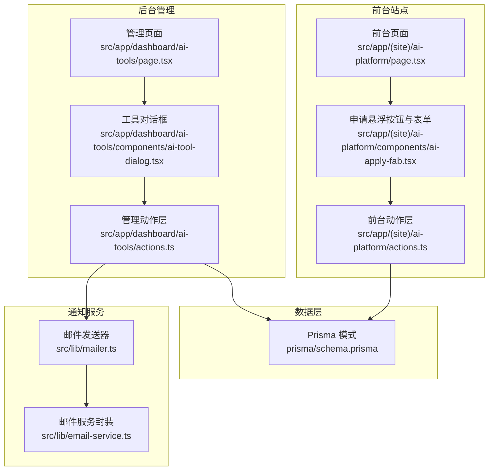
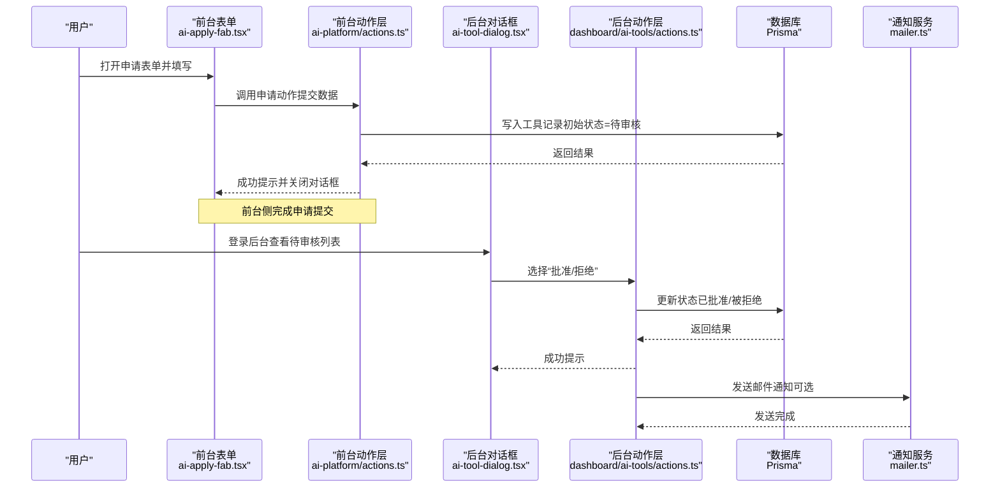
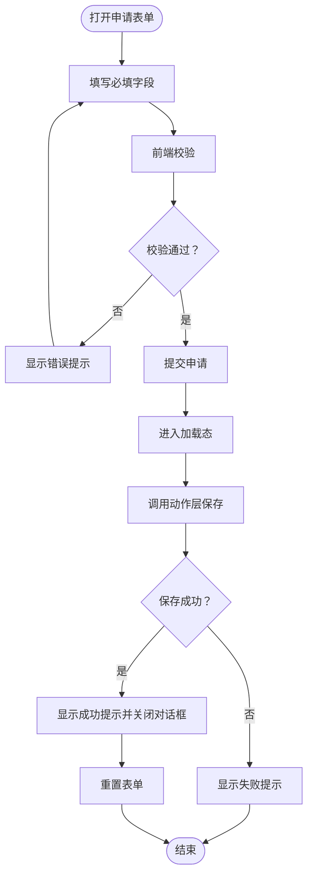
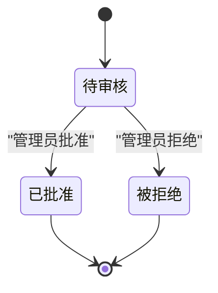
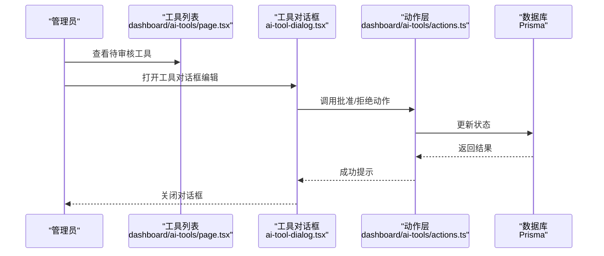
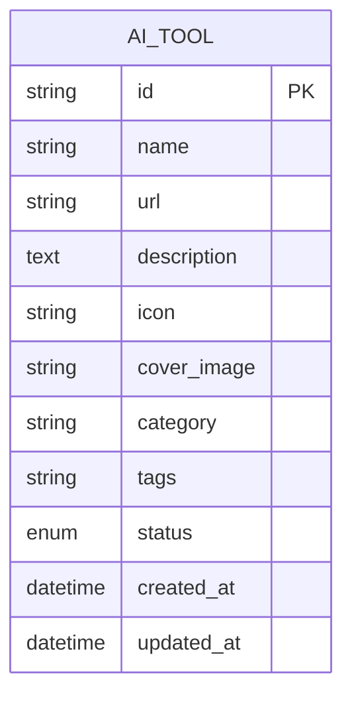
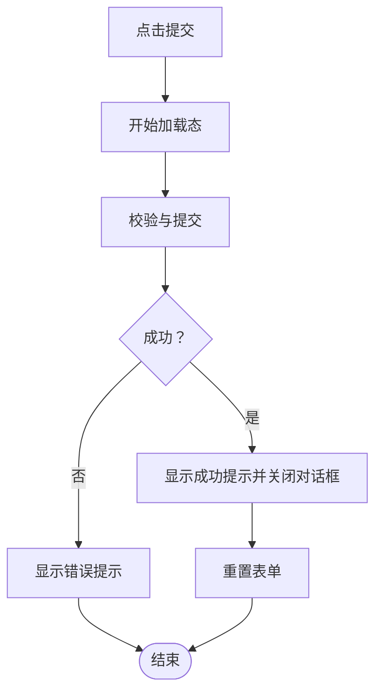
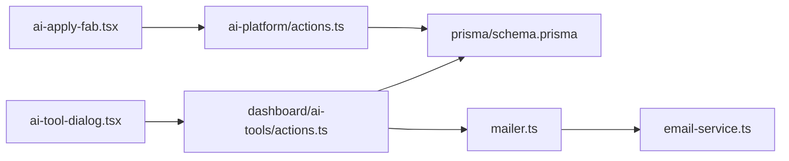

# 工具申请审核

<cite>
**本文引用的文件**
- [ai-apply-fab.tsx](file://src/app/(site)/ai-platform/components/ai-apply-fab.tsx)
- [ai-tool-dialog.tsx](file://src/app/dashboard/ai-tools/components/ai-tool-dialog.tsx)
- [actions.ts](file://src/app/(site)/ai-platform/actions.ts)
- [actions.ts](file://src/app/dashboard/ai-tools/actions.ts)
- [schema.ts](file://src/app/dashboard/ai-tools/schema.ts)
- [page.tsx](file://src/app/(site)/ai-platform/page.tsx)
- [page.tsx](file://src/app/dashboard/ai-tools/page.tsx)
- [prisma/schema.prisma](file://prisma/schema.prisma)
- [mailer.ts](file://src/lib/mailer.ts)
- [email-service.ts](file://src/lib/email-service.ts)
- [loading-store.ts](file://src/store/loading-store.ts)
- [sonner.tsx](file://src/components/ui/sonner.tsx)
- [button.tsx](file://src/components/ui/button.tsx)
- [form.tsx](file://src/components/ui/form.tsx)
- [input.tsx](file://src/components/ui/input.tsx)
- [dialog.tsx](file://src/components/ui/dialog.tsx)
- [table.tsx](file://src/components/ui/table.tsx)
- [select.tsx](file://src/components/ui/select.tsx)
- [zod.ts](file://src/lib/zod.ts)
</cite>

## 目录
1. [简介](#简介)
2. [项目结构](#项目结构)
3. [核心组件](#核心组件)
4. [架构总览](#架构总览)
5. [详细组件分析](#详细组件分析)
6. [依赖关系分析](#依赖关系分析)
7. [性能考虑](#性能考虑)
8. [故障排除指南](#故障排除指南)
9. [结论](#结论)
10. [附录](#附录)

## 简介
本文件为“AI工具申请审核”流程的综合技术文档，覆盖从用户侧申请表单到管理员审核与发布全链路。内容包括：
- 用户申请表单设计（字段、校验、提交）
- 申请状态管理（待审核、已批准、被拒绝）与流转
- 管理员审核界面（列表、批量操作、审批动作、通知）
- 数据存储与查询优化（Prisma 模式、缓存与失效策略）
- 用户体验设计（进度提示、错误处理、成功反馈）
- 安全与隐私保护（输入校验、最小权限、敏感信息处理）

## 项目结构
该系统采用 Next.js App Router 架构，按功能域划分目录：
- 前台站点：`src/app/(site)/ai-platform` 提供工具展示与申请入口
- 后台管理：`src/app/dashboard/ai-tools` 提供工具管理与审核界面
- 表单与校验：`src/app/dashboard/ai-tools/schema.ts` 定义字段与规则
- 动作层：`src/app/(site)/ai-platform/actions.ts` 与 `src/app/dashboard/ai-tools/actions.ts` 实现业务逻辑
- 数据模型：`prisma/schema.prisma` 定义数据库结构
- 通知服务：`src/lib/mailer.ts` 与 `src/lib/email-service.ts` 提供邮件通知能力
- UI 组件：`src/components/ui/*` 提供通用表单、对话框、表格等组件

**图表来源**
- [page.tsx](file://src/app/(site)/ai-platform/page.tsx#L1-L200)
- [ai-apply-fab.tsx](file://src/app/(site)/ai-platform/components/ai-apply-fab.tsx#L1-L120)
- [actions.ts](file://src/app/(site)/ai-platform/actions.ts#L1-L200)
- [page.tsx:1-200](file://src/app/dashboard/ai-tools/page.tsx#L1-L200)
- [ai-tool-dialog.tsx:1-200](file://src/app/dashboard/ai-tools/components/ai-tool-dialog.tsx#L1-L200)
- [actions.ts:1-200](file://src/app/dashboard/ai-tools/actions.ts#L1-L200)
- [prisma/schema.prisma:1-300](file://prisma/schema.prisma#L1-L300)
- [mailer.ts:1-200](file://src/lib/mailer.ts#L1-L200)
- [email-service.ts:1-200](file://src/lib/email-service.ts#L1-L200)

**章节来源**
- [page.tsx](file://src/app/(site)/ai-platform/page.tsx#L1-L200)
- [ai-apply-fab.tsx](file://src/app/(site)/ai-platform/components/ai-apply-fab.tsx#L1-L120)
- [actions.ts](file://src/app/(site)/ai-platform/actions.ts#L1-L200)
- [page.tsx:1-200](file://src/app/dashboard/ai-tools/page.tsx#L1-L200)
- [ai-tool-dialog.tsx:1-200](file://src/app/dashboard/ai-tools/components/ai-tool-dialog.tsx#L1-L200)
- [actions.ts:1-200](file://src/app/dashboard/ai-tools/actions.ts#L1-L200)
- [prisma/schema.prisma:1-300](file://prisma/schema.prisma#L1-L300)
- [mailer.ts:1-200](file://src/lib/mailer.ts#L1-L200)
- [email-service.ts:1-200](file://src/lib/email-service.ts#L1-L200)

## 核心组件
- 申请表单组件（前台）：提供悬浮按钮触发申请对话框，内置字段与校验，提交后反馈与重置
- 管理端工具对话框：支持新增/编辑工具，含状态字段默认值与提交逻辑
- 动作层（Server Actions）：封装数据库写入、状态变更、缓存失效与路径重建
- 数据模型：定义工具实体与状态枚举，确保一致性
- 通知服务：在状态变更时发送邮件通知

**章节来源**
- [ai-apply-fab.tsx](file://src/app/(site)/ai-platform/components/ai-apply-fab.tsx#L49-L95)
- [ai-tool-dialog.tsx:47-137](file://src/app/dashboard/ai-tools/components/ai-tool-dialog.tsx#L47-L137)
- [actions.ts:80-143](file://src/app/dashboard/ai-tools/actions.ts#L80-L143)
- [prisma/schema.prisma:1-300](file://prisma/schema.prisma#L1-L300)

## 架构总览
申请与审核流程分为“前台申请—后台审核—前台展示—通知反馈”四个阶段，通过 Server Actions 连接 UI 与数据库，配合缓存标签与路径重建实现响应式更新。

**图表来源**
- [ai-apply-fab.tsx](file://src/app/(site)/ai-platform/components/ai-apply-fab.tsx#L70-L82)
- [actions.ts](file://src/app/(site)/ai-platform/actions.ts#L1-L200)
- [ai-tool-dialog.tsx:90-106](file://src/app/dashboard/ai-tools/components/ai-tool-dialog.tsx#L90-L106)
- [actions.ts:121-143](file://src/app/dashboard/ai-tools/actions.ts#L121-L143)
- [prisma/schema.prisma:1-300](file://prisma/schema.prisma#L1-L300)
- [mailer.ts:1-200](file://src/lib/mailer.ts#L1-L200)

## 详细组件分析

### 用户申请表单设计
- 字段与布局：名称、URL、描述、图标、封面图、分类、标签等，使用表单控件与消息提示
- 校验规则：基于模式定义进行前端即时校验，提交前二次校验
- 提交流程：加载态、提交、成功/失败提示、表单重置、关闭对话框
- 触发方式：悬浮按钮打开对话框，点击提交触发动作层

**图表来源**
- [ai-apply-fab.tsx](file://src/app/(site)/ai-platform/components/ai-apply-fab.tsx#L57-L82)
- [form.tsx:1-200](file://src/components/ui/form.tsx#L1-L200)
- [input.tsx:1-200](file://src/components/ui/input.tsx#L1-L200)
- [button.tsx:1-200](file://src/components/ui/button.tsx#L1-L200)

**章节来源**
- [ai-apply-fab.tsx](file://src/app/(site)/ai-platform/components/ai-apply-fab.tsx#L49-L95)
- [form.tsx:1-200](file://src/components/ui/form.tsx#L1-L200)
- [input.tsx:1-200](file://src/components/ui/input.tsx#L1-L200)
- [button.tsx:1-200](file://src/components/ui/button.tsx#L1-L200)

### 申请状态管理机制
- 状态枚举：待审核（PENDING）、已批准（APPROVED）、被拒绝（REJECTED）
- 初始状态：前台申请提交时写入数据库的状态即为“待审核”
- 管理端变更：管理员可在后台将状态更新为“已批准”或“被拒绝”，并触发缓存与路径重建

**图表来源**
- [actions.ts:121-143](file://src/app/dashboard/ai-tools/actions.ts#L121-L143)
- [prisma/schema.prisma:1-300](file://prisma/schema.prisma#L1-L300)

**章节来源**
- [actions.ts:121-143](file://src/app/dashboard/ai-tools/actions.ts#L121-L143)
- [prisma/schema.prisma:1-300](file://prisma/schema.prisma#L1-L300)

### 管理员审核界面实现
- 列表展示：分页、筛选（状态、关键词），表格组件化
- 对话框交互：新增/编辑工具，设置默认状态、提交与回退
- 批量操作：支持多选与批量状态变更（示例中提供单条批准/拒绝）
- 审批流程：批准/拒绝动作调用动作层，更新数据库并重建缓存与路径
- 通知机制：状态变更后可触发邮件通知（需在动作层集成）

**图表来源**
- [page.tsx:1-200](file://src/app/dashboard/ai-tools/page.tsx#L1-L200)
- [ai-tool-dialog.tsx:90-106](file://src/app/dashboard/ai-tools/components/ai-tool-dialog.tsx#L90-L106)
- [actions.ts:121-143](file://src/app/dashboard/ai-tools/actions.ts#L121-L143)
- [table.tsx:1-200](file://src/components/ui/table.tsx#L1-L200)
- [select.tsx:1-200](file://src/components/ui/select.tsx#L1-L200)
- [dialog.tsx:1-200](file://src/components/ui/dialog.tsx#L1-L200)

**章节来源**
- [page.tsx:1-200](file://src/app/dashboard/ai-tools/page.tsx#L1-L200)
- [ai-tool-dialog.tsx:47-137](file://src/app/dashboard/ai-tools/components/ai-tool-dialog.tsx#L47-L137)
- [actions.ts:66-143](file://src/app/dashboard/ai-tools/actions.ts#L66-L143)
- [table.tsx:1-200](file://src/components/ui/table.tsx#L1-L200)
- [select.tsx:1-200](file://src/components/ui/select.tsx#L1-L200)
- [dialog.tsx:1-200](file://src/components/ui/dialog.tsx#L1-L200)

### 申请数据的存储与查询优化
- 数据模型：工具实体包含名称、URL、描述、图标、封面图、分类、标签、状态等字段
- 查询接口：动作层提供分页、筛选（状态、关键词）的查询函数，返回缓存包装后的结果
- 缓存与失效：每次写入/更新后通过标签与路径重建触发缓存失效，保证前后台数据一致
- 性能建议：对常用筛选条件建立索引；对列表查询限制每页大小；对状态字段建立独立索引以加速过滤

**图表来源**
- [prisma/schema.prisma:1-300](file://prisma/schema.prisma#L1-L300)

**章节来源**
- [prisma/schema.prisma:1-300](file://prisma/schema.prisma#L1-L300)
- [actions.ts](file://src/app/(site)/ai-platform/actions.ts#L66-L143)
- [actions.ts:66-78](file://src/app/dashboard/ai-tools/actions.ts#L66-L78)

### 用户体验设计
- 进度指示：全局加载状态管理，提交期间显示加载态，避免重复提交
- 错误处理：统一使用提示组件展示错误信息，失败时保留用户输入以便修正
- 成功反馈：提交成功后自动关闭对话框并清空表单，提升操作闭环感
- 可访问性：表单控件具备标签与错误消息，键盘可导航，语义化结构

**图表来源**
- [loading-store.ts:1-200](file://src/store/loading-store.ts#L1-L200)
- [sonner.tsx:1-200](file://src/components/ui/sonner.tsx#L1-L200)
- [ai-apply-fab.tsx](file://src/app/(site)/ai-platform/components/ai-apply-fab.tsx#L70-L82)

**章节来源**
- [loading-store.ts:1-200](file://src/store/loading-store.ts#L1-L200)
- [sonner.tsx:1-200](file://src/components/ui/sonner.tsx#L1-L200)
- [ai-apply-fab.tsx](file://src/app/(site)/ai-platform/components/ai-apply-fab.tsx#L70-L82)

### 安全性与隐私保护
- 输入校验：前后端均进行字段校验，防止非法数据入库
- 最小权限：仅授权管理员访问后台审核界面与工具管理
- 敏感信息：不展示或记录不必要的个人隐私字段；如需记录联系信息，应遵循最小必要原则
- 传输安全：生产环境启用 HTTPS，Cookie 使用安全属性
- 审计追踪：状态变更与关键操作建议记录日志，便于审计

**章节来源**
- [schema.ts:1-200](file://src/app/dashboard/ai-tools/schema.ts#L1-L200)
- [zod.ts:1-200](file://src/lib/zod.ts#L1-L200)
- [mailer.ts:1-200](file://src/lib/mailer.ts#L1-L200)

## 依赖关系分析
- 组件依赖：前台表单依赖动作层与 UI 组件；后台对话框依赖动作层与表格组件
- 动作层依赖：Prisma 数据库与缓存失效策略；通知服务用于状态变更通知
- 外部依赖：邮件服务封装与第三方 SMTP 配置

**图表来源**
- [ai-apply-fab.tsx](file://src/app/(site)/ai-platform/components/ai-apply-fab.tsx#L1-L120)
- [ai-tool-dialog.tsx:1-200](file://src/app/dashboard/ai-tools/components/ai-tool-dialog.tsx#L1-L200)
- [actions.ts](file://src/app/(site)/ai-platform/actions.ts#L1-L200)
- [actions.ts:1-200](file://src/app/dashboard/ai-tools/actions.ts#L1-L200)
- [prisma/schema.prisma:1-300](file://prisma/schema.prisma#L1-L300)
- [mailer.ts:1-200](file://src/lib/mailer.ts#L1-L200)
- [email-service.ts:1-200](file://src/lib/email-service.ts#L1-L200)

**章节来源**
- [ai-apply-fab.tsx](file://src/app/(site)/ai-platform/components/ai-apply-fab.tsx#L1-L120)
- [ai-tool-dialog.tsx:1-200](file://src/app/dashboard/ai-tools/components/ai-tool-dialog.tsx#L1-L200)
- [actions.ts](file://src/app/(site)/ai-platform/actions.ts#L1-L200)
- [actions.ts:1-200](file://src/app/dashboard/ai-tools/actions.ts#L1-L200)
- [prisma/schema.prisma:1-300](file://prisma/schema.prisma#L1-L300)
- [mailer.ts:1-200](file://src/lib/mailer.ts#L1-L200)
- [email-service.ts:1-200](file://src/lib/email-service.ts#L1-L200)

## 性能考虑
- 查询优化：对状态与关键词建立索引；限制分页大小；避免 N+1 查询
- 缓存策略：使用标签与路径重建触发缓存失效，减少重复渲染
- 并发控制：提交按钮禁用与加载态避免重复提交导致的并发问题
- 图片资源：图标与封面图建议使用 CDN 与懒加载，降低首屏压力

## 故障排除指南
- 表单提交失败：检查网络连接与后端日志；确认动作层返回的错误信息是否包含具体原因
- 状态未更新：确认动作层是否正确执行数据库更新与缓存失效；检查路径重建是否生效
- 通知未送达：检查邮件服务配置与凭据；验证收件人邮箱格式
- 加载态异常：确认加载状态管理是否在 finally 中关闭；避免阻塞 UI

**章节来源**
- [ai-apply-fab.tsx](file://src/app/(site)/ai-platform/components/ai-apply-fab.tsx#L77-L81)
- [actions.ts:121-143](file://src/app/dashboard/ai-tools/actions.ts#L121-L143)
- [mailer.ts:1-200](file://src/lib/mailer.ts#L1-L200)

## 结论
本系统通过清晰的前台申请与后台审核职责分离，结合严格的表单校验、状态机管理与缓存失效策略，实现了高效稳定的工具申请审核流程。建议后续增强批量操作与更细粒度的通知策略，并持续优化查询性能与用户体验。

## 附录
- 关键文件清单与职责概览
  - 前台申请与展示：`src/app/(site)/ai-platform/*`
  - 后台管理与审核：`src/app/dashboard/ai-tools/*`
  - 数据模型与查询：`prisma/schema.prisma`
  - 动作层与缓存：`src/app/*/actions.ts`
  - 通知服务：`src/lib/mailer.ts`, `src/lib/email-service.ts`
  - UI 组件：`src/components/ui/*`
  - 全局状态与提示：`src/store/loading-store.ts`, `src/components/ui/sonner.tsx`