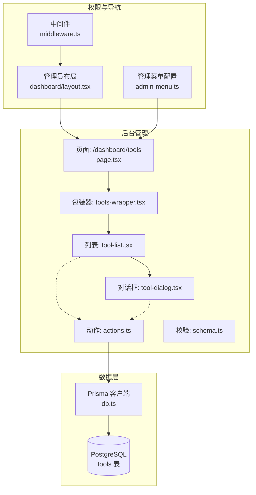
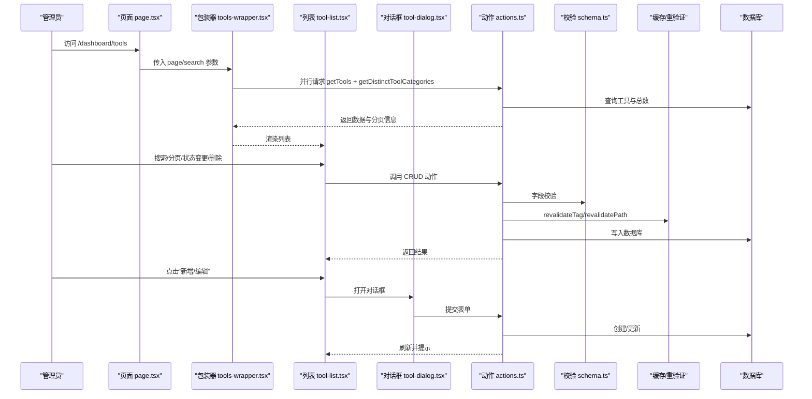
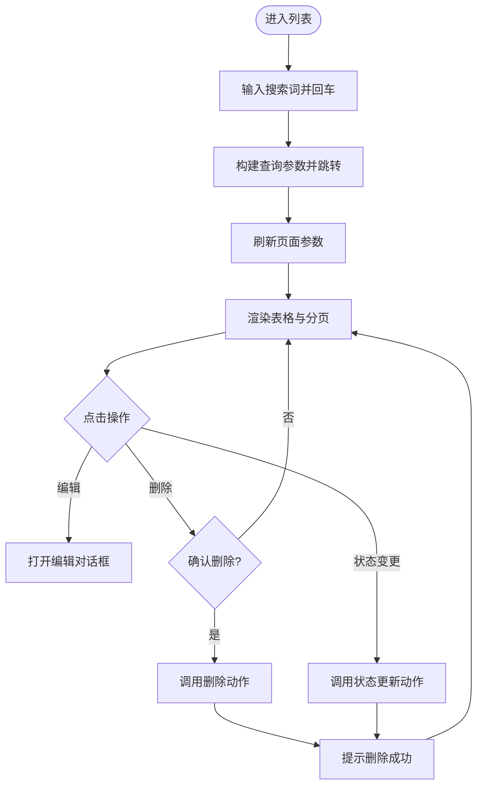
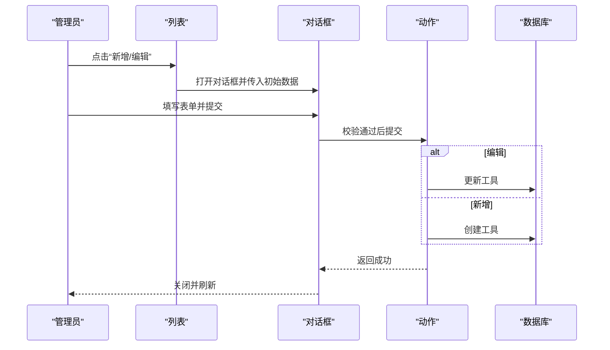
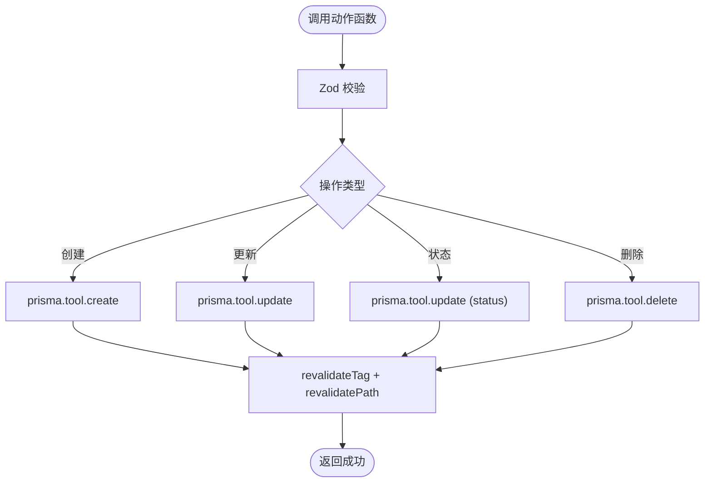
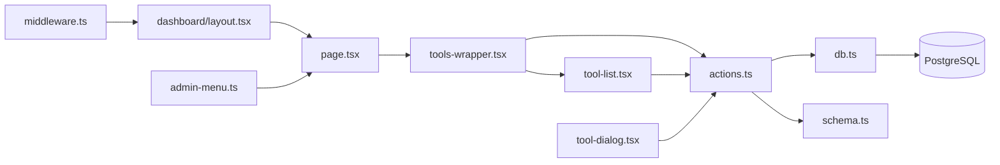

# 工具管理控制

<cite>
**本文引用的文件**
- [src/app/dashboard/tools/page.tsx](file://src/app/dashboard/tools/page.tsx)
- [src/app/dashboard/tools/actions.ts](file://src/app/dashboard/tools/actions.ts)
- [src/app/dashboard/tools/schema.ts](file://src/app/dashboard/tools/schema.ts)
- [src/app/dashboard/tools/components/tool-list.tsx](file://src/app/dashboard/tools/components/tool-list.tsx)
- [src/app/dashboard/tools/components/tool-dialog.tsx](file://src/app/dashboard/tools/components/tool-dialog.tsx)
- [src/app/dashboard/tools/components/tools-wrapper.tsx](file://src/app/dashboard/tools/components/tools-wrapper.tsx)
- [src/lib/db.ts](file://src/lib/db.ts)
- [prisma/schema.prisma](file://prisma/schema.prisma)
- [src/middleware.ts](file://src/middleware.ts)
- [src/app/dashboard/layout.tsx](file://src/app/dashboard/layout.tsx)
- [src/config/admin-menu.ts](file://src/config/admin-menu.ts)
- [src/app/(site)/tools/components/toolbox-client.tsx](file://src/app/(site)/tools/components/toolbox-client.tsx)
</cite>

## 目录
1. [引言](#引言)
2. [项目结构](#项目结构)
3. [核心组件](#核心组件)
4. [架构总览](#架构总览)
5. [详细组件分析](#详细组件分析)
6. [依赖关系分析](#依赖关系分析)
7. [性能考量](#性能考量)
8. [故障排查指南](#故障排查指南)
9. [结论](#结论)
10. [附录](#附录)

## 引言
本文件面向管理员与开发者，系统性阐述“工具管理控制”模块的设计与实现，覆盖工具列表展示、编辑表单、删除操作、信息维护（基本信息、状态切换、排序）、分类与标签机制、权限控制与访问限制、批量操作能力、数据验证与安全检查、以及审计日志与变更记录等主题。文档以仓库现有实现为基础，结合数据库模型与前端组件，提供从架构到细节的完整说明。

## 项目结构
工具管理控制位于后台管理子系统中，采用 Next.js App Router 的服务端渲染与客户端交互相结合的方式组织页面与组件。核心路径如下：
- 页面入口：/dashboard/tools
- 数据层：Prisma ORM + PostgreSQL
- 权限与访问控制：中间件 + 管理员布局校验
- 前端组件：工具列表、工具对话框、工具包装器

图表来源
- [src/app/dashboard/tools/page.tsx:1-33](file://src/app/dashboard/tools/page.tsx#L1-L33)
- [src/app/dashboard/tools/components/tools-wrapper.tsx:1-33](file://src/app/dashboard/tools/components/tools-wrapper.tsx#L1-L33)
- [src/app/dashboard/tools/components/tool-list.tsx:1-246](file://src/app/dashboard/tools/components/tool-list.tsx#L1-L246)
- [src/app/dashboard/tools/components/tool-dialog.tsx:1-268](file://src/app/dashboard/tools/components/tool-dialog.tsx#L1-L268)
- [src/app/dashboard/tools/actions.ts:1-143](file://src/app/dashboard/tools/actions.ts#L1-L143)
- [src/lib/db.ts:1-16](file://src/lib/db.ts#L1-L16)
- [src/middleware.ts:1-36](file://src/middleware.ts#L1-L36)
- [src/app/dashboard/layout.tsx:1-26](file://src/app/dashboard/layout.tsx#L1-L26)
- [src/config/admin-menu.ts:1-199](file://src/config/admin-menu.ts#L1-L199)

章节来源
- [src/app/dashboard/tools/page.tsx:1-33](file://src/app/dashboard/tools/page.tsx#L1-L33)
- [src/app/dashboard/tools/components/tools-wrapper.tsx:1-33](file://src/app/dashboard/tools/components/tools-wrapper.tsx#L1-L33)
- [src/app/dashboard/tools/components/tool-list.tsx:1-246](file://src/app/dashboard/tools/components/tool-list.tsx#L1-L246)
- [src/app/dashboard/tools/components/tool-dialog.tsx:1-268](file://src/app/dashboard/tools/components/tool-dialog.tsx#L1-L268)
- [src/app/dashboard/tools/actions.ts:1-143](file://src/app/dashboard/tools/actions.ts#L1-L143)
- [src/lib/db.ts:1-16](file://src/lib/db.ts#L1-L16)
- [src/middleware.ts:1-36](file://src/middleware.ts#L1-L36)
- [src/app/dashboard/layout.tsx:1-26](file://src/app/dashboard/layout.tsx#L1-L26)
- [src/config/admin-menu.ts:1-199](file://src/config/admin-menu.ts#L1-L199)

## 核心组件
- 页面组件：负责解析查询参数、分页与搜索，并渲染工具包装器。
- 包装器组件：并行拉取工具数据与分类列表，向下传递给列表组件。
- 列表组件：展示表格、分页、搜索、状态徽章、操作下拉菜单（新增、编辑、删除、状态变更）。
- 对话框组件：基于表单校验规则渲染字段，支持新增与编辑两种模式。
- 动作函数：封装 CRUD 与缓存失效逻辑，统一处理数据校验与重验证。
- 校验模式：使用 Zod 定义工具表单字段约束。
- 数据模型：Prisma 定义工具实体与枚举类型。

章节来源
- [src/app/dashboard/tools/page.tsx:5-32](file://src/app/dashboard/tools/page.tsx#L5-L32)
- [src/app/dashboard/tools/components/tools-wrapper.tsx:4-32](file://src/app/dashboard/tools/components/tools-wrapper.tsx#L4-L32)
- [src/app/dashboard/tools/components/tool-list.tsx:38-245](file://src/app/dashboard/tools/components/tool-list.tsx#L38-L245)
- [src/app/dashboard/tools/components/tool-dialog.tsx:44-267](file://src/app/dashboard/tools/components/tool-dialog.tsx#L44-L267)
- [src/app/dashboard/tools/actions.ts:78-142](file://src/app/dashboard/tools/actions.ts#L78-L142)
- [src/app/dashboard/tools/schema.ts:1-15](file://src/app/dashboard/tools/schema.ts#L1-L15)
- [prisma/schema.prisma:200-214](file://prisma/schema.prisma#L200-L214)

## 架构总览
工具管理控制采用“页面 → 包装器 → 列表/对话框”的分层设计，数据流通过服务端动作函数与 Prisma 客户端完成持久化。权限控制在中间件与管理员布局两处生效，确保仅管理员可访问后台管理区域。

图表来源
- [src/app/dashboard/tools/page.tsx:5-32](file://src/app/dashboard/tools/page.tsx#L5-L32)
- [src/app/dashboard/tools/components/tools-wrapper.tsx:13-20](file://src/app/dashboard/tools/components/tools-wrapper.tsx#L13-L20)
- [src/app/dashboard/tools/components/tool-list.tsx:51-94](file://src/app/dashboard/tools/components/tool-list.tsx#L51-L94)
- [src/app/dashboard/tools/components/tool-dialog.tsx:86-100](file://src/app/dashboard/tools/components/tool-dialog.tsx#L86-L100)
- [src/app/dashboard/tools/actions.ts:78-142](file://src/app/dashboard/tools/actions.ts#L78-L142)
- [src/app/dashboard/tools/schema.ts:3-12](file://src/app/dashboard/tools/schema.ts#L3-L12)

## 详细组件分析

### 页面与包装器
- 页面组件解析分页与搜索参数，使用骨架屏提升首屏体验。
- 包装器并行获取工具数据与分类列表，减少往返延迟。

章节来源
- [src/app/dashboard/tools/page.tsx:5-32](file://src/app/dashboard/tools/page.tsx#L5-L32)
- [src/app/dashboard/tools/components/tools-wrapper.tsx:13-20](file://src/app/dashboard/tools/components/tools-wrapper.tsx#L13-L20)

### 工具列表组件
- 支持关键词搜索（回车触发），自动重置页码并更新 URL。
- 分页控件按当前页与总页数禁用边界按钮。
- 状态徽章根据状态值映射不同颜色与文案。
- 操作下拉菜单提供编辑、删除、状态变更（待审核时显示通过/拒绝）。
- 删除前确认，调用删除动作并刷新提示。

图表来源
- [src/app/dashboard/tools/components/tool-list.tsx:57-94](file://src/app/dashboard/tools/components/tool-list.tsx#L57-L94)
- [src/app/dashboard/tools/components/tool-list.tsx:110-242](file://src/app/dashboard/tools/components/tool-list.tsx#L110-L242)

章节来源
- [src/app/dashboard/tools/components/tool-list.tsx:38-245](file://src/app/dashboard/tools/components/tool-list.tsx#L38-L245)

### 工具对话框组件
- 使用表单库初始化，绑定 Zod 校验规则。
- 新增/编辑两种模式自动注入默认值或初始数据。
- 提交时区分新增与更新，调用对应动作函数，成功后关闭对话框并刷新。
- 字段覆盖：名称、描述、分类、版本、类型、状态、链接、图标。

图表来源
- [src/app/dashboard/tools/components/tool-dialog.tsx:55-100](file://src/app/dashboard/tools/components/tool-dialog.tsx#L55-L100)
- [src/app/dashboard/tools/actions.ts:90-119](file://src/app/dashboard/tools/actions.ts#L90-L119)

章节来源
- [src/app/dashboard/tools/components/tool-dialog.tsx:44-267](file://src/app/dashboard/tools/components/tool-dialog.tsx#L44-L267)

### 动作函数与数据校验
- 查询构建：支持按名称、描述、分类进行模糊搜索。
- 缓存策略：对工具列表与分类列表使用稳定缓存，设置标签与失效时间。
- CRUD 动作：创建、更新、状态变更、删除均执行字段校验与缓存失效。
- 重验证：更新后对管理端与前台工具页进行路径与标签级重验证。

图表来源
- [src/app/dashboard/tools/actions.ts:10-142](file://src/app/dashboard/tools/actions.ts#L10-L142)
- [src/app/dashboard/tools/schema.ts:3-12](file://src/app/dashboard/tools/schema.ts#L3-L12)

章节来源
- [src/app/dashboard/tools/actions.ts:10-142](file://src/app/dashboard/tools/actions.ts#L10-L142)
- [src/app/dashboard/tools/schema.ts:1-15](file://src/app/dashboard/tools/schema.ts#L1-L15)

### 数据模型与状态枚举
- 工具实体包含：标识、名称、描述、图标、版本、状态、类型、链接、分类、时间戳。
- 状态枚举：待审核、正常、调试、更新、维护。
- 类型枚举：本地开发、在线工具。
- 分类字段独立存储，支持去重与排序。

章节来源
- [prisma/schema.prisma:200-214](file://prisma/schema.prisma#L200-L214)
- [prisma/schema.prisma:295-301](file://prisma/schema.prisma#L295-L301)
- [prisma/schema.prisma:290-293](file://prisma/schema.prisma#L290-L293)

### 权限控制与访问限制
- 中间件保护：对 /dashboard 与 /admin（除登录页）启用保护，未认证重定向至登录。
- 管理员布局：进一步校验用户角色，非管理员重定向首页。
- 管理菜单：后台菜单项集中配置，体现“工具箱管理”入口。

章节来源
- [src/middleware.ts:8-28](file://src/middleware.ts#L8-L28)
- [src/app/dashboard/layout.tsx:10-18](file://src/app/dashboard/layout.tsx#L10-L18)
- [src/config/admin-menu.ts:105-113](file://src/config/admin-menu.ts#L105-L113)

### 工具分类与标签管理机制
- 分类：通过数据库去重查询获取可用分类，按字母排序，供表单选择。
- 标签：工具实体包含标签字段（字符串），可在后续扩展为多对多关系。
- 前台展示：前台工具列表同样依据状态与分类进行筛选与展示。

章节来源
- [src/app/dashboard/tools/actions.ts:54-76](file://src/app/dashboard/tools/actions.ts#L54-L76)
- [prisma/schema.prisma:200-214](file://prisma/schema.prisma#L200-L214)
- [src/app/(site)/tools/components/toolbox-client.tsx:195-234](file://src/app/(site)/tools/components/toolbox-client.tsx#L195-L234)

### 工具信息维护功能
- 基本信息编辑：名称、描述、链接、图标、版本。
- 状态切换：支持正常、调试、更新、维护等状态变更。
- 排序调整：列表默认按状态升序、创建时间降序排列，便于优先处理待审核与新工具。

章节来源
- [src/app/dashboard/tools/actions.ts:34](file://src/app/dashboard/tools/actions.ts#L34)
- [src/app/dashboard/tools/components/tool-dialog.tsx:138-257](file://src/app/dashboard/tools/components/tool-dialog.tsx#L138-L257)

### 批量操作能力
- 当前实现：支持单条工具的创建、更新、删除与状态变更。
- 扩展建议：可在列表顶部增加全选复选框与批量操作按钮（如批量删除、批量状态变更），配合服务端动作函数实现。

章节来源
- [src/app/dashboard/tools/components/tool-list.tsx:165-204](file://src/app/dashboard/tools/components/tool-list.tsx#L165-L204)
- [src/app/dashboard/tools/actions.ts:90-142](file://src/app/dashboard/tools/actions.ts#L90-L142)

### 数据验证与安全检查
- 表单校验：Zod 模式严格约束必填与枚举值。
- 服务端执行：动作函数在服务端运行，确保前端不可绕过校验。
- 缓存安全：缓存标签与失效策略保证数据一致性。

章节来源
- [src/app/dashboard/tools/schema.ts:3-12](file://src/app/dashboard/tools/schema.ts#L3-L12)
- [src/app/dashboard/tools/actions.ts:90-119](file://src/app/dashboard/tools/actions.ts#L90-L119)

### 审计日志与变更记录
- 当前实现：未发现专用审计日志表或变更追踪字段。
- 建议：可引入变更记录表，记录操作人、时间、工具 ID、字段变更详情；或在现有工具实体上增加变更历史字段。

章节来源
- [prisma/schema.prisma:200-214](file://prisma/schema.prisma#L200-L214)

## 依赖关系分析
- 组件耦合：列表与对话框通过动作函数解耦，避免直接依赖数据库。
- 外部依赖：Prisma 客户端、Next.js 缓存 API、Zod 校验库。
- 数据依赖：工具实体与状态/类型枚举定义于 Prisma 模式。

图表来源
- [src/app/dashboard/tools/page.tsx:1-33](file://src/app/dashboard/tools/page.tsx#L1-L33)
- [src/app/dashboard/tools/components/tools-wrapper.tsx:1-33](file://src/app/dashboard/tools/components/tools-wrapper.tsx#L1-L33)
- [src/app/dashboard/tools/components/tool-list.tsx:1-246](file://src/app/dashboard/tools/components/tool-list.tsx#L1-L246)
- [src/app/dashboard/tools/components/tool-dialog.tsx:1-268](file://src/app/dashboard/tools/components/tool-dialog.tsx#L1-L268)
- [src/app/dashboard/tools/actions.ts:1-143](file://src/app/dashboard/tools/actions.ts#L1-L143)
- [src/app/dashboard/tools/schema.ts:1-15](file://src/app/dashboard/tools/schema.ts#L1-L15)
- [src/lib/db.ts:1-16](file://src/lib/db.ts#L1-L16)
- [src/middleware.ts:1-36](file://src/middleware.ts#L1-L36)
- [src/app/dashboard/layout.tsx:1-26](file://src/app/dashboard/layout.tsx#L1-L26)
- [src/config/admin-menu.ts:1-199](file://src/config/admin-menu.ts#L1-L199)

章节来源
- [src/app/dashboard/tools/actions.ts:10-142](file://src/app/dashboard/tools/actions.ts#L10-L142)
- [src/lib/db.ts:1-16](file://src/lib/db.ts#L1-L16)
- [prisma/schema.prisma:200-214](file://prisma/schema.prisma#L200-L214)

## 性能考量
- 缓存策略：对工具列表与分类列表使用稳定缓存，降低数据库压力，提高响应速度。
- 并行加载：包装器内并行获取数据与分类，减少等待时间。
- 分页与排序：服务端分页与合理排序，避免一次性加载大量数据。
- 前端优化：骨架屏与轻量提示，改善交互体验。

章节来源
- [src/app/dashboard/tools/actions.ts:24-52](file://src/app/dashboard/tools/actions.ts#L24-L52)
- [src/app/dashboard/tools/components/tools-wrapper.ts:13-20](file://src/app/dashboard/tools/components/tools-wrapper.ts#L13-L20)

## 故障排查指南
- 无法访问后台：检查中间件与管理员布局是否正确拦截与重定向。
- 无工具数据：确认数据库中存在工具记录，且状态不为待审核（分类查询排除了待审核状态）。
- 表单提交失败：检查字段是否满足 Zod 校验规则，查看错误提示。
- 缓存异常：尝试清除缓存标签或等待自动失效，确认重验证路径是否正确。

章节来源
- [src/middleware.ts:8-28](file://src/middleware.ts#L8-L28)
- [src/app/dashboard/layout.tsx:10-18](file://src/app/dashboard/layout.tsx#L10-L18)
- [src/app/dashboard/tools/actions.ts:90-142](file://src/app/dashboard/tools/actions.ts#L90-L142)

## 结论
该工具管理控制模块以清晰的分层设计实现了完整的后台管理能力：从页面到包装器再到列表与对话框，配合服务端动作函数与 Prisma 数据模型，提供了稳定的 CRUD、状态管理与权限控制。当前版本聚焦单条操作与基础校验，建议后续扩展批量操作与审计日志能力，以进一步完善管理效率与合规性。

## 附录
- 管理菜单入口：后台导航中“工具箱管理”直达工具列表。
- 前台工具展示：前台工具列表同样依据状态与分类进行筛选与展示，便于核对后台同步情况。

章节来源
- [src/config/admin-menu.ts:105-113](file://src/config/admin-menu.ts#L105-L113)
- [src/app/(site)/tools/components/toolbox-client.tsx:195-234](file://src/app/(site)/tools/components/toolbox-client.tsx#L195-L234)