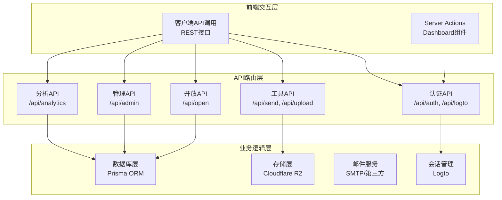
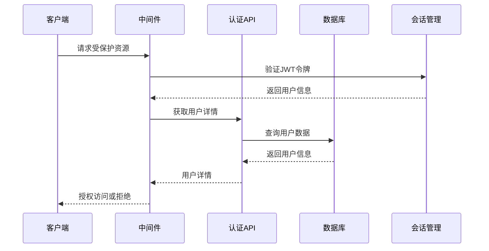
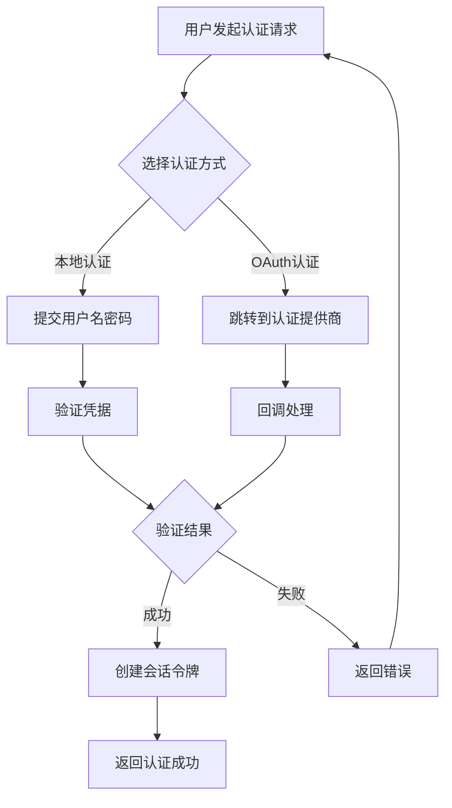
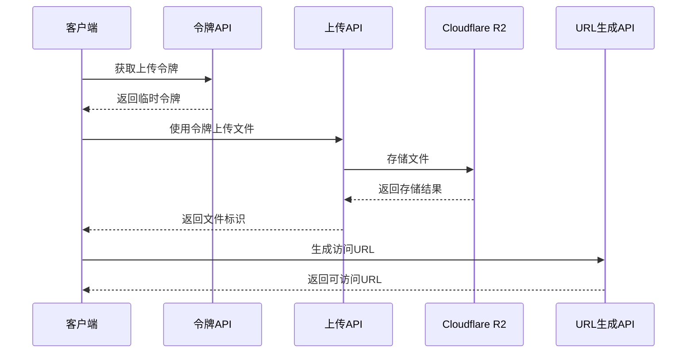
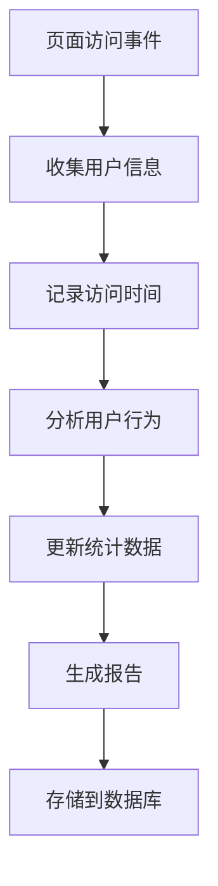
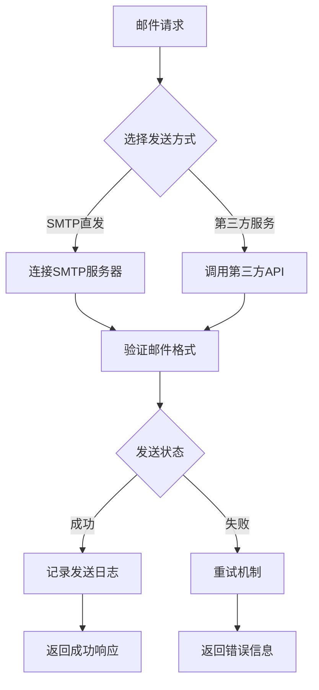
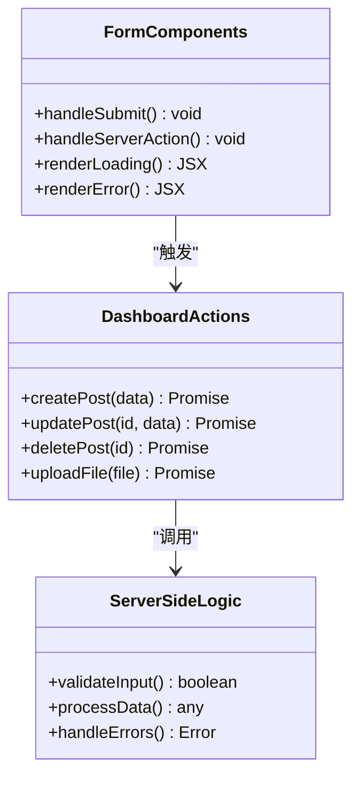
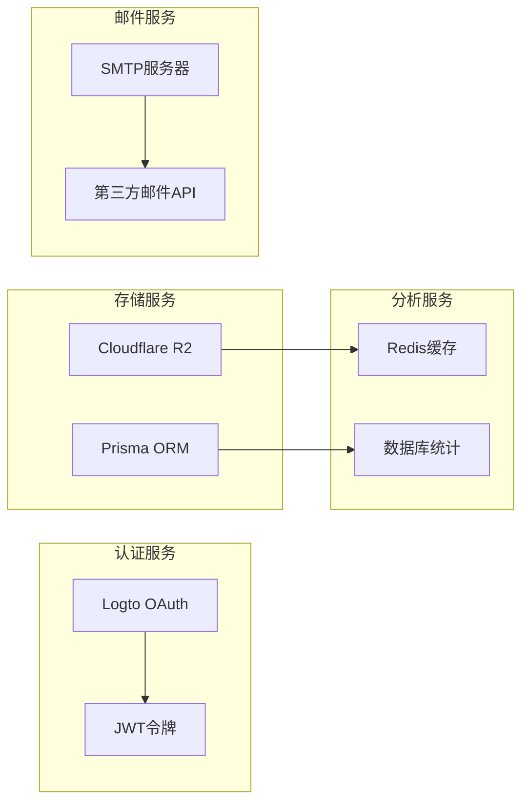
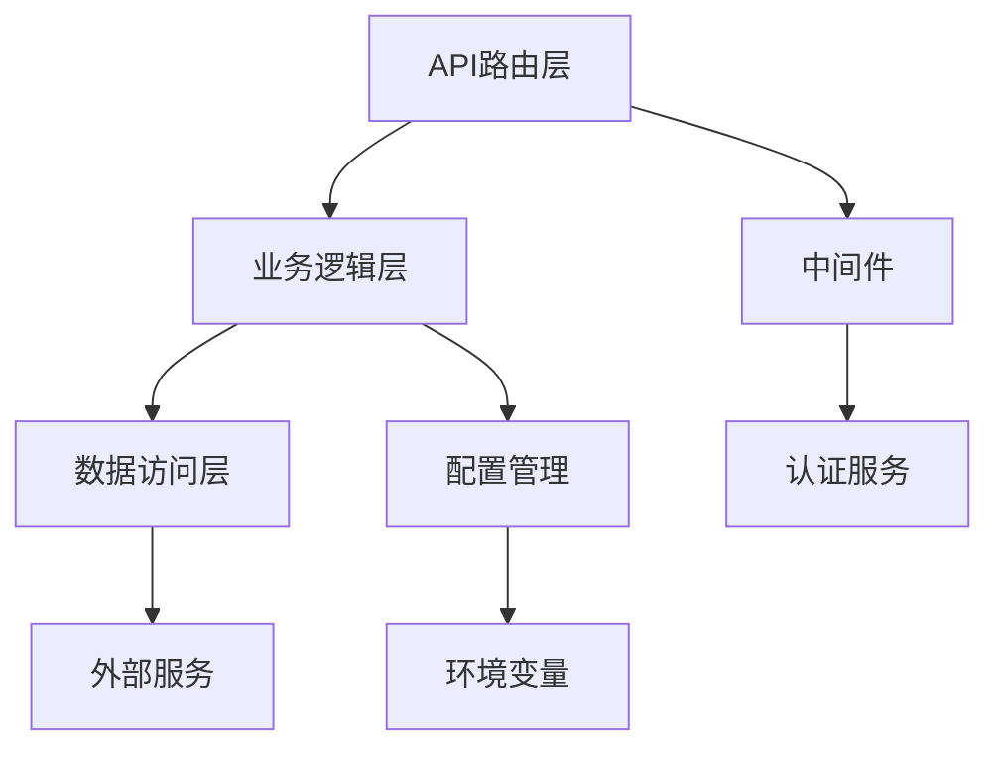
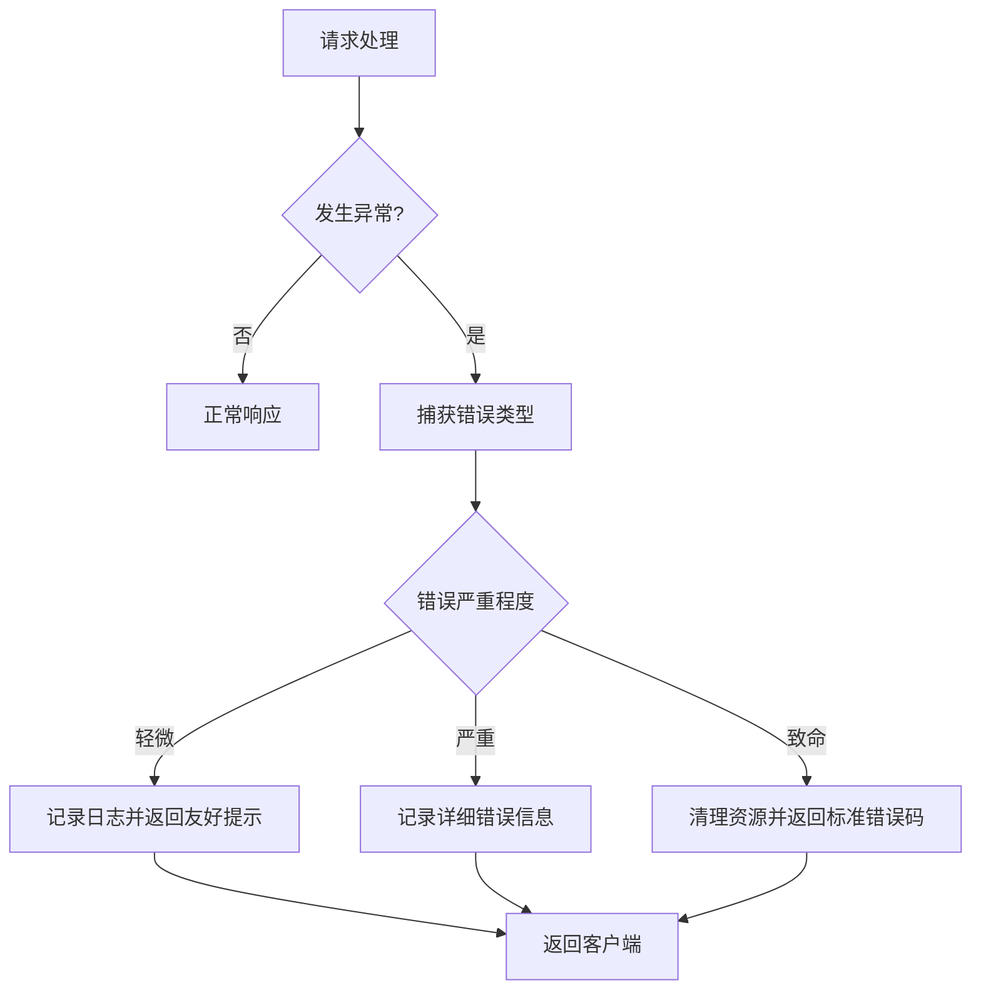

# API接口文档

<cite>
**本文档引用的文件**
- [src/app/api/analytics/track/route.ts](file://src/app/api/analytics/track/route.ts)
- [src/app/api/auth/me/route.ts](file://src/app/api/auth/me/route.ts)
- [src/app/api/logto/callback/route.ts](file://src/app/api/logto/callback/route.ts)
- [src/app/api/logto/sign-in/route.ts](file://src/app/api/logto/sign-in/route.ts)
- [src/app/api/logto/sign-out/route.ts](file://src/app/api/logto/sign-out/route.ts)
- [src/app/api/open/categories/route.ts](file://src/app/api/open/categories/route.ts)
- [src/app/api/open/posts/route.ts](file://src/app/api/open/posts/route.ts)
- [src/app/api/open/posts/[id]/route.ts](file://src/app/api/open/posts/[id]/route.ts)
- [src/app/api/open/posts/slug/[slug]/route.ts](file://src/app/api/open/posts/slug/[slug]/route.ts)
- [src/app/api/rcode/route.ts](file://src/app/api/rcode/route.ts)
- [src/app/api/send/notification/route.ts](file://src/app/api/send/notification/route.ts)
- [src/app/api/send/verification-code/route.ts](file://src/app/api/send/verification-code/route.ts)
- [src/app/api/send-friend-approval/route.ts](file://src/app/api/send-friend-approval/route.ts)
- [src/app/api/upload/r2/token/route.ts](file://src/app/api/upload/r2/token/route.ts)
- [src/app/api/upload/r2/upload/route.ts](file://src/app/api/upload/r2/upload/route.ts)
- [src/app/api/upload/r2/url/route.ts](file://src/app/api/upload/r2/url/route.ts)
- [src/lib/r2.ts](file://src/lib/r2.ts)
- [src/lib/email-service.ts](file://src/lib/email-service.ts)
- [src/lib/db.ts](file://src/lib/db.ts)
- [src/middleware.ts](file://src/middleware.ts)
- [src/lib/env.ts](file://src/lib/env.ts)
- [src/app/dashboard/ai-tools/actions.ts](file://src/app/dashboard/ai-tools/actions.ts)
- [src/app/dashboard/categories/actions.ts](file://src/app/dashboard/categories/actions.ts)
- [src/app/dashboard/comments/actions.ts](file://src/app/dashboard/comments/actions.ts)
- [src/app/dashboard/friend-links/actions.ts](file://src/app/dashboard/friend-links/actions.ts)
- [src/app/dashboard/posts/actions.ts](file://src/app/dashboard/posts/actions.ts)
- [src/app/dashboard/tools/actions.ts](file://src/app/dashboard/tools/actions.ts)
- [src/app/dashboard/users/actions.ts](file://src/app/dashboard/users/actions.ts)
- [src/app/api/users/[id]/route.ts](file://src/app/api/users/[id]/route.ts)
- [src/app/api/users/route.ts](file://src/app/api/users/route.ts)
- [src/app/api/test-db/route.ts](file://src/app/api/test-db/route.ts)
- [src/app/api/test-mail/route.ts](file://src/app/api/test-mail/route.ts)
- [src/app/api/test-friend-email/route.ts](file://src/app/api/test-friend-email/route.ts)
- [src/app/api/test-friend-email/page.tsx](file://src/app/api/test-friend-email/page.tsx)
- [src/app/api/upload-test/page.tsx](file://src/app/api/upload-test/page.tsx)
- [src/app/api/seed/route.ts](file://src/app/api/seed/route.ts)
</cite>

## 目录
1. [简介](#简介)
2. [项目结构](#项目结构)
3. [核心组件](#核心组件)
4. [架构概览](#架构概览)
5. [详细组件分析](#详细组件分析)
6. [依赖关系分析](#依赖关系分析)
7. [性能考虑](#性能考虑)
8. [故障排除指南](#故障排除指南)
9. [结论](#结论)
10. [附录](#附录)

## 简介
本项目采用Next.js App Router架构，通过Server Actions与API路由相结合的方式提供完整的后端服务。系统支持用户认证、内容管理、AI工具、友链管理、文件上传（Cloudflare R2）、分析统计等功能模块。

## 项目结构
项目采用App Router的分层组织方式，API路由位于`src/app/api/`目录下，按功能域进行划分：

**图表来源**
- [src/app/api/auth/me/route.ts:1-200](file://src/app/api/auth/me/route.ts#L1-L200)
- [src/app/api/open/posts/route.ts:1-200](file://src/app/api/open/posts/route.ts#L1-L200)
- [src/lib/r2.ts:1-200](file://src/lib/r2.ts#L1-L200)

**章节来源**
- [src/app/api/:1-200](file://src/app/api/#L1-L200)
- [src/lib/:1-200](file://src/lib/#L1-L200)

## 核心组件
系统的核心组件包括认证服务、内容管理系统、文件存储服务、分析统计服务等。每个组件都通过标准化的API接口对外提供服务。

**章节来源**
- [src/lib/db.ts:1-200](file://src/lib/db.ts#L1-L200)
- [src/lib/r2.ts:1-200](file://src/lib/r2.ts#L1-L200)
- [src/lib/email-service.ts:1-200](file://src/lib/email-service.ts#L1-L200)

## 架构概览
系统采用分层架构设计，通过中间件统一处理认证和权限控制：

**图表来源**
- [src/middleware.ts:1-200](file://src/middleware.ts#L1-L200)
- [src/app/api/auth/me/route.ts:1-200](file://src/app/api/auth/me/route.ts#L1-L200)

## 详细组件分析

### 认证相关接口

#### 用户认证接口
系统支持多种认证方式，包括本地认证和第三方OAuth认证。

**认证流程图**

**图表来源**
- [src/app/api/logto/sign-in/route.ts:1-200](file://src/app/api/logto/sign-in/route.ts#L1-L200)
- [src/app/api/logto/callback/route.ts:1-200](file://src/app/api/logto/callback/route.ts#L1-L200)

**章节来源**
- [src/app/api/auth/me/route.ts:1-200](file://src/app/api/auth/me/route.ts#L1-L200)
- [src/app/api/logto/sign-in/route.ts:1-200](file://src/app/api/logto/sign-in/route.ts#L1-L200)
- [src/app/api/logto/sign-out/route.ts:1-200](file://src/app/api/logto/sign-out/route.ts#L1-L200)

#### 开放内容接口
提供公开可访问的内容API，支持文章列表、分类管理和详情查询。

**内容API设计**
- GET `/api/open/posts` - 获取文章列表
- GET `/api/open/posts/[id]` - 获取指定文章详情  
- GET `/api/open/posts/slug/[slug]` - 通过slug获取文章
- GET `/api/open/categories` - 获取分类列表

**章节来源**
- [src/app/api/open/posts/route.ts:1-200](file://src/app/api/open/posts/route.ts#L1-L200)
- [src/app/api/open/posts/[id]/route.ts](file://src/app/api/open/posts/[id]/route.ts#L1-L200)
- [src/app/api/open/posts/slug/[slug]/route.ts](file://src/app/api/open/posts/slug/[slug]/route.ts#L1-L200)
- [src/app/api/open/categories/route.ts:1-200](file://src/app/api/open/categories/route.ts#L1-L200)

### 文件上传接口

#### Cloudflare R2集成
系统集成了Cloudflare R2对象存储服务，提供安全的文件上传和访问机制。

**文件上传流程**

**图表来源**
- [src/app/api/upload/r2/token/route.ts:1-200](file://src/app/api/upload/r2/token/route.ts#L1-L200)
- [src/app/api/upload/r2/upload/route.ts:1-200](file://src/app/api/upload/r2/upload/route.ts#L1-L200)
- [src/app/api/upload/r2/url/route.ts:1-200](file://src/app/api/upload/r2/url/route.ts#L1-L200)

**章节来源**
- [src/lib/r2.ts:1-200](file://src/lib/r2.ts#L1-L200)
- [src/app/api/upload/r2/token/route.ts:1-200](file://src/app/api/upload/r2/token/route.ts#L1-L200)
- [src/app/api/upload/r2/upload/route.ts:1-200](file://src/app/api/upload/r2/upload/route.ts#L1-L200)
- [src/app/api/upload/r2/url/route.ts:1-200](file://src/app/api/upload/r2/url/route.ts#L1-L200)

### 分析统计接口

#### 访问量统计
系统提供用户行为追踪和访问统计功能。

**分析流程图**

**图表来源**
- [src/app/api/analytics/track/route.ts:1-200](file://src/app/api/analytics/track/route.ts#L1-L200)

**章节来源**
- [src/app/api/analytics/track/route.ts:1-200](file://src/app/api/analytics/track/route.ts#L1-L200)

### 邮件发送接口

#### 多通道邮件服务
系统支持多种邮件发送方式，包括SMTP直发和第三方服务集成。

**邮件发送流程**

**图表来源**
- [src/lib/email-service.ts:1-200](file://src/lib/email-service.ts#L1-L200)

**章节来源**
- [src/app/api/send/notification/route.ts:1-200](file://src/app/api/send/notification/route.ts#L1-L200)
- [src/app/api/send/verification-code/route.ts:1-200](file://src/app/api/send/verification-code/route.ts#L1-L200)
- [src/lib/email-service.ts:1-200](file://src/lib/email-service.ts#L1-L200)

### Server Actions使用指南

#### 实现方式与使用场景
Server Actions是Next.js推荐的服务器端操作方式，提供更好的类型安全和错误处理。

**Server Actions架构**

**图表来源**
- [src/app/dashboard/posts/actions.ts:1-200](file://src/app/dashboard/posts/actions.ts#L1-L200)
- [src/app/dashboard/users/actions.ts:1-200](file://src/app/dashboard/users/actions.ts#L1-L200)

**章节来源**
- [src/app/dashboard/ai-tools/actions.ts:1-200](file://src/app/dashboard/ai-tools/actions.ts#L1-L200)
- [src/app/dashboard/categories/actions.ts:1-200](file://src/app/dashboard/categories/actions.ts#L1-L200)
- [src/app/dashboard/comments/actions.ts:1-200](file://src/app/dashboard/comments/actions.ts#L1-L200)
- [src/app/dashboard/friend-links/actions.ts:1-200](file://src/app/dashboard/friend-links/actions.ts#L1-L200)
- [src/app/dashboard/posts/actions.ts:1-200](file://src/app/dashboard/posts/actions.ts#L1-L200)
- [src/app/dashboard/tools/actions.ts:1-200](file://src/app/dashboard/tools/actions.ts#L1-L200)
- [src/app/dashboard/users/actions.ts:1-200](file://src/app/dashboard/users/actions.ts#L1-L200)

## 依赖关系分析

### 外部依赖
系统主要依赖以下外部服务和库：

**图表来源**
- [src/lib/env.ts:1-200](file://src/lib/env.ts#L1-L200)
- [src/lib/r2.ts:1-200](file://src/lib/r2.ts#L1-L200)

**章节来源**
- [src/lib/env.ts:1-200](file://src/lib/env.ts#L1-L200)
- [src/lib/db.ts:1-200](file://src/lib/db.ts#L1-L200)

### 内部模块依赖

**图表来源**
- [src/middleware.ts:1-200](file://src/middleware.ts#L1-L200)
- [src/lib/db.ts:1-200](file://src/lib/db.ts#L1-L200)

**章节来源**
- [src/middleware.ts:1-200](file://src/middleware.ts#L1-L200)

## 性能考虑
系统在设计时充分考虑了性能优化：

1. **缓存策略**：使用Redis缓存热点数据，减少数据库查询压力
2. **CDN加速**：静态资源通过CDN分发，提升访问速度
3. **数据库优化**：合理设计索引，避免N+1查询问题
4. **异步处理**：耗时操作采用异步队列处理
5. **资源压缩**：启用Gzip压缩，减少传输体积

## 故障排除指南

### 常见错误处理
系统提供了完善的错误处理机制：

**错误处理流程**

**章节来源**
- [src/app/api/test-db/route.ts:1-200](file://src/app/api/test-db/route.ts#L1-L200)
- [src/app/api/test-mail/route.ts:1-200](file://src/app/api/test-mail/route.ts#L1-L200)

### 调试工具使用
- **开发环境**：使用Next.js内置的调试工具和浏览器开发者工具
- **生产环境**：通过日志系统和监控面板进行问题排查
- **API测试**：使用Postman或curl进行接口测试

## 结论
本项目通过现代化的Next.js技术栈构建，实现了功能完整、架构清晰的API服务。系统支持多种认证方式、丰富的业务功能和良好的扩展性。Server Actions与传统API路由的结合为不同场景提供了灵活的解决方案。

## 附录

### API版本管理
系统采用语义化版本控制，通过URL路径中的版本号进行管理。

### 速率限制
- **通用接口**：每分钟120次请求
- **认证接口**：每分钟60次请求  
- **上传接口**：每小时100MB流量限制

### 安全防护
- **CORS配置**：严格限制跨域访问
- **CSRF防护**：所有修改操作需要CSRF令牌
- **输入验证**：严格的参数验证和过滤
- **权限控制**：基于角色的访问控制(RBAC)

### 客户端集成指南
1. **安装依赖**：确保使用兼容的Next.js版本
2. **配置环境**：设置必要的环境变量
3. **初始化**：在应用启动时初始化认证服务
4. **错误处理**：实现统一的错误处理逻辑
5. **缓存策略**：根据业务需求配置缓存

### 最佳实践建议
- 使用Server Actions处理敏感操作
- 合理使用缓存提高性能
- 实现优雅降级处理网络异常
- 定期监控API性能指标
- 保持API文档的实时更新