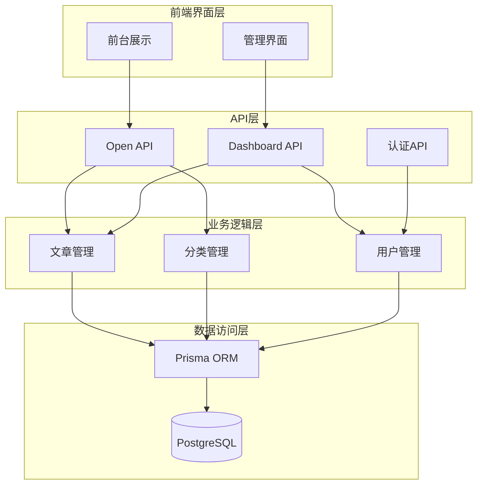
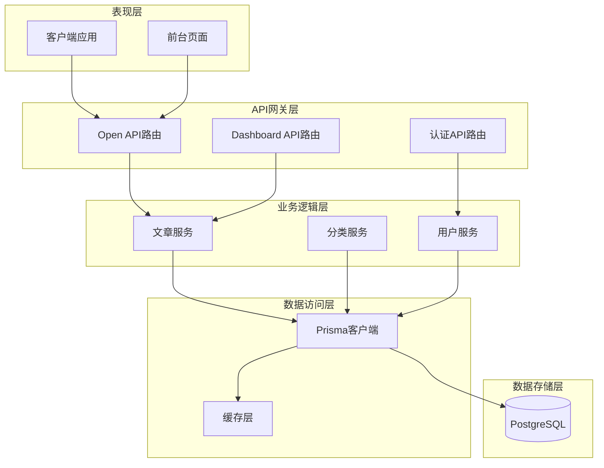
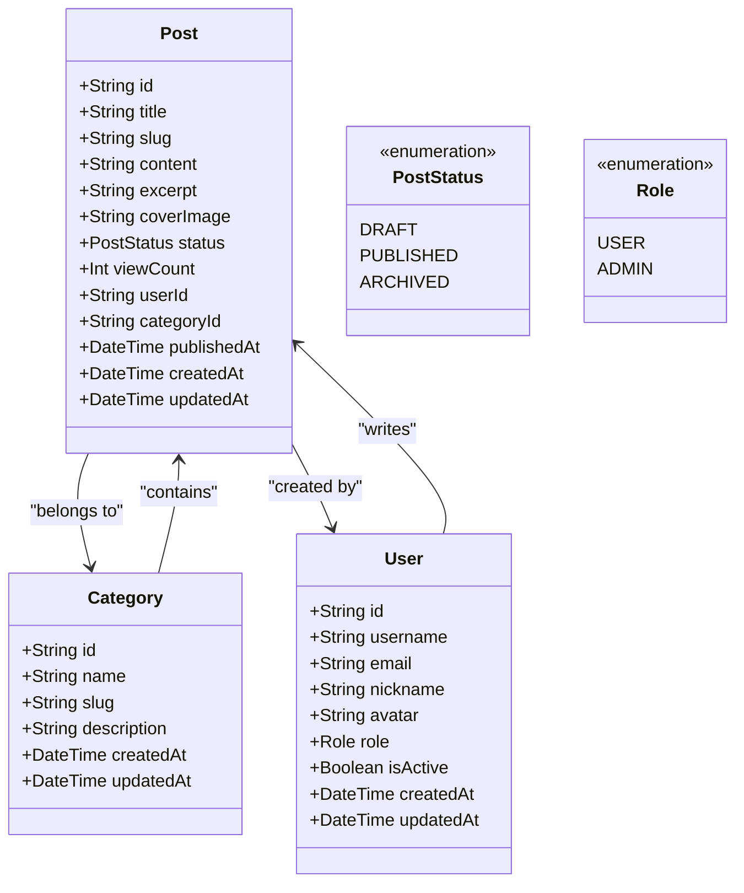
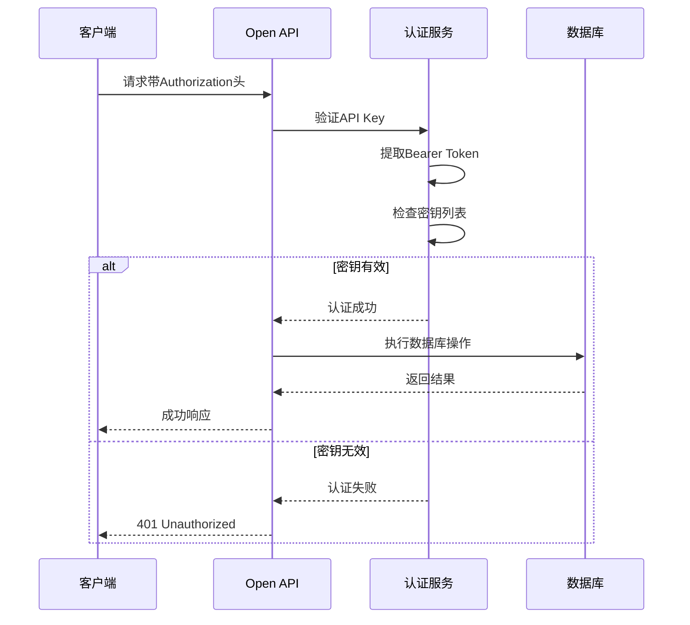
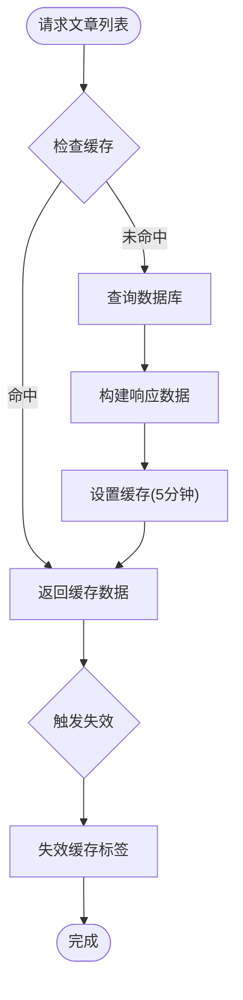
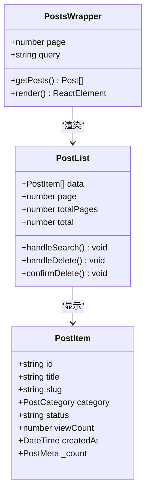
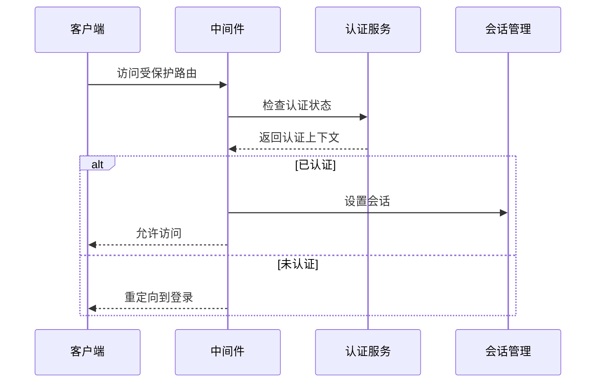
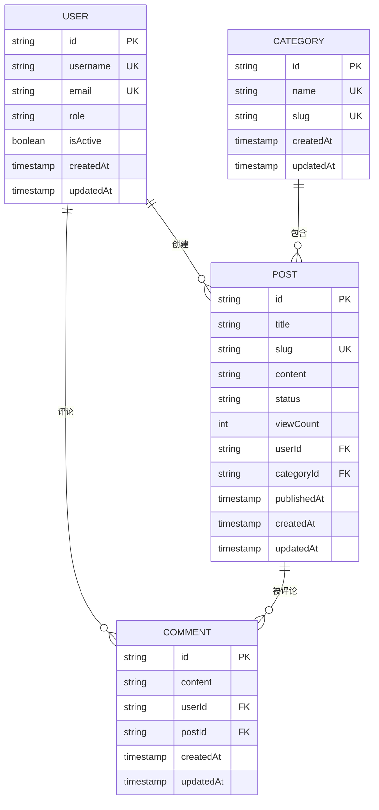
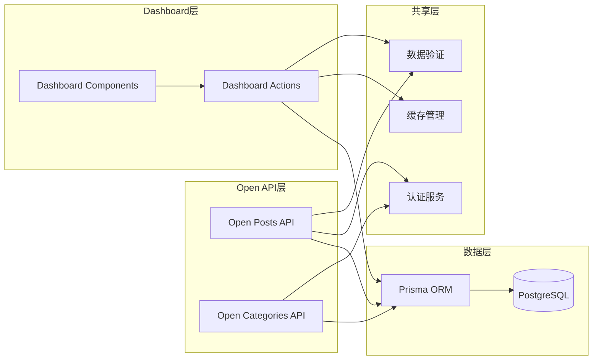

# 内容管理API

<cite>
**本文档引用的文件**
- [src/app/api/open/posts/route.ts](file://src/app/api/open/posts/route.ts)
- [src/app/api/open/categories/route.ts](file://src/app/api/open/categories/route.ts)
- [src/app/api/open/posts/[id]/route.ts](file://src/app/api/open/posts/[id]/route.ts)
- [src/app/api/open/posts/slug/[slug]/route.ts](file://src/app/api/open/posts/slug/[slug]/route.ts)
- [src/app/dashboard/posts/actions.ts](file://src/app/dashboard/posts/actions.ts)
- [src/app/dashboard/posts/schema.ts](file://src/app/dashboard/posts/schema.ts)
- [src/lib/api-key.ts](file://src/lib/api-key.ts)
- [src/lib/http.ts](file://src/lib/http.ts)
- [src/app/api/auth/me/route.ts](file://src/app/api/auth/me/route.ts)
- [src/app/api/users/route.ts](file://src/app/api/users/route.ts)
- [src/app/dashboard/posts/components/posts-wrapper.tsx](file://src/app/dashboard/posts/components/posts-wrapper.tsx)
- [src/app/dashboard/posts/components/post-list.tsx](file://src/app/dashboard/posts/components/post-list.tsx)
- [prisma/schema.prisma](file://prisma/schema.prisma)
- [src/lib/db.ts](file://src/lib/db.ts)
- [src/middleware.ts](file://src/middleware.ts)
</cite>

## 目录
1. [简介](#简介)
2. [项目结构](#项目结构)
3. [核心组件](#核心组件)
4. [架构概览](#架构概览)
5. [详细组件分析](#详细组件分析)
6. [依赖关系分析](#依赖关系分析)
7. [性能考虑](#性能考虑)
8. [故障排除指南](#故障排除指南)
9. [结论](#结论)

## 简介
本项目是一个基于Next.js的现代化内容管理系统，提供了完整的内容管理API，包括文章和分类的管理接口。系统采用Open API和管理API双轨制设计，既满足外部系统集成需求，又为后台管理提供完善的管理界面。

系统的核心特性包括：
- **双API架构**：Open API用于外部系统集成，管理API用于后台管理
- **完整的文章生命周期管理**：从草稿到发布的全流程管理
- **智能缓存策略**：结合数据库查询和前端缓存优化
- **严格的数据验证**：基于Zod的表单验证确保数据完整性
- **灵活的搜索和筛选**：支持关键词搜索、分类过滤、状态管理等

## 项目结构
项目采用按功能模块组织的结构，主要分为以下几个层次：



**图表来源**
- [src/app/api/open/posts/route.ts:1-193](file://src/app/api/open/posts/route.ts#L1-L193)
- [src/app/dashboard/posts/actions.ts:1-165](file://src/app/dashboard/posts/actions.ts#L1-L165)
- [prisma/schema.prisma:1-308](file://prisma/schema.prisma#L1-L308)

**章节来源**
- [src/app/api/open/posts/route.ts:1-193](file://src/app/api/open/posts/route.ts#L1-L193)
- [src/app/dashboard/posts/actions.ts:1-165](file://src/app/dashboard/posts/actions.ts#L1-L165)
- [prisma/schema.prisma:1-308](file://prisma/schema.prisma#L1-L308)

## 核心组件
系统由四个核心组件构成，每个组件都有其特定的职责和接口规范：

### Open API组件
负责对外提供内容服务，支持外部系统集成和前台展示需求。

### Dashboard API组件  
负责后台管理功能，提供完整的文章管理界面和数据操作能力。

### 数据模型组件
基于Prisma定义了完整的数据模型，包括用户、文章、分类、标签等实体。

### 缓存和认证组件
实现了智能缓存策略和API密钥认证机制。

**章节来源**
- [src/lib/api-key.ts:1-63](file://src/lib/api-key.ts#L1-L63)
- [src/lib/http.ts:1-100](file://src/lib/http.ts#L1-L100)
- [prisma/schema.prisma:15-132](file://prisma/schema.prisma#L15-L132)

## 架构概览
系统采用分层架构设计，通过明确的边界分离关注点：



**图表来源**
- [src/app/api/open/posts/route.ts:10-14](file://src/app/api/open/posts/route.ts#L10-L14)
- [src/app/dashboard/posts/actions.ts:1-165](file://src/app/dashboard/posts/actions.ts#L1-L165)
- [src/lib/db.ts:1-16](file://src/lib/db.ts#L1-L16)

**章节来源**
- [src/app/api/open/posts/route.ts:1-193](file://src/app/api/open/posts/route.ts#L1-L193)
- [src/app/dashboard/posts/actions.ts:1-165](file://src/app/dashboard/posts/actions.ts#L1-L165)
- [src/lib/db.ts:1-16](file://src/lib/db.ts#L1-L16)

## 详细组件分析

### Open API - 文章管理

#### RESTful API规范

**文章列表查询**
- **方法**: GET
- **路径**: `/api/open/posts`
- **认证**: Bearer Token API Key
- **查询参数**:
  - `page`: 页码，默认1
  - `pageSize`: 每页条数，默认10，最大100
  - `status`: 过滤状态(DRAFT/PUBLISHED/ARCHIVED)
  - `keyword`: 关键词搜索(标题和摘要)
  - `categoryId`: 分类ID过滤
  - `sortBy`: 排序字段(createdAt/viewCount)，默认createdAt
  - `sortOrder`: 排序方向(asc/desc)，默认desc

**文章详情查询**
- **方法**: GET
- **路径**: `/api/open/posts/:id` 或 `/api/open/posts/slug/:slug`
- **认证**: Bearer Token API Key

**文章发布**
- **方法**: POST
- **路径**: `/api/open/posts`
- **认证**: Bearer Token API Key
- **请求体字段**:
  - `title`: 标题(1-100字符)
  - `slug`: URL路径(小写字母、数字、连字符)
  - `content`: Markdown内容
  - `excerpt`: 摘要(可选)
  - `coverImage`: 封面图URL(可选)
  - `categoryId`: 分类ID(可选)
  - `status`: 状态(DRAFT默认)

#### 数据模型和验证



**图表来源**
- [prisma/schema.prisma:109-132](file://prisma/schema.prisma#L109-L132)
- [prisma/schema.prisma:84-96](file://prisma/schema.prisma#L84-L96)
- [prisma/schema.prisma:15-62](file://prisma/schema.prisma#L15-L62)

#### 认证和授权机制

系统采用API Key认证机制，支持多密钥轮换：



**图表来源**
- [src/lib/api-key.ts:38-62](file://src/lib/api-key.ts#L38-L62)
- [src/app/api/open/posts/route.ts:30-32](file://src/app/api/open/posts/route.ts#L30-L32)

**章节来源**
- [src/app/api/open/posts/route.ts:1-193](file://src/app/api/open/posts/route.ts#L1-L193)
- [src/lib/api-key.ts:1-63](file://src/lib/api-key.ts#L1-L63)
- [src/app/dashboard/posts/schema.ts:1-14](file://src/app/dashboard/posts/schema.ts#L1-L14)

### Open API - 分类管理

#### RESTful API规范

**分类列表查询**
- **方法**: GET
- **路径**: `/api/open/categories`
- **查询参数**:
  - `hasPosts`: 是否只返回有关联文章的分类(true/false)

**响应格式**:
```json
{
  "code": 200,
  "message": "操作成功",
  "data": [
    {
      "id": "string",
      "name": "string", 
      "slug": "string",
      "description": "string",
      "postCount": 0,
      "createdAt": "2023-01-01T00:00:00Z"
    }
  ]
}
```

**章节来源**
- [src/app/api/open/categories/route.ts:1-45](file://src/app/api/open/categories/route.ts#L1-L45)

### Dashboard API - 后台管理

#### 缓存策略和数据同步

系统实现了智能缓存机制，通过标签驱动的失效策略确保数据一致性：



**图表来源**
- [src/app/dashboard/posts/actions.ts:24-68](file://src/app/dashboard/posts/actions.ts#L24-L68)
- [src/app/dashboard/posts/actions.ts:92-95](file://src/app/dashboard/posts/actions.ts#L92-L95)

#### 管理界面组件



**图表来源**
- [src/app/dashboard/posts/components/posts-wrapper.tsx:1-21](file://src/app/dashboard/posts/components/posts-wrapper.tsx#L1-L21)
- [src/app/dashboard/posts/components/post-list.tsx:58-261](file://src/app/dashboard/posts/components/post-list.tsx#L58-L261)

**章节来源**
- [src/app/dashboard/posts/actions.ts:1-165](file://src/app/dashboard/posts/actions.ts#L1-L165)
- [src/app/dashboard/posts/components/posts-wrapper.tsx:1-21](file://src/app/dashboard/posts/components/posts-wrapper.tsx#L1-L21)
- [src/app/dashboard/posts/components/post-list.tsx:1-261](file://src/app/dashboard/posts/components/post-list.tsx#L1-L261)

### 认证和权限管理

#### 用户认证流程



**图表来源**
- [src/middleware.ts:8-28](file://src/middleware.ts#L8-L28)

#### 权限控制机制

系统支持基于角色的权限控制，管理员可以执行所有操作，普通用户仅能访问部分功能。

**章节来源**
- [src/middleware.ts:1-36](file://src/middleware.ts#L1-L36)
- [src/app/api/auth/me/route.ts:1-13](file://src/app/api/auth/me/route.ts#L1-L13)

## 依赖关系分析

### 数据模型依赖



**图表来源**
- [prisma/schema.prisma:15-132](file://prisma/schema.prisma#L15-L132)

### 组件依赖关系



**图表来源**
- [src/app/api/open/posts/route.ts:10-15](file://src/app/api/open/posts/route.ts#L10-L15)
- [src/app/dashboard/posts/actions.ts:1-6](file://src/app/dashboard/posts/actions.ts#L1-L6)
- [src/lib/db.ts:1-16](file://src/lib/db.ts#L1-L16)

**章节来源**
- [prisma/schema.prisma:1-308](file://prisma/schema.prisma#L1-L308)
- [src/app/api/open/posts/route.ts:1-193](file://src/app/api/open/posts/route.ts#L1-L193)
- [src/app/dashboard/posts/actions.ts:1-165](file://src/app/dashboard/posts/actions.ts#L1-L165)

## 性能考虑

### 缓存策略
系统实现了多层次的缓存机制：

1. **数据库查询缓存**: 使用Prisma的relationJoins优化关联查询
2. **应用层缓存**: Dashboard API使用unstable_cache进行智能缓存
3. **前端缓存**: Next.js的React缓存和标签失效机制

### 查询优化
- 使用索引优化常用查询字段
- 采用批量查询减少数据库往返
- 实现分页查询避免大数据集加载

### 并发处理
- 使用Promise.all并发执行查询
- 实现乐观锁防止数据竞争
- 采用事务保证数据一致性

## 故障排除指南

### 常见问题和解决方案

**API Key认证失败**
- 检查Authorization头格式是否正确(Bearer Token)
- 验证API Key是否在OPEN_API_KEYS环境中配置
- 确认API Key没有过期或被禁用

**文章发布失败**
- 检查slug是否唯一
- 验证文章内容格式是否正确
- 确认用户是否具有ADMIN权限

**缓存数据不同步**
- 手动触发revalidateTag清除缓存
- 检查缓存标签配置
- 验证数据库连接状态

**章节来源**
- [src/lib/api-key.ts:38-62](file://src/lib/api-key.ts#L38-L62)
- [src/lib/http.ts:42-55](file://src/lib/http.ts#L42-L55)
- [src/app/dashboard/posts/actions.ts:92-95](file://src/app/dashboard/posts/actions.ts#L92-L95)

## 结论
本内容管理API系统提供了完整的内容管理解决方案，具有以下优势：

1. **双轨制架构**: 同时满足外部集成和后台管理需求
2. **完善的认证机制**: 支持API Key和用户认证双重保障
3. **智能缓存策略**: 通过多层缓存提升系统性能
4. **严格的验证体系**: 基于Zod的表单验证确保数据质量
5. **灵活的搜索过滤**: 支持多种查询条件组合

系统采用现代化的技术栈和最佳实践，为内容管理提供了稳定可靠的基础架构。通过清晰的API设计和完善的错误处理机制，开发者可以轻松集成和扩展功能。