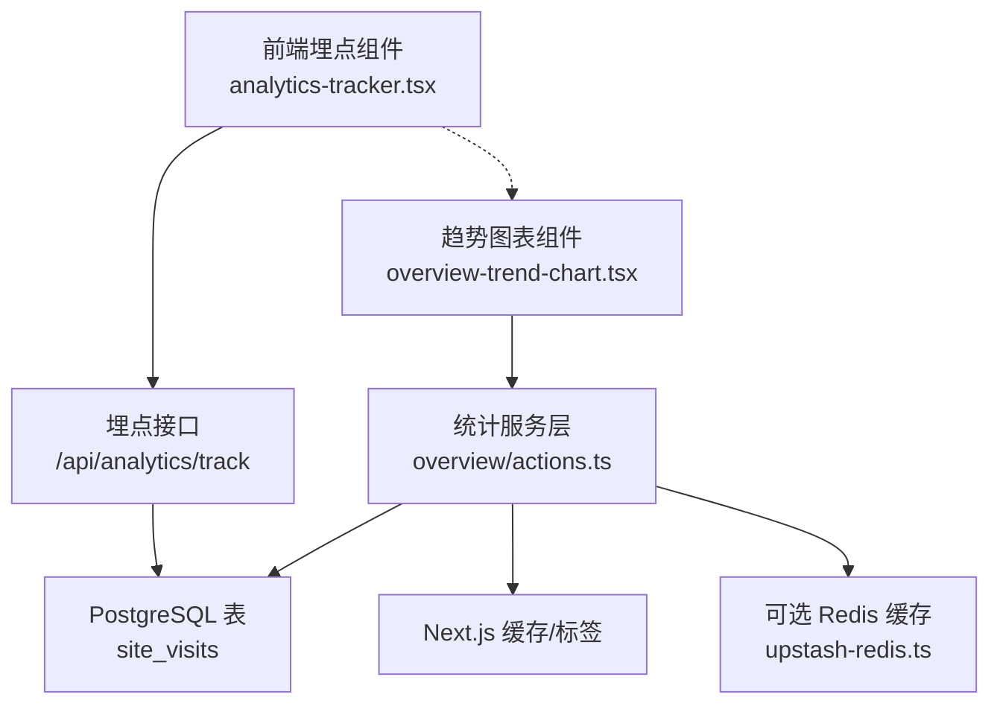
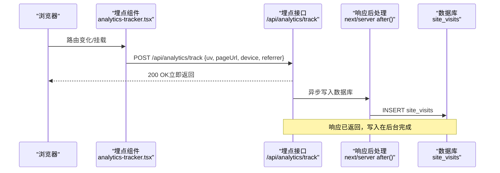
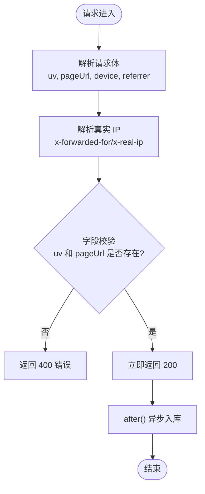
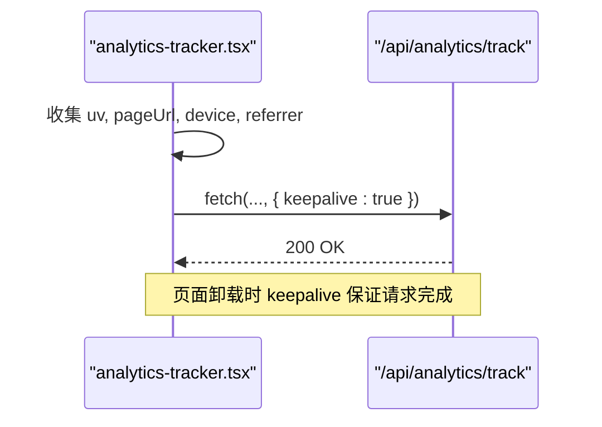
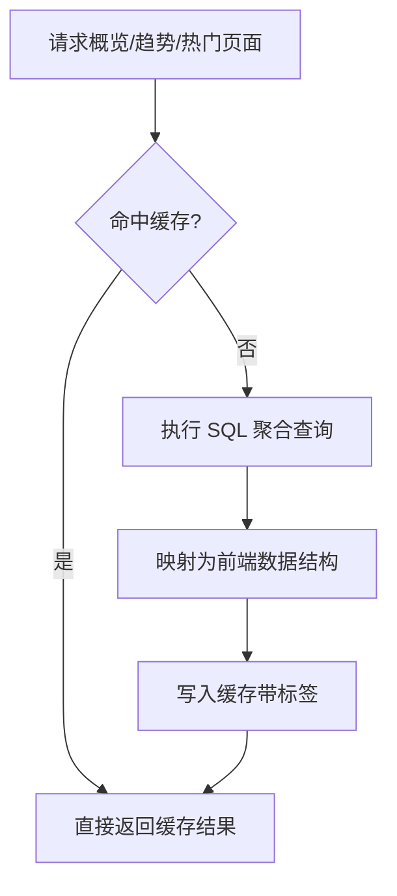
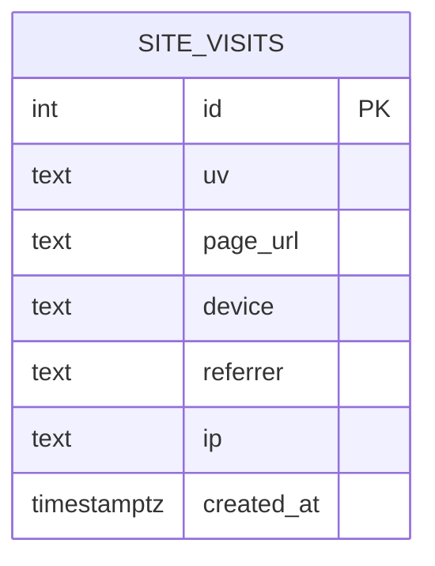
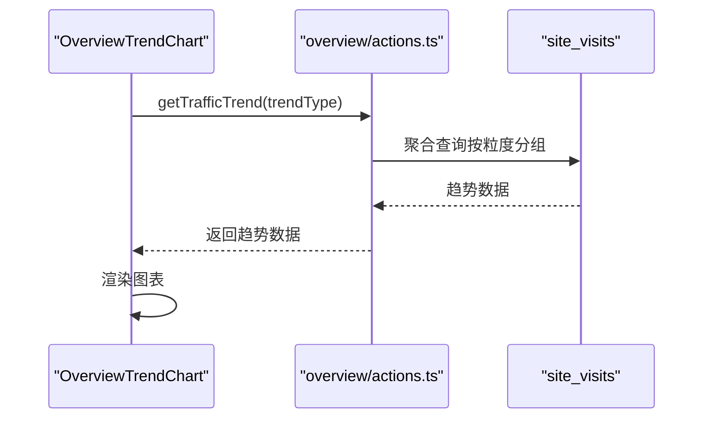
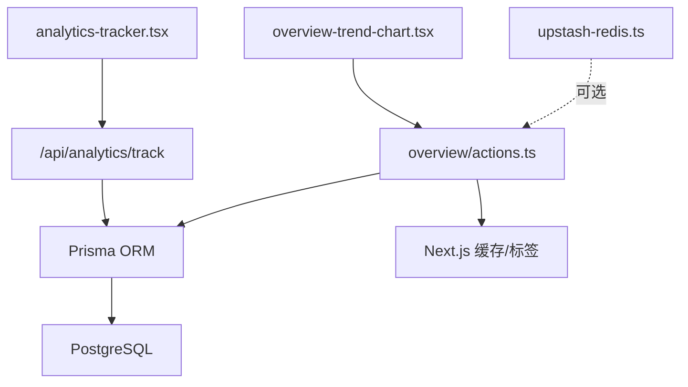

# 分析统计API

<cite>
**本文档引用的文件**
- [src/app/api/analytics/track/route.ts](file://src/app/api/analytics/track/route.ts)
- [src/components/analytics-tracker.tsx](file://src/components/analytics-tracker.tsx)
- [src/app/dashboard/overview/actions.ts](file://src/app/dashboard/overview/actions.ts)
- [src/app/dashboard/overview/page.tsx](file://src/app/dashboard/overview/page.tsx)
- [src/app/dashboard/overview/components/overview-trend-chart.tsx](file://src/app/dashboard/overview/components/overview-trend-chart.tsx)
- [src/app/dashboard/site-visits/components/site-visits-list.tsx](file://src/app/dashboard/site-visits/components/site-visits-list.tsx)
- [prisma/schema.prisma](file://prisma/schema.prisma)
- [prisma/migrations/20260122005608_add_site_visit/migration.sql](file://prisma/migrations/20260122005608_add_site_visit/migration.sql)
- [src/lib/upstash-redis.ts](file://src/lib/upstash-redis.ts)
- [.agents/skills/vercel-react-best-practices/rules/server-cache-lru.md](file://.agents/skills/vercel-react-best-practices/rules/server-cache-lru.md)
- [.agents/skills/vercel-react-best-practices/rules/server-auth-actions.md](file://.agents/skills/vercel-react-best-practices/rules/server-auth-actions.md)
- [.agents/skills/vercel-react-best-practices/rules/async-dependencies.md](file://.agents/skills/vercel-react-best-practices/rules/async-dependencies.md)
- [.agents/skills/vercel-react-best-practices/AGENTS.md](file://.agents/skills/vercel-react-best-practices/AGENTS.md)
- [src/middleware.ts](file://src/middleware.ts)
- [src/lib/session.ts](file://src/lib/session.ts)
- [src/app/api/logto/sign-in/route.ts](file://src/app/api/logto/sign-in/route.ts)
- [src/app/api/logto/callback/route.ts](file://src/app/api/logto/callback/route.ts)
- [src/app/api/logto/sign-out/route.ts](file://src/app/api/logto/sign-out/route.ts)
- [src/lib/logto.ts](file://src/lib/logto.ts)
</cite>

## 目录
1. [引言](#引言)
2. [项目结构](#项目结构)
3. [核心组件](#核心组件)
4. [架构总览](#架构总览)
5. [详细组件分析](#详细组件分析)
6. [依赖关系分析](#依赖关系分析)
7. [性能考量](#性能考量)
8. [故障排查指南](#故障排查指南)
9. [结论](#结论)
10. [附录](#附录)

## 引言
本文件面向“分析统计API”的设计与实现，聚焦于访问量统计（PV/UV）、页面访问分析、用户行为追踪等能力。文档覆盖数据采集流程、存储模型、查询接口、缓存策略、数据持久化、趋势分析、性能监控与访问日志、用户画像支持思路、以及数据隐私保护与匿名化处理建议。目标是帮助开发者快速理解并扩展统计体系。

## 项目结构
统计相关能力由以下模块协同构成：
- 前端埋点组件：负责在客户端采集页面访问事件并上报
- 后端埋点接口：接收前端上报，异步写入数据库，保证响应快速返回
- 数据库模型：定义站点访问记录的数据结构与索引
- 统计服务层：基于 Prisma 的聚合查询，提供概览、趋势、热门页面等指标
- 缓存与标签：利用 Next.js 缓存与标签系统提升查询性能
- 可选 Redis：提供跨请求缓存能力（如需）

**图示来源**
- [src/components/analytics-tracker.tsx:48-78](file://src/components/analytics-tracker.tsx#L48-L78)
- [src/app/api/analytics/track/route.ts:1-54](file://src/app/api/analytics/track/route.ts#L1-L54)
- [prisma/schema.prisma:216-229](file://prisma/schema.prisma#L216-L229)
- [src/app/dashboard/overview/actions.ts:67-176](file://src/app/dashboard/overview/actions.ts#L67-L176)
- [src/app/dashboard/overview/components/overview-trend-chart.tsx:1-98](file://src/app/dashboard/overview/components/overview-trend-chart.tsx#L1-L98)
- [src/lib/upstash-redis.ts:1-15](file://src/lib/upstash-redis.ts#L1-L15)

**章节来源**
- [src/components/analytics-tracker.tsx:48-78](file://src/components/analytics-tracker.tsx#L48-L78)
- [src/app/api/analytics/track/route.ts:1-54](file://src/app/api/analytics/track/route.ts#L1-L54)
- [prisma/schema.prisma:216-229](file://prisma/schema.prisma#L216-L229)
- [src/app/dashboard/overview/actions.ts:67-176](file://src/app/dashboard/overview/actions.ts#L67-L176)
- [src/app/dashboard/overview/components/overview-trend-chart.tsx:1-98](file://src/app/dashboard/overview/components/overview-trend-chart.tsx#L1-L98)
- [src/lib/upstash-redis.ts:1-15](file://src/lib/upstash-redis.ts#L1-L15)

## 核心组件
- 埋点接口：接收 uv、pageUrl、device、referrer 等字段，解析真实 IP，进行基本校验后立即返回 200，并通过 next/server 的 after() 在响应发送后再异步入库，确保低延迟。
- 前端埋点组件：在路由变化或挂载时自动采集信息并通过 fetch 发送到埋点接口，使用 keepalive 保障页面卸载时也能可靠发送。
- 统计服务层：提供概览（总 PV/UV、今日 PV/UV、昨日对比）、流量趋势（日/月/年粒度）、热门页面（PV/UV 排行）等聚合查询，使用 Next.js 缓存与标签进行缓存控制。
- 数据库模型：SiteVisit 记录 uv、pageUrl、device、referrer、ip、created_at，配套索引以优化查询。
- 可选 Redis：通过 Upstash 提供跨请求缓存能力，适合需要跨进程共享的场景。

**章节来源**
- [src/app/api/analytics/track/route.ts:4-53](file://src/app/api/analytics/track/route.ts#L4-L53)
- [src/components/analytics-tracker.tsx:48-78](file://src/components/analytics-tracker.tsx#L48-L78)
- [src/app/dashboard/overview/actions.ts:10-176](file://src/app/dashboard/overview/actions.ts#L10-L176)
- [prisma/schema.prisma:216-229](file://prisma/schema.prisma#L216-L229)
- [src/lib/upstash-redis.ts:5-14](file://src/lib/upstash-redis.ts#L5-L14)

## 架构总览
整体采用“前端采集 + 后端异步入库 + 数据库聚合 + 缓存加速”的架构。埋点接口零阻塞返回，统计查询通过缓存与标签实现高效复用，趋势图表支持动态切换时间粒度。

**图示来源**
- [src/components/analytics-tracker.tsx:48-78](file://src/components/analytics-tracker.tsx#L48-L78)
- [src/app/api/analytics/track/route.ts:28-43](file://src/app/api/analytics/track/route.ts#L28-L43)

**章节来源**
- [src/components/analytics-tracker.tsx:48-78](file://src/components/analytics-tracker.tsx#L48-L78)
- [src/app/api/analytics/track/route.ts:28-43](file://src/app/api/analytics/track/route.ts#L28-L43)

## 详细组件分析

### 埋点接口（/api/analytics/track）
- 请求体字段
  - uv：用户标识（建议匿名化处理）
  - pageUrl：页面 URL
  - device：设备信息
  - referrer：来源页
- IP 解析：优先从 x-forwarded-for 或 x-real-ip 获取，本地开发回退到 127.0.0.1，若存在多个 IP 则取第一个
- 校验：缺失 uv 或 pageUrl 直接返回 400
- 写入策略：立即返回 200，使用 after() 在响应发送后异步入库，异常被捕获并记录日志
- 安全性：接口未做鉴权，建议结合认证中间件或服务端动作进行权限控制

**图示来源**
- [src/app/api/analytics/track/route.ts:4-53](file://src/app/api/analytics/track/route.ts#L4-L53)

**章节来源**
- [src/app/api/analytics/track/route.ts:4-53](file://src/app/api/analytics/track/route.ts#L4-L53)

### 前端埋点组件（analytics-tracker.tsx）
- 自动采集：在组件挂载及 pathname/searchParams 变化时触发
- 数据组装：包含 uv、pageUrl、device、referrer
- 发送策略：使用 fetch 并设置 keepalive，确保页面卸载时仍能可靠发送
- 错误处理：捕获异常并输出日志

**图示来源**
- [src/components/analytics-tracker.tsx:48-78](file://src/components/analytics-tracker.tsx#L48-L78)

**章节来源**
- [src/components/analytics-tracker.tsx:48-78](file://src/components/analytics-tracker.tsx#L48-L78)

### 统计服务层（overview/actions.ts）
- 概览指标
  - totalPV/totalUV：总访问次数与独立访客数
  - todayPV/todayUV：当日访问次数与独立访客数
  - yesterdayPV/yesterdayUV：昨日对应指标，用于趋势计算
- 流量趋势
  - 支持 day/month/year 三种粒度，分别按 MM-DD、YYYY-MM、YYYY 聚合
  - 时间范围：日视图近 30 天，月视图近 12 个月，年视图近 5 年
- 热门页面
  - 按 page_url 分组，统计 PV/UV 并排序
- 缓存策略
  - 使用 Next.js unstable_cache 包裹聚合查询，配置 revalidate 与 tags
  - 概览缓存 60 秒，趋势与热门页面缓存 300 秒
  - 通过标签触发失效，保证数据新鲜度

**图示来源**
- [src/app/dashboard/overview/actions.ts:67-176](file://src/app/dashboard/overview/actions.ts#L67-L176)

**章节来源**
- [src/app/dashboard/overview/actions.ts:10-176](file://src/app/dashboard/overview/actions.ts#L10-L176)

### 数据库模型（SiteVisit）
- 字段：uv、pageUrl、device、referrer、ip、created_at
- 索引：uv、pageUrl、created_at，支撑常见查询与分组聚合
- 迁移：包含表创建与索引建立

**图示来源**
- [prisma/schema.prisma:216-229](file://prisma/schema.prisma#L216-L229)
- [prisma/migrations/20260122005608_add_site_visit/migration.sql:1-21](file://prisma/migrations/20260122005608_add_site_visit/migration.sql#L1-L21)

**章节来源**
- [prisma/schema.prisma:216-229](file://prisma/schema.prisma#L216-L229)
- [prisma/migrations/20260122005608_add_site_visit/migration.sql:1-21](file://prisma/migrations/20260122005608_add_site_visit/migration.sql#L1-L21)

### 趋势图表组件（overview-trend-chart.tsx）
- 功能：展示 PV/UV 趋势，支持切换 day/month/year
- 数据来源：通过服务端动作 getTrafficTrend 获取
- 交互：使用 useTransition 与状态管理，避免长时间渲染阻塞

**图示来源**
- [src/app/dashboard/overview/components/overview-trend-chart.tsx:1-98](file://src/app/dashboard/overview/components/overview-trend-chart.tsx#L1-L98)
- [src/app/dashboard/overview/actions.ts:97-124](file://src/app/dashboard/overview/actions.ts#L97-L124)

**章节来源**
- [src/app/dashboard/overview/components/overview-trend-chart.tsx:1-98](file://src/app/dashboard/overview/components/overview-trend-chart.tsx#L1-L98)
- [src/app/dashboard/overview/actions.ts:97-124](file://src/app/dashboard/overview/actions.ts#L97-L124)

### 访问日志列表（site-visits-list.tsx）
- 功能：展示站点访问明细（URL、设备、来源、IP、时间），支持分页导航
- 用途：审计与问题排查

**章节来源**
- [src/app/dashboard/site-visits/components/site-visits-list.tsx:1-90](file://src/app/dashboard/site-visits/components/site-visits-list.tsx#L1-L90)

### 可选 Redis 缓存（upstash-redis.ts）
- 功能：提供跨请求缓存能力，适用于需要跨进程共享的场景
- 注意：当前统计模块主要依赖 Next.js 缓存与标签，Redis 作为可选增强

**章节来源**
- [src/lib/upstash-redis.ts:1-15](file://src/lib/upstash-redis.ts#L1-L15)

## 依赖关系分析
- 前端埋点组件依赖埋点接口
- 埋点接口依赖数据库（Prisma）写入
- 统计服务层依赖数据库聚合查询与缓存标签
- 趋势图表组件依赖统计服务层
- 可选 Redis 与统计服务层解耦，可通过工具函数注入

**图示来源**
- [src/components/analytics-tracker.tsx:48-78](file://src/components/analytics-tracker.tsx#L48-L78)
- [src/app/api/analytics/track/route.ts:1-54](file://src/app/api/analytics/track/route.ts#L1-L54)
- [src/app/dashboard/overview/actions.ts:67-176](file://src/app/dashboard/overview/actions.ts#L67-L176)
- [src/app/dashboard/overview/components/overview-trend-chart.tsx:1-98](file://src/app/dashboard/overview/components/overview-trend-chart.tsx#L1-L98)
- [src/lib/upstash-redis.ts:1-15](file://src/lib/upstash-redis.ts#L1-L15)

**章节来源**
- [src/components/analytics-tracker.tsx:48-78](file://src/components/analytics-tracker.tsx#L48-L78)
- [src/app/api/analytics/track/route.ts:1-54](file://src/app/api/analytics/track/route.ts#L1-L54)
- [src/app/dashboard/overview/actions.ts:67-176](file://src/app/dashboard/overview/actions.ts#L67-L176)
- [src/app/dashboard/overview/components/overview-trend-chart.tsx:1-98](file://src/app/dashboard/overview/components/overview-trend-chart.tsx#L1-L98)
- [src/lib/upstash-redis.ts:1-15](file://src/lib/upstash-redis.ts#L1-L15)

## 性能考量
- 埋点接口零阻塞：使用 next/server 的 after() 在响应后异步入库，降低尾延迟
- 查询缓存：概览 60 秒、趋势与热门页面 300 秒，配合标签失效，兼顾实时性与性能
- 并行加载：概览页通过 Promise.all 并行获取多项指标，减少等待时间
- LRU 缓存：在需要跨请求共享缓存的场景，可使用 lru-cache 或 Redis 提升命中率
- 序列化优化：在 React Server/Client 边界仅传递必要字段，减少传输体积

**章节来源**
- [.agents/skills/vercel-react-best-practices/rules/server-cache-lru.md:1-42](file://.agents/skills/vercel-react-best-practices/rules/server-cache-lru.md#L1-L42)
- [.agents/skills/vercel-react-best-practices/AGENTS.md:753-802](file://.agents/skills/vercel-react-best-practices/AGENTS.md#L753-L802)
- [.agents/skills/vercel-react-best-practices/rules/async-dependencies.md:1-52](file://.agents/skills/vercel-react-best-practices/rules/async-dependencies.md#L1-L52)
- [src/app/dashboard/overview/actions.ts:164-176](file://src/app/dashboard/overview/actions.ts#L164-L176)

## 故障排查指南
- 埋点接口错误
  - 400：缺少 uv 或 pageUrl
  - 500：内部异常，检查日志
  - 异步写入失败：查看 after() 中的日志输出
- 统计数据异常
  - 缓存未刷新：确认标签是否正确失效
  - 查询性能差：检查索引与查询条件，确认是否命中索引
- 前端埋点失败
  - keepalive 未生效：确认网络环境与浏览器支持
  - 重复上报：检查组件挂载逻辑与路由变化监听
- 认证与授权
  - 埋点接口未鉴权：建议在服务端动作中增加鉴权与输入校验
  - 管理端访问：通过中间件与会话校验确保管理员权限

**章节来源**
- [src/app/api/analytics/track/route.ts:20-52](file://src/app/api/analytics/track/route.ts#L20-L52)
- [src/app/dashboard/overview/actions.ts:67-176](file://src/app/dashboard/overview/actions.ts#L67-L176)
- [.agents/skills/vercel-react-best-practices/rules/server-auth-actions.md:1-97](file://.agents/skills/vercel-react-best-practices/rules/server-auth-actions.md#L1-L97)
- [src/middleware.ts:8-28](file://src/middleware.ts#L8-L28)
- [src/lib/session.ts:17-41](file://src/lib/session.ts#L17-L41)

## 结论
该统计体系以“前端采集 + 后端异步入库 + 数据库聚合 + 缓存加速”为核心，实现了低延迟、可扩展的访问量统计与趋势分析能力。通过合理的缓存策略与并行加载，兼顾了性能与实时性。建议后续在埋点接口层面增加鉴权与输入校验，并根据业务需求扩展用户画像与高级分析能力。

## 附录

### API 规范（埋点接口）
- 方法与路径
  - POST /api/analytics/track
- 请求头
  - Content-Type: application/json
- 请求体字段
  - uv: string（用户标识，建议匿名化）
  - pageUrl: string（页面 URL）
  - device: string（设备信息）
  - referrer: string（来源页，可选）
- 成功响应
  - 200 OK，{ success: true }
- 错误响应
  - 400 Bad Request：缺少必需字段
  - 500 Internal Server Error：服务器内部错误

**章节来源**
- [src/app/api/analytics/track/route.ts:4-53](file://src/app/api/analytics/track/route.ts#L4-L53)

### 统计维度与查询参数
- 维度
  - 概览：totalPV、totalUV、todayPV、todayUV、yesterdayPV、yesterdayUV
  - 趋势：pv、uv（按 day/month/year 聚合）
  - 热门页面：url、pv、uv
- 时间范围
  - 日趋势：最近 30 天
  - 月趋势：最近 12 个月
  - 年趋势：最近 5 年
- 聚合方式
  - COUNT(*) 与 COUNT(DISTINCT uv) 分别统计 PV 与 UV
  - GROUP BY 对 created_at 进行时间粒度聚合

**章节来源**
- [src/app/dashboard/overview/actions.ts:67-176](file://src/app/dashboard/overview/actions.ts#L67-L176)

### 数据隐私保护与匿名化
- 匿名化标识：uv 建议使用一次性或轮换标识，避免直接使用真实用户 ID
- IP 处理：仅记录必要的 IP 片段或聚合信息，避免存储完整 IP
- 最小化采集：仅采集必要字段，遵循最小化原则
- 访问控制：埋点接口与统计接口均需鉴权，防止未授权访问

**章节来源**
- [.agents/skills/vercel-react-best-practices/rules/server-auth-actions.md:1-97](file://.agents/skills/vercel-react-best-practices/rules/server-auth-actions.md#L1-L97)

### 认证与会话集成
- 登录流程：通过 /api/logto/sign-in 重定向至 Logto 登录，回调 /api/logto/callback 完成会话建立
- 中间件：保护 /dashboard 与 /admin 路径，未认证跳转登录
- 会话获取：getCurrentUser 通过 Logto 上下文与数据库查询用户信息

**章节来源**
- [src/app/api/logto/sign-in/route.ts:1-8](file://src/app/api/logto/sign-in/route.ts#L1-L8)
- [src/app/api/logto/callback/route.ts:1-41](file://src/app/api/logto/callback/route.ts#L1-L41)
- [src/middleware.ts:8-28](file://src/middleware.ts#L8-L28)
- [src/lib/session.ts:17-41](file://src/lib/session.ts#L17-L41)