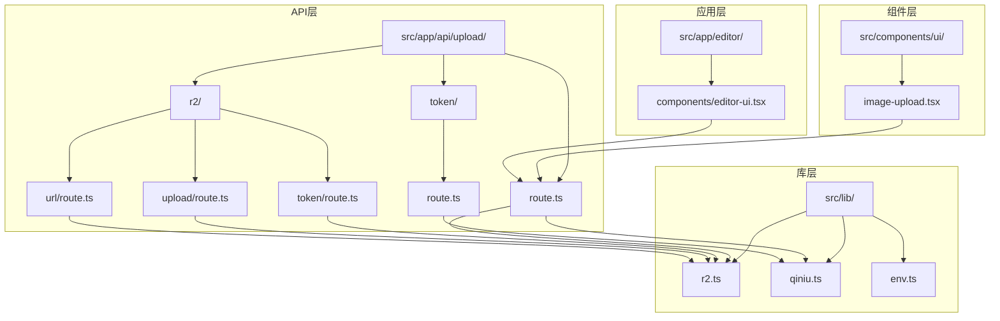
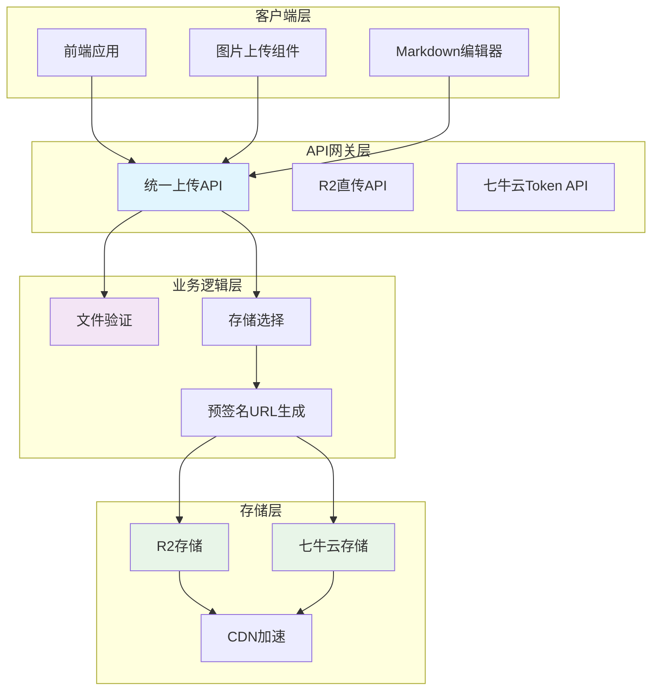
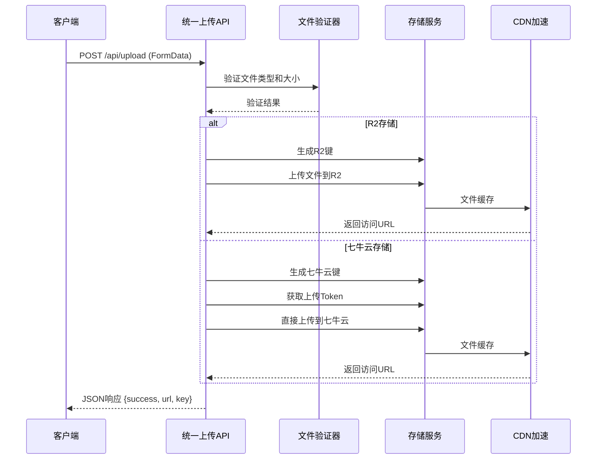
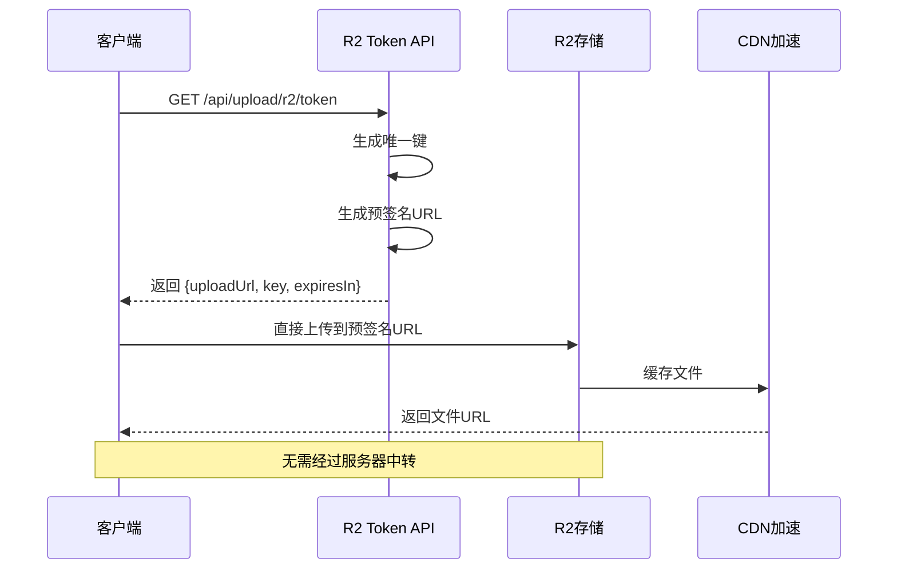
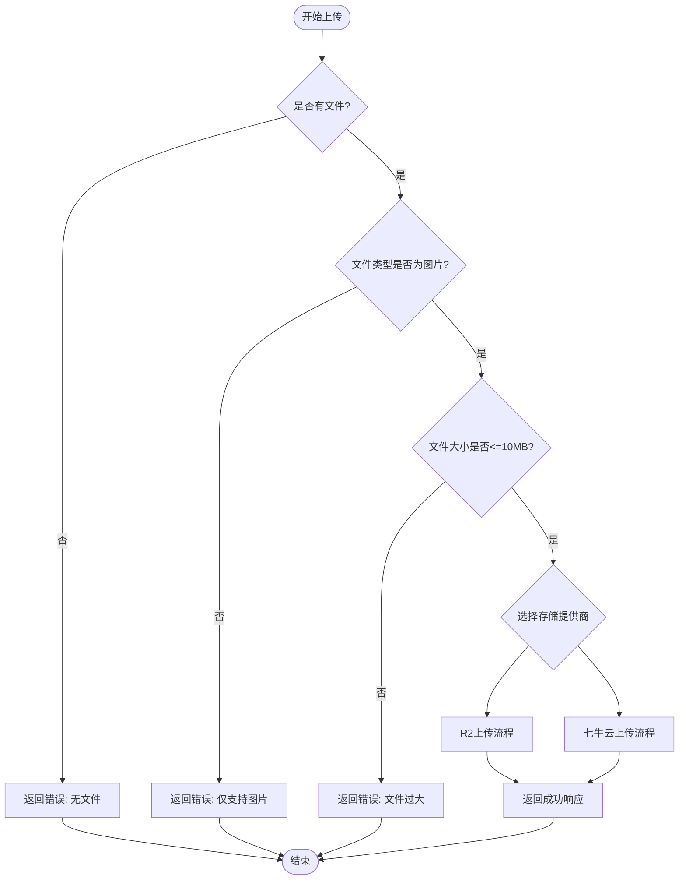

# 文件上传API

<cite>
**本文档引用的文件**
- [src/app/api/upload/route.ts](file://src/app/api/upload/route.ts)
- [src/lib/r2.ts](file://src/lib/r2.ts)
- [src/lib/qiniu.ts](file://src/lib/qiniu.ts)
- [src/app/api/upload/r2/token/route.ts](file://src/app/api/upload/r2/token/route.ts)
- [src/app/api/upload/r2/upload/route.ts](file://src/app/api/upload/r2/upload/route.ts)
- [src/app/api/upload/r2/url/route.ts](file://src/app/api/upload/r2/url/route.ts)
- [src/app/api/upload/token/route.ts](file://src/app/api/upload/token/route.ts)
- [src/lib/env.ts](file://src/lib/env.ts)
- [src/components/ui/image-upload.tsx](file://src/components/ui/image-upload.tsx)
- [src/app/editor/components/editor-ui.tsx](file://src/app/editor/components/editor-ui.tsx)
</cite>

## 目录
1. [简介](#简介)
2. [项目结构](#项目结构)
3. [核心组件](#核心组件)
4. [架构概览](#架构概览)
5. [详细组件分析](#详细组件分析)
6. [依赖关系分析](#依赖关系分析)
7. [性能考虑](#性能考虑)
8. [故障排除指南](#故障排除指南)
9. [结论](#结论)

## 简介

本文件上传API提供了统一的文件上传解决方案，支持Cloudflare R2和七牛云两种存储服务。该系统实现了多种上传模式，包括统一API接口、前端直传、后端中转上传，并集成了预签名URL生成功能以实现CDN加速和优化的文件访问体验。

系统支持图片文件上传，具备完善的文件类型验证、大小限制、错误处理和安全防护机制。通过环境变量配置，可以灵活切换不同的存储提供商，满足不同场景下的存储需求。

## 项目结构

文件上传功能主要分布在以下目录结构中：



**图表来源**
- [src/app/api/upload/route.ts:1-81](file://src/app/api/upload/route.ts#L1-L81)
- [src/lib/r2.ts:1-95](file://src/lib/r2.ts#L1-L95)
- [src/lib/qiniu.ts:1-33](file://src/lib/qiniu.ts#L1-L33)

**章节来源**
- [src/app/api/upload/route.ts:1-81](file://src/app/api/upload/route.ts#L1-L81)
- [src/lib/r2.ts:1-95](file://src/lib/r2.ts#L1-L95)
- [src/lib/qiniu.ts:1-33](file://src/lib/qiniu.ts#L1-L33)

## 核心组件

### 统一上传API

统一上传API是整个文件上传系统的核心入口，根据配置自动选择合适的存储服务。该组件实现了智能路由功能，能够根据UPLOAD_PROVIDER环境变量动态切换R2或七牛云存储。

**主要特性：**
- 自动存储服务检测
- 文件类型验证（仅支持图片）
- 文件大小限制（最大10MB）
- 统一响应格式
- 错误处理和日志记录

**章节来源**
- [src/app/api/upload/route.ts:11-80](file://src/app/api/upload/route.ts#L11-L80)

### R2存储集成

Cloudflare R2存储集成提供了完整的S3兼容存储解决方案，包括预签名URL生成、文件上传和访问控制功能。

**核心功能：**
- 预签名URL生成（支持1小时有效期）
- 文件唯一键生成算法
- 公开访问URL构建
- S3客户端单例管理
- 自定义域名支持

**章节来源**
- [src/lib/r2.ts:10-94](file://src/lib/r2.ts#L10-L94)

### 七牛云存储支持

七牛云存储集成了私有空间认证机制，提供了安全的文件上传解决方案。

**核心功能：**
- 私有空间上传Token生成
- 1小时有效期Token管理
- bucket:key格式的scope配置
- 与R2相同的文件命名策略

**章节来源**
- [src/lib/qiniu.ts:10-32](file://src/lib/qiniu.ts#L10-L32)

## 架构概览

文件上传系统的整体架构采用分层设计，确保了良好的可扩展性和维护性：



**图表来源**
- [src/app/api/upload/route.ts:40-72](file://src/app/api/upload/route.ts#L40-L72)
- [src/lib/r2.ts:41-56](file://src/lib/r2.ts#L41-L56)
- [src/lib/qiniu.ts:10-21](file://src/lib/qiniu.ts#L10-L21)

## 详细组件分析

### 统一上传流程

统一上传API实现了智能的文件上传流程，根据配置自动选择最优的存储方案：



**图表来源**
- [src/app/api/upload/route.ts:11-80](file://src/app/api/upload/route.ts#L11-L80)
- [src/lib/r2.ts:77-94](file://src/lib/r2.ts#L77-L94)
- [src/lib/qiniu.ts:10-21](file://src/lib/qiniu.ts#L10-L21)

**章节来源**
- [src/app/api/upload/route.ts:11-80](file://src/app/api/upload/route.ts#L11-L80)

### R2直传流程

R2直传模式提供了最优的上传性能，通过预签名URL实现前端直接上传：



**图表来源**
- [src/app/api/upload/r2/token/route.ts:10-34](file://src/app/api/upload/r2/token/route.ts#L10-L34)
- [src/lib/r2.ts:41-56](file://src/lib/r2.ts#L41-L56)

**章节来源**
- [src/app/api/upload/r2/token/route.ts:10-42](file://src/app/api/upload/r2/token/route.ts#L10-L42)

### 文件验证机制

系统实现了多层次的文件验证机制，确保上传文件的安全性和合规性：



**图表来源**
- [src/app/api/upload/route.ts:17-38](file://src/app/api/upload/route.ts#L17-L38)

**章节来源**
- [src/app/api/upload/route.ts:17-38](file://src/app/api/upload/route.ts#L17-L38)

### 存储键生成算法

系统采用了统一的文件命名策略，确保文件键的唯一性和可预测性：


**图表来源**
- [src/lib/r2.ts:29-34](file://src/lib/r2.ts#L29-L34)
- [src/lib/qiniu.ts:28-32](file://src/lib/qiniu.ts#L28-L32)

**章节来源**
- [src/lib/r2.ts:29-34](file://src/lib/r2.ts#L29-L34)
- [src/lib/qiniu.ts:28-32](file://src/lib/qiniu.ts#L28-L32)

## 依赖关系分析

文件上传系统的依赖关系体现了清晰的分层架构：

```mermaid
graph TB
subgraph "外部依赖"
A[@aws-sdk/client-s3]
B[@aws-sdk/s3-request-presigner]
C[qiniu]
D[next/server]
end
subgraph "内部模块"
E[env.ts]
F[r2.ts]
G[qiniu.ts]
H[upload/route.ts]
I[r2/token/route.ts]
J[r2/upload/route.ts]
K[r2/url/route.ts]
L[upload/token/route.ts]
end
A --> F
B --> F
C --> G
D --> H
D --> I
D --> J
D --> K
D --> L
E --> F
E --> G
E --> H
E --> L
F --> H
G --> H
style F fill:#e3f2fd
style G fill:#e3f2fd
style H fill:#f3e5f5
```

**图表来源**
- [src/lib/r2.ts:1-3](file://src/lib/r2.ts#L1-L3)
- [src/lib/qiniu.ts:1-2](file://src/lib/qiniu.ts#L1-L2)
- [src/app/api/upload/route.ts:2-4](file://src/app/api/upload/route.ts#L2-L4)

**章节来源**
- [src/lib/r2.ts:1-3](file://src/lib/r2.ts#L1-L3)
- [src/lib/qiniu.ts:1-2](file://src/lib/qiniu.ts#L1-L2)
- [src/app/api/upload/route.ts:2-4](file://src/app/api/upload/route.ts#L2-L4)

## 性能考虑

### CDN加速优化

系统充分利用Cloudflare R2和七牛云的CDN网络，实现全球范围内的快速文件访问：

- **预签名URL缓存**：1小时有效期的URL减少重复签名开销
- **文件分发优化**：CDN节点就近提供文件服务
- **连接复用**：S3客户端单例避免频繁连接建立

### 上传性能优化

- **直传模式**：R2直传跳过服务器中转，提升上传速度
- **并发控制**：前端组件支持批量文件上传
- **进度反馈**：实时上传状态显示用户体验

### 内存管理

- **流式处理**：大文件采用流式传输避免内存溢出
- **缓冲区优化**：合理设置Buffer大小平衡性能和内存使用

## 故障排除指南

### 常见错误及解决方案

| 错误类型 | 错误码 | 可能原因 | 解决方案 |
|---------|--------|----------|----------|
| 文件验证失败 | 400 | 文件类型不支持或大小超限 | 检查文件类型和大小限制 |
| 存储配置错误 | 500 | R2或七牛云配置不正确 | 验证环境变量配置 |
| 上传超时 | 504 | 网络连接问题 | 检查网络连接和CDN状态 |
| 认证失败 | 401 | 凭证过期或无效 | 重新生成上传Token |

### 调试建议

1. **启用详细日志**：检查服务器端错误日志
2. **验证环境配置**：确认所有必需的环境变量已正确设置
3. **测试网络连接**：验证与存储服务提供商的网络连通性
4. **监控CDN状态**：检查文件是否正确缓存到CDN节点

**章节来源**
- [src/app/api/upload/route.ts:73-79](file://src/app/api/upload/route.ts#L73-L79)
- [src/app/api/upload/r2/token/route.ts:35-41](file://src/app/api/upload/r2/token/route.ts#L35-L41)

## 结论

本文件上传API系统提供了完整、安全、高性能的文件上传解决方案。通过支持多种存储提供商、实现智能路由和优化的上传流程，系统能够满足不同场景下的文件管理需求。

关键优势包括：
- **统一接口**：简化前端开发复杂度
- **灵活配置**：支持多种存储提供商切换
- **性能优化**：CDN加速和直传模式提升用户体验
- **安全保障**：多层次验证和访问控制机制
- **易于扩展**：清晰的架构设计便于功能扩展

该系统为后续的功能扩展（如批量上传、断点续传等）奠定了良好的基础，可根据实际需求进行进一步的功能增强。