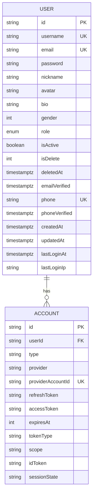
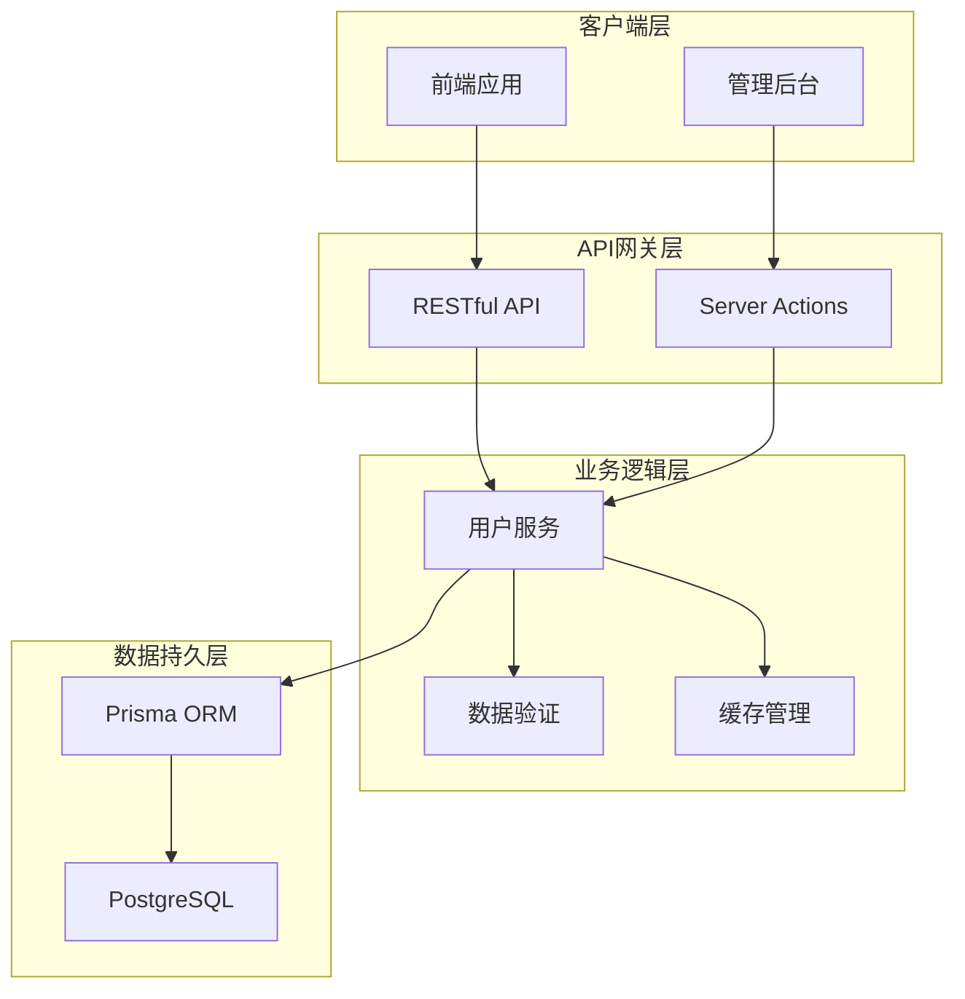
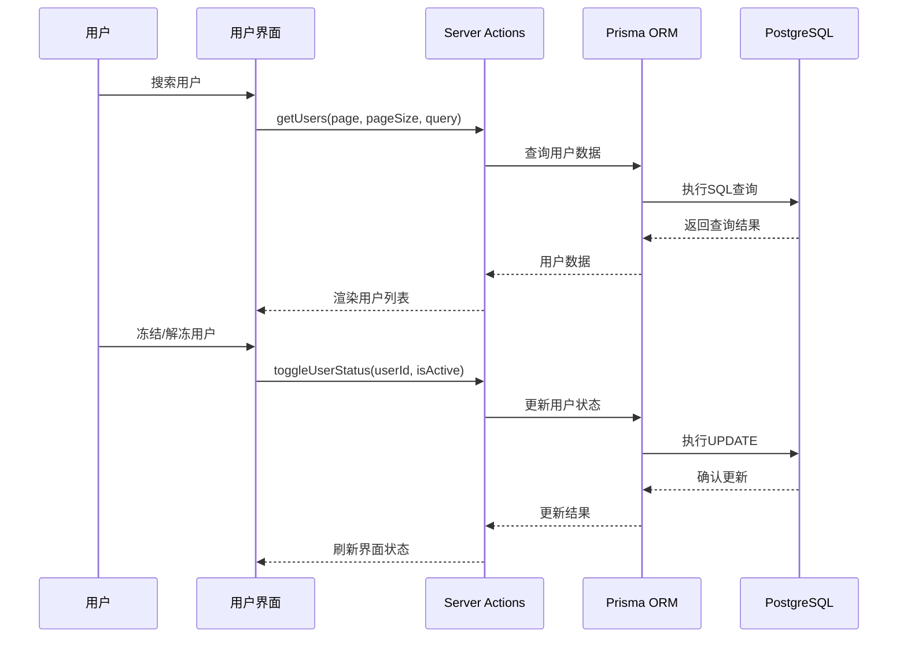
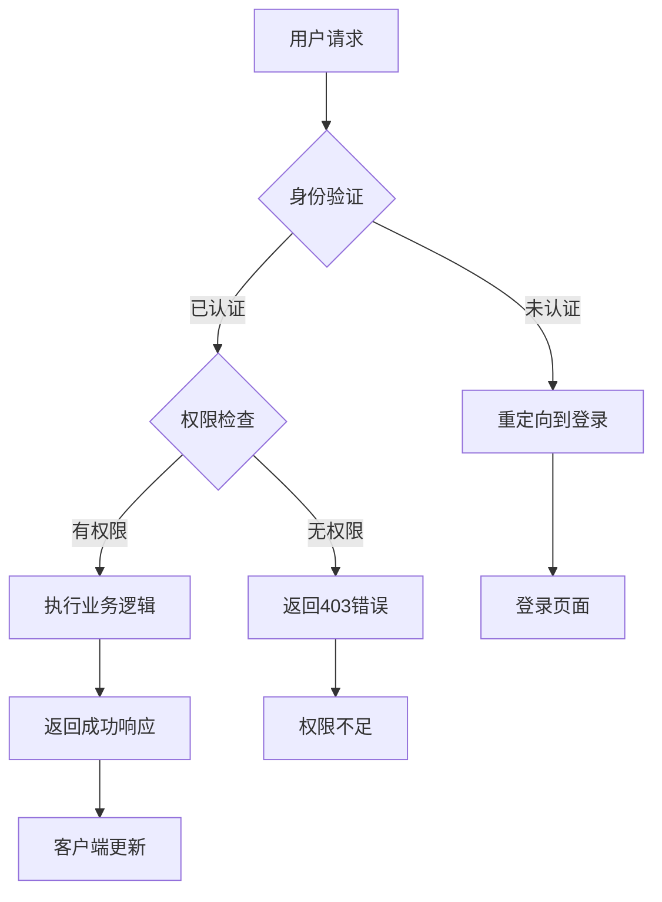
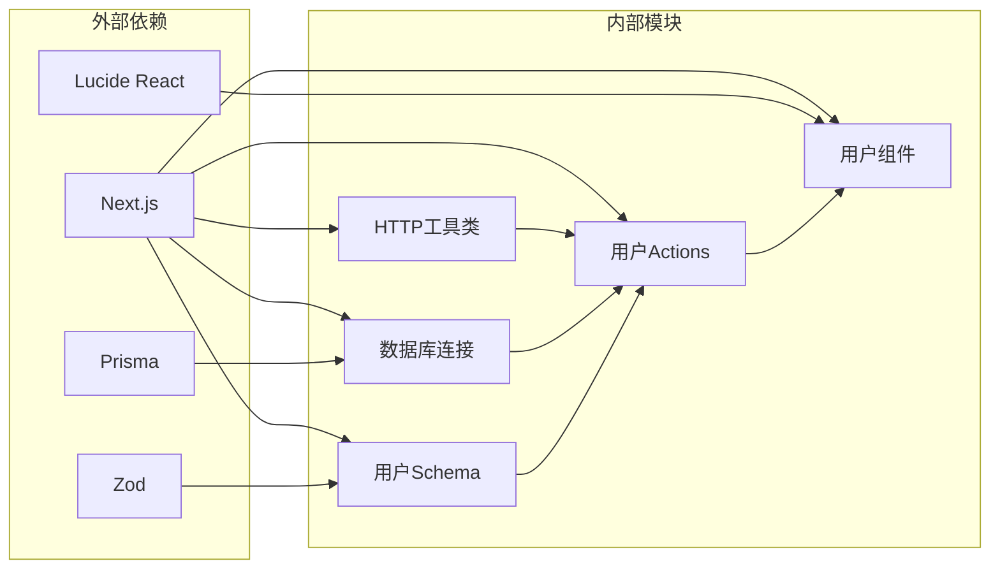

# 用户管理API

<cite>
**本文档引用的文件**
- [src/app/api/users/route.ts](file://src/app/api/users/route.ts)
- [src/app/api/users/[id]/route.ts](file://src/app/api/users/[id]/route.ts)
- [src/app/dashboard/users/actions.ts](file://src/app/dashboard/users/actions.ts)
- [src/app/dashboard/users/schema.ts](file://src/app/dashboard/users/schema.ts)
- [src/app/dashboard/users/components/user-list.tsx](file://src/app/dashboard/users/components/user-list.tsx)
- [src/app/dashboard/users/page.tsx](file://src/app/dashboard/users/page.tsx)
- [src/lib/http.ts](file://src/lib/http.ts)
- [src/lib/db.ts](file://src/lib/db.ts)
- [prisma/schema.prisma](file://prisma/schema.prisma)
- [src/middleware.ts](file://src/middleware.ts)
- [src/store/user-store.ts](file://src/store/user-store.ts)
</cite>

## 目录
1. [简介](#简介)
2. [项目结构](#项目结构)
3. [核心组件](#核心组件)
4. [架构概览](#架构概览)
5. [详细组件分析](#详细组件分析)
6. [依赖关系分析](#依赖关系分析)
7. [性能考虑](#性能考虑)
8. [故障排除指南](#故障排除指南)
9. [结论](#结论)

## 简介

用户管理API是Ground Hog项目中的核心功能模块，提供了完整的用户生命周期管理能力。该系统支持RESTful API接口和管理后台两种访问方式，实现了用户CRUD操作、搜索过滤、分页处理、权限控制和数据安全保护等关键功能。

系统采用Next.js App Router架构，结合Prisma ORM进行数据库操作，通过中间件实现身份认证和授权控制。用户数据采用软删除机制，支持逻辑删除和恢复操作。

## 项目结构

用户管理功能主要分布在以下目录结构中：

```mermaid
graph TB
subgraph "API层"
A[src/app/api/users/] --> A1[routes.ts]
A --> A2[[id]/routes.ts]
end
subgraph "管理后台"
B[src/app/dashboard/users/] --> B1[actions.ts]
B --> B2[schema.ts]
B --> B3[components/]
B3 --> B4[user-list.tsx]
B --> B5[page.tsx]
end
subgraph "基础设施"
C[src/lib/] --> C1[http.ts]
C --> C2[db.ts]
D[prisma/] --> D1[schema.prisma]
E[src/] --> E1[middleware.ts]
E --> E2[store/user-store.ts]
end
A1 --> C1
A2 --> C1
B1 --> C2
B4 --> B1
B5 --> B1
C2 --> D1
```

**图表来源**
- [src/app/api/users/route.ts:1-74](file://src/app/api/users/route.ts#L1-L74)
- [src/app/dashboard/users/actions.ts:1-149](file://src/app/dashboard/users/actions.ts#L1-L149)

**章节来源**
- [src/app/api/users/route.ts:1-74](file://src/app/api/users/route.ts#L1-L74)
- [src/app/dashboard/users/actions.ts:1-149](file://src/app/dashboard/users/actions.ts#L1-L149)

## 核心组件

### 数据模型设计

用户实体采用Prisma数据模型定义，支持完整的用户信息管理和业务需求：



**图表来源**
- [prisma/schema.prisma:15-62](file://prisma/schema.prisma#L15-L62)

### API响应统一格式

系统采用统一的响应格式，确保前后端交互的一致性：

| 字段 | 类型 | 描述 | 必填 |
|------|------|------|------|
| code | number | HTTP状态码或业务码 | 是 |
| message | string | 响应消息 | 是 |
| data | any | 返回数据 | 否 |

**章节来源**
- [src/lib/http.ts:14-56](file://src/lib/http.ts#L14-L56)

## 架构概览

用户管理系统采用分层架构设计，实现了清晰的关注点分离：



**图表来源**
- [src/app/api/users/route.ts:1-74](file://src/app/api/users/route.ts#L1-L74)
- [src/app/dashboard/users/actions.ts:1-149](file://src/app/dashboard/users/actions.ts#L1-L149)

## 详细组件分析

### RESTful API接口

#### 用户列表查询接口

GET `/api/users`

**请求参数**
- page: number - 页码，默认值: 1
- limit: number - 每页数量，默认值: 10

**响应数据结构**
```json
{
  "code": 200,
  "message": "Users fetched successfully",
  "data": {
    "list": [
      {
        "id": "string",
        "username": "string",
        "email": "string",
        "nickname": "string",
        "avatar": "string",
        "role": "USER|ADMIN",
        "isActive": true,
        "createdAt": "2024-01-01T00:00:00Z"
      }
    ],
    "pagination": {
      "total": 100,
      "page": 1,
      "limit": 10,
      "totalPages": 10
    }
  }
}
```

**章节来源**
- [src/app/api/users/route.ts:4-45](file://src/app/api/users/route.ts#L4-L45)

#### 用户详情获取接口

GET `/api/users/[id]`

**路径参数**
- id: string - 用户ID

**响应数据结构**
```json
{
  "code": 200,
  "message": "操作成功",
  "data": {
    "id": "string",
    "username": "string",
    "email": "string",
    "nickname": "string",
    "avatar": "string",
    "role": "USER|ADMIN",
    "isActive": true,
    "createdAt": "2024-01-01T00:00:00Z"
  }
}
```

**章节来源**
- [src/app/api/users/[id]/route.ts](file://src/app/api/users/[id]/route.ts#L4-L22)

#### 用户创建接口

POST `/api/users`

**请求体参数**
- username: string - 用户名，必填，长度2-50字符
- email: string - 邮箱，必填，有效邮箱格式
- role: string - 角色，默认USER

**响应数据结构**
```json
{
  "code": 201,
  "message": "User created successfully",
  "data": {
    "id": "string",
    "username": "string",
    "email": "string",
    "role": "USER",
    "createdAt": "2024-01-01T00:00:00Z"
  }
}
```

**章节来源**
- [src/app/api/users/route.ts:47-73](file://src/app/api/users/route.ts#L47-L73)

#### 用户更新接口

PATCH `/api/users/[id]`

**请求体参数**
- 支持更新除敏感字段外的所有用户信息

**响应数据结构**
```json
{
  "code": 200,
  "message": "User updated successfully",
  "data": {
    "id": "string",
    "username": "string",
    "email": "string",
    "role": "USER|ADMIN",
    "isActive": true,
    "createdAt": "2024-01-01T00:00:00Z"
  }
}
```

**章节来源**
- [src/app/api/users/[id]/route.ts](file://src/app/api/users/[id]/route.ts#L24-L48)

#### 用户删除接口

DELETE `/api/users/[id]`

**响应数据结构**
```json
{
  "code": 200,
  "message": "User deleted successfully",
  "data": null
}
```

**章节来源**
- [src/app/api/users/[id]/route.ts](file://src/app/api/users/[id]/route.ts#L50-L70)

### 管理后台功能

#### 用户列表组件

管理后台提供了完整的用户管理界面，支持多种操作：



**图表来源**
- [src/app/dashboard/users/actions.ts:9-61](file://src/app/dashboard/users/actions.ts#L9-L61)
- [src/app/dashboard/users/components/user-list.tsx:125-135](file://src/app/dashboard/users/components/user-list.tsx#L125-L135)

#### 数据验证规则

用户表单采用Zod进行数据验证，确保数据完整性：

| 字段 | 验证规则 | 错误消息 |
|------|----------|----------|
| username | 长度2-50字符 | 用户名至少需要2个字符，用户名不能超过50个字符 |
| email | 有效邮箱格式 | 请输入有效的邮箱地址 |
| role | 枚举值USER/ADMIN | 角色必须为USER或ADMIN |
| isActive | 布尔值，默认true | 状态必须为布尔值 |

**章节来源**
- [src/app/dashboard/users/schema.ts:3-10](file://src/app/dashboard/users/schema.ts#L3-L10)

### 权限控制机制

系统采用多层权限控制确保安全性：



**图表来源**
- [src/middleware.ts:8-28](file://src/middleware.ts#L8-L28)

**章节来源**
- [src/middleware.ts:1-35](file://src/middleware.ts#L1-L35)

## 依赖关系分析

用户管理系统的依赖关系如下：



**图表来源**
- [src/lib/http.ts:1-100](file://src/lib/http.ts#L1-L100)
- [src/lib/db.ts:1-16](file://src/lib/db.ts#L1-L16)
- [src/app/dashboard/users/schema.ts:1-13](file://src/app/dashboard/users/schema.ts#L1-L13)

**章节来源**
- [src/lib/http.ts:1-100](file://src/lib/http.ts#L1-L100)
- [src/lib/db.ts:1-16](file://src/lib/db.ts#L1-L16)

## 性能考虑

### 缓存策略

系统采用Next.js缓存机制优化性能：

1. **标签缓存**: 使用`unstable_cache`对用户列表进行缓存
2. **缓存标签**: 通过`revalidateTag`实现精确缓存失效
3. **缓存时间**: 默认缓存5分钟（300秒）

### 数据库优化

1. **索引设计**: 在`isDelete`字段上建立索引，支持快速过滤
2. **查询优化**: 使用`select`指定查询字段，避免N+1查询
3. **批量操作**: 使用`Promise.all`并发执行查询和计数

### 分页实现

```mermaid
flowchart LR
A[请求参数] --> B[计算skip值]
B --> C[执行查询]
C --> D[统计总数]
D --> E[构建响应]
F[分页计算] --> G[totalPages = ceil(total/limit)]
G --> H[边界检查]
```

**图表来源**
- [src/app/api/users/route.ts:6-38](file://src/app/api/users/route.ts#L6-L38)

## 故障排除指南

### 常见错误及解决方案

| 错误类型 | HTTP状态码 | 错误原因 | 解决方案 |
|----------|------------|----------|----------|
| 请求格式错误 | 400 | JSON解析失败 | 检查请求头Content-Type和JSON格式 |
| 用户不存在 | 404 | 用户ID无效 | 验证用户ID是否存在 |
| 服务器内部错误 | 500 | 数据库操作异常 | 检查数据库连接和Prisma配置 |
| 权限不足 | 403 | 未认证或权限不够 | 检查用户认证状态和角色权限 |

### 调试建议

1. **启用开发日志**: 在开发环境查看Prisma查询日志
2. **检查环境变量**: 确保DATABASE_URL配置正确
3. **验证数据模型**: 确认Prisma schema与数据库一致

**章节来源**
- [src/lib/http.ts:42-55](file://src/lib/http.ts#L42-L55)
- [src/lib/db.ts:7-14](file://src/lib/db.ts#L7-L14)

## 结论

用户管理API提供了完整的用户生命周期管理能力，具有以下特点：

1. **功能完整**: 支持用户CRUD操作、搜索过滤、分页处理
2. **安全可靠**: 多层权限控制和数据验证机制
3. **性能优化**: 缓存策略和数据库优化
4. **易于维护**: 清晰的架构设计和统一的响应格式

系统采用现代化的技术栈和最佳实践，为后续功能扩展奠定了良好的基础。建议在生产环境中进一步完善权限控制和监控机制。