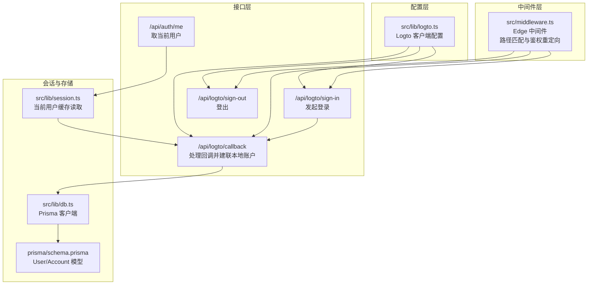
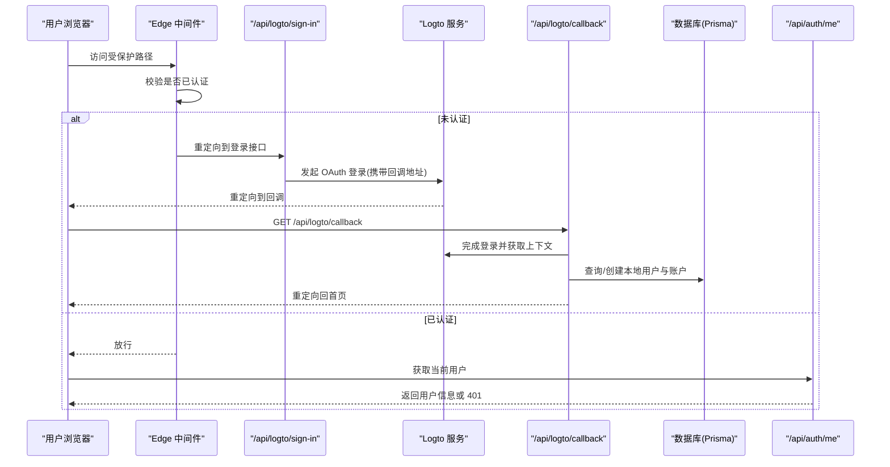
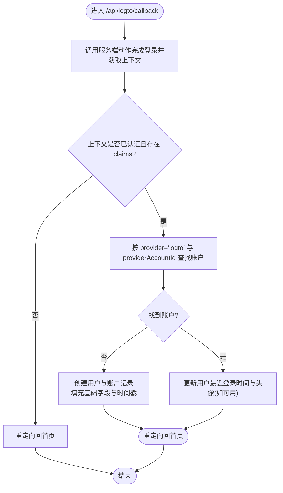
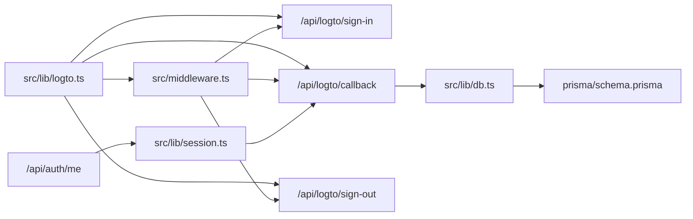
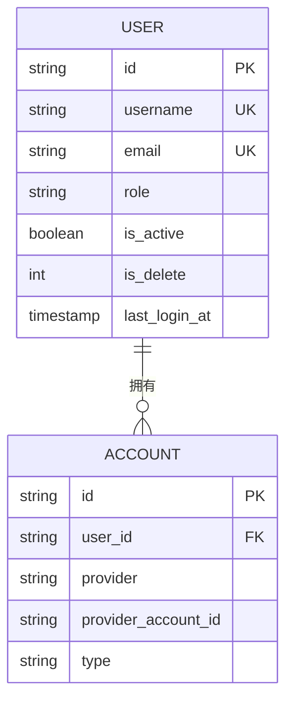

# 认证API

<cite>
**本文引用的文件**
- [src/lib/logto.ts](file://src/lib/logto.ts)
- [src/middleware.ts](file://src/middleware.ts)
- [src/lib/session.ts](file://src/lib/session.ts)
- [src/app/api/auth/me/route.ts](file://src/app/api/auth/me/route.ts)
- [src/app/api/logto/sign-in/route.ts](file://src/app/api/logto/sign-in/route.ts)
- [src/app/api/logto/callback/route.ts](file://src/app/api/logto/callback/route.ts)
- [src/app/api/logto/sign-out/route.ts](file://src/app/api/logto/sign-out/route.ts)
- [src/app/(auth)/login/page.tsx](file://src/app/(auth)/login/page.tsx)
- [src/app/@authModal/(.)login/page.tsx](file://src/app/@authModal/(.)login/page.tsx)
- [src/lib/db.ts](file://src/lib/db.ts)
- [prisma/schema.prisma](file://prisma/schema.prisma)
</cite>

## 目录
1. [引言](#引言)
2. [项目结构](#项目结构)
3. [核心组件](#核心组件)
4. [架构总览](#架构总览)
5. [详细组件分析](#详细组件分析)
6. [依赖关系分析](#依赖关系分析)
7. [性能考量](#性能考量)
8. [故障排查指南](#故障排查指南)
9. [结论](#结论)
10. [附录](#附录)

## 引言
本文件系统性地文档化本项目的认证API与会话机制，覆盖以下方面：
- 用户认证接口：登录、登出、当前用户信息获取
- 与 Logto 的 OAuth 2.0 集成：回调处理、令牌上下文维护、会话建立
- 认证中间件与权限校验流程
- 请求示例、响应格式与错误处理
- 安全考虑与最佳实践（含 CSRF 防护与令牌过期处理）

## 项目结构
认证相关能力由三层协作构成：
- 配置层：Logto 客户端配置与环境变量
- 中间件层：基于 Edge 的访问控制与重定向
- 接口层：OAuth 登录、回调、登出与“取当前用户”API

图表来源
- [src/lib/logto.ts:1-13](file://src/lib/logto.ts#L1-L13)
- [src/middleware.ts:1-36](file://src/middleware.ts#L1-L36)
- [src/app/api/logto/sign-in/route.ts:1-9](file://src/app/api/logto/sign-in/route.ts#L1-L9)
- [src/app/api/logto/callback/route.ts:1-66](file://src/app/api/logto/callback/route.ts#L1-L66)
- [src/app/api/logto/sign-out/route.ts:1-7](file://src/app/api/logto/sign-out/route.ts#L1-L7)
- [src/app/api/auth/me/route.ts:1-13](file://src/app/api/auth/me/route.ts#L1-L13)
- [src/lib/session.ts:1-42](file://src/lib/session.ts#L1-L42)
- [src/lib/db.ts:1-16](file://src/lib/db.ts#L1-L16)
- [prisma/schema.prisma:15-82](file://prisma/schema.prisma#L15-L82)

章节来源
- [src/lib/logto.ts:1-13](file://src/lib/logto.ts#L1-L13)
- [src/middleware.ts:1-36](file://src/middleware.ts#L1-L36)
- [src/app/api/logto/sign-in/route.ts:1-9](file://src/app/api/logto/sign-in/route.ts#L1-L9)
- [src/app/api/logto/callback/route.ts:1-66](file://src/app/api/logto/callback/route.ts#L1-L66)
- [src/app/api/logto/sign-out/route.ts:1-7](file://src/app/api/logto/sign-out/route.ts#L1-L7)
- [src/app/api/auth/me/route.ts:1-13](file://src/app/api/auth/me/route.ts#L1-L13)
- [src/lib/session.ts:1-42](file://src/lib/session.ts#L1-L42)
- [src/lib/db.ts:1-16](file://src/lib/db.ts#L1-L16)
- [prisma/schema.prisma:15-82](file://prisma/schema.prisma#L15-L82)

## 核心组件
- Logto 客户端配置：集中定义 endpoint、appId、scopes、baseUrl、cookieSecret、cookieSecure 等参数，确保与后端服务一致。
- Edge 中间件：对受保护路径（如 /dashboard 与 /admin）进行访问控制，未通过鉴权则重定向至登录接口。
- 登录接口：调用服务端动作发起 OAuth 登录，并设置回调地址为 /api/logto/callback。
- 回调接口：完成登录流程、解析 claims、建立或更新本地用户与账户记录，最后重定向回首页。
- 登出接口：调用服务端动作清除会话并重定向到 baseUrl。
- 当前用户接口：通过缓存化的会话读取器返回当前用户信息，未登录返回 401。

章节来源
- [src/lib/logto.ts:1-13](file://src/lib/logto.ts#L1-L13)
- [src/middleware.ts:15-28](file://src/middleware.ts#L15-L28)
- [src/app/api/logto/sign-in/route.ts:1-9](file://src/app/api/logto/sign-in/route.ts#L1-L9)
- [src/app/api/logto/callback/route.ts:10-65](file://src/app/api/logto/callback/route.ts#L10-L65)
- [src/app/api/logto/sign-out/route.ts:1-7](file://src/app/api/logto/sign-out/route.ts#L1-L7)
- [src/app/api/auth/me/route.ts:1-13](file://src/app/api/auth/me/route.ts#L1-L13)
- [src/lib/session.ts:17-41](file://src/lib/session.ts#L17-L41)

## 架构总览
下图展示从浏览器访问受保护页面到完成会话建立的关键交互：

图表来源
- [src/middleware.ts:15-28](file://src/middleware.ts#L15-L28)
- [src/app/api/logto/sign-in/route.ts:4-8](file://src/app/api/logto/sign-in/route.ts#L4-L8)
- [src/app/api/logto/callback/route.ts:6-65](file://src/app/api/logto/callback/route.ts#L6-L65)
- [src/app/api/auth/me/route.ts:4-12](file://src/app/api/auth/me/route.ts#L4-L12)

## 详细组件分析

### 登录流程（/api/logto/sign-in）
- 功能：发起 OAuth 登录，设置回调地址为 /api/logto/callback。
- 关键点：
  - 使用服务端动作发起登录，确保在服务器侧处理敏感流程。
  - 回调地址由配置中的 baseUrl 与固定路径拼接生成。
- 典型调用方：受保护页面访问被拦截时，中间件重定向至此接口；或直接访问 /login 页面也会被重定向到此接口。

章节来源
- [src/app/api/logto/sign-in/route.ts:1-9](file://src/app/api/logto/sign-in/route.ts#L1-L9)
- [src/app/(auth)/login/page.tsx:1-6](file://src/app/(auth)/login/page.tsx#L1-L6)
- [src/app/@authModal/(.)login/page.tsx:1-6](file://src/app/@authModal/(.)login/page.tsx#L1-L6)

### 回调流程（/api/logto/callback）
- 功能：完成登录、解析 claims、建立或更新本地用户与账户记录，最后重定向回首页。
- 处理逻辑要点：
  - 调用服务端动作完成登录并获取上下文。
  - 若上下文未认证或缺少 claims，则重定向回根路径。
  - 依据 provider=’logto’ 与 providerAccountId=sub 查找账户，若不存在则创建用户与账户记录，否则仅更新最近登录时间与头像。
  - 用户字段包含：username、email、nickname、avatar、role、emailVerified、lastLoginAt 等。
- 数据一致性：
  - 使用 Prisma 访问 User 与 Account 表，Account 以 provider+providerAccountId 唯一索引约束。
  - User 表包含角色、激活状态、删除标记等字段，支持后续权限控制。

图表来源
- [src/app/api/logto/callback/route.ts:6-65](file://src/app/api/logto/callback/route.ts#L6-L65)
- [src/lib/db.ts:1-16](file://src/lib/db.ts#L1-L16)
- [prisma/schema.prisma:15-82](file://prisma/schema.prisma#L15-L82)

章节来源
- [src/app/api/logto/callback/route.ts:6-65](file://src/app/api/logto/callback/route.ts#L6-L65)
- [src/lib/db.ts:1-16](file://src/lib/db.ts#L1-L16)
- [prisma/schema.prisma:15-82](file://prisma/schema.prisma#L15-L82)

### 登出流程（/api/logto/sign-out）
- 功能：调用服务端动作清除会话，重定向到 baseUrl。
- 注意：登出后再次访问受保护资源会被中间件重定向到登录接口。

章节来源
- [src/app/api/logto/sign-out/route.ts:1-7](file://src/app/api/logto/sign-out/route.ts#L1-L7)

### 当前用户接口（/api/auth/me）
- 功能：返回当前登录用户的脱敏信息；未登录返回 401。
- 实现要点：
  - 使用缓存化的会话读取器，同一请求内多次调用仅触发一次上下文校验与一次数据库查询。
  - 返回字段包含 id、username、email、role、nickname、avatar。
- 错误处理：未登录时返回 401 并附带提示消息。

章节来源
- [src/app/api/auth/me/route.ts:1-13](file://src/app/api/auth/me/route.ts#L1-L13)
- [src/lib/session.ts:17-41](file://src/lib/session.ts#L17-L41)

### 中间件与权限校验（Edge 中间件）
- 功能：对受保护路径进行访问控制，未认证则重定向到登录接口。
- 匹配规则：对 /dashboard 与 /admin 下除特定登录页外的路径生效。
- 校验逻辑：读取 Logto 上下文，若未认证或缺少 sub 则重定向至 /api/logto/sign-in。

章节来源
- [src/middleware.ts:15-28](file://src/middleware.ts#L15-L28)

### 登录入口页面
- 功能：简化登录入口，直接重定向到 /api/logto/sign-in。
- 适用场景：常规登录页与拦截式登录模态框均指向统一登录流程。

章节来源
- [src/app/(auth)/login/page.tsx:1-6](file://src/app/(auth)/login/page.tsx#L1-L6)
- [src/app/@authModal/(.)login/page.tsx:1-6](file://src/app/@authModal/(.)login/page.tsx#L1-L6)

## 依赖关系分析
- 配置依赖：所有认证接口共享同一 Logto 客户端配置，确保 endpoint、appId、scopes、baseUrl、cookieSecret、cookieSecure 一致。
- 运行时依赖：Edge 中间件依赖 Logto 客户端读取上下文；服务端动作负责登录、回调处理与上下文获取。
- 存储依赖：回调流程依赖 Prisma 访问 User 与 Account 表；当前用户接口依赖会话读取器与数据库查询。
- 路由依赖：登录与回调接口相互配合完成 OAuth 流程；中间件与登录接口共同构成访问控制链路。

图表来源
- [src/lib/logto.ts:1-13](file://src/lib/logto.ts#L1-L13)
- [src/middleware.ts:1-36](file://src/middleware.ts#L1-L36)
- [src/app/api/logto/sign-in/route.ts:1-9](file://src/app/api/logto/sign-in/route.ts#L1-L9)
- [src/app/api/logto/callback/route.ts:1-66](file://src/app/api/logto/callback/route.ts#L1-L66)
- [src/app/api/logto/sign-out/route.ts:1-7](file://src/app/api/logto/sign-out/route.ts#L1-L7)
- [src/app/api/auth/me/route.ts:1-13](file://src/app/api/auth/me/route.ts#L1-L13)
- [src/lib/session.ts:1-42](file://src/lib/session.ts#L1-L42)
- [src/lib/db.ts:1-16](file://src/lib/db.ts#L1-L16)
- [prisma/schema.prisma:15-82](file://prisma/schema.prisma#L15-L82)

章节来源
- [src/lib/logto.ts:1-13](file://src/lib/logto.ts#L1-L13)
- [src/middleware.ts:1-36](file://src/middleware.ts#L1-L36)
- [src/app/api/logto/sign-in/route.ts:1-9](file://src/app/api/logto/sign-in/route.ts#L1-L9)
- [src/app/api/logto/callback/route.ts:1-66](file://src/app/api/logto/callback/route.ts#L1-L66)
- [src/app/api/logto/sign-out/route.ts:1-7](file://src/app/api/logto/sign-out/route.ts#L1-L7)
- [src/app/api/auth/me/route.ts:1-13](file://src/app/api/auth/me/route.ts#L1-L13)
- [src/lib/session.ts:1-42](file://src/lib/session.ts#L1-L42)
- [src/lib/db.ts:1-16](file://src/lib/db.ts#L1-L16)
- [prisma/schema.prisma:15-82](file://prisma/schema.prisma#L15-L82)

## 性能考量
- 请求级去重：当前用户读取使用 React cache 对同一请求内的多次调用进行去重，减少重复的会话校验与数据库查询。
- 并行化：在需要同时获取多个数据源时，应尽早启动独立操作并使用 Promise.all 等技术提升吞吐。
- 缓存策略：结合 Next.js 缓存与数据库查询优化，降低热路径上的延迟。

章节来源
- [src/lib/session.ts:15-16](file://src/lib/session.ts#L15-L16)
- [src/app/api/logto/callback/route.ts:21-62](file://src/app/api/logto/callback/route.ts#L21-L62)

## 故障排查指南
- 未登录访问受保护资源
  - 现象：被中间件重定向到登录接口或返回 401。
  - 排查：确认是否已通过 /api/logto/sign-in 完成登录；检查 Cookie 与 baseUrl 设置。
- 回调后无法建立本地账户
  - 现象：登录成功但未创建用户/账户记录。
  - 排查：确认回调中 claims 字段是否包含 sub、username、email、name、picture；检查 Account 表唯一索引与 User 表字段映射。
- 登出后仍显示已登录
  - 现象：调用登出接口后仍可访问受保护资源。
  - 排查：确认登出接口是否正确执行；检查 Cookie 清除与 baseUrl 重定向行为。
- 当前用户接口返回 401
  - 现象：调用 /api/auth/me 返回 401。
  - 排查：确认会话上下文是否有效；检查 claims.sub 是否存在；确认数据库中是否存在对应账户。

章节来源
- [src/middleware.ts:21-25](file://src/middleware.ts#L21-L25)
- [src/app/api/logto/callback/route.ts:14-16](file://src/app/api/logto/callback/route.ts#L14-L16)
- [src/app/api/logto/callback/route.ts:19-62](file://src/app/api/logto/callback/route.ts#L19-L62)
- [src/app/api/logto/sign-out/route.ts:4-6](file://src/app/api/logto/sign-out/route.ts#L4-L6)
- [src/app/api/auth/me/route.ts:7-9](file://src/app/api/auth/me/route.ts#L7-L9)

## 结论
本项目采用 Edge 中间件 + Logto OAuth 2.0 的组合方案，实现了简洁而可靠的认证与授权流程。登录、回调、登出与当前用户接口职责清晰，配合会话缓存与数据库模型，满足日常业务需求。建议在 Server Actions 等可直接调用的端点中同样进行鉴权与授权校验，确保整体安全边界一致。

## 附录

### 接口定义与示例

- 获取当前用户
  - 方法：GET
  - 路径：/api/auth/me
  - 成功响应：包含 code 与 data（用户对象）
  - 未登录响应：code 为 401，message 为未登录提示
  - 示例请求：curl -i https://your-site.com/api/auth/me
  - 示例响应（成功）：{"code":200,"data":{"id":"...","username":"john","email":"john@example.com","role":"USER","nickname":"John","avatar":null}}
  - 示例响应（未登录）：{"code":401,"message":"未登录"}

- 登录
  - 方法：GET
  - 路径：/api/logto/sign-in
  - 行为：重定向至 Logto 登录页面（回调地址为 /api/logto/callback）

- 回调
  - 方法：GET
  - 路径：/api/logto/callback
  - 行为：完成登录、建立/更新本地账户，重定向回首页

- 登出
  - 方法：GET
  - 路径：/api/logto/sign-out
  - 行为：清除会话并重定向至 baseUrl

章节来源
- [src/app/api/auth/me/route.ts:1-13](file://src/app/api/auth/me/route.ts#L1-L13)
- [src/app/api/logto/sign-in/route.ts:1-9](file://src/app/api/logto/sign-in/route.ts#L1-L9)
- [src/app/api/logto/callback/route.ts:1-66](file://src/app/api/logto/callback/route.ts#L1-L66)
- [src/app/api/logto/sign-out/route.ts:1-7](file://src/app/api/logto/sign-out/route.ts#L1-L7)

### 数据模型概览（认证相关）
- User：用户主表，包含 id、username、email、role、isActive、isDelete、lastLoginAt 等字段。
- Account：账户关联表，包含 provider、providerAccountId、type、userId 等，唯一约束为 provider+providerAccountId。

图表来源
- [prisma/schema.prisma:15-82](file://prisma/schema.prisma#L15-L82)

章节来源
- [prisma/schema.prisma:15-82](file://prisma/schema.prisma#L15-L82)

### 安全考虑与最佳实践
- CSRF 防护：当前实现依赖 Cookie 与服务端动作，建议在前端表单提交时引入一次性 token 或使用 SameSite Cookie 策略加强防护。
- 令牌过期处理：利用 Logto 的会话上下文自动刷新与过期检测；在客户端定期调用 /api/auth/me 进行健康检查，发现异常及时引导重新登录。
- 权限验证：在 Server Actions 中同样进行鉴权与授权校验，避免仅依赖页面级或中间件级保护。
- 会话续期：在用户活跃期间保持 lastLoginAt 更新，结合前端心跳与后端会话上下文维持登录状态。

章节来源
- [src/lib/session.ts:17-41](file://src/lib/session.ts#L17-L41)
- [src/middleware.ts:21-25](file://src/middleware.ts#L21-L25)
- [src/app/api/logto/callback/route.ts:54-62](file://src/app/api/logto/callback/route.ts#L54-L62)