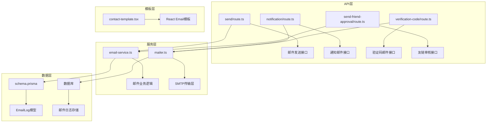
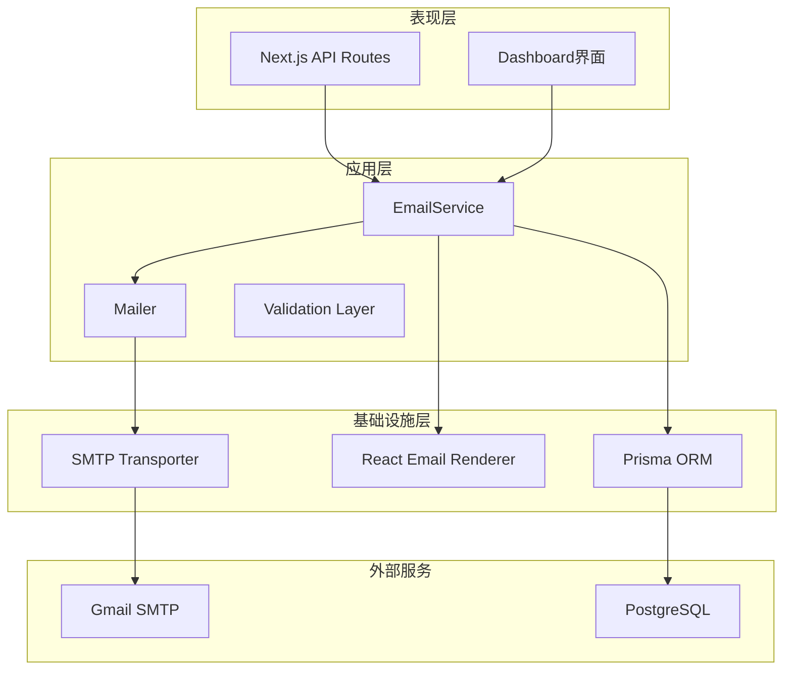
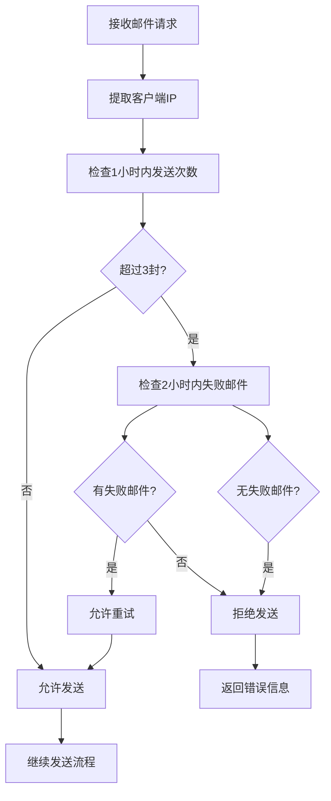
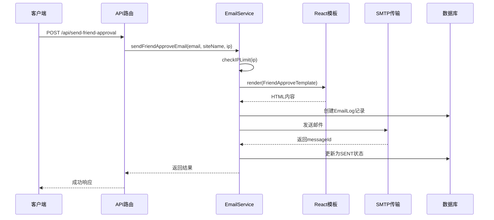
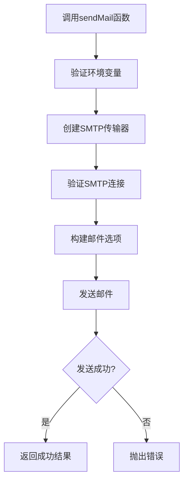
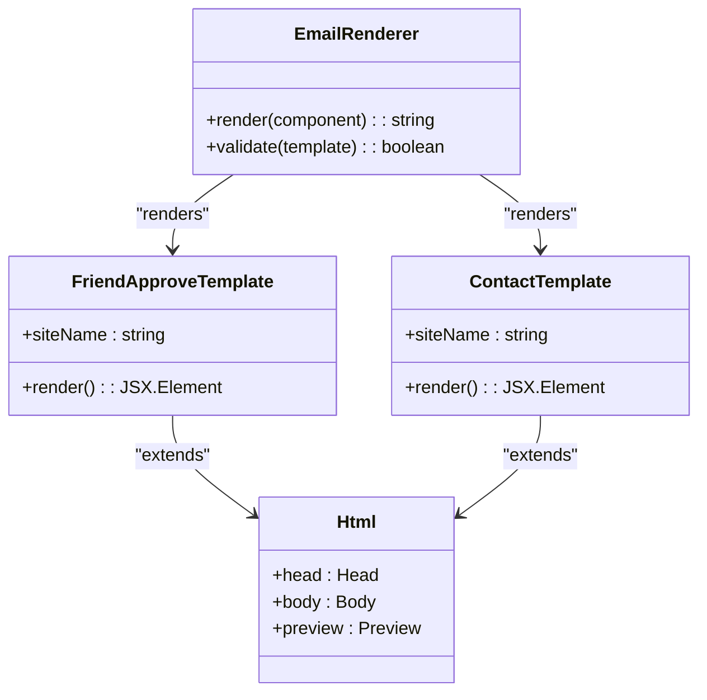
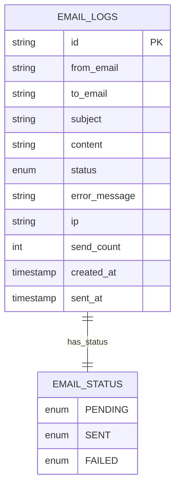
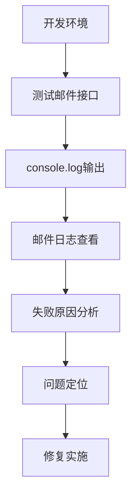

# 通知邮件API

<cite>
**本文档引用的文件**
- [email-service.ts](file://src/lib/email-service.ts)
- [mailer.ts](file://src/lib/mailer.ts)
- [route.ts](file://src/app/api/send/route.ts)
- [notification/route.ts](file://src/app/api/send/notification/route.ts)
- [verification-code/route.ts](file://src/app/api/send/verification-code/route.ts)
- [send-friend-approval/route.ts](file://src/app/api/send-friend-approval/route.ts)
- [contact-template.tsx](file://src/app/dashboard/friend-links/components/contact-template.tsx)
- [schema.prisma](file://prisma/schema.prisma)
- [env.ts](file://src/lib/env.ts)
- [email-logs-wrapper.tsx](file://src/app/dashboard/email-logs/components/email-logs-wrapper.tsx)
- [actions.ts](file://src/app/dashboard/email-logs/actions.ts)
- [test-mail/route.ts](file://src/app/api/test-mail/route.ts)
- [package.json](file://package.json)
</cite>

## 目录
1. [简介](#简介)
2. [项目结构](#项目结构)
3. [核心组件](#核心组件)
4. [架构概览](#架构概览)
5. [详细组件分析](#详细组件分析)
6. [依赖关系分析](#依赖关系分析)
7. [性能考虑](#性能考虑)
8. [故障排除指南](#故障排除指南)
9. [结论](#结论)

## 简介

通知邮件API是一个基于Next.js构建的现代化邮件服务系统，提供了完整的邮件发送功能，包括友链审核通知、验证码发送、系统通知等多种场景。该系统集成了React Email模板引擎，支持SMTP配置、模板管理、批量发送、失败重试等高级功能，并具备完善的邮件发送状态跟踪、日志记录和错误处理机制。

## 项目结构

通知邮件API采用模块化的架构设计，主要分为以下几个核心模块：



**图表来源**
- [route.ts:1-150](file://src/app/api/send/route.ts#L1-L150)
- [email-service.ts:1-215](file://src/lib/email-service.ts#L1-L215)
- [mailer.ts:1-156](file://src/lib/mailer.ts#L1-L156)

**章节来源**
- [route.ts:1-150](file://src/app/api/send/route.ts#L1-L150)
- [email-service.ts:1-215](file://src/lib/email-service.ts#L1-L215)
- [mailer.ts:1-156](file://src/lib/mailer.ts#L1-L156)

## 核心组件

### 邮件服务核心功能

通知邮件API的核心功能围绕三个主要组件构建：

1. **邮件发送服务** (`email-service.ts`)
2. **SMTP传输层** (`mailer.ts`)
3. **React Email模板系统** (`contact-template.tsx`)

这些组件协同工作，提供了从邮件发送到状态跟踪的完整解决方案。

**章节来源**
- [email-service.ts:1-215](file://src/lib/email-service.ts#L1-L215)
- [mailer.ts:1-156](file://src/lib/mailer.ts#L1-L156)
- [contact-template.tsx:1-58](file://src/app/dashboard/friend-links/components/contact-template.tsx#L1-L58)

## 架构概览

通知邮件API采用了分层架构设计，确保了代码的可维护性和扩展性：



**图表来源**
- [email-service.ts:1-215](file://src/lib/email-service.ts#L1-L215)
- [mailer.ts:1-156](file://src/lib/mailer.ts#L1-L156)
- [schema.prisma:243-260](file://prisma/schema.prisma#L243-L260)

## 详细组件分析

### 邮件发送服务 (EmailService)

EmailService是整个邮件系统的核心业务逻辑层，负责处理各种邮件发送场景和业务规则。

#### IP限制检查机制

系统实现了智能的IP限制机制，防止滥用和垃圾邮件：



**图表来源**
- [email-service.ts:11-55](file://src/lib/email-service.ts#L11-L55)

#### 友链审核邮件发送

友链审核邮件是系统的核心功能之一，专门用于通知网站管理员友链申请的状态变更：



**图表来源**
- [send-friend-approval/route.ts:1-44](file://src/app/api/send-friend-approval/route.ts#L1-L44)
- [email-service.ts:58-123](file://src/lib/email-service.ts#L58-L123)
- [contact-template.tsx:1-58](file://src/app/dashboard/friend-links/components/contact-template.tsx#L1-L58)

**章节来源**
- [email-service.ts:58-123](file://src/lib/email-service.ts#L58-L123)
- [send-friend-approval/route.ts:1-44](file://src/app/api/send-friend-approval/route.ts#L1-L44)

### SMTP传输层 (Mailer)

Mailer组件负责与Gmail SMTP服务器的直接通信，实现了安全可靠的邮件传输。

#### SMTP配置和认证

系统使用Gmail的SSL加密连接，确保邮件传输的安全性：

| 配置项 | 值 | 说明 |
|--------|-----|------|
| 主机 | smtp.gmail.com | Gmail SMTP服务器 |
| 端口 | 465 | SSL加密端口 |
| 安全协议 | SSL | 使用SSL加密 |
| 认证方式 | 应用专用密码 | 使用Gmail应用密码 |

#### 邮件发送流程



**图表来源**
- [mailer.ts:31-64](file://src/lib/mailer.ts#L31-L64)

**章节来源**
- [mailer.ts:1-156](file://src/lib/mailer.ts#L1-L156)
- [env.ts:1-40](file://src/lib/env.ts#L1-L40)

### React Email模板系统

系统采用React Email框架，提供了强大的HTML模板渲染能力。

#### 模板架构



**图表来源**
- [contact-template.tsx:1-58](file://src/app/dashboard/friend-links/components/contact-template.tsx#L1-L58)
- [email-service.ts:4-4](file://src/lib/email-service.ts#L4-L4)

#### 模板特性

- **响应式设计**：适配各种设备和邮件客户端
- **样式隔离**：使用内联CSS确保兼容性
- **动态内容**：支持运行时数据注入
- **预览支持**：提供邮件预览文本

**章节来源**
- [contact-template.tsx:1-58](file://src/app/dashboard/friend-links/components/contact-template.tsx#L1-L58)

### 邮件日志管理系统

系统实现了完整的邮件发送日志记录和追踪机制。

#### 日志数据模型



**图表来源**
- [schema.prisma:243-260](file://prisma/schema.prisma#L243-L260)

#### 日志管理功能

- **实时监控**：Dashboard界面展示邮件发送状态
- **失败重试**：支持自动重试失败的邮件
- **缓存优化**：使用Next.js缓存机制提升性能
- **统计分析**：提供发送成功率和趋势分析

**章节来源**
- [schema.prisma:243-260](file://prisma/schema.prisma#L243-L260)
- [email-logs-wrapper.tsx:1-22](file://src/app/dashboard/email-logs/components/email-logs-wrapper.tsx#L1-L22)
- [actions.ts:1-64](file://src/app/dashboard/email-logs/actions.ts#L1-L64)

## 依赖关系分析

通知邮件API的依赖关系清晰明确，遵循了单一职责原则：

```mermaid
graph LR
subgraph "外部依赖"
A[nodemailer] --> B[SMTP客户端]
C[@react-email/render] --> D[模板渲染]
E[zod] --> F[数据验证]
G[prisma] --> H[数据库ORM]
end
subgraph "内部模块"
I[env.ts] --> J[环境配置]
K[mailer.ts] --> L[SMTP传输]
M[email-service.ts] --> N[业务逻辑]
O[API routes] --> P[HTTP接口]
end
J --> K
L --> M
K --> M
M --> O
N --> O
H --> M
D --> M
```

**图表来源**
- [package.json:11-79](file://package.json#L11-L79)
- [mailer.ts:1-6](file://src/lib/mailer.ts#L1-L6)
- [email-service.ts:1-5](file://src/lib/email-service.ts#L1-L5)

**章节来源**
- [package.json:11-79](file://package.json#L11-L79)

## 性能考虑

### 缓存策略

系统采用了多层次的缓存机制来提升性能：

1. **数据库查询缓存**：使用Next.js的unstable_cache包装器
2. **页面级缓存**：针对Dashboard界面的特定缓存标签
3. **自动失效**：30秒的缓存失效时间平衡实时性

### 并发控制

- **IP限制**：防止恶意刷屏和滥用
- **连接池管理**：合理管理SMTP连接资源
- **异步处理**：非阻塞的邮件发送流程

### 错误恢复

- **自动重试**：失败邮件的智能重试机制
- **降级策略**：网络异常时的优雅降级
- **监控告警**：发送失败的实时通知

## 故障排除指南

### 常见问题诊断

#### SMTP认证失败

**症状**：邮件发送时报错"缺少Gmail配置"

**解决方案**：
1. 检查环境变量是否正确设置
2. 验证应用专用密码的有效性
3. 确认Gmail账户的两步验证已启用

#### 邮件发送超时

**症状**：邮件发送请求长时间无响应

**解决方案**：
1. 检查网络连接稳定性
2. 验证SMTP服务器可达性
3. 查看防火墙设置

#### 模板渲染错误

**症状**：友链审核邮件显示空白或格式错误

**解决方案**：
1. 验证React Email组件的正确性
2. 检查模板数据的完整性
3. 确认CSS样式的兼容性

### 调试工具

系统提供了多种调试和监控工具：



**图表来源**
- [test-mail/route.ts:1-20](file://src/app/api/test-mail/route.ts#L1-L20)

**章节来源**
- [test-mail/route.ts:1-20](file://src/app/api/test-mail/route.ts#L1-L20)

## 结论

通知邮件API是一个功能完整、架构清晰的邮件服务系统。它通过合理的模块划分、完善的错误处理机制和丰富的监控功能，为企业级应用提供了可靠的邮件发送解决方案。

### 主要优势

1. **模块化设计**：清晰的职责分离便于维护和扩展
2. **安全性保障**：多重防护机制防止滥用和攻击
3. **可观测性**：完整的日志记录和状态追踪
4. **性能优化**：智能缓存和并发控制机制
5. **易用性**：简洁的API接口和丰富的模板系统

### 未来改进方向

1. **多SMTP提供商支持**：扩展对其他邮件服务商的支持
2. **批量发送优化**：实现更高效的批量邮件发送
3. **国际化支持**：增强多语言模板管理能力
4. **性能监控**：集成更详细的性能指标监控
5. **安全审计**：增加邮件发送行为的审计功能

该系统为后续的功能扩展和企业级部署奠定了坚实的基础，能够满足各种规模的应用需求。