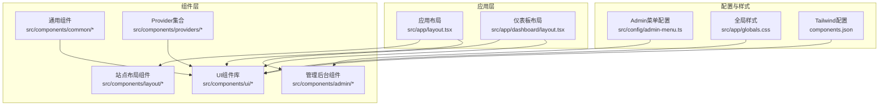
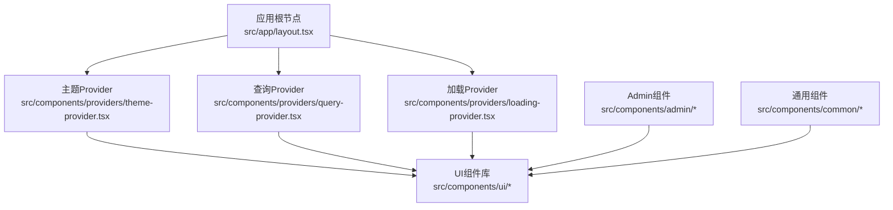
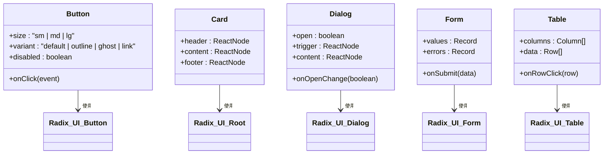
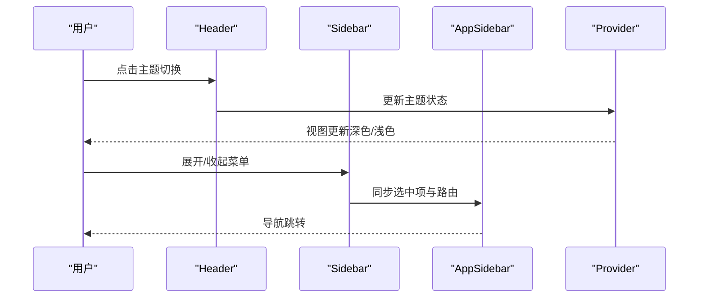
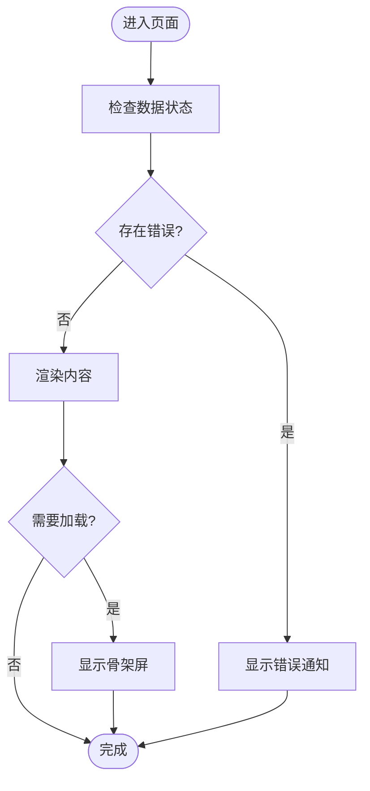
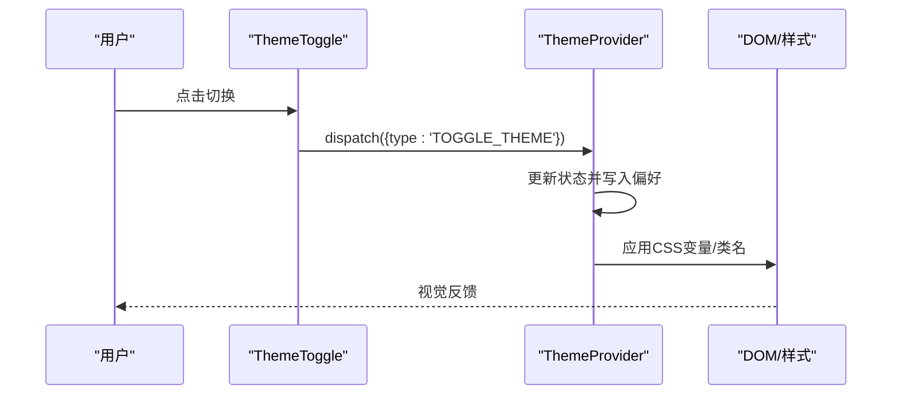
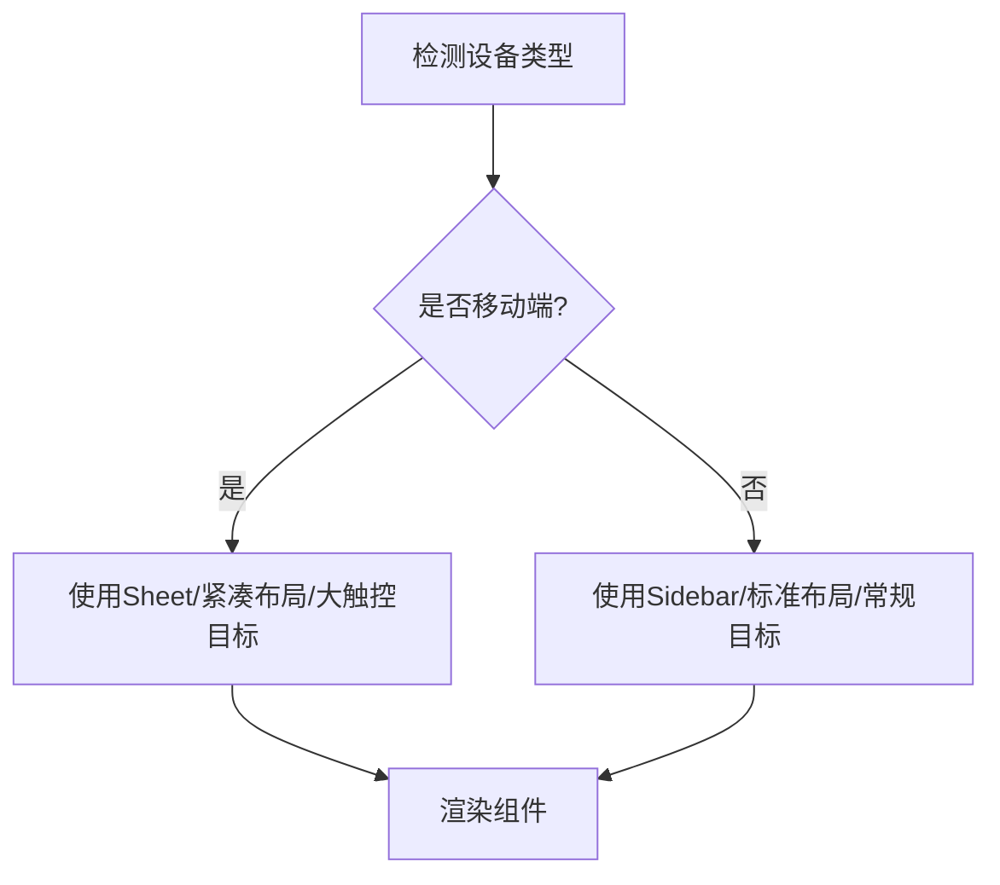
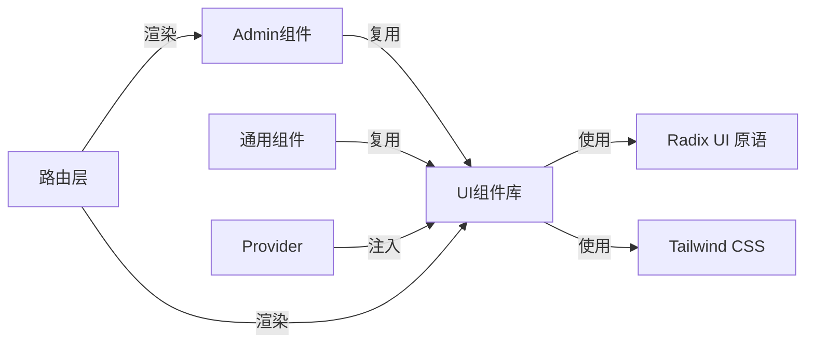

# UI组件系统

<cite>
**本文档引用的文件**
- [button.tsx](file://src/components/ui/button.tsx)
- [card.tsx](file://src/components/ui/card.tsx)
- [dialog.tsx](file://src/components/ui/dialog.tsx)
- [form.tsx](file://src/components/ui/form.tsx)
- [table.tsx](file://src/components/ui/table.tsx)
- [alert-dialog.tsx](file://src/components/ui/alert-dialog.tsx)
- [avatar.tsx](file://src/components/ui/avatar.tsx)
- [badge.tsx](file://src/components/ui/badge.tsx)
- [carousel.tsx](file://src/components/ui/carousel.tsx)
- [collapsible.tsx](file://src/components/ui/collapsible.tsx)
- [dropdown-menu.tsx](file://src/components/ui/dropdown-menu.tsx)
- [image-upload.tsx](file://src/components/ui/image-upload.tsx)
- [input.tsx](file://src/components/ui/input.tsx)
- [label.tsx](file://src/components/ui/label.tsx)
- [navigation-menu.tsx](file://src/components/ui/navigation-menu.tsx)
- [pagination.tsx](file://src/components/ui/pagination.tsx)
- [scroll-area.tsx](file://src/components/ui/scroll-area.tsx)
- [select.tsx](file://src/components/ui/select.tsx)
- [separator.tsx](file://src/components/ui/separator.tsx)
- [sheet.tsx](file://src/components/ui/sheet.tsx)
- [sidebar.tsx](file://src/components/ui/sidebar.tsx)
- [skeleton.tsx](file://src/components/ui/skeleton.tsx)
- [slider.tsx](file://src/components/ui/slider.tsx)
- [sonner.tsx](file://src/components/ui/sonner.tsx)
- [switch.tsx](file://src/components/ui/switch.tsx)
- [tabs.tsx](file://src/components/ui/tabs.tsx)
- [textarea.tsx](file://src/components/ui/textarea.tsx)
- [tooltip.tsx](file://src/components/ui/tooltip.tsx)
- [theme-provider.tsx](file://src/components/providers/theme-provider.tsx)
- [theme-toggle.tsx](file://src/components/theme-toggle.tsx)
- [loading.tsx](file://src/components/common/loading.tsx)
- [use-mobile.ts](file://src/hooks/use-mobile.ts)
- [main-nav.tsx](file://src/components/layout/main-nav.tsx)
- [site-footer.tsx](file://src/components/layout/site-footer.tsx)
- [app-sidebar.tsx](file://src/components/admin/app-sidebar.tsx)
- [header.tsx](file://src/components/admin/header.tsx)
- [sidebar.tsx](file://src/components/admin/sidebar.tsx)
- [admin-layout-client.tsx](file://src/app/dashboard/components/admin-layout-client.tsx)
- [admin-menu.ts](file://src/config/admin-menu.ts)
- [globals.css](file://src/app/globals.css)
- [layout.tsx](file://src/app/layout.tsx)
- [dashboard-layout.tsx](file://src/app/dashboard/layout.tsx)
- [loading-provider.tsx](file://src/components/providers/loading-provider.tsx)
- [query-provider.tsx](file://src/components/providers/query-provider.tsx)
- [components.json](file://components.json)
- [package.json](file://package.json)
</cite>

## 目录
1. [简介](#简介)
2. [项目结构](#项目结构)
3. [核心组件](#核心组件)
4. [架构总览](#架构总览)
5. [详细组件分析](#详细组件分析)
6. [依赖关系分析](#依赖关系分析)
7. [性能考虑](#性能考虑)
8. [故障排除指南](#故障排除指南)
9. [结论](#结论)
10. [附录](#附录)

## 简介
本文件系统化梳理“一梦五千年”项目的UI组件体系，围绕基于 Radix UI 和 Tailwind CSS 的组件库进行深入解析，覆盖基础组件（Button、Card、Dialog、Form、Table 等）、Admin 管理组件系统（侧边栏、头部导航、布局）、通用组件（Loading、错误通知）、主题切换与深色模式、响应式设计策略，并提供使用示例、属性说明、样式定制指南、测试策略、可访问性支持与性能优化建议，以及扩展机制与新组件开发规范。

## 项目结构
项目采用按功能域分层的组织方式：页面路由位于 `src/app`，UI 组件集中在 `src/components/ui`，站点级布局组件在 `src/components/layout`，管理后台组件在 `src/components/admin`，全局主题与加载状态通过 Provider 管理，响应式工具与 Hook 放置在 `src/hooks`，样式入口在 `src/app/globals.css`。

图表来源
- [layout.tsx](file://src/app/layout.tsx)
- [dashboard-layout.tsx](file://src/app/dashboard/layout.tsx)
- [button.tsx](file://src/components/ui/button.tsx)
- [main-nav.tsx](file://src/components/layout/main-nav.tsx)
- [app-sidebar.tsx](file://src/components/admin/app-sidebar.tsx)
- [admin-menu.ts](file://src/config/admin-menu.ts)
- [globals.css](file://src/app/globals.css)
- [components.json](file://components.json)

章节来源
- [layout.tsx](file://src/app/layout.tsx)
- [dashboard-layout.tsx](file://src/app/dashboard/layout.tsx)
- [components.json](file://components.json)

## 核心组件
本节聚焦基础UI组件库，这些组件统一基于 Radix UI 原语构建，结合 Tailwind CSS 实现一致的视觉与交互体验。核心组件包括按钮、卡片、对话框、表单、表格等，均遵循可组合、可扩展、可访问的设计原则。

- 按钮 Button：提供多种尺寸、变体与禁用态，支持图标与加载态。
- 卡片 Card：用于信息分组展示，支持标题、描述与操作区域。
- 对话框 Dialog：提供模态与非模态两种打开方式，支持键盘无障碍与背景遮罩。
- 表单 Form：集成受控/非受控表单场景，配合字段校验与错误提示。
- 表格 Table：支持排序、分页、选择与空态展示。

章节来源
- [button.tsx](file://src/components/ui/button.tsx)
- [card.tsx](file://src/components/ui/card.tsx)
- [dialog.tsx](file://src/components/ui/dialog.tsx)
- [form.tsx](file://src/components/ui/form.tsx)
- [table.tsx](file://src/components/ui/table.tsx)

## 架构总览
UI组件系统由三层构成：基础原语层（Radix UI）、样式层（Tailwind CSS）、业务组件层（Form/Table/Button等）。主题与加载状态通过 Provider 注入到应用根部，Admin 系统在仪表板路由下复用 UI 原语与 Provider，形成统一的风格与行为。

图表来源
- [layout.tsx](file://src/app/layout.tsx)
- [theme-provider.tsx](file://src/components/providers/theme-provider.tsx)
- [query-provider.tsx](file://src/components/providers/query-provider.tsx)
- [loading-provider.tsx](file://src/components/providers/loading-provider.tsx)
- [button.tsx](file://src/components/ui/button.tsx)
- [app-sidebar.tsx](file://src/components/admin/app-sidebar.tsx)

## 详细组件分析

### 基础组件库（Button、Card、Dialog、Form、Table）
- 设计模式
  - 可组合性：以 Radix UI 原语为基础，通过组合器模式实现不同变体与尺寸。
  - 可访问性：遵循 ARIA 规范，提供键盘导航与焦点管理。
  - 主题一致性：通过 Tailwind 类名与 CSS 变量实现浅/深色模式切换。
- 数据流
  - 事件回调（如 onClick）经由组件向上冒泡至父容器或页面逻辑。
  - 表单类组件通过受控/非受控模式与外部状态同步。
- 错误处理
  - 提供默认占位与错误提示，避免渲染崩溃。
- 性能
  - 使用 React.memo 与 useMemo 缓存计算结果；避免不必要的重渲染。

图表来源
- [button.tsx](file://src/components/ui/button.tsx)
- [card.tsx](file://src/components/ui/card.tsx)
- [dialog.tsx](file://src/components/ui/dialog.tsx)
- [form.tsx](file://src/components/ui/form.tsx)
- [table.tsx](file://src/components/ui/table.tsx)

章节来源
- [button.tsx](file://src/components/ui/button.tsx)
- [card.tsx](file://src/components/ui/card.tsx)
- [dialog.tsx](file://src/components/ui/dialog.tsx)
- [form.tsx](file://src/components/ui/form.tsx)
- [table.tsx](file://src/components/ui/table.tsx)

### Admin 组件系统（侧边栏、头部导航、布局）
- 侧边栏 AppSidebar/Sidebar：基于可折叠与层级菜单，支持图标、文本与子项展开。
- 头部导航 Header：集成用户头像、通知、主题切换与退出登录。
- 布局组件：Dashboard 页面通过客户端布局组件注入 Admin 结构，确保导航与内容区域协调。

图表来源
- [header.tsx](file://src/components/admin/header.tsx)
- [sidebar.tsx](file://src/components/admin/sidebar.tsx)
- [app-sidebar.tsx](file://src/components/admin/app-sidebar.tsx)
- [theme-provider.tsx](file://src/components/providers/theme-provider.tsx)

章节来源
- [app-sidebar.tsx](file://src/components/admin/app-sidebar.tsx)
- [header.tsx](file://src/components/admin/header.tsx)
- [sidebar.tsx](file://src/components/admin/sidebar.tsx)
- [admin-layout-client.tsx](file://src/app/dashboard/components/admin-layout-client.tsx)
- [admin-menu.ts](file://src/config/admin-menu.ts)

### 通用组件（Loading、错误处理）
- Loading：提供骨架屏与全屏加载两种形态，支持全局与局部加载。
- 错误处理：通过通知组件（Sonner）与对话框呈现错误信息，支持重试与关闭。

图表来源
- [loading.tsx](file://src/components/common/loading.tsx)
- [sonner.tsx](file://src/components/ui/sonner.tsx)

章节来源
- [loading.tsx](file://src/components/common/loading.tsx)
- [sonner.tsx](file://src/components/ui/sonner.tsx)

### 主题切换机制（深色模式与用户偏好）
- Provider 驱动：主题状态由 Provider 管理，持久化用户偏好（本地存储）。
- 切换流程：Header 中的主题切换按钮触发状态变更，影响全局样式变量与组件外观。
- 自适应：监听系统主题变化时，允许用户选择跟随系统或手动固定。

图表来源
- [theme-toggle.tsx](file://src/components/theme-toggle.tsx)
- [theme-provider.tsx](file://src/components/providers/theme-provider.tsx)

章节来源
- [theme-toggle.tsx](file://src/components/theme-toggle.tsx)
- [theme-provider.tsx](file://src/components/providers/theme-provider.tsx)

### 响应式设计策略（移动端适配、断点、触摸优化）
- 断点与工具：基于 Tailwind 默认断点（sm/md/lg/xl/2xl），结合移动端专用组件（如 Sheet）实现抽屉式导航。
- 触摸优化：为按钮与菜单提供合适的触控目标尺寸与反馈；滚动区域在移动端启用惯性滚动。
- 工具 Hook：use-mobile 提供移动端检测能力，驱动条件渲染与交互差异。

图表来源
- [use-mobile.ts](file://src/hooks/use-mobile.ts)
- [sidebar.tsx](file://src/components/ui/sidebar.tsx)
- [sheet.tsx](file://src/components/ui/sheet.tsx)

章节来源
- [use-mobile.ts](file://src/hooks/use-mobile.ts)
- [sidebar.tsx](file://src/components/ui/sidebar.tsx)
- [sheet.tsx](file://src/components/ui/sheet.tsx)

## 依赖关系分析
UI组件库与应用层通过 Provider 解耦，Admin 组件在仪表板路由下复用 UI 原语，形成低耦合高内聚的结构。

图表来源
- [button.tsx](file://src/components/ui/button.tsx)
- [app-sidebar.tsx](file://src/components/admin/app-sidebar.tsx)
- [theme-provider.tsx](file://src/components/providers/theme-provider.tsx)
- [layout.tsx](file://src/app/layout.tsx)

章节来源
- [button.tsx](file://src/components/ui/button.tsx)
- [app-sidebar.tsx](file://src/components/admin/app-sidebar.tsx)
- [theme-provider.tsx](file://src/components/providers/theme-provider.tsx)
- [layout.tsx](file://src/app/layout.tsx)

## 性能考虑
- 渲染优化
  - 使用 React.memo 与 useMemo 缓存昂贵计算与子树渲染。
  - 将大型列表与表格分页或虚拟化，减少一次性渲染压力。
- 资源加载
  - 动态导入重型组件（如图表、编辑器）以降低首屏体积。
  - 图片与媒体资源使用懒加载与合适的尺寸裁剪。
- 状态管理
  - Provider 层仅在必要时触发重渲染，避免全局风暴。
- 可访问性
  - 所有交互元素具备键盘可达性与 ARIA 属性。
  - 对比度与色彩使用符合 WCAG 建议。

## 故障排除指南
- 主题不生效
  - 检查 Provider 是否包裹应用根节点；确认 CSS 变量与类名是否正确应用。
- 对话框无法关闭
  - 核对 open/onOpenChange 受控属性；确保背景遮罩点击事件正确传播。
- 表单提交无效
  - 检查字段值与错误对象映射；确认提交函数返回 Promise 并处理异常。
- 移动端交互异常
  - 使用 use-mobile Hook 验证断点逻辑；检查触摸目标尺寸与事件冒泡。

章节来源
- [theme-provider.tsx](file://src/components/providers/theme-provider.tsx)
- [dialog.tsx](file://src/components/ui/dialog.tsx)
- [form.tsx](file://src/components/ui/form.tsx)
- [use-mobile.ts](file://src/hooks/use-mobile.ts)

## 结论
本组件系统以 Radix UI 与 Tailwind CSS 为核心，结合 Provider 与 Hook 实现主题、加载与响应式的一致性体验。Admin 组件系统在仪表板路由下复用 UI 原语，形成可维护、可扩展的前端架构。通过可访问性与性能优化实践，确保在多设备与多场景下的稳定表现。

## 附录

### 组件使用示例与属性说明（路径指引）
- Button
  - 示例路径：[button 示例](file://src/components/ui/button.tsx)
  - 关键属性：size、variant、disabled、onClick
- Card
  - 示例路径：[card 示例](file://src/components/ui/card.tsx)
  - 关键属性：header、content、footer
- Dialog
  - 示例路径：[dialog 示例](file://src/components/ui/dialog.tsx)
  - 关键属性：open、onOpenChange、trigger、content
- Form
  - 示例路径：[form 示例](file://src/components/ui/form.tsx)
  - 关键属性：values、errors、onSubmit
- Table
  - 示例路径：[table 示例](file://src/components/ui/table.tsx)
  - 关键属性：columns、data、onRowClick

章节来源
- [button.tsx](file://src/components/ui/button.tsx)
- [card.tsx](file://src/components/ui/card.tsx)
- [dialog.tsx](file://src/components/ui/dialog.tsx)
- [form.tsx](file://src/components/ui/form.tsx)
- [table.tsx](file://src/components/ui/table.tsx)

### 样式定制指南
- Tailwind 配置：通过 components.json 定义组件别名与原子类规则。
- 全局样式：在 globals.css 中定义品牌色、字体与基础排版。
- 组件样式：优先使用 Tailwind 工具类，必要时在组件内部添加最小化样式块。

章节来源
- [components.json](file://components.json)
- [globals.css](file://src/app/globals.css)

### 测试策略
- 单元测试：针对组件渲染、事件回调与状态变更编写测试。
- 可访问性测试：使用 axe 或类似工具验证键盘可达性与 ARIA 属性。
- 端到端测试：覆盖关键流程（登录、表单提交、Admin 导航）。

### 可访问性支持
- 键盘导航：所有交互元素支持 Tab/Shift+Tab 顺序与 Enter/Space 激活。
- 屏幕阅读器：提供适当的 aria-* 属性与语义标签。
- 对比度：确保文本与背景满足对比度阈值。

### 性能优化建议
- 代码分割：动态导入重型模块。
- 惰性渲染：使用 Suspense 边界与骨架屏提升感知性能。
- 事件优化：防抖/节流处理高频事件（如滚动、输入）。

### 扩展机制与新组件开发规范
- 新组件命名：采用语义化名称，置于对应目录（ui/layout/admin/common）。
- 依赖约束：优先使用 Radix UI 原语与 Tailwind 工具类。
- 可组合性：提供清晰的插槽与透传属性，便于上层组合。
- 文档与示例：为每个组件提供使用示例与属性说明。
- 主题与样式：遵循现有主题变量与样式约定，保持一致性。