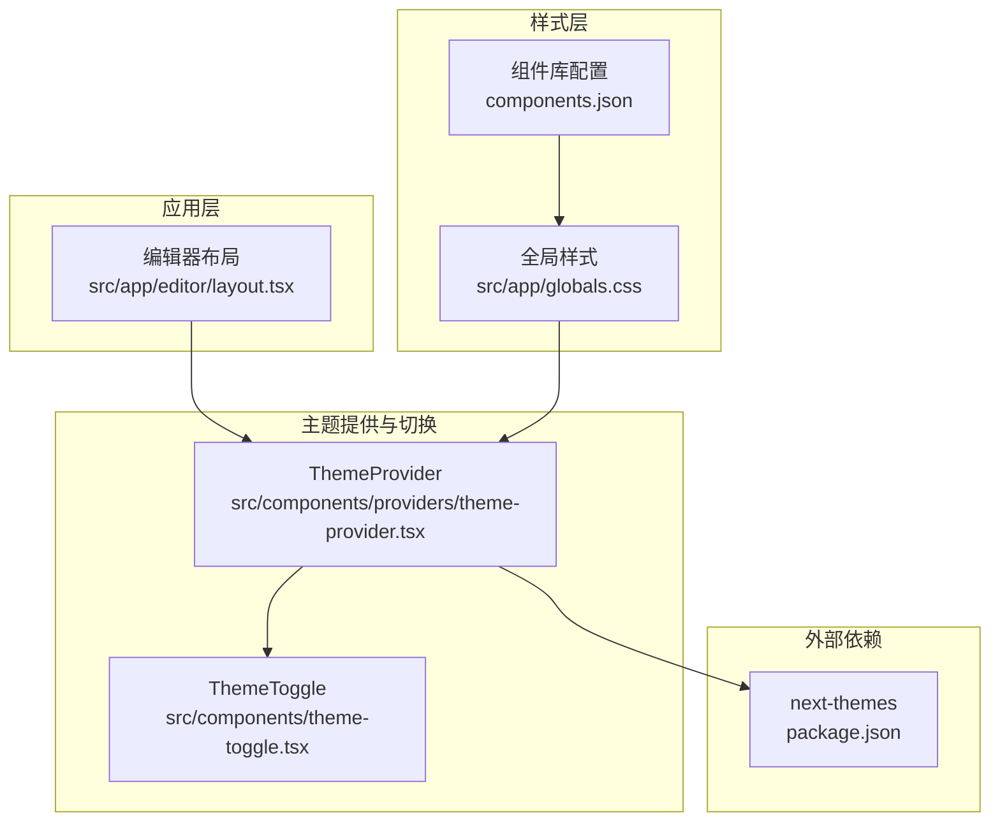
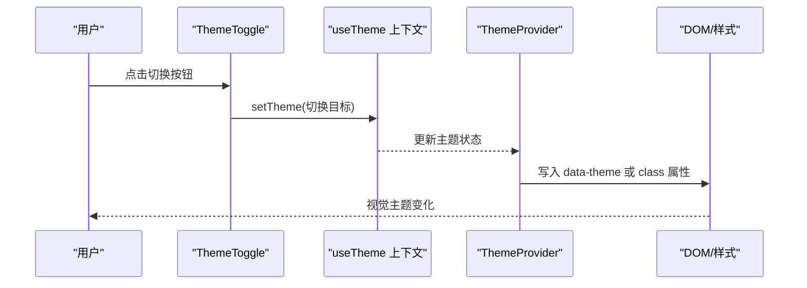
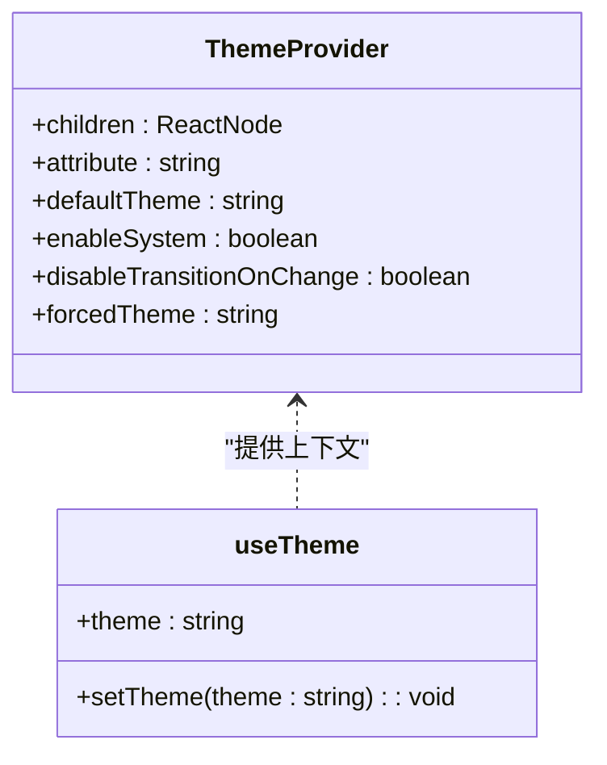
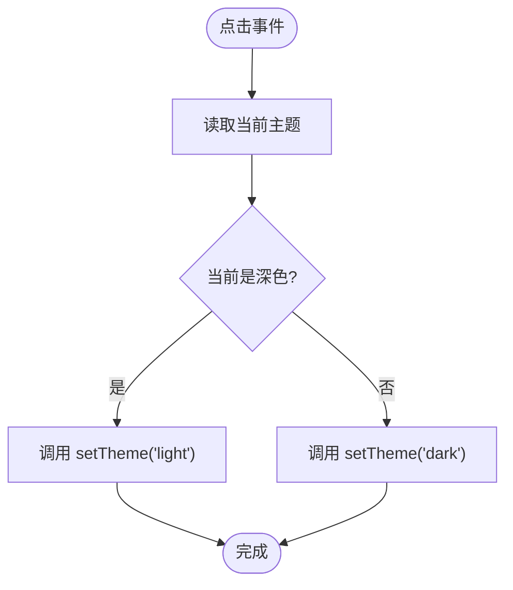
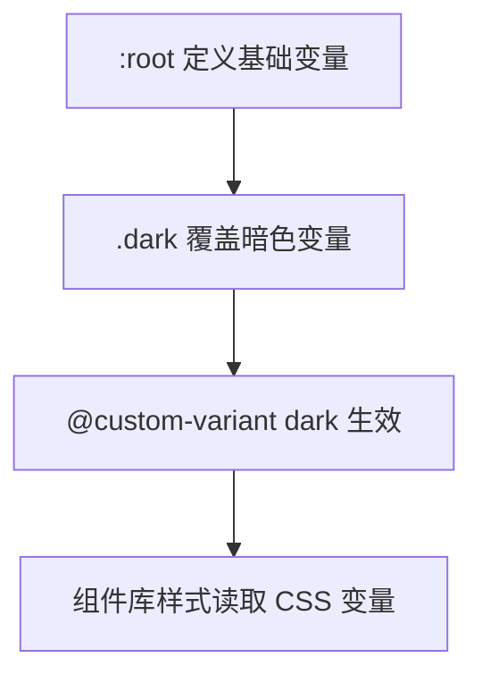
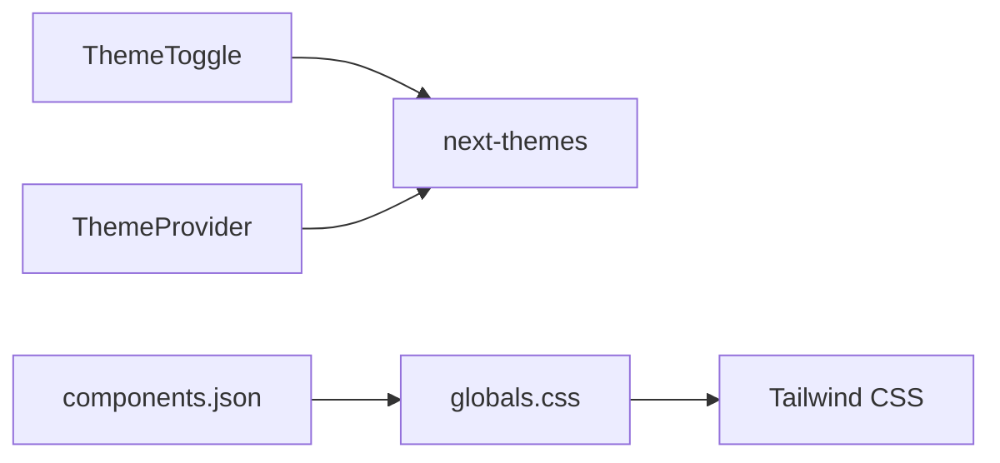

# 主题系统

<cite>
**本文引用的文件**
- [src/components/theme-toggle.tsx](file://src/components/theme-toggle.tsx)
- [src/components/providers/theme-provider.tsx](file://src/components/providers/theme-provider.tsx)
- [src/app/globals.css](file://src/app/globals.css)
- [src/app/editor/layout.tsx](file://src/app/editor/layout.tsx)
- [components.json](file://components.json)
- [package.json](file://package.json)
- [.agents/技能/vercel-react-best-practices/rules/client-localstorage-schema.md](file://.agents/技能/vercel-react-best-practices/rules/client-localstorage-schema.md)
- [.agents/技能/vercel-react-best-practices/rules/js-cache-storage.md](file://.agents/技能/vercel-react-best-practices/rules/js-cache-storage.md)
</cite>

## 目录
1. [简介](#简介)
2. [项目结构](#项目结构)
3. [核心组件](#核心组件)
4. [架构总览](#架构总览)
5. [详细组件分析](#详细组件分析)
6. [依赖关系分析](#依赖关系分析)
7. [性能考量](#性能考量)
8. [故障排查指南](#故障排查指南)
9. [结论](#结论)
10. [附录：主题定制与最佳实践](#附录主题定制与最佳实践)

## 简介
本项目采用 next-themes 提供的主题切换方案，结合 Tailwind CSS 的 CSS 自定义属性（CSS Variables）实现深色/浅色主题的动态切换。主题系统通过 ThemeProvider 在应用根部进行统一配置，ThemeToggle 组件负责用户交互与主题状态切换；全局样式通过 CSS 变量在 :root 和 .dark 选择器中定义，确保组件树内一致的主题渲染。

## 项目结构
主题系统涉及的关键文件与职责如下：
- 主题提供者：在应用布局中包裹 ThemeProvider，设置默认主题与禁用过渡等行为
- 主题切换按钮：基于 next-themes 的 useTheme 钩子读取当前主题并切换
- 全局样式：定义 CSS 变量与暗色变体规则，驱动组件样式
- 组件库配置：Tailwind CSS 使用 CSS 变量并启用暗色变体

**图表来源**
- [src/app/editor/layout.tsx:16-24](file://src/app/editor/layout.tsx#L16-L24)
- [src/components/providers/theme-provider.tsx:7-11](file://src/components/providers/theme-provider.tsx#L7-L11)
- [src/components/theme-toggle.tsx:8-25](file://src/components/theme-toggle.tsx#L8-L25)
- [src/app/globals.css:1-57](file://src/app/globals.css#L1-L57)
- [components.json:6-12](file://components.json#L6-L12)
- [package.json](file://package.json)

**章节来源**
- [src/app/editor/layout.tsx:16-24](file://src/app/editor/layout.tsx#L16-L24)
- [src/components/providers/theme-provider.tsx:7-11](file://src/components/providers/theme-provider.tsx#L7-L11)
- [src/components/theme-toggle.tsx:8-25](file://src/components/theme-toggle.tsx#L8-L25)
- [src/app/globals.css:1-57](file://src/app/globals.css#L1-L57)
- [components.json:6-12](file://components.json#L6-L12)
- [package.json](file://package.json)

## 核心组件
- ThemeProvider：对 next-themes 的轻量封装，接收 attribute、defaultTheme、enableSystem、disableTransitionOnChange、forcedTheme 等参数，向子组件树传播主题上下文
- ThemeToggle：基于 useTheme 读取当前主题与切换函数，根据当前主题渲染太阳/月亮图标，并提供无障碍文本
- 全局样式：在 :root 中定义基础变量，在 .dark 中覆盖暗色变量；Tailwind 通过 @custom-variant dark 与 CSS 变量联动

**章节来源**
- [src/components/providers/theme-provider.tsx:7-11](file://src/components/providers/theme-provider.tsx#L7-L11)
- [src/components/theme-toggle.tsx:8-25](file://src/components/theme-toggle.tsx#L8-L25)
- [src/app/globals.css:1-57](file://src/app/globals.css#L1-L57)

## 架构总览
主题系统采用“提供者 + 切换器 + 样式变量”的分层设计：
- 提供者层：在应用根布局中配置 ThemeProvider，决定主题属性挂载方式、默认主题、是否跟随系统以及是否禁用切换过渡
- 切换层：ThemeToggle 通过 useTheme 获取当前主题并调用 setTheme 进行切换
- 样式层：CSS 变量在 :root 与 .dark 下分别定义，Tailwind 通过 @custom-variant dark 选择器生效，实现组件级样式自动适配

**图表来源**
- [src/components/theme-toggle.tsx:16](file://src/components/theme-toggle.tsx#L16)
- [src/components/providers/theme-provider.tsx:7-11](file://src/components/providers/theme-provider.tsx#L7-L11)
- [src/app/globals.css:3-57](file://src/app/globals.css#L3-L57)

## 详细组件分析

### ThemeProvider 分析
- 角色与职责：作为 next-themes 的包装组件，负责将主题上下文传递给子组件树
- 关键配置项：
  - attribute：指定主题信息挂载到元素属性或类名上
  - defaultTheme：默认主题值
  - enableSystem：是否允许跟随系统主题
  - disableTransitionOnChange：是否禁用切换过渡动画
  - forcedTheme：强制主题（用于特定页面固定主题）
- 传播机制：通过 React Context 将主题状态与切换函数向下传递，子组件可使用 useTheme 访问

**图表来源**
- [src/components/providers/theme-provider.tsx:7-11](file://src/components/providers/theme-provider.tsx#L7-L11)
- [src/components/theme-toggle.tsx:9](file://src/components/theme-toggle.tsx#L9)

**章节来源**
- [src/components/providers/theme-provider.tsx:7-11](file://src/components/providers/theme-provider.tsx#L7-L11)
- [src/app/editor/layout.tsx:17-21](file://src/app/editor/layout.tsx#L17-L21)

### ThemeToggle 组件分析
- 状态管理：通过 useTheme 获取当前主题与切换函数
- 交互逻辑：点击按钮在 light 与 dark 之间切换
- 动画与无障碍：禁用切换过渡以避免闪烁；为按钮提供仅读屏可见的“切换主题”文本
- 图标呈现：根据当前主题显示太阳或月亮图标

**图表来源**
- [src/components/theme-toggle.tsx:16](file://src/components/theme-toggle.tsx#L16)
- [src/components/theme-toggle.tsx:9](file://src/components/theme-toggle.tsx#L9)

**章节来源**
- [src/components/theme-toggle.tsx:8-25](file://src/components/theme-toggle.tsx#L8-L25)

### 全局样式与 CSS 变量
- 变量定义：在 :root 中定义背景、前景、卡片、输入框、边框、环形光晕等变量；在 .dark 中覆盖暗色版本
- 暗色变体：通过 @custom-variant dark 与 .dark 选择器配合，Tailwind 在暗色环境下自动使用 .dark 命名空间下的变量
- 组件库集成：components.json 指定 tailwind.css 使用 src/app/globals.css，并开启 cssVariables=true，使组件库样式与主题变量联动

**图表来源**
- [src/app/globals.css:3-57](file://src/app/globals.css#L3-L57)
- [components.json:6-12](file://components.json#L6-L12)

**章节来源**
- [src/app/globals.css:1-57](file://src/app/globals.css#L1-L57)
- [components.json:6-12](file://components.json#L6-L12)

## 依赖关系分析
- 外部依赖：next-themes 通过 package.json 引入，为主题切换提供底层能力
- 内部依赖：ThemeToggle 依赖 next-themes 的 useTheme；ThemeProvider 包装 next-themes 并向子组件提供上下文
- 样式依赖：Tailwind 通过 @custom-variant dark 与 CSS 变量联动，components.json 控制 Tailwind 的 CSS 文件与变量开关

**图表来源**
- [package.json](file://package.json)
- [src/components/theme-toggle.tsx:4](file://src/components/theme-toggle.tsx#L4)
- [src/components/providers/theme-provider.tsx:4](file://src/components/providers/theme-provider.tsx#L4)
- [src/app/globals.css:3-57](file://src/app/globals.css#L3-L57)
- [components.json:6-12](file://components.json#L6-L12)

**章节来源**
- [package.json](file://package.json)
- [src/components/theme-toggle.tsx:4](file://src/components/theme-toggle.tsx#L4)
- [src/components/providers/theme-provider.tsx:4](file://src/components/providers/theme-provider.tsx#L4)
- [src/app/globals.css:3-57](file://src/app/globals.css#L3-L57)
- [components.json:6-12](file://components.json#L6-L12)

## 性能考量
- 切换过渡控制：在特定页面（如编辑器）通过 disableTransitionOnChange 禁用过渡，避免主题切换导致的视觉闪烁
- 强制主题：通过 forcedTheme 固定主题，减少运行时计算与 DOM 变更
- 存储与缓存：建议在客户端持久化用户偏好的主题设置时，遵循版本化与最小化存储的原则，并对存储读写进行内存缓存以降低同步 I/O 开销

**章节来源**
- [src/app/editor/layout.tsx:20](file://src/app/editor/layout.tsx#L20)
- [.agents/技能/vercel-react-best-practices/rules/client-localstorage-schema.md:22-52](file://.agents/技能/vercel-react-best-practices/rules/client-localstorage-schema.md#L22-L52)
- [.agents/技能/vercel-react-best-practices/rules/js-cache-storage.md:24-36](file://.agents/技能/vercel-react-best-practices/rules/js-cache-storage.md#L24-L36)

## 故障排查指南
- 主题未生效
  - 检查 ThemeProvider 是否包裹了需要的主题组件
  - 确认 attribute 与 class 的映射是否正确
  - 核对 CSS 变量是否在 :root 与 .dark 中均定义
- 切换闪烁或不流畅
  - 在需要的页面禁用过渡：disableTransitionOnChange
  - 对于固定主题页面，使用 forcedTheme
- 无障碍问题
  - 确保切换按钮包含仅读屏可见的描述性文本
  - 保持按钮可键盘访问与可聚焦

**章节来源**
- [src/components/providers/theme-provider.tsx:7-11](file://src/components/providers/theme-provider.tsx#L7-L11)
- [src/app/globals.css:3-57](file://src/app/globals.css#L3-L57)
- [src/components/theme-toggle.tsx:23](file://src/components/theme-toggle.tsx#L23)

## 结论
本主题系统以 next-themes 为核心，结合 Tailwind CSS 的 CSS 变量与暗色变体，实现了简洁而强大的主题切换能力。通过 ThemeProvider 的集中配置与 ThemeToggle 的直观交互，配合全局样式的变量化设计，能够在不同页面场景下灵活地控制主题行为与视觉表现。

## 附录：主题定制与最佳实践

### 添加新主题
- 在 CSS 变量层新增一组变量定义（例如 :root-new 与 .new），并在需要的页面通过 ThemeProvider 的 forcedTheme 指定
- 在 ThemeToggle 中扩展切换逻辑，将新主题纳入 setTheme 的可选值集合
- 如需组件库适配，可在 components.json 中调整 tailwind.css 与 cssVariables 设置

**章节来源**
- [src/app/globals.css:1-57](file://src/app/globals.css#L1-L57)
- [src/components/theme-toggle.tsx:16](file://src/components/theme-toggle.tsx#L16)
- [components.json:6-12](file://components.json#L6-L12)

### 修改现有主题
- 调整 :root 中的基础变量值以改变整体色调
- 在 .dark 中覆盖暗色变量，确保对比度与可读性
- 使用 @custom-variant dark 确保 Tailwind 组件在暗色下正确渲染

**章节来源**
- [src/app/globals.css:12-57](file://src/app/globals.css#L12-L57)

### 扩展颜色系统
- 通过 CSS 变量统一管理颜色语义（如 primary、secondary、muted 等）
- 在组件库中使用这些变量，保证风格一致性
- 为特殊区域（如侧边栏）单独定义变量并复用

**章节来源**
- [src/app/globals.css:30-57](file://src/app/globals.css#L30-L57)
- [components.json:6-12](file://components.json#L6-L12)

### 最佳实践
- 切换动画：在大多数页面保留过渡以提升体验；在特定页面（如编辑器）禁用过渡以避免闪烁
- 性能优化：对本地存储进行内存缓存，减少频繁同步 I/O；版本化存储键名，便于迁移
- 用户体验：提供清晰的切换反馈与无障碍文本；确保键盘可达与焦点可见

**章节来源**
- [src/app/editor/layout.tsx:20](file://src/app/editor/layout.tsx#L20)
- [.agents/技能/vercel-react-best-practices/rules/js-cache-storage.md:24-36](file://.agents/技能/vercel-react-best-practices/rules/js-cache-storage.md#L24-L36)
- [.agents/技能/vercel-react-best-practices/rules/client-localstorage-schema.md:22-52](file://.agents/技能/vercel-react-best-practices/rules/client-localstorage-schema.md#L22-L52)