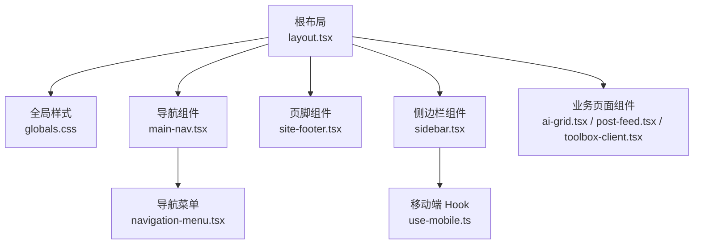
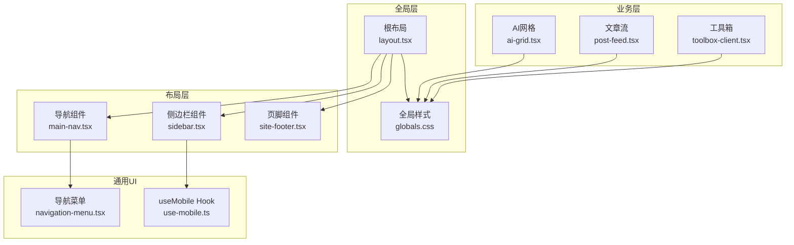
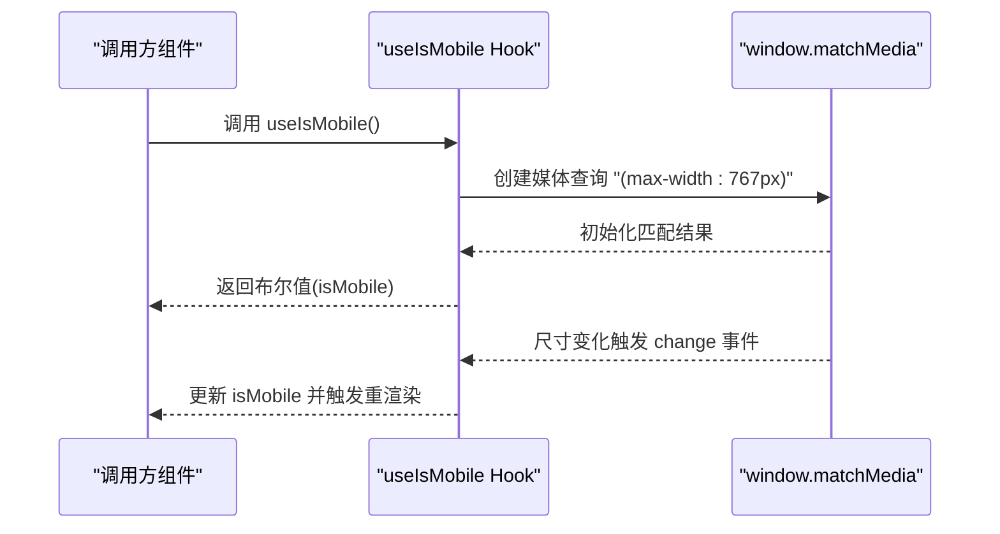
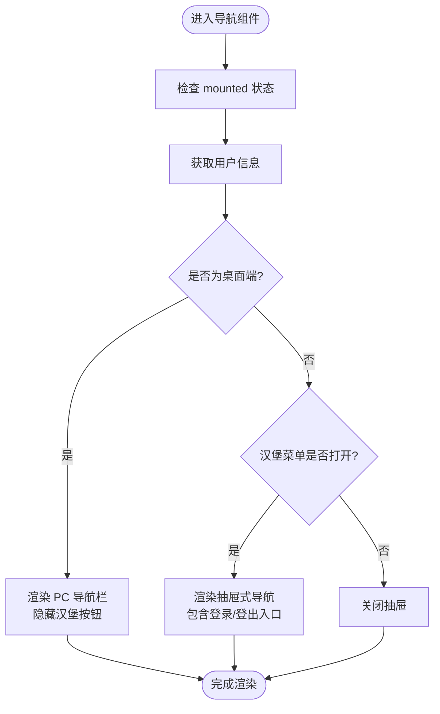
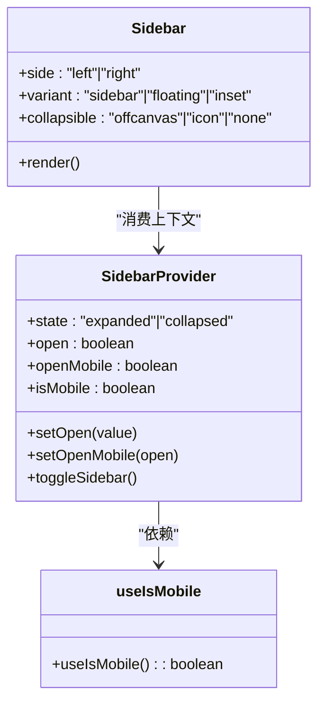
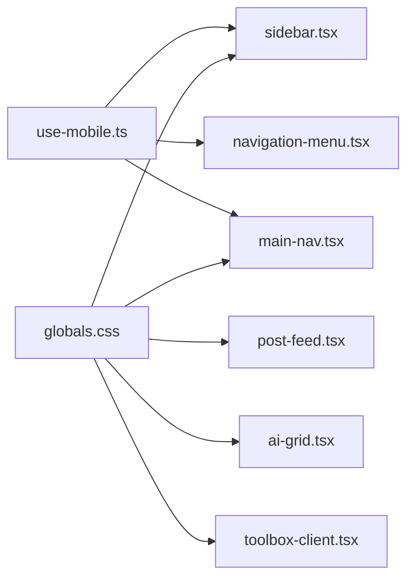

# 响应式设计

<cite>
**本文引用的文件**
- [use-mobile.ts](file://src/hooks/use-mobile.ts)
- [main-nav.tsx](file://src/components/layout/main-nav.tsx)
- [site-footer.tsx](file://src/components/layout/site-footer.tsx)
- [sidebar.tsx](file://src/components/ui/sidebar.tsx)
- [navigation-menu.tsx](file://src/components/ui/navigation-menu.tsx)
- [globals.css](file://src/app/globals.css)
- [layout.tsx](file://src/app/layout.tsx)
- [ai-grid.tsx](file://src/app/(site)/ai-platform/components/ai-grid.tsx)
- [post-feed.tsx](file://src/app/(site)/graph/components/post-feed.tsx)
- [toolbox-client.tsx](file://src/app/(site)/tools/components/toolbox-client.tsx)
- [SKILL.md](file://.agents/skills/ui-ux-pro-max/SKILL.md)
</cite>

## 目录
1. [引言](#引言)
2. [项目结构](#项目结构)
3. [核心组件](#核心组件)
4. [架构总览](#架构总览)
5. [详细组件分析](#详细组件分析)
6. [依赖关系分析](#依赖关系分析)
7. [性能考量](#性能考量)
8. [故障排查指南](#故障排查指南)
9. [结论](#结论)
10. [附录](#附录)

## 引言
本文件系统化梳理本项目的响应式设计策略与实现，重点覆盖移动端优先的设计思想、断点与布局适配机制、useMobile 自定义 Hook 的媒体查询逻辑、导航与页脚等关键布局元素在不同设备上的表现、触摸交互与手势支持、图片与字体缩放及间距调整的最佳实践，并提供移动端调试、性能优化与跨设备兼容性测试方法。同时总结 CSS Grid、Flexbox 在响应式布局中的应用以及 Tailwind CSS 响应式工具类的使用。

## 项目结构
项目采用 Next.js App Router 结构，响应式设计贯穿全局样式、布局组件与业务页面组件。根布局负责注入全局样式与主题变量；站点级布局组件（导航、页脚）提供移动端优先的交互与展示；UI 组件库（如 Sidebar、NavigationMenu）内置响应式行为；业务页面组件通过 Tailwind 工具类实现断点驱动的网格与排版。

图表来源
- [layout.tsx:1-52](file://src/app/layout.tsx#L1-L52)
- [globals.css:1-303](file://src/app/globals.css#L1-L303)
- [main-nav.tsx:1-262](file://src/components/layout/main-nav.tsx#L1-L262)
- [site-footer.tsx:1-69](file://src/components/layout/site-footer.tsx#L1-L69)
- [navigation-menu.tsx:1-169](file://src/components/ui/navigation-menu.tsx#L1-L169)
- [sidebar.tsx:1-724](file://src/components/ui/sidebar.tsx#L1-L724)
- [use-mobile.ts:1-20](file://src/hooks/use-mobile.ts#L1-L20)
- [ai-grid.tsx:1-31](file://src/app/(site)/ai-platform/components/ai-grid.tsx#L1-L31)
- [post-feed.tsx:56-133](file://src/app/(site)/graph/components/post-feed.tsx#L56-L133)
- [toolbox-client.tsx:163-213](file://src/app/(site)/tools/components/toolbox-client.tsx#L163-L213)

章节来源
- [layout.tsx:1-52](file://src/app/layout.tsx#L1-L52)
- [globals.css:1-303](file://src/app/globals.css#L1-L303)

## 核心组件
- 移动端检测 Hook：useIsMobile 提供统一的移动端判定，基于媒体查询监听窗口宽度变化，返回布尔值以驱动组件的响应式渲染与交互。
- 导航组件：PC 端使用导航菜单，移动端使用抽屉式汉堡菜单；登录状态与用户操作在不同断点下呈现不同密度与布局。
- 侧边栏组件：内置移动端抽屉与桌面端展开/折叠逻辑，结合 useMobile 实现一致的交互体验。
- 页脚组件：在小屏上压缩文字大小与间距，保证信息可读性与可点击区域。
- 业务页面组件：广泛使用 Tailwind 响应式断点（sm/md/lg/xl）控制网格列数、卡片尺寸与文本字号，确保在多设备上保持良好密度与可读性。

章节来源
- [use-mobile.ts:1-20](file://src/hooks/use-mobile.ts#L1-L20)
- [main-nav.tsx:1-262](file://src/components/layout/main-nav.tsx#L1-L262)
- [sidebar.tsx:1-724](file://src/components/ui/sidebar.tsx#L1-L724)
- [site-footer.tsx:1-69](file://src/components/layout/site-footer.tsx#L1-L69)
- [ai-grid.tsx:1-31](file://src/app/(site)/ai-platform/components/ai-grid.tsx#L1-L31)
- [post-feed.tsx:56-133](file://src/app/(site)/graph/components/post-feed.tsx#L56-L133)
- [toolbox-client.tsx:163-213](file://src/app/(site)/tools/components/toolbox-client.tsx#L163-L213)

## 架构总览
响应式架构围绕“断点 + 组件行为 + 主题变量”的组合展开。全局样式提供暗色模式与基础排版变量；布局组件根据设备类型切换 UI 行为；业务组件通过 Tailwind 断点类实现弹性布局；Hook 提供底层的媒体查询能力。

图表来源
- [layout.tsx:1-52](file://src/app/layout.tsx#L1-L52)
- [globals.css:1-303](file://src/app/globals.css#L1-L303)
- [main-nav.tsx:1-262](file://src/components/layout/main-nav.tsx#L1-L262)
- [sidebar.tsx:1-724](file://src/components/ui/sidebar.tsx#L1-L724)
- [navigation-menu.tsx:1-169](file://src/components/ui/navigation-menu.tsx#L1-L169)
- [use-mobile.ts:1-20](file://src/hooks/use-mobile.ts#L1-L20)
- [ai-grid.tsx:1-31](file://src/app/(site)/ai-platform/components/ai-grid.tsx#L1-L31)
- [post-feed.tsx:56-133](file://src/app/(site)/graph/components/post-feed.tsx#L56-L133)
- [toolbox-client.tsx:163-213](file://src/app/(site)/tools/components/toolbox-client.tsx#L163-L213)

## 详细组件分析

### useMobile 自定义 Hook
- 设计目标：提供统一的移动端判定，避免在服务端与客户端之间出现不一致的初始状态。
- 媒体查询逻辑：使用媒体查询 `(max-width: 767px)` 判断是否为移动端，并在窗口尺寸变化时更新状态。
- 返回值：布尔值，用于条件渲染或行为切换（如抽屉菜单、移动端布局）。
- 性能与稳定性：仅在挂载时绑定事件监听，在卸载时解绑，避免内存泄漏。

图表来源
- [use-mobile.ts:1-20](file://src/hooks/use-mobile.ts#L1-L20)

章节来源
- [use-mobile.ts:1-20](file://src/hooks/use-mobile.ts#L1-L20)

### 导航组件（移动端优先）
- PC 端：固定高度的横向导航栏，使用导航菜单组件展示标签项，激活态带强调条纹。
- 移动端：汉堡菜单切换抽屉式导航，抽屉覆盖顶部区域，提供登录/登出入口与仪表盘链接。
- 用户状态：根据认证状态动态渲染用户名、角色徽章与操作按钮；抽屉中对齐移动端交互密度。
- 响应式断点：通过 Tailwind 的 `md:` 前缀在不同屏幕宽度下切换布局与可见性。

图表来源
- [main-nav.tsx:1-262](file://src/components/layout/main-nav.tsx#L1-L262)

章节来源
- [main-nav.tsx:1-262](file://src/components/layout/main-nav.tsx#L1-L262)

### 侧边栏组件（含移动端抽屉）
- 响应式策略：在移动端使用抽屉（Sheet）承载侧边栏内容；在桌面端使用固定宽度的侧边栏，支持展开/折叠与浮动/嵌入变体。
- 移动端适配：抽屉宽度使用移动端常量，点击外部区域或触发键盘快捷键可关闭。
- 交互细节：菜单按钮在移动端扩大点击热区（伪元素），折叠状态下通过 Tooltip 提示辅助信息。
- 状态持久化：通过 Cookie 记录侧边栏展开状态，提升连续访问体验。

图表来源
- [sidebar.tsx:1-724](file://src/components/ui/sidebar.tsx#L1-L724)
- [use-mobile.ts:1-20](file://src/hooks/use-mobile.ts#L1-L20)

章节来源
- [sidebar.tsx:1-724](file://src/components/ui/sidebar.tsx#L1-L724)

### 页脚组件（紧凑与可读性）
- 内容密度：在小屏上使用更小字号与更短文案，保证信息可读性；在桌面端适度扩展为一行多列布局。
- 动态信息：运行时计算系统运行时长并每秒刷新，避免长时间静止导致的感知问题。
- 触达性：使用清晰的对比度与合适的字号，满足无障碍要求。

章节来源
- [site-footer.tsx:1-69](file://src/components/layout/site-footer.tsx#L1-L69)

### 业务页面组件（网格与断点）
- AI 工具网格：从单列到三列逐步递增，保证在小屏上卡片可滚动且内容可读。
- 文章流：从单列到五列，配合卡片阴影与悬停效果，提升移动端点击目标面积。
- 工具箱：支持网格/列表双视图，网格列数随断点增加，列表视图在小屏更易滚动与选择。

章节来源
- [ai-grid.tsx:1-31](file://src/app/(site)/ai-platform/components/ai-grid.tsx#L1-L31)
- [post-feed.tsx:56-133](file://src/app/(site)/graph/components/post-feed.tsx#L56-L133)
- [toolbox-client.tsx:163-213](file://src/app/(site)/tools/components/toolbox-client.tsx#L163-L213)

## 依赖关系分析
- useMobile Hook 是多个组件的共同依赖，包括 Sidebar、NavigationMenu、MainNav 等，用于在不同设备间切换 UI 行为。
- 全局样式通过 CSS 变量与暗色模式类名影响所有组件的视觉表现，确保一致性。
- 业务组件通过 Tailwind 断点类与 Flex/Grid 容器实现响应式布局，减少自定义样式的重复。

图表来源
- [use-mobile.ts:1-20](file://src/hooks/use-mobile.ts#L1-L20)
- [sidebar.tsx:1-724](file://src/components/ui/sidebar.tsx#L1-L724)
- [navigation-menu.tsx:1-169](file://src/components/ui/navigation-menu.tsx#L1-L169)
- [main-nav.tsx:1-262](file://src/components/layout/main-nav.tsx#L1-L262)
- [globals.css:1-303](file://src/app/globals.css#L1-L303)
- [post-feed.tsx:56-133](file://src/app/(site)/graph/components/post-feed.tsx#L56-L133)
- [ai-grid.tsx:1-31](file://src/app/(site)/ai-platform/components/ai-grid.tsx#L1-L31)
- [toolbox-client.tsx:163-213](file://src/app/(site)/tools/components/toolbox-client.tsx#L163-L213)

## 性能考量
- 媒体查询监听：仅在需要时绑定与解绑，避免频繁重绘与内存占用。
- 图片与字体：使用现代格式（WebP）、懒加载与合适的尺寸，减少首屏阻塞。
- 动画与过渡：优先使用 transform/opacity，控制动画时长与缓动曲线，避免大范围布局抖动。
- 无障碍与可访问性：遵循最小可点击区域、足够的对比度与减少动画偏好设置的影响。
- 调试与测试：在 375px、768px、1024px、1440px 等关键断点进行验证，确保无水平滚动与内容遮挡。

章节来源
- [SKILL.md:50-386](file://.agents/skills/ui-ux-pro-max/SKILL.md#L50-L386)

## 故障排查指南
- 抽屉无法关闭：检查移动端抽屉的 open 与 onOpenChange 是否正确传递，确认事件绑定与解绑逻辑。
- 导航在 SSR 中闪烁：确保导航组件在客户端挂载后才进行用户状态请求与渲染，避免服务端与客户端差异。
- 侧边栏状态丢失：确认 Cookie 设置与读取逻辑，确保在切换路由后仍能恢复上次状态。
- 字体过小或过大：检查全局字体变量与断点下的字号类，确保在小屏上不低于可读阈值。
- 横向滚动：在小屏断点下排查容器宽度与子元素溢出，必要时添加 `overflow-x-hidden` 或使用 `max-w-full`。

章节来源
- [sidebar.tsx:1-724](file://src/components/ui/sidebar.tsx#L1-L724)
- [main-nav.tsx:1-262](file://src/components/layout/main-nav.tsx#L1-L262)
- [globals.css:1-303](file://src/app/globals.css#L1-L303)

## 结论
本项目以移动端优先为核心策略，通过 useMobile Hook 提供统一的设备判定，结合 Sidebar、NavigationMenu、MainNav 等组件在不同断点下的行为切换，辅以 Tailwind 断点类与全局样式变量，实现了稳定、一致且高性能的响应式体验。业务页面组件广泛采用 CSS Grid 与 Flexbox，确保在多设备上具备良好的可读性与交互效率。建议持续在关键断点进行回归测试，并关注无障碍与性能指标，以进一步提升跨设备兼容性与用户体验。

## 附录
- 断点与布局建议：参考 UI/UX 最佳实践，确保在 375px、768px、1024px、1440px 等断点下均具备合理的内容密度与可读性。
- 触摸交互：增大点击目标尺寸，提供明确的反馈与状态提示，避免误触与不可见的交互元素。
- 图片与字体：优先使用现代格式与懒加载，避免在小屏上出现超宽图片与过小字体。
- 跨设备测试：在真实设备与模拟器上进行多场景测试，关注滚动性能、动画流畅度与可访问性。