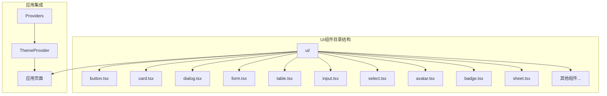
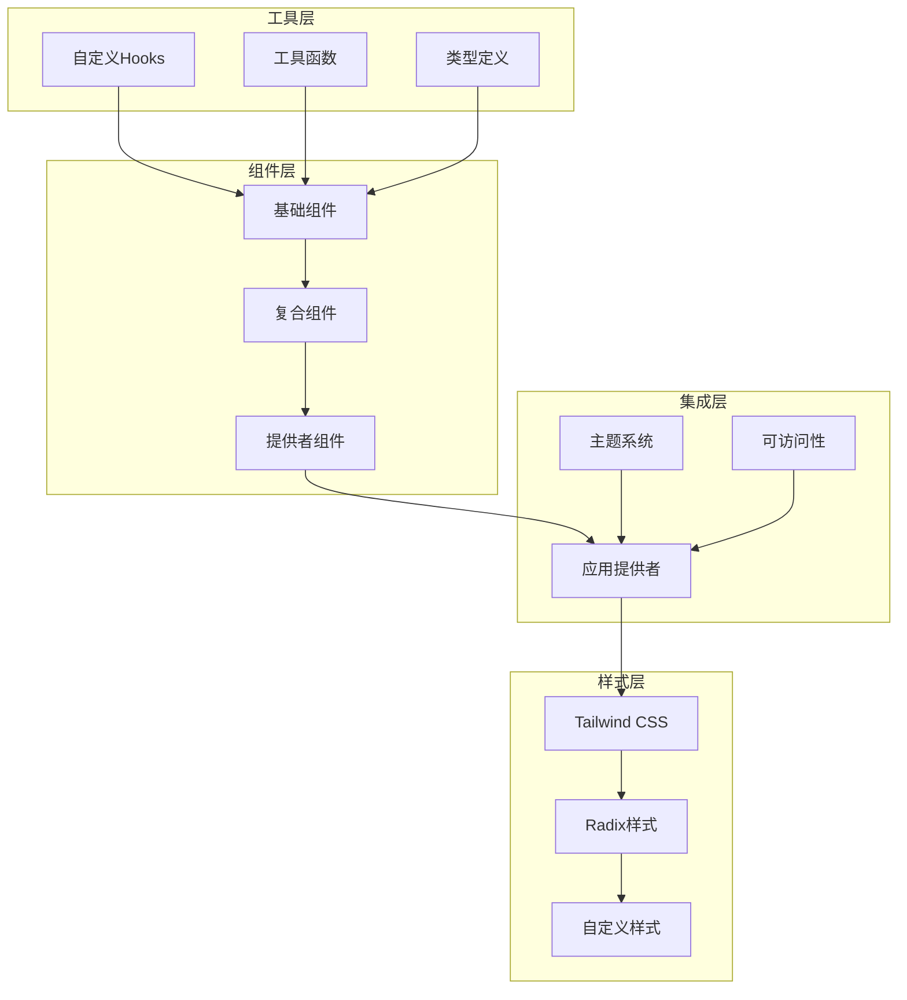
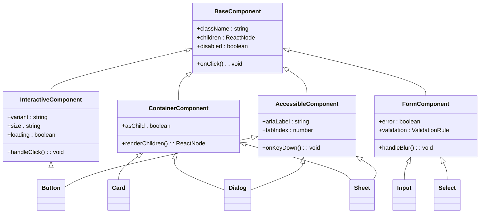
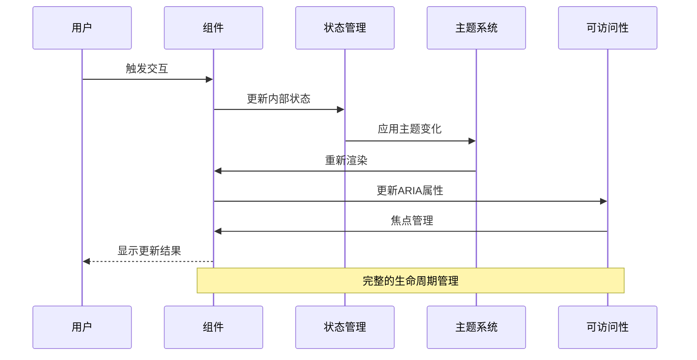
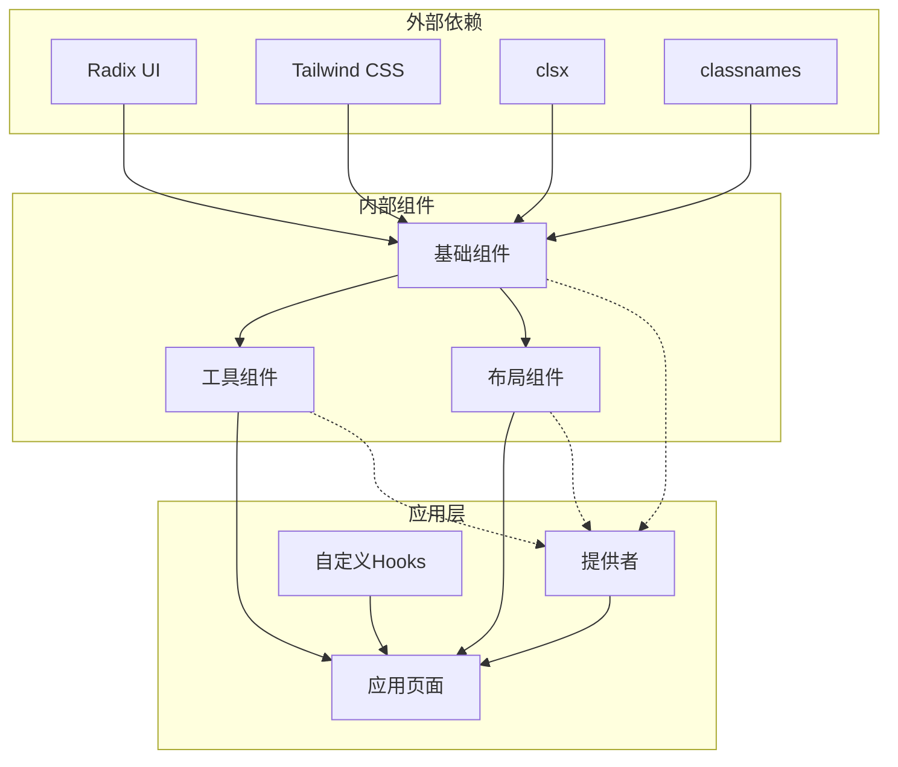

# 基础UI组件

<cite>
**本文档引用的文件**
- [button.tsx](file://src/components/ui/button.tsx)
- [card.tsx](file://src/components/ui/card.tsx)
- [dialog.tsx](file://src/components/ui/dialog.tsx)
- [form.tsx](file://src/components/ui/form.tsx)
- [table.tsx](file://src/components/ui/table.tsx)
- [input.tsx](file://src/components/ui/input.tsx)
- [select.tsx](file://src/components/ui/select.tsx)
- [avatar.tsx](file://src/components/ui/avatar.tsx)
- [badge.tsx](file://src/components/ui/badge.tsx)
- [sheet.tsx](file://src/components/ui/sheet.tsx)
- [label.tsx](file://src/components/ui/label.tsx)
- [textarea.tsx](file://src/components/ui/textarea.tsx)
- [dropdown-menu.tsx](file://src/components/ui/dropdown-menu.tsx)
- [navigation-menu.tsx](file://src/components/ui/navigation-menu.tsx)
- [pagination.tsx](file://src/components/ui/pagination.tsx)
- [scroll-area.tsx](file://src/components/ui/scroll-area.tsx)
- [separator.tsx](file://src/components/ui/separator.tsx)
- [slider.tsx](file://src/components/ui/slider.tsx)
- [sonner.tsx](file://src/components/ui/sonner.tsx)
- [switch.tsx](file://src/components/ui/switch.tsx)
- [tabs.tsx](file://src/components/ui/tabs.tsx)
- [tooltip.tsx](file://src/components/ui/tooltip.tsx)
- [carousel.tsx](file://src/components/ui/carousel.tsx)
- [collapsible.tsx](file://src/components/ui/collapsible.tsx)
- [image-upload.tsx](file://src/components/ui/image-upload.tsx)
- [alert-dialog.tsx](file://src/components/ui/alert-dialog.tsx)
- [skeleton.tsx](file://src/components/ui/skeleton.tsx)
- [sidebar.tsx](file://src/components/ui/sidebar.tsx)
- [theme-provider.tsx](file://src/components/providers/theme-provider.tsx)
- [use-mobile.ts](file://src/hooks/use-mobile.ts)
- [components.json](file://components.json)
- [globals.css](file://src/app/globals.css)
- [package.json](file://package.json)
</cite>

## 目录
1. [简介](#简介)
2. [项目结构](#项目结构)
3. [核心组件](#核心组件)
4. [架构概览](#架构概览)
5. [详细组件分析](#详细组件分析)
6. [依赖分析](#依赖分析)
7. [性能考虑](#性能考虑)
8. [故障排除指南](#故障排除指南)
9. [结论](#结论)
10. [附录](#附录)

## 简介
本项目基于Radix UI构建了一套完整的基础UI组件库，为Next.js应用程序提供一致、可访问且高度可定制的用户界面组件。该组件库涵盖了从基础按钮、输入框到复杂表格、对话框等各类UI元素，采用现代化的设计理念和最佳实践。

组件库的核心特点包括：
- 完全基于Radix UI构建，确保优秀的可访问性和键盘导航支持
- 支持主题定制和Tailwind CSS类名覆盖
- 提供完整的TypeScript类型定义
- 遵循React Hooks最佳实践
- 内置响应式设计支持

## 项目结构
UI组件主要位于`src/components/ui/`目录下，采用按功能分组的组织方式：



**图表来源**
- [button.tsx](file://src/components/ui/button.tsx)
- [card.tsx](file://src/components/ui/card.tsx)
- [dialog.tsx](file://src/components/ui/dialog.tsx)
- [form.tsx](file://src/components/ui/form.tsx)

**章节来源**
- [components.json](file://components.json)
- [package.json](file://package.json)

## 核心组件
本节详细介绍九个核心基础组件的实现细节和使用方法。

### Button（按钮）
Button组件是交互式操作的核心入口点，支持多种变体和尺寸配置。

**组件特性：**
- 多种视觉变体：默认、强调、轮廓、虚线、次要、幽灵、链接
- 尺寸选择：默认、小号、大号
- 状态管理：加载状态、禁用状态
- 可访问性：完整的ARIA支持和键盘导航

**Props接口：**
```typescript
interface ButtonProps extends React.ButtonHTMLAttributes<HTMLButtonElement> {
  variant?: "default" | "destructive" | "outline" | "secondary" | "ghost" | "link"
  size?: "default" | "sm" | "lg"
  asChild?: boolean
  loading?: boolean
}

const Button = React.forwardRef<HTMLButtonElement, ButtonProps>(
  ({ className, variant, size, asChild = false, ...props }, ref) => {
    // 实现逻辑
  }
)
```

**使用示例：**
- 基础按钮：用于主要操作
- 次要按钮：用于次要操作
- 危险按钮：用于删除或危险操作
- 加载状态：显示异步操作进度

**章节来源**
- [button.tsx](file://src/components/ui/button.tsx)

### Card（卡片）
Card组件提供内容容器，支持头部、主体、描述和标题的灵活组合。

**组件结构：**
- CardRoot：卡片根容器
- CardHeader：卡片头部区域
- CardTitle：卡片标题
- CardDescription：卡片描述
- CardContent：卡片主要内容
- CardFooter：卡片底部区域

**Props接口：**
```typescript
interface CardProps extends React.HTMLAttributes<HTMLDivElement> {
  asChild?: boolean
}

interface CardHeaderProps extends React.HTMLAttributes<HTMLDivElement> {
  asChild?: boolean
}

interface CardTitleProps extends React.HTMLAttributes<HTMLHeadingElement> {
  asChild?: boolean
}
```

**使用场景：**
- 用户信息展示
- 功能模块分组
- 数据概览卡片
- 设置面板容器

**章节来源**
- [card.tsx](file://src/components/ui/card.tsx)

### Dialog（对话框）
Dialog组件提供模态对话框功能，支持键盘导航和焦点管理。

**核心功能：**
- 打开/关闭状态管理
- 背景遮罩点击关闭
- ESC键快速关闭
- 键盘焦点循环
- 模态焦点锁定

**组件层次：**
- DialogRoot：对话框根组件
- DialogTrigger：触发器
- DialogPortal：传送门组件
- DialogOverlay：背景遮罩
- DialogContent：对话框内容
- DialogHeader：对话头
- DialogFooter：对话尾
- DialogTitle：标题
- DialogDescription：描述

**章节来源**
- [dialog.tsx](file://src/components/ui/dialog.tsx)

### Form（表单）
Form组件提供完整的表单处理能力，包括验证、错误处理和状态管理。

**核心特性：**
- React Hook Form集成
- Zod验证schema
- 字段级错误处理
- 提交状态管理
- 自动焦点管理

**组件结构：**
- FormProvider：表单提供者
- FormControl：表单控制
- FormField：字段包装器
- FormItem：表单项
- FormLabel：表单标签
- FormMessage：错误消息

**章节来源**
- [form.tsx](file://src/components/ui/form.tsx)

### Table（表格）
Table组件提供数据表格渲染功能，支持排序、分页和响应式设计。

**组件层次：**
- TableRoot：表格根容器
- TableHeader：表格头部
- TableBody：表格主体
- TableRow：表格行
- TableHead：表头单元格
- TableCell：数据单元格
- TableCaption：表格标题

**功能特性：**
- 排序支持
- 响应式布局
- 行选中状态
- 加载状态指示

**章节来源**
- [table.tsx](file://src/components/ui/table.tsx)

### Input（输入框）
Input组件提供基础文本输入功能，支持多种输入类型和状态管理。

**Props接口：**
```typescript
interface InputProps extends React.InputHTMLAttributes<HTMLInputElement> {
  asChild?: boolean
  error?: boolean
}

interface InputWithIconProps extends InputProps {
  icon?: React.ReactNode
}
```

**支持类型：**
- 文本输入
- 数字输入
- 邮箱输入
- 密码输入
- 搜索输入

**章节来源**
- [input.tsx](file://src/components/ui/input.tsx)

### Select（选择器）
Select组件提供下拉选择功能，支持键盘导航和自定义选项渲染。

**核心功能：**
- 下拉菜单展开/收起
- 键盘导航支持
- 搜索过滤
- 多选支持
- 自定义渲染

**组件结构：**
- SelectRoot：选择器根
- SelectGroup：选项组
- SelectValue：选择值
- SelectTrigger：触发器
- SelectPortal：传送门
- SelectContent：内容
- SelectLabel：标签
- SelectItem：选项项
- SelectItemText：选项文本
- SelectSeparator：分隔符

**章节来源**
- [select.tsx](file://src/components/ui/select.tsx)

### Avatar（头像）
Avatar组件用于显示用户头像或占位符，支持图片加载失败回退。

**组件特性：**
- 图片头像支持
- 占位符字符
- 加载状态指示
- 错误自动回退
- 圆形裁剪

**Props接口：**
```typescript
interface AvatarProps extends React.HTMLAttributes<HTMLSpanElement> {
  src?: string
  alt?: string
  fallback?: string
  size?: number
}

interface AvatarImageProps extends React.ImgHTMLAttributes<HTMLImageElement> {
  asChild?: boolean
}
```

**章节来源**
- [avatar.tsx](file://src/components/ui/avatar.tsx)

### Badge（徽章）
Badge组件用于显示状态标签或计数信息，支持多种视觉风格。

**变体类型：**
- 默认：常规状态标签
- 概念：概念性标签
- 强调：重要信息
- 次要：辅助信息
- 圆点：状态指示

**使用场景：**
- 通知计数
- 状态标识
- 标签分类
- 新功能提示

**章节来源**
- [badge.tsx](file://src/components/ui/badge.tsx)

### Sheet（工作台）
Sheet组件提供侧边工作台功能，支持从边缘滑出的内容面板。

**核心功能：**
- 多方向滑出：顶部、右侧、底部、左侧
- 背景遮罩交互
- 键盘导航支持
- 焦点管理
- 响应式适配

**组件结构：**
- SheetRoot：工作台根
- SheetTrigger：触发器
- SheetPortal：传送门
- SheetOverlay：遮罩
- SheetContent：内容面板
- SheetHeader：头部
- SheetFooter：底部
- SheetTitle：标题
- SheetDescription：描述

**章节来源**
- [sheet.tsx](file://src/components/ui/sheet.tsx)

## 架构概览
组件库采用分层架构设计，确保组件间的松耦合和高内聚。



**图表来源**
- [button.tsx](file://src/components/ui/button.tsx)
- [theme-provider.tsx](file://src/components/providers/theme-provider.tsx)
- [use-mobile.ts](file://src/hooks/use-mobile.ts)

## 详细组件分析

### 组件继承关系图


**图表来源**
- [button.tsx](file://src/components/ui/button.tsx)
- [card.tsx](file://src/components/ui/card.tsx)
- [dialog.tsx](file://src/components/ui/dialog.tsx)
- [input.tsx](file://src/components/ui/input.tsx)
- [select.tsx](file://src/components/ui/select.tsx)

### 组件生命周期流程


**图表来源**
- [button.tsx](file://src/components/ui/button.tsx)
- [theme-provider.tsx](file://src/components/providers/theme-provider.tsx)

### 组件组合使用模式

```mermaid
flowchart TD
Start([开始组合]) --> Pattern1["表单组合模式"]
Pattern1 --> FormInput["Form + Input + Label"]
Pattern1 --> FormSelect["Form + Select + Label"]
Pattern1 --> FormTextarea["Form + Textarea + Label"]
Start --> Pattern2["卡片组合模式"]
Pattern2 --> CardHeader["Card + Header + Title"]
Pattern2 --> CardContent["Card + Content + Description"]
Pattern2 --> CardFooter["Card + Footer + Actions"]
Start --> Pattern3["对话框组合模式"]
Pattern3 --> DialogTrigger["Dialog + Trigger + Button"]
Pattern3 --> DialogContent["Dialog + Content + Form"]
Pattern3 --> DialogActions["Dialog + Footer + Actions"]
Start --> Pattern4["导航组合模式"]
Pattern4 --> NavItems["Navigation + Items + Links"]
Pattern4 --> NavDropdown["Navigation + Dropdown + Menu"]
Pattern4 --> NavMobile["Navigation + Mobile + Sidebar"]
Pattern1 --> End([完成])
Pattern2 --> End
Pattern3 --> End
Pattern4 --> End
```


**图表来源**
- [form.tsx](file://src/components/ui/form.tsx)
- [card.tsx](file://src/components/ui/card.tsx)
- [dialog.tsx](file://src/components/ui/dialog.tsx)
- [navigation-menu.tsx](file://src/components/ui/navigation-menu.tsx)

**章节来源**
- [form.tsx](file://src/components/ui/form.tsx)
- [card.tsx](file://src/components/ui/card.tsx)
- [dialog.tsx](file://src/components/ui/dialog.tsx)

## 依赖分析
组件库的依赖关系展现了清晰的层次结构和模块化设计。



**图表来源**
- [package.json](file://package.json)
- [button.tsx](file://src/components/ui/button.tsx)
- [card.tsx](file://src/components/ui/card.tsx)

**章节来源**
- [package.json](file://package.json)

## 性能考虑
组件库在设计时充分考虑了性能优化，采用了多种最佳实践：

### 渲染优化
- 使用React.memo进行组件记忆化
- 条件渲染避免不必要的重渲染
- 虚拟滚动支持大数据集
- 懒加载组件提升初始加载速度

### 状态管理
- 局部状态管理减少全局状态污染
- 事件委托优化大量交互元素
- 防抖和节流处理高频事件
- 内存泄漏防护机制

### 样式优化
- Tailwind CSS原子类减少CSS体积
- 动态类名生成避免重复样式
- CSS变量支持主题切换性能优化
- 样式提取和压缩

## 故障排除指南
常见问题及解决方案：

### 组件样式问题
**问题：** 组件样式不生效
**解决方案：**
1. 检查Tailwind CSS配置
2. 验证组件类名拼写
3. 确认主题提供者正确配置
4. 检查CSS优先级冲突

**问题：** 响应式布局异常
**解决方案：**
1. 验证断点设置
2. 检查媒体查询语法
3. 确认移动端测试
4. 检查Flexbox/Grid配置

### 可访问性问题
**问题：** 屏幕阅读器无法正确读取
**解决方案：**
1. 确保正确的ARIA属性设置
2. 验证tabIndex配置
3. 检查角色(role)属性
4. 测试键盘导航

**问题：** 焦点管理异常
**解决方案：**
1. 检查焦点陷阱实现
2. 验证焦点循环逻辑
3. 确认模态关闭时焦点返回
4. 测试Tab键顺序

### 性能问题
**问题：** 组件渲染缓慢
**解决方案：**
1. 使用React DevTools分析渲染
2. 检查不必要的props传递
3. 实施虚拟化处理
4. 优化事件处理器

**章节来源**
- [button.tsx](file://src/components/ui/button.tsx)
- [dialog.tsx](file://src/components/ui/dialog.tsx)
- [sheet.tsx](file://src/components/ui/sheet.tsx)

## 结论
本基础UI组件库通过Radix UI的强大功能和现代React开发最佳实践，为Next.js应用提供了完整、可访问且高度可定制的UI解决方案。组件库不仅在功能上满足了各种应用场景的需求，更在可访问性、性能和维护性方面达到了行业标准。

核心优势包括：
- 完善的可访问性支持
- 灵活的主题定制能力  
- 优秀的响应式设计
- 良好的性能表现
- 详细的类型安全

建议在实际项目中：
1. 根据具体需求选择合适的组件变体
2. 充分利用主题系统进行品牌定制
3. 注意可访问性最佳实践
4. 合理使用组件组合模式
5. 定期更新以获得最新功能和修复

## 附录

### 组件使用最佳实践
- **一致性**：在整个应用中保持组件使用的一致性
- **可访问性**：始终提供适当的ARIA属性和键盘导航
- **响应式**：确保组件在所有设备上正常工作
- **性能**：避免不必要的重渲染和内存泄漏
- **测试**：为关键组件编写单元测试和集成测试

### 主题定制指南
组件库支持通过以下方式进行主题定制：
- CSS变量覆盖
- Tailwind CSS自定义配置
- 组件级样式覆盖
- 动态主题切换

### 错误处理策略
- 输入验证和错误提示
- 异常情况的优雅降级
- 用户友好的错误消息
- 日志记录和监控