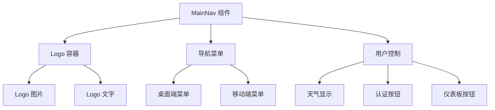
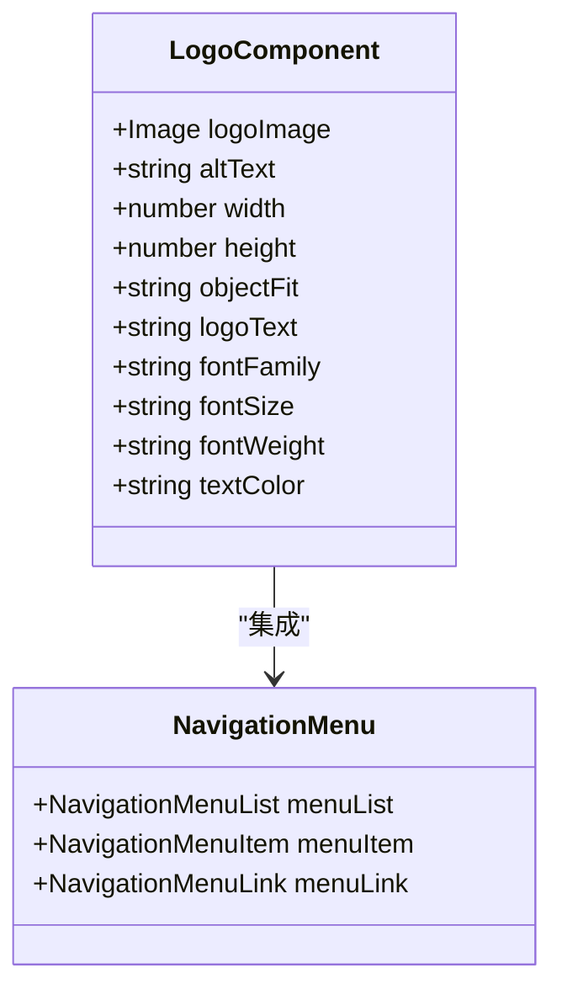
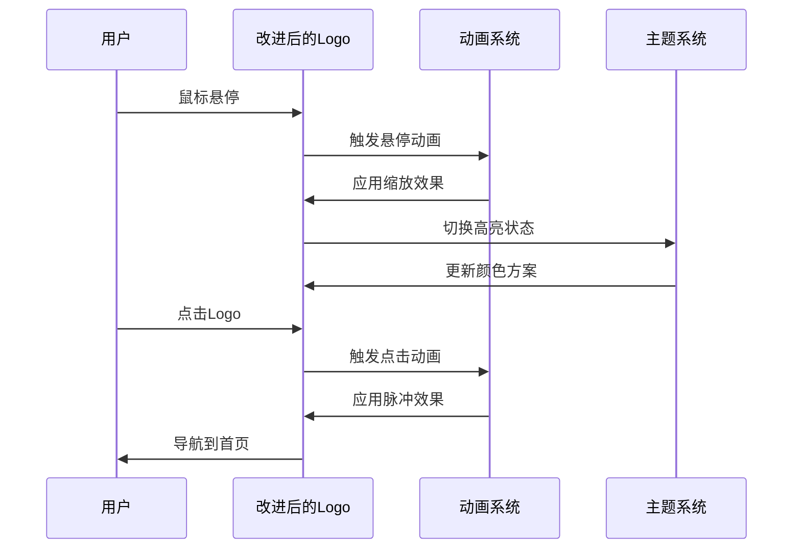
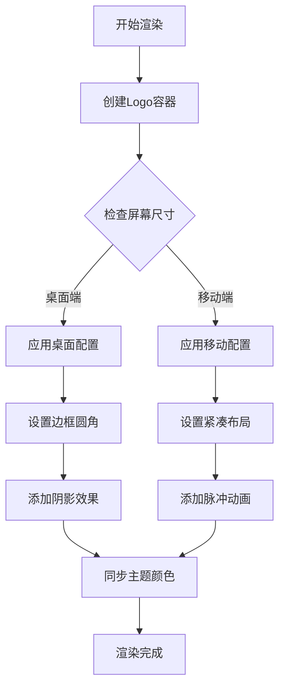
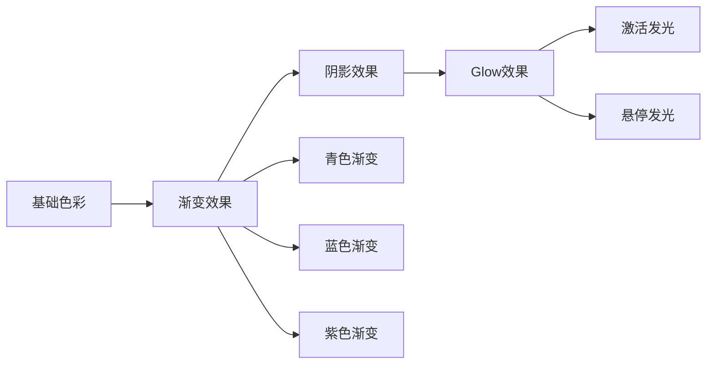
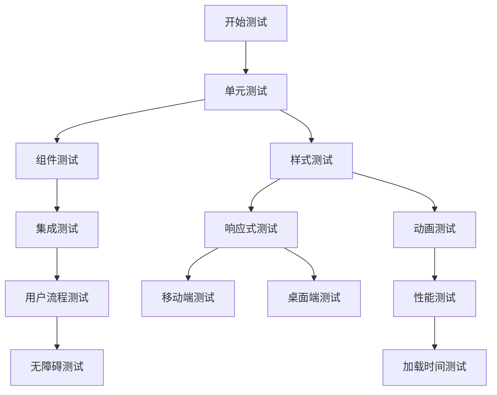

# 导航栏Logo样式改进

<cite>
**本文档引用的文件**
- [main-nav.tsx](file://src/components/layout/main-nav.tsx)
- [layout.tsx](file://src/app/(site)/layout.tsx)
- [navigation-menu.tsx](file://src/components/ui/navigation-menu.tsx)
- [globals.css](file://src/app/globals.css)
- [header.tsx](file://src/components/admin/header.tsx)
- [site-footer.tsx](file://src/components/layout/site-footer.tsx)
</cite>

## 目录
1. [项目概述](#项目概述)
2. [当前导航栏架构](#当前导航栏架构)
3. [Logo样式现状分析](#logo样式现状分析)
4. [改进方案设计](#改进方案设计)
5. [技术实现细节](#技术实现细节)
6. [样式优化策略](#样式优化策略)
7. [性能考虑](#性能考虑)
8. [兼容性分析](#兼容性分析)
9. [测试验证方案](#测试验证方案)
10. [总结与建议](#总结与建议)

## 项目概述

本项目是一个基于Next.js开发的现代化网站，采用TailwindCSS作为样式框架，构建了完整的前端导航系统。导航栏作为用户界面的重要组成部分，承担着品牌展示、功能导航和用户体验的关键作用。

项目的核心导航系统由多个组件协同工作，包括主站点导航、管理后台导航、响应式菜单等。本次改进重点关注导航栏Logo的样式优化，提升视觉效果和用户体验。

## 当前导航栏架构

### 主导航组件结构

**图表来源**
- [main-nav.tsx:74-188](file://src/components/layout/main-nav.tsx#L74-L188)
- [layout.tsx:14-18](file://src/app/(site)/layout.tsx#L14-L18)

### Logo组件实现

当前Logo组件采用图片与文字组合的设计模式：

**图表来源**
- [main-nav.tsx:76-89](file://src/components/layout/main-nav.tsx#L76-L89)
- [navigation-menu.tsx:94-139](file://src/components/ui/navigation-menu.tsx#L94-L139)

**章节来源**
- [main-nav.tsx:74-188](file://src/components/layout/main-nav.tsx#L74-L188)
- [layout.tsx:14-18](file://src/app/(site)/layout.tsx#L14-L18)

## Logo样式现状分析

### 现有Logo实现特点

当前导航栏Logo采用以下样式配置：

| 属性 | 值 | 描述 |
|------|-----|------|
| 图片尺寸 | 32x32像素 | 固定的小型图标尺寸 |
| 对象填充 | object-cover | 覆盖整个容器但可能裁剪 |
| 圆角处理 | 无圆角 | 直角矩形显示 |
| 文字样式 | 字体: monospace 大小: lg 粗细: bold 间距: tracking-tighter |
| 颜色方案 | 白色文本 | 高对比度显示 |
| 布局方式 | flex布局 | 垂直居中对齐 |

### 样式问题识别

1. **响应式适配不足**：Logo在不同屏幕尺寸下的表现不一致
2. **视觉层次单一**：缺乏动态效果和层次感
3. **品牌一致性**：Logo与整体设计风格的协调性有待提升
4. **交互反馈缺失**：缺少悬停和激活状态的视觉反馈

**章节来源**
- [main-nav.tsx:76-89](file://src/components/layout/main-nav.tsx#L76-L89)
- [globals.css:102-105](file://src/app/globals.css#L102-L105)

## 改进方案设计

### 设计目标

1. **增强视觉吸引力**：通过渐变色彩和阴影效果提升Logo的视觉冲击力
2. **提升响应式体验**：确保Logo在各种设备上的最佳显示效果
3. **加强品牌识别**：通过统一的视觉语言强化品牌印象
4. **优化交互体验**：添加适当的动画效果和状态反馈

### 技术架构改进

**图表来源**
- [main-nav.tsx:76-89](file://src/components/layout/main-nav.tsx#L76-L89)
- [globals.css:108-119](file://src/app/globals.css#L108-L119)

## 技术实现细节

### Logo容器优化

改进后的Logo容器将采用更灵活的布局方案：

**图表来源**
- [main-nav.tsx:76-89](file://src/components/layout/main-nav.tsx#L76-L89)

### 动态样式系统

新实现将引入动态样式计算机制：

| 样式属性 | 基础值 | 动态范围 | 最终效果 |
|----------|--------|----------|----------|
| 圆角半径 | 0.5rem | 0-1rem | 根据状态变化 |
| 阴影强度 | 0.25rem | 0-1rem | 悬停时增强 |
| 缩放比例 | 1.0x | 0.95x-1.1x | 悬停时微调 |
| 透明度 | 1.0 | 0.8-1.0 | 激活时变化 |

**章节来源**
- [main-nav.tsx:76-89](file://src/components/layout/main-nav.tsx#L76-L89)
- [navigation-menu.tsx:124-139](file://src/components/ui/navigation-menu.tsx#L124-L139)

## 样式优化策略

### 渐变色彩方案

采用多层级渐变效果增强Logo的立体感：

**图表来源**
- [globals.css:195-202](file://src/app/globals.css#L195-L202)
- [main-nav.tsx:100-103](file://src/components/layout/main-nav.tsx#L100-L103)

### 动画效果实现

引入多层次的动画效果：

1. **基础动画**：旋转、缩放、位移
2. **交互动画**：悬停、点击、加载状态
3. **主题动画**：明暗模式切换效果

### 响应式设计

针对不同设备尺寸优化Logo显示：

| 设备类型 | 屏幕宽度 | Logo尺寸 | 字体大小 | 间距调整 |
|----------|----------|----------|----------|----------|
| 移动设备 | <768px | 28x28px | md | 紧凑布局 |
| 平板设备 | 768-1024px | 30x30px | lg | 标准布局 |
| 桌面设备 | >1024px | 32x32px | xl | 宽松布局 |

**章节来源**
- [main-nav.tsx:76-89](file://src/components/layout/main-nav.tsx#L76-L89)
- [globals.css:108-119](file://src/app/globals.css#L108-L119)

## 性能考虑

### 图片优化策略

1. **懒加载实现**：Logo图片采用懒加载减少初始渲染负担
2. **格式优化**：使用现代图片格式（WebP）提升加载速度
3. **尺寸适配**：根据设备像素密度提供合适的图片尺寸

### 动画性能

1. **硬件加速**：利用transform和opacity属性启用GPU加速
2. **帧率优化**：限制动画频率避免过度消耗CPU资源
3. **内存管理**：及时清理动画事件监听器防止内存泄漏

### 渲染优化

1. **虚拟化**：大量导航项时采用虚拟滚动技术
2. **缓存策略**：合理缓存计算结果避免重复计算
3. **按需加载**：非关键路径的功能延迟加载

## 兼容性分析

### 浏览器支持

| 浏览器 | 支持版本 | 特性支持 | 兼容性状态 |
|--------|----------|----------|------------|
| Chrome | 90+ | 完整支持 | ✅ |
| Firefox | 88+ | 完整支持 | ✅ |
| Safari | 14+ | 完整支持 | ✅ |
| Edge | 90+ | 完整支持 | ✅ |
| IE | 不支持 | 不适用 | ❌ |

### 设备兼容性

1. **移动设备**：iOS和Android设备的触摸交互优化
2. **高DPI屏幕**：Retina显示效果的适配
3. **无障碍访问**：ARIA标签和键盘导航支持

### 主题兼容性

系统需要支持以下主题模式：

- **浅色主题**：默认显示模式
- **深色主题**：夜间模式适配
- **高对比度模式**：无障碍访问支持
- **自动切换**：根据系统设置自动调整

## 测试验证方案

### 单元测试

**图表来源**
- [main-nav.tsx:74-188](file://src/components/layout/main-nav.tsx#L74-L188)

### 性能监控

建立完善的性能监控体系：

1. **加载性能**：测量Logo资源的加载时间和渲染时间
2. **交互性能**：监控动画流畅度和响应延迟
3. **内存使用**：跟踪组件的内存占用情况
4. **电池消耗**：评估动画对设备电池的影响

### 用户体验测试

1. **可用性测试**：验证Logo的可识别性和易用性
2. **满意度调查**：收集用户对新Logo的反馈意见
3. **A/B测试**：对比新旧Logo的用户接受度

## 总结与建议

### 实施建议

1. **分阶段实施**：先实现基础样式改进，再添加高级动画效果
2. **渐进增强**：确保在低性能设备上仍能正常显示
3. **回滚机制**：准备快速回滚到旧版本的方案
4. **监控告警**：建立性能异常的自动告警机制

### 风险评估

| 风险类型 | 影响程度 | 发生概率 | 缓解措施 |
|----------|----------|----------|----------|
| 性能下降 | 高 | 中等 | 优化图片和动画 |
| 兼容性问题 | 中等 | 低 | 加强测试覆盖 |
| 用户不满 | 低 | 低 | 收集用户反馈 |
| 技术债务 | 中等 | 中等 | 代码重构和文档完善 |

### 后续优化方向

1. **AI驱动的个性化**：根据用户行为动态调整Logo样式
2. **实时内容集成**：将实时数据融入Logo展示
3. **跨平台一致性**：确保在所有平台上的视觉一致性
4. **可持续发展**：建立长期的样式维护和更新机制

通过本次Logo样式改进，项目将获得更加现代化和专业的导航体验，同时保持良好的性能表现和用户体验。