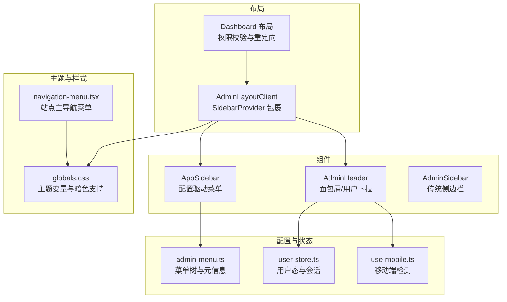
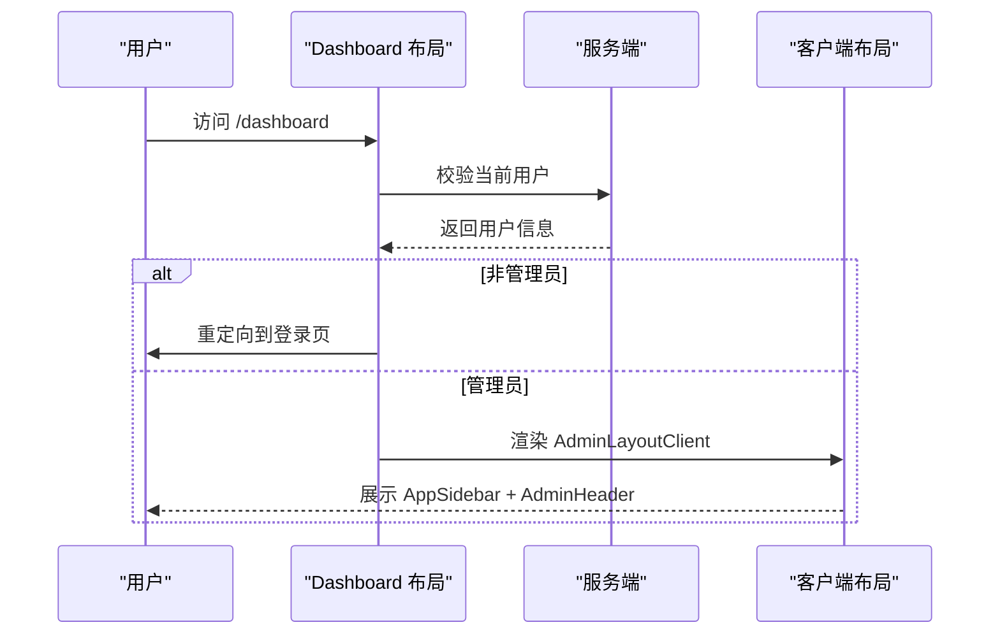
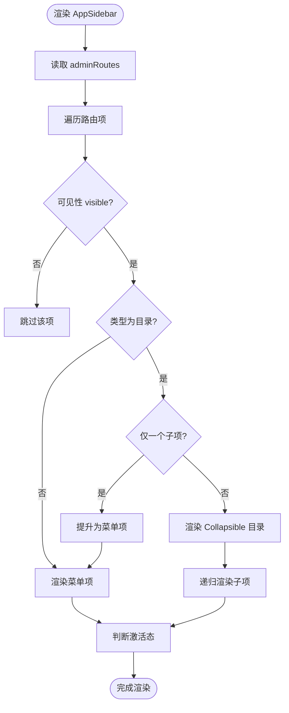
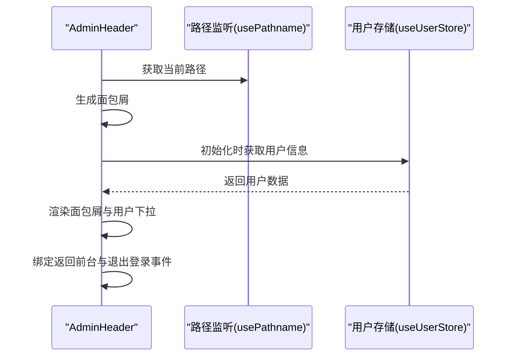
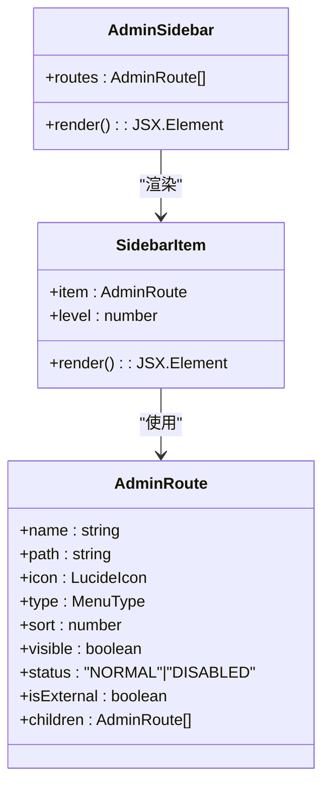
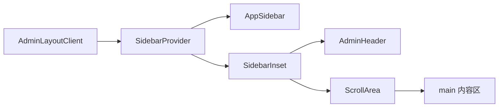
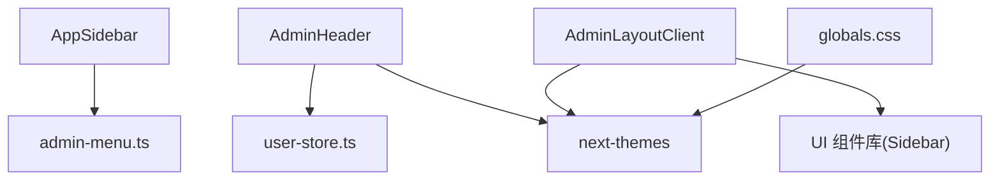

# 管理后台组件

<cite>
**本文档引用的文件**
- [app-sidebar.tsx](file://src/components/admin/app-sidebar.tsx)
- [header.tsx](file://src/components/admin/header.tsx)
- [sidebar.tsx](file://src/components/admin/sidebar.tsx)
- [admin-menu.ts](file://src/config/admin-menu.ts)
- [admin-layout-client.tsx](file://src/app/dashboard/components/admin-layout-client.tsx)
- [layout.tsx](file://src/app/dashboard/layout.tsx)
- [user-store.ts](file://src/store/user-store.ts)
- [use-mobile.ts](file://src/hooks/use-mobile.ts)
- [main-nav.tsx](file://src/components/layout/main-nav.tsx)
- [globals.css](file://src/app/globals.css)
- [navigation-menu.tsx](file://src/components/ui/navigation-menu.tsx)
</cite>

## 目录
1. [引言](#引言)
2. [项目结构](#项目结构)
3. [核心组件](#核心组件)
4. [架构总览](#架构总览)
5. [详细组件分析](#详细组件分析)
6. [依赖关系分析](#依赖关系分析)
7. [性能考虑](#性能考虑)
8. [故障排除指南](#故障排除指南)
9. [结论](#结论)
10. [附录](#附录)

## 引言
本文件面向管理后台组件的设计与实现，重点覆盖以下方面：
- 应用侧边栏 AppSidebar 的结构与交互
- 头部导航 AdminHeader 的布局、面包屑与用户态管理
- 传统侧边栏 AdminSidebar 的实现与定制
- 布局模式（主内容区、侧边栏折叠、面包屑）与响应式适配
- 权限控制集成（基于角色的访问限制）
- 组件间通信机制、状态同步与数据绑定策略
- 样式定制与主题适配建议
- 用户体验设计原则与操作流程优化

## 项目结构
管理后台采用“客户端布局 + 配置驱动菜单”的组织方式：
- 布局层：Dashboard 布局负责权限校验与客户端包装
- 组件层：AdminHeader、AppSidebar、AdminSidebar 提供导航与菜单
- 配置层：admin-menu.ts 定义菜单树与路由元信息
- 状态层：user-store.ts 管理用户态与会话
- 主题层：globals.css 定义主题变量与暗色支持

**图表来源**
- [layout.tsx:1-26](file://src/app/dashboard/layout.tsx#L1-L26)
- [admin-layout-client.tsx:1-34](file://src/app/dashboard/components/admin-layout-client.tsx#L1-L34)
- [header.tsx:1-132](file://src/components/admin/header.tsx#L1-L132)
- [app-sidebar.tsx:1-145](file://src/components/admin/app-sidebar.tsx#L1-L145)
- [sidebar.tsx:1-137](file://src/components/admin/sidebar.tsx#L1-L137)
- [admin-menu.ts:1-199](file://src/config/admin-menu.ts#L1-L199)
- [user-store.ts:1-49](file://src/store/user-store.ts#L1-L49)
- [use-mobile.ts:1-20](file://src/hooks/use-mobile.ts#L1-L20)
- [globals.css:1-57](file://src/app/globals.css#L1-L57)
- [navigation-menu.tsx:1-168](file://src/components/ui/navigation-menu.tsx#L1-L168)

**章节来源**
- [layout.tsx:1-26](file://src/app/dashboard/layout.tsx#L1-L26)
- [admin-layout-client.tsx:1-34](file://src/app/dashboard/components/admin-layout-client.tsx#L1-L34)

## 核心组件
- AppSidebar：基于 UI 组件库的可折叠侧边栏，使用配置驱动的菜单树渲染，支持目录/菜单混合结构与自动激活态高亮。
- AdminHeader：顶部导航条，包含侧边栏触发器、面包屑导航、用户头像下拉菜单与返回前台入口。
- AdminSidebar：传统侧边栏实现，用于非 UI 组件库场景或需要自定义样式的页面。

这些组件共同构成管理后台的导航骨架，并通过配置文件 admin-menu.ts 实现菜单的统一管理与扩展。

**章节来源**
- [app-sidebar.tsx:31-69](file://src/components/admin/app-sidebar.tsx#L31-L69)
- [header.tsx:23-131](file://src/components/admin/header.tsx#L23-L131)
- [sidebar.tsx:22-44](file://src/components/admin/sidebar.tsx#L22-L44)

## 架构总览
管理后台采用“服务端权限校验 + 客户端布局包裹”的模式：
- 服务端在进入 /dashboard 时检查用户身份与角色，非管理员直接跳转至登录页
- 客户端通过 AdminLayoutClient 包裹 AppSidebar 与 AdminHeader，并提供主题与侧边栏上下文

**图表来源**
- [layout.tsx:5-25](file://src/app/dashboard/layout.tsx#L5-L25)
- [admin-layout-client.tsx:9-33](file://src/app/dashboard/components/admin-layout-client.tsx#L9-L33)

## 详细组件分析

### AppSidebar 应用侧边栏
- 结构组成
  - SidebarHeader：平台 Logo 与标题
  - SidebarContent：菜单组与菜单项
  - SidebarFooter：版本信息
  - SidebarRail：滚动轨道
- 菜单渲染逻辑
  - 使用 adminRoutes 渲染菜单树
  - 支持目录（CATALOG）与菜单（MENU）两种类型
  - 当目录仅有一个子项时，自动降级为菜单项以简化层级
  - 子目录使用 Collapsible 控件，默认展开包含当前路径的子项
- 激活态判定
  - 通过 usePathname 判断当前路径是否与菜单项路径完全匹配
  - 对于目录，若其任意子项路径前缀匹配当前路径则视为激活
- 可折叠行为
  - 通过 Sidebar 的 collapsible="icon" 属性启用图标模式的折叠
  - 与 SidebarTrigger 协同工作，实现侧边栏的展开/收起

**图表来源**
- [app-sidebar.tsx:71-144](file://src/components/admin/app-sidebar.tsx#L71-L144)
- [admin-menu.ts:6-16](file://src/config/admin-menu.ts#L6-L16)

**章节来源**
- [app-sidebar.tsx:31-69](file://src/components/admin/app-sidebar.tsx#L31-L69)
- [app-sidebar.tsx:71-144](file://src/components/admin/app-sidebar.tsx#L71-L144)
- [admin-menu.ts:18-199](file://src/config/admin-menu.ts#L18-L199)

### AdminHeader 头部导航
- 面包屑生成
  - 基于当前路径分割并首字母大写生成面包屑片段
  - 最后一项高亮显示
- 用户态管理
  - 初始化时调用 useUserStore.fetchUser 获取用户信息
  - 下拉菜单展示用户名、邮箱等信息，并提供退出登录
- 交互元素
  - 侧边栏触发器：用于切换 AppSidebar 折叠状态
  - 返回前台入口：点击回到站点首页
  - 全局搜索/通知/设置等占位功能已移除或注释

**图表来源**
- [header.tsx:23-131](file://src/components/admin/header.tsx#L23-L131)
- [user-store.ts:26-42](file://src/store/user-store.ts#L26-L42)

**章节来源**
- [header.tsx:23-131](file://src/components/admin/header.tsx#L23-L131)
- [user-store.ts:1-49](file://src/store/user-store.ts#L1-L49)

### AdminSidebar 传统侧边栏
- 结构组成
  - 顶部品牌区
  - 导航区：按 routes 渲染菜单项
  - 底部版本信息
- 菜单渲染逻辑
  - 支持目录与菜单两种类型
  - 目录默认展开，子项缩进显示
  - 菜单项根据激活态添加高亮样式
- 图标处理
  - 顶层菜单显示图标；嵌套菜单无图标时使用小圆点占位

**图表来源**
- [sidebar.tsx:22-44](file://src/components/admin/sidebar.tsx#L22-L44)
- [sidebar.tsx:47-136](file://src/components/admin/sidebar.tsx#L47-L136)
- [admin-menu.ts:6-16](file://src/config/admin-menu.ts#L6-L16)

**章节来源**
- [sidebar.tsx:22-44](file://src/components/admin/sidebar.tsx#L22-L44)
- [sidebar.tsx:47-136](file://src/components/admin/sidebar.tsx#L47-L136)
- [admin-menu.ts:18-199](file://src/config/admin-menu.ts#L18-L199)

### 布局与容器
- AdminLayoutClient
  - 提供 SidebarProvider/SidebarInset 上下文
  - 包裹 AppSidebar 与 AdminHeader
  - 内容区使用 ScrollArea 与背景色区分
- Dashboard 布局
  - 服务端校验用户身份与角色
  - 非管理员重定向至登录页

**图表来源**
- [admin-layout-client.tsx:9-33](file://src/app/dashboard/components/admin-layout-client.tsx#L9-L33)

**章节来源**
- [admin-layout-client.tsx:9-33](file://src/app/dashboard/components/admin-layout-client.tsx#L9-L33)
- [layout.tsx:5-25](file://src/app/dashboard/layout.tsx#L5-L25)

## 依赖关系分析
- 组件耦合
  - AppSidebar 依赖 admin-menu.ts 的菜单配置
  - AdminHeader 依赖 user-store.ts 的用户状态
  - AdminLayoutClient 依赖 UI 组件库提供的 Sidebar 上下文
- 外部依赖
  - next/navigation 提供路径与路由能力
  - lucide-react 提供图标
  - next-themes 与主题变量提供深浅主题切换
- 潜在循环依赖
  - 当前结构未发现循环依赖；配置与组件分离降低耦合度

**图表来源**
- [app-sidebar.tsx:28-29](file://src/components/admin/app-sidebar.tsx#L28-L29)
- [header.tsx:6-21](file://src/components/admin/header.tsx#L6-L21)
- [admin-layout-client.tsx:5-6](file://src/app/dashboard/components/admin-layout-client.tsx#L5-L6)
- [globals.css:30-57](file://src/app/globals.css#L30-L57)

**章节来源**
- [app-sidebar.tsx:28-29](file://src/components/admin/app-sidebar.tsx#L28-L29)
- [header.tsx:6-21](file://src/components/admin/header.tsx#L6-L21)
- [admin-layout-client.tsx:5-6](file://src/app/dashboard/components/admin-layout-client.tsx#L5-L6)
- [globals.css:30-57](file://src/app/globals.css#L30-L57)

## 性能考虑
- 路由与激活态计算
  - 使用 usePathname 进行轻量级字符串匹配，复杂度 O(n) 遍历菜单项
  - 目录激活态通过前缀匹配判断，避免深层递归
- 渲染优化
  - 目录使用 Collapsible 控件，仅在展开时渲染子项，减少 DOM 数量
  - 菜单项激活态通过类名切换，避免不必要的重新渲染
- 主题与样式
  - 通过 CSS 变量与暗色类名切换，避免运行时样式重排
- 状态管理
  - 用户信息通过 useUserStore 缓存，首次加载后复用，减少网络请求

[本节为通用指导，无需具体文件引用]

## 故障排除指南
- 无法进入管理后台
  - 检查服务端布局中的用户校验逻辑与角色判断
  - 确认用户已登录且角色为 ADMIN
- 菜单不显示或不生效
  - 检查 admin-menu.ts 中对应菜单的 visible 与 status 字段
  - 确认路径与实际路由一致
- 侧边栏无法折叠
  - 确认 AppSidebar 使用了 Sidebar 组件并与 SidebarTrigger 协同
  - 检查 SidebarProvider 是否正确包裹
- 面包屑异常
  - 检查路径中是否存在特殊字符或空段
  - 确认面包屑生成逻辑对空值的过滤
- 用户信息未显示
  - 确认 useUserStore.fetchUser 在组件挂载时被调用
  - 检查 /api/auth/me 接口返回格式

**章节来源**
- [layout.tsx:10-18](file://src/app/dashboard/layout.tsx#L10-L18)
- [admin-menu.ts:12-13](file://src/config/admin-menu.ts#L12-L13)
- [app-sidebar.tsx:33-33](file://src/components/admin/app-sidebar.tsx#L33-L33)
- [header.tsx:28-30](file://src/components/admin/header.tsx#L28-L30)
- [user-store.ts:26-42](file://src/store/user-store.ts#L26-L42)

## 结论
该管理后台组件体系以配置驱动菜单为核心，结合客户端布局与主题系统，实现了清晰的导航结构与良好的用户体验。通过服务端权限校验与客户端状态管理的配合，确保了安全与可用性。建议在后续迭代中进一步完善权限细粒度控制、菜单动态加载与国际化支持，持续优化交互细节与性能表现。

[本节为总结性内容，无需具体文件引用]

## 附录

### 配置选项与定制方法
- 菜单配置（admin-menu.ts）
  - 字段说明：name、path、icon、type、sort、visible、status、isExternal、children
  - 类型：CATALOG（目录）、MENU（菜单）
  - 状态：NORMAL（正常）、DISABLED（禁用）
- 样式定制（globals.css）
  - 通过 CSS 变量调整侧边栏颜色与主题
  - 支持暗色模式切换与过渡关闭
- 响应式适配（use-mobile.ts）
  - 提供移动端断点检测，便于在组件中进行条件渲染

**章节来源**
- [admin-menu.ts:6-16](file://src/config/admin-menu.ts#L6-L16)
- [globals.css:30-57](file://src/app/globals.css#L30-L57)
- [use-mobile.ts:3-18](file://src/hooks/use-mobile.ts#L3-L18)

### 交互行为说明
- 侧边栏折叠：点击触发器切换折叠状态
- 面包屑导航：点击返回上一级，最后项不可点击
- 用户下拉：支持个人中心、设置与退出登录
- 移动端：MainNav 提供汉堡菜单，支持登录/登出与跳转

**章节来源**
- [header.tsx:50-127](file://src/components/admin/header.tsx#L50-L127)
- [main-nav.tsx:175-257](file://src/components/layout/main-nav.tsx#L175-L257)

### 数据绑定策略
- 路由绑定：usePathname 与菜单 path 进行匹配
- 用户绑定：useUserStore 管理用户信息与会话生命周期
- 主题绑定：next-themes 与 CSS 变量联动

**章节来源**
- [app-sidebar.tsx:72-85](file://src/components/admin/app-sidebar.tsx#L72-L85)
- [header.tsx:24-26](file://src/components/admin/header.tsx#L24-L26)
- [user-store.ts:26-42](file://src/store/user-store.ts#L26-L42)