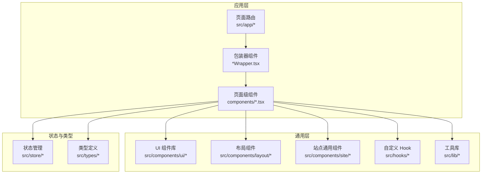
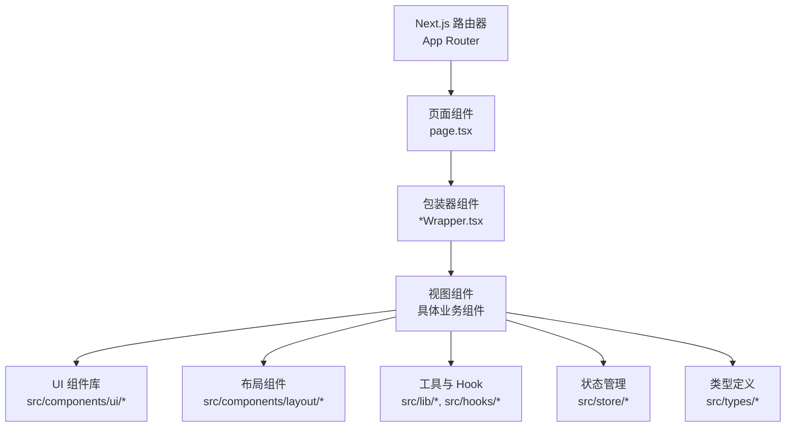
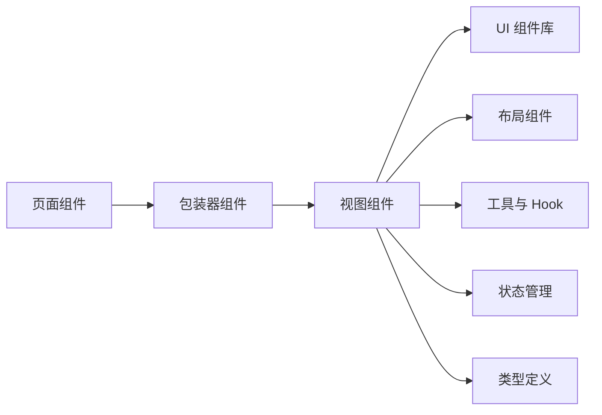

# 组件开发规范

<cite>
**本文档引用的文件**
- [package.json](file://package.json)
- [tsconfig.json](file://tsconfig.json)
- [eslint.config.mjs](file://eslint.config.mjs)
- [next.config.ts](file://next.config.ts)
- [components.json](file://components.json)
- [src/app/(site)/ai-platform/components/ai-hero.tsx](file://src/app/(site)/ai-platform/components/ai-hero.tsx)
- [src/app/(site)/ai-platform/components/ai-grid.tsx](file://src/app/(site)/ai-platform/components/ai-grid.tsx)
- [src/app/(site)/ai-platform/components/ai-sidebar.tsx](file://src/app/(site)/ai-platform/components/ai-sidebar.tsx)
- [src/app/(site)/friends/components/friend-link-grid.tsx](file://src/app/(site)/friends/components/friend-link-grid.tsx)
- [src/app/(site)/friends/components/friend-links-wrapper.tsx](file://src/app/(site)/friends/components/friend-links-wrapper.tsx)
- [src/app/(site)/graph/[slug]/components/comments-wrapper.tsx](file://src/app/(site)/graph/[slug]/components/comments-wrapper.tsx)
- [src/app/(site)/graph/[slug]/components/interaction-wrapper.tsx](file://src/app/(site)/graph/[slug]/components/interaction-wrapper.tsx)
- [src/app/(site)/tools/lucky-draw/components/control-panel.tsx](file://src/app/(site)/tools/lucky-draw/components/control-panel.tsx)
- [src/app/(site)/tools/lucky-draw/components/lottery-scene.tsx](file://src/app/(site)/tools/lucky-draw/components/lottery-scene.tsx)
- [src/app/(site)/tools/lucky-draw/components/lottery-wheel.tsx](file://src/app/(site)/tools/lucky-draw/components/lottery-wheel.tsx)
- [src/app/(site)/tools/random-data-generator/components/random-data-generator.tsx](file://src/app/(site)/tools/random-data-generator/components/random-data-generator.tsx)
- [src/app/(site)/tools/text-diff/components/text-diff-tool.tsx](file://src/app/(site)/tools/text-diff/components/text-diff-tool.tsx)
- [src/components/ui/button.tsx](file://src/components/ui/button.tsx)
- [src/components/ui/dialog.tsx](file://src/components/ui/dialog.tsx)
- [src/components/ui/form.tsx](file://src/components/ui/form.tsx)
- [src/components/ui/input.tsx](file://src/components/ui/input.tsx)
- [src/components/ui/table.tsx](file://src/components/ui/table.tsx)
- [src/components/site/hero.tsx](file://src/components/site/hero.tsx)
- [src/components/site/feature-grid.tsx](file://src/components/site/feature-grid.tsx)
- [src/components/layout/main-nav.tsx](file://src/components/layout/main-nav.tsx)
- [src/components/layout/site-footer.tsx](file://src/components/layout/site-footer.tsx)
- [src/hooks/use-mobile.ts](file://src/hooks/use-mobile.ts)
- [src/lib/utils.ts](file://src/lib/utils.ts)
- [src/store/loading-store.ts](file://src/store/loading-store.ts)
- [src/store/user-store.ts](file://src/store/user-store.ts)
- [src/types/command.ts](file://src/types/command.ts)
- [src/middleware.ts](file://src/middleware.ts)
- [src/app/(site)/tools/random-data-generator/components/data-generator.ts](file://src/app/(site)/tools/random-data-generator/components/data-generator.ts)
- [src/app/(site)/tools/random-data-generator/components/use-toast.ts](file://src/app/(site)/tools/random-data-generator/components/use-toast.ts)
- [src/app/(site)/tools/text-diff/components/use-toast.ts](file://src/app/(site)/tools/text-diff/components/use-toast.ts)
</cite>

## 目录
1. [引言](#引言)
2. [项目结构](#项目结构)
3. [核心组件](#核心组件)
4. [架构总览](#架构总览)
5. [详细组件分析](#详细组件分析)
6. [依赖关系分析](#依赖关系分析)
7. [性能考虑](#性能考虑)
8. [故障排除指南](#故障排除指南)
9. [结论](#结论)
10. [附录](#附录)

## 引言
本规范旨在为本项目提供一套系统化的组件开发标准与最佳实践，覆盖从需求分析到实现、测试与文档编写的全流程。内容涵盖组件命名约定、文件组织结构、代码风格、接口设计（Props）、TypeScript 类型声明、可测试性设计、可访问性（无障碍）与键盘导航、性能优化（渲染、内存、懒加载）、版本管理与向后兼容策略等。本文档以仓库中现有组件与配置为依据，结合 Next.js App Router 的组织方式，给出可落地的实施建议。

## 项目结构
项目采用 Next.js App Router 的目录结构，页面路由位于 src/app 下，按功能域划分（如 (site)、(auth)、dashboard 等），每个功能域内包含 components 子目录用于存放页面级或功能级组件。通用 UI 组件集中于 src/components/ui，业务通用组件位于 src/components/site、src/components/layout 等目录；工具类组件分布在各功能模块下。全局状态通过 src/store 管理，共享逻辑在 src/hooks 与 src/lib 中实现，类型定义位于 src/types。

图表来源
- [src/app/(site)/ai-platform/components/ai-hero.tsx](file://src/app/(site)/ai-platform/components/ai-hero.tsx#L1-L200)
- [src/app/(site)/friends/components/friend-link-grid.tsx](file://src/app/(site)/friends/components/friend-link-grid.tsx#L1-L200)
- [src/components/ui/button.tsx:1-200](file://src/components/ui/button.tsx#L1-L200)
- [src/components/layout/main-nav.tsx:1-200](file://src/components/layout/main-nav.tsx#L1-L200)
- [src/store/loading-store.ts:1-200](file://src/store/loading-store.ts#L1-L200)
- [src/types/command.ts:1-200](file://src/types/command.ts#L1-L200)

章节来源
- [src/app/(site)/ai-platform/components/ai-hero.tsx](file://src/app/(site)/ai-platform/components/ai-hero.tsx#L1-L200)
- [src/app/(site)/friends/components/friend-link-grid.tsx](file://src/app/(site)/friends/components/friend-link-grid.tsx#L1-L200)
- [src/components/ui/button.tsx:1-200](file://src/components/ui/button.tsx#L1-L200)
- [src/components/layout/main-nav.tsx:1-200](file://src/components/layout/main-nav.tsx#L1-L200)
- [src/store/loading-store.ts:1-200](file://src/store/loading-store.ts#L1-L200)
- [src/types/command.ts:1-200](file://src/types/command.ts#L1-L200)

## 核心组件
本节对具有代表性的组件进行深入分析，展示其 Props 设计、内部状态、交互行为与可测试性要点。

- 页面级组件示例：AI 平台页的头部组件、网格组件与侧边栏组件，体现页面级容器与功能拆分。
- 功能模块组件：抽签工具的控制面板、转盘场景与轮盘组件，展示复杂交互与状态管理。
- 工具类组件：随机数据生成器与文本对比工具，体现工具型组件的数据处理与用户反馈。
- 通用 UI 组件：按钮、对话框、表单、输入框与表格，体现可复用 UI 的设计与扩展性。

章节来源
- [src/app/(site)/ai-platform/components/ai-hero.tsx](file://src/app/(site)/ai-platform/components/ai-hero.tsx#L1-L200)
- [src/app/(site)/ai-platform/components/ai-grid.tsx](file://src/app/(site)/ai-platform/components/ai-grid.tsx#L1-L200)
- [src/app/(site)/ai-platform/components/ai-sidebar.tsx](file://src/app/(site)/ai-platform/components/ai-sidebar.tsx#L1-L200)
- [src/app/(site)/tools/lucky-draw/components/control-panel.tsx](file://src/app/(site)/tools/lucky-draw/components/control-panel.tsx#L1-L200)
- [src/app/(site)/tools/lucky-draw/components/lottery-scene.tsx](file://src/app/(site)/tools/lucky-draw/components/lottery-scene.tsx#L1-L200)
- [src/app/(site)/tools/lucky-draw/components/lottery-wheel.tsx](file://src/app/(site)/tools/lucky-draw/components/lottery-wheel.tsx#L1-L200)
- [src/app/(site)/tools/random-data-generator/components/random-data-generator.tsx](file://src/app/(site)/tools/random-data-generator/components/random-data-generator.tsx#L1-L200)
- [src/app/(site)/tools/text-diff/components/text-diff-tool.tsx](file://src/app/(site)/tools/text-diff/components/text-diff-tool.tsx#L1-L200)
- [src/components/ui/button.tsx:1-200](file://src/components/ui/button.tsx#L1-L200)
- [src/components/ui/dialog.tsx:1-200](file://src/components/ui/dialog.tsx#L1-L200)
- [src/components/ui/form.tsx:1-200](file://src/components/ui/form.tsx#L1-L200)
- [src/components/ui/input.tsx:1-200](file://src/components/ui/input.tsx#L1-L200)
- [src/components/ui/table.tsx:1-200](file://src/components/ui/table.tsx#L1-L200)

## 架构总览
组件开发遵循“页面路由 → 包装器 → 具体组件”的层次化组织方式。页面路由负责数据获取与渲染入口，包装器组件承担上下文注入、布局与通用逻辑，具体组件聚焦单一职责与可复用性。通用 UI 组件通过一致的 Props 接口与样式体系提升一致性与可维护性。

图表来源
- [src/app/(site)/ai-platform/page.tsx](file://src/app/(site)/ai-platform/page.tsx#L1-L200)
- [src/app/(site)/ai-platform/components/ai-tools-wrapper.tsx](file://src/app/(site)/ai-platform/components/ai-tools-wrapper.tsx#L1-L200)
- [src/components/ui/button.tsx:1-200](file://src/components/ui/button.tsx#L1-L200)
- [src/components/layout/main-nav.tsx:1-200](file://src/components/layout/main-nav.tsx#L1-L200)
- [src/store/loading-store.ts:1-200](file://src/store/loading-store.ts#L1-L200)
- [src/types/command.ts:1-200](file://src/types/command.ts#L1-L200)

## 详细组件分析

### 页面级组件：AI 平台头部与网格
- 设计要点
  - 头部组件作为页面级入口，负责标题、引导信息与操作入口。
  - 网格组件承载列表/卡片展示，关注响应式布局与可访问性标签。
- Props 建议
  - 明确必填与可选参数，避免过度耦合。
  - 使用 TypeScript 只读接口约束输入，确保类型安全。
- 可测试性
  - 通过 props 注入模拟数据，验证渲染分支与交互事件。
  - 对可访问性标签进行断言，确保屏幕阅读器友好。

章节来源
- [src/app/(site)/ai-platform/components/ai-hero.tsx](file://src/app/(site)/ai-platform/components/ai-hero.tsx#L1-L200)
- [src/app/(site)/ai-platform/components/ai-grid.tsx](file://src/app/(site)/ai-platform/components/ai-grid.tsx#L1-L200)

### 功能模块组件：抽签工具
- 设计要点
  - 控制面板负责启动/停止与参数设置；场景组件负责动画与状态协调；轮盘组件负责视觉旋转与结果计算。
- Props 建议
  - 将回调函数与状态暴露为可选 Props，便于测试与复用。
  - 对动画时长、旋转角度等数值参数提供默认值与边界校验。
- 可测试性
  - 使用定时器模拟与状态快照，验证动画流程与结果一致性。
  - 模拟用户交互序列，覆盖异常路径（如中途停止、参数非法）。

章节来源
- [src/app/(site)/tools/lucky-draw/components/control-panel.tsx](file://src/app/(site)/tools/lucky-draw/components/control-panel.tsx#L1-L200)
- [src/app/(site)/tools/lucky-draw/components/lottery-scene.tsx](file://src/app/(site)/tools/lucky-draw/components/lottery-scene.tsx#L1-L200)
- [src/app/(site)/tools/lucky-draw/components/lottery-wheel.tsx](file://src/app/(site)/tools/lucky-draw/components/lottery-wheel.tsx#L1-L200)

### 工具类组件：随机数据生成器与文本对比
- 设计要点
  - 数据生成器负责生成与导出数据，文本对比工具负责差异高亮与复制。
- Props 建议
  - 将生成规则与输出格式抽象为可配置项，保持组件灵活性。
  - 提供统一的用户反馈接口（如 toast），保证跨工具一致性。
- 可测试性
  - 验证生成数据的格式与范围，确保边界条件正确。
  - 对比算法的关键分支进行单元测试，覆盖空值、超长文本等场景。

章节来源
- [src/app/(site)/tools/random-data-generator/components/random-data-generator.tsx](file://src/app/(site)/tools/random-data-generator/components/random-data-generator.tsx#L1-L200)
- [src/app/(site)/tools/text-diff/components/text-diff-tool.tsx](file://src/app/(site)/tools/text-diff/components/text-diff-tool.tsx#L1-L200)
- [src/app/(site)/tools/random-data-generator/components/use-toast.ts](file://src/app/(site)/tools/random-data-generator/components/use-toast.ts#L1-L200)
- [src/app/(site)/tools/text-diff/components/use-toast.ts](file://src/app/(site)/tools/text-diff/components/use-toast.ts#L1-L200)

### 通用 UI 组件：按钮、对话框、表单与表格
- 设计要点
  - 统一尺寸、颜色与阴影，保持视觉一致性。
  - 通过变体（variant）与尺寸（size）扩展能力，避免重复组件。
- Props 建议
  - 使用联合类型约束变体与尺寸，防止无效传参。
  - 将事件处理器与状态管理解耦，便于测试与复用。
- 可测试性
  - 验证不同变体下的渲染差异与交互行为。
  - 对焦点管理与键盘快捷键进行可访问性测试。

章节来源
- [src/components/ui/button.tsx:1-200](file://src/components/ui/button.tsx#L1-L200)
- [src/components/ui/dialog.tsx:1-200](file://src/components/ui/dialog.tsx#L1-L200)
- [src/components/ui/form.tsx:1-200](file://src/components/ui/form.tsx#L1-L200)
- [src/components/ui/input.tsx:1-200](file://src/components/ui/input.tsx#L1-L200)
- [src/components/ui/table.tsx:1-200](file://src/components/ui/table.tsx#L1-L200)

### 布局与站点通用组件
- 主导航与页脚组件体现站点级通用逻辑，应保持最小化与高内聚。
- 建议通过 Context 或 Provider 注入主题、语言等全局状态，减少重复传递。

章节来源
- [src/components/layout/main-nav.tsx:1-200](file://src/components/layout/main-nav.tsx#L1-L200)
- [src/components/layout/site-footer.tsx:1-200](file://src/components/layout/site-footer.tsx#L1-L200)

### 自定义 Hook 与工具库
- use-mobile 用于响应式判断，建议返回稳定对象以避免不必要的重渲染。
- utils 提供通用工具函数，应保持纯函数特性，便于测试与缓存。

章节来源
- [src/hooks/use-mobile.ts:1-200](file://src/hooks/use-mobile.ts#L1-L200)
- [src/lib/utils.ts:1-200](file://src/lib/utils.ts#L1-L200)

### 状态管理与类型定义
- 加载状态与用户状态通过独立 Store 管理，建议使用不可变更新与选择器优化订阅。
- 类型定义集中于 src/types，确保跨模块一致的类型契约。

章节来源
- [src/store/loading-store.ts:1-200](file://src/store/loading-store.ts#L1-L200)
- [src/store/user-store.ts:1-200](file://src/store/user-store.ts#L1-L200)
- [src/types/command.ts:1-200](file://src/types/command.ts#L1-L200)

## 依赖关系分析
组件间依赖呈现“页面 → 包装器 → 视图 → UI/布局/工具/状态/类型”的链路。UI 组件与布局组件被多处复用，形成稳定的依赖拓扑。

图表来源
- [src/app/(site)/ai-platform/components/ai-hero.tsx](file://src/app/(site)/ai-platform/components/ai-hero.tsx#L1-L200)
- [src/app/(site)/ai-platform/components/ai-tools-wrapper.tsx](file://src/app/(site)/ai-platform/components/ai-tools-wrapper.tsx#L1-L200)
- [src/components/ui/button.tsx:1-200](file://src/components/ui/button.tsx#L1-L200)
- [src/components/layout/main-nav.tsx:1-200](file://src/components/layout/main-nav.tsx#L1-L200)
- [src/store/loading-store.ts:1-200](file://src/store/loading-store.ts#L1-L200)
- [src/types/command.ts:1-200](file://src/types/command.ts#L1-L200)

章节来源
- [src/app/(site)/ai-platform/components/ai-hero.tsx](file://src/app/(site)/ai-platform/components/ai-hero.tsx#L1-L200)
- [src/app/(site)/ai-platform/components/ai-tools-wrapper.tsx](file://src/app/(site)/ai-platform/components/ai-tools-wrapper.tsx#L1-L200)
- [src/components/ui/button.tsx:1-200](file://src/components/ui/button.tsx#L1-L200)
- [src/components/layout/main-nav.tsx:1-200](file://src/components/layout/main-nav.tsx#L1-L200)
- [src/store/loading-store.ts:1-200](file://src/store/loading-store.ts#L1-L200)
- [src/types/command.ts:1-200](file://src/types/command.ts#L1-L200)

## 性能考虑
- 渲染优化
  - 使用 React.memo 与 useMemo 缓存昂贵计算与子树渲染，避免无谓重渲染。
  - 列表渲染时提供稳定 key，优先使用 ID；对长列表启用虚拟化。
- 内存管理
  - 在组件卸载时清理定时器、事件监听与订阅，防止内存泄漏。
  - 对大对象或二进制数据使用惰性初始化与弱引用策略。
- 懒加载策略
  - 使用动态导入分割代码块，延迟加载非首屏组件与重型依赖。
  - 图片与视频资源配合占位符与预加载策略，提升感知性能。
- 服务端渲染与水合
  - 合理使用 Suspense 边界与并行数据获取，减少首屏阻塞。
  - 避免在水合阶段产生不一致的 DOM 结构。

## 故障排除指南
- 可访问性问题
  - 确保所有交互元素具备语义化标签与键盘可达性；为图标与装饰性元素提供适当的 ARIA 属性。
  - 对模态弹窗使用 aria-modal，并在打开时锁定背景滚动。
- 单元测试与模拟
  - 使用测试框架提供的事件模拟与状态快照，覆盖正常与异常分支。
  - 对异步流程使用定时器控制与微任务队列推进，确保测试稳定性。
- 性能回归
  - 建立基准测试与慢查询检测机制，定期审查重渲染热点与内存占用。
  - 对第三方依赖进行体积分析与更新策略管理。

## 结论
本规范基于现有代码库提炼出可复用的组件开发模式与最佳实践，建议在后续迭代中持续完善类型约束、可访问性与性能指标，并通过自动化工具保障质量门槛。通过明确的命名约定、文件组织与接口设计，团队可以高效协作并降低维护成本。

## 附录

### 组件命名约定
- 文件命名：采用帕斯卡命名法，如 Button.tsx、CommentsWrapper.tsx。
- 组件命名：与文件名一致，导出默认组件时保持一致。
- 目录命名：按功能域与页面划分，如 tools/lucky-draw/components。

章节来源
- [src/app/(site)/ai-platform/components/ai-hero.tsx](file://src/app/(site)/ai-platform/components/ai-hero.tsx#L1-L200)
- [src/app/(site)/tools/lucky-draw/components/control-panel.tsx](file://src/app/(site)/tools/lucky-draw/components/control-panel.tsx#L1-L200)

### 文件组织结构
- 页面路由：src/app/(site)/ai-platform/page.tsx
- 包装器：src/app/(site)/ai-platform/components/ai-tools-wrapper.tsx
- 页面级组件：src/app/(site)/ai-platform/components/ai-hero.tsx, ai-grid.tsx, ai-sidebar.tsx
- 通用 UI：src/components/ui/*
- 布局：src/components/layout/*
- 工具与 Hook：src/lib/*, src/hooks/*
- 状态：src/store/*
- 类型：src/types/*

章节来源
- [src/app/(site)/ai-platform/page.tsx](file://src/app/(site)/ai-platform/page.tsx#L1-L200)
- [src/app/(site)/ai-platform/components/ai-tools-wrapper.tsx](file://src/app/(site)/ai-platform/components/ai-tools-wrapper.tsx#L1-L200)
- [src/components/ui/button.tsx:1-200](file://src/components/ui/button.tsx#L1-L200)
- [src/components/layout/main-nav.tsx:1-200](file://src/components/layout/main-nav.tsx#L1-L200)
- [src/store/loading-store.ts:1-200](file://src/store/loading-store.ts#L1-L200)
- [src/types/command.ts:1-200](file://src/types/command.ts#L1-L200)

### 代码风格与工具配置
- TypeScript：严格模式、路径映射与模块解析策略见 tsconfig.json。
- ESLint：统一的规则集与插件配置，确保代码风格一致性。
- Next.js：构建与运行配置，包含实验性特性开关与性能优化选项。
- 组件库：Tailwind 与 Radix UI 的集成，提供一致的 UI 基础设施。

章节来源
- [tsconfig.json:1-200](file://tsconfig.json#L1-L200)
- [eslint.config.mjs:1-200](file://eslint.config.mjs#L1-L200)
- [next.config.ts:1-200](file://next.config.ts#L1-L200)
- [components.json:1-200](file://components.json#L1-L200)

### 接口设计与 TypeScript 类型声明
- Props 设计：使用只读接口与联合类型，明确必填/可选字段。
- 回调与状态：将副作用与状态管理外置，组件仅负责渲染与事件透传。
- 类型复用：在 src/types 中集中定义跨模块共享的类型别名与接口。

章节来源
- [src/types/command.ts:1-200](file://src/types/command.ts#L1-L200)

### 可测试性设计
- 测试策略：针对渲染分支、交互事件与异步流程编写单元测试。
- 模拟数据：使用工厂函数或固定样本，保证测试可重复性。
- 覆盖率：设定最低覆盖率阈值，重点保护关键路径与错误分支。

章节来源
- [src/app/(site)/tools/random-data-generator/components/random-data-generator.tsx](file://src/app/(site)/tools/random-data-generator/components/random-data-generator.tsx#L1-L200)
- [src/app/(site)/tools/text-diff/components/text-diff-tool.tsx](file://src/app/(site)/tools/text-diff/components/text-diff-tool.tsx#L1-L200)

### 可访问性与键盘导航
- 语义化标签：为交互元素提供 aria-label 或 aria-labelledby。
- 键盘可达性：Tab 顺序合理，Enter/Space 触发动作，Esc 关闭模态。
- 屏幕阅读器：提供必要的状态提示与错误信息朗读。

章节来源
- [src/components/ui/button.tsx:1-200](file://src/components/ui/button.tsx#L1-L200)
- [src/components/ui/dialog.tsx:1-200](file://src/components/ui/dialog.tsx#L1-L200)

### 版本管理、向后兼容与废弃策略
- 版本管理：遵循语义化版本，变更日志记录破坏性更新与新特性。
- 向后兼容：新增 Props 时提供默认值，避免移除已标注稳定的 API。
- 废弃策略：对即将移除的 API 发布警告并在下一大版本清理。