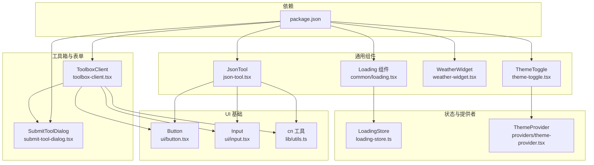
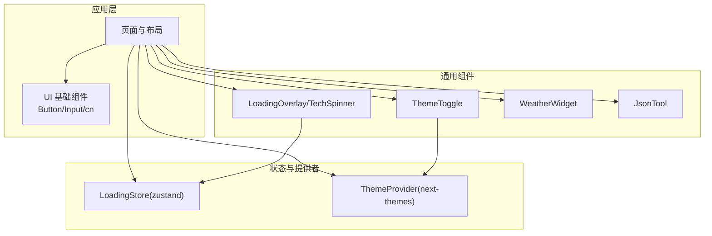
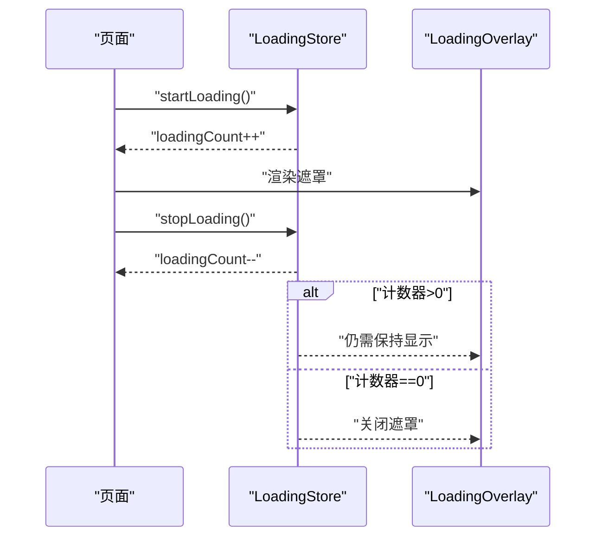
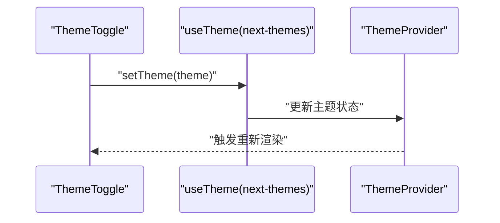
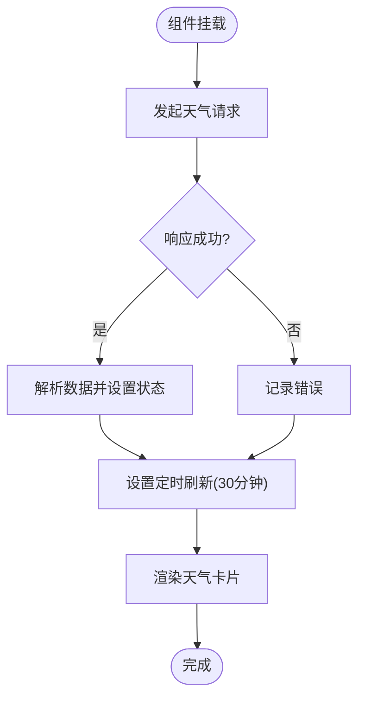
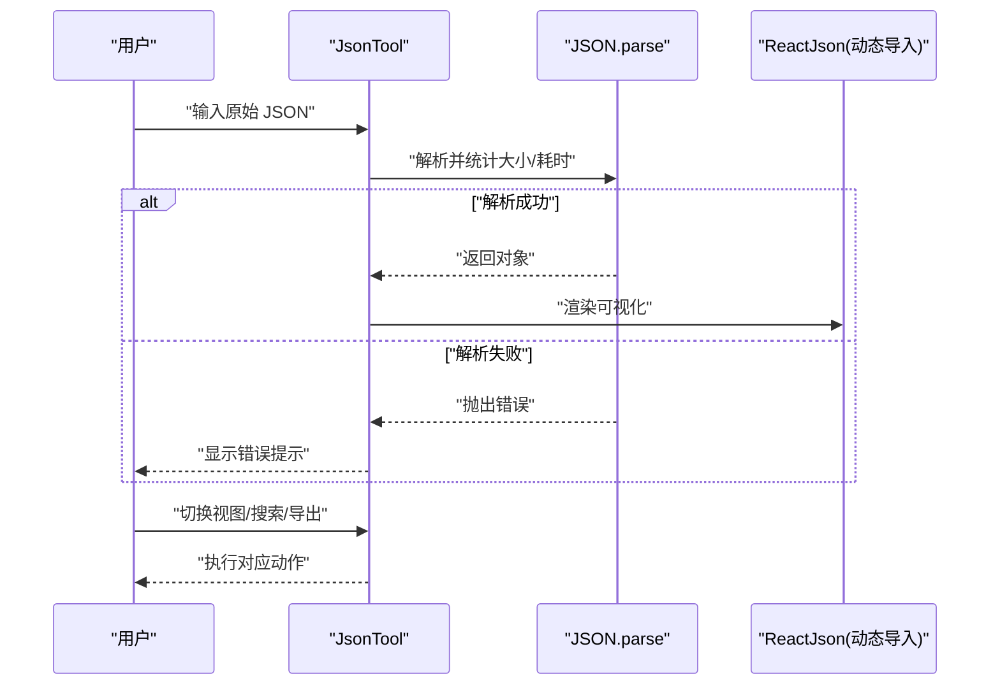
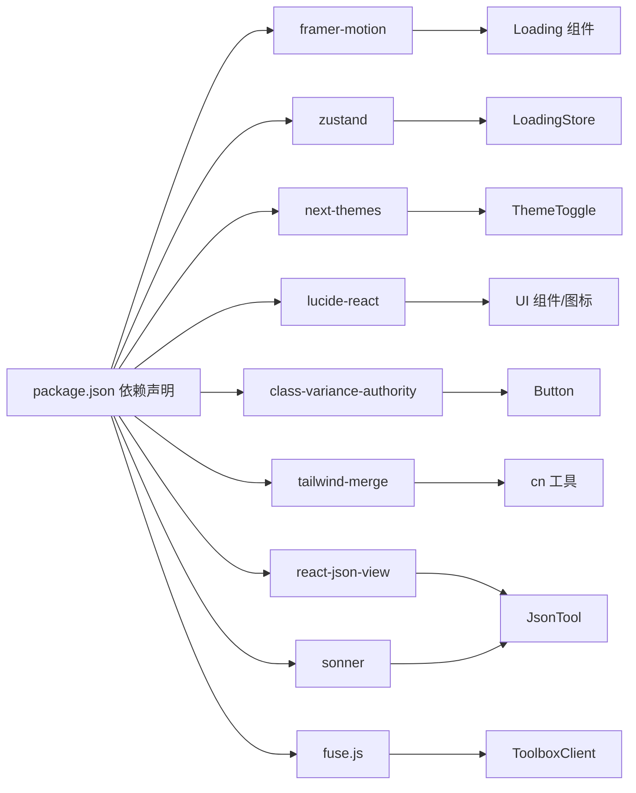

# 通用组件

<cite>
**本文引用的文件**
- [src/components/common/loading.tsx](file://src/components/common/loading.tsx)
- [src/store/loading-store.ts](file://src/store/loading-store.ts)
- [src/components/theme-toggle.tsx](file://src/components/theme-toggle.tsx)
- [src/components/providers/theme-provider.tsx](file://src/components/providers/theme-provider.tsx)
- [src/components/weather-widget.tsx](file://src/components/weather-widget.tsx)
- [src/components/json-tool.tsx](file://src/components/json-tool.tsx)
- [src/app/(site)/tools/components/toolbox-client.tsx](file://src/app/(site)/tools/components/toolbox-client.tsx)
- [src/app/(site)/tools/components/submit-tool-dialog.tsx](file://src/app/(site)/tools/components/submit-tool-dialog.tsx)
- [src/components/ui/button.tsx](file://src/components/ui/button.tsx)
- [src/components/ui/input.tsx](file://src/components/ui/input.tsx)
- [src/lib/utils.ts](file://src/lib/utils.ts)
- [package.json](file://package.json)
</cite>

## 目录
1. [简介](#简介)
2. [项目结构](#项目结构)
3. [核心组件](#核心组件)
4. [架构总览](#架构总览)
5. [详细组件分析](#详细组件分析)
6. [依赖关系分析](#依赖关系分析)
7. [性能考量](#性能考量)
8. [故障排查指南](#故障排查指南)
9. [结论](#结论)
10. [附录](#附录)

## 简介
本文件聚焦于项目中的通用组件，系统梳理并说明以下组件的设计与实现：Loading 加载指示器（含 TechSpinner、LoadingOverlay）、ThemeToggle 主题切换器、WeatherWidget 天气组件、JsonTool JSON 工具。内容涵盖功能特性、使用场景、配置参数、扩展方法、可复用性设计原则、接口标准化、最佳实践、性能优化策略、懒加载与内存管理、国际化与本地化支持，并提供跨页面与上下文的使用示例与参考路径。

## 项目结构
通用组件主要分布在以下位置：
- 通用加载与状态：src/components/common/loading.tsx、src/store/loading-store.ts
- 主题系统：src/components/theme-toggle.tsx、src/components/providers/theme-provider.tsx
- 天气组件：src/components/weather-widget.tsx
- JSON 工具：src/components/json-tool.tsx
- 工具箱与表单：src/app/(site)/tools/components/toolbox-client.tsx、src/app/(site)/tools/components/submit-tool-dialog.tsx
- UI 基础组件：src/components/ui/button.tsx、src/components/ui/input.tsx、src/lib/utils.ts
- 依赖声明：package.json

图表来源
- [src/components/common/loading.tsx:1-133](file://src/components/common/loading.tsx#L1-L133)
- [src/store/loading-store.ts:1-28](file://src/store/loading-store.ts#L1-L28)
- [src/components/theme-toggle.tsx:1-27](file://src/components/theme-toggle.tsx#L1-L27)
- [src/components/providers/theme-provider.tsx:1-13](file://src/components/providers/theme-provider.tsx#L1-L13)
- [src/components/weather-widget.tsx:1-86](file://src/components/weather-widget.tsx#L1-L86)
- [src/components/json-tool.tsx:1-367](file://src/components/json-tool.tsx#L1-L367)
- [src/app/(site)/tools/components/toolbox-client.tsx](file://src/app/(site)/tools/components/toolbox-client.tsx#L1-L241)
- [src/app/(site)/tools/components/submit-tool-dialog.tsx](file://src/app/(site)/tools/components/submit-tool-dialog.tsx#L1-L193)
- [src/components/ui/button.tsx:1-63](file://src/components/ui/button.tsx#L1-L63)
- [src/components/ui/input.tsx:1-22](file://src/components/ui/input.tsx#L1-L22)
- [src/lib/utils.ts:1-7](file://src/lib/utils.ts#L1-L7)
- [package.json:1-98](file://package.json#L1-L98)

章节来源
- [src/components/common/loading.tsx:1-133](file://src/components/common/loading.tsx#L1-L133)
- [src/store/loading-store.ts:1-28](file://src/store/loading-store.ts#L1-L28)
- [src/components/theme-toggle.tsx:1-27](file://src/components/theme-toggle.tsx#L1-L27)
- [src/components/providers/theme-provider.tsx:1-13](file://src/components/providers/theme-provider.tsx#L1-L13)
- [src/components/weather-widget.tsx:1-86](file://src/components/weather-widget.tsx#L1-L86)
- [src/components/json-tool.tsx:1-367](file://src/components/json-tool.tsx#L1-L367)
- [src/app/(site)/tools/components/toolbox-client.tsx](file://src/app/(site)/tools/components/toolbox-client.tsx#L1-L241)
- [src/app/(site)/tools/components/submit-tool-dialog.tsx](file://src/app/(site)/tools/components/submit-tool-dialog.tsx#L1-L193)
- [src/components/ui/button.tsx:1-63](file://src/components/ui/button.tsx#L1-L63)
- [src/components/ui/input.tsx:1-22](file://src/components/ui/input.tsx#L1-L22)
- [src/lib/utils.ts:1-7](file://src/lib/utils.ts#L1-L7)
- [package.json:1-98](file://package.json#L1-L98)

## 核心组件
本节概述四大通用组件的功能定位、典型使用场景与可扩展点：
- Loading 加载指示器：提供全屏覆盖与迷你加载两种形态，结合全局状态管理实现统一的加载遮罩体验。
- ThemeToggle 主题切换器：基于 next-themes 实现明暗主题切换，配合 ThemeProvider 使用。
- WeatherWidget 天气组件：拉取固定区域天气数据，按天气描述映射图标，定时刷新，适合放置在页头或侧边栏。
- JsonTool JSON 工具：实时解析、格式化、搜索、复制、导出 JSON，支持树状/关系图/表格三种视图模式，动态导入渲染器以避免 SSR 问题。

章节来源
- [src/components/common/loading.tsx:1-133](file://src/components/common/loading.tsx#L1-L133)
- [src/store/loading-store.ts:1-28](file://src/store/loading-store.ts#L1-L28)
- [src/components/theme-toggle.tsx:1-27](file://src/components/theme-toggle.tsx#L1-L27)
- [src/components/providers/theme-provider.tsx:1-13](file://src/components/providers/theme-provider.tsx#L1-L13)
- [src/components/weather-widget.tsx:1-86](file://src/components/weather-widget.tsx#L1-L86)
- [src/components/json-tool.tsx:1-367](file://src/components/json-tool.tsx#L1-L367)

## 架构总览
通用组件与应用层的交互关系如下：

图表来源
- [src/components/common/loading.tsx:120-133](file://src/components/common/loading.tsx#L120-L133)
- [src/store/loading-store.ts:12-27](file://src/store/loading-store.ts#L12-L27)
- [src/components/theme-toggle.tsx:8-26](file://src/components/theme-toggle.tsx#L8-L26)
- [src/components/providers/theme-provider.tsx:7-12](file://src/components/providers/theme-provider.tsx#L7-L12)
- [src/components/weather-widget.tsx:23-86](file://src/components/weather-widget.tsx#L23-L86)
- [src/components/json-tool.tsx:27-367](file://src/components/json-tool.tsx#L27-L367)
- [src/components/ui/button.tsx:39-62](file://src/components/ui/button.tsx#L39-L62)
- [src/components/ui/input.tsx:5-21](file://src/components/ui/input.tsx#L5-L21)
- [src/lib/utils.ts:4-6](file://src/lib/utils.ts#L4-L6)

## 详细组件分析

### Loading 加载指示器
- 功能特性
  - TechSpinner：多层旋转动画与扫描线效果，适合全屏加载提示。
  - TechLoaderMini：轻量级迷你加载器，适合按钮内或小范围指示。
  - LoadingOverlay：基于全局状态显示/隐藏的全屏遮罩，内置 TechSpinner。
- 使用场景
  - 全局路由跳转、异步数据请求、批量操作等需要阻断用户交互的场景。
- 配置参数与扩展
  - LoadingOverlay 接受 className 自定义样式；TechSpinner/TechLoaderMini 为纯展示型，可通过父容器控制尺寸与定位。
  - 支持多实例叠加：LoadingStore 内部计数器实现“启动/停止”成对调用，避免提前关闭。
- 最佳实践
  - 在顶层布局或路由层包裹 Provider，确保 LoadingOverlay 生效。
  - 对长流程采用“开始/结束”成对调用，避免竞态导致遮罩不消失。
- 性能与内存
  - 动画使用客户端渲染库，仅在可见时生效；遮罩层采用一次性挂载，减少重复创建。
  - 计数器归零才关闭遮罩，防止误关。

图表来源
- [src/store/loading-store.ts:12-27](file://src/store/loading-store.ts#L12-L27)
- [src/components/common/loading.tsx:122-132](file://src/components/common/loading.tsx#L122-L132)

章节来源
- [src/components/common/loading.tsx:6-133](file://src/components/common/loading.tsx#L6-L133)
- [src/store/loading-store.ts:1-28](file://src/store/loading-store.ts#L1-L28)

### ThemeToggle 主题切换器
- 功能特性
  - 基于 next-themes 的 useTheme Hook，切换明/暗主题。
  - 与 UI Button 组件组合，提供图标与无障碍标签。
- 使用场景
  - 页头导航、设置面板、仪表盘等需要快速切换外观的主题入口。
- 配置参数与扩展
  - 可通过 ThemeProvider 的属性进行全局配置（如存储键名、系统跟随等）。
  - 可自定义按钮尺寸与样式，适配不同布局风格。
- 最佳实践
  - 将 ThemeProvider 放置于应用根节点，保证全局生效。
  - 与本地存储策略配合，持久化用户偏好。

图表来源
- [src/components/theme-toggle.tsx:8-26](file://src/components/theme-toggle.tsx#L8-L26)
- [src/components/providers/theme-provider.tsx:7-12](file://src/components/providers/theme-provider.tsx#L7-L12)

章节来源
- [src/components/theme-toggle.tsx:1-27](file://src/components/theme-toggle.tsx#L1-L27)
- [src/components/providers/theme-provider.tsx:1-13](file://src/components/providers/theme-provider.tsx#L1-L13)

### WeatherWidget 天气组件
- 功能特性
  - 拉取固定区域天气数据，解析温度、天气描述、风力、湿度等字段。
  - 根据天气描述映射图标，提供加载态与错误兜底。
  - 定时刷新（每 30 分钟），降低频繁请求带来的压力。
- 使用场景
  - 顶部信息条、个人仪表盘、城市卡片等需要展示实时天气信息的区域。
- 配置参数与扩展
  - 支持传入 className 进行样式定制。
  - 可扩展为支持多地区、动态参数、缓存策略。
- 最佳实践
  - 在组件外层做错误与空值处理，避免异常传播。
  - 结合服务端代理或鉴权策略，确保 API 请求稳定。

图表来源
- [src/components/weather-widget.tsx:27-47](file://src/components/weather-widget.tsx#L27-L47)
- [src/components/weather-widget.tsx:49-84](file://src/components/weather-widget.tsx#L49-L84)

章节来源
- [src/components/weather-widget.tsx:1-86](file://src/components/weather-widget.tsx#L1-L86)

### JsonTool JSON 工具
- 功能特性
  - 实时解析原始 JSON，统计大小与解析耗时。
  - 支持格式化、复制原始/解析结果、导出文件。
  - 搜索高亮：对字符串值与键进行高亮匹配，支持“下一个”导航。
  - 视图模式：树状图、关系图、表格三选一，支持展开/折叠。
  - 动态导入渲染器：避免 SSR 渲染问题。
- 使用场景
  - 开发调试、日志分析、配置校验、数据可视化探索。
- 配置参数与扩展
  - 视图模式与展开策略由内部状态控制。
  - 可扩展搜索算法、导出格式、主题适配。
- 最佳实践
  - 对超大 JSON 建议分块处理或服务端解析，前端仅做轻量展示。
  - 搜索使用防抖，避免高频 DOM 操作。
  - 导出前进行二次校验，确保数据完整性。

图表来源
- [src/components/json-tool.tsx:108-134](file://src/components/json-tool.tsx#L108-L134)
- [src/components/json-tool.tsx:304-314](file://src/components/json-tool.tsx#L304-L314)

章节来源
- [src/components/json-tool.tsx:1-367](file://src/components/json-tool.tsx#L1-L367)

### 工具箱与提交对话框（扩展阅读）
- ToolboxClient：工具分类筛选、搜索、网格/列表视图切换、状态徽标与跳转逻辑。
- SubmitToolDialog：表单校验、提交流程、加载态与反馈提示。
- 与通用组件的关系：作为页面级容器，复用 Button、Input、Badge 等基础 UI 组件，体现通用组件的可复用性与一致性。

章节来源
- [src/app/(site)/tools/components/toolbox-client.tsx](file://src/app/(site)/tools/components/toolbox-client.tsx#L1-L241)
- [src/app/(site)/tools/components/submit-tool-dialog.tsx](file://src/app/(site)/tools/components/submit-tool-dialog.tsx#L1-L193)
- [src/components/ui/button.tsx:1-63](file://src/components/ui/button.tsx#L1-L63)
- [src/components/ui/input.tsx:1-22](file://src/components/ui/input.tsx#L1-L22)
- [src/lib/utils.ts:1-7](file://src/lib/utils.ts#L1-L7)

## 依赖关系分析
- 动画与状态
  - framer-motion：用于 TechSpinner 的复杂动画。
  - zustand：LoadingStore 提供轻量状态管理。
- 主题与 UI
  - next-themes：主题切换与持久化。
  - lucide-react：图标库。
  - class-variance-authority + tailwind-merge：按钮与输入等 UI 组件的变体与类名合并。
- 可视化与工具
  - react-json-view：JSON 可视化渲染器，动态导入避免 SSR。
  - sonner：全局通知提示。
  - fuse.js：工具箱搜索（在工具箱组件中使用）。

图表来源
- [package.json:48-79](file://package.json#L48-L79)
- [src/components/common/loading.tsx:3-4](file://src/components/common/loading.tsx#L3-L4)
- [src/store/loading-store.ts:1-1](file://src/store/loading-store.ts#L1-L1)
- [src/components/theme-toggle.tsx:4-6](file://src/components/theme-toggle.tsx#L4-L6)
- [src/components/ui/button.tsx:2-5](file://src/components/ui/button.tsx#L2-L5)
- [src/components/ui/input.tsx:3-5](file://src/components/ui/input.tsx#L3-L5)
- [src/lib/utils.ts:1-7](file://src/lib/utils.ts#L1-L7)
- [src/components/json-tool.tsx:24-25](file://src/components/json-tool.tsx#L24-L25)
- [src/app/(site)/tools/components/toolbox-client.tsx](file://src/app/(site)/tools/components/toolbox-client.tsx#L4-L25)

章节来源
- [package.json:1-98](file://package.json#L1-L98)

## 性能考量
- 动画与渲染
  - TechSpinner 使用客户端动画库，建议在不可见时暂停或简化动画，减少 GPU/CPU 占用。
  - LoadingOverlay 采用一次性挂载与条件渲染，避免频繁创建销毁。
- 状态与内存
  - LoadingStore 使用计数器避免误关；在组件卸载时应确保“启动/结束”配对，防止泄漏。
  - JsonTool 的搜索高亮在每次输入时清理上一次高亮，避免 DOM 泄漏。
- 懒加载与 SSR
  - JsonTool 动态导入渲染器，避免 SSR 报错；建议在服务端环境降级为静态占位。
- 网络与缓存
  - WeatherWidget 每 30 分钟刷新一次，减少 API 压力；可在服务端增加缓存层或代理。
- UI 一致性
  - 通过 Button/Input/cn 统一风格，减少重复样式计算，提升首屏渲染效率。

[本节为通用指导，无需列出具体文件来源]

## 故障排查指南
- 主题切换无效
  - 确认 ThemeProvider 是否包裹应用根节点。
  - 检查浏览器本地存储是否被清理或禁用。
- 加载遮罩不消失
  - 确保“开始/结束”成对调用，避免遗漏 stopLoading。
  - 检查是否存在并发请求未正确配对。
- 天气组件无数据
  - 检查网络请求是否被拦截或跨域限制。
  - 查看控制台错误日志，确认 API 返回格式与类型一致。
- JSON 工具解析失败
  - 核对输入是否为合法 JSON；查看错误提示与高亮是否正确清除。
  - 大 JSON 建议分段处理或服务端解析。
- 工具箱搜索无结果
  - 确认搜索词大小写与特殊字符处理；检查工具箱数据源是否为空。

章节来源
- [src/components/providers/theme-provider.tsx:7-12](file://src/components/providers/theme-provider.tsx#L7-L12)
- [src/store/loading-store.ts:16-26](file://src/store/loading-store.ts#L16-L26)
- [src/components/weather-widget.tsx:36-41](file://src/components/weather-widget.tsx#L36-L41)
- [src/components/json-tool.tsx:128-133](file://src/components/json-tool.tsx#L128-L133)
- [src/app/(site)/tools/components/toolbox-client.tsx](file://src/app/(site)/tools/components/toolbox-client.tsx#L53-L58)

## 结论
上述通用组件围绕“可复用、低耦合、易扩展”的设计目标构建：通过统一的 UI 基础组件与状态管理，形成一致的交互体验；通过动态导入与懒加载策略，兼顾 SSR 与性能；通过清晰的接口与配置项，满足不同页面与上下文的使用需求。建议在实际业务中遵循本文档的最佳实践，持续完善国际化、可访问性与性能优化。

[本节为总结性内容，无需列出具体文件来源]

## 附录
- 使用示例（参考路径）
  - 在页面中引入 ThemeProvider 并在需要处使用 ThemeToggle 切换主题。
  - 在路由层或布局层使用 LoadingOverlay，结合 LoadingStore 控制显示。
  - 在任意区域放置 WeatherWidget，传入自定义 className 以适配布局。
  - 在工具页或调试页引入 JsonTool，直接使用其提供的解析、搜索、导出能力。
  - 在工具箱页面使用 ToolboxClient 与 SubmitToolDialog，复用 UI 组件与表单校验。

章节来源
- [src/components/providers/theme-provider.tsx:7-12](file://src/components/providers/theme-provider.tsx#L7-L12)
- [src/components/theme-toggle.tsx:8-26](file://src/components/theme-toggle.tsx#L8-L26)
- [src/components/common/loading.tsx:122-132](file://src/components/common/loading.tsx#L122-L132)
- [src/store/loading-store.ts:12-27](file://src/store/loading-store.ts#L12-L27)
- [src/components/weather-widget.tsx:23-84](file://src/components/weather-widget.tsx#L23-L84)
- [src/components/json-tool.tsx:185-367](file://src/components/json-tool.tsx#L185-L367)
- [src/app/(site)/tools/components/toolbox-client.tsx](file://src/app/(site)/tools/components/toolbox-client.tsx#L41-L241)
- [src/app/(site)/tools/components/submit-tool-dialog.tsx](file://src/app/(site)/tools/components/submit-tool-dialog.tsx#L51-L193)