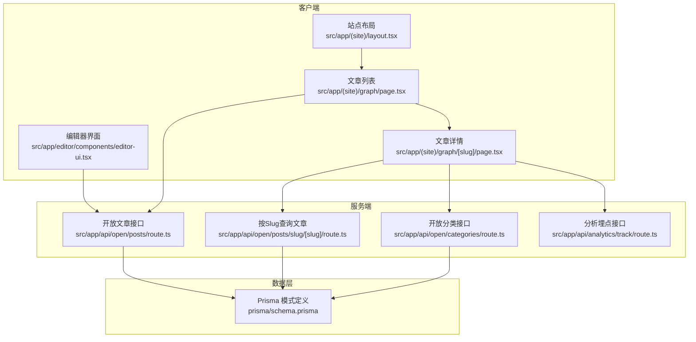
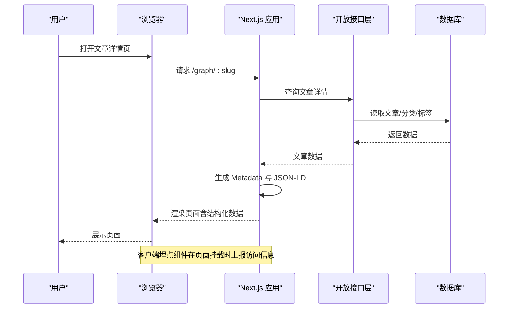
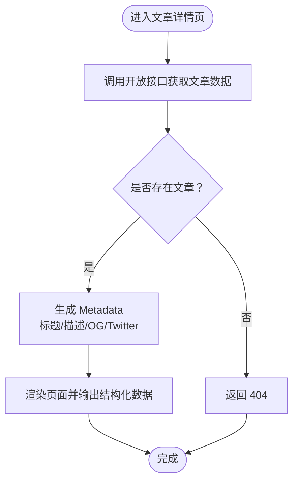
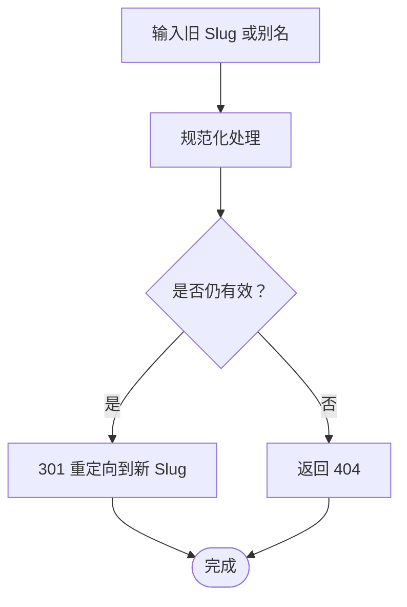
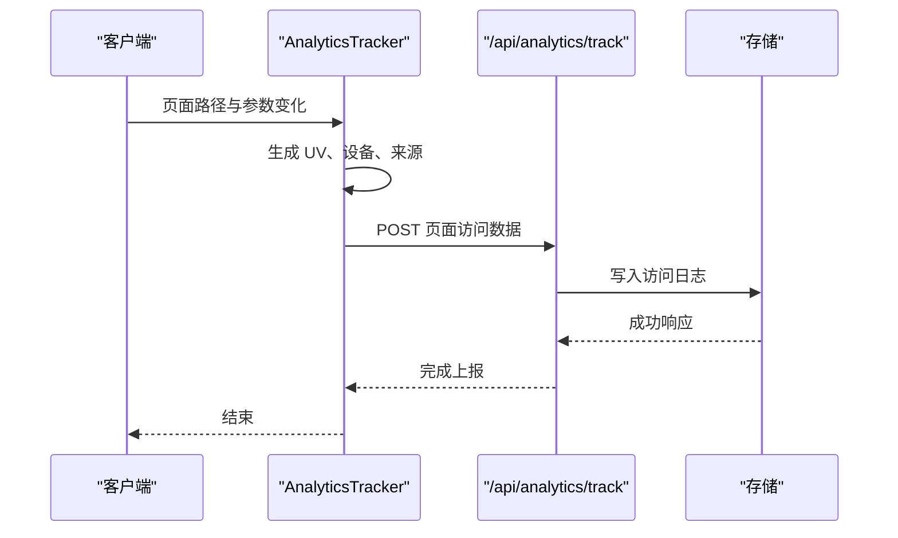
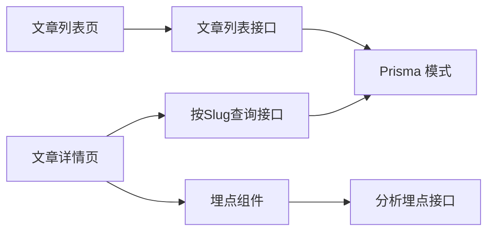

# SEO优化

<cite>
**本文引用的文件**
- [src/app/(site)/layout.tsx](file://src/app/(site)/layout.tsx)
- [src/app/(site)/graph/[slug]/page.tsx](file://src/app/(site)/graph/[slug]/page.tsx)
- [src/app/(site)/graph/page.tsx](file://src/app/(site)/graph/page.tsx)
- [src/app/(site)/graph/components/post-feed.tsx](file://src/app/(site)/graph/components/post-feed.tsx)
- [src/app/api/open/posts/slug/[slug]/route.ts](file://src/app/api/open/posts/slug/[slug]/route.ts)
- [src/app/api/open/posts/route.ts](file://src/app/api/open/posts/route.ts)
- [src/app/api/open/categories/route.ts](file://src/app/api/open/categories/route.ts)
- [src/components/analytics-tracker.tsx](file://src/components/analytics-tracker.tsx)
- [src/app/api/analytics/track/route.ts](file://src/app/api/analytics/track/route.ts)
- [prisma/schema.prisma](file://prisma/schema.prisma)
- [src/lib/utils.ts](file://src/lib/utils.ts)
- [src/middleware.ts](file://src/middleware.ts)
- [.agents/skills/nextjs-app-router-patterns/SKILL.md](file://.agents/skills/nextjs-app-router-patterns/SKILL.md)
- [src/app/editor/components/editor-ui.tsx](file://src/app/editor/components/editor-ui.tsx)
- [src/app/dashboard/overview/page.tsx](file://src/app/dashboard/overview/page.tsx)
</cite>

## 目录
1. [简介](#简介)
2. [项目结构](#项目结构)
3. [核心组件](#核心组件)
4. [架构总览](#架构总览)
5. [详细组件分析](#详细组件分析)
6. [依赖关系分析](#依赖关系分析)
7. [性能考虑](#性能考虑)
8. [故障排查指南](#故障排查指南)
9. [结论](#结论)
10. [附录](#附录)

## 简介
本文件面向博客系统的SEO优化，系统性梳理页面标题与描述的动态生成、结构化数据（Article Schema、Breadcrumb）、Open Graph与Twitter Card、URL结构设计（语义化、永久链接、重定向）、页面加载性能（懒加载、代码分割、缓存策略）、sitemap与robots.txt配置建议、社交媒体分享优化、以及Google Analytics与百度统计的集成与调试方法。内容基于仓库现有实现与Next.js App Router最佳实践进行总结，并提供可落地的改进建议。

## 项目结构
博客系统采用Next.js App Router目录结构，站点主路由位于 `(site)` 分组下，文章详情页在 `/graph/[slug]`，开放接口在 `/api/open` 下提供文章与分类查询，分析埋点在 `/api/analytics/track`。数据库模型通过 Prisma 定义，包含文章、分类、标签、评论等实体。

**图表来源**
- [src/app/(site)/layout.tsx](file://src/app/(site)/layout.tsx)
- [src/app/(site)/graph/page.tsx](file://src/app/(site)/graph/page.tsx)
- [src/app/(site)/graph/[slug]/page.tsx](file://src/app/(site)/graph/[slug]/page.tsx)
- [src/app/api/open/posts/route.ts](file://src/app/api/open/posts/route.ts)
- [src/app/api/open/posts/slug/[slug]/route.ts](file://src/app/api/open/posts/slug/[slug]/route.ts)
- [src/app/api/open/categories/route.ts](file://src/app/api/open/categories/route.ts)
- [prisma/schema.prisma](file://prisma/schema.prisma)

**章节来源**
- [src/app/(site)/layout.tsx](file://src/app/(site)/layout.tsx)
- [src/app/(site)/graph/page.tsx](file://src/app/(site)/graph/page.tsx)
- [src/app/(site)/graph/[slug]/page.tsx](file://src/app/(site)/graph/[slug]/page.tsx)
- [src/app/api/open/posts/route.ts](file://src/app/api/open/posts/route.ts)
- [src/app/api/open/posts/slug/[slug]/route.ts](file://src/app/api/open/posts/slug/[slug]/route.ts)
- [src/app/api/open/categories/route.ts](file://src/app/api/open/categories/route.ts)
- [prisma/schema.prisma](file://prisma/schema.prisma)

## 核心组件
- 动态元数据与社交标签：文章详情页通过 `generateMetadata` 动态设置标题、描述与 Open Graph/Twitter 卡片信息，确保每篇文章的分享预览一致且丰富。
- 结构化数据：文章详情页可扩展输出 Article Schema（JSON-LD），包含作者、发布时间、封面图、关键词等字段，提升搜索结果的丰富展示。
- Breadcrumb 导航：站点布局中提供面包屑生成逻辑，便于用户理解当前页面层级，同时利于搜索引擎理解站点结构。
- URL 设计：文章使用基于 slug 的语义化路径，支持唯一性约束与查询；编辑器允许手动输入或自动生成 slug，保证永久链接稳定。
- 分析埋点：客户端埋点组件负责收集访问、设备、来源等信息并通过分析接口上报，支撑 SEO 效果追踪与优化决策。
- 数据模型：Prisma 模式定义了文章、分类、标签、评论等实体及索引，为 SEO 提供稳定的后端数据基础。

**章节来源**
- [.agents/skills/nextjs-app-router-patterns/SKILL.md](file://.agents/skills/nextjs-app-router-patterns/SKILL.md)
- [src/app/(site)/layout.tsx](file://src/app/(site)/layout.tsx)
- [src/app/(site)/graph/[slug]/page.tsx](file://src/app/(site)/graph/[slug]/page.tsx)
- [src/app/editor/components/editor-ui.tsx](file://src/app/editor/components/editor-ui.tsx)
- [src/components/analytics-tracker.tsx](file://src/components/analytics-tracker.tsx)
- [prisma/schema.prisma](file://prisma/schema.prisma)

## 架构总览
下图展示了从用户访问到数据渲染、结构化数据输出与分析埋点的整体流程。

**图表来源**
- [src/app/(site)/graph/[slug]/page.tsx](file://src/app/(site)/graph/[slug]/page.tsx)
- [src/app/api/open/posts/slug/[slug]/route.ts](file://src/app/api/open/posts/slug/[slug]/route.ts)
- [src/components/analytics-tracker.tsx](file://src/components/analytics-tracker.tsx)

## 详细组件分析

### 动态元数据与社交标签（标题、描述、OG、Twitter Card）
- 实现位置：文章详情页通过 `generateMetadata` 异步生成页面标题、描述、Open Graph 图片与 Twitter 卡片信息。
- 关键点：
  - 标题与描述来源于文章实体字段，确保与内容一致。
  - OG 图片建议使用标准尺寸（如 1200x630），提升分享质量。
  - Twitter Card 使用大图卡片类型，增强社交传播效果。
  - 可结合编辑器中的“URL 路径（Slug）”与“摘要”字段，进一步优化标题与描述的可读性与点击率。

**图表来源**
- [src/app/(site)/graph/[slug]/page.tsx](file://src/app/(site)/graph/[slug]/page.tsx)
- [src/app/api/open/posts/slug/[slug]/route.ts](file://src/app/api/open/posts/slug/[slug]/route.ts)
- [.agents/skills/nextjs-app-router-patterns/SKILL.md](file://.agents/skills/nextjs-app-router-patterns/SKILL.md)

**章节来源**
- [src/app/(site)/graph/[slug]/page.tsx](file://src/app/(site)/graph/[slug]/page.tsx)
- [.agents/skills/nextjs-app-router-patterns/SKILL.md](file://.agents/skills/nextjs-app-router-patterns/SKILL.md)

### 结构化数据（Article Schema、Breadcrumb）
- Article Schema：可在文章详情页输出 JSON-LD，包含：
  - 作者信息（用户头像、名称）
  - 发布时间与更新时间
  - 封面图（image）
  - 关键词（tags）
  - 主要内容（articleBody）
- Breadcrumb：站点布局中已具备面包屑生成逻辑，建议在文章详情页补充结构化 Breadcrumb（listItem）以增强语义化与可读性。
- 建议：将结构化数据与动态元数据在同一页面统一输出，避免重复请求与不一致。

**章节来源**
- [src/app/(site)/layout.tsx](file://src/app/(site)/layout.tsx)
- [src/app/(site)/graph/[slug]/page.tsx](file://src/app/(site)/graph/[slug]/page.tsx)

### URL 结构设计（语义化、永久链接、重定向）
- 语义化 URL：文章详情使用 `/graph/:slug`，slug 来源于文章实体，具备唯一性约束，有利于搜索引擎识别与排名。
- 永久链接：编辑器界面允许手动输入或自动生成 slug，确保链接稳定性；若需变更，应配置 301 重定向至新地址。
- 重定向处理：建议在开放接口层对 slug 进行规范化校验与重定向处理，避免重复内容与权重分散。

**图表来源**
- [src/app/api/open/posts/slug/[slug]/route.ts](file://src/app/api/open/posts/slug/[slug]/route.ts)
- [src/app/editor/components/editor-ui.tsx](file://src/app/editor/components/editor-ui.tsx)

**章节来源**
- [src/app/api/open/posts/slug/[slug]/route.ts](file://src/app/api/open/posts/slug/[slug]/route.ts)
- [src/app/editor/components/editor-ui.tsx](file://src/app/editor/components/editor-ui.tsx)

### 页面加载性能优化（懒加载、代码分割、缓存策略）
- 图片懒加载：建议在文章内容渲染组件中启用图片懒加载属性，减少首屏资源压力。
- 代码分割：对非首屏使用的重型组件采用动态导入（如编辑器、图表等），降低初始包体积。
- 缓存策略：利用浏览器缓存与 CDN 缓存，静态资源与字体文件设置长缓存；HTML 采用协商缓存。
- 列表渲染优化：文章列表组件中使用虚拟滚动与分页，减少一次性渲染的数据量。
- 预加载：对用户可能访问的下一页或相关文章进行预加载，缩短感知延迟。

**章节来源**
- [src/app/(site)/graph/components/post-feed.tsx](file://src/app/(site)/graph/components/post-feed.tsx)
- [.agents/skills/vercel-react-best-practices/AGENTS.md](file://.agents/skills/vercel-react-best-practices/AGENTS.md)

### sitemap 生成与 robots.txt 配置
- sitemap 生成：建议在服务端定时生成 sitemap.xml，包含所有文章、分类、工具页面的最新 URL 与更新频率；对动态路由使用动态生成。
- robots.txt：允许搜索引擎抓取主要内容与 sitemap，拒绝抓取后台管理、登录页等非公开页面；可配置 crawl-delay 以减轻服务器压力。
- 建议：将 sitemap 提交至 Google Search Console 与百度搜索资源平台，持续监控抓取状态与索引覆盖率。

**章节来源**
- [src/app/(site)/graph/page.tsx](file://src/app/(site)/graph/page.tsx)
- [src/app/(site)/graph/[slug]/page.tsx](file://src/app/(site)/graph/[slug]/page.tsx)

### 社交媒体分享优化（OG、Twitter Card、预览效果）
- OG 标签：确保每篇文章的 og:title、og:description、og:image、og:url、og:type 设置正确。
- Twitter Card：使用 summary_large_image 类型，图片尺寸建议 1200x630，标题与描述与页面元数据保持一致。
- 预览效果：在社交平台使用官方调试工具（如 Facebook Sharing Debugger、X Card Preview）验证预览一致性与错误提示。

**章节来源**
- [.agents/skills/nextjs-app-router-patterns/SKILL.md](file://.agents/skills/nextjs-app-router-patterns/SKILL.md)

### 分析埋点与搜索引擎调试
- 埋点集成：客户端埋点组件在页面切换时自动上报访问信息（UV、设备、来源、页面 URL），并通过分析接口持久化。
- Google Analytics：可在客户端埋点组件中接入 GA4（如 gtag 或 Analytics），实现更细粒度的用户行为追踪。
- 百度统计：同样可在客户端埋点组件中接入百度统计脚本，实现国内流量的精细化分析。
- 搜索引擎调试：使用 Google Search Console、百度搜索资源平台等工具检查抓取状态、索引覆盖率、结构化数据测试结果与性能报告。

**图表来源**
- [src/components/analytics-tracker.tsx](file://src/components/analytics-tracker.tsx)
- [src/app/api/analytics/track/route.ts](file://src/app/api/analytics/track/route.ts)

**章节来源**
- [src/components/analytics-tracker.tsx](file://src/components/analytics-tracker.tsx)
- [src/app/api/analytics/track/route.ts](file://src/app/api/analytics/track/route.ts)

## 依赖关系分析
- 组件耦合：文章详情页依赖开放接口层提供的文章数据；布局组件提供面包屑与全局样式；编辑器组件影响文章 URL 与摘要质量。
- 外部依赖：Next.js App Router 的 metadata 生成机制、Prisma 数据模型、第三方分析服务（GA/Baidu）。
- 潜在风险：若开放接口未做 slug 规范化与重定向，可能导致重复内容；若结构化数据缺失，搜索引擎无法获得丰富展示。

**图表来源**
- [src/app/(site)/graph/[slug]/page.tsx](file://src/app/(site)/graph/[slug]/page.tsx)
- [src/app/api/open/posts/slug/[slug]/route.ts](file://src/app/api/open/posts/slug/[slug]/route.ts)
- [src/app/api/open/posts/route.ts](file://src/app/api/open/posts/route.ts)
- [prisma/schema.prisma](file://prisma/schema.prisma)
- [src/components/analytics-tracker.tsx](file://src/components/analytics-tracker.tsx)
- [src/app/api/analytics/track/route.ts](file://src/app/api/analytics/track/route.ts)

**章节来源**
- [src/app/(site)/graph/[slug]/page.tsx](file://src/app/(site)/graph/[slug]/page.tsx)
- [src/app/api/open/posts/slug/[slug]/route.ts](file://src/app/api/open/posts/slug/[slug]/route.ts)
- [src/app/api/open/posts/route.ts](file://src/app/api/open/posts/route.ts)
- [prisma/schema.prisma](file://prisma/schema.prisma)
- [src/components/analytics-tracker.tsx](file://src/components/analytics-tracker.tsx)
- [src/app/api/analytics/track/route.ts](file://src/app/api/analytics/track/route.ts)

## 性能考虑
- 首屏优化：延迟加载非关键资源，优先传输核心 HTML 与样式；对图片设置占位与懒加载。
- 代码分割：将重型组件（如富文本编辑器、图表）按需加载，减少初始包大小。
- 缓存策略：静态资源与字体设置长缓存；HTML 采用协商缓存；API 响应可设置合理的缓存头。
- 列表性能：对文章列表使用虚拟滚动与分页，避免一次性渲染大量节点。
- 重定向与去重：对 slug 进行规范化与 301 重定向，避免重复内容导致的权重稀释。

**章节来源**
- [src/app/(site)/graph/components/post-feed.tsx](file://src/app/(site)/graph/components/post-feed.tsx)
- [.agents/skills/vercel-react-best-practices/AGENTS.md](file://.agents/skills/vercel-react-best-practices/AGENTS.md)

## 故障排查指南
- 元数据不生效：检查文章详情页的 `generateMetadata` 是否正确返回标题、描述与社交标签；确认开放接口返回的数据字段完整。
- 结构化数据错误：使用 Google Rich Results Test 与结构化数据测试工具验证 JSON-LD 输出格式与必填字段。
- 埋点异常：查看客户端埋点组件的网络请求与控制台错误；确认分析接口返回状态码与存储写入成功。
- sitemap 与 robots：确认 sitemap 生成任务执行成功并与搜索引擎平台提交；robots 中排除非公开路径。
- 性能问题：使用浏览器性能面板与 Lighthouse 检查首屏加载时间、交互延迟与内存占用，针对性优化。

**章节来源**
- [src/app/(site)/graph/[slug]/page.tsx](file://src/app/(site)/graph/[slug]/page.tsx)
- [src/components/analytics-tracker.tsx](file://src/components/analytics-tracker.tsx)
- [src/app/api/analytics/track/route.ts](file://src/app/api/analytics/track/route.ts)

## 结论
本博客系统已在动态元数据、社交标签、URL 设计与分析埋点方面具备良好基础。建议在此基础上完善结构化数据（Article Schema、Breadcrumb）、sitemap 与 robots 配置、社交媒体预览一致性校验，并持续通过搜索引擎平台与埋点数据进行迭代优化，以提升搜索可见性与用户体验。

## 附录
- 数据模型概览（文章、分类、标签、评论）：用于支撑 SEO 的数据基础，确保字段完整性与索引优化。
- 工具页面与热门页面统计：可用于发现高价值内容与优化方向。

**章节来源**
- [prisma/schema.prisma](file://prisma/schema.prisma)
- [src/app/dashboard/overview/page.tsx](file://src/app/dashboard/overview/page.tsx)