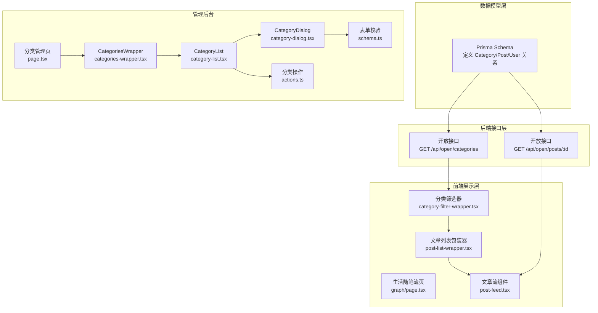
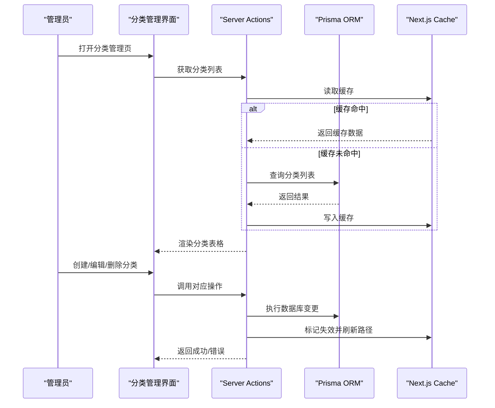
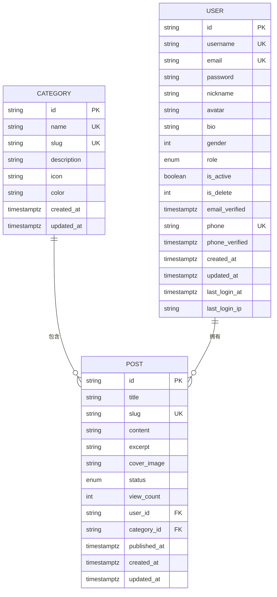
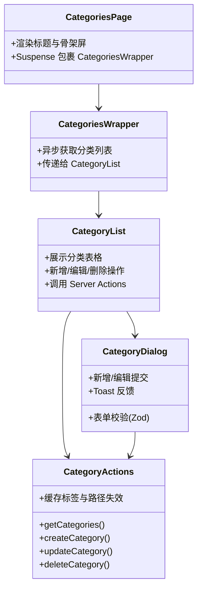
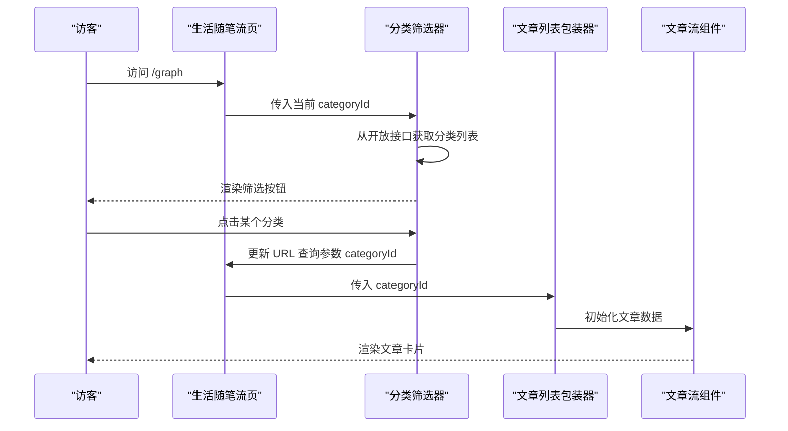
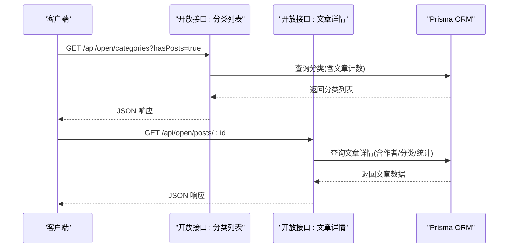
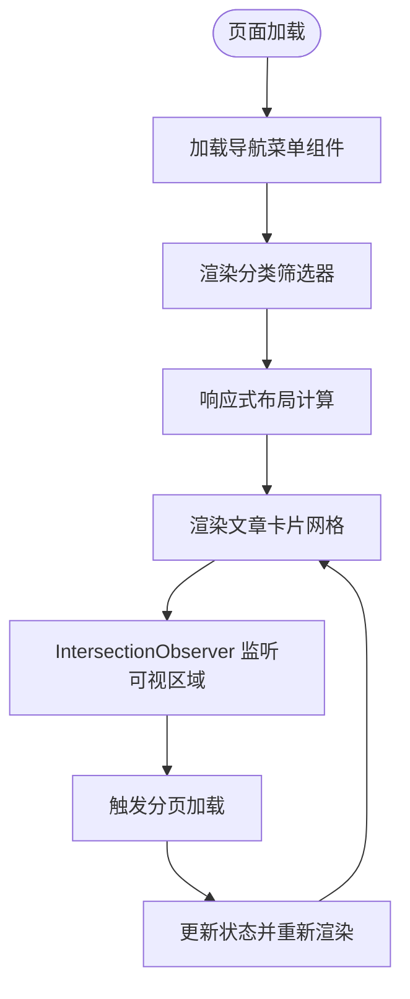
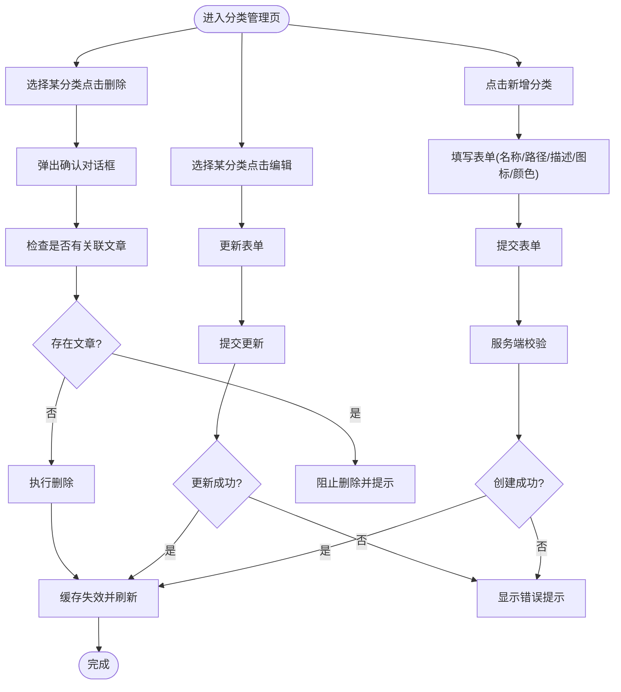
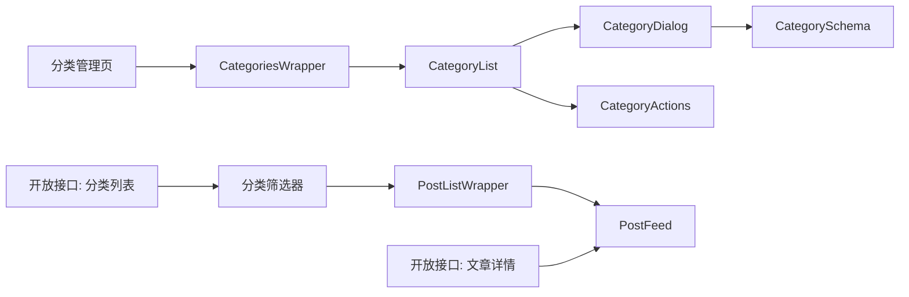

# 分类系统

<cite>
**本文档引用的文件**
- [schema.prisma](file://prisma/schema.prisma)
- [categories\actions.ts](file://src/app/dashboard/categories/actions.ts)
- [categories\schema.ts](file://src/app/dashboard/categories/schema.ts)
- [categories\page.tsx](file://src/app/dashboard/categories/page.tsx)
- [categories-wrapper.tsx](file://src/app/dashboard/categories/components/categories-wrapper.tsx)
- [category-list.tsx](file://src/app/dashboard/categories/components/category-list.tsx)
- [category-dialog.tsx](file://src/app/dashboard/categories/components/category-dialog.tsx)
- [category-filter-wrapper.tsx](file://src/app/(site)/graph/components/category-filter-wrapper.tsx)
- [post-list-wrapper.tsx](file://src/app/(site)/graph/components/post-list-wrapper.tsx)
- [post-feed.tsx](file://src/app/(site)/graph/components/post-feed.tsx)
- [graph\page.tsx](file://src/app/(site)/graph/page.tsx)
- [admin-menu.ts](file://src/config/admin-menu.ts)
- [app-sidebar.tsx](file://src/components/admin/app-sidebar.tsx)
- [editor-ui.tsx](file://src/app/editor/components/editor-ui.tsx)
- [route.ts](file://src/app/api/open/categories/route.ts)
- [route.ts](file://src/app/api/open/posts/[id]/route.ts)
- [navigation-menu.tsx](file://src/components/ui/navigation-menu.tsx)
</cite>

## 目录
1. [引言](#引言)
2. [项目结构](#项目结构)
3. [核心组件](#核心组件)
4. [架构总览](#架构总览)
5. [详细组件分析](#详细组件分析)
6. [依赖关系分析](#依赖关系分析)
7. [性能考虑](#性能考虑)
8. [故障排除指南](#故障排除指南)
9. [结论](#结论)
10. [附录](#附录)

## 引言
本文件为分类系统的全面技术文档，涵盖分类模型设计与实现、分类层级结构与父子关系管理、分类树形展示、分类的创建/编辑/删除流程与权限控制、分类与文章的关联关系及筛选功能、前端展示逻辑（分类导航、筛选器组件、响应式设计）、后台管理操作指南（批量导入导出、分类合并、重命名）、以及SEO优化策略（元数据管理与URL结构设计）。文档基于仓库现有代码进行深入分析，并通过可视化图表帮助读者快速理解系统架构与数据流。

## 项目结构
分类系统主要分布在以下区域：
- 数据模型层：Prisma Schema 定义了 Category、Post、User 等实体及其关系
- 后端接口层：Next.js App Router API 路由提供开放查询接口
- 管理后台：仪表板中的分类管理页面与相关组件
- 前端展示层：站点侧的分类筛选器与文章列表展示
- 权限与导航：后台菜单配置与侧边栏集成

**图表来源**
- [schema.prisma:84-132](file://prisma/schema.prisma#L84-L132)
- [route.ts:1-45](file://src/app/api/open/categories/route.ts#L1-L45)
- [route.ts:1-56](file://src/app/api/open/posts/[id]/route.ts#L1-L56)
- [categories\page.tsx:1-20](file://src/app/dashboard/categories/page.tsx#L1-L20)
- [categories-wrapper.tsx:1-9](file://src/app/dashboard/categories/components/categories-wrapper.tsx#L1-L9)
- [category-list.tsx:44-153](file://src/app/dashboard/categories/components/category-list.tsx#L44-L153)
- [category-dialog.tsx:1-194](file://src/app/dashboard/categories/components/category-dialog.tsx#L1-L194)
- [categories\actions.ts:1-95](file://src/app/dashboard/categories/actions.ts#L1-L95)
- [categories\schema.ts:1-11](file://src/app/dashboard/categories/schema.ts#L1-L11)
- [graph\page.tsx](file://src/app/(site)/graph/page.tsx#L1-L39)
- [category-filter-wrapper.tsx](file://src/app/(site)/graph/components/category-filter-wrapper.tsx#L1-L41)
- [post-list-wrapper.tsx](file://src/app/(site)/graph/components/post-list-wrapper.tsx#L1-L15)
- [post-feed.tsx](file://src/app/(site)/graph/components/post-feed.tsx#L1-L81)

**章节来源**
- [schema.prisma:84-132](file://prisma/schema.prisma#L84-L132)
- [categories\page.tsx:1-20](file://src/app/dashboard/categories/page.tsx#L1-L20)
- [graph\page.tsx](file://src/app/(site)/graph/page.tsx#L1-L39)

## 核心组件
- 数据模型：Category 与 Post 之间为多对一关系（一个分类可包含多个文章），支持按分类筛选文章
- 表单校验：Zod Schema 对分类名称、路径（slug）等字段进行严格校验
- 后端动作：封装 CRUD 操作，包含缓存标签与路径失效机制
- 前端组件：分类管理表格、对话框、筛选器、文章流组件
- 开放接口：提供分类列表查询与文章详情查询的API能力

**章节来源**
- [schema.prisma:84-132](file://prisma/schema.prisma#L84-L132)
- [categories\schema.ts:1-11](file://src/app/dashboard/categories/schema.ts#L1-L11)
- [categories\actions.ts:1-95](file://src/app/dashboard/categories/actions.ts#L1-L95)
- [category-dialog.tsx:1-194](file://src/app/dashboard/categories/components/category-dialog.tsx#L1-L194)
- [category-filter-wrapper.tsx](file://src/app/(site)/graph/components/category-filter-wrapper.tsx#L1-L41)
- [post-feed.tsx](file://src/app/(site)/graph/components/post-feed.tsx#L1-L81)
- [route.ts:1-45](file://src/app/api/open/categories/route.ts#L1-L45)
- [route.ts:1-56](file://src/app/api/open/posts/[id]/route.ts#L1-L56)

## 架构总览
分类系统采用分层架构：
- 数据访问层：Prisma ORM 管理数据库访问与关系映射
- 接口层：Next.js App Router API 路由提供开放查询接口
- 展示层：React 组件负责分类管理与站点侧展示
- 缓存与失效：使用 Next.js cache 标签与路径失效确保数据一致性

**图表来源**
- [categories\actions.ts:9-31](file://src/app/dashboard/categories/actions.ts#L9-L31)
- [categories\actions.ts:33-95](file://src/app/dashboard/categories/actions.ts#L33-L95)
- [categories\page.tsx:1-20](file://src/app/dashboard/categories/page.tsx#L1-L20)

## 详细组件分析

### 数据模型与关系
- Category 模型包含唯一约束的 name 与 slug 字段，支持描述、图标与颜色属性
- Post 模型通过 categoryId 外键关联到 Category，形成多对一关系
- Prisma 在 Category 中暴露 posts 数组，在 Post 中暴露 category 关联对象

**图表来源**
- [schema.prisma:84-132](file://prisma/schema.prisma#L84-L132)

**章节来源**
- [schema.prisma:84-132](file://prisma/schema.prisma#L84-L132)

### 分类管理后台
- 页面入口：分类管理页负责渲染标题与骨架屏，使用 Suspense 包裹子组件
- 列表组件：展示分类名称、路径、描述、文章数量、创建时间与操作按钮
- 对话框组件：支持新增与编辑分类，内置 Zod 校验与提交状态控制
- 动作函数：封装创建、更新、删除操作，包含重复性校验与缓存失效

**图表来源**
- [categories\page.tsx:1-20](file://src/app/dashboard/categories/page.tsx#L1-L20)
- [categories-wrapper.tsx:1-9](file://src/app/dashboard/categories/components/categories-wrapper.tsx#L1-L9)
- [category-list.tsx:44-153](file://src/app/dashboard/categories/components/category-list.tsx#L44-L153)
- [category-dialog.tsx:1-194](file://src/app/dashboard/categories/components/category-dialog.tsx#L1-L194)
- [categories\actions.ts:1-95](file://src/app/dashboard/categories/actions.ts#L1-L95)
- [categories\schema.ts:1-11](file://src/app/dashboard/categories/schema.ts#L1-L11)

**章节来源**
- [categories\page.tsx:1-20](file://src/app/dashboard/categories/page.tsx#L1-L20)
- [categories-wrapper.tsx:1-9](file://src/app/dashboard/categories/components/categories-wrapper.tsx#L1-L9)
- [category-list.tsx:44-153](file://src/app/dashboard/categories/components/category-list.tsx#L44-L153)
- [category-dialog.tsx:1-194](file://src/app/dashboard/categories/components/category-dialog.tsx#L1-L194)
- [categories\actions.ts:1-95](file://src/app/dashboard/categories/actions.ts#L1-L95)
- [categories\schema.ts:1-11](file://src/app/dashboard/categories/schema.ts#L1-L11)

### 分类筛选与文章展示
- 分类筛选器：从开放接口获取分类列表，生成可点击的筛选按钮
- 文章列表：根据 categoryId 参数筛选文章，支持分页与懒加载
- 文章流组件：展示卡片式文章列表，点击分类名可跳转到对应筛选页

**图表来源**
- [graph\page.tsx](file://src/app/(site)/graph/page.tsx#L1-L39)
- [category-filter-wrapper.tsx](file://src/app/(site)/graph/components/category-filter-wrapper.tsx#L1-L41)
- [post-list-wrapper.tsx](file://src/app/(site)/graph/components/post-list-wrapper.tsx#L1-L15)
- [post-feed.tsx](file://src/app/(site)/graph/components/post-feed.tsx#L1-L81)

**章节来源**
- [graph\page.tsx](file://src/app/(site)/graph/page.tsx#L1-L39)
- [category-filter-wrapper.tsx](file://src/app/(site)/graph/components/category-filter-wrapper.tsx#L1-L41)
- [post-list-wrapper.tsx](file://src/app/(site)/graph/components/post-list-wrapper.tsx#L1-L15)
- [post-feed.tsx](file://src/app/(site)/graph/components/post-feed.tsx#L1-L81)

### 开放接口与权限控制
- 分类列表接口：支持查询参数 hasPosts=true 仅返回有关联文章的分类
- 文章详情接口：返回文章内容、作者信息、分类信息与互动统计
- 权限控制：接口层通过 API Key 鉴权，管理端操作在服务端动作中进行业务校验

**图表来源**
- [route.ts:1-45](file://src/app/api/open/categories/route.ts#L1-L45)
- [route.ts:1-56](file://src/app/api/open/posts/[id]/route.ts#L1-L56)

**章节来源**
- [route.ts:1-45](file://src/app/api/open/categories/route.ts#L1-L45)
- [route.ts:1-56](file://src/app/api/open/posts/[id]/route.ts#L1-L56)

### 前端展示逻辑与响应式设计
- 导航菜单：使用 NavigationMenu 组件构建响应式导航，支持下拉展开与视口适配
- 分类筛选器：在小屏设备上自动换行，按钮样式区分当前选中状态
- 文章流：基于 CSS Grid 实现响应式卡片布局，支持 IntersectionObserver 懒加载

**图表来源**
- [navigation-menu.tsx:1-112](file://src/components/ui/navigation-menu.tsx#L1-L112)
- [category-filter-wrapper.tsx](file://src/app/(site)/graph/components/category-filter-wrapper.tsx#L1-L41)
- [post-feed.tsx](file://src/app/(site)/graph/components/post-feed.tsx#L1-L81)

**章节来源**
- [navigation-menu.tsx:1-112](file://src/components/ui/navigation-menu.tsx#L1-L112)
- [category-filter-wrapper.tsx](file://src/app/(site)/graph/components/category-filter-wrapper.tsx#L1-L41)
- [post-feed.tsx](file://src/app/(site)/graph/components/post-feed.tsx#L1-L81)

### 后台管理操作指南
- 新增分类：打开对话框，填写名称与路径，提交后 Toast 反馈
- 编辑分类：预填当前值，提交后刷新列表
- 删除分类：先检查是否有关联文章，若存在则阻止删除
- 批量导入导出：当前代码未提供，可在后续版本扩展
- 分类合并：当前代码未提供，可在后续版本扩展
- 重命名：通过编辑对话框更新名称与路径

**图表来源**
- [category-dialog.tsx:80-100](file://src/app/dashboard/categories/components/category-dialog.tsx#L80-L100)
- [categories\actions.ts:33-95](file://src/app/dashboard/categories/actions.ts#L33-L95)
- [category-list.tsx:56-68](file://src/app/dashboard/categories/components/category-list.tsx#L56-L68)

**章节来源**
- [category-dialog.tsx:1-194](file://src/app/dashboard/categories/components/category-dialog.tsx#L1-L194)
- [categories\actions.ts:1-95](file://src/app/dashboard/categories/actions.ts#L1-L95)
- [category-list.tsx:44-153](file://src/app/dashboard/categories/components/category-list.tsx#L44-L153)

### SEO 优化策略
- 元数据生成：参考开放接口模式，可在页面组件中实现动态元数据生成（标题、描述、OpenGraph 图片等）
- URL 结构：分类路径使用小写字母、数字与连字符，利于搜索引擎识别
- 内容组织：分类筛选器与文章列表配合，提升用户体验与可发现性

**章节来源**
- [.agents\skills\nextjs-app-router-patterns\SKILL.md:444-491](file://.agents/nextjs-app-router-patterns/SKILL.md#L444-L491)
- [categories\schema.ts:4-6](file://src/app/dashboard/categories/schema.ts#L4-L6)

## 依赖关系分析
- 组件耦合：分类管理页面通过 Wrapper 与 List 解耦，List 与 Dialog 通过事件回调解耦
- 外部依赖：Prisma ORM、Next.js App Router、Zod 校验、React Hook Form、Sonner Toast
- 循环依赖：当前结构未见循环依赖风险

**图表来源**
- [categories\page.tsx:1-20](file://src/app/dashboard/categories/page.tsx#L1-L20)
- [categories-wrapper.tsx:1-9](file://src/app/dashboard/categories/components/categories-wrapper.tsx#L1-L9)
- [category-list.tsx:44-153](file://src/app/dashboard/categories/components/category-list.tsx#L44-L153)
- [category-dialog.tsx:1-194](file://src/app/dashboard/categories/components/category-dialog.tsx#L1-L194)
- [categories\schema.ts:1-11](file://src/app/dashboard/categories/schema.ts#L1-L11)
- [category-filter-wrapper.tsx](file://src/app/(site)/graph/components/category-filter-wrapper.tsx#L1-L41)
- [post-list-wrapper.tsx](file://src/app/(site)/graph/components/post-list-wrapper.tsx#L1-L15)
- [post-feed.tsx](file://src/app/(site)/graph/components/post-feed.tsx#L1-L81)
- [route.ts:1-45](file://src/app/api/open/categories/route.ts#L1-L45)
- [route.ts:1-56](file://src/app/api/open/posts/[id]/route.ts#L1-L56)

**章节来源**
- [categories\page.tsx:1-20](file://src/app/dashboard/categories/page.tsx#L1-L20)
- [category-filter-wrapper.tsx](file://src/app/(site)/graph/components/category-filter-wrapper.tsx#L1-L41)
- [post-feed.tsx](file://src/app/(site)/graph/components/post-feed.tsx#L1-L81)

## 性能考虑
- 缓存策略：使用 Next.js cache 标签与路径失效，减少数据库查询压力
- 查询优化：Prisma 使用 relationJoins 预加载关联数据，降低 N+1 查询风险
- 前端懒加载：文章流组件使用 IntersectionObserver 实现无限滚动，减少初始负载
- 响应式设计：CSS Grid 与 Flex 布局在不同屏幕尺寸下保持良好性能

## 故障排除指南
- 分类名称/路径冲突：创建/更新时会检查唯一性，出现冲突需修改名称或路径
- 删除失败：若分类下存在文章，删除会被阻止，需先清理关联文章
- 缓存不一致：操作完成后会触发缓存失效与路径刷新，确保数据一致性
- API Key 错误：开放接口需要正确配置 API Key，否则返回鉴权错误

**章节来源**
- [categories\actions.ts:33-95](file://src/app/dashboard/categories/actions.ts#L33-L95)
- [route.ts:16-18](file://src/app/api/open/categories/route.ts#L16-L18)

## 结论
分类系统通过清晰的数据模型、严格的表单校验、完善的后台管理与前端展示，实现了分类的全生命周期管理。结合开放接口与缓存机制，系统具备良好的可扩展性与性能表现。后续可在现有基础上扩展批量导入导出、分类合并与重命名等功能，并进一步完善SEO策略以提升搜索引擎可见性。

## 附录
- 后台菜单集成：分类管理已在后台菜单中配置，可通过侧边栏访问
- 文章编辑集成：文章编辑界面集成了分类选择下拉框，便于在创建/编辑文章时指定分类

**章节来源**
- [admin-menu.ts:60-69](file://src/config/admin-menu.ts#L60-L69)
- [app-sidebar.tsx:55-58](file://src/components/admin/app-sidebar.tsx#L55-L58)
- [editor-ui.tsx:303-320](file://src/app/editor/components/editor-ui.tsx#L303-L320)