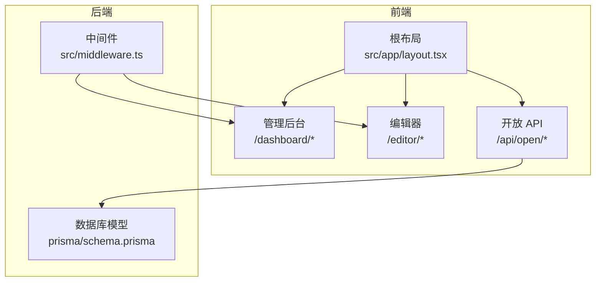
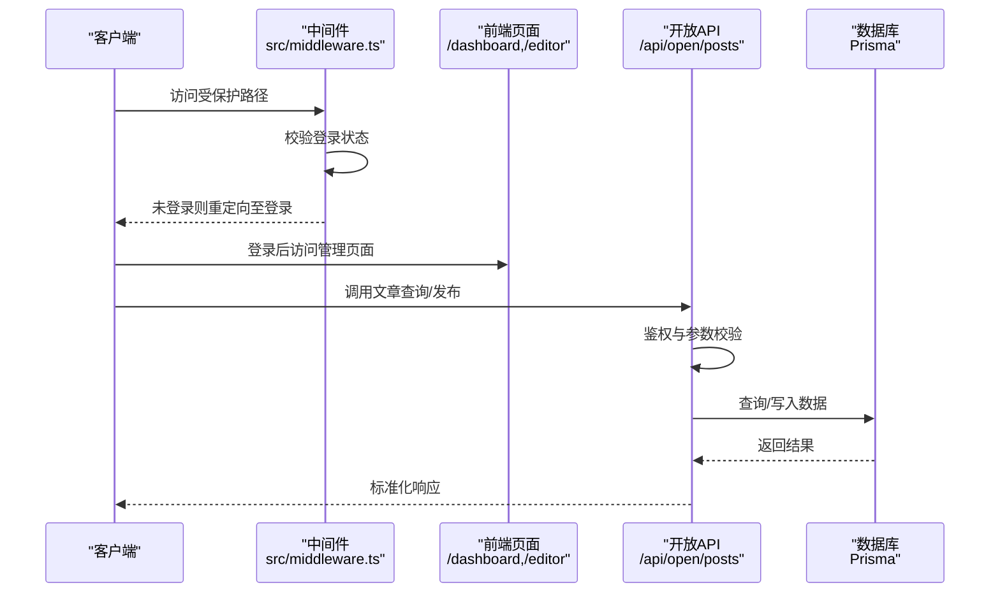
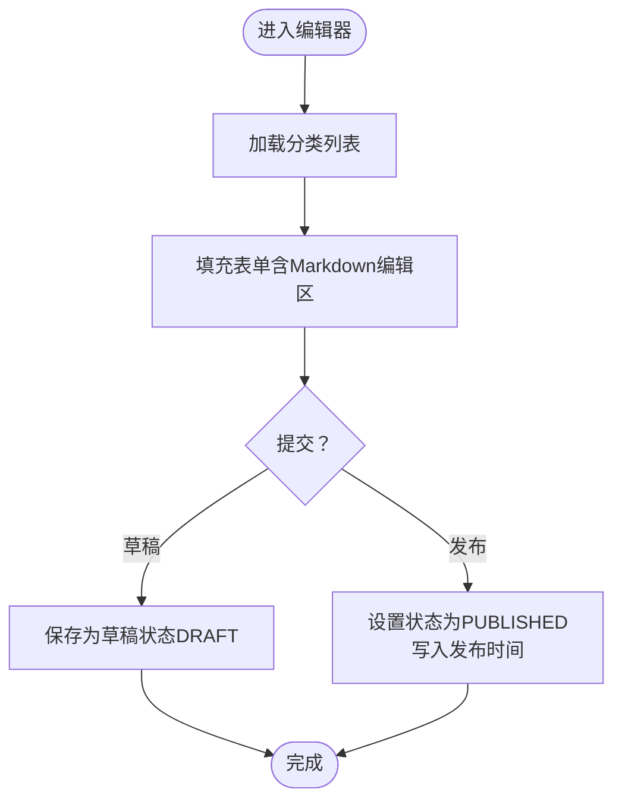
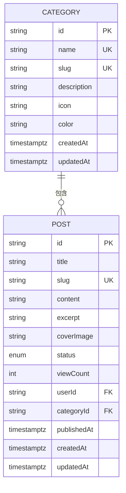
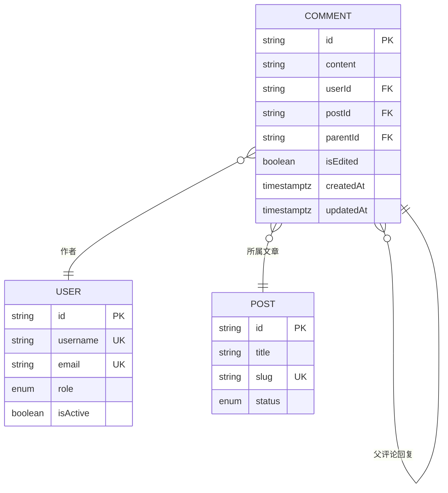
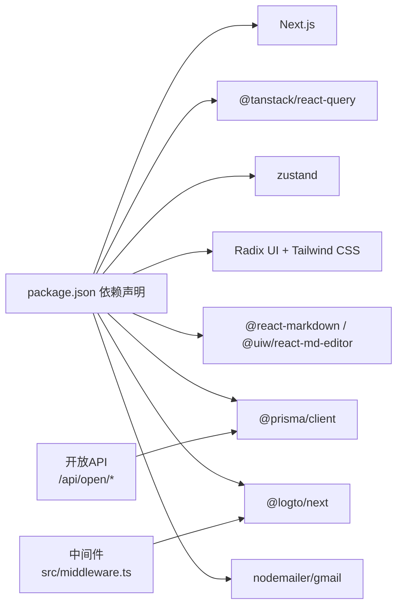

# 博客管理系统

<cite>
**本文引用的文件**
- [README.md](file://README.md)
- [package.json](file://package.json)
- [src/app/layout.tsx](file://src/app/layout.tsx)
- [prisma/schema.prisma](file://prisma/schema.prisma)
- [src/middleware.ts](file://src/middleware.ts)
- [src/app/dashboard/posts/page.tsx](file://src/app/dashboard/posts/page.tsx)
- [src/app/editor/[id]/page.tsx](file://src/app/editor/[id]/page.tsx)
- [src/app/editor/new/page.tsx](file://src/app/editor/new/page.tsx)
- [src/app/api/open/posts/route.ts](file://src/app/api/open/posts/route.ts)
- [src/app/api/open/categories/route.ts](file://src/app/api/open/categories/route.ts)
</cite>

## 目录
1. [引言](#引言)
2. [项目结构](#项目结构)
3. [核心组件](#核心组件)
4. [架构总览](#架构总览)
5. [详细组件分析](#详细组件分析)
6. [依赖关系分析](#依赖关系分析)
7. [性能考虑](#性能考虑)
8. [故障排查指南](#故障排查指南)
9. [结论](#结论)
10. [附录](#附录)

## 引言
本文件为“博客管理系统”的全面功能文档，聚焦于文章管理全生命周期（创建、编辑、发布、删除）、富文本与 Markdown 支持、分类系统（创建、层级管理、文章归类）、评论系统（提交、回复、审核、通知）、SEO 优化策略（元数据、URL 结构、搜索引擎友好性）、文章搜索与推荐、管理后台操作指南与 API 接口、性能优化与内容管理最佳实践。文档严格依据仓库现有源码进行分析与总结。

## 项目结构
系统采用 Next.js App Router 架构，前端页面位于 src/app，管理后台位于 /dashboard 与 /editor，开放 API 位于 /api/open，数据库模型由 Prisma 定义，中间件负责受保护路由的鉴权。

图表来源
- [src/app/layout.tsx:1-52](file://src/app/layout.tsx#L1-L52)
- [src/middleware.ts:1-36](file://src/middleware.ts#L1-L36)
- [prisma/schema.prisma:1-308](file://prisma/schema.prisma#L1-L308)

章节来源
- [src/app/layout.tsx:1-52](file://src/app/layout.tsx#L1-L52)
- [src/middleware.ts:1-36](file://src/middleware.ts#L1-L36)
- [prisma/schema.prisma:1-308](file://prisma/schema.prisma#L1-L308)

## 核心组件
- 文章模型与状态：Post（标题、slug、内容、摘要、封面、状态、浏览量、作者、分类、标签、评论、互动）
- 分类模型：Category（名称、slug、描述、图标、颜色、创建/更新时间）
- 评论模型：Comment（内容、用户、文章、父评论、编辑标记、创建/更新时间）
- 互动模型：Interaction（点赞/收藏、用户、文章、创建时间）
- 用户模型：User（用户名、邮箱、昵称、头像、角色、激活状态、删除标记、第三方账户等）
- 中间件：受保护路由（/dashboard、/admin）鉴权跳转
- 开放 API：文章列表查询、文章发布、分类列表查询

章节来源
- [prisma/schema.prisma:109-132](file://prisma/schema.prisma#L109-L132)
- [prisma/schema.prisma:84-96](file://prisma/schema.prisma#L84-L96)
- [prisma/schema.prisma:134-152](file://prisma/schema.prisma#L134-L152)
- [prisma/schema.prisma:154-167](file://prisma/schema.prisma#L154-L167)
- [prisma/schema.prisma:15-62](file://prisma/schema.prisma#L15-L62)
- [src/middleware.ts:8-28](file://src/middleware.ts#L8-L28)
- [src/app/api/open/posts/route.ts:17-92](file://src/app/api/open/posts/route.ts#L17-L92)
- [src/app/api/open/categories/route.ts:15-44](file://src/app/api/open/categories/route.ts#L15-L44)

## 架构总览
系统采用前后端分离的 API 设计：前端页面通过 Next.js App Router 渲染，受保护区域由中间件拦截并重定向至登录；开放 API 通过鉴权后访问 Prisma 数据层，返回标准化结果。

图表来源
- [src/middleware.ts:8-28](file://src/middleware.ts#L8-L28)
- [src/app/api/open/posts/route.ts:29-92](file://src/app/api/open/posts/route.ts#L29-L92)
- [prisma/schema.prisma:109-132](file://prisma/schema.prisma#L109-L132)

## 详细组件分析

### 文章管理全生命周期
- 创建：编辑器页面加载分类列表，提交后调用开放 API 发布文章（POST /api/open/posts），支持 Markdown 内容与草稿/发布状态切换。
- 编辑：编辑器根据文章 ID 获取文章与分类，进行权限校验后渲染初始数据。
- 发布：通过 API 设置状态为已发布，并写入发布时间；支持草稿保存。
- 删除：当前开放 API 未暴露删除接口，需在管理后台或新增 API 实现软删除/硬删除逻辑。

图表来源
- [src/app/editor/new/page.tsx:10-26](file://src/app/editor/new/page.tsx#L10-L26)
- [src/app/editor/[id]/page.tsx:15-51](file://src/app/editor/[id]/page.tsx#L15-L51)
- [src/app/api/open/posts/route.ts:130-192](file://src/app/api/open/posts/route.ts#L130-L192)

章节来源
- [src/app/editor/new/page.tsx:10-26](file://src/app/editor/new/page.tsx#L10-L26)
- [src/app/editor/[id]/page.tsx:15-51](file://src/app/editor/[id]/page.tsx#L15-L51)
- [src/app/api/open/posts/route.ts:130-192](file://src/app/api/open/posts/route.ts#L130-L192)

### 富文本编辑器与 Markdown 支持
- 依赖项包含 Markdown 渲染与编辑相关包，编辑器页面通过统一 UI 组件承载编辑体验。
- 发布接口接受 Markdown 内容，结合数据库存储原始内容，前端可按需渲染。

章节来源
- [package.json:40-70](file://package.json#L40-L70)
- [src/app/api/open/posts/route.ts:119-129](file://src/app/api/open/posts/route.ts#L119-L129)

### 分类系统设计
- 模型：分类具备名称、slug、描述、图标、颜色等属性，支持与文章一对多关联。
- 列表查询：开放 API 支持按“是否有关联文章”过滤分类列表，便于前端筛选。
- 归类：文章创建/编辑时选择分类 ID，实现文章归类。

图表来源
- [prisma/schema.prisma:84-96](file://prisma/schema.prisma#L84-L96)
- [prisma/schema.prisma:109-132](file://prisma/schema.prisma#L109-L132)

章节来源
- [prisma/schema.prisma:84-96](file://prisma/schema.prisma#L84-L96)
- [prisma/schema.prisma:109-132](file://prisma/schema.prisma#L109-L132)
- [src/app/api/open/categories/route.ts:15-44](file://src/app/api/open/categories/route.ts#L15-L44)

### 评论系统实现
- 模型：评论具备内容、用户、文章、父评论（支持回复）、编辑标记、创建/更新时间。
- 关系：评论与用户、文章、回复树（自关联）关联，支持层级化展示。
- 当前开放 API 未暴露评论 CRUD 接口，需在管理后台或新增 API 实现提交、审核、通知等能力。

图表来源
- [prisma/schema.prisma:134-152](file://prisma/schema.prisma#L134-L152)
- [prisma/schema.prisma:15-62](file://prisma/schema.prisma#L15-L62)
- [prisma/schema.prisma:109-132](file://prisma/schema.prisma#L109-L132)

章节来源
- [prisma/schema.prisma:134-152](file://prisma/schema.prisma#L134-L152)
- [prisma/schema.prisma:15-62](file://prisma/schema.prisma#L15-L62)
- [prisma/schema.prisma:109-132](file://prisma/schema.prisma#L109-L132)

### SEO 优化策略
- 元数据：根布局定义站点标题与描述，作为基础 SEO 元信息。
- URL 结构：文章使用 slug 作为 URL 路径，利于搜索引擎识别与用户阅读。
- 搜索引擎友好性：开放 API 提供文章列表查询，支持关键词搜索与分类筛选，便于爬虫抓取与索引。

章节来源
- [src/app/layout.tsx:21-24](file://src/app/layout.tsx#L21-L24)
- [prisma/schema.prisma:112](file://prisma/schema.prisma#L112)
- [src/app/api/open/posts/route.ts:18-92](file://src/app/api/open/posts/route.ts#L18-L92)

### 文章搜索与推荐
- 搜索：开放 API 支持关键词匹配标题与摘要，配合分页与排序参数，满足基本检索需求。
- 推荐：当前未实现基于内容的推荐算法，可在前端或服务端引入相似度计算、标签共现、热度排序等策略。

章节来源
- [src/app/api/open/posts/route.ts:18-92](file://src/app/api/open/posts/route.ts#L18-L92)

### 管理后台操作指南
- 登录与跳转：中间件对 /dashboard 与 /admin 下除登录外的路径进行鉴权，未登录自动跳转登录。
- 文章管理：管理页面加载分页与查询参数，结合 Suspense 渲染骨架屏，提升交互体验。
- 编辑器：新建/编辑页面加载分类与用户信息，进行权限校验后渲染编辑 UI。

章节来源
- [src/middleware.ts:8-28](file://src/middleware.ts#L8-L28)
- [src/app/dashboard/posts/page.tsx:5-28](file://src/app/dashboard/posts/page.tsx#L5-L28)
- [src/app/editor/new/page.tsx:10-26](file://src/app/editor/new/page.tsx#L10-L26)
- [src/app/editor/[id]/page.tsx:15-51](file://src/app/editor/[id]/page.tsx#L15-L51)

### API 接口文档

- 文章列表查询
  - 方法与路径：GET /api/open/posts
  - 鉴权：需要 API Key
  - 查询参数：
    - page：页码（默认 1）
    - pageSize：每页条数（默认 10，最大 100）
    - status：过滤状态（DRAFT / PUBLISHED / ARCHIVED）
    - keyword：搜索关键词（匹配标题和摘要）
    - categoryId：按分类筛选
    - sortBy：排序字段（createdAt / viewCount，默认 createdAt）
    - sortOrder：排序方向（asc / desc，默认 desc）
  - 返回：分页数据与统计信息（包含评论数、互动数）

- 发布文章
  - 方法与路径：POST /api/open/posts
  - 鉴权：需要 API Key
  - 请求体字段：
    - title：标题（必填，最长 100）
    - slug：URL 路径（选填，不传自动生成）
    - content：Markdown 内容（必填）
    - excerpt：摘要（选填）
    - coverImage：封面图 URL（选填）
    - categoryId：分类 ID（选填）
    - status：状态（选填，默认 DRAFT）
  - 返回：创建成功的文章标识与消息

- 分类列表查询
  - 方法与路径：GET /api/open/categories
  - 鉴权：需要 API Key
  - 查询参数：
    - hasPosts：是否只返回有关联文章的分类（true / false，默认 false）
  - 返回：分类列表与文章数量统计

章节来源
- [src/app/api/open/posts/route.ts:17-92](file://src/app/api/open/posts/route.ts#L17-L92)
- [src/app/api/open/posts/route.ts:118-192](file://src/app/api/open/posts/route.ts#L118-L192)
- [src/app/api/open/categories/route.ts:15-44](file://src/app/api/open/categories/route.ts#L15-L44)

## 依赖关系分析
- 前端依赖：Next.js、TanStack Query、Zustand、Radix UI、Tailwind CSS、React Markdown、@uiw/react-md-editor 等。
- 后端依赖：Prisma ORM、@logto/next（鉴权）、Nodemailer/Gmail（邮件，见 README）等。
- 中间件：基于 Edge Runtime 的 Logto 客户端，拦截受保护路径并进行登录态校验。

图表来源
- [package.json:11-98](file://package.json#L11-L98)
- [src/middleware.ts:3-6](file://src/middleware.ts#L3-L6)
- [src/app/api/open/posts/route.ts:10-15](file://src/app/api/open/posts/route.ts#L10-L15)

章节来源
- [package.json:11-98](file://package.json#L11-L98)
- [src/middleware.ts:3-6](file://src/middleware.ts#L3-L6)
- [src/app/api/open/posts/route.ts:10-15](file://src/app/api/open/posts/route.ts#L10-L15)

## 性能考虑
- 数据查询：Prisma 使用 relationJoins 预览特性减少 N+1 查询风险；开放 API 使用并发查询数据与总数。
- 分页与过滤：开放 API 支持分页与条件过滤，降低一次性传输数据量。
- 前端缓存：TanStack Query 提供请求缓存与重试机制，建议合理设置缓存时间与失效策略。
- 图片与静态资源：建议使用 CDN 与懒加载，减少首屏压力。
- 评论与互动：建议对评论树做分页加载与虚拟滚动，避免一次性渲染大量节点。

章节来源
- [prisma/schema.prisma:3-5](file://prisma/schema.prisma#L3-L5)
- [src/app/api/open/posts/route.ts:58-72](file://src/app/api/open/posts/route.ts#L58-L72)
- [package.json:34-35](file://package.json#L34-L35)

## 故障排查指南
- 鉴权失败：中间件检测未登录会重定向至登录路径，请确认登录态与 claims 是否正确。
- API Key 错误：开放 API 需要有效 API Key，若返回鉴权错误，请检查配置与签名。
- 文章状态异常：发布文章时需确保配置的用户为管理员角色且处于激活状态。
- Slug 冲突：发布文章时若 slug 已存在，需更换或留空以自动生成唯一值。
- 评论相关问题：当前开放 API 未暴露评论接口，如需评论功能请在管理后台或新增 API 实现。

章节来源
- [src/middleware.ts:21-25](file://src/middleware.ts#L21-L25)
- [src/app/api/open/posts/route.ts:130-192](file://src/app/api/open/posts/route.ts#L130-L192)
- [src/app/api/open/posts/route.ts:97-116](file://src/app/api/open/posts/route.ts#L97-L116)

## 结论
本博客管理系统以 Next.js App Router 为基础，结合 Prisma ORM 与中间件鉴权，提供了文章管理、分类体系与开放 API 的核心能力。富文本与 Markdown 支持完善，SEO 元数据与 URL 结构清晰，具备良好的扩展性。评论系统与推荐算法尚未在开放 API 中实现，建议在管理后台或后续版本中补充评论 CRUD、审核与通知，以及基于内容与交互的推荐策略。

## 附录
- 项目快速启动与环境配置参见根目录 README 与 package.json。
- 邮件功能与管理页面参见 README 与相关页面路径。

章节来源
- [README.md:1-125](file://README.md#L1-L125)
- [package.json:1-98](file://package.json#L1-L98)