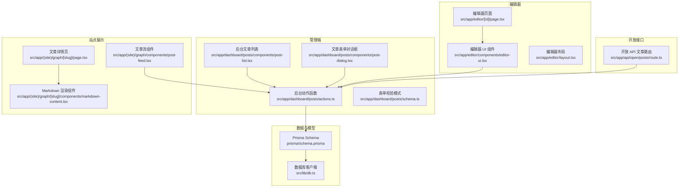
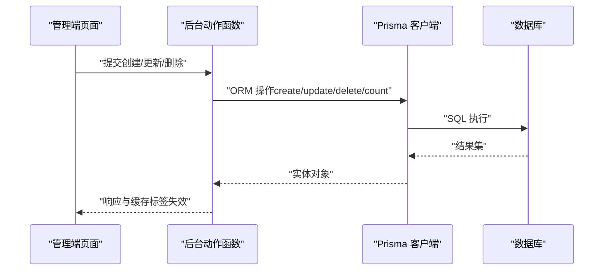
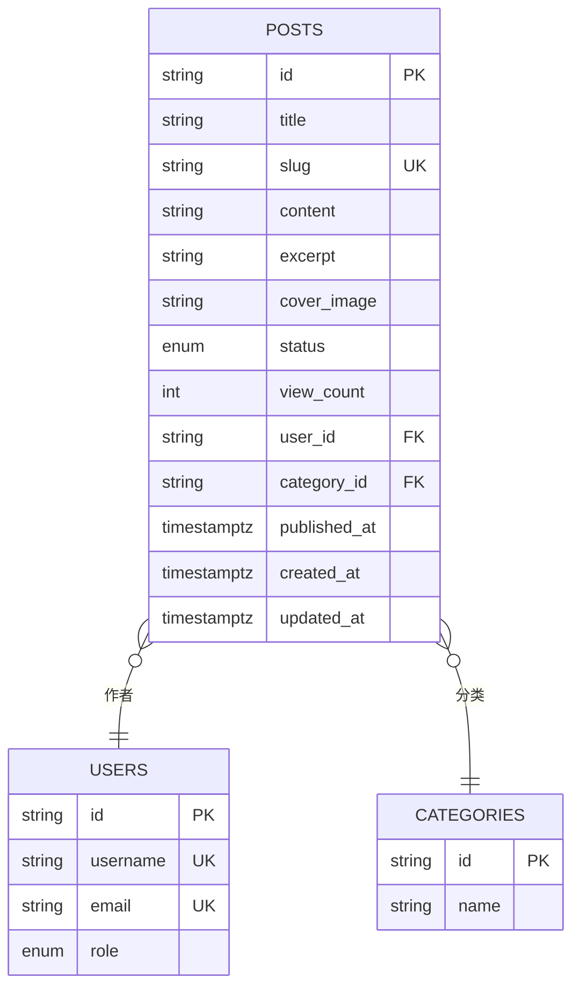
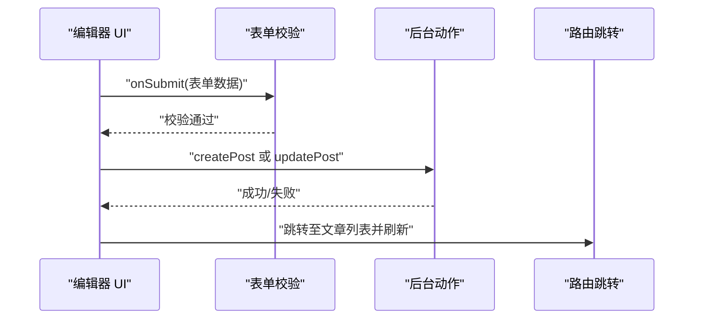
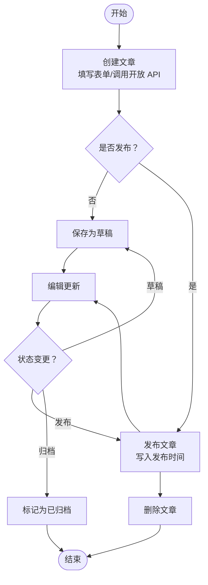
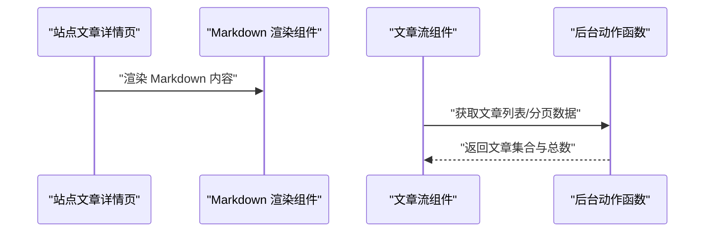
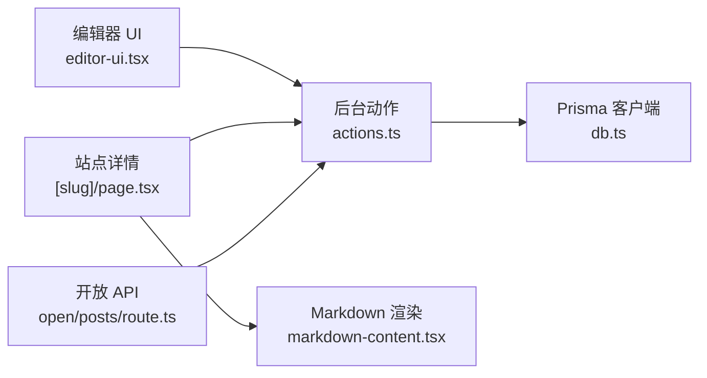

# 文章管理

<cite>
**本文引用的文件**
- [prisma/schema.prisma](file://prisma/schema.prisma)
- [prisma/migrations/20260122003154_add_miss_table/migration.sql](file://prisma/migrations/20260122003154_add_miss_table/migration.sql)
- [src/lib/db.ts](file://src/lib/db.ts)
- [src/app/dashboard/posts/actions.ts](file://src/app/dashboard/posts/actions.ts)
- [src/app/dashboard/posts/schema.ts](file://src/app/dashboard/posts/schema.ts)
- [src/app/dashboard/posts/components/post-list.tsx](file://src/app/dashboard/posts/components/post-list.tsx)
- [src/app/dashboard/posts/components/post-dialog.tsx](file://src/app/dashboard/posts/components/post-dialog.tsx)
- [src/app/editor/[id]/page.tsx](file://src/app/editor/[id]/page.tsx)
- [src/app/editor/components/editor-ui.tsx](file://src/app/editor/components/editor-ui.tsx)
- [src/app/editor/layout.tsx](file://src/app/editor/layout.tsx)
- [src/app/api/open/posts/route.ts](file://src/app/api/open/posts/route.ts)
- [src/app/(site)/graph/[slug]/page.tsx](file://src/app/(site)/graph/[slug]/page.tsx)
- [src/app/(site)/graph/[slug]/components/markdown-content.tsx](file://src/app/(site)/graph/[slug]/components/markdown-content.tsx)
- [src/app/(site)/graph/components/post-feed.tsx](file://src/app/(site)/graph/components/post-feed.tsx)
- [src/config/admin-menu.ts](file://src/config/admin-menu.ts)
- [src/components/ui/form.tsx](file://src/components/ui/form.tsx)
- [src/components/ui/input.tsx](file://src/components/ui/input.tsx)
</cite>

## 目录
1. [简介](#简介)
2. [项目结构](#项目结构)
3. [核心组件](#核心组件)
4. [架构总览](#架构总览)
5. [详细组件分析](#详细组件分析)
6. [依赖关系分析](#依赖关系分析)
7. [性能考量](#性能考量)
8. [故障排查指南](#故障排查指南)
9. [结论](#结论)
10. [附录](#附录)

## 简介
本技术文档围绕“文章管理”功能展开，系统性阐述文章从创建、草稿保存、编辑更新、发布与状态切换、到删除的完整生命周期；详述富文本编辑器在前端的集成方式与媒体上传流程；梳理文章数据模型的设计、验证规则与索引优化；解释状态管理机制（草稿、已发布、已归档）及流转逻辑；提供后台管理界面的操作指南（搜索、筛选、排序、批量操作）；最后给出性能优化策略与最佳实践。

## 项目结构
文章管理相关能力横跨数据库模型、服务端路由、后台管理页面、编辑器页面与站点展示页面，形成“管理端-编辑器-站点展示”的闭环。

图表来源
- [src/app/dashboard/posts/components/post-list.tsx:138-193](file://src/app/dashboard/posts/components/post-list.tsx#L138-L193)
- [src/app/dashboard/posts/components/post-dialog.tsx:147-177](file://src/app/dashboard/posts/components/post-dialog.tsx#L147-L177)
- [src/app/dashboard/posts/actions.ts:1-164](file://src/app/dashboard/posts/actions.ts#L1-L164)
- [src/app/dashboard/posts/schema.ts:1-13](file://src/app/dashboard/posts/schema.ts#L1-L13)
- [src/app/editor/[id]/page.tsx](file://src/app/editor/[id]/page.tsx#L1-L51)
- [src/app/editor/components/editor-ui.tsx:1-273](file://src/app/editor/components/editor-ui.tsx#L1-L273)
- [src/app/editor/layout.tsx:1-27](file://src/app/editor/layout.tsx#L1-L27)
- [src/app/api/open/posts/route.ts:118-192](file://src/app/api/open/posts/route.ts#L118-L192)
- [src/app/(site)/graph/[slug]/page.tsx](file://src/app/(site)/graph/[slug]/page.tsx#L71-L99)
- [src/app/(site)/graph/[slug]/components/markdown-content.tsx](file://src/app/(site)/graph/[slug]/components/markdown-content.tsx#L1-L41)
- [src/app/(site)/graph/components/post-feed.tsx](file://src/app/(site)/graph/components/post-feed.tsx#L1-L32)
- [prisma/schema.prisma:111-132](file://prisma/schema.prisma#L111-L132)
- [src/lib/db.ts:1-16](file://src/lib/db.ts#L1-L16)

章节来源
- [src/app/dashboard/posts/components/post-list.tsx:138-193](file://src/app/dashboard/posts/components/post-list.tsx#L138-L193)
- [src/app/dashboard/posts/components/post-dialog.tsx:147-177](file://src/app/dashboard/posts/components/post-dialog.tsx#L147-L177)
- [src/app/dashboard/posts/actions.ts:1-164](file://src/app/dashboard/posts/actions.ts#L1-L164)
- [src/app/dashboard/posts/schema.ts:1-13](file://src/app/dashboard/posts/schema.ts#L1-L13)
- [src/app/editor/[id]/page.tsx](file://src/app/editor/[id]/page.tsx#L1-L51)
- [src/app/editor/components/editor-ui.tsx:1-273](file://src/app/editor/components/editor-ui.tsx#L1-L273)
- [src/app/editor/layout.tsx:1-27](file://src/app/editor/layout.tsx#L1-L27)
- [src/app/api/open/posts/route.ts:118-192](file://src/app/api/open/posts/route.ts#L118-L192)
- [src/app/(site)/graph/[slug]/page.tsx](file://src/app/(site)/graph/[slug]/page.tsx#L71-L99)
- [src/app/(site)/graph/[slug]/components/markdown-content.tsx](file://src/app/(site)/graph/[slug]/components/markdown-content.tsx#L1-L41)
- [src/app/(site)/graph/components/post-feed.tsx](file://src/app/(site)/graph/components/post-feed.tsx#L1-L32)
- [prisma/schema.prisma:111-132](file://prisma/schema.prisma#L111-L132)
- [src/lib/db.ts:1-16](file://src/lib/db.ts#L1-L16)

## 核心组件
- 数据模型与索引
  - 文章模型包含标题、URL 路径、内容、摘要、封面图、状态、浏览数、作者、分类、发布时间、创建与更新时间等字段，并建立用户与分类索引以优化查询。
  - 状态枚举支持草稿、已发布、已归档三态。
- 表单校验与类型
  - 使用 Zod 定义文章表单字段与约束，统一前后端校验。
- 后台动作函数
  - 提供分页查询、创建、更新、删除、按 slug 查询等服务端动作，结合缓存标签实现增量刷新。
- 编辑器集成
  - 前端使用动态加载的 Markdown 编辑器，支持图片上传回调、字数统计、状态切换提交。
- 站点渲染
  - 文章详情页通过 Markdown 渲染组件展示内容，支持 GFM 与代码高亮。

章节来源
- [prisma/schema.prisma:111-132](file://prisma/schema.prisma#L111-L132)
- [prisma/migrations/20260122003154_add_miss_table/migration.sql:4-6](file://prisma/migrations/20260122003154_add_miss_table/migration.sql#L4-L6)
- [src/app/dashboard/posts/schema.ts:1-13](file://src/app/dashboard/posts/schema.ts#L1-L13)
- [src/app/dashboard/posts/actions.ts:1-164](file://src/app/dashboard/posts/actions.ts#L1-L164)
- [src/app/editor/components/editor-ui.tsx:1-273](file://src/app/editor/components/editor-ui.tsx#L1-L273)
- [src/app/(site)/graph/[slug]/components/markdown-content.tsx](file://src/app/(site)/graph/[slug]/components/markdown-content.tsx#L1-L41)

## 架构总览
文章管理采用“服务端动作 + 动态编辑器 + Prisma ORM + 缓存标签”的架构，确保管理端与站点端的一致性与高性能。

图表来源
- [src/app/dashboard/posts/actions.ts:1-164](file://src/app/dashboard/posts/actions.ts#L1-L164)
- [src/lib/db.ts:1-16](file://src/lib/db.ts#L1-L16)
- [prisma/schema.prisma:111-132](file://prisma/schema.prisma#L111-L132)

## 详细组件分析

### 数据模型与状态管理
- 字段定义与约束
  - 标题长度限制、URL 路径正则约束、内容必填、状态默认草稿、浏览数默认 0、发布时间仅在发布时写入。
- 关系与索引
  - 与用户、分类的多对一关系；为用户与分类字段建立索引，加速筛选与连接。
- 状态枚举
  - 支持 DRAFT、PUBLISHED、ARCHIVED 三种状态，站点端根据状态显示不同视觉标识。

图表来源
- [prisma/schema.prisma:111-132](file://prisma/schema.prisma#L111-L132)
- [prisma/migrations/20260122003154_add_miss_table/migration.sql:4-6](file://prisma/migrations/20260122003154_add_miss_table/migration.sql#L4-L6)

章节来源
- [prisma/schema.prisma:111-132](file://prisma/schema.prisma#L111-L132)
- [prisma/migrations/20260122003154_add_miss_table/migration.sql:4-6](file://prisma/migrations/20260122003154_add_miss_table/migration.sql#L4-L6)

### 富文本编辑器集成
- 编辑器组件
  - 使用动态导入的 Markdown 编辑器，支持 Markdown 输入、GFM、图片上传回调、高度自适应。
- 表单与校验
  - 使用 react-hook-form + zodResolver，表单字段与服务端校验一致。
- 提交流程
  - 新建或更新时自动补全 slug，区分草稿与发布两种提交反馈。
- 图片上传
  - 编辑器提供图片上传回调，可在回调中调用上传接口并返回图片 URL。

图表来源
- [src/app/editor/components/editor-ui.tsx:123-167](file://src/app/editor/components/editor-ui.tsx#L123-L167)
- [src/app/dashboard/posts/actions.ts:74-121](file://src/app/dashboard/posts/actions.ts#L74-L121)
- [src/app/dashboard/posts/schema.ts:1-13](file://src/app/dashboard/posts/schema.ts#L1-L13)

章节来源
- [src/app/editor/components/editor-ui.tsx:1-273](file://src/app/editor/components/editor-ui.tsx#L1-L273)
- [src/app/dashboard/posts/schema.ts:1-13](file://src/app/dashboard/posts/schema.ts#L1-L13)
- [src/app/dashboard/posts/actions.ts:74-121](file://src/app/dashboard/posts/actions.ts#L74-L121)

### 文章生命周期管理
- 创建
  - 管理端表单或开放 API 创建文章，若未提供 slug 则自动生成；校验唯一性后入库。
- 草稿保存
  - 编辑器默认保存为草稿；提交时可选择发布或继续草稿。
- 编辑更新
  - 支持修改标题、内容、摘要、封面、分类与状态；更新时校验 slug 唯一性。
- 发布与状态切换
  - 状态可设为草稿或已发布；发布时写入发布时间；站点端根据状态渲染。
- 删除
  - 管理端删除文章后触发缓存标签失效，确保列表与站点端数据一致性。

图表来源
- [src/app/dashboard/posts/actions.ts:74-132](file://src/app/dashboard/posts/actions.ts#L74-L132)
- [src/app/api/open/posts/route.ts:118-192](file://src/app/api/open/posts/route.ts#L118-L192)
- [src/app/editor/components/editor-ui.tsx:138-167](file://src/app/editor/components/editor-ui.tsx#L138-L167)

章节来源
- [src/app/dashboard/posts/actions.ts:74-132](file://src/app/dashboard/posts/actions.ts#L74-L132)
- [src/app/api/open/posts/route.ts:118-192](file://src/app/api/open/posts/route.ts#L118-L192)
- [src/app/editor/components/editor-ui.tsx:138-167](file://src/app/editor/components/editor-ui.tsx#L138-L167)

### 站点端渲染与交互
- 文章详情页
  - 展示封面图、标题、正文（Markdown 渲染）、评论区与交互统计。
- Markdown 渲染
  - 使用 remark-gfm 与 rehype-slug，代码块高亮，支持表格与标题锚点。
- 文章流
  - 前台文章流组件支持分页与懒加载，基于后台动作函数提供的数据。

图表来源
- [src/app/(site)/graph/[slug]/page.tsx](file://src/app/(site)/graph/[slug]/page.tsx#L71-L99)
- [src/app/(site)/graph/[slug]/components/markdown-content.tsx](file://src/app/(site)/graph/[slug]/components/markdown-content.tsx#L1-L41)
- [src/app/(site)/graph/components/post-feed.tsx](file://src/app/(site)/graph/components/post-feed.tsx#L1-L32)
- [src/app/dashboard/posts/actions.ts:24-68](file://src/app/dashboard/posts/actions.ts#L24-L68)

章节来源
- [src/app/(site)/graph/[slug]/page.tsx](file://src/app/(site)/graph/[slug]/page.tsx#L71-L99)
- [src/app/(site)/graph/[slug]/components/markdown-content.tsx](file://src/app/(site)/graph/[slug]/components/markdown-content.tsx#L1-L41)
- [src/app/(site)/graph/components/post-feed.tsx](file://src/app/(site)/graph/components/post-feed.tsx#L1-L32)
- [src/app/dashboard/posts/actions.ts:24-68](file://src/app/dashboard/posts/actions.ts#L24-L68)

### 管理界面操作指南
- 搜索与筛选
  - 支持按标题/摘要模糊搜索，按分类筛选。
- 排序与分页
  - 默认按创建时间倒序；分页参数由后台动作函数处理。
- 批量操作
  - 当前实现聚焦单条删除，可扩展批量删除与状态批量切换。
- 权限控制
  - 编辑器页面对非作者本人进行简单权限检查，实际应加强服务端校验。

章节来源
- [src/app/dashboard/posts/components/post-list.tsx:96-211](file://src/app/dashboard/posts/components/post-list.tsx#L96-L211)
- [src/app/dashboard/posts/actions.ts:10-22](file://src/app/dashboard/posts/actions.ts#L10-L22)
- [src/app/editor/[id]/page.tsx](file://src/app/editor/[id]/page.tsx#L27-L31)

## 依赖关系分析
- 组件耦合
  - 编辑器 UI 依赖后台动作函数与表单校验；后台动作函数依赖 Prisma 客户端与缓存标签；站点渲染依赖后台动作函数与 Markdown 渲染组件。
- 外部依赖
  - Prisma ORM、Next.js 动态导入、react-hook-form + zod、react-markdown + remark 插件、@uiw/react-md-editor。

图表来源
- [src/app/editor/components/editor-ui.tsx:1-273](file://src/app/editor/components/editor-ui.tsx#L1-L273)
- [src/app/dashboard/posts/actions.ts:1-164](file://src/app/dashboard/posts/actions.ts#L1-L164)
- [src/lib/db.ts:1-16](file://src/lib/db.ts#L1-L16)
- [src/app/(site)/graph/[slug]/page.tsx](file://src/app/(site)/graph/[slug]/page.tsx#L71-L99)
- [src/app/(site)/graph/[slug]/components/markdown-content.tsx](file://src/app/(site)/graph/[slug]/components/markdown-content.tsx#L1-L41)
- [src/app/api/open/posts/route.ts:118-192](file://src/app/api/open/posts/route.ts#L118-L192)

章节来源
- [src/app/editor/components/editor-ui.tsx:1-273](file://src/app/editor/components/editor-ui.tsx#L1-L273)
- [src/app/dashboard/posts/actions.ts:1-164](file://src/app/dashboard/posts/actions.ts#L1-L164)
- [src/lib/db.ts:1-16](file://src/lib/db.ts#L1-L16)
- [src/app/(site)/graph/[slug]/page.tsx](file://src/app/(site)/graph/[slug]/page.tsx#L71-L99)
- [src/app/(site)/graph/[slug]/components/markdown-content.tsx](file://src/app/(site)/graph/[slug]/components/markdown-content.tsx#L1-L41)
- [src/app/api/open/posts/route.ts:118-192](file://src/app/api/open/posts/route.ts#L118-L192)

## 性能考量
- 查询优化
  - 使用 Prisma 的 relationJoins 预取关联数据，减少 N+1 查询风险；为常用筛选字段建立索引。
- 缓存与增量刷新
  - 后台动作函数使用缓存标签与路径失效，确保管理端与站点端数据一致性与低延迟。
- 渲染优化
  - 编辑器动态导入避免首屏体积；Markdown 渲染组件按需加载插件；前台文章流使用懒加载与分页。
- 数据库连接
  - 生产环境关闭详细日志，开发环境开启查询日志便于调试。

章节来源
- [prisma/schema.prisma:1-5](file://prisma/schema.prisma#L1-L5)
- [src/lib/db.ts:1-16](file://src/lib/db.ts#L1-L16)
- [src/app/dashboard/posts/actions.ts:24-68](file://src/app/dashboard/posts/actions.ts#L24-L68)
- [src/app/(site)/graph/components/post-feed.tsx](file://src/app/(site)/graph/components/post-feed.tsx#L1-L32)
- [src/app/editor/components/editor-ui.tsx:35-35](file://src/app/editor/components/editor-ui.tsx#L35-L35)

## 故障排查指南
- 表单校验失败
  - 检查标题长度、URL 路径格式、内容必填与状态枚举值；确认服务端与前端校验一致。
- Slug 冲突
  - 创建/更新时若提示 slug 已存在，更换唯一值或允许系统自动生成。
- 权限问题
  - 编辑器页面对非作者本人进行简单校验，建议在服务端动作中进一步校验并拒绝非法操作。
- 缓存未刷新
  - 删除/更新后检查缓存标签与路径失效是否正确触发，确保管理端与站点端数据同步。
- Markdown 渲染异常
  - 确认 remark-gfm 与 rehype-slug 插件版本兼容，代码块语言标识正确。

章节来源
- [src/app/dashboard/posts/schema.ts:1-13](file://src/app/dashboard/posts/schema.ts#L1-L13)
- [src/app/dashboard/posts/actions.ts:74-132](file://src/app/dashboard/posts/actions.ts#L74-L132)
- [src/app/editor/[id]/page.tsx](file://src/app/editor/[id]/page.tsx#L27-L31)
- [src/app/(site)/graph/[slug]/components/markdown-content.tsx](file://src/app/(site)/graph/[slug]/components/markdown-content.tsx#L1-L41)

## 结论
文章管理功能以清晰的数据模型、严格的表单校验、完善的生命周期管理与高效的渲染体系为核心，结合缓存与索引优化，实现了从后台管理到站点展示的高效协同。未来可在管理端扩展批量操作与更细粒度的状态流转控制，并持续优化渲染与网络请求性能。

## 附录
- 管理菜单入口
  - “文章管理”菜单项位于后台导航，便于快速进入文章列表与编辑器。
- 开放 API
  - 提供文章发布的开放接口，支持管理员通过 API 创建文章并设置状态。

章节来源
- [src/config/admin-menu.ts:47-82](file://src/config/admin-menu.ts#L47-L82)
- [src/app/api/open/posts/route.ts:118-192](file://src/app/api/open/posts/route.ts#L118-L192)