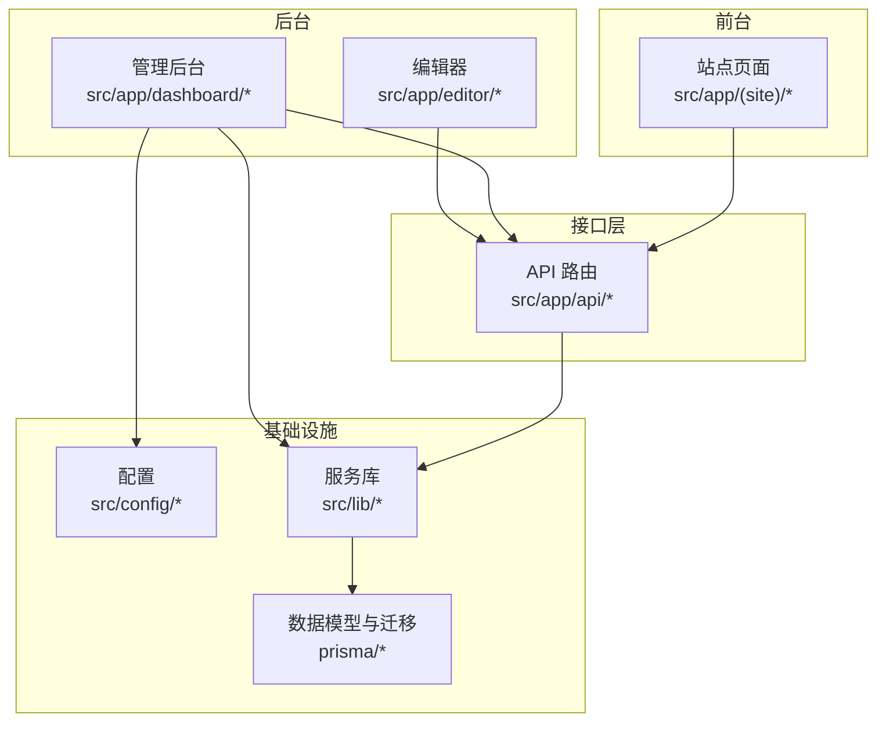
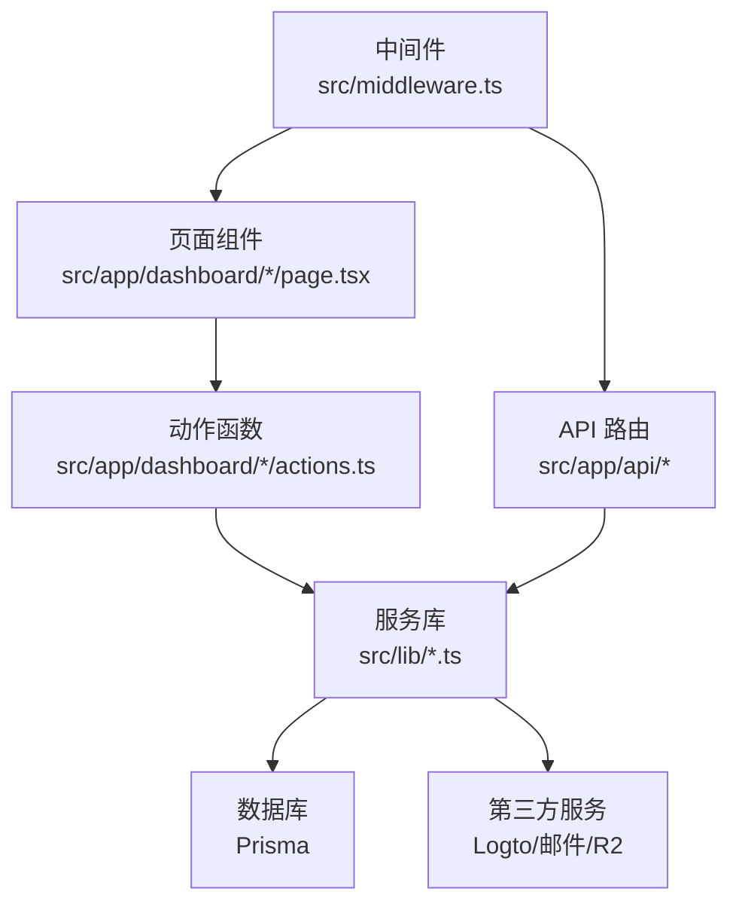
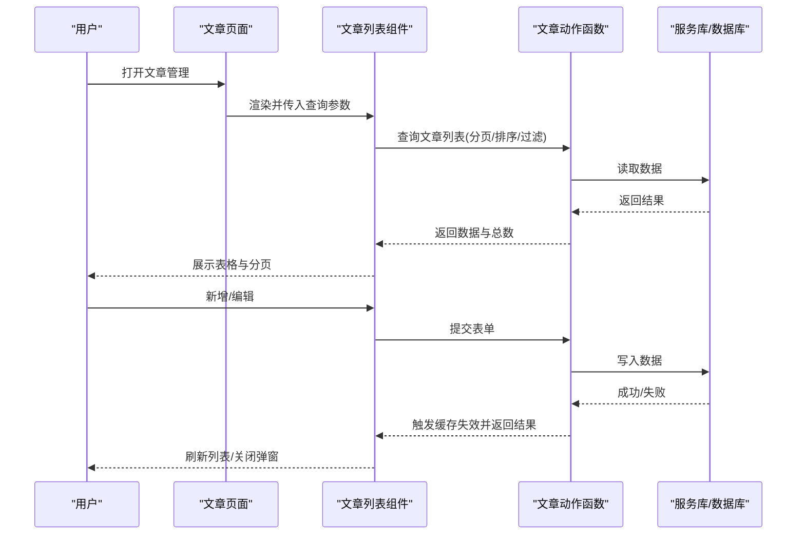
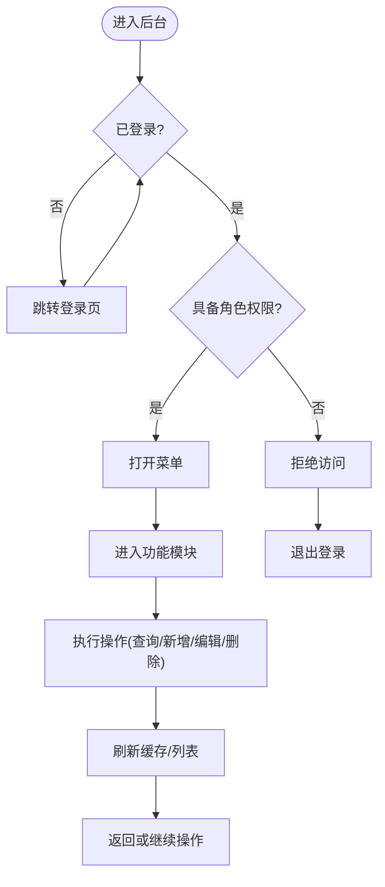
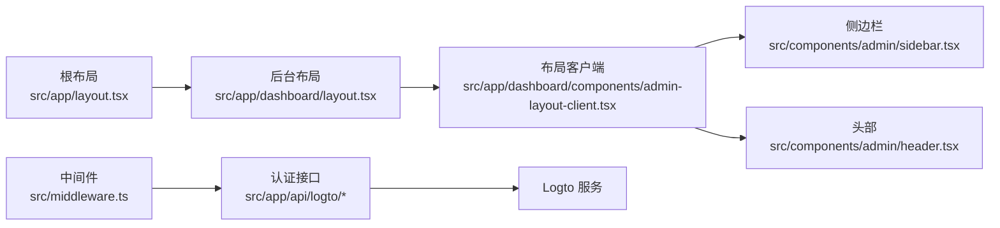

# 管理后台

<cite>
**本文引用的文件**
- [README.md](file://README.md)
- [AGENTS.md](file://AGENTS.md)
- [layout.tsx](file://src/app/layout.tsx)
- [loading.tsx](file://src/app/loading.tsx)
- [admin-layout-client.tsx](file://src/app/dashboard/components/admin-layout-client.tsx)
- [layout.tsx](file://src/app/dashboard/layout.tsx)
- [loading.tsx](file://src/app/dashboard/loading.tsx)
- [admin-menu.ts](file://src/config/admin-menu.ts)
- [app-sidebar.tsx](file://src/components/admin/app-sidebar.tsx)
- [header.tsx](file://src/components/admin/header.tsx)
- [sidebar.tsx](file://src/components/admin/sidebar.tsx)
- [button.tsx](file://src/components/ui/button.tsx)
- [form.tsx](file://src/components/ui/form.tsx)
- [input.tsx](file://src/components/ui/input.tsx)
- [textarea.tsx](file://src/components/ui/textarea.tsx)
- [select.tsx](file://src/components/ui/select.tsx)
- [table.tsx](file://src/components/ui/table.tsx)
- [pagination.tsx](file://src/components/ui/pagination.tsx)
- [dialog.tsx](file://src/components/ui/dialog.tsx)
- [alert-dialog.tsx](file://src/components/ui/alert-dialog.tsx)
- [use-mobile.ts](file://src/hooks/use-mobile.ts)
- [middleware.ts](file://src/middleware.ts)
- [logto.ts](file://src/lib/logto.ts)
- [session.ts](file://src/lib/session.ts)
- [email-service.ts](file://src/lib/email-service.ts)
- [mailer.ts](file://src/lib/mailer.ts)
- [db.ts](file://src/lib/db.ts)
- [posts/actions.ts](file://src/app/dashboard/posts/actions.ts)
- [posts/schema.ts](file://src/app/dashboard/posts/schema.ts)
- [posts/page.tsx](file://src/app/dashboard/posts/page.tsx)
- [posts/components/post-list.tsx](file://src/app/dashboard/posts/components/post-list.tsx)
- [posts/components/post-dialog.tsx](file://src/app/dashboard/posts/components/post-dialog.tsx)
- [categories/actions.ts](file://src/app/dashboard/categories/actions.ts)
- [categories/schema.ts](file://src/app/dashboard/categories/schema.ts)
- [categories/page.tsx](file://src/app/dashboard/categories/page.tsx)
- [categories/components/category-list.tsx](file://src/app/dashboard/categories/components/category-list.tsx)
- [categories/components/category-dialog.tsx](file://src/app/dashboard/categories/components/category-dialog.tsx)
- [comments/actions.ts](file://src/app/dashboard/comments/actions.ts)
- [comments/page.tsx](file://src/app/dashboard/comments/page.tsx)
- [comments/components/comment-list.tsx](file://src/app/dashboard/comments/components/comment-list.tsx)
- [users/actions.ts](file://src/app/dashboard/users/actions.ts)
- [users/schema.ts](file://src/app/dashboard/users/schema.ts)
- [users/page.tsx](file://src/app/dashboard/users/page.tsx)
- [users/components/user-list.tsx](file://src/app/dashboard/users/components/user-list.tsx)
- [users/components/user-dialog.tsx](file://src/app/dashboard/users/components/user-dialog.tsx)
- [email-logs/actions.ts](file://src/app/dashboard/email-logs/actions.ts)
- [email-logs/page.tsx](file://src/app/dashboard/email-logs/page.tsx)
- [email-logs/components/email-logs-list.tsx](file://src/app/dashboard/email-logs/components/email-logs-list.tsx)
- [friend-links/actions.ts](file://src/app/dashboard/friend-links/actions.ts)
- [friend-links/schema.ts](file://src/app/dashboard/friend-links/schema.ts)
- [friend-links/page.tsx](file://src/app/dashboard/friend-links/page.tsx)
- [friend-links/components/friend-link-list.tsx](file://src/app/dashboard/friend-links/components/friend-link-list.tsx)
- [friend-links/components/friend-link-dialog.tsx](file://src/app/dashboard/friend-links/components/friend-link-dialog.tsx)
- [overview/actions.ts](file://src/app/dashboard/overview/actions.ts)
- [overview/page.tsx](file://src/app/dashboard/overview/page.tsx)
- [overview/components/overview-trend-chart.tsx](file://src/app/dashboard/overview/components/overview-trend-chart.tsx)
- [editor/page.tsx](file://src/app/editor/[id]/page.tsx)
- [editor/new/page.tsx](file://src/app/editor/new/page.tsx)
- [editor/components/editor-ui.tsx](file://src/app/editor/components/editor-ui.tsx)
- [api/auth/me/route.ts](file://src/app/api/auth/me/route.ts)
- [api/logto/sign-in/route.ts](file://src/app/api/logto/sign-in/route.ts)
- [api/logto/sign-out/route.ts](file://src/app/api/logto/sign-out/route.ts)
- [api/logto/callback/route.ts](file://src/app/api/logto/callback/route.ts)
- [api/analytics/track/route.ts](file://src/app/api/analytics/track/route.ts)
- [api/send/verification-code/route.ts](file://src/app/api/send/verification-code/route.ts)
- [api/send/notification/route.ts](file://src/app/api/send/notification/route.ts)
- [api/upload/r2/token/route.ts](file://src/app/api/upload/r2/token/route.ts)
- [api/upload/r2/upload/route.ts](file://src/app/api/upload/r2/upload/route.ts)
- [api/upload/r2/url/route.ts](file://src/app/api/upload/r2/url/route.ts)
- [api/upload/token/route.ts](file://src/app/api/upload/token/route.ts)
- [api/test-db/route.ts](file://src/app/api/test-db/route.ts)
- [api/test-mail/route.ts](file://src/app/api/test-mail/route.ts)
- [api/test-friend-email/route.ts](file://src/app/api/test-friend-email/route.ts)
- [api/send-friend-approval/route.ts](file://src/app/api/send-friend-approval/route.ts)
- [prisma/schema.prisma](file://prisma/schema.prisma)
- [prisma/migrations/.../migration.sql](file://prisma/migrations/20260202122338_add_email_log_table/migration.sql)
</cite>

## 目录
1. [简介](#简介)
2. [项目结构](#项目结构)
3. [核心组件](#核心组件)
4. [架构总览](#架构总览)
5. [详细组件分析](#详细组件分析)
6. [依赖关系分析](#依赖关系分析)
7. [性能考虑](#性能考虑)
8. [故障排查指南](#故障排查指南)
9. [结论](#结论)
10. [附录](#附录)

## 简介
本文件面向博客管理后台的运营与开发人员，系统性梳理后台整体架构、布局与导航、权限控制、各管理模块（文章、分类、评论、用户、邮件日志、友链、AI工具等）的操作流程与技术实现；同时覆盖数据表格与表单组件的交互设计、响应式与体验优化、管理员角色权限配置、后台安全与运维（操作日志、数据备份恢复建议）等内容。

## 项目结构
后台采用 Next.js App Router 的路由分组与页面组织方式，核心入口位于 dashboard 分组，配合中间件与认证服务实现受控访问。主要目录与职责概览如下：
- src/app/dashboard：后台主区域，按功能划分子页面与组件
- src/app/api：后端接口层，封装认证、上传、通知、测试等功能
- src/components/admin：后台专用 UI 组件（侧边栏、头部等）
- src/components/ui：通用 UI 组件库（按钮、表单、表格、分页等）
- src/config：后台菜单配置
- src/lib：基础设施与服务（数据库、邮件、会话、Logto 集成等）
- prisma：数据模型与迁移

图表来源
- [layout.tsx](file://src/app/layout.tsx)
- [layout.tsx](file://src/app/dashboard/layout.tsx)
- [admin-menu.ts](file://src/config/admin-menu.ts)
- [db.ts](file://src/lib/db.ts)
- [prisma/schema.prisma](file://prisma/schema.prisma)

章节来源
- [AGENTS.md](file://AGENTS.md)
- [README.md](file://README.md)

## 核心组件
- 布局与导航
  - 后台布局客户端逻辑：负责移动端适配、抽屉展开状态、面包屑等交互
  - 顶部导航与侧边栏：提供后台统一头部与菜单导航
  - 菜单配置：集中定义后台可访问的菜单项与权限标识
- 数据表格与分页
  - 表格组件：支持排序、筛选、行选择、批量操作
  - 分页组件：支持跳转页码、每页数量切换
- 表单与校验
  - 表单组件：统一的字段容器与布局
  - 输入组件：文本、多行文本、下拉选择等
  - 对话框：新增/编辑弹窗，含确认与取消流程
- 安全与权限
  - 中间件：基于角色的访问控制
  - 认证集成：Logto 登录/登出/回调
  - 会话与用户信息：通过 API 获取当前用户

章节来源
- [admin-layout-client.tsx](file://src/app/dashboard/components/admin-layout-client.tsx)
- [header.tsx](file://src/components/admin/header.tsx)
- [app-sidebar.tsx](file://src/components/admin/app-sidebar.tsx)
- [admin-menu.ts](file://src/config/admin-menu.ts)
- [table.tsx](file://src/components/ui/table.tsx)
- [pagination.tsx](file://src/components/ui/pagination.tsx)
- [form.tsx](file://src/components/ui/form.tsx)
- [input.tsx](file://src/components/ui/input.tsx)
- [textarea.tsx](file://src/components/ui/textarea.tsx)
- [select.tsx](file://src/components/ui/select.tsx)
- [dialog.tsx](file://src/components/ui/dialog.tsx)
- [alert-dialog.tsx](file://src/components/ui/alert-dialog.tsx)
- [middleware.ts](file://src/middleware.ts)
- [logto.ts](file://src/lib/logto.ts)
- [session.ts](file://src/lib/session.ts)
- [api/auth/me/route.ts](file://src/app/api/auth/me/route.ts)

## 架构总览
后台采用“页面 + 动作函数 + 服务库”的分层设计：
- 页面层：负责渲染与交互
- 动作函数（Server Actions）：封装 CRUD 与业务逻辑，并触发缓存失效
- 服务库：数据库、邮件、上传、第三方 SDK 封装
- 接口层：REST 风格 API，用于认证、上传、通知、测试等

图表来源
- [posts/actions.ts](file://src/app/dashboard/posts/actions.ts)
- [users/actions.ts](file://src/app/dashboard/users/actions.ts)
- [email-service.ts](file://src/lib/email-service.ts)
- [db.ts](file://src/lib/db.ts)
- [middleware.ts](file://src/middleware.ts)
- [api/auth/me/route.ts](file://src/app/api/auth/me/route.ts)

## 详细组件分析

### 文章管理
- 模块职责
  - 列表展示：支持分页、排序、搜索、批量删除
  - 编辑/新增：弹窗表单，含富文本输入、分类关联、状态切换
  - 发布与草稿：统一通过动作函数持久化
- 关键实现点
  - 列表组件：封装查询参数（分页、排序、过滤），调用动作函数获取数据
  - 表单组件：统一校验与提交流程，提交后刷新列表缓存
  - 弹窗对话框：确认/取消、错误提示、加载态
- 数据流示意

图表来源
- [posts/page.tsx](file://src/app/dashboard/posts/page.tsx)
- [posts/components/post-list.tsx](file://src/app/dashboard/posts/components/post-list.tsx)
- [posts/components/post-dialog.tsx](file://src/app/dashboard/posts/components/post-dialog.tsx)
- [posts/actions.ts](file://src/app/dashboard/posts/actions.ts)
- [posts/schema.ts](file://src/app/dashboard/posts/schema.ts)

章节来源
- [posts/page.tsx](file://src/app/dashboard/posts/page.tsx)
- [posts/components/post-list.tsx](file://src/app/dashboard/posts/components/post-list.tsx)
- [posts/components/post-dialog.tsx](file://src/app/dashboard/posts/components/post-dialog.tsx)
- [posts/actions.ts](file://src/app/dashboard/posts/actions.ts)
- [posts/schema.ts](file://src/app/dashboard/posts/schema.ts)

### 分类管理
- 模块职责
  - 分类列表：支持名称搜索、排序、批量删除
  - 新增/编辑：名称必填、唯一性校验
- 实现要点
  - 动作函数中使用缓存失效路径，确保前端列表实时更新
  - 表单组件统一错误处理与提交反馈

章节来源
- [categories/page.tsx](file://src/app/dashboard/categories/page.tsx)
- [categories/components/category-list.tsx](file://src/app/dashboard/categories/components/category-list.tsx)
- [categories/components/category-dialog.tsx](file://src/app/dashboard/categories/components/category-dialog.tsx)
- [categories/actions.ts](file://src/app/dashboard/categories/actions.ts)
- [categories/schema.ts](file://src/app/dashboard/categories/schema.ts)

### 评论管理
- 模块职责
  - 评论列表：支持状态筛选、时间范围、关键词搜索
  - 批量审核/删除：提升运营效率
- 实现要点
  - 动作函数封装审核与删除逻辑，提交后刷新缓存

章节来源
- [comments/page.tsx](file://src/app/dashboard/comments/page.tsx)
- [comments/components/comment-list.tsx](file://src/app/dashboard/comments/components/comment-list.tsx)
- [comments/actions.ts](file://src/app/dashboard/comments/actions.ts)

### 用户管理
- 模块职责
  - 用户列表：支持昵称/邮箱搜索、状态筛选、批量禁用/启用
  - 新增/编辑：角色分配、密码重置
- 实现要点
  - 动作函数统一处理用户变更，提交后刷新缓存

章节来源
- [users/page.tsx](file://src/app/dashboard/users/page.tsx)
- [users/components/user-list.tsx](file://src/app/dashboard/users/components/user-list.tsx)
- [users/components/user-dialog.tsx](file://src/app/dashboard/users/components/user-dialog.tsx)
- [users/actions.ts](file://src/app/dashboard/users/actions.ts)
- [users/schema.ts](file://src/app/dashboard/users/schema.ts)

### 邮件日志
- 模块职责
  - 邮件发送记录：收件人、主题、状态、时间、错误信息
  - 支持搜索与导出（建议）
- 实现要点
  - 动作函数查询日志并分页展示，便于问题定位

章节来源
- [email-logs/page.tsx](file://src/app/dashboard/email-logs/page.tsx)
- [email-logs/components/email-logs-list.tsx](file://src/app/dashboard/email-logs/components/email-logs-list.tsx)
- [email-logs/actions.ts](file://src/app/dashboard/email-logs/actions.ts)

### 友链管理
- 模块职责
  - 友链列表：名称、链接、状态、排序
  - 新增/编辑/删除：支持批量操作
- 实现要点
  - 动作函数维护友链状态与排序，提交后刷新缓存

章节来源
- [friend-links/page.tsx](file://src/app/dashboard/friend-links/page.tsx)
- [friend-links/components/friend-link-list.tsx](file://src/app/dashboard/friend-links/components/friend-link-list.tsx)
- [friend-links/components/friend-link-dialog.tsx](file://src/app/dashboard/friend-links/components/friend-link-dialog.tsx)
- [friend-links/actions.ts](file://src/app/dashboard/friend-links/actions.ts)
- [friend-links/schema.ts](file://src/app/dashboard/friend-links/schema.ts)

### AI 工具管理
- 模块职责
  - 工具列表：名称、分类、描述、状态
  - 新增/编辑/删除：支持批量操作
- 实现要点
  - 动作函数维护工具状态，提交后刷新缓存

章节来源
- [ai-tools/page.tsx](file://src/app/dashboard/ai-tools/page.tsx)
- [ai-tools/components/ai-tools-wrapper.tsx](file://src/app/dashboard/ai-tools/components/ai-tools-wrapper.tsx)
- [ai-tools/actions.ts](file://src/app/dashboard/ai-tools/actions.ts)

### 概念性总览
以下为概念性工作流图，帮助理解后台整体交互模式（非特定代码映射）：

## 依赖关系分析
- 路由与布局
  - 根布局与后台布局分别定义全局样式与加载态
  - 后台布局客户端组件负责移动端与抽屉交互
- 权限与中间件
  - 中间件根据角色拦截未授权访问
  - 认证相关 API 与 Logto 集成
- 组件复用
  - 表格、分页、表单、对话框在多个模块复用，降低耦合
- 数据一致性
  - 动作函数统一触发 revalidatePath，保证前后端一致

图表来源
- [layout.tsx](file://src/app/layout.tsx)
- [layout.tsx](file://src/app/dashboard/layout.tsx)
- [admin-layout-client.tsx](file://src/app/dashboard/components/admin-layout-client.tsx)
- [sidebar.tsx](file://src/components/admin/sidebar.tsx)
- [header.tsx](file://src/components/admin/header.tsx)
- [middleware.ts](file://src/middleware.ts)
- [api/logto/sign-in/route.ts](file://src/app/api/logto/sign-in/route.ts)
- [api/logto/sign-out/route.ts](file://src/app/api/logto/sign-out/route.ts)
- [api/logto/callback/route.ts](file://src/app/api/logto/callback/route.ts)

章节来源
- [layout.tsx](file://src/app/layout.tsx)
- [layout.tsx](file://src/app/dashboard/layout.tsx)
- [admin-layout-client.tsx](file://src/app/dashboard/components/admin-layout-client.tsx)
- [sidebar.tsx](file://src/components/admin/sidebar.tsx)
- [header.tsx](file://src/components/admin/header.tsx)
- [middleware.ts](file://src/middleware.ts)

## 性能考虑
- 缓存与增量更新
  - 动作函数中使用 revalidatePath 触发增量更新，避免全量刷新
- 分页与懒加载
  - 列表组件按需加载，减少首屏压力
- 组件拆分
  - 表格、分页、表单组件独立封装，利于按需加载与复用
- 图片与资源
  - 使用 R2 上传与签名 URL，结合 CDN 加速

## 故障排查指南
- 登录与权限
  - 检查中间件是否正确拦截未登录与无权限请求
  - 确认认证回调与会话状态正常
- 数据不一致
  - 确认动作函数是否正确触发 revalidatePath
  - 检查缓存策略与查询参数
- 表单与校验
  - 统一使用表单组件与校验规则，关注错误提示与加载态
- 邮件与日志
  - 使用邮件日志页面核对发送状态与错误信息
- 数据库与迁移
  - 确认 Prisma 模型与迁移版本一致，必要时执行迁移

章节来源
- [middleware.ts](file://src/middleware.ts)
- [api/auth/me/route.ts](file://src/app/api/auth/me/route.ts)
- [email-logs/actions.ts](file://src/app/dashboard/email-logs/actions.ts)
- [prisma/schema.prisma](file://prisma/schema.prisma)

## 结论
该管理后台以清晰的分层与模块化设计实现了高效的内容管理与运营能力。通过统一的 UI 组件库、动作函数与中间件权限控制，既保证了开发效率，也提升了系统的可维护性与安全性。建议在后续迭代中进一步完善审计日志、数据备份与恢复机制，并持续优化移动端体验与性能指标。

## 附录

### 响应式设计与用户体验
- 移动端适配：布局客户端组件提供抽屉式菜单与自适应交互
- 交互反馈：加载态、成功/失败提示、批量操作确认
- 键盘与无障碍：保持焦点顺序与可访问性

章节来源
- [use-mobile.ts](file://src/hooks/use-mobile.ts)
- [admin-layout-client.tsx](file://src/app/dashboard/components/admin-layout-client.tsx)
- [button.tsx](file://src/components/ui/button.tsx)
- [dialog.tsx](file://src/components/ui/dialog.tsx)

### 管理员角色权限配置指南
- 角色定义：在中间件中定义允许访问后台的角色集合
- 菜单项控制：菜单配置中声明可见性与权限标识
- 认证流程：通过 Logto 完成登录、登出与回调处理

章节来源
- [middleware.ts](file://src/middleware.ts)
- [admin-menu.ts](file://src/config/admin-menu.ts)
- [logto.ts](file://src/lib/logto.ts)
- [api/logto/sign-in/route.ts](file://src/app/api/logto/sign-in/route.ts)
- [api/logto/sign-out/route.ts](file://src/app/api/logto/sign-out/route.ts)
- [api/logto/callback/route.ts](file://src/app/api/logto/callback/route.ts)

### 后台安全配置与运维
- 安全配置
  - 中间件：基于角色的访问控制
  - 认证：Logto 集成，回调与会话管理
- 运维建议
  - 操作日志：建议扩展动作函数写入审计日志
  - 数据备份：定期导出 Prisma 模型与数据库快照
  - 备份恢复：制定恢复演练计划，验证备份可用性

章节来源
- [middleware.ts](file://src/middleware.ts)
- [logto.ts](file://src/lib/logto.ts)
- [session.ts](file://src/lib/session.ts)
- [db.ts](file://src/lib/db.ts)
- [prisma/schema.prisma](file://prisma/schema.prisma)