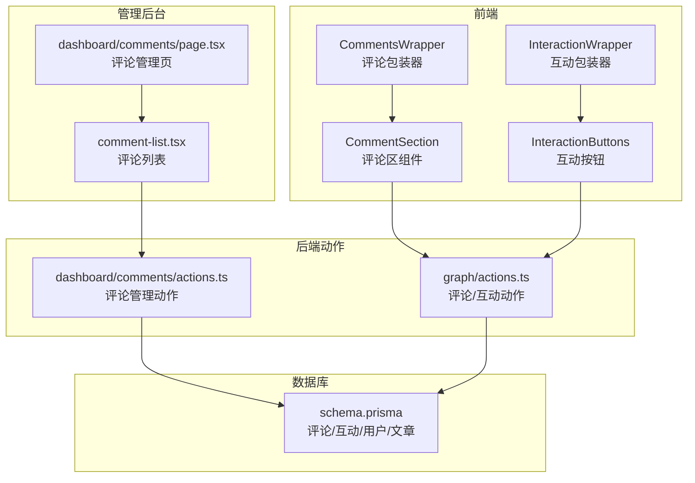
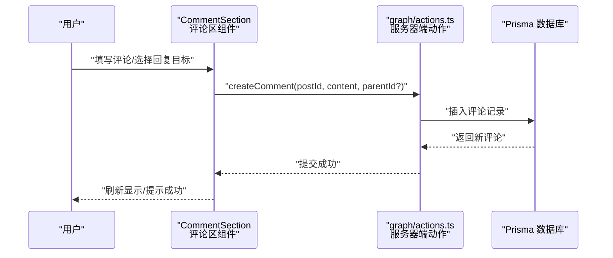
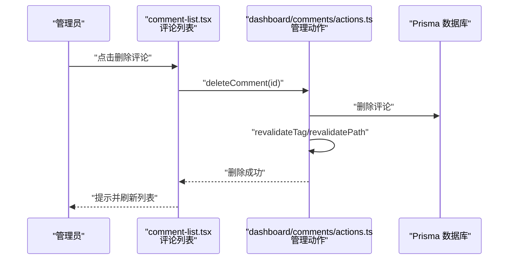
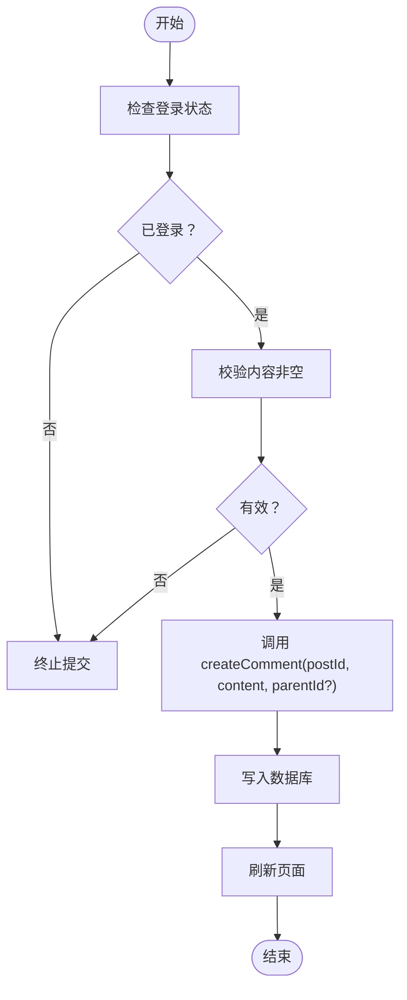
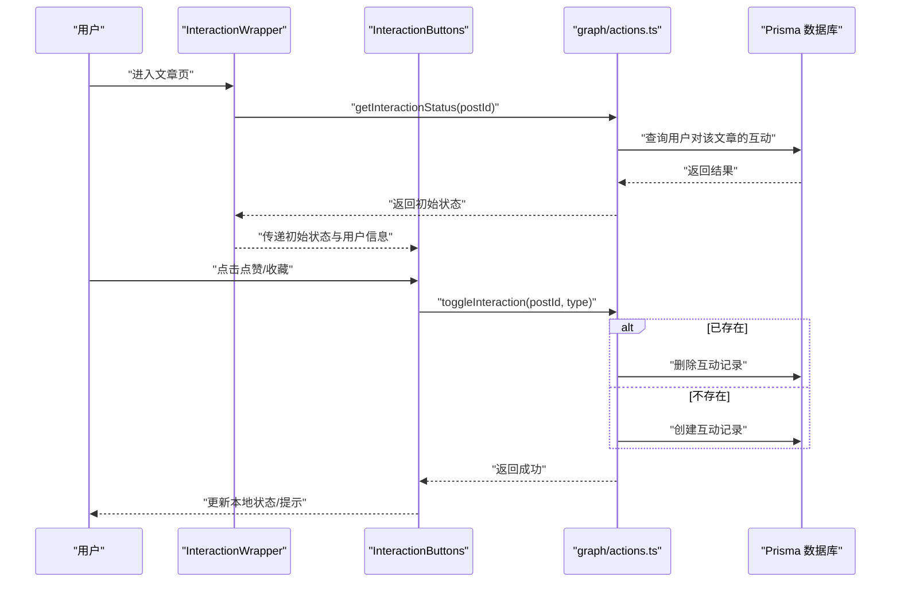
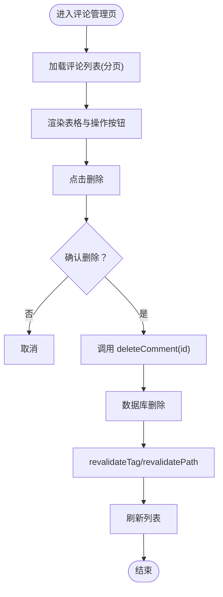
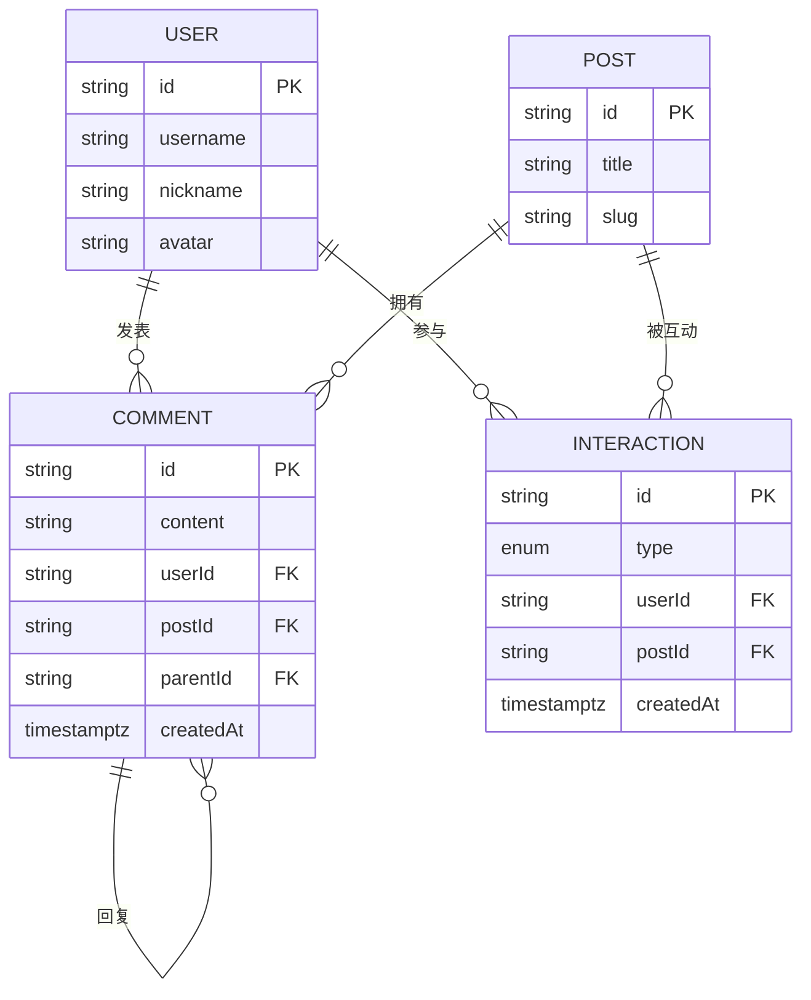
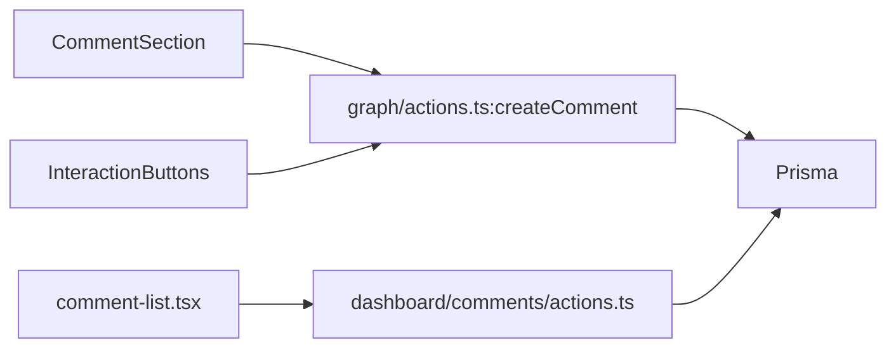

# 评论互动

<cite>
**本文引用的文件**
- [src/app/(site)/graph/actions.ts](file://src/app/(site)/graph/actions.ts)
- [src/components/blog/comment-section.tsx](file://src/components/blog/comment-section.tsx)
- [src/app/(site)/graph/[slug]/components/comments-wrapper.tsx](file://src/app/(site)/graph/[slug]/components/comments-wrapper.tsx)
- [src/app/dashboard/comments/actions.ts](file://src/app/dashboard/comments/actions.ts)
- [src/app/dashboard/comments/page.tsx](file://src/app/dashboard/comments/page.tsx)
- [src/app/dashboard/comments/components/comment-list.tsx](file://src/app/dashboard/comments/components/comment-list.tsx)
- [src/components/blog/interaction-buttons.tsx](file://src/components/blog/interaction-buttons.tsx)
- [src/app/(site)/graph/[slug]/components/interaction-wrapper.tsx](file://src/app/(site)/graph/[slug]/components/interaction-wrapper.tsx)
- [prisma/schema.prisma](file://prisma/schema.prisma)
- [src/lib/email-service.ts](file://src/lib/email-service.ts)
- [src/lib/mailer.ts](file://src/lib/mailer.ts)
- [src/app/api/send/notification/route.ts](file://src/app/api/send/notification/route.ts)
- [src/app/api/send/verification-code/route.ts](file://src/app/api/send/verification-code/route.ts)
- [src/app/api/upload/r2/upload/route.ts](file://src/app/api/upload/r2/upload/route.ts)
- [src/app/api/upload/r2/token/route.ts](file://src/app/api/upload/r2/token/route.ts)
- [src/app/api/upload/r2/url/route.ts](file://src/app/api/upload/r2/url/route.ts)
- [src/app/api/upload/token/route.ts](file://src/app/api/upload/token/route.ts)
- [src/app/api/test-mail/route.ts](file://src/app/api/test-mail/route.ts)
- [src/app/api/test-friend-email/route.ts](file://src/app/api/test-friend-email/route.ts)
- [src/app/api/test-db/route.ts](file://src/app/api/test-db/route.ts)
- [src/app/api/seed/route.ts](file://src/app/api/seed/route.ts)
- [src/app/api/analytics/track/route.ts](file://src/app/api/analytics/track/route.ts)
- [src/app/api/auth/me/route.ts](file://src/app/api/auth/me/route.ts)
- [src/app/api/logto/callback/route.ts](file://src/app/api/logto/callback/route.ts)
- [src/app/api/logto/sign-in/route.ts](file://src/app/api/logto/sign-in/route.ts)
- [src/app/api/logto/sign-out/route.ts](file://src/app/api/logto/sign-out/route.ts)
- [src/app/api/open/categories/route.ts](file://src/app/api/open/categories/route.ts)
- [src/app/api/open/posts/route.ts](file://src/app/api/open/posts/route.ts)
- [src/app/api/open/posts/[id]/route.ts](file://src/app/api/open/posts/[id]/route.ts)
- [src/app/api/open/posts/slug[slug]/route.ts](file://src/app/api/open/posts/slug[slug]/route.ts)
- [src/app/api/users/route.ts](file://src/app/api/users/route.ts)
- [src/app/api/users/[id]/route.ts](file://src/app/api/users/[id]/route.ts)
- [src/app/api/rcode/route.ts](file://src/app/api/rcode/route.ts)
- [src/app/api/send/route.ts](file://src/app/api/send/route.ts)
- [src/app/api/send-friend-approval/route.ts](file://src/app/api/send-friend-approval/route.ts)
- [src/app/dashboard/email-logs/components/test-email-dialog.tsx](file://src/app/dashboard/email-logs/components/test-email-dialog.tsx)
</cite>

## 目录
1. [简介](#简介)
2. [项目结构](#项目结构)
3. [核心组件](#核心组件)
4. [架构总览](#架构总览)
5. [详细组件分析](#详细组件分析)
6. [依赖分析](#依赖分析)
7. [性能考虑](#性能考虑)
8. [故障排查指南](#故障排查指南)
9. [结论](#结论)
10. [附录](#附录)

## 简介
本文件面向“评论互动系统”的功能与实现进行全面说明，覆盖评论提交表单、内容校验、存储机制、嵌套回复（父子关系与无限级回复）、显示层级控制、互动按钮（点赞、收藏）、通知体系（邮件、站内消息、实时推送）、以及评论管理后台（批量审核、用户封禁、内容删除）。同时给出用户体验优化策略与社区管理最佳实践建议。

## 项目结构
评论与互动相关的核心代码分布在以下区域：
- 前端展示层：评论区组件、互动按钮组件、页面包装器
- 后端动作层：评论与互动的服务器端逻辑、缓存与路径失效
- 数据模型层：Prisma Schema 中的评论与互动实体
- 管理后台：评论列表、分页、删除等管理能力
- 通知与上传：邮件服务、通用发送接口、文件上传接口

图表来源
- [src/app/(site)/graph/[slug]/components/comments-wrapper.tsx](file://src/app/(site)/graph/[slug]/components/comments-wrapper.tsx#L1-L18)
- [src/components/blog/comment-section.tsx:1-199](file://src/components/blog/comment-section.tsx#L1-L199)
- [src/app/(site)/graph/[slug]/components/interaction-wrapper.tsx](file://src/app/(site)/graph/[slug]/components/interaction-wrapper.tsx#L1-L19)
- [src/components/blog/interaction-buttons.tsx:1-51](file://src/components/blog/interaction-buttons.tsx#L1-L51)
- [src/app/(site)/graph/actions.ts](file://src/app/(site)/graph/actions.ts#L34-L123)
- [src/app/dashboard/comments/actions.ts:1-56](file://src/app/dashboard/comments/actions.ts#L1-L56)
- [prisma/schema.prisma:143-178](file://prisma/schema.prisma#L143-L178)
- [src/app/dashboard/comments/page.tsx:1-27](file://src/app/dashboard/comments/page.tsx#L1-L27)
- [src/app/dashboard/comments/components/comment-list.tsx:45-87](file://src/app/dashboard/comments/components/comment-list.tsx#L45-L87)

章节来源
- [src/app/(site)/graph/[slug]/components/comments-wrapper.tsx](file://src/app/(site)/graph/[slug]/components/comments-wrapper.tsx#L1-L18)
- [src/components/blog/comment-section.tsx:1-199](file://src/components/blog/comment-section.tsx#L1-L199)
- [src/app/(site)/graph/[slug]/components/interaction-wrapper.tsx](file://src/app/(site)/graph/[slug]/components/interaction-wrapper.tsx#L1-L19)
- [src/components/blog/interaction-buttons.tsx:1-51](file://src/components/blog/interaction-buttons.tsx#L1-L51)
- [src/app/(site)/graph/actions.ts](file://src/app/(site)/graph/actions.ts#L34-L123)
- [src/app/dashboard/comments/actions.ts:1-56](file://src/app/dashboard/comments/actions.ts#L1-L56)
- [prisma/schema.prisma:143-178](file://prisma/schema.prisma#L143-L178)
- [src/app/dashboard/comments/page.tsx:1-27](file://src/app/dashboard/comments/page.tsx#L1-L27)
- [src/app/dashboard/comments/components/comment-list.tsx:45-87](file://src/app/dashboard/comments/components/comment-list.tsx#L45-L87)

## 核心组件
- 评论提交与展示
  - 评论包装器负责拉取当前文章的评论数据，并注入到评论区组件
  - 评论区组件提供输入框、提交逻辑、回复模式切换、以及评论树渲染
  - 提交时调用服务器端动作创建评论，支持回复到父评论
- 互动按钮
  - 包装器根据当前登录状态返回初始互动状态
  - 互动按钮组件负责点赞/收藏的点击切换与错误处理
  - 服务器端动作根据是否存在历史互动记录进行创建或删除
- 数据模型
  - 评论模型包含自引用的父子关系字段，支持无限级回复
  - 互动模型记录用户对文章的互动类型（如 LIKE/FAVORITE）
- 管理后台
  - 分页加载评论列表，支持删除操作
  - 删除后触发缓存与路径失效，确保界面刷新

章节来源
- [src/app/(site)/graph/[slug]/components/comments-wrapper.tsx](file://src/app/(site)/graph/[slug]/components/comments-wrapper.tsx#L1-L18)
- [src/components/blog/comment-section.tsx:1-199](file://src/components/blog/comment-section.tsx#L1-L199)
- [src/app/(site)/graph/[slug]/components/interaction-wrapper.tsx](file://src/app/(site)/graph/[slug]/components/interaction-wrapper.tsx#L1-L19)
- [src/components/blog/interaction-buttons.tsx:1-51](file://src/components/blog/interaction-buttons.tsx#L1-L51)
- [src/app/(site)/graph/actions.ts](file://src/app/(site)/graph/actions.ts#L34-L123)
- [prisma/schema.prisma:143-178](file://prisma/schema.prisma#L143-L178)
- [src/app/dashboard/comments/actions.ts:1-56](file://src/app/dashboard/comments/actions.ts#L1-L56)

## 架构总览
下图展示了从前端交互到服务器端动作再到数据库的完整流程，以及管理后台的评论删除流程。

图表来源
- [src/components/blog/comment-section.tsx:48-62](file://src/components/blog/comment-section.tsx#L48-L62)
- [src/app/(site)/graph/actions.ts](file://src/app/(site)/graph/actions.ts#L34-L53)
- [prisma/schema.prisma:143-152](file://prisma/schema.prisma#L143-L152)

图表来源
- [src/app/dashboard/comments/components/comment-list.tsx:53-62](file://src/app/dashboard/comments/components/comment-list.tsx#L53-L62)
- [src/app/dashboard/comments/actions.ts:48-56](file://src/app/dashboard/comments/actions.ts#L48-L56)
- [prisma/schema.prisma:143-152](file://prisma/schema.prisma#L143-L152)

## 详细组件分析

### 评论提交与嵌套回复
- 表单与校验
  - 前端在提交前检查内容非空与登录状态；提交成功后刷新页面以同步最新评论树
  - 服务器端动作接收 postId、content、可选的 parentId，用于建立父子关系
- 存储机制
  - 评论模型具备自引用关系，支持多级回复；查询时按创建时间倒序返回
- 显示层级控制
  - 组件内部维护评论数组，渲染时为每个评论生成回复容器，使用缩进与装饰线表示层级
  - 支持回复箭头图标与用户头像信息展示

图表来源
- [src/components/blog/comment-section.tsx:48-62](file://src/components/blog/comment-section.tsx#L48-L62)
- [src/app/(site)/graph/actions.ts](file://src/app/(site)/graph/actions.ts#L34-L53)
- [prisma/schema.prisma:143-152](file://prisma/schema.prisma#L143-L152)

章节来源
- [src/components/blog/comment-section.tsx:1-199](file://src/components/blog/comment-section.tsx#L1-L199)
- [src/app/(site)/graph/actions.ts](file://src/app/(site)/graph/actions.ts#L34-L53)
- [prisma/schema.prisma:143-152](file://prisma/schema.prisma#L143-L152)

### 互动按钮（点赞/收藏）
- 状态管理
  - 包装器获取当前用户的互动状态并传入按钮组件
  - 按钮组件本地切换状态并在调用服务器端动作前后设置加载态
- 服务器端逻辑
  - 若存在历史互动则删除，否则创建新的互动记录
  - 成功后触发路径失效以更新页面状态

图表来源
- [src/app/(site)/graph/[slug]/components/interaction-wrapper.tsx](file://src/app/(site)/graph/[slug]/components/interaction-wrapper.tsx#L1-L19)
- [src/components/blog/interaction-buttons.tsx:26-49](file://src/components/blog/interaction-buttons.tsx#L26-L49)
- [src/app/(site)/graph/actions.ts](file://src/app/(site)/graph/actions.ts#L55-L87)
- [prisma/schema.prisma:154-167](file://prisma/schema.prisma#L154-L167)

章节来源
- [src/app/(site)/graph/[slug]/components/interaction-wrapper.tsx](file://src/app/(site)/graph/[slug]/components/interaction-wrapper.tsx#L1-L19)
- [src/components/blog/interaction-buttons.tsx:1-51](file://src/components/blog/interaction-buttons.tsx#L1-L51)
- [src/app/(site)/graph/actions.ts](file://src/app/(site)/graph/actions.ts#L55-L123)
- [prisma/schema.prisma:154-167](file://prisma/schema.prisma#L154-L167)

### 评论管理后台
- 列表与分页
  - 页面组件从 URL 查询参数解析页码，包装器将数据传递给列表组件
  - 列表组件渲染用户、评论内容、所属文章、时间与操作列
- 删除操作
  - 点击删除弹窗确认后调用服务器端动作删除评论
  - 动作函数删除记录后触发标签与路径缓存失效，确保界面刷新

图表来源
- [src/app/dashboard/comments/page.tsx:1-27](file://src/app/dashboard/comments/page.tsx#L1-L27)
- [src/app/dashboard/comments/components/comment-list.tsx:45-87](file://src/app/dashboard/comments/components/comment-list.tsx#L45-L87)
- [src/app/dashboard/comments/actions.ts:48-56](file://src/app/dashboard/comments/actions.ts#L48-L56)

章节来源
- [src/app/dashboard/comments/page.tsx:1-27](file://src/app/dashboard/comments/page.tsx#L1-L27)
- [src/app/dashboard/comments/components/comment-list.tsx:45-87](file://src/app/dashboard/comments/components/comment-list.tsx#L45-L87)
- [src/app/dashboard/comments/actions.ts:1-56](file://src/app/dashboard/comments/actions.ts#L1-L56)

### 数据模型与关系
- 评论模型
  - 自引用关系：parent 与 replies 字段形成父子树
  - 外键关联用户与文章，支持按用户、文章、父评论索引查询
- 互动模型
  - 唯一键约束：用户+文章+类型唯一，避免重复互动
  - 外键关联用户与文章，便于统计与查询

图表来源
- [prisma/schema.prisma:143-178](file://prisma/schema.prisma#L143-L178)

章节来源
- [prisma/schema.prisma:143-178](file://prisma/schema.prisma#L143-L178)

## 依赖分析
- 前端组件依赖
  - 评论区组件依赖服务器端动作进行提交与刷新
  - 互动按钮组件依赖包装器提供的初始状态与服务器端动作进行切换
- 服务器端动作依赖
  - 使用 Prisma 进行读写操作
  - 使用 Next.js 的缓存与路径失效机制保证数据一致性
- 数据库依赖
  - 评论与互动模型通过外键与索引建立高效查询路径

图表来源
- [src/components/blog/comment-section.tsx:7-52](file://src/components/blog/comment-section.tsx#L7-L52)
- [src/components/blog/interaction-buttons.tsx:5-41](file://src/components/blog/interaction-buttons.tsx#L5-L41)
- [src/app/(site)/graph/actions.ts](file://src/app/(site)/graph/actions.ts#L34-L87)
- [src/app/dashboard/comments/actions.ts:1-56](file://src/app/dashboard/comments/actions.ts#L1-L56)
- [prisma/schema.prisma:143-178](file://prisma/schema.prisma#L143-L178)

章节来源
- [src/components/blog/comment-section.tsx:1-199](file://src/components/blog/comment-section.tsx#L1-L199)
- [src/components/blog/interaction-buttons.tsx:1-51](file://src/components/blog/interaction-buttons.tsx#L1-L51)
- [src/app/(site)/graph/actions.ts](file://src/app/(site)/graph/actions.ts#L34-L123)
- [src/app/dashboard/comments/actions.ts:1-56](file://src/app/dashboard/comments/actions.ts#L1-L56)
- [prisma/schema.prisma:143-178](file://prisma/schema.prisma#L143-L178)

## 性能考虑
- 缓存与失效
  - 管理后台评论列表使用稳定缓存与标签失效，减少数据库压力
  - 互动与评论提交后触发路径失效，确保客户端尽快看到最新状态
- 查询优化
  - 评论模型在用户、文章、父评论上建立索引，提升查询效率
  - 互动模型在用户与文章上建立索引，支持快速判断用户互动状态
- 渲染优化
  - 评论区组件采用局部状态与条件渲染，避免不必要的重绘
  - 列表组件在空数据时使用占位渲染，提升首屏体验

章节来源
- [src/app/dashboard/comments/actions.ts:8-42](file://src/app/dashboard/comments/actions.ts#L8-L42)
- [src/app/(site)/graph/actions.ts](file://src/app/(site)/graph/actions.ts#L55-L87)
- [prisma/schema.prisma:143-178](file://prisma/schema.prisma#L143-L178)

## 故障排查指南
- 评论提交失败
  - 检查登录状态与内容是否为空
  - 查看服务器端动作返回的错误信息，确认数据库写入是否成功
  - 观察页面是否正确刷新
- 互动按钮异常
  - 确认用户已登录且未处于加载状态
  - 检查服务器端动作是否抛出未授权错误
  - 验证路径失效是否生效
- 管理后台删除失败
  - 确认删除弹窗确认流程
  - 检查服务器端动作是否抛错
  - 验证缓存标签与路径失效是否触发

章节来源
- [src/components/blog/comment-section.tsx:48-62](file://src/components/blog/comment-section.tsx#L48-L62)
- [src/components/blog/interaction-buttons.tsx:26-49](file://src/components/blog/interaction-buttons.tsx#L26-L49)
- [src/app/(site)/graph/actions.ts](file://src/app/(site)/graph/actions.ts#L55-L87)
- [src/app/dashboard/comments/components/comment-list.tsx:53-62](file://src/app/dashboard/comments/components/comment-list.tsx#L53-L62)
- [src/app/dashboard/comments/actions.ts:48-56](file://src/app/dashboard/comments/actions.ts#L48-L56)

## 结论
该评论互动系统以清晰的前后端职责划分、完善的数据库模型与缓存策略为基础，实现了从评论提交、嵌套回复、互动记录到管理后台删除的全链路功能。通过索引优化与路径失效机制，系统在可用性与性能之间取得平衡。后续可在内容审核、通知体系与社区治理方面进一步增强。

## 附录
- 通知与邮件
  - 邮件服务与通用发送接口位于 API 层，可用于扩展评论相关的邮件通知
  - 测试邮件接口可用于验证邮件通道配置
- 文件上传
  - R2 上传与令牌接口可用于评论中图片/附件的上传场景

章节来源
- [src/lib/email-service.ts](file://src/lib/email-service.ts)
- [src/lib/mailer.ts](file://src/lib/mailer.ts)
- [src/app/api/send/notification/route.ts](file://src/app/api/send/notification/route.ts)
- [src/app/api/send/verification-code/route.ts](file://src/app/api/send/verification-code/route.ts)
- [src/app/api/upload/r2/upload/route.ts](file://src/app/api/upload/r2/upload/route.ts)
- [src/app/api/upload/r2/token/route.ts](file://src/app/api/upload/r2/token/route.ts)
- [src/app/api/upload/r2/url/route.ts](file://src/app/api/upload/r2/url/route.ts)
- [src/app/api/upload/token/route.ts](file://src/app/api/upload/token/route.ts)
- [src/app/api/test-mail/route.ts](file://src/app/api/test-mail/route.ts)
- [src/app/api/test-friend-email/route.ts](file://src/app/api/test-friend-email/route.ts)
- [src/app/api/test-db/route.ts](file://src/app/api/test-db/route.ts)
- [src/app/api/seed/route.ts](file://src/app/api/seed/route.ts)
- [src/app/api/analytics/track/route.ts](file://src/app/api/analytics/track/route.ts)
- [src/app/api/auth/me/route.ts](file://src/app/api/auth/me/route.ts)
- [src/app/api/logto/callback/route.ts](file://src/app/api/logto/callback/route.ts)
- [src/app/api/logto/sign-in/route.ts](file://src/app/api/logto/sign-in/route.ts)
- [src/app/api/logto/sign-out/route.ts](file://src/app/api/logto/sign-out/route.ts)
- [src/app/api/open/categories/route.ts](file://src/app/api/open/categories/route.ts)
- [src/app/api/open/posts/route.ts](file://src/app/api/open/posts/route.ts)
- [src/app/api/open/posts/[id]/route.ts](file://src/app/api/open/posts/[id]/route.ts)
- [src/app/api/open/posts/slug[slug]/route.ts](file://src/app/api/open/posts/slug[slug]/route.ts)
- [src/app/api/users/route.ts](file://src/app/api/users/route.ts)
- [src/app/api/users/[id]/route.ts](file://src/app/api/users/[id]/route.ts)
- [src/app/api/rcode/route.ts](file://src/app/api/rcode/route.ts)
- [src/app/api/send/route.ts](file://src/app/api/send/route.ts)
- [src/app/api/send-friend-approval/route.ts](file://src/app/api/send-friend-approval/route.ts)
- [src/app/dashboard/email-logs/components/test-email-dialog.tsx:122-153](file://src/app/dashboard/email-logs/components/test-email-dialog.tsx#L122-L153)