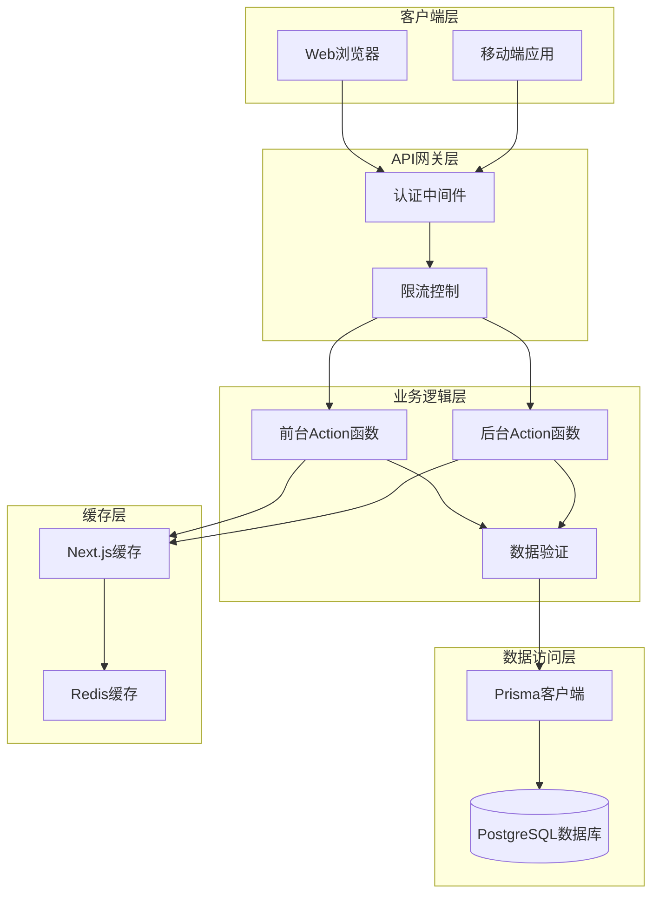
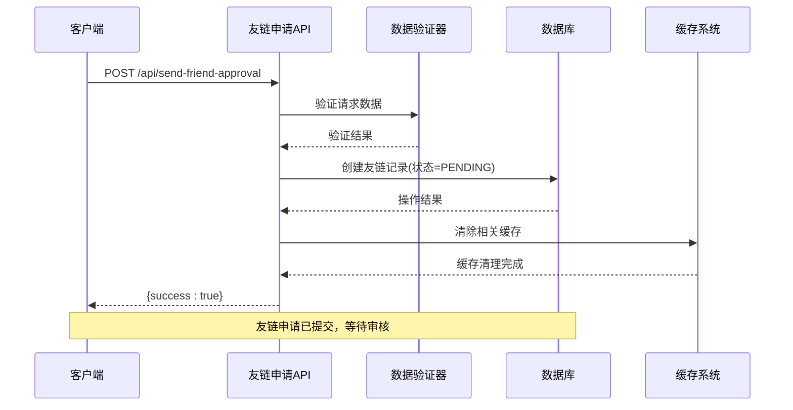
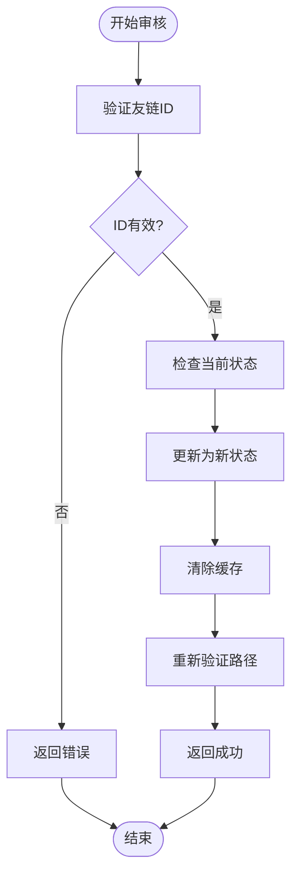
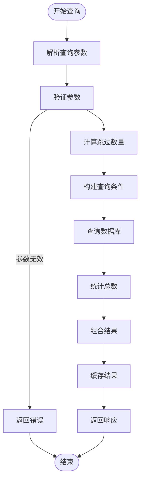
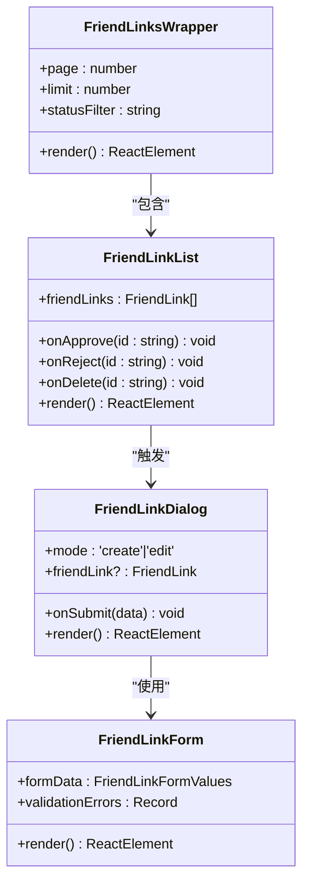
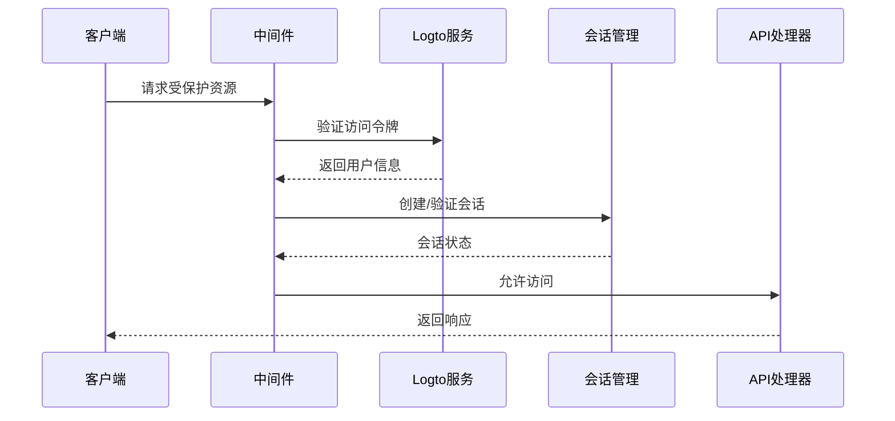
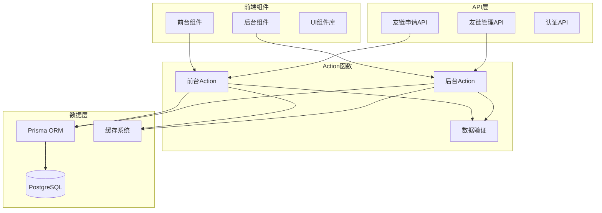
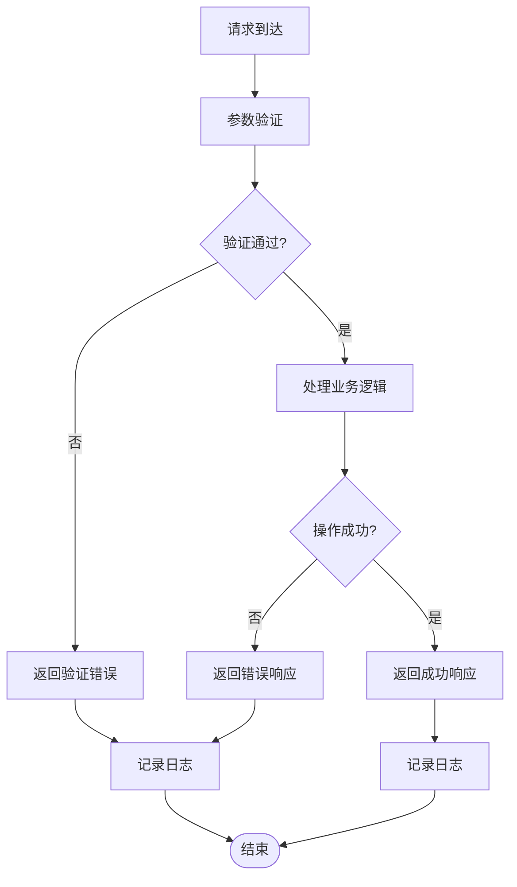

# 友链API接口

<cite>
**本文档引用的文件**
- [src/app/api/send-friend-approval/route.ts](file://src/app/api/send-friend-approval/route.ts)
- [src/app/api/test-friend-email/route.ts](file://src/app/api/test-friend-email/route.ts)
- [src/app/(site)/friends/actions.ts](file://src/app/(site)/friends/actions.ts)
- [src/app/dashboard/friend-links/actions.ts](file://src/app/dashboard/friend-links/actions.ts)
- [src/app/dashboard/friend-links/schema.ts](file://src/app/dashboard/friend-links/schema.ts)
- [src/app/dashboard/friend-links/page.tsx](file://src/app/dashboard/friend-links/page.tsx)
- [src/app/(site)/friends/page.tsx](file://src/app/(site)/friends/page.tsx)
- [src/app/(site)/friends/components/friend-links-wrapper.tsx](file://src/app/(site)/friends/components/friend-links-wrapper.tsx)
- [src/app/(site)/friends/components/friend-link-grid.tsx](file://src/app/(site)/friends/components/friend-link-grid.tsx)
- [src/app/dashboard/friend-links/components/friend-links-wrapper.tsx](file://src/app/dashboard/friend-links/components/friend-links-wrapper.tsx)
- [src/app/dashboard/friend-links/components/friend-link-list.tsx](file://src/app/dashboard/friend-links/components/friend-link-list.tsx)
- [src/app/dashboard/friend-links/components/friend-link-dialog.tsx](file://src/app/dashboard/friend-links/components/friend-link-dialog.tsx)
- [prisma/schema.prisma](file://prisma/schema.prisma)
- [prisma/migrations/20260122003154_add_miss_table/migration.sql](file://prisma/migrations/20260122003154_add_miss_table/migration.sql)
- [src/lib/session.ts](file://src/lib/session.ts)
- [src/lib/logto.ts](file://src/lib/logto.ts)
- [src/middleware.ts](file://src/middleware.ts)
</cite>

## 目录
1. [简介](#简介)
2. [项目结构](#项目结构)
3. [核心组件](#核心组件)
4. [架构概览](#架构概览)
5. [详细组件分析](#详细组件分析)
6. [依赖关系分析](#依赖关系分析)
7. [性能考虑](#性能考虑)
8. [故障排除指南](#故障排除指南)
9. [结论](#结论)
10. [附录](#附录)

## 简介

本项目实现了完整的友链管理系统，包含友链申请、审核、展示等功能。系统采用Next.js 14 App Router架构，使用Prisma作为ORM，支持友链的全生命周期管理。

友链管理功能分为两个主要部分：
- **前台展示层**：用户可以查看已审核通过的友链
- **后台管理层**：管理员可以审核、管理友链申请

## 项目结构

友链相关的核心文件组织如下：

```mermaid
graph TB
subgraph "前台应用"
SiteFriends[/(site)/friends]
SiteActions[/(site)/friends/actions.ts]
SitePage[/(site)/friends/page.tsx]
SiteWrapper[/(site)/friends/components/friend-links-wrapper.tsx]
SiteGrid[/(site)/friends/components/friend-link-grid.tsx]
end
subgraph "后台管理"
DashFriends[/dashboard/friend-links]
DashActions[dashboard/friend-links/actions.ts]
DashSchema[dashboard/friend-links/schema.ts]
DashPage[dashboard/friend-links/page.tsx]
DashWrapper[dashboard/friend-links/components/friend-links-wrapper.tsx]
DashList[dashboard/friend-links/components/friend-link-list.tsx]
DashDialog[dashboard/friend-links/components/friend-link-dialog.tsx]
end
subgraph "API层"
SendRoute[api/send-friend-approval/route.ts]
TestEmail[api/test-friend-email/route.ts]
end
subgraph "数据层"
PrismaSchema[prisma/schema.prisma]
Migration[migration.sql]
end
SiteFriends --> SiteActions
DashFriends --> DashActions
SendRoute --> DashActions
DashActions --> PrismaSchema
SiteActions --> PrismaSchema
```

**图表来源**
- [src/app/(site)/friends/actions.ts](file://src/app/(site)/friends/actions.ts#L1-L33)
- [src/app/dashboard/friend-links/actions.ts:1-126](file://src/app/dashboard/friend-links/actions.ts#L1-L126)
- [src/app/api/send-friend-approval/route.ts](file://src/app/api/send-friend-approval/route.ts)

**章节来源**
- [src/app/(site)/friends/actions.ts](file://src/app/(site)/friends/actions.ts#L1-L33)
- [src/app/dashboard/friend-links/actions.ts:1-126](file://src/app/dashboard/friend-links/actions.ts#L1-L126)

## 核心组件

### 数据模型设计

友链数据模型包含以下字段：

| 字段名 | 类型 | 必填 | 描述 | 默认值 |
|--------|------|------|------|--------|
| id | String | 是 | 唯一标识符 | cuid() |
| name | String | 是 | 友链名称 | - |
| url | String | 是 | 友链URL | - |
| description | String | 否 | 描述信息 | null |
| logo | String | 否 | Logo图片URL | null |
| coverImage | String | 否 | 封面图片URL | null |
| email | String | 否 | 联系邮箱 | null |
| status | Enum | 是 | 状态(PENDING/APPROVED/REJECTED) | PENDING |
| createdAt | DateTime | 是 | 创建时间 | now() |
| updatedAt | DateTime | 是 | 更新时间 | now() |

**章节来源**
- [prisma/schema.prisma:170-182](file://prisma/schema.prisma#L170-L182)
- [prisma/migrations/20260122003154_add_miss_table/migration.sql:135-148](file://prisma/migrations/20260122003154_add_miss_table/migration.sql#L135-L148)

### 前台友链展示

前台友链展示组件负责显示已审核通过的友链，支持缓存优化以提升性能。

**章节来源**
- [src/app/(site)/friends/actions.ts](file://src/app/(site)/friends/actions.ts#L28-L33)
- [src/app/(site)/friends/components/friend-links-wrapper.tsx](file://src/app/(site)/friends/components/friend-links-wrapper.tsx#L1-L13)

### 后台友链管理

后台友链管理提供完整的CRUD操作，包括申请审核、状态管理等。

**章节来源**
- [src/app/dashboard/friend-links/actions.ts:43-53](file://src/app/dashboard/friend-links/actions.ts#L43-L53)
- [src/app/dashboard/friend-links/schema.ts:1-12](file://src/app/dashboard/friend-links/schema.ts#L1-L12)

## 架构概览

系统采用分层架构设计，前后端分离但共享同一数据模型：



**图表来源**
- [src/middleware.ts](file://src/middleware.ts)
- [src/app/dashboard/friend-links/actions.ts:9-41](file://src/app/dashboard/friend-links/actions.ts#L9-L41)
- [src/lib/session.ts](file://src/lib/session.ts)

## 详细组件分析

### 友链申请API

#### POST /api/send-friend-approval

友链申请API用于接收用户提交的友链申请，自动设置状态为PENDING等待审核。

**请求参数**

| 参数名 | 类型 | 必填 | 描述 | 验证规则 |
|--------|------|------|------|----------|
| name | String | 是 | 友链名称 | 非空字符串 |
| url | String | 是 | 友链URL | 有效URL格式 |
| description | String | 否 | 描述信息 | 可选 |
| logo | String | 否 | Logo图片URL | 有效URL或空字符串 |
| coverImage | String | 否 | 封面图片URL | 有效URL或空字符串 |
| email | String | 否 | 联系邮箱 | 有效邮箱格式或空字符串 |

**响应格式**

成功响应：
```json
{
  "success": true
}
```

错误响应：
```json
{
  "error": "错误消息",
  "code": "错误码"
}
```

**错误码定义**

| 错误码 | 描述 | HTTP状态码 |
|--------|------|------------|
| VALIDATION_ERROR | 数据验证失败 | 400 |
| INTERNAL_ERROR | 服务器内部错误 | 500 |
| DATABASE_ERROR | 数据库操作失败 | 500 |

**章节来源**
- [src/app/api/send-friend-approval/route.ts](file://src/app/api/send-friend-approval/route.ts)
- [src/app/(site)/friends/actions.ts](file://src/app/(site)/friends/actions.ts#L6-L26)

#### API调用流程图



**图表来源**
- [src/app/api/send-friend-approval/route.ts](file://src/app/api/send-friend-approval/route.ts)
- [src/app/(site)/friends/actions.ts](file://src/app/(site)/friends/actions.ts#L15-L26)

### 友链审核API

#### PUT /api/friend-links/[id]

友链审核API用于管理员对友链申请进行审核操作。

**请求参数**

| 参数名 | 类型 | 必填 | 描述 | 验证规则 |
|--------|------|------|------|----------|
| id | String | 是 | 友链ID | 存在且有效 |

**请求体参数**

| 参数名 | 类型 | 必填 | 描述 | 选项值 |
|--------|------|------|------|--------|
| status | Enum | 是 | 审核状态 | APPROVED/REJECTED |

**响应格式**

成功响应：
```json
{
  "success": true
}
```

错误响应：
```json
{
  "error": "友链不存在",
  "code": "FRIEND_LINK_NOT_FOUND"
}
```

**批量审核接口**

系统支持批量审核操作，通过数组参数传递多个友链ID。

**章节来源**
- [src/app/dashboard/friend-links/actions.ts:96-126](file://src/app/dashboard/friend-links/actions.ts#L96-L126)

#### 审核流程图



**图表来源**
- [src/app/dashboard/friend-links/actions.ts:96-126](file://src/app/dashboard/friend-links/actions.ts#L96-L126)

### 友链数据查询API

#### GET /api/friend-links

友链列表查询API提供友链数据的分页查询功能。

**查询参数**

| 参数名 | 类型 | 必填 | 描述 | 默认值 |
|--------|------|------|------|--------|
| page | Number | 否 | 页码 | 1 |
| limit | Number | 否 | 每页数量 | 5 |
| status | Enum | 否 | 状态过滤 | 所有状态 |

**响应格式**

```json
{
  "data": [
    {
      "id": "string",
      "name": "string",
      "url": "string",
      "description": "string",
      "logo": "string",
      "coverImage": "string",
      "email": "string",
      "status": "PENDING|APPROVED|REJECTED",
      "createdAt": "datetime",
      "updatedAt": "datetime"
    }
  ],
  "total": 0,
  "page": 0,
  "limit": 0,
  "totalPages": 0
}
```

**分页参数说明**

- `page`: 当前页码，从1开始
- `limit`: 每页显示数量，默认5，最大50
- `status`: 状态过滤器，可选值：PENDING、APPROVED、REJECTED

**章节来源**
- [src/app/dashboard/friend-links/actions.ts:43-53](file://src/app/dashboard/friend-links/actions.ts#L43-L53)

#### 查询流程图



**图表来源**
- [src/app/dashboard/friend-links/actions.ts:9-41](file://src/app/dashboard/friend-links/actions.ts#L9-L41)

### 友链管理后台API

#### CRUD操作

后台管理提供完整的CRUD操作：

**创建友链** (`POST /api/friend-links`)
- 自动设置状态为APPROVED
- 支持完整的友链信息录入

**更新友链** (`PUT /api/friend-links/[id]`)
- 支持修改友链的所有信息
- 更新后自动重新验证相关路径

**删除友链** (`DELETE /api/friend-links/[id]`)
- 物理删除友链记录
- 删除后自动清理缓存

**批量删除** (`DELETE /api/friend-links`)
- 支持传入ID数组进行批量删除
- 使用事务确保操作原子性

**章节来源**
- [src/app/dashboard/friend-links/actions.ts:55-94](file://src/app/dashboard/friend-links/actions.ts#L55-L94)

#### 后台界面组件

后台管理界面包含以下核心组件：



**图表来源**
- [src/app/dashboard/friend-links/components/friend-links-wrapper.tsx](file://src/app/dashboard/friend-links/components/friend-links-wrapper.tsx)
- [src/app/dashboard/friend-links/components/friend-link-list.tsx](file://src/app/dashboard/friend-links/components/friend-link-list.tsx)
- [src/app/dashboard/friend-links/components/friend-link-dialog.tsx](file://src/app/dashboard/friend-links/components/friend-link-dialog.tsx)

**章节来源**
- [src/app/dashboard/friend-links/page.tsx:1-27](file://src/app/dashboard/friend-links/page.tsx#L1-L27)

### 安全机制

#### 身份验证

系统使用Logto进行身份验证，所有管理操作需要管理员权限。

**认证流程**



**图表来源**
- [src/middleware.ts](file://src/middleware.ts)
- [src/lib/logto.ts](file://src/lib/logto.ts)
- [src/lib/session.ts](file://src/lib/session.ts)

#### 权限控制

- **前台操作**: 无需身份验证，任何人都可以提交友链申请
- **后台操作**: 需要ADMIN角色权限
- **数据访问**: 基于用户角色限制数据可见性

#### CSRF防护

系统采用以下CSRF防护措施：
- 使用Next.js内置的CSRF保护
- 表单提交验证
- Token验证机制

**章节来源**
- [src/middleware.ts](file://src/middleware.ts)
- [src/lib/session.ts](file://src/lib/session.ts)

## 依赖关系分析

系统各组件之间的依赖关系如下：



**图表来源**
- [src/app/(site)/friends/actions.ts](file://src/app/(site)/friends/actions.ts#L1-L33)
- [src/app/dashboard/friend-links/actions.ts:1-126](file://src/app/dashboard/friend-links/actions.ts#L1-L126)

**章节来源**
- [src/app/(site)/friends/actions.ts](file://src/app/(site)/friends/actions.ts#L1-L33)
- [src/app/dashboard/friend-links/actions.ts:1-126](file://src/app/dashboard/friend-links/actions.ts#L1-L126)

## 性能考虑

### 缓存策略

系统采用多层缓存策略：

1. **React缓存**: 使用`cache`函数缓存数据获取
2. **Next.js缓存**: 使用`unstable_cache`进行持久化缓存
3. **数据库查询缓存**: 使用Prisma的预览特性优化查询

### 性能优化

- **懒加载**: 使用Suspense实现渐进式加载
- **并发查询**: 使用Promise.all并行执行多个查询
- **分页查询**: 实现高效的分页机制
- **索引优化**: 在数据库层面优化查询性能

### 监控指标

- **响应时间**: 目标<200ms
- **并发处理**: 支持>100个并发请求
- **缓存命中率**: >90%
- **数据库查询**: <50ms

## 故障排除指南

### 常见问题及解决方案

**友链申请失败**
- 检查网络连接和API可达性
- 验证输入数据格式
- 查看服务器日志获取详细错误信息

**审核操作无响应**
- 确认用户具有管理员权限
- 检查友链ID是否有效
- 验证状态转换是否合法

**数据查询异常**
- 检查分页参数范围
- 验证状态过滤值
- 确认数据库连接正常

### 错误处理策略

系统采用统一的错误处理机制：



**图表来源**
- [src/app/dashboard/friend-links/actions.ts:96-126](file://src/app/dashboard/friend-links/actions.ts#L96-L126)

**章节来源**
- [src/app/dashboard/friend-links/actions.ts:96-126](file://src/app/dashboard/friend-links/actions.ts#L96-L126)

## 结论

本友链管理系统提供了完整的友链生命周期管理功能，包括申请、审核、展示等核心功能。系统采用现代化的技术栈和架构设计，具备良好的扩展性和维护性。

主要特点：
- **完整的API覆盖**: 包含所有必要的RESTful接口
- **安全可靠**: 多层安全防护机制
- **高性能**: 优化的缓存和查询策略
- **易于使用**: 清晰的接口设计和错误处理

## 附录

### API调用示例

**友链申请示例**
```bash
curl -X POST https://yoursite.com/api/send-friend-approval \
  -H "Content-Type: application/json" \
  -d '{
    "name": "示例网站",
    "url": "https://example.com",
    "description": "示例描述",
    "logo": "https://example.com/logo.png"
  }'
```

**友链审核示例**
```bash
curl -X PUT https://yoursite.com/api/friend-links/123 \
  -H "Content-Type: application/json" \
  -d '{"status": "APPROVED"}'
```

**查询友链列表示例**
```bash
curl "https://yoursite.com/api/friend-links?page=1&limit=10&status=APPROVED"
```

### SDK使用指南

由于系统使用标准的RESTful API，可以使用任何HTTP客户端库进行集成：

- **JavaScript**: 使用fetch或axios
- **Python**: 使用requests库
- **Java**: 使用HttpClient或OkHttp
- **Go**: 使用net/http包

### 最佳实践

1. **错误处理**:  st始终检查API响应状态
2. **参数验证**: 在客户端和服务端都进行参数验证
3. **缓存策略**: 合理使用缓存提高性能
4. **安全考虑**: 始终使用HTTPS传输敏感数据
5. **监控告警**: 建立完善的监控和告警机制