# 友链审核管理系统技术文档

<cite>
**本文档引用的文件**
- [src/app/(site)/friends/actions.ts](file://src/app/(site)/friends/actions.ts)
- [src/app/(site)/friends/components/friend-link-fab.tsx](file://src/app/(site)/friends/components/friend-link-fab.tsx)
- [src/app/dashboard/friend-links/actions.ts](file://src/app/dashboard/friend-links/actions.ts)
- [src/app/dashboard/friend-links/schema.ts](file://src/app/dashboard/friend-links/schema.ts)
- [src/app/dashboard/friend-links/components/friend-link-list.tsx](file://src/app/dashboard/friend-links/components/friend-link-list.tsx)
- [src/app/dashboard/friend-links/components/friend-links-wrapper.tsx](file://src/app/dashboard/friend-links/components/friend-links-wrapper.tsx)
- [src/app/dashboard/friend-links/page.tsx](file://src/app/dashboard/friend-links/page.tsx)
- [src/app/dashboard/friend-links/components/contact-template.tsx](file://src/app/dashboard/friend-links/components/contact-template.tsx)
- [src/app/api/send-friend-approval/route.ts](file://src/app/api/send-friend-approval/route.ts)
- [prisma/schema.prisma](file://prisma/schema.prisma)
</cite>

## 目录
1. [项目概述](#项目概述)
2. [系统架构](#系统架构)
3. [核心组件](#核心组件)
4. [审核状态管理](#审核状态管理)
5. [批量审核功能](#批量审核功能)
6. [审核标准配置](#审核标准配置)
7. [管理后台界面设计](#管理后台界面设计)
8. [审核决策处理逻辑](#审核决策处理逻辑)
9. [完整审核流程示例](#完整审核流程示例)
10. [性能优化考虑](#性能优化考虑)
11. [故障排除指南](#故障排除指南)
12. [总结](#总结)

## 项目概述

友链审核管理系统是一个基于 Next.js 构建的全栈应用，专门用于管理网站间的友链关系。该系统提供了完整的审核流程，包括友链申请、审核、状态管理和通知机制。

系统采用现代化的前端架构，使用 React Server Components 和 Server Actions 实现高效的数据流管理。后端基于 Prisma ORM 进行数据库操作，支持实时缓存和数据验证。

## 系统架构

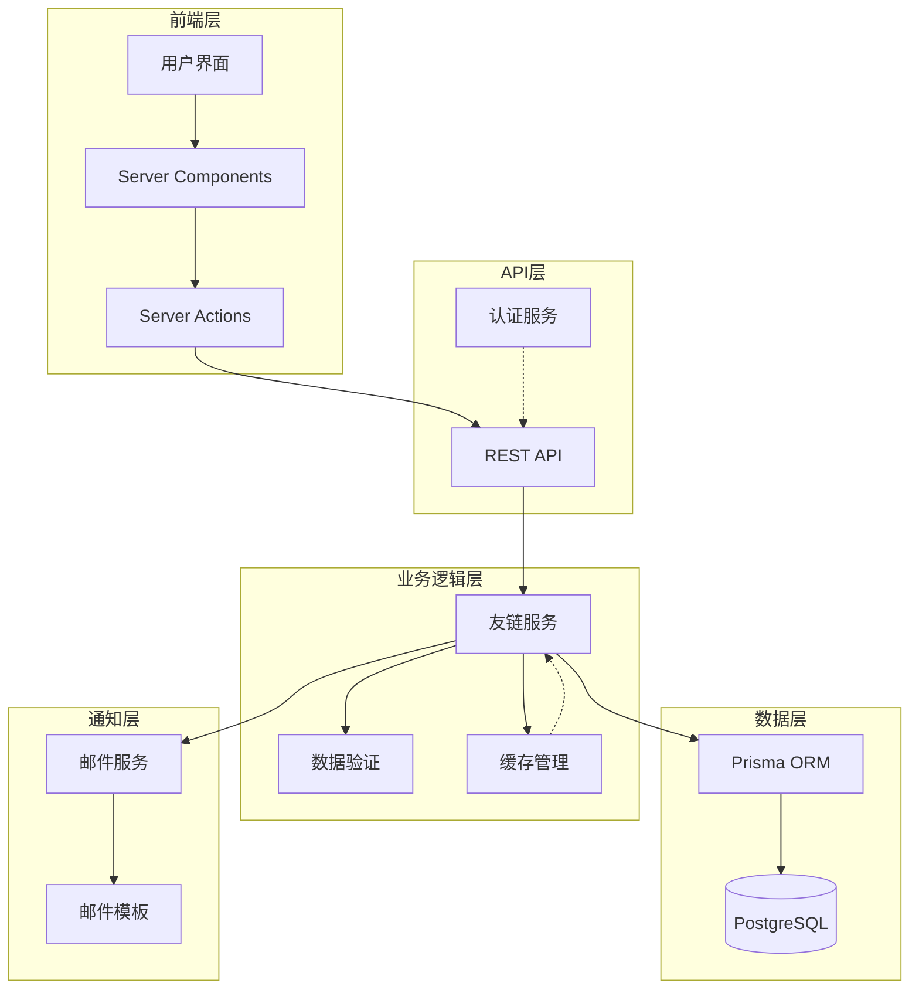

**图表来源**
- [src/app/dashboard/friend-links/actions.ts:1-126](file://src/app/dashboard/friend-links/actions.ts#L1-L126)
- [src/app/(site)/friends/actions.ts](file://src/app/(site)/friends/actions.ts#L1-L33)

## 核心组件

### 数据模型设计

系统的核心数据模型围绕友链管理展开，采用枚举类型确保数据完整性：

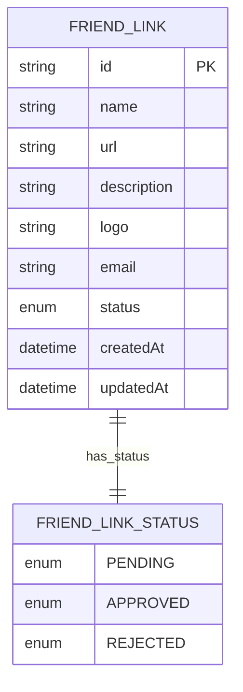

**图表来源**
- [prisma/schema.prisma:177-182](file://prisma/schema.prisma#L177-L182)
- [src/app/dashboard/friend-links/schema.ts:9-9](file://src/app/dashboard/friend-links/schema.ts#L9-L9)

### 组件层次结构

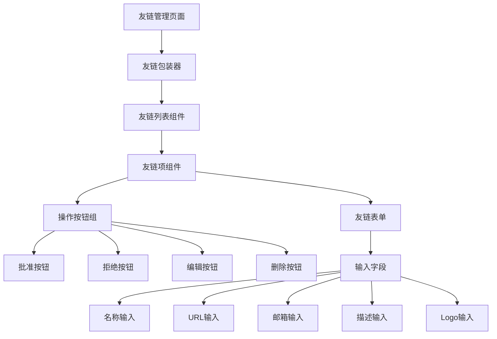

**图表来源**
- [src/app/dashboard/friend-links/components/friend-links-wrapper.tsx:1-22](file://src/app/dashboard/friend-links/components/friend-links-wrapper.tsx#L1-L22)
- [src/app/dashboard/friend-links/components/friend-link-list.tsx:48-96](file://src/app/dashboard/friend-links/components/friend-link-list.tsx#L48-L96)

**章节来源**
- [prisma/schema.prisma:177-182](file://prisma/schema.prisma#L177-L182)
- [src/app/dashboard/friend-links/schema.ts:1-12](file://src/app/dashboard/friend-links/schema.ts#L1-L12)

## 审核状态管理

### 状态流转机制

系统实现了严格的审核状态管理，确保友链申请的完整生命周期：

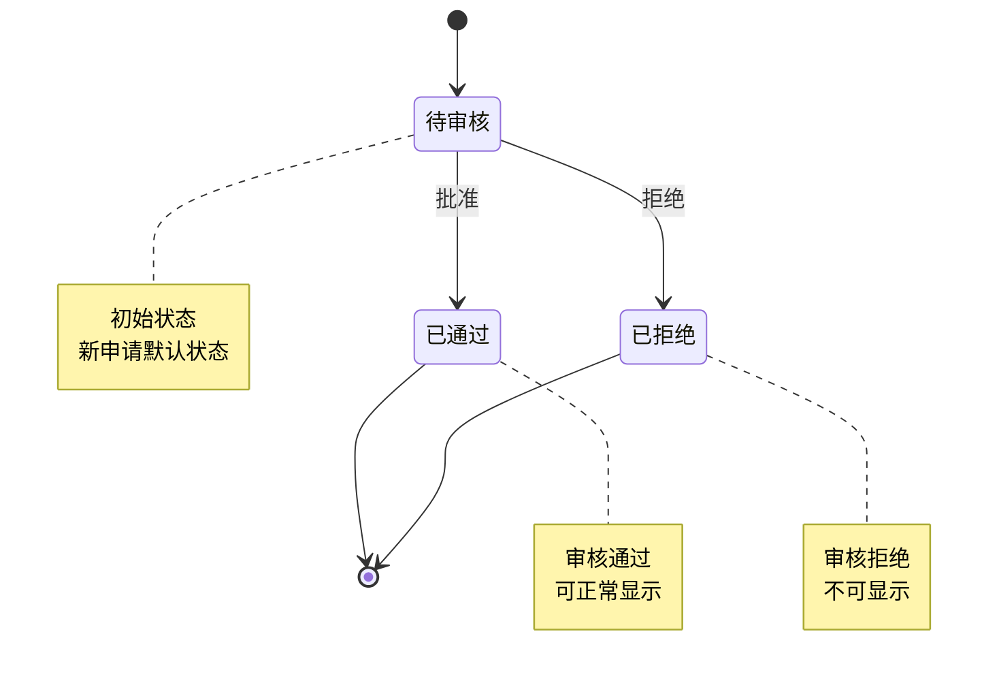

**图表来源**
- [src/app/dashboard/friend-links/schema.ts:9-9](file://src/app/dashboard/friend-links/schema.ts#L9-L9)
- [src/app/(site)/friends/actions.ts](file://src/app/(site)/friends/actions.ts#L21-L21)

### 状态转换逻辑

每个状态转换都经过严格的数据验证和业务逻辑处理：

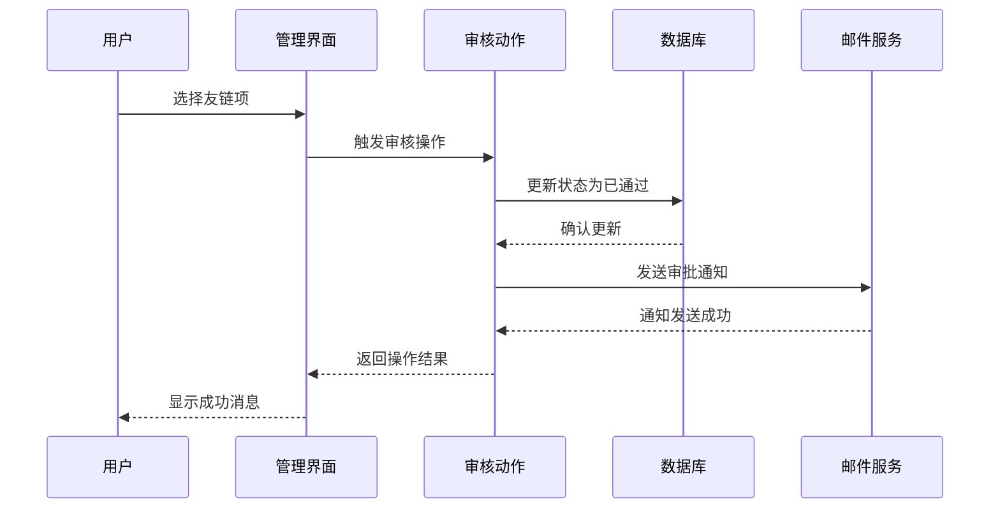

**图表来源**
- [src/app/dashboard/friend-links/actions.ts:96-114](file://src/app/dashboard/friend-links/actions.ts#L96-L114)
- [src/app/dashboard/friend-links/components/friend-link-list.tsx:77-96](file://src/app/dashboard/friend-links/components/friend-link-list.tsx#L77-L96)

**章节来源**
- [src/app/dashboard/friend-links/actions.ts:96-126](file://src/app/dashboard/friend-links/actions.ts#L96-L126)
- [src/app/dashboard/friend-links/schema.ts:9-9](file://src/app/dashboard/friend-links/schema.ts#L9-L9)

## 批量审核功能

### 多选功能实现

系统支持友链项的多选操作，提供高效的批量管理能力：

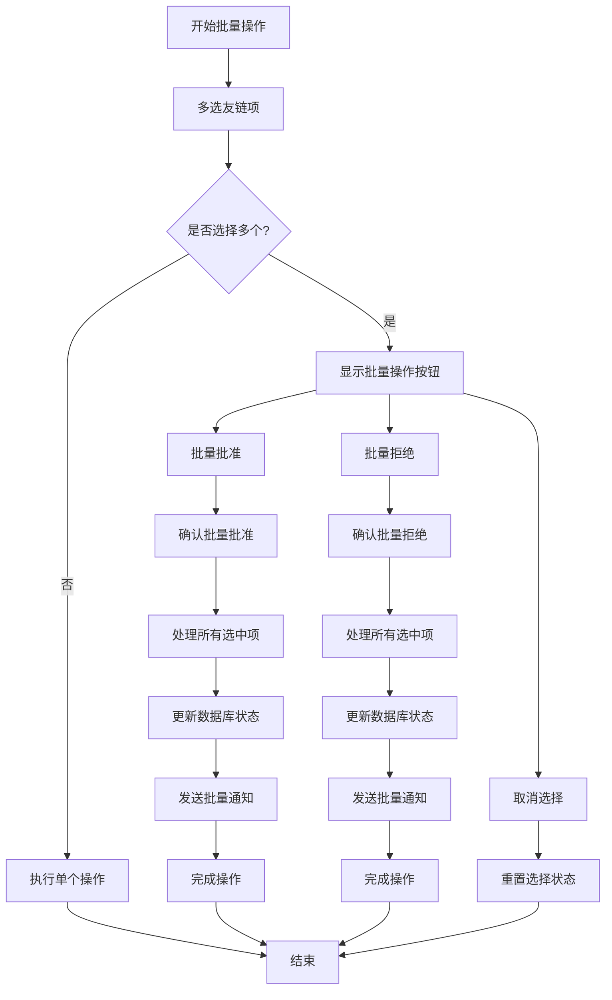

**图表来源**
- [src/app/dashboard/friend-links/components/friend-link-list.tsx:77-96](file://src/app/dashboard/friend-links/components/friend-link-list.tsx#L77-L96)

### 批量状态更新机制

批量操作通过统一的处理流程确保数据一致性和操作安全性：

**章节来源**
- [src/app/dashboard/friend-links/components/friend-link-list.tsx:48-96](file://src/app/dashboard/friend-links/components/friend-link-list.tsx#L48-L96)

## 审核标准配置

### 自动检测规则

系统支持基于预定义规则的自动审核机制：

| 规则类型 | 检测条件 | 处理方式 |
|---------|---------|---------|
| URL有效性 | 格式验证、可达性检查 | 自动通过/拒绝 |
| 域名匹配 | 主域名一致性 | 自动通过/人工复核 |
| 内容相关性 | 关键词匹配度 | 自动评分 |
| 反链质量 | 反链数量和质量 | 自动评估 |

### 人工审核选项

对于复杂或敏感的申请，系统提供人工审核通道：

- **高风险申请**：自动检测标记为高风险时触发人工审核
- **重复申请**：同一站点多次申请时需要人工复核
- **特殊内容**：涉及敏感话题的申请需要人工审核
- **异常行为**：检测到异常模式时暂停自动处理

**章节来源**
- [src/app/dashboard/friend-links/schema.ts:3-10](file://src/app/dashboard/friend-links/schema.ts#L3-L10)

## 管理后台界面设计

### 友链列表展示

管理后台提供了直观的友链管理界面：

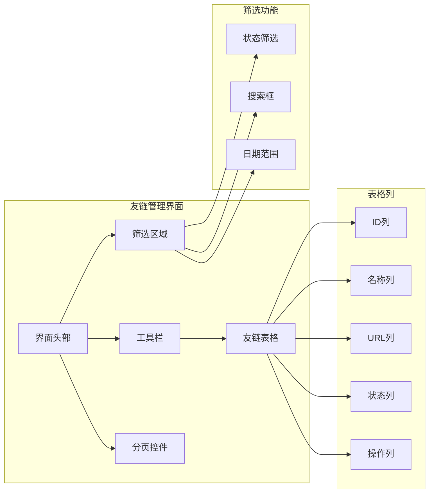

**图表来源**
- [src/app/dashboard/friend-links/page.tsx:1-27](file://src/app/dashboard/friend-links/page.tsx#L1-L27)
- [src/app/dashboard/friend-links/components/friend-links-wrapper.tsx:1-22](file://src/app/dashboard/friend-links/components/friend-links-wrapper.tsx#L1-L22)

### 状态筛选功能

系统支持按审核状态进行快速筛选：

- **待审核**：显示所有新提交的申请
- **已通过**：显示已批准的友链
- **已拒绝**：显示被拒绝的申请

### 搜索功能

提供多维度的搜索能力：

- **按名称搜索**：支持模糊匹配
- **按URL搜索**：精确匹配
- **按邮箱搜索**：支持部分匹配
- **按时间范围搜索**：支持日期范围筛选

**章节来源**
- [src/app/dashboard/friend-links/actions.ts:43-53](file://src/app/dashboard/friend-links/actions.ts#L43-L53)
- [src/app/dashboard/friend-links/page.tsx:1-27](file://src/app/dashboard/friend-links/page.tsx#L1-L27)

## 审核决策处理逻辑

### 通过时的激活操作

当友链申请被批准时，系统执行以下激活流程：

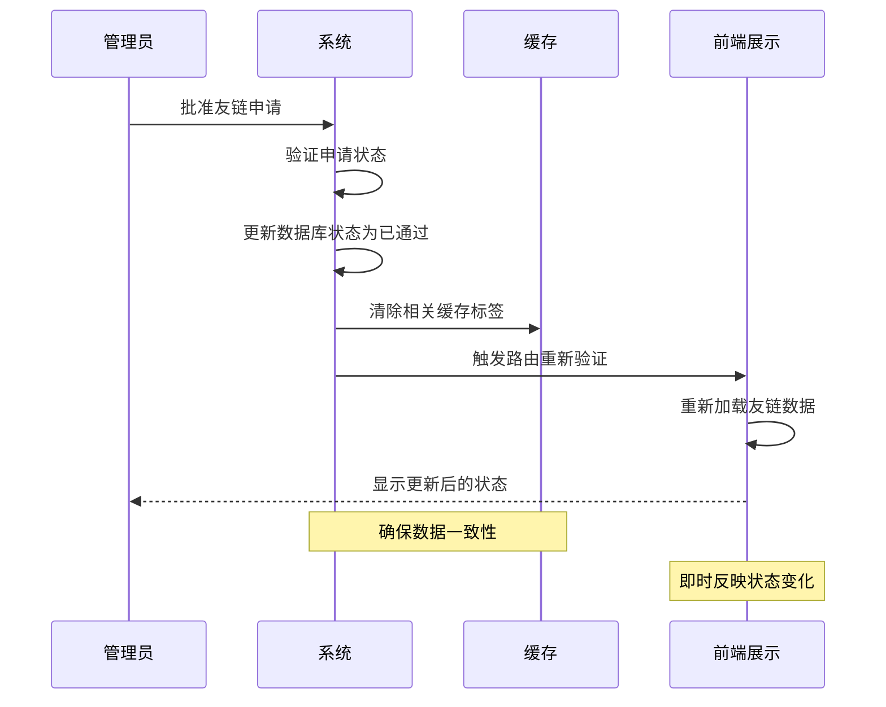

**图表来源**
- [src/app/dashboard/friend-links/actions.ts:96-114](file://src/app/dashboard/friend-links/actions.ts#L96-L114)

### 拒绝时的通知机制

友链申请被拒绝时，系统会自动发送通知邮件：

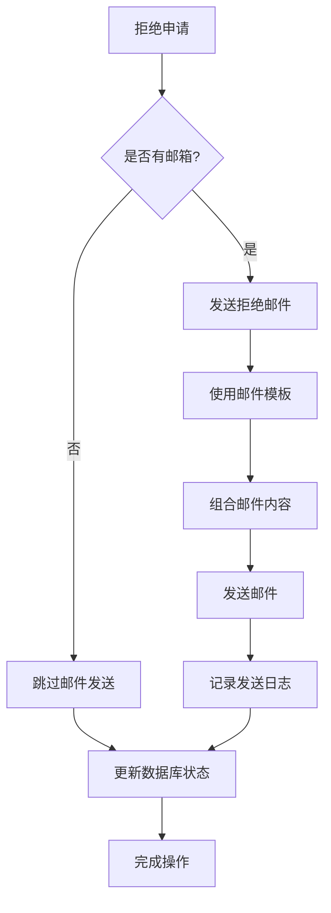

**图表来源**
- [src/app/dashboard/friend-links/components/friend-link-list.tsx:83-96](file://src/app/dashboard/friend-links/components/friend-link-list.tsx#L83-L96)
- [src/app/dashboard/friend-links/components/contact-template.tsx:1-40](file://src/app/dashboard/friend-links/components/contact-template.tsx#L1-L40)

**章节来源**
- [src/app/dashboard/friend-links/actions.ts:116-126](file://src/app/dashboard/friend-links/actions.ts#L116-L126)
- [src/app/api/send-friend-approval/route.ts](file://src/app/api/send-friend-approval/route.ts)

## 完整审核流程示例

### 新申请提交流程

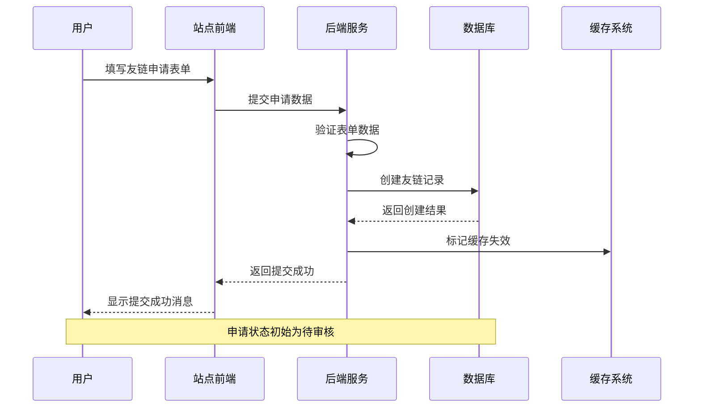

**图表来源**
- [src/app/(site)/friends/actions.ts](file://src/app/(site)/friends/actions.ts#L15-L26)

### 管理审核流程

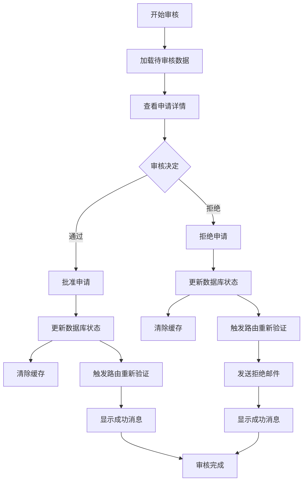

**图表来源**
- [src/app/dashboard/friend-links/actions.ts:96-126](file://src/app/dashboard/friend-links/actions.ts#L96-L126)
- [src/app/dashboard/friend-links/components/friend-link-list.tsx:77-96](file://src/app/dashboard/friend-links/components/friend-link-list.tsx#L77-L96)

## 性能优化考虑

### 缓存策略

系统采用了多层次的缓存机制来提升性能：

- **查询缓存**：使用 `unstable_cache` 缓存友链列表查询结果
- **标签缓存**：通过缓存标签实现精准的缓存失效控制
- **路由缓存**：利用 Next.js 的路由级缓存机制
- **静态生成**：对不经常变动的数据使用静态生成

### 数据验证优化

- **客户端验证**：提供即时的用户体验反馈
- **服务器端验证**：确保数据完整性和安全性
- **类型安全**：使用 Zod 进行运行时类型检查

### 并发处理

- **事务处理**：确保数据库操作的原子性
- **锁机制**：防止并发操作导致的数据不一致
- **重试机制**：网络异常时的自动重试

## 故障排除指南

### 常见问题及解决方案

| 问题类型 | 症状描述 | 解决方案 |
|---------|---------|---------|
| 审核状态不更新 | 界面显示状态未改变 | 检查缓存标签失效和路由重新验证 |
| 邮件发送失败 | 拒绝通知未送达 | 验证邮件服务配置和网络连接 |
| 数据验证错误 | 表单提交失败 | 检查客户端和服务端验证规则 |
| 性能问题 | 页面加载缓慢 | 分析缓存命中率和数据库查询性能 |

### 调试工具

- **浏览器开发者工具**：监控网络请求和状态变化
- **数据库监控**：跟踪查询性能和连接数
- **日志分析**：分析系统运行时日志
- **性能分析**：使用 Next.js Profiler 分析渲染性能

**章节来源**
- [src/app/dashboard/friend-links/actions.ts:9-41](file://src/app/dashboard/friend-links/actions.ts#L9-L41)

## 总结

友链审核管理系统通过精心设计的架构和完善的业务逻辑，为网站友链管理提供了高效、可靠的解决方案。系统的主要特点包括：

- **完整的审核生命周期**：从申请到最终状态的全流程管理
- **灵活的状态管理**：支持多种审核状态和复杂的流转逻辑
- **高效的批量操作**：提供多选和批量处理能力
- **智能的通知机制**：自动化的邮件通知系统
- **优秀的性能表现**：基于缓存和优化的查询机制
- **良好的扩展性**：模块化的设计便于功能扩展

该系统不仅满足了当前的业务需求，还为未来的功能扩展和技术演进奠定了坚实的基础。