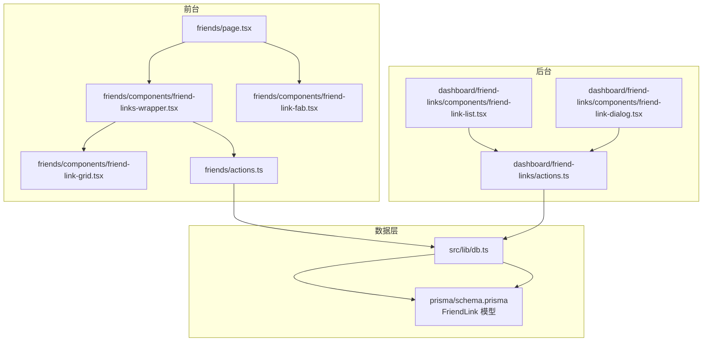
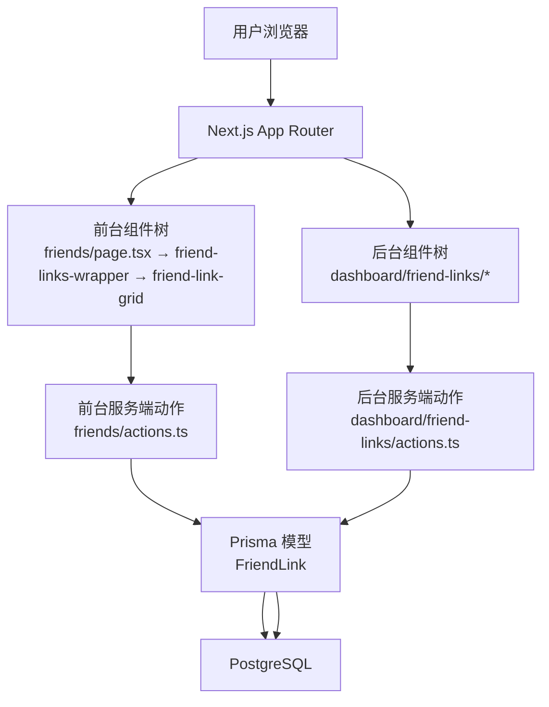
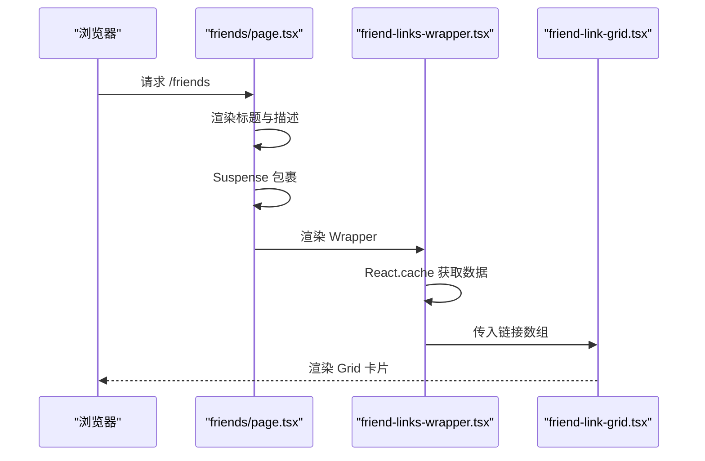
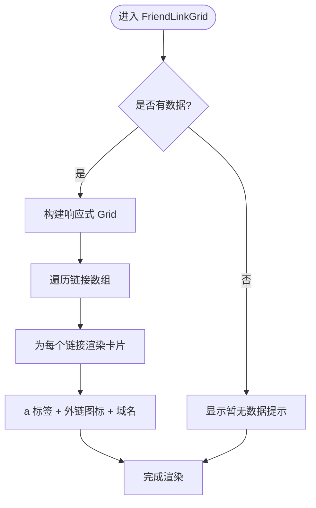
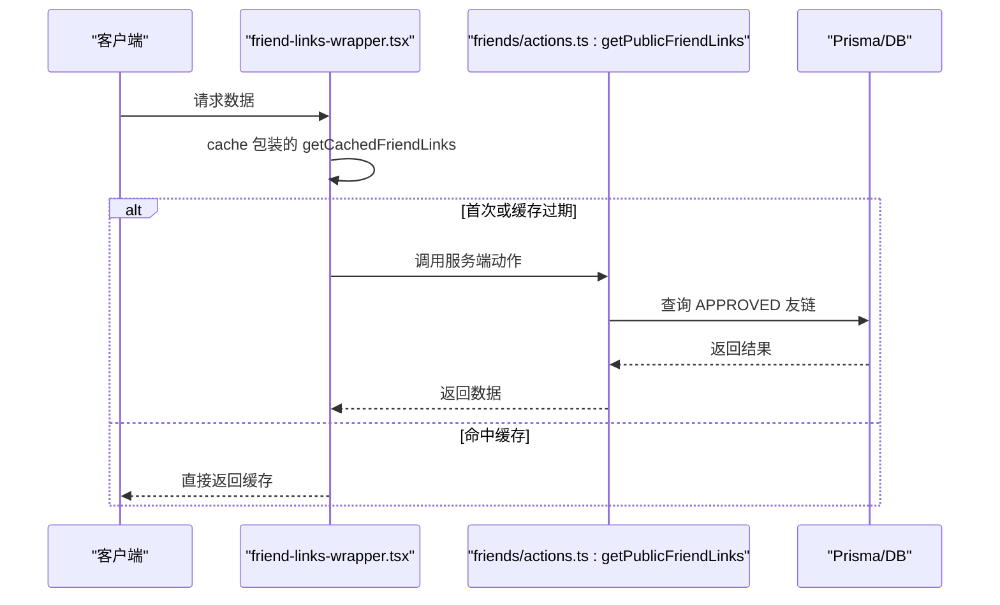
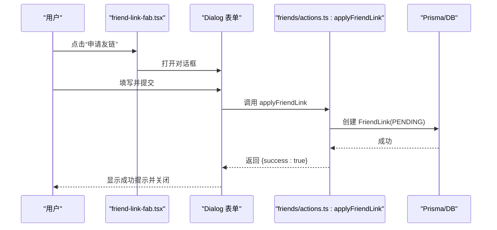
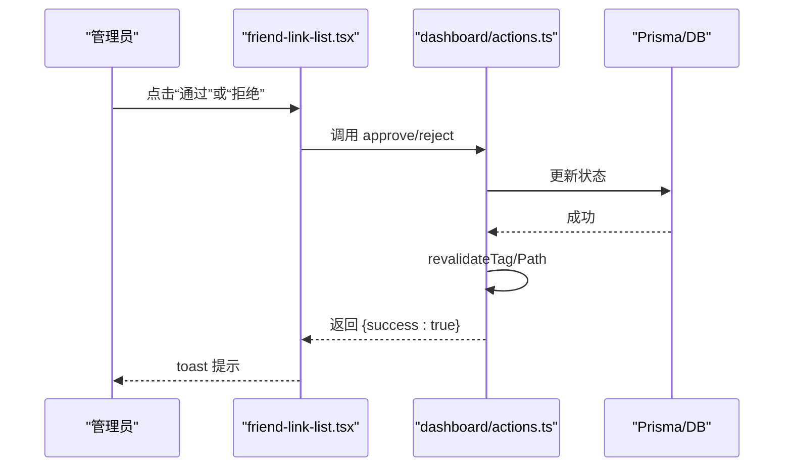
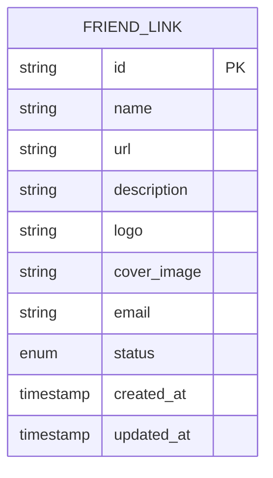
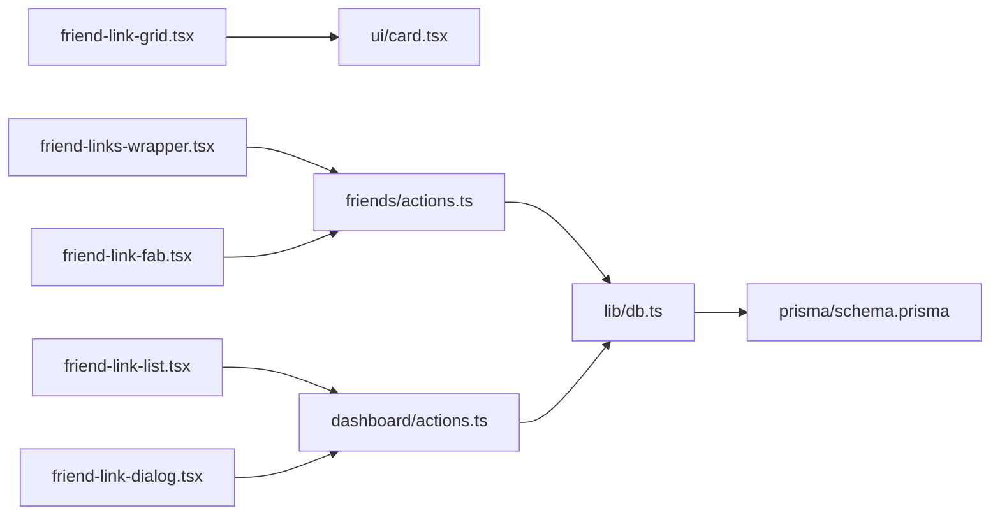

# 友链展示系统

<cite>
**本文档引用的文件**
- [src/app/(site)/friends/page.tsx](file://src/app/(site)/friends/page.tsx)
- [src/app/(site)/friends/components/friend-link-grid.tsx](file://src/app/(site)/friends/components/friend-link-grid.tsx)
- [src/app/(site)/friends/components/friend-links-wrapper.tsx](file://src/app/(site)/friends/components/friend-links-wrapper.tsx)
- [src/app/(site)/friends/actions.ts](file://src/app/(site)/friends/actions.ts)
- [src/app/(site)/friends/components/friend-link-fab.tsx](file://src/app/(site)/friends/components/friend-link-fab.tsx)
- [src/app/dashboard/friend-links/actions.ts](file://src/app/dashboard/friend-links/actions.ts)
- [src/app/dashboard/friend-links/components/friend-link-list.tsx](file://src/app/dashboard/friend-links/components/friend-link-list.tsx)
- [src/app/dashboard/friend-links/components/friend-link-dialog.tsx](file://src/app/dashboard/friend-links/components/friend-link-dialog.tsx)
- [src/components/ui/card.tsx](file://src/components/ui/card.tsx)
- [prisma/schema.prisma](file://prisma/schema.prisma)
- [src/lib/db.ts](file://src/lib/db.ts)
</cite>

## 目录
1. [引言](#引言)
2. [项目结构](#项目结构)
3. [核心组件](#核心组件)
4. [架构总览](#架构总览)
5. [详细组件分析](#详细组件分析)
6. [依赖关系分析](#依赖关系分析)
7. [性能考虑](#性能考虑)
8. [故障排除指南](#故障排除指南)
9. [结论](#结论)
10. [附录](#附录)

## 引言
本文件为“友链展示系统”的完整技术文档，围绕以下目标展开：  
- 友链列表的渲染实现（Grid 布局、响应式适配、加载状态）  
- 友链数据的获取与缓存策略（API 调用、数据预取、缓存失效）  
- 样式定制化（主题切换、颜色方案、字体设置）  
- 友链点击统计（事件记录、统计收集、可视化展示）  
- 安全处理（XSS 防护、外链跳转、nofollow 属性）  
- 最佳实践与性能优化建议  

系统采用 Next.js App Router 架构，前端使用 TailwindCSS + shadcn/ui 组件库，数据持久化基于 Prisma + PostgreSQL。

## 项目结构
友链功能主要分布在两个区域：
- 前台展示页：`src/app/(site)/friends/*`，负责公开友链列表的渲染与交互入口
- 后台管理页：`src/app/dashboard/friend-links/*`，负责友链的增删改查与状态管理

**图表来源**
- [src/app/(site)/friends/page.tsx](file://src/app/(site)/friends/page.tsx#L1-L31)
- [src/app/(site)/friends/components/friend-links-wrapper.tsx](file://src/app/(site)/friends/components/friend-links-wrapper.tsx#L1-L13)
- [src/app/(site)/friends/components/friend-link-grid.tsx](file://src/app/(site)/friends/components/friend-link-grid.tsx#L1-L56)
- [src/app/(site)/friends/components/friend-link-fab.tsx](file://src/app/(site)/friends/components/friend-link-fab.tsx#L1-L227)
- [src/app/(site)/friends/actions.ts](file://src/app/(site)/friends/actions.ts#L1-L34)
- [src/app/dashboard/friend-links/actions.ts:1-127](file://src/app/dashboard/friend-links/actions.ts#L1-L127)
- [src/app/dashboard/friend-links/components/friend-link-list.tsx:1-314](file://src/app/dashboard/friend-links/components/friend-link-list.tsx#L1-L314)
- [src/app/dashboard/friend-links/components/friend-link-dialog.tsx:1-227](file://src/app/dashboard/friend-links/components/friend-link-dialog.tsx#L1-L227)
- [prisma/schema.prisma:169-182](file://prisma/schema.prisma#L169-L182)
- [src/lib/db.ts:1-16](file://src/lib/db.ts#L1-L16)

**章节来源**
- [src/app/(site)/friends/page.tsx](file://src/app/(site)/friends/page.tsx#L1-L31)
- [src/app/(site)/friends/components/friend-links-wrapper.tsx](file://src/app/(site)/friends/components/friend-links-wrapper.tsx#L1-L13)
- [src/app/(site)/friends/components/friend-link-grid.tsx](file://src/app/(site)/friends/components/friend-link-grid.tsx#L1-L56)
- [src/app/(site)/friends/components/friend-link-fab.tsx](file://src/app/(site)/friends/components/friend-link-fab.tsx#L1-L227)
- [src/app/dashboard/friend-links/actions.ts:1-127](file://src/app/dashboard/friend-links/actions.ts#L1-L127)
- [src/app/dashboard/friend-links/components/friend-link-list.tsx:1-314](file://src/app/dashboard/friend-links/components/friend-link-list.tsx#L1-L314)
- [src/app/dashboard/friend-links/components/friend-link-dialog.tsx:1-227](file://src/app/dashboard/friend-links/components/friend-link-dialog.tsx#L1-L227)
- [prisma/schema.prisma:169-182](file://prisma/schema.prisma#L169-L182)
- [src/lib/db.ts:1-16](file://src/lib/db.ts#L1-L16)

## 核心组件
- 前台友链页：负责标题、描述、骨架屏加载、Suspense 包裹、悬浮按钮等
- 友链网格组件：渲染卡片 Grid，包含头像、名称、域名、描述、外链图标
- 数据包装器：使用 React cache 对数据进行缓存，避免重复查询
- 申请表单组件：用户提交友链申请，触发服务端 action
- 后台管理：表格展示、对话框编辑、状态变更、分页与通知

**章节来源**
- [src/app/(site)/friends/page.tsx](file://src/app/(site)/friends/page.tsx#L1-L31)
- [src/app/(site)/friends/components/friend-link-grid.tsx](file://src/app/(site)/friends/components/friend-link-grid.tsx#L1-L56)
- [src/app/(site)/friends/components/friend-links-wrapper.tsx](file://src/app/(site)/friends/components/friend-links-wrapper.tsx#L1-L13)
- [src/app/(site)/friends/components/friend-link-fab.tsx](file://src/app/(site)/friends/components/friend-link-fab.tsx#L1-L227)
- [src/app/dashboard/friend-links/components/friend-link-list.tsx:1-314](file://src/app/dashboard/friend-links/components/friend-link-list.tsx#L1-L314)
- [src/app/dashboard/friend-links/components/friend-link-dialog.tsx:1-227](file://src/app/dashboard/friend-links/components/friend-link-dialog.tsx#L1-L227)

## 架构总览
系统采用“前台渲染 + 后台管理 + 数据库”的三层架构：
- 前台：静态或动态生成友链列表，支持缓存与骨架屏
- 后台：提供 CRUD、状态管理、邮件通知、分页与校验
- 数据层：Prisma 模型定义、客户端实例、PostgreSQL 存储

**图表来源**
- [src/app/(site)/friends/page.tsx](file://src/app/(site)/friends/page.tsx#L1-L31)
- [src/app/(site)/friends/components/friend-links-wrapper.tsx](file://src/app/(site)/friends/components/friend-links-wrapper.tsx#L1-L13)
- [src/app/(site)/friends/actions.ts](file://src/app/(site)/friends/actions.ts#L1-L34)
- [src/app/dashboard/friend-links/actions.ts:1-127](file://src/app/dashboard/friend-links/actions.ts#L1-L127)
- [prisma/schema.prisma:169-182](file://prisma/schema.prisma#L169-L182)

## 详细组件分析

### 前台友链页与骨架屏
- 使用 Suspense 在服务端包裹数据请求，提供骨架屏占位
- revalidate 设置为 1 小时，控制静态生成或增量静态再生的刷新周期
- 网格容器使用响应式 Grid 列数，从移动端到桌面端逐步增加列数

**图表来源**
- [src/app/(site)/friends/page.tsx](file://src/app/(site)/friends/page.tsx#L1-L31)
- [src/app/(site)/friends/components/friend-links-wrapper.tsx](file://src/app/(site)/friends/components/friend-links-wrapper.tsx#L1-L13)
- [src/app/(site)/friends/components/friend-link-grid.tsx](file://src/app/(site)/friends/components/friend-link-grid.tsx#L1-L56)

**章节来源**
- [src/app/(site)/friends/page.tsx](file://src/app/(site)/friends/page.tsx#L6-L26)

### 友链网格渲染与响应式布局
- Grid 布局：1/2/3/4 列随屏幕尺寸变化，保证在小屏上不拥挤
- 卡片结构：头像 + 名称 + 外链图标 + 描述
- 外链安全：统一使用 `target="_blank"` 和 `rel="noopener noreferrer"`
- 域名展示：通过 URL 解析主机名，避免过长链接影响排版

**图表来源**
- [src/app/(site)/friends/components/friend-link-grid.tsx](file://src/app/(site)/friends/components/friend-link-grid.tsx#L5-L54)

**章节来源**
- [src/app/(site)/friends/components/friend-link-grid.tsx](file://src/app/(site)/friends/components/friend-link-grid.tsx#L14-L54)

### 数据获取与缓存策略
- 前台：使用 React.cache 包装异步函数，避免重复查询，提升 SSR/SSG 性能
- 后台：使用 Next.js 的 unstable_cache + tag，支持按标签失效与路径失效
- 查询条件：前台仅取 APPROVED 状态，后台支持分页与状态筛选
- 失效机制：创建/更新/删除/审核都会触发 revalidateTag 与 revalidatePath

**图表来源**
- [src/app/(site)/friends/components/friend-links-wrapper.tsx](file://src/app/(site)/friends/components/friend-links-wrapper.tsx#L6-L8)
- [src/app/(site)/friends/actions.ts](file://src/app/(site)/friends/actions.ts#L28-L33)

**章节来源**
- [src/app/(site)/friends/components/friend-links-wrapper.tsx](file://src/app/(site)/friends/components/friend-links-wrapper.tsx#L6-L8)
- [src/app/(site)/friends/actions.ts](file://src/app/(site)/friends/actions.ts#L28-L33)
- [src/app/dashboard/friend-links/actions.ts:9-41](file://src/app/dashboard/friend-links/actions.ts#L9-L41)

### 申请表单与服务端动作
- 表单校验：使用 Zod Schema 校验名称、URL、邮箱、Logo 等字段
- 提交流程：调用服务端 action 创建申请，状态默认为 PENDING
- 成功反馈：使用 toast 提示，清空表单并关闭对话框

**图表来源**
- [src/app/(site)/friends/components/friend-link-fab.tsx](file://src/app/(site)/friends/components/friend-link-fab.tsx#L60-L72)
- [src/app/(site)/friends/actions.ts](file://src/app/(site)/friends/actions.ts#L15-L26)

**章节来源**
- [src/app/(site)/friends/components/friend-link-fab.tsx](file://src/app/(site)/friends/components/friend-link-fab.tsx#L34-L72)
- [src/app/(site)/friends/actions.ts](file://src/app/(site)/friends/actions.ts#L6-L26)

### 后台管理：列表、对话框与状态变更
- 列表组件：支持状态 Badge、分页、外链打开、操作按钮（通过/拒绝/编辑/删除）
- 对话框：Zod 校验 + 图片上传组件，支持新增与编辑
- 状态变更：通过后台 action 更新状态，同时触发缓存失效与路径刷新
- 邮件通知：审核通过时尝试发送邮件通知（失败也不阻断主流程）

**图表来源**
- [src/app/dashboard/friend-links/components/friend-link-list.tsx:77-140](file://src/app/dashboard/friend-links/components/friend-link-list.tsx#L77-L140)
- [src/app/dashboard/friend-links/actions.ts:96-114](file://src/app/dashboard/friend-links/actions.ts#L96-L114)

**章节来源**
- [src/app/dashboard/friend-links/components/friend-link-list.tsx:40-156](file://src/app/dashboard/friend-links/components/friend-link-list.tsx#L40-L156)
- [src/app/dashboard/friend-links/components/friend-link-dialog.tsx:45-99](file://src/app/dashboard/friend-links/components/friend-link-dialog.tsx#L45-L99)
- [src/app/dashboard/friend-links/actions.ts:55-94](file://src/app/dashboard/friend-links/actions.ts#L55-L94)

### 数据模型与数据库访问
- 模型：FriendLink 包含名称、URL、描述、Logo、邮箱、状态、时间戳
- 访问：前台仅查询 APPROVED 状态；后台支持分页、计数、状态筛选
- 客户端：PrismaClient 实例，开发环境开启日志，生产环境关闭

**图表来源**
- [prisma/schema.prisma:169-182](file://prisma/schema.prisma#L169-L182)

**章节来源**
- [prisma/schema.prisma:169-182](file://prisma/schema.prisma#L169-L182)
- [src/lib/db.ts:1-16](file://src/lib/db.ts#L1-L16)

## 依赖关系分析
- 组件耦合：前台组件通过服务端动作与数据库交互，后台组件同样通过服务端动作与数据库交互
- 缓存耦合：前台使用 React.cache，后台使用 Next.js cache tag，两者均依赖 Prisma 查询
- UI 组件：卡片组件来自通用 UI 库，便于主题切换与样式一致性

**图表来源**
- [src/app/(site)/friends/components/friend-link-grid.tsx](file://src/app/(site)/friends/components/friend-link-grid.tsx#L1-L56)
- [src/components/ui/card.tsx:1-93](file://src/components/ui/card.tsx#L1-L93)
- [src/app/(site)/friends/components/friend-links-wrapper.tsx](file://src/app/(site)/friends/components/friend-links-wrapper.tsx#L1-L13)
- [src/app/(site)/friends/actions.ts](file://src/app/(site)/friends/actions.ts#L1-L34)
- [src/app/(site)/friends/components/friend-link-fab.tsx](file://src/app/(site)/friends/components/friend-link-fab.tsx#L1-L227)
- [src/app/dashboard/friend-links/components/friend-link-list.tsx:1-314](file://src/app/dashboard/friend-links/components/friend-link-list.tsx#L1-L314)
- [src/app/dashboard/friend-links/components/friend-link-dialog.tsx:1-227](file://src/app/dashboard/friend-links/components/friend-link-dialog.tsx#L1-L227)
- [src/app/dashboard/friend-links/actions.ts:1-127](file://src/app/dashboard/friend-links/actions.ts#L1-L127)
- [src/lib/db.ts:1-16](file://src/lib/db.ts#L1-L16)
- [prisma/schema.prisma:169-182](file://prisma/schema.prisma#L169-L182)

**章节来源**
- [src/app/(site)/friends/components/friend-link-grid.tsx](file://src/app/(site)/friends/components/friend-link-grid.tsx#L1-L56)
- [src/app/(site)/friends/components/friend-links-wrapper.tsx](file://src/app/(site)/friends/components/friend-links-wrapper.tsx#L1-L13)
- [src/app/(site)/friends/components/friend-link-fab.tsx](file://src/app/(site)/friends/components/friend-link-fab.tsx#L1-L227)
- [src/app/dashboard/friend-links/components/friend-link-list.tsx:1-314](file://src/app/dashboard/friend-links/components/friend-link-list.tsx#L1-L314)
- [src/app/dashboard/friend-links/components/friend-link-dialog.tsx:1-227](file://src/app/dashboard/friend-links/components/friend-link-dialog.tsx#L1-L227)
- [src/app/dashboard/friend-links/actions.ts:1-127](file://src/app/dashboard/friend-links/actions.ts#L1-L127)
- [src/lib/db.ts:1-16](file://src/lib/db.ts#L1-L16)
- [prisma/schema.prisma:169-182](file://prisma/schema.prisma#L169-L182)

## 性能考虑
- 缓存策略
  - 前台：React.cache 避免重复查询，适合低频更新的数据
  - 后台：unstable_cache + tag，支持按标签失效，配合 revalidatePath 精准刷新
- 骨架屏与并发
  - Suspense + Skeleton 提升首屏体验
  - 后台列表使用 Promise.all 并发查询数据与总数，减少 RTT
- 响应式与渲染
  - Grid 列数自适应，减少 DOM 数量与重绘
  - 卡片 hover 效果与外链图标使用过渡动画，避免昂贵计算
- 数据库
  - 分页查询 + 计数分离，避免一次性拉取大量数据
  - 开发环境开启 Prisma 日志，便于定位慢查询

[本节为通用性能建议，无需特定文件来源]

## 故障排除指南
- 友链未显示
  - 检查状态是否为 APPROVED
  - 确认缓存是否需要失效（前台：重新生成；后台：触发 revalidateTag/Path）
- 申请提交失败
  - 查看表单校验错误与网络请求
  - 确认服务端动作返回的错误信息
- 审核通过但邮件未达
  - 后台 action 已做容错处理，即使邮件失败也返回成功
  - 检查邮件服务配置与频率限制
- 外链无法打开或存在安全风险
  - 确保 a 标签包含 `target="_blank" rel="noopener noreferrer"`
  - 如需防止 SEO 影响，可在必要时添加 `rel="nofollow"`

**章节来源**
- [src/app/(site)/friends/components/friend-link-grid.tsx](file://src/app/(site)/friends/components/friend-link-grid.tsx#L17-L22)
- [src/app/dashboard/friend-links/components/friend-link-list.tsx:83-116](file://src/app/dashboard/friend-links/components/friend-link-list.tsx#L83-L116)
- [src/app/(site)/friends/actions.ts](file://src/app/(site)/friends/actions.ts#L15-L26)

## 结论
本系统以简洁清晰的方式实现了友链的展示与管理：前台通过缓存与骨架屏优化用户体验，后台通过严格的校验与缓存失效机制保障数据一致性。通过合理的响应式布局与外链安全策略，兼顾了可用性与安全性。后续可在点击统计与可视化方面进一步增强，以完善运营指标闭环。

[本节为总结性内容，无需特定文件来源]

## 附录

### 样式定制化（主题切换、颜色方案、字体设置）
- 主题切换：通过 Provider 与 Tailwind 主题类实现明暗模式切换
- 颜色方案：卡片 hover 使用品牌色，外链图标与标题在悬停时高亮
- 字体设置：使用语义化字号与行高，确保在不同设备上的可读性

**章节来源**
- [src/app/(site)/friends/components/friend-link-grid.tsx](file://src/app/(site)/friends/components/friend-link-grid.tsx#L24-L38)
- [src/app/(site)/friends/components/friend-link-fab.tsx](file://src/app/(site)/friends/components/friend-link-fab.tsx#L115-L121)

### 友链点击统计（事件记录、统计收集、可视化展示）
- 当前实现：系统未内置点击统计与可视化展示
- 建议方案：
  - 前端埋点：在友链 a 标签点击时发送埋点事件
  - 服务端统计：记录点击时间、来源、UA、IP 等维度
  - 可视化：在后台仪表盘展示点击趋势与来源分布

[本节为概念性建议，无需特定文件来源]

### 安全处理（XSS 防护、外链跳转、nofollow 属性）
- XSS 防护：严格使用 Zod 校验输入，避免模板注入
- 外链跳转：统一使用 `target="_blank" rel="noopener noreferrer"`
- nofollow：如需降低 SEO 影响，可在必要时添加 `rel="nofollow"`

**章节来源**
- [src/app/(site)/friends/components/friend-link-grid.tsx](file://src/app/(site)/friends/components/friend-link-grid.tsx#L17-L22)
- [src/app/dashboard/friend-links/components/friend-link-list.tsx:197-199](file://src/app/dashboard/friend-links/components/friend-link-list.tsx#L197-L199)