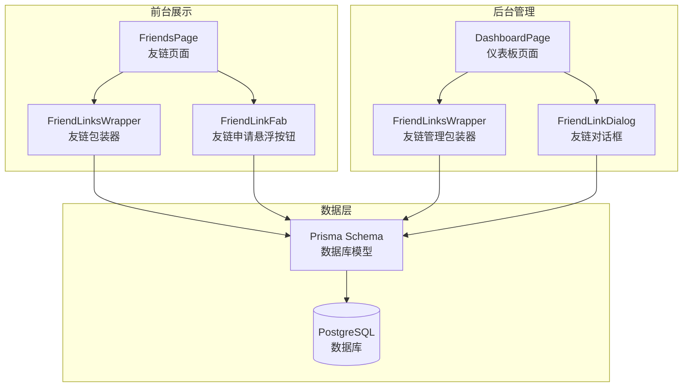
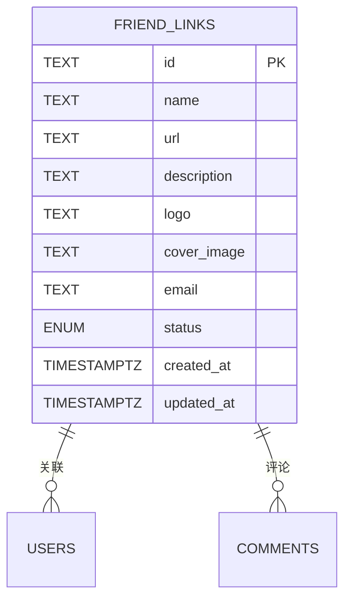
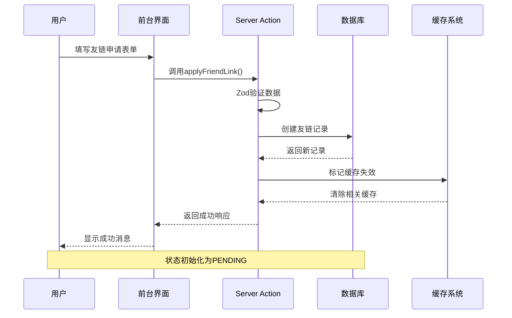
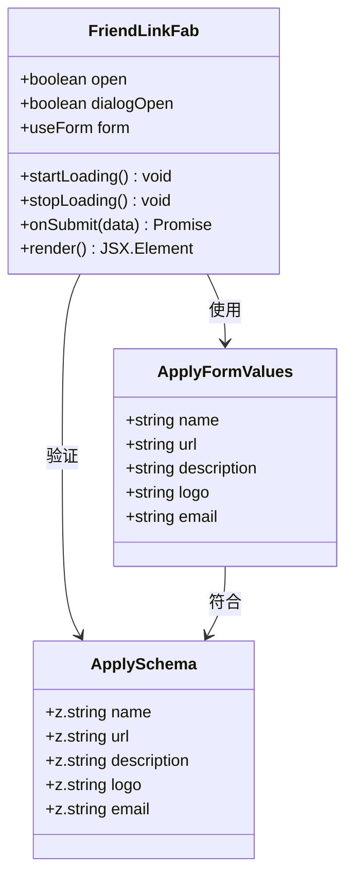
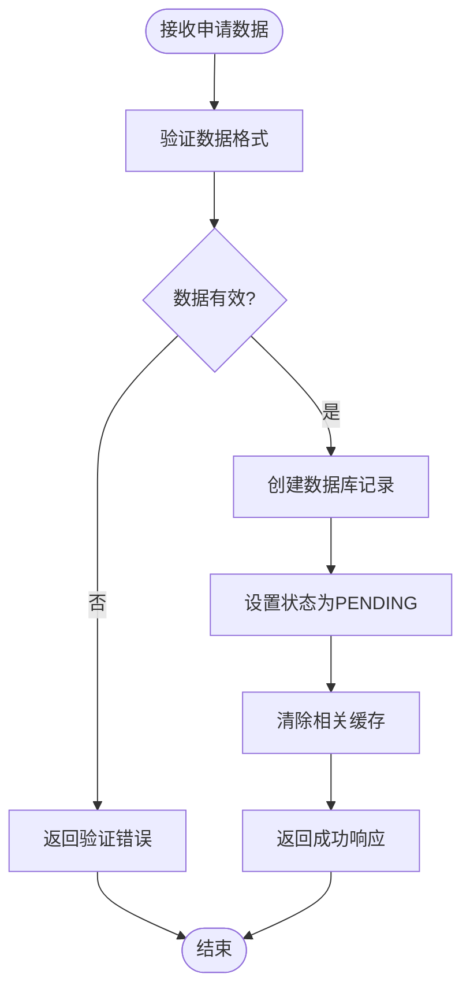
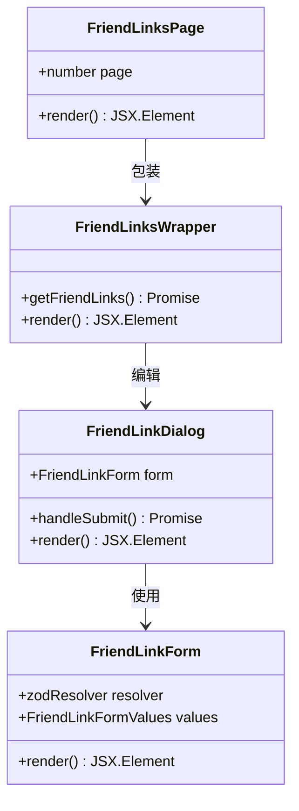
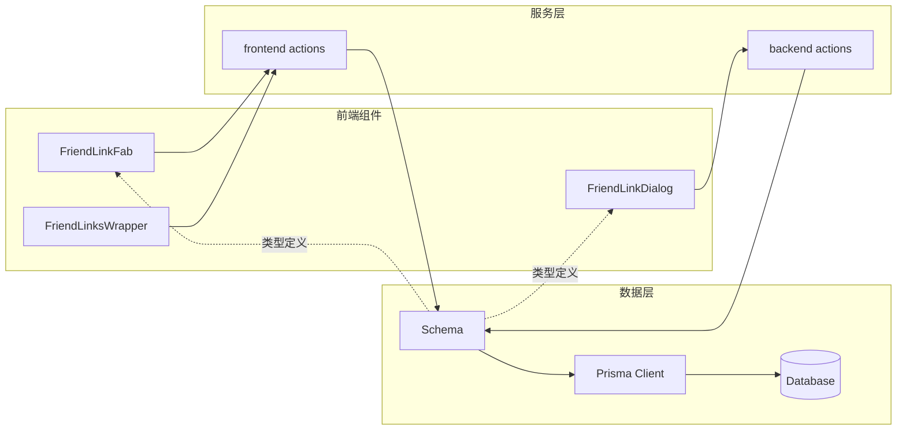

# 友链申请流程

<cite>
**本文档引用的文件**
- [src/app/(site)/friends/components/friend-link-fab.tsx](file://src/app/(site)/friends/components/friend-link-fab.tsx)
- [src/app/(site)/friends/actions.ts](file://src/app/(site)/friends/actions.ts)
- [src/app/dashboard/friend-links/schema.ts](file://src/app/dashboard/friend-links/schema.ts)
- [src/app/dashboard/friend-links/actions.ts](file://src/app/dashboard/friend-links/actions.ts)
- [src/app/dashboard/friend-links/page.tsx](file://src/app/dashboard/friend-links/page.tsx)
- [src/app/(site)/friends/components/friend-links-wrapper.tsx](file://src/app/(site)/friends/components/friend-links-wrapper.tsx)
- [src/app/(site)/friends/page.tsx](file://src/app/(site)/friends/page.tsx)
- [prisma/schema.prisma](file://prisma/schema.prisma)
- [prisma/migrations/20260122003154_add_miss_table/migration.sql](file://prisma/migrations/20260122003154_add_miss_table/migration.sql)
</cite>

## 目录
1. [引言](#引言)
2. [项目结构](#项目结构)
3. [核心组件](#核心组件)
4. [架构概览](#架构概览)
5. [详细组件分析](#详细组件分析)
6. [依赖关系分析](#依赖关系分析)
7. [性能考虑](#性能考虑)
8. [故障排除指南](#故障排除指南)
9. [结论](#结论)

## 引言

本文档详细描述了本项目中的友链申请流程，包括前端表单设计、后端处理逻辑、数据库模型以及完整的申请流程实现。该系统采用Next.js App Router架构，结合Prisma ORM进行数据持久化，实现了从用户申请到管理员审核的完整工作流。

## 项目结构

友链功能主要分布在两个区域：
- 前台展示区域：`src/app/(site)/friends/`
- 后台管理区域：`src/app/dashboard/friend-links/`

**图表来源**
- [src/app/(site)/friends/page.tsx](file://src/app/(site)/friends/page.tsx#L8-L29)
- [src/app/dashboard/friend-links/page.tsx:1-27](file://src/app/dashboard/friend-links/page.tsx#L1-L27)

**章节来源**
- [src/app/(site)/friends/page.tsx](file://src/app/(site)/friends/page.tsx#L1-L30)
- [src/app/dashboard/friend-links/page.tsx:1-27](file://src/app/dashboard/friend-links/page.tsx#L1-L27)

## 核心组件

### 数据模型设计

友链数据模型定义在Prisma Schema中，包含以下关键字段：

**图表来源**
- [prisma/schema.prisma:170-182](file://prisma/schema.prisma#L170-L182)

### 表单验证Schema

系统使用Zod进行双向验证，确保数据完整性：

**前台申请Schema**
- 必填字段：name（名称）、url（URL）
- 可选字段：description（描述）、logo（图标）、email（邮箱）
- URL格式验证：使用`z.string().url()`确保有效URL
- 邮箱格式验证：使用`z.string().email()`确保有效邮箱

**后台管理Schema**
- 包含状态字段：status（默认PENDING）
- 支持所有前台字段
- 状态枚举：PENDING/APPROVED/REJECTED

**章节来源**
- [src/app/(site)/friends/components/friend-link-fab.tsx](file://src/app/(site)/friends/components/friend-link-fab.tsx#L34-L42)
- [src/app/dashboard/friend-links/schema.ts:1-12](file://src/app/dashboard/friend-links/schema.ts#L1-L12)

## 架构概览

友链申请流程采用分层架构设计，从前端表单到后端处理再到数据库存储形成完整的数据流。

**图表来源**
- [src/app/(site)/friends/components/friend-link-fab.tsx](file://src/app/(site)/friends/components/friend-link-fab.tsx#L60-L72)
- [src/app/(site)/friends/actions.ts](file://src/app/(site)/friends/actions.ts#L15-L26)

## 详细组件分析

### 前台申请组件

#### FriendLinkFab 组件

该组件实现了友链申请的核心交互逻辑：

**图表来源**
- [src/app/(site)/friends/components/friend-link-fab.tsx](file://src/app/(site)/friends/components/friend-link-fab.tsx#L44-L72)

#### React Hook Form 集成

组件集成了React Hook Form进行表单管理：

- **表单配置**：使用`useForm` hook创建表单实例
- **验证集成**：通过`zodResolver`集成Zod验证
- **实时验证**：字段变更时自动验证
- **错误处理**：自动显示验证错误信息

**章节来源**
- [src/app/(site)/friends/components/friend-link-fab.tsx](file://src/app/(site)/friends/components/friend-link-fab.tsx#L49-L58)

### 后端处理逻辑

#### Server Actions 实现

应用使用Server Actions处理友链申请：

**图表来源**
- [src/app/(site)/friends/actions.ts](file://src/app/(site)/friends/actions.ts#L15-L26)

#### 数据库写入操作

Server Action负责执行数据库写入操作：

- **Prisma集成**：使用`prisma.friendLink.create()`创建新记录
- **状态初始化**：自动设置`status`为"PENDING"
- **数据转换**：将验证后的数据转换为数据库模型
- **事务保证**：Prisma自动处理数据库事务

**章节来源**
- [src/app/(site)/friends/actions.ts](file://src/app/(site)/friends/actions.ts#L15-L26)

### 管理后台组件

#### 友链管理界面

后台提供了完整的友链管理功能：

**图表来源**
- [src/app/dashboard/friend-links/page.tsx:5-26](file://src/app/dashboard/friend-links/page.tsx#L5-L26)
- [src/app/dashboard/friend-links/actions.ts:55-69](file://src/app/dashboard/friend-links/actions.ts#L55-L69)

**章节来源**
- [src/app/dashboard/friend-links/page.tsx:1-27](file://src/app/dashboard/friend-links/page.tsx#L1-L27)

### 缓存策略

系统实现了多层缓存机制：

- **前台缓存**：使用`React.cache`缓存友链数据获取
- **后台缓存**：使用`unstable_cache`实现5分钟缓存
- **标签缓存**：使用`revalidateTag`精确控制缓存失效
- **路径缓存**：使用`revalidatePath`失效特定页面缓存

**章节来源**
- [src/app/(site)/friends/components/friend-links-wrapper.tsx](file://src/app/(site)/friends/components/friend-links-wrapper.tsx#L5-L12)
- [src/app/dashboard/friend-links/actions.ts:9-41](file://src/app/dashboard/friend-links/actions.ts#L9-L41)

## 依赖关系分析

系统各组件之间的依赖关系如下：

**图表来源**
- [src/app/(site)/friends/components/friend-link-fab.tsx](file://src/app/(site)/friends/components/friend-link-fab.tsx#L24-L28)
- [src/app/dashboard/friend-links/schema.ts:1-12](file://src/app/dashboard/friend-links/schema.ts#L1-L12)

**章节来源**
- [src/app/(site)/friends/components/friend-link-fab.tsx](file://src/app/(site)/friends/components/friend-link-fab.tsx#L1-L88)
- [src/app/dashboard/friend-links/actions.ts:1-126](file://src/app/dashboard/friend-links/actions.ts#L1-L126)

## 性能考虑

### 缓存优化

系统采用了多层次的缓存策略：

- **React.cache**：用于组件级别的数据缓存
- **unstable_cache**：用于Server Action的5分钟缓存
- **标签失效**：精确控制缓存失效范围
- **并发优化**：使用Promise.all并行查询

### 数据库优化

- **索引设计**：为常用查询字段建立索引
- **批量操作**：支持批量查询和更新
- **连接池**：使用Prisma连接池管理数据库连接

### 前端性能

- **懒加载**：使用Suspense实现组件懒加载
- **骨架屏**：提供更好的用户体验
- **防抖处理**：避免频繁的表单验证

## 故障排除指南

### 常见问题及解决方案

#### 表单验证错误

**问题**：用户输入无效的URL或邮箱地址
**解决方案**：检查Zod验证规则，确保使用正确的验证方法

#### 数据库连接问题

**问题**：无法连接到数据库
**解决方案**：检查DATABASE_URL环境变量配置

#### 缓存同步问题

**问题**：新创建的友链未显示在前台
**解决方案**：检查缓存失效机制是否正常工作

**章节来源**
- [src/app/(site)/friends/actions.ts](file://src/app/(site)/friends/actions.ts#L15-L26)
- [src/app/dashboard/friend-links/actions.ts:96-114](file://src/app/dashboard/friend-links/actions.ts#L96-L114)

## 结论

本友链申请流程实现了完整的前后端分离架构，具有以下特点：

- **完整的验证体系**：前后端双重验证确保数据质量
- **清晰的状态管理**：PENDING/APPROVED/REJECTED三种状态
- **高效的缓存机制**：多层缓存提升系统性能
- **良好的扩展性**：模块化设计便于功能扩展

该实现为类似的内容管理系统提供了参考模板，展示了现代Web应用的最佳实践。