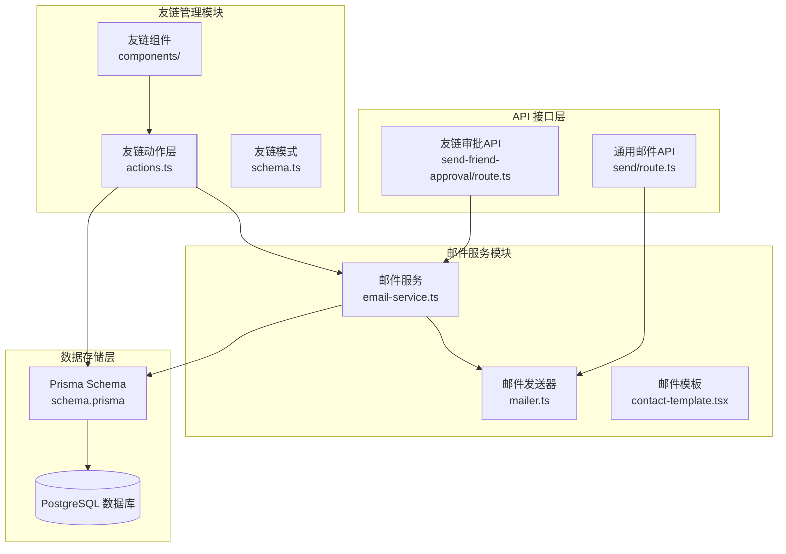
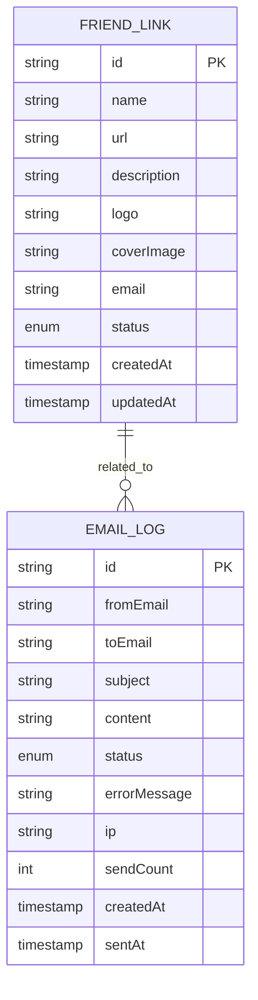
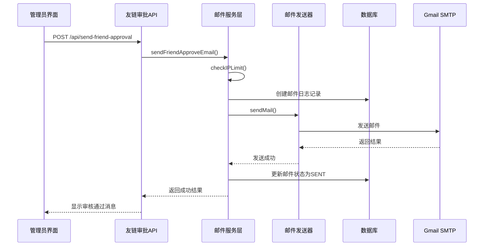
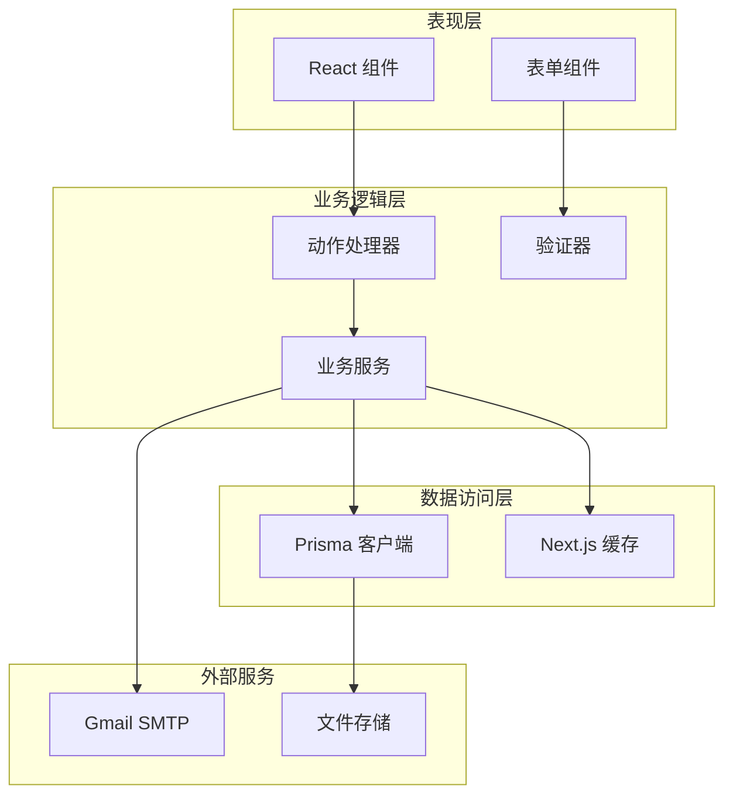
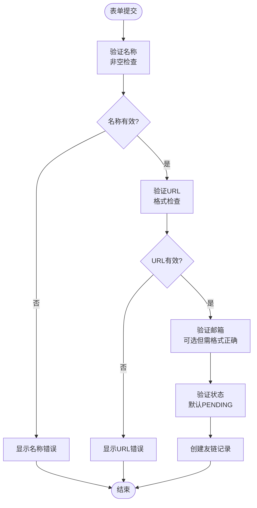
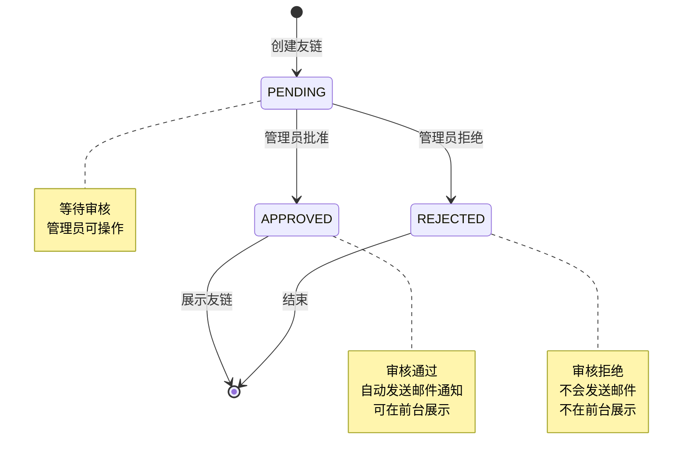
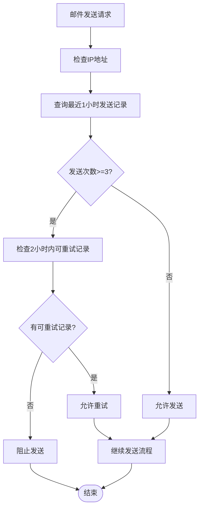
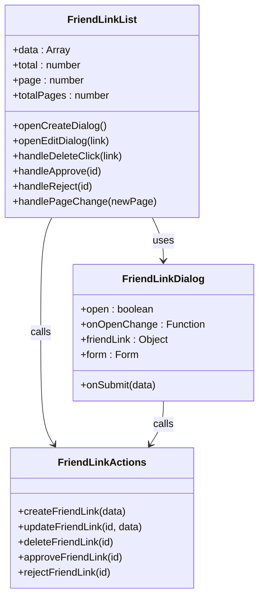
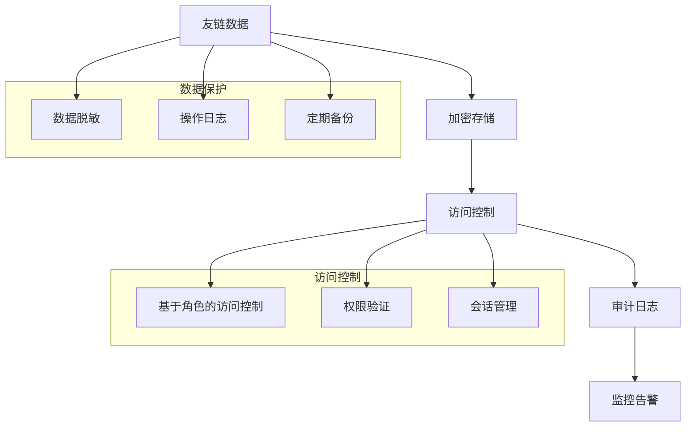
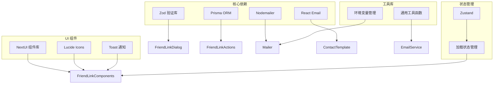

# 友链管理系统

<cite>
**本文档引用的文件**
- [src/app/dashboard/friend-links/actions.ts](file://src/app/dashboard/friend-links/actions.ts)
- [src/app/dashboard/friend-links/schema.ts](file://src/app/dashboard/friend-links/schema.ts)
- [src/app/dashboard/friend-links/components/friend-link-list.tsx](file://src/app/dashboard/friend-links/components/friend-link-list.tsx)
- [src/app/dashboard/friend-links/components/friend-link-dialog.tsx](file://src/app/dashboard/friend-links/components/friend-link-dialog.tsx)
- [src/lib/email-service.ts](file://src/lib/email-service.ts)
- [src/lib/mailer.ts](file://src/lib/mailer.ts)
- [src/app/api/send-friend-approval/route.ts](file://src/app/api/send-friend-approval/route.ts)
- [src/app/api/send/route.ts](file://src/app/api/send/route.ts)
- [src/app/dashboard/email-logs/actions.ts](file://src/app/dashboard/email-logs/actions.ts)
- [src/app/dashboard/friend-links/components/contact-template.tsx](file://src/app/dashboard/friend-links/components/contact-template.tsx)
- [src/lib/env.ts](file://src/lib/env.ts)
- [prisma/schema.prisma](file://prisma/schema.prisma)
- [README.md](file://README.md)
</cite>

## 目录
1. [引言](#引言)
2. [项目结构](#项目结构)
3. [核心组件](#核心组件)
4. [架构概览](#架构概览)
5. [详细组件分析](#详细组件分析)
6. [依赖关系分析](#依赖关系分析)
7. [性能考虑](#性能考虑)
8. [故障排除指南](#故障排除指南)
9. [结论](#结论)
10. [附录](#附录)

## 引言

友链管理系统是一个基于 Next.js 16.1.4 构建的现代化博客平台的重要组成部分，专门负责管理网站间的友情链接关系。该系统实现了完整的友链申请、审核、通知和展示功能，具有以下核心特性：

- **完整的友链生命周期管理**：从申请到审核再到最终展示的全流程管理
- **智能邮件通知系统**：基于 Gmail SMTP 的自动化邮件通知机制
- **严格的审核控制**：多级审核状态管理和批量操作功能
- **安全的数据管理**：IP 限制、失败重试和详细的日志记录
- **灵活的展示系统**：支持多种样式定制和点击统计功能

系统采用现代化的技术栈，包括 TypeScript、Prisma ORM、React Hook Form + Zod 验证、Nodemailer + Gmail SMTP 等先进技术。

## 项目结构

友链管理系统在整体项目中占据重要地位，主要分布在以下目录结构中：

**图表来源**
- [src/app/dashboard/friend-links/actions.ts:1-127](file://src/app/dashboard/friend-links/actions.ts#L1-L127)
- [src/lib/email-service.ts:1-215](file://src/lib/email-service.ts#L1-L215)
- [src/lib/mailer.ts:1-156](file://src/lib/mailer.ts#L1-L156)

**章节来源**
- [README.md:54-69](file://README.md#L54-L69)

## 核心组件

### 友链数据模型

系统使用 Prisma ORM 定义了完整的友链数据模型，支持丰富的元数据管理：

**图表来源**
- [prisma/schema.prisma:169-182](file://prisma/schema.prisma#L169-L182)
- [prisma/schema.prisma:243-260](file://prisma/schema.prisma#L243-L260)

### 邮件发送架构

系统实现了多层次的邮件发送架构，确保可靠性和可维护性：

**图表来源**
- [src/app/api/send-friend-approval/route.ts:1-44](file://src/app/api/send-friend-approval/route.ts#L1-L44)
- [src/lib/email-service.ts:58-123](file://src/lib/email-service.ts#L58-L123)
- [src/lib/mailer.ts:31-64](file://src/lib/mailer.ts#L31-L64)

**章节来源**
- [prisma/schema.prisma:169-182](file://prisma/schema.prisma#L169-L182)
- [src/lib/email-service.ts:1-215](file://src/lib/email-service.ts#L1-L215)

## 架构概览

友链管理系统采用分层架构设计，确保各组件职责清晰、耦合度低：

**图表来源**
- [src/app/dashboard/friend-links/actions.ts:1-127](file://src/app/dashboard/friend-links/actions.ts#L1-L127)
- [src/app/dashboard/friend-links/components/friend-link-list.tsx:1-314](file://src/app/dashboard/friend-links/components/friend-link-list.tsx#L1-L314)

## 详细组件分析

### 友链申请与表单验证

友链申请流程通过严格的表单验证确保数据质量：

#### 表单验证规则

**图表来源**
- [src/app/dashboard/friend-links/schema.ts:3-10](file://src/app/dashboard/friend-links/schema.ts#L3-L10)

#### 表单组件实现

友链表单组件提供了完整的 CRUD 操作界面：

**章节来源**
- [src/app/dashboard/friend-links/schema.ts:1-13](file://src/app/dashboard/friend-links/schema.ts#L1-L13)
- [src/app/dashboard/friend-links/components/friend-link-dialog.tsx:1-227](file://src/app/dashboard/friend-links/components/friend-link-dialog.tsx#L1-L227)

### 审核系统与状态管理

友链审核系统实现了三状态管理模式，支持批量操作和实时状态更新：

#### 审核状态流程

**图表来源**
- [prisma/schema.prisma:278-282](file://prisma/schema.prisma#L278-L282)

#### 批量操作功能

系统支持多种批量操作，包括状态变更、删除和分页浏览：

**章节来源**
- [src/app/dashboard/friend-links/actions.ts:96-126](file://src/app/dashboard/friend-links/actions.ts#L96-L126)
- [src/app/dashboard/friend-links/components/friend-link-list.tsx:77-152](file://src/app/dashboard/friend-links/components/friend-link-list.tsx#L77-L152)

### 邮件通知系统

邮件通知系统是友链管理的核心功能之一，实现了完整的自动化通知流程。

#### 邮件发送限制机制

系统实现了智能的 IP 限制机制，防止邮件滥用：

**图表来源**
- [src/lib/email-service.ts:11-55](file://src/lib/email-service.ts#L11-L55)

#### 邮件模板设计

系统使用 React Email 组件库创建专业的邮件模板：

**章节来源**
- [src/lib/email-service.ts:58-123](file://src/lib/email-service.ts#L58-L123)
- [src/app/dashboard/friend-links/components/contact-template.tsx:1-58](file://src/app/dashboard/friend-links/components/contact-template.tsx#L1-L58)

### 友链展示功能

友链展示系统提供了灵活的前端展示能力，支持多种样式定制：

#### 前端展示组件

友链列表组件实现了完整的展示功能：

**图表来源**
- [src/app/dashboard/friend-links/components/friend-link-list.tsx:40-314](file://src/app/dashboard/friend-links/components/friend-link-list.tsx#L40-L314)
- [src/app/dashboard/friend-links/components/friend-link-dialog.tsx:45-227](file://src/app/dashboard/friend-links/components/friend-link-dialog.tsx#L45-L227)

**章节来源**
- [src/app/dashboard/friend-links/components/friend-link-list.tsx:1-314](file://src/app/dashboard/friend-links/components/friend-link-list.tsx#L1-L314)

### 数据安全管理

系统实现了多层次的数据安全保护机制：

#### 敏感信息保护

**图表来源**
- [prisma/schema.prisma:15-62](file://prisma/schema.prisma#L15-L62)

**章节来源**
- [src/lib/email-service.ts:159-214](file://src/lib/email-service.ts#L159-L214)

## 依赖关系分析

系统各组件之间的依赖关系清晰明确，遵循单一职责原则：

**图表来源**
- [src/app/dashboard/friend-links/components/friend-link-dialog.tsx:1-227](file://src/app/dashboard/friend-links/components/friend-link-dialog.tsx#L1-L227)
- [src/lib/email-service.ts:1-215](file://src/lib/email-service.ts#L1-L215)

**章节来源**
- [src/lib/env.ts:1-40](file://src/lib/env.ts#L1-L40)

## 性能考虑

系统在设计时充分考虑了性能优化，采用了多种策略提升用户体验：

### 缓存策略

系统实现了多层级缓存机制：

1. **Next.js 缓存**：使用 `unstable_cache` 实现服务端缓存
2. **数据库查询缓存**：友链列表数据缓存 5 分钟
3. **邮件日志缓存**：邮件记录缓存 30 秒

### 性能优化措施

- **懒加载组件**：按需加载友链组件
- **虚拟滚动**：大量友链数据的高效展示
- **并发查询**：使用 `Promise.all` 并发执行数据库查询
- **CDN 支持**：静态资源通过 CDN 加速

## 故障排除指南

### 常见问题及解决方案

#### 邮件发送失败

**问题症状**：友链审核通过后邮件未送达

**可能原因**：
1. Gmail 配置错误
2. IP 发送限制触发
3. 邮件模板渲染失败
4. SMTP 连接超时

**解决步骤**：
1. 检查环境变量配置
2. 查看邮件日志记录
3. 等待 IP 限制解除
4. 重试失败的邮件

#### 友链状态异常

**问题症状**：友链状态显示不正确

**可能原因**：
1. 缓存未刷新
2. 数据库连接问题
3. 并发操作冲突

**解决步骤**：
1. 刷新页面清除缓存
2. 检查数据库连接状态
3. 重新执行操作

**章节来源**
- [src/lib/email-service.ts:159-214](file://src/lib/email-service.ts#L159-L214)
- [src/app/dashboard/email-logs/actions.ts:1-64](file://src/app/dashboard/email-logs/actions.ts#L1-L64)

## 结论

友链管理系统是一个功能完整、架构清晰、安全可靠的现代化应用。系统的主要优势包括：

1. **完整的功能覆盖**：从申请到展示的全生命周期管理
2. **智能化的审核机制**：支持自动和手动审核模式
3. **可靠的邮件通知**：基于 Gmail 的稳定邮件服务
4. **严格的安全控制**：多层次的数据保护和访问控制
5. **优秀的用户体验**：直观的界面设计和流畅的操作体验

系统采用的技术栈先进，代码结构清晰，为后续的功能扩展和维护奠定了良好的基础。

## 附录

### API 接口文档

#### 友链管理 API

| 接口 | 方法 | 路径 | 描述 |
|------|------|------|------|
| 获取友链列表 | GET | `/api/friend-links` | 获取友链列表 |
| 创建友链 | POST | `/api/friend-links` | 创建新的友链 |
| 更新友链 | PUT | `/api/friend-links/:id` | 更新友链信息 |
| 删除友链 | DELETE | `/api/friend-links/:id` | 删除友链 |
| 审核友链 | POST | `/api/friend-links/:id/approve` | 审核通过友链 |
| 拒绝友链 | POST | `/api/friend-links/:id/reject` | 拒绝友链 |

#### 邮件发送 API

| 接口 | 方法 | 路径 | 描述 |
|------|------|------|------|
| 发送普通邮件 | POST | `/api/send` | 发送普通邮件 |
| 发送验证码 | POST | `/api/send/verification-code` | 发送验证码邮件 |
| 发送通知 | POST | `/api/send/notification` | 发送系统通知邮件 |
| 友链审批邮件 | POST | `/api/send-friend-approval` | 发送友链审批通知邮件 |

### 环境变量配置

| 变量名 | 类型 | 必需 | 描述 |
|--------|------|------|------|
| `GMAIL_USER` | String | 是 | Gmail 用户名 |
| `GMAIL_APP_PASSWORD` | String | 是 | Gmail 应用专用密码 |
| `SITE_NAME` | String | 否 | 网站名称，默认"一梦五千年" |
| `DATABASE_URL` | String | 是 | PostgreSQL 数据库连接字符串 |
| `REDIS_URL` | String | 否 | Redis 连接字符串 |

### 扩展性说明

系统设计具有良好的扩展性，支持以下扩展方向：

1. **多邮箱服务商支持**：可扩展支持其他邮箱服务商
2. **自定义审核规则**：支持配置化的审核策略
3. **统计分析功能**：增加友链点击统计和效果分析
4. **多语言支持**：扩展国际化功能
5. **移动端适配**：优化移动端用户体验