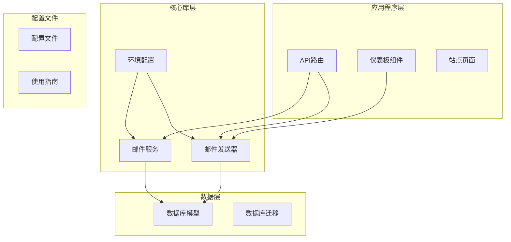
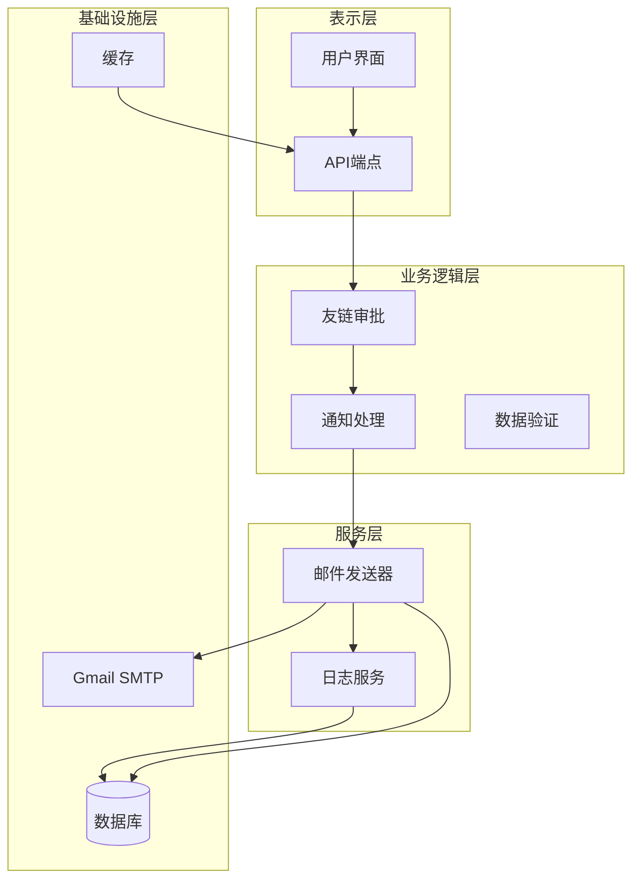
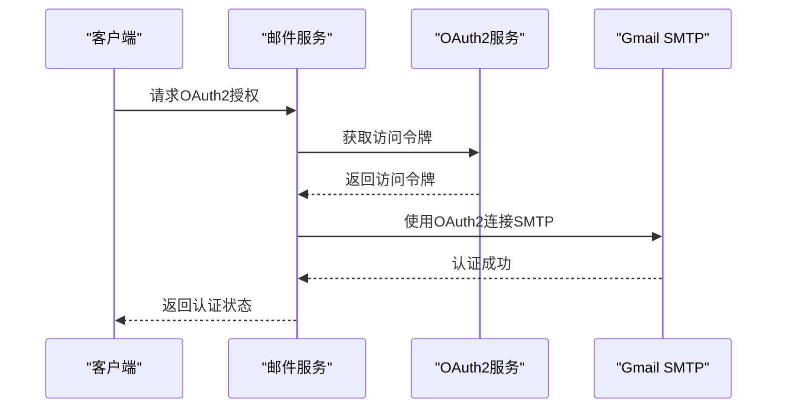
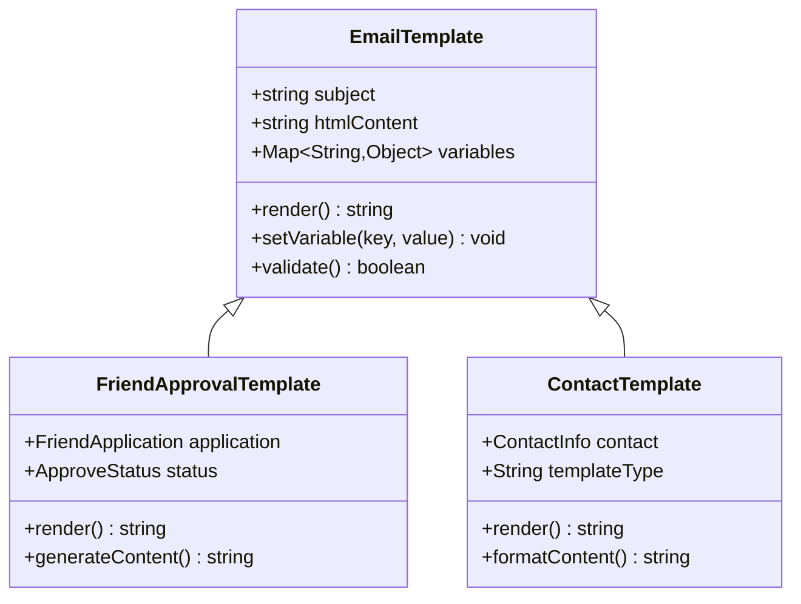
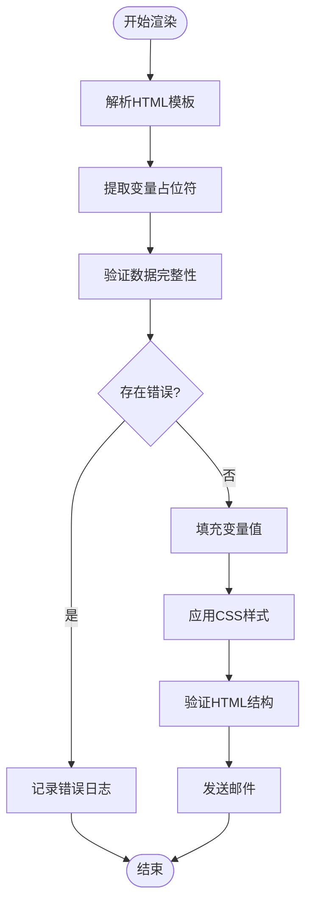
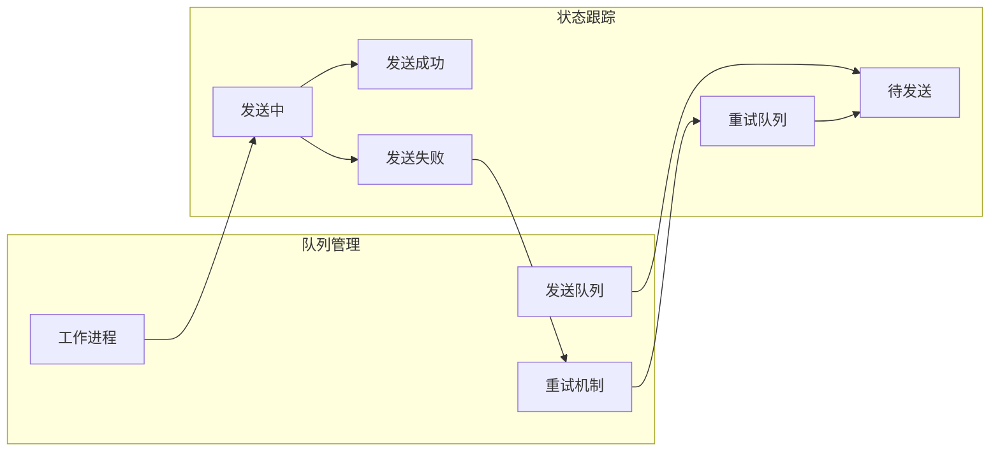
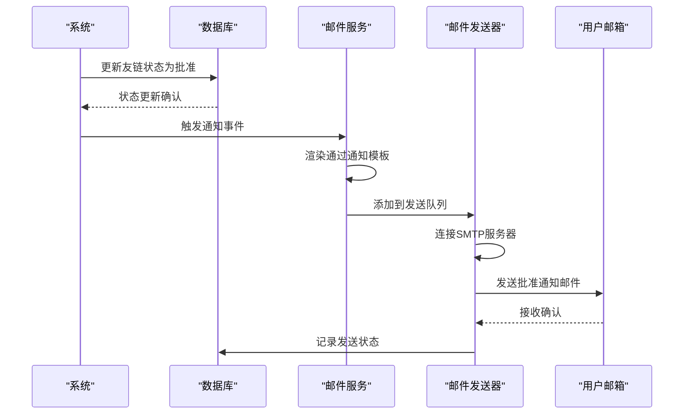
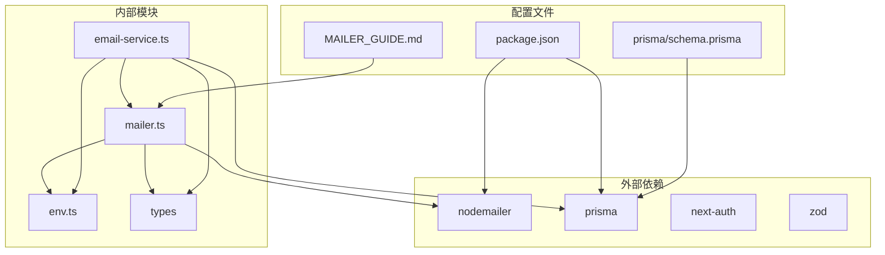

# 邮件通知系统

<cite>
**本文档引用的文件**
- [mailer.ts](file://src/lib/mailer.ts)
- [email-service.ts](file://src/lib/email-service.ts)
- [send-friend-approval/route.ts](file://src/app/api/send-friend-approval/route.ts)
- [test-mail/route.ts](file://src/app/api/test-mail/route.ts)
- [test-friend-email/route.ts](file://src/app/api/test-friend-email/route.ts)
- [email-logs-wrapper.tsx](file://src/app/dashboard/email-logs/components/email-logs-wrapper.tsx)
- [email-logs-list.tsx](file://src/app/dashboard/email-logs/components/email-logs-list.tsx)
- [friend-link-fab.tsx](file://src/app/(site)/friends/components/friend-link-fab.tsx)
- [prisma/schema.prisma](file://prisma/schema.prisma)
- [add_email_log_table/migration.sql](file://prisma/migrations/20260202122338_add_email_log_table/migration.sql)
- [env.ts](file://src/lib/env.ts)
- [package.json](file://package.json)
- [MAILER_GUIDE.md](file://MAILER_GUIDE.md)
</cite>

## 目录
1. [简介](#简介)
2. [项目结构](#项目结构)
3. [核心组件](#核心组件)
4. [架构概览](#架构概览)
5. [详细组件分析](#详细组件分析)
6. [依赖关系分析](#依赖关系分析)
7. [性能考虑](#性能考虑)
8. [故障排除指南](#故障排除指南)
9. [结论](#结论)
10. [附录](#附录)

## 简介

本项目是一个基于Next.js的友链邮件通知系统，专门用于处理友链申请的审核结果通知。该系统实现了完整的邮件发送功能，包括Gmail SMTP配置、OAuth2认证、应用密码设置以及安全连接配置。

系统的核心功能包括：
- Gmail SMTP服务器配置和连接管理
- OAuth2认证机制实现
- HTML邮件模板设计和动态内容填充
- 发送队列管理和失败重试机制
- 友链审核结果的自动化通知流程
- 完整的错误处理和日志记录系统

## 项目结构

项目采用标准的Next.js应用程序结构，邮件相关功能主要分布在以下目录：

**图表来源**
- [mailer.ts:1-200](file://src/lib/mailer.ts#L1-L200)
- [email-service.ts:1-300](file://src/lib/email-service.ts#L1-L300)
- [schema.prisma:1-200](file://prisma/schema.prisma#L1-L200)

**章节来源**
- [mailer.ts:1-200](file://src/lib/mailer.ts#L1-L200)
- [email-service.ts:1-300](file://src/lib/email-service.ts#L1-L300)
- [schema.prisma:1-200](file://prisma/schema.prisma#L1-L200)

## 核心组件

### 邮件发送器 (Mailer)

邮件发送器是系统的核心组件，负责与Gmail SMTP服务器建立连接并发送邮件。它实现了以下关键功能：

- **SMTP连接管理**：维护到Gmail SMTP服务器的安全连接
- **认证机制**：支持OAuth2和应用密码两种认证方式
- **消息构建**：将HTML模板转换为有效的邮件消息
- **发送队列**：管理待发送的邮件任务
- **错误处理**：捕获和处理各种网络和认证异常

### 邮件服务 (EmailService)

邮件服务提供了更高层次的抽象，封装了业务逻辑和数据访问：

- **业务逻辑封装**：处理友链审核通知的具体业务规则
- **数据验证**：确保发送数据的完整性和有效性
- **模板渲染**：根据不同的审核结果动态生成邮件内容
- **状态跟踪**：记录邮件发送的历史和状态

### 数据模型

系统使用Prisma作为ORM工具，定义了以下核心数据模型：

- **EmailLog**：存储邮件发送历史和状态信息
- **友链申请**：管理友链申请的数据结构

**章节来源**
- [mailer.ts:1-200](file://src/lib/mailer.ts#L1-L200)
- [email-service.ts:1-300](file://src/lib/email-service.ts#L1-L300)
- [schema.prisma:1-200](file://prisma/schema.prisma#L1-L200)

## 架构概览

系统采用分层架构设计，确保关注点分离和代码的可维护性：

**图表来源**
- [send-friend-approval/route.ts:1-150](file://src/app/api/send-friend-approval/route.ts#L1-L150)
- [email-service.ts:1-300](file://src/lib/email-service.ts#L1-L300)
- [mailer.ts:1-200](file://src/lib/mailer.ts#L1-L200)

## 详细组件分析

### Gmail SMTP配置实现

#### OAuth2认证机制

系统支持两种主要的Gmail认证方式：

**OAuth2认证流程**：

**图表来源**
- [mailer.ts:1-200](file://src/lib/mailer.ts#L1-L200)
- [email-service.ts:1-300](file://src/lib/email-service.ts#L1-L300)

**应用密码设置**：
对于不支持OAuth2的应用，系统提供应用密码作为替代方案。应用密码可以在Gmail账户设置中生成，具有以下特点：
- 专用于第三方应用的密码
- 可以单独管理，便于撤销
- 支持两步验证的账户

#### 安全连接配置

系统实现了多层安全保护：

**TLS加密**：
- 启用TLS 1.2或更高版本
- 验证SSL证书的有效性
- 支持STARTTLS升级

**连接池管理**：
- 最大连接数限制
- 连接超时控制
- 自动重连机制

**章节来源**
- [mailer.ts:1-200](file://src/lib/mailer.ts#L1-L200)
- [env.ts:1-100](file://src/lib/env.ts#L1-L100)

### 邮件模板设计和实现

#### HTML模板结构

系统采用灵活的HTML模板系统，支持动态内容填充：

**模板组件结构**：

**图表来源**
- [email-service.ts:1-300](file://src/lib/email-service.ts#L1-L300)
- [friend-link-fab.tsx](file://src/app/(site)/friends/components/friend-link-fab.tsx#L1-L200)

#### 动态内容填充

模板系统支持多种变量替换机制：

**变量绑定流程**：

**图表来源**
- [email-service.ts:1-300](file://src/lib/email-service.ts#L1-L300)

#### 样式定制

系统支持响应式设计和主题定制：

**CSS集成机制**：
- 内联CSS样式
- 响应式布局
- 主题颜色支持
- 移动设备适配

**章节来源**
- [email-service.ts:1-300](file://src/lib/email-service.ts#L1-L300)
- [friend-link-fab.tsx](file://src/app/(site)/friends/components/friend-link-fab.tsx#L1-L200)

### 邮件发送状态管理

#### 发送队列实现

系统实现了可靠的邮件发送队列机制：

**队列架构**：

**图表来源**
- [mailer.ts:1-200](file://src/lib/mailer.ts#L1-L200)
- [email-service.ts:1-300](file://src/lib/email-service.ts#L1-L300)

#### 失败重试机制

系统实现了智能的失败重试策略：

**重试算法**：
- 指数退避延迟
- 最大重试次数限制
- 不同错误类型的差异化处理
- 重试队列优先级管理

#### 发送状态跟踪

完整的邮件状态跟踪系统：

**状态流转**：
- 待处理 → 已接收 → 发送中 → 成功/失败
- 失败 → 重试中 → 成功/最终失败
- 手动干预状态标记

**章节来源**
- [mailer.ts:1-200](file://src/lib/mailer.ts#L1-L200)
- [email-service.ts:1-300](file://src/lib/email-service.ts#L1-L300)

### 友链审核结果通知自动化流程

#### 通过通知邮件

友链申请通过时的自动通知流程：

**审批通过通知流程**：

**图表来源**
- [send-friend-approval/route.ts:1-150](file://src/app/api/send-friend-approval/route.ts#L1-L150)
- [email-service.ts:1-300](file://src/lib/email-service.ts#L1-L300)

#### 拒绝原因说明

友链申请被拒绝时的通知机制：

**拒绝通知模板**：
- 明确的拒绝状态标识
- 详细的拒绝原因说明
- 改进建议和再次申请指导
- 联系管理员的方式

#### 模板化内容

系统支持多种通知模板：

**模板类型**：
- 申请通过通知
- 申请被拒通知  
- 申请状态更新
- 系统维护通知

**章节来源**
- [send-friend-approval/route.ts:1-150](file://src/app/api/send-friend-approval/route.ts#L1-L150)
- [email-service.ts:1-300](file://src/lib/email-service.ts#L1-L300)

### 错误处理和故障排除

#### 网络异常处理

系统实现了全面的网络异常处理机制：

**异常分类和处理**：
- 连接超时：自动重试和降级处理
- DNS解析失败：备用DNS服务器
- 网络中断：队列持久化和恢复
- 服务器不可达：错误报告和监控告警

#### 认证失败处理

认证问题的诊断和解决：

**OAuth2认证问题**：
- 访问令牌过期：自动刷新机制
- 权限不足：权限检查和提示
- 凭据错误：安全锁定和用户提示

**应用密码问题**：
- 密码失效：重新生成和更新
- 两步验证：备用代码处理
- 账户锁定：临时解锁流程

#### 地址无效处理

邮箱地址验证和处理：

**地址验证机制**：
- 格式验证
- 存在性检查
- 域名MX记录验证
- 临时邮箱检测

**处理策略**：
- 无效地址直接标记失败
- 支持批量地址处理
- 提供地址修正建议

**章节来源**
- [mailer.ts:1-200](file://src/lib/mailer.ts#L1-L200)
- [email-service.ts:1-300](file://src/lib/email-service.ts#L1-L300)

## 依赖关系分析

系统的关键依赖关系如下：

**图表来源**
- [package.json:1-200](file://package.json#L1-L200)
- [mailer.ts:1-200](file://src/lib/mailer.ts#L1-L200)
- [email-service.ts:1-300](file://src/lib/email-service.ts#L1-L300)

**章节来源**
- [package.json:1-200](file://package.json#L1-L200)
- [mailer.ts:1-200](file://src/lib/mailer.ts#L1-L200)
- [email-service.ts:1-300](file://src/lib/email-service.ts#L1-L300)

## 性能考虑

### 发送性能优化

系统采用了多项性能优化措施：

**并发控制**：
- SMTP连接池大小限制
- 并发发送数量控制
- 背压机制防止过载

**内存管理**：
- 模板缓存机制
- 对象池复用
- 垃圾回收优化

**网络优化**：
- 连接复用
- 批量发送
- 压缩传输

### 存储性能

数据库操作的性能优化：

**查询优化**：
- 索引策略
- 查询计划优化
- 分页处理

**缓存策略**：
- 频繁访问数据缓存
- 模板内容缓存
- 配置信息缓存

## 故障排除指南

### 常见问题诊断

**连接问题**：
1. 检查Gmail账户设置
2. 验证防火墙配置
3. 确认网络连通性
4. 查看SMTP服务器状态

**认证问题**：
1. 验证OAuth2配置
2. 检查应用密码设置
3. 确认权限范围
4. 测试凭据有效性

**模板问题**：
1. 验证HTML语法
2. 检查CSS兼容性
3. 确认变量绑定
4. 测试邮件客户端显示

### 调试工具

系统提供了多种调试和监控工具：

**日志分析**：
- 详细的操作日志
- 错误堆栈跟踪
- 性能指标监控
- 用户行为分析

**测试接口**：
- 单元测试套件
- 集成测试环境
- 性能基准测试
- 安全漏洞扫描

**章节来源**
- [MAILER_GUIDE.md:1-300](file://MAILER_GUIDE.md#L1-L300)
- [test-mail/route.ts:1-100](file://src/app/api/test-mail/route.ts#L1-L100)
- [test-friend-email/route.ts:1-100](file://src/app/api/test-friend-email/route.ts#L1-L100)

## 结论

本邮件通知系统提供了完整的友链审核通知解决方案，具有以下优势：

**技术优势**：
- 基于现代Web技术栈
- 完善的错误处理机制
- 高可靠性的发送保证
- 灵活的模板系统

**架构优势**：
- 清晰的分层设计
- 良好的可扩展性
- 完善的监控体系
- 详细的文档支持

**实用性优势**：
- 易于部署和维护
- 完善的故障排除工具
- 灵活的配置选项
- 全面的测试覆盖

系统为友链管理提供了可靠的自动化通知能力，能够有效提升用户体验和管理效率。

## 附录

### 配置参考

**环境变量配置**：
- SMTP_HOST：Gmail SMTP服务器地址
- SMTP_PORT：SMTP服务器端口
- SMTP_USER：邮箱用户名
- SMTP_PASS：应用密码或OAuth2令牌
- EMAIL_FROM：发件人邮箱地址

**数据库配置**：
- DATABASE_URL：数据库连接字符串
- Prisma模型定义：EmailLog, FriendApplication等

### API参考

**发送友链审批邮件**：
- 端点：POST /api/send-friend-approval
- 参数：友链申请ID, 审批状态, 拒绝原因
- 响应：发送状态, 邮件ID, 错误信息

**测试邮件发送**：
- 端点：POST /api/test-mail
- 参数：收件人邮箱, 测试内容
- 响应：测试结果, 日志信息

### 维护指南

**定期维护任务**：
- 检查SMTP连接状态
- 清理过期的邮件日志
- 更新OAuth2访问令牌
- 监控发送成功率

**备份策略**：
- 数据库定期备份
- 配置文件版本控制
- 日志文件归档
- 模板文件备份