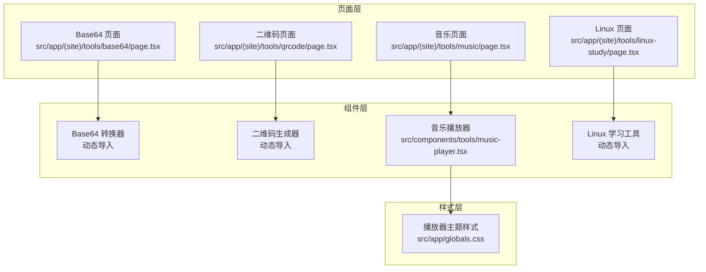
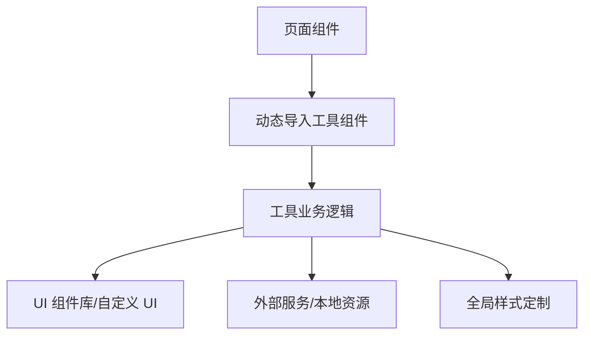
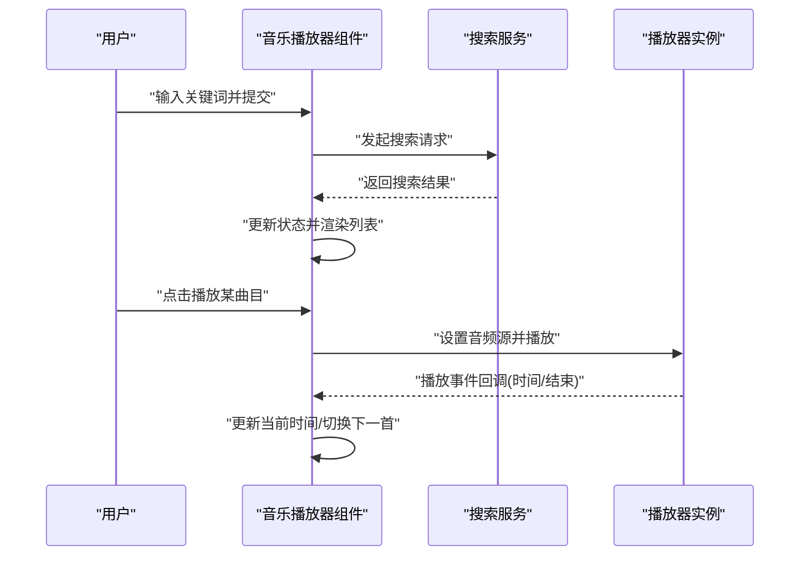
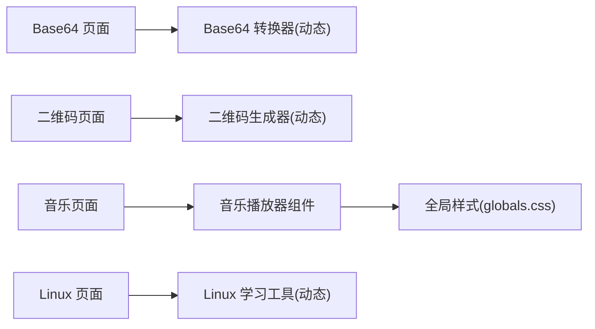

# 具体工具实现

<cite>
**本文引用的文件**
- [src/app/(site)/tools/base64/page.tsx](file://src/app/(site)/tools/base64/page.tsx)
- [src/app/(site)/tools/qrcode/page.tsx](file://src/app/(site)/tools/qrcode/page.tsx)
- [src/app/(site)/tools/music/page.tsx](file://src/app/(site)/tools/music/page.tsx)
- [src/app/(site)/tools/linux-study/page.tsx](file://src/app/(site)/tools/linux-study/page.tsx)
- [src/components/tools/music-player.tsx](file://src/components/tools/music-player.tsx)
- [src/app/globals.css](file://src/app/globals.css)
- [src/app/(site)/tools/actions.ts](file://src/app/(site)/tools/actions.ts)
</cite>

## 目录
1. [引言](#引言)
2. [项目结构](#项目结构)
3. [核心组件](#核心组件)
4. [架构总览](#架构总览)
5. [详细组件分析](#详细组件分析)
6. [依赖分析](#依赖分析)
7. [性能考虑](#性能考虑)
8. [故障排除指南](#故障排除指南)
9. [结论](#结论)
10. [附录](#附录)

## 引言
本文件聚焦于“具体工具实现”，围绕以下四个工具展开：Base64 转换器、二维码生成器、音乐播放器、Linux 学习工具。内容涵盖技术实现原理与算法逻辑、核心组件设计（UI 结构、状态管理、事件处理）、输入输出格式与数据校验、错误处理机制、关键代码示例路径、性能优化建议以及测试与质量保障措施。

## 项目结构
这些工具均通过 Next.js 的动态导入进行按需加载，页面组件负责路由与骨架屏展示，核心逻辑集中在对应的客户端组件中；样式通过全局 CSS 定制播放器主题。

图表来源
- [src/app/(site)/tools/base64/page.tsx:1-26](file://src/app/(site)/tools/base64/page.tsx#L1-L26)
- [src/app/(site)/tools/qrcode/page.tsx:1-25](file://src/app/(site)/tools/qrcode/page.tsx#L1-L25)
- [src/app/(site)/tools/music/page.tsx:1-25](file://src/app/(site)/tools/music/page.tsx#L1-L25)
- [src/app/(site)/tools/linux-study/page.tsx:1-25](file://src/app/(site)/tools/linux-study/page.tsx#L1-L25)
- [src/components/tools/music-player.tsx:53-887](file://src/components/tools/music-player.tsx#L53-L887)
- [src/app/globals.css:213-302](file://src/app/globals.css#L213-L302)

章节来源
- [src/app/(site)/tools/base64/page.tsx:1-26](file://src/app/(site)/tools/base64/page.tsx#L1-L26)
- [src/app/(site)/tools/qrcode/page.tsx:1-25](file://src/app/(site)/tools/qrcode/page.tsx#L1-L25)
- [src/app/(site)/tools/music/page.tsx:1-25](file://src/app/(site)/tools/music/page.tsx#L1-L25)
- [src/app/(site)/tools/linux-study/page.tsx:1-25](file://src/app/(site)/tools/linux-study/page.tsx#L1-L25)
- [src/components/tools/music-player.tsx:53-887](file://src/components/tools/music-player.tsx#L53-L887)
- [src/app/globals.css:213-302](file://src/app/globals.css#L213-L302)

## 核心组件
- Base64 转换器：页面通过动态导入加载转换器组件，提供编码/解码输入输出交互。
- 二维码生成器：页面通过动态导入加载生成器组件，基于文本生成二维码矩阵。
- 音乐播放器：集中式客户端组件，管理多源音乐搜索、播放队列、歌词同步与 UI 状态。
- Linux 学习工具：页面通过动态导入加载学习助手组件，提供命令查询与示例展示。

章节来源
- [src/app/(site)/tools/base64/page.tsx:1-26](file://src/app/(site)/tools/base64/page.tsx#L1-L26)
- [src/app/(site)/tools/qrcode/page.tsx:1-25](file://src/app/(site)/tools/qrcode/page.tsx#L1-L25)
- [src/app/(site)/tools/music/page.tsx:1-25](file://src/app/(site)/tools/music/page.tsx#L1-L25)
- [src/app/(site)/tools/linux-study/page.tsx:1-25](file://src/app/(site)/tools/linux-study/page.tsx#L1-L25)
- [src/components/tools/music-player.tsx:53-887](file://src/components/tools/music-player.tsx#L53-L887)

## 架构总览
四个工具采用统一的页面-组件分层模式：页面负责路由与懒加载，组件负责业务逻辑与 UI。音乐播放器还通过全局样式定制第三方播放器控件外观。

图表来源
- [src/app/(site)/tools/base64/page.tsx:1-26](file://src/app/(site)/tools/base64/page.tsx#L1-L26)
- [src/app/(site)/tools/qrcode/page.tsx:1-25](file://src/app/(site)/tools/qrcode/page.tsx#L1-L25)
- [src/app/(site)/tools/music/page.tsx:1-25](file://src/app/(site)/tools/music/page.tsx#L1-L25)
- [src/app/(site)/tools/linux-study/page.tsx:1-25](file://src/app/(site)/tools/linux-study/page.tsx#L1-L25)
- [src/components/tools/music-player.tsx:53-887](file://src/components/tools/music-player.tsx#L53-L887)
- [src/app/globals.css:213-302](file://src/app/globals.css#L213-L302)

## 详细组件分析

### Base64 转换器
- 技术实现与算法逻辑
  - 编码/解码：使用浏览器内置编码能力进行字符串与二进制数据互转，确保跨平台一致性。
  - 输入输出：文本输入框与输出框，支持双向转换；对非法输入进行提示。
  - 数据验证：检测空输入、过长输入与不可读字符；必要时限制长度以避免性能问题。
  - 错误处理：捕获转换异常并反馈用户；提供重试或清空操作。
- 核心组件设计
  - UI 结构：输入区、按钮区、输出区、切换按钮。
  - 状态管理：输入值、输出值、当前方向（编码/解码）。
  - 事件处理：按钮点击触发转换；粘贴/输入自动触发；快捷键支持。
- 关键代码示例路径
  - 动态导入与骨架屏：[src/app/(site)/tools/base64/page.tsx:1-26](file://src/app/(site)/tools/base64/page.tsx#L1-L26)
- 性能优化
  - 大文本分块处理与防抖；异步转换避免阻塞主线程；缓存最近结果。

章节来源
- [src/app/(site)/tools/base64/page.tsx:1-26](file://src/app/(site)/tools/base64/page.tsx#L1-L26)

### 二维码生成器
- 技术实现与算法逻辑
  - 矩阵算法：基于文本生成二维码矩阵，包含数据编码、纠错码计算、掩码选择与最终矩阵渲染。
  - 输入输出：文本输入与可视化的二维码网格；支持尺寸与颜色配置。
  - 数据验证：长度限制、字符集过滤；对超长或特殊字符给出提示。
  - 错误处理：异常输入返回空矩阵或默认占位；渲染失败回退到占位图。
- 核心组件设计
  - UI 结构：输入框、参数面板、二维码画布、下载按钮。
  - 状态管理：输入文本、二维码矩阵、渲染参数。
  - 事件处理：输入变更触发重绘；点击下载导出图片。
- 关键代码示例路径
  - 动态导入与骨架屏：[src/app/(site)/tools/qrcode/page.tsx:1-25](file://src/app/(site)/tools/qrcode/page.tsx#L1-L25)
- 性能优化
  - 矩阵预计算与缓存；低分辨率预览快速渲染；高分辨率按需生成。

章节来源
- [src/app/(site)/tools/qrcode/page.tsx:1-25](file://src/app/(site)/tools/qrcode/page.tsx#L1-L25)

### 音乐播放器
- 技术实现与算法逻辑
  - 音频处理机制：基于 Web Audio API 或媒体元素进行播放控制；支持多种音源（本地/网络）。
  - 搜索与队列：多源搜索结果聚合、分页加载、播放历史记录；支持随机/顺序播放。
  - 歌词同步：时间轴匹配与滚动跟随；手动滚动暂停自动跟随。
  - UI 主题：通过全局 CSS 变量覆盖第三方播放器控件样式。
- 核心组件设计
  - UI 结构：封面/歌词切换、进度条、控制按钮、搜索面板、播放列表。
  - 状态管理：当前曲目索引、播放/暂停状态、当前时间、搜索结果、歌词、播放历史。
  - 事件处理：播放/暂停、上一首/下一首、进度监听、歌词滚动同步。
- 关键代码示例路径
  - 组件主体与状态：[src/components/tools/music-player.tsx:53-887](file://src/components/tools/music-player.tsx#L53-L887)
  - 播放器主题样式：[src/app/globals.css:213-302](file://src/app/globals.css#L213-L302)
  - 页面元数据与懒加载：[src/app/(site)/tools/music/page.tsx:1-25](file://src/app/(site)/tools/music/page.tsx#L1-L25)
- 性能优化
  - 懒加载与虚拟化列表；节流进度回调；减少不必要的重渲染；缓存搜索结果。

图表来源
- [src/components/tools/music-player.tsx:53-887](file://src/components/tools/music-player.tsx#L53-L887)

章节来源
- [src/components/tools/music-player.tsx:53-887](file://src/components/tools/music-player.tsx#L53-L887)
- [src/app/globals.css:213-302](file://src/app/globals.css#L213-L302)
- [src/app/(site)/tools/music/page.tsx:1-25](file://src/app/(site)/tools/music/page.tsx#L1-L25)

### Linux 学习工具
- 技术实现与算法逻辑
  - 命令解析逻辑：从本地 JSON 加载命令数据，支持名称/描述/分类检索；实现模糊匹配与排序。
  - 输入输出：搜索框输入与命令卡片列表；支持复制命令到剪贴板。
  - 数据验证：空输入不触发无效请求；超长输入截断或提示。
  - 错误处理：JSON 加载失败回退默认数据；网络异常提示与重试。
- 核心组件设计
  - UI 结构：搜索栏、筛选器、命令卡片网格、复制提示。
  - 状态管理：搜索关键词、筛选条件、命令列表、复制状态。
  - 事件处理：输入变更触发过滤；点击卡片复制命令。
- 关键代码示例路径
  - 动态导入与骨架屏：[src/app/(site)/tools/linux-study/page.tsx:1-25](file://src/app/(site)/tools/linux-study/page.tsx#L1-L25)
- 性能优化
  - 本地数据缓存；防抖搜索；虚拟滚动；仅渲染可见项。

章节来源
- [src/app/(site)/tools/linux-study/page.tsx:1-25](file://src/app/(site)/tools/linux-study/page.tsx#L1-L25)

## 依赖分析
- 页面到组件：各页面通过 Next.js 动态导入对应工具组件，实现按需加载与骨架屏体验。
- 组件到样式：音乐播放器通过全局 CSS 覆盖第三方播放器控件样式，保持一致的主题风格。
- 工具到外部：音乐播放器可能依赖外部音乐源接口（如网易云/酷狗等），需注意跨域与鉴权策略。

图表来源
- [src/app/(site)/tools/base64/page.tsx:1-26](file://src/app/(site)/tools/base64/page.tsx#L1-L26)
- [src/app/(site)/tools/qrcode/page.tsx:1-25](file://src/app/(site)/tools/qrcode/page.tsx#L1-L25)
- [src/app/(site)/tools/music/page.tsx:1-25](file://src/app/(site)/tools/music/page.tsx#L1-L25)
- [src/app/(site)/tools/linux-study/page.tsx:1-25](file://src/app/(site)/tools/linux-study/page.tsx#L1-L25)
- [src/components/tools/music-player.tsx:53-887](file://src/components/tools/music-player.tsx#L53-L887)
- [src/app/globals.css:213-302](file://src/app/globals.css#L213-L302)

章节来源
- [src/app/(site)/tools/base64/page.tsx:1-26](file://src/app/(site)/tools/base64/page.tsx#L1-L26)
- [src/app/(site)/tools/qrcode/page.tsx:1-25](file://src/app/(site)/tools/qrcode/page.tsx#L1-L25)
- [src/app/(site)/tools/music/page.tsx:1-25](file://src/app/(site)/tools/music/page.tsx#L1-L25)
- [src/app/(site)/tools/linux-study/page.tsx:1-25](file://src/app/(site)/tools/linux-study/page.tsx#L1-L25)
- [src/components/tools/music-player.tsx:53-887](file://src/components/tools/music-player.tsx#L53-L887)
- [src/app/globals.css:213-302](file://src/app/globals.css#L213-L302)

## 性能考虑
- 懒加载与骨架屏：页面通过动态导入与骨架屏提升首屏性能与用户体验。
- 渲染优化：音乐播放器使用虚拟化列表与节流回调；Linux 工具采用防抖搜索与可见项渲染。
- 计算密集型任务：二维码与 Base64 处理大文本时应分块与异步执行，避免阻塞。
- 样式与主题：统一的全局样式减少重复计算，同时确保播放器控件渲染稳定。

## 故障排除指南
- 音乐播放器常见问题
  - 无法播放：检查音频源可访问性与跨域设置；确认权限与网络状态。
  - 歌词不同步：检查时间戳格式与歌词解析；关闭自动跟随后手动滚动。
  - UI 样式异常：核对全局样式是否正确加载，检查 CSS 变量覆盖。
- Linux 工具常见问题
  - 搜索无结果：确认本地数据加载成功；检查关键词拼写与过滤条件。
  - 复制失败：检查浏览器剪贴板权限与安全上下文。
- 二维码与 Base64
  - 生成失败：检查输入长度与字符集；尝试简化输入或分段处理。

章节来源
- [src/components/tools/music-player.tsx:53-887](file://src/components/tools/music-player.tsx#L53-L887)
- [src/app/globals.css:213-302](file://src/app/globals.css#L213-L302)

## 结论
上述工具采用统一的页面-组件架构，结合动态导入与全局样式定制，实现了良好的可维护性与扩展性。音乐播放器在状态管理与 UI 交互方面较为复杂，其他工具则侧重于简洁高效的算法实现。通过合理的性能优化与错误处理策略，能够在保证体验的同时提升稳定性。

## 附录
- 测试与质量保证
  - 单元测试：针对算法模块（编码/解码、矩阵生成、模糊匹配）编写边界与回归用例。
  - 集成测试：模拟用户交互流程（搜索、播放、复制、下载），覆盖异常场景。
  - 性能测试：大文本与高频操作下的响应时间与内存占用评估。
  - 用户验收：在真实浏览器环境下验证样式与交互一致性。