# 工具分类与管理

<cite>
**本文档引用的文件**
- [src/app/dashboard/tools/actions.ts](file://src/app/dashboard/tools/actions.ts)
- [src/app/(site)/tools/actions.ts](file://src/app/(site)/tools/actions.ts)
- [src/app/(site)/tools/components/toolbox-client.tsx](file://src/app/(site)/tools/components/toolbox-client.tsx)
- [src/app/dashboard/categories/schema.ts](file://src/app/dashboard/categories/schema.ts)
- [src/app/dashboard/categories/actions.ts](file://src/app/dashboard/categories/actions.ts)
- [prisma/schema.prisma](file://prisma/schema.prisma)
- [src/lib/db.ts](file://src/lib/db.ts)
- [src/config/admin-menu.ts](file://src/config/admin-menu.ts)
- [src/app/dashboard/ai-tools/actions.ts](file://src/app/dashboard/ai-tools/actions.ts)
- [src/app/(site)/ai-platform/actions.ts](file://src/app/(site)/ai-platform/actions.ts)
- [AGENTS.md](file://AGENTS.md)
</cite>

## 目录
1. [引言](#引言)
2. [项目结构](#项目结构)
3. [核心组件](#核心组件)
4. [架构概览](#架构概览)
5. [详细组件分析](#详细组件分析)
6. [依赖关系分析](#依赖关系分析)
7. [性能考虑](#性能考虑)
8. [故障排除指南](#故障排除指南)
9. [结论](#结论)

## 引言

本项目实现了完整的工具分类与管理系统，涵盖工具的全生命周期管理，包括分类体系、工具增删改查、状态管理、权限控制等功能。系统采用前后端分离架构，后端使用 Next.js Server Actions 和 Prisma ORM，前端使用 React 组件和 Tailwind CSS 样式框架。

系统支持两种工具类型：本地工具和外部工具。本地工具直接集成在应用中，外部工具通过链接形式展示。所有工具都支持分类管理、状态控制和权限验证。

## 项目结构

工具分类与管理系统主要分布在以下目录结构中：

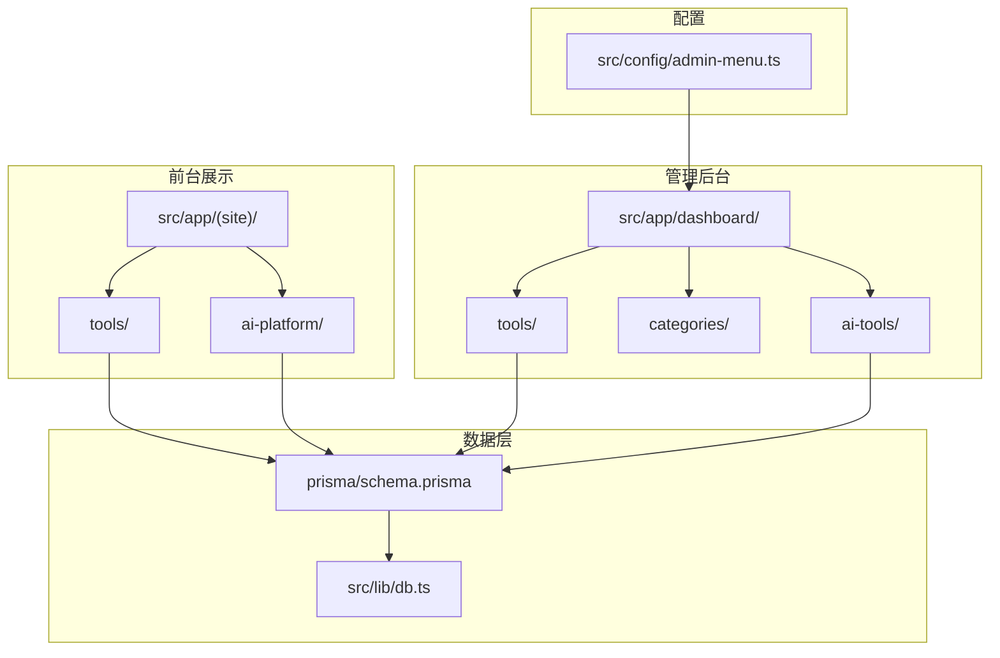

**图表来源**
- [src/app/dashboard/tools/actions.ts:1-142](file://src/app/dashboard/tools/actions.ts#L1-L142)
- [src/app/(site)/tools/actions.ts](file://src/app/(site)/tools/actions.ts#L1-L76)
- [prisma/schema.prisma:200-214](file://prisma/schema.prisma#L200-L214)

**章节来源**
- [AGENTS.md:204-234](file://AGENTS.md#L204-L234)
- [src/config/admin-menu.ts:105-113](file://src/config/admin-menu.ts#L105-L113)

## 核心组件

### 数据模型定义

系统使用 Prisma 定义了完整的工具数据模型，支持多种工具类型和状态管理：

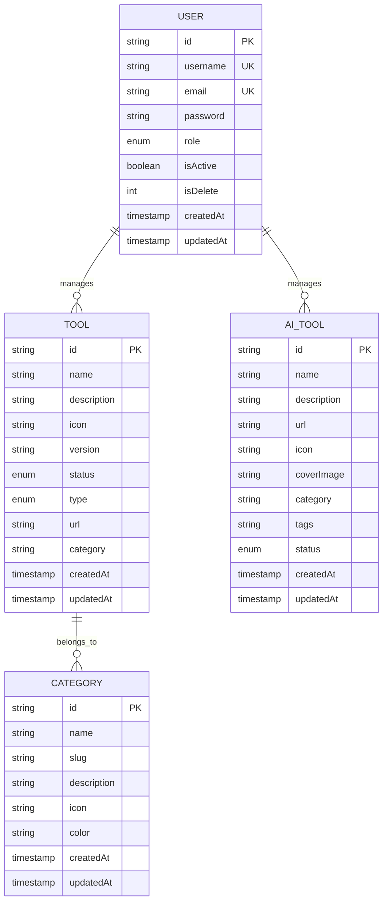

**图表来源**
- [prisma/schema.prisma:200-214](file://prisma/schema.prisma#L200-L214)
- [prisma/schema.prisma:184-198](file://prisma/schema.prisma#L184-L198)
- [prisma/schema.prisma:15-38](file://prisma/schema.prisma#L15-L38)

### 工具状态枚举

系统定义了完整的工具状态管理体系：

| 状态值 | 描述 | 颜色标识 | 用途场景 |
|--------|------|----------|----------|
| NORMAL | 正常运行 | 绿色 | 工具正常可用 |
| DEBUG | 调试模式 | 黄色 | 开发调试阶段 |
| UPDATE | 更新中 | 蓝色 | 工具升级维护 |
| MAINTENANCE | 维护中 | 红色 | 系统维护期间 |
| PENDING | 待审核 | 灰色 | 用户提交待审核 |

**章节来源**
- [prisma/schema.prisma:294-300](file://prisma/schema.prisma#L294-L300)
- [prisma/schema.prisma:289-293](file://prisma/schema.prisma#L289-L293)

## 架构概览

系统采用分层架构设计，实现了清晰的关注点分离：

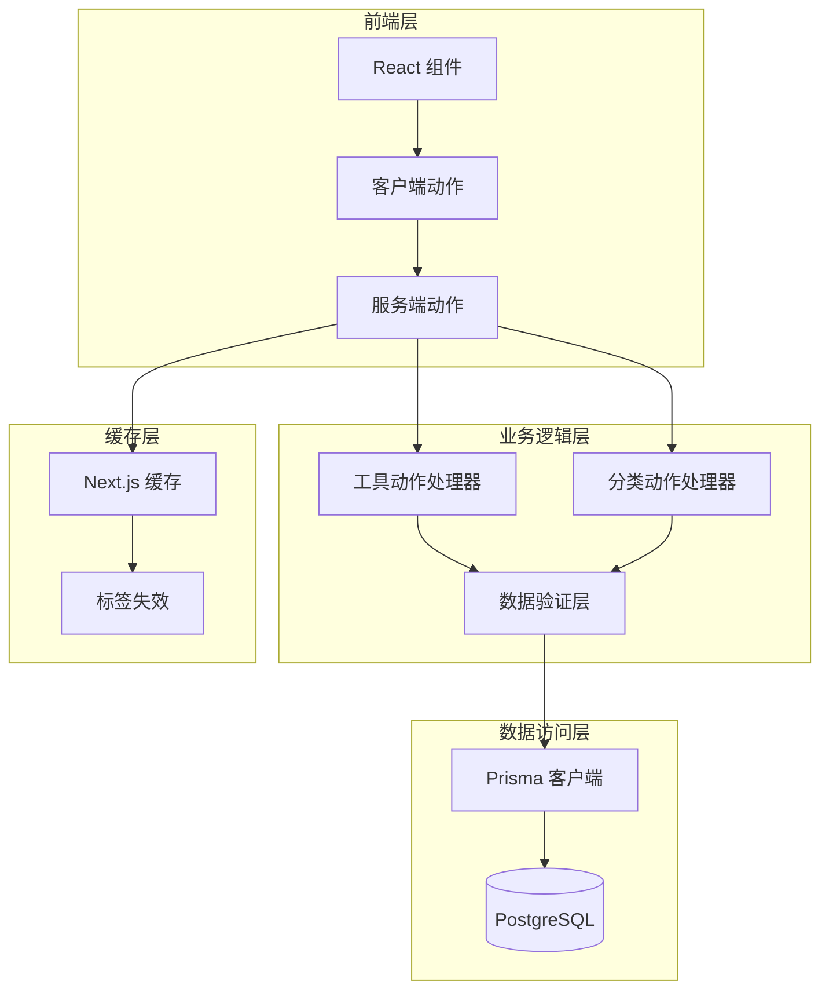

**图表来源**
- [src/app/dashboard/tools/actions.ts:1-142](file://src/app/dashboard/tools/actions.ts#L1-L142)
- [src/lib/db.ts:1-16](file://src/lib/db.ts#L1-L16)

## 详细组件分析

### 工具管理模块

#### 工具数据模型

工具模型定义了完整的工具属性结构：

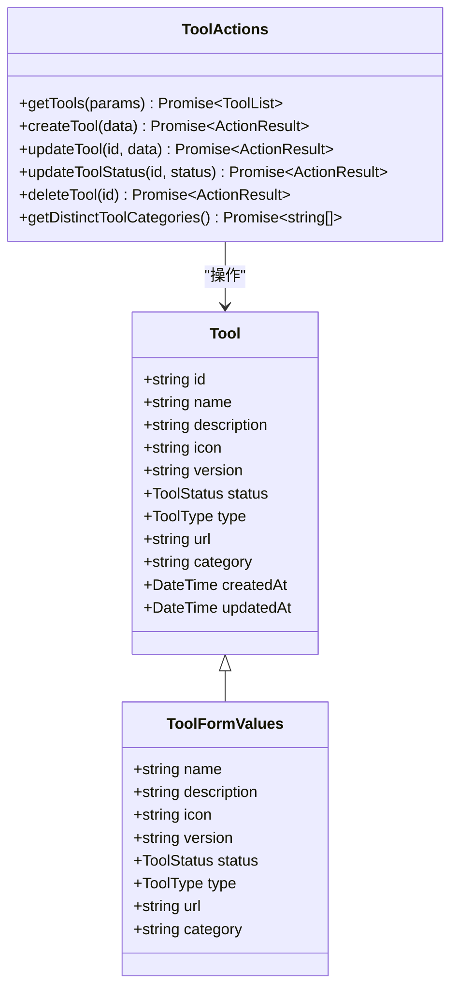

**图表来源**
- [prisma/schema.prisma:200-214](file://prisma/schema.prisma#L200-L214)
- [src/app/dashboard/tools/actions.ts:1-142](file://src/app/dashboard/tools/actions.ts#L1-L142)

#### 工具管理流程

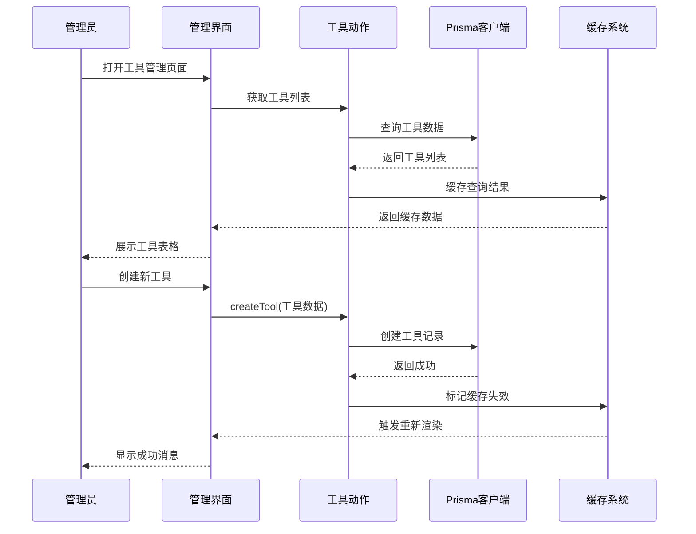

**图表来源**
- [src/app/dashboard/tools/actions.ts:90-101](file://src/app/dashboard/tools/actions.ts#L90-L101)
- [src/app/dashboard/tools/actions.ts:133-142](file://src/app/dashboard/tools/actions.ts#L133-L142)

**章节来源**
- [src/app/dashboard/tools/actions.ts:1-142](file://src/app/dashboard/tools/actions.ts#L1-L142)

### 分类管理模块

#### 分类模型设计

分类管理提供了完整的分类体系支持：

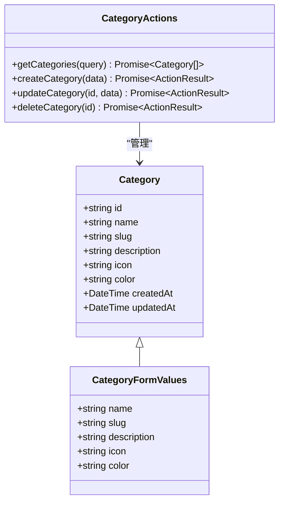

**图表来源**
- [prisma/schema.prisma:184-198](file://prisma/schema.prisma#L184-L198)
- [src/app/dashboard/categories/schema.ts:1-11](file://src/app/dashboard/categories/schema.ts#L1-L11)

#### 分类管理流程

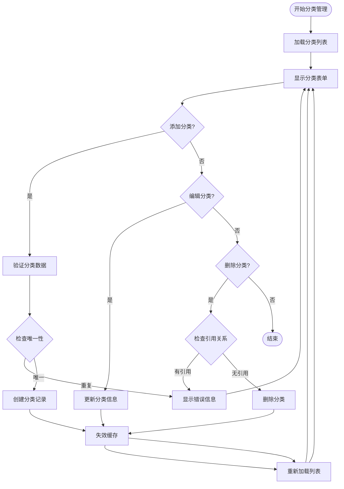

**图表来源**
- [src/app/dashboard/categories/actions.ts:33-53](file://src/app/dashboard/categories/actions.ts#L33-L53)
- [src/app/dashboard/categories/actions.ts:79-95](file://src/app/dashboard/categories/actions.ts#L79-L95)

**章节来源**
- [src/app/dashboard/categories/actions.ts:1-95](file://src/app/dashboard/categories/actions.ts#L1-L95)

### 前台工具展示模块

#### 工具展示架构

前台工具展示模块实现了完整的工具浏览体验：

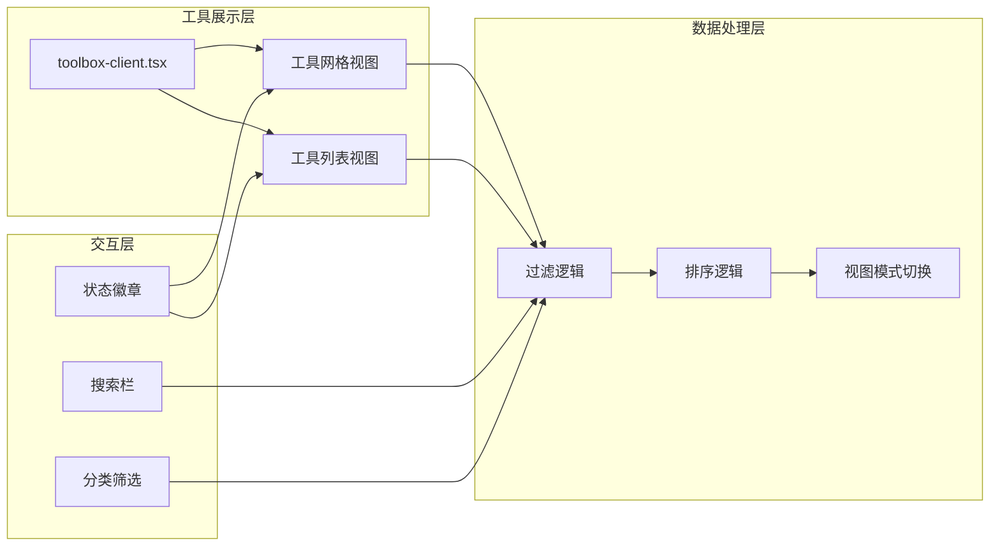

**图表来源**
- [src/app/(site)/tools/components/toolbox-client.tsx](file://src/app/(site)/tools/components/toolbox-client.tsx#L53-L240)

#### 工具展示流程

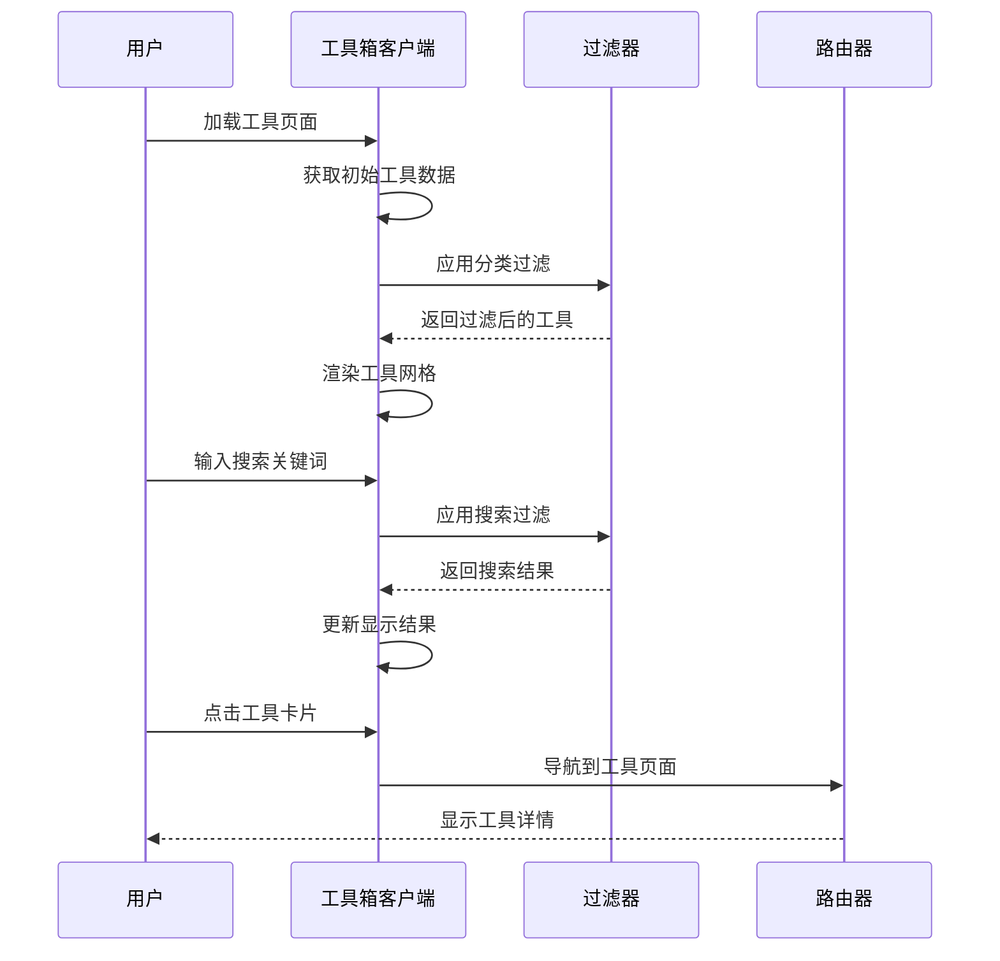

**图表来源**
- [src/app/(site)/tools/components/toolbox-client.tsx](file://src/app/(site)/tools/components/toolbox-client.tsx#L60-L66)
- [src/app/(site)/tools/components/toolbox-client.tsx](file://src/app/(site)/tools/components/toolbox-client.tsx#L196-L228)

**章节来源**
- [src/app/(site)/tools/components/toolbox-client.tsx](file://src/app/(site)/tools/components/toolbox-client.tsx#L1-L240)

### AI工具管理模块

#### AI工具分类体系

AI工具管理模块提供了专门的工具分类和审核机制：

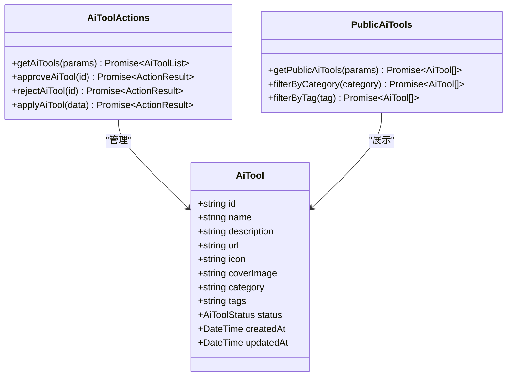

**图表来源**
- [prisma/schema.prisma:184-198](file://prisma/schema.prisma#L184-L198)
- [src/app/dashboard/ai-tools/actions.ts:1-64](file://src/app/dashboard/ai-tools/actions.ts#L1-L64)

**章节来源**
- [src/app/dashboard/ai-tools/actions.ts:1-64](file://src/app/dashboard/ai-tools/actions.ts#L1-L64)
- [src/app/(site)/ai-platform/actions.ts](file://src/app/(site)/ai-platform/actions.ts#L1-L57)

## 依赖关系分析

### 数据库依赖关系

系统使用 Prisma ORM 管理数据库连接和查询：

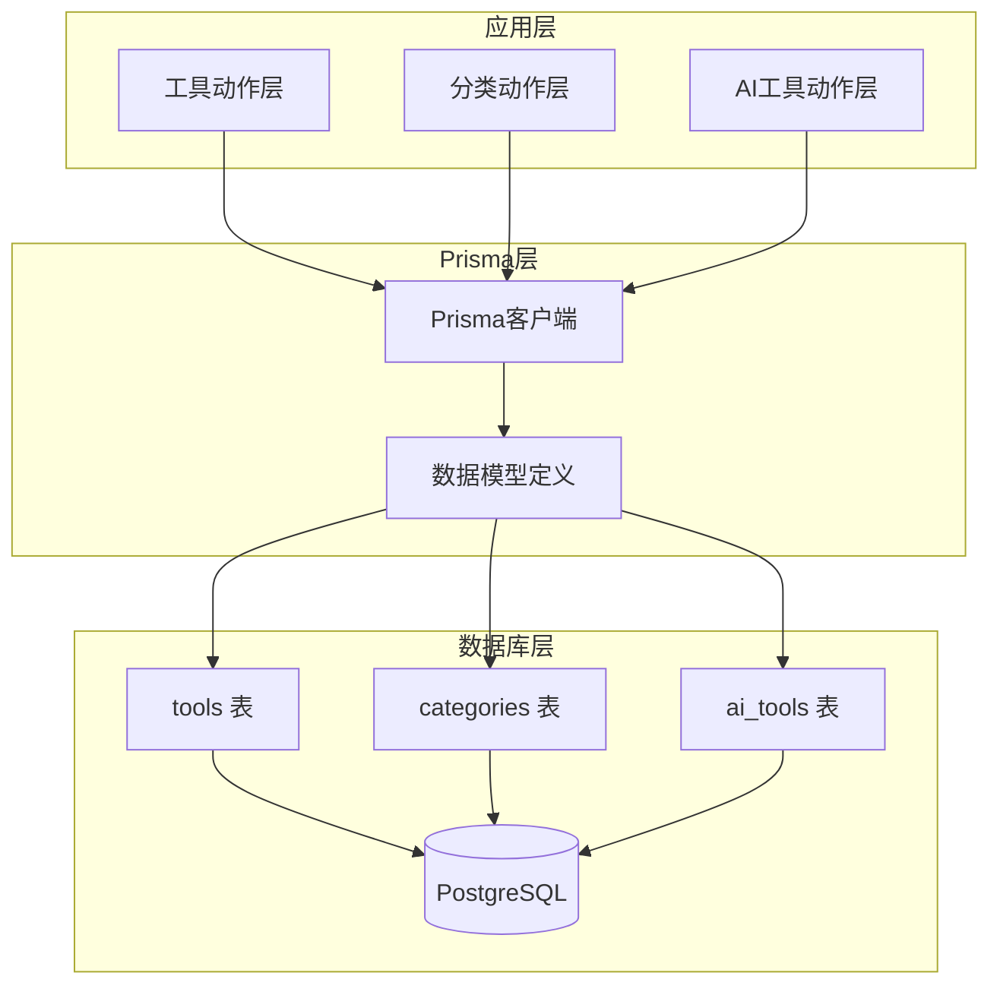

**图表来源**
- [src/lib/db.ts:1-16](file://src/lib/db.ts#L1-L16)
- [prisma/schema.prisma:200-214](file://prisma/schema.prisma#L200-L214)

### 缓存依赖关系

系统实现了智能的缓存失效机制：

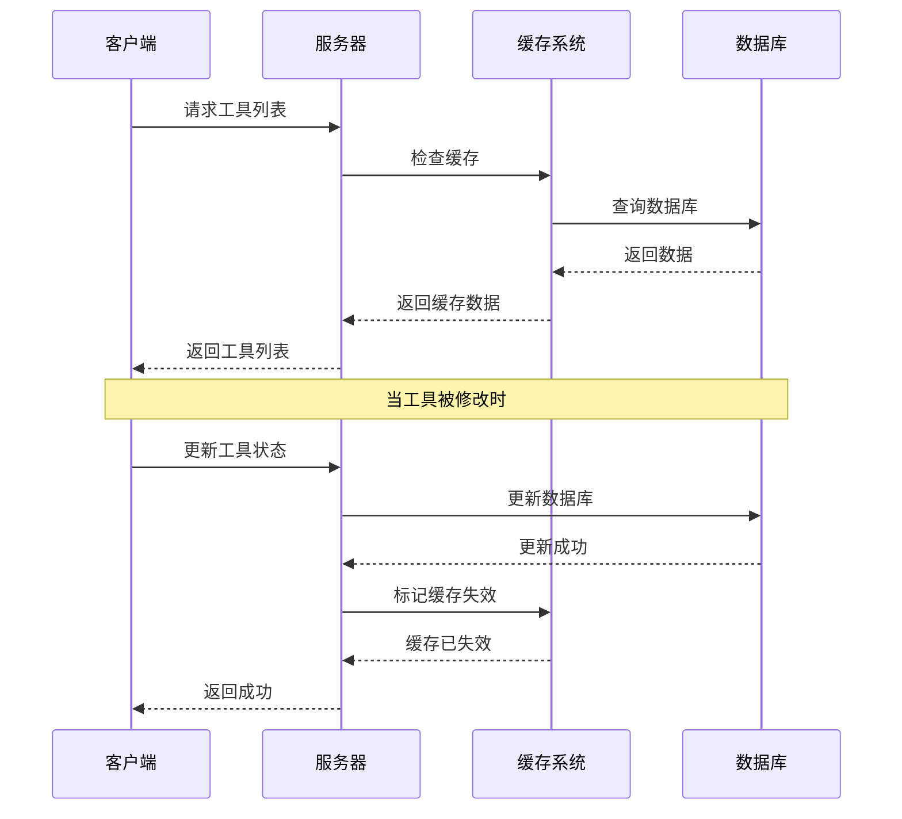

**图表来源**
- [src/app/dashboard/tools/actions.ts:97-100](file://src/app/dashboard/tools/actions.ts#L97-L100)
- [src/app/dashboard/tools/actions.ts:127-130](file://src/app/dashboard/tools/actions.ts#L127-L130)

**章节来源**
- [src/app/dashboard/tools/actions.ts:1-142](file://src/app/dashboard/tools/actions.ts#L1-L142)

## 性能考虑

### 缓存策略

系统采用了多层缓存策略来优化性能：

1. **Next.js 缓存**: 使用 `unstable_cache` 实现服务端缓存
2. **标签失效**: 通过标签系统精确控制缓存失效范围
3. **查询优化**: 使用 `relationJoins` 预览特性减少数据库往返

### 查询优化

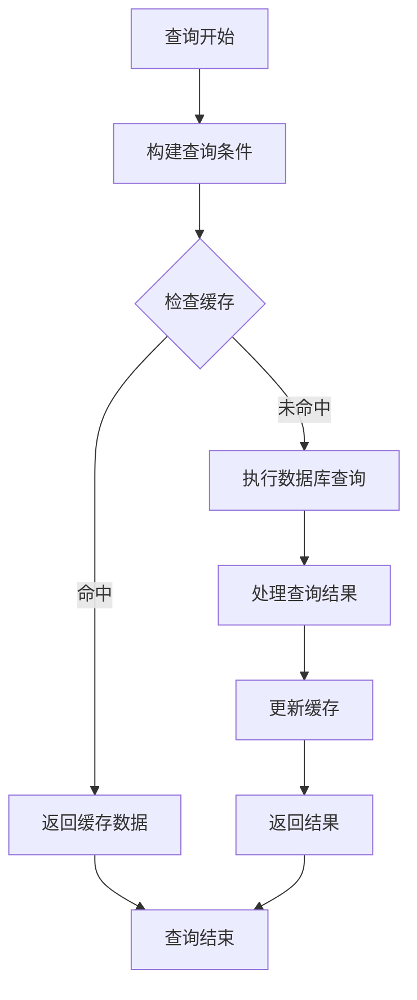

**图表来源**
- [src/app/dashboard/tools/actions.ts:24-52](file://src/app/dashboard/tools/actions.ts#L24-L52)

### 数据库优化

- **索引策略**: 在常用查询字段上建立适当索引
- **连接池管理**: 使用 Prisma 的连接池优化数据库连接
- **批量操作**: 支持批量查询和更新操作

## 故障排除指南

### 常见问题及解决方案

#### 工具状态异常

**问题**: 工具状态显示不正确
**原因**: 缓存未及时更新或数据库状态不同步
**解决方案**: 
1. 检查缓存标签失效是否正确触发
2. 验证数据库中的工具状态字段
3. 清理浏览器缓存后重试

#### 分类管理错误

**问题**: 删除分类时报错"分类仍有工具"
**原因**: 分类关联了工具记录
**解决方案**:
1. 先删除或转移关联的工具
2. 检查 `posts` 表中的 `categoryId` 字段
3. 重新尝试删除操作

#### 权限验证失败

**问题**: 无法访问管理后台
**原因**: 用户权限不足或会话过期
**解决方案**:
1. 检查用户角色是否为管理员
2. 重新登录系统
3. 验证路由守卫配置

**章节来源**
- [src/app/dashboard/categories/actions.ts:84-86](file://src/app/dashboard/categories/actions.ts#L84-L86)

### 调试技巧

1. **启用开发日志**: 在开发环境中查看 Prisma 查询日志
2. **检查网络请求**: 使用浏览器开发者工具监控 API 调用
3. **验证数据格式**: 确保前端表单数据符合后端验证规则
4. **测试缓存行为**: 验证缓存失效机制是否正常工作

## 结论

工具分类与管理系统实现了完整的工具生命周期管理功能，具有以下特点：

1. **模块化设计**: 采用清晰的分层架构，职责分离明确
2. **数据一致性**: 通过 Prisma ORM 确保数据完整性和类型安全
3. **性能优化**: 实现了多层缓存和查询优化策略
4. **用户体验**: 提供直观的管理界面和流畅的操作体验
5. **扩展性强**: 支持新的工具类型和分类需求

系统支持从简单的本地工具到复杂的外部工具管理，满足不同场景下的工具分类与管理需求。通过合理的架构设计和实现细节，为用户提供了一个功能完善、性能优异的工具管理解决方案。