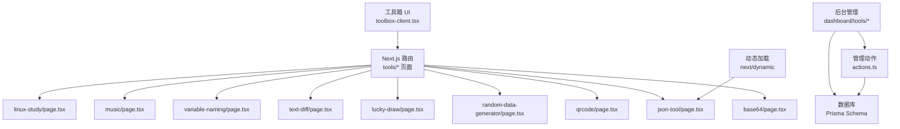
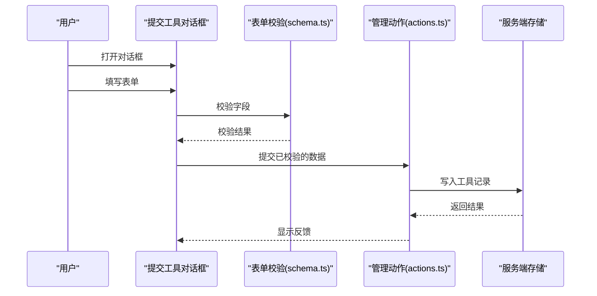
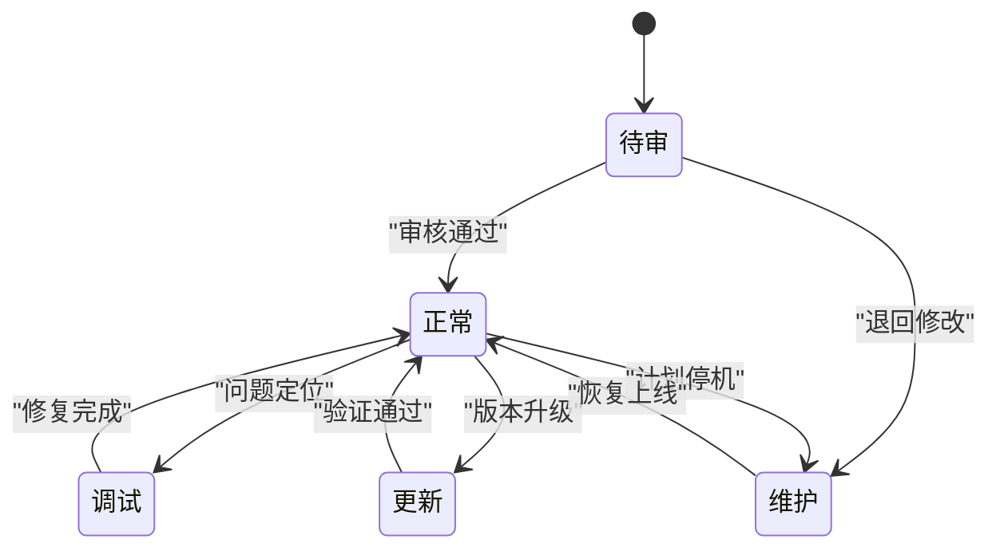
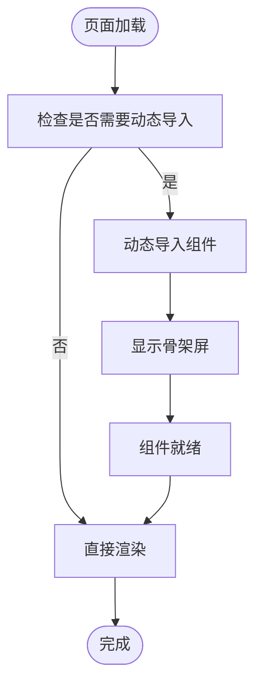
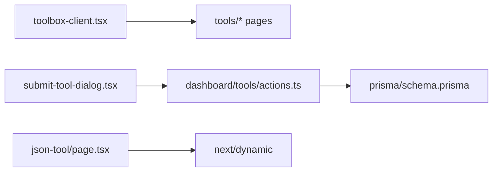

# 工具扩展机制

<cite>
**本文引用的文件**
- [src/app/(site)/tools/schema.ts](file://src/app/(site)/tools/schema.ts)
- [src/app/(site)/tools/actions.ts](file://src/app/(site)/tools/actions.ts)
- [src/app/dashboard/tools/actions.ts](file://src/app/dashboard/tools/actions.ts)
- [src/app/dashboard/tools/schema.ts](file://src/app/dashboard/tools/schema.ts)
- [src/app/(site)/tools/components/submit-tool-dialog.tsx](file://src/app/(site)/tools/components/submit-tool-dialog.tsx)
- [src/app/(site)/tools/components/toolbox-client.tsx](file://src/app/(site)/tools/components/toolbox-client.tsx)
- [src/app/(site)/tools/page.tsx](file://src/app/(site)/tools/page.tsx)
- [src/app/(site)/json-tool/page.tsx](file://src/app/(site)/json-tool/page.tsx)
- [src/app/(site)/tools/lucky-draw/page.tsx](file://src/app/(site)/tools/lucky-draw/page.tsx)
- [src/app/(site)/tools/random-data-generator/page.tsx](file://src/app/(site)/tools/random-data-generator/page.tsx)
- [src/app/(site)/tools/text-diff/page.tsx](file://src/app/(site)/tools/text-diff/page.tsx)
- [src/app/(site)/tools/variable-naming/page.tsx](file://src/app/(site)/tools/variable-naming/page.tsx)
- [src/app/(site)/tools/music/page.tsx](file://src/app/(site)/tools/music/page.tsx)
- [src/app/(site)/tools/qrcode/page.tsx](file://src/app/(site)/tools/qrcode/page.tsx)
- [src/app/(site)/tools/base64/page.tsx](file://src/app/(site)/tools/base64/page.tsx)
- [src/app/(site)/tools/linux-study/page.tsx](file://src/app/(site)/tools/linux-study/page.tsx)
- [src/app/(site)/ai-platform/components/ai-tools-wrapper.tsx](file://src/app/(site)/ai-platform/components/ai-tools-wrapper.tsx)
- [src/app/(site)/ai-platform/components/ai-grid.tsx](file://src/app/(site)/ai-platform/components/ai-grid.tsx)
- [src/app/(site)/ai-platform/components/ai-sidebar.tsx](file://src/app/(site)/ai-platform/components/ai-sidebar.tsx)
- [src/app/(site)/ai-platform/page.tsx](file://src/app/(site)/ai-platform/page.tsx)
- [src/app/dashboard/tools/components/tool-dialog.tsx](file://src/app/dashboard/tools/components/tool-dialog.tsx)
- [src/app/dashboard/tools/components/tools-wrapper.tsx](file://src/app/dashboard/tools/components/tools-wrapper.tsx)
- [src/app/dashboard/tools/components/tool-list.tsx](file://src/app/dashboard/tools/components/tool-list.tsx)
- [src/app/dashboard/ai-tools/components/ai-tool-dialog.tsx](file://src/app/dashboard/ai-tools/components/ai-tool-dialog.tsx)
- [src/app/dashboard/ai-tools/components/ai-tools-wrapper.tsx](file://src/app/dashboard/ai-tools/components/ai-tools-wrapper.tsx)
- [src/app/dashboard/ai-tools/components/ai-tool-list.tsx](file://src/app/dashboard/ai-tools/components/ai-tool-list.tsx)
- [prisma/schema.prisma](file://prisma/schema.prisma)
- [prisma/migrations/20260122003154_add_miss_table/migration.sql](file://prisma/migrations/20260122003154_add_miss_table/migration.sql)
- [README.md](file://README.md)
</cite>

## 目录
1. [简介](#简介)
2. [项目结构](#项目结构)
3. [核心组件](#核心组件)
4. [架构总览](#架构总览)
5. [详细组件分析](#详细组件分析)
6. [依赖分析](#依赖分析)
7. [性能考虑](#性能考虑)
8. [故障排查指南](#故障排查指南)
9. [结论](#结论)
10. [附录](#附录)

## 简介
本文件面向“工具扩展机制”的技术文档，围绕现有代码库中的工具系统进行深入解析，涵盖工具接口规范、插件化架构与动态加载机制、新工具接入流程、生命周期管理、依赖与冲突处理、最佳实践以及调试与排障方法。目标是帮助开发者在不破坏现有架构的前提下，安全、可维护地扩展新的工具。

## 项目结构
工具系统主要分布在以下区域：
- 前端页面与客户端逻辑：位于 src/app/(site)/tools 及其子目录，包含多个具体工具页面（如 base64、qrcode、random-data-generator 等），以及工具箱入口与提交对话框。
- 后台管理：位于 src/app/dashboard/tools 与 src/app/dashboard/ai-tools，提供工具的增删改查与状态管理界面。
- 数据模型：位于 prisma/schema.prisma，定义了工具表与状态枚举，支撑工具的持久化与状态流转。
- 动态加载：部分页面通过 next/dynamic 实现按需加载，优化首屏性能。

```mermaid
graph TB
subgraph "前端页面"
ToolsPage["工具页<br/>src/app/(site)/tools/page.tsx"]
Base64["Base64 工具<br/>src/app/(site)/tools/base64/page.tsx"]
QR["二维码工具<br/>src/app/(site)/tools/qrcode/page.tsx"]
RND["随机数据生成器<br/>src/app/(site)/tools/random-data-generator/page.tsx"]
JSONT["JSON 工具<br/>src/app/(site)/json-tool/page.tsx"]
Lucky["抽奖工具<br/>src/app/(site)/tools/lucky-draw/page.tsx"]
TextDiff["文本对比<br/>src/app/(site)/tools/text-diff/page.tsx"]
VarName["变量命名<br/>src/app/(site)/tools/variable-naming/page.tsx"]
Music["音乐播放器<br/>src/app/(site)/tools/music/page.tsx"]
Linux["Linux 学习<br/>src/app/(site)/tools/linux-study/page.tsx"]
end
subgraph "客户端组件"
Toolbox["工具箱客户端<br/>src/app/(site)/tools/components/toolbox-client.tsx"]
SubmitDlg["提交工具对话框<br/>src/app/(site)/tools/components/submit-tool-dialog.tsx"]
end
subgraph "后台管理"
DTools["工具管理<br/>src/app/dashboard/tools/*"]
DAiTools["AI 工具管理<br/>src/app/dashboard/ai-tools/*"]
end
subgraph "数据层"
PrismaSchema["Prisma Schema<br/>prisma/schema.prisma"]
end
ToolsPage --> Toolbox
ToolsPage --> SubmitDlg
ToolsPage --> Base64
ToolsPage --> QR
ToolsPage --> RND
ToolsPage --> JSONT
ToolsPage --> Lucky
ToolsPage --> TextDiff
ToolsPage --> VarName
ToolsPage --> Music
ToolsPage --> Linux
DTools --> PrismaSchema
DAiTools --> PrismaSchema
```

图表来源
- [src/app/(site)/tools/page.tsx](file://src/app/(site)/tools/page.tsx#L1-L50)
- [src/app/(site)/tools/components/toolbox-client.tsx](file://src/app/(site)/tools/components/toolbox-client.tsx#L1-L200)
- [src/app/(site)/tools/components/submit-tool-dialog.tsx](file://src/app/(site)/tools/components/submit-tool-dialog.tsx#L1-L180)
- [src/app/dashboard/tools/actions.ts:1-200](file://src/app/dashboard/tools/actions.ts#L1-L200)
- [src/app/dashboard/ai-tools/components/ai-tools-wrapper.tsx:1-200](file://src/app/dashboard/ai-tools/components/ai-tools-wrapper.tsx#L1-L200)
- [prisma/schema.prisma:184-214](file://prisma/schema.prisma#L184-L214)

章节来源
- [src/app/(site)/tools/page.tsx](file://src/app/(site)/tools/page.tsx#L1-L50)
- [src/app/(site)/tools/components/toolbox-client.tsx](file://src/app/(site)/tools/components/toolbox-client.tsx#L1-L200)
- [src/app/(site)/tools/components/submit-tool-dialog.tsx](file://src/app/(site)/tools/components/submit-tool-dialog.tsx#L1-L180)
- [src/app/dashboard/tools/actions.ts:1-200](file://src/app/dashboard/tools/actions.ts#L1-L200)
- [src/app/dashboard/ai-tools/components/ai-tools-wrapper.tsx:1-200](file://src/app/dashboard/ai-tools/components/ai-tools-wrapper.tsx#L1-L200)
- [prisma/schema.prisma:184-214](file://prisma/schema.prisma#L184-L214)

## 核心组件
- 工具定义与校验
  - 表单校验：工具提交表单使用 Zod 定义字段约束，确保名称、描述、URL、分类、图标等字段符合要求。
  - 字段说明：名称最小长度、描述最小长度、URL 格式校验、可选图标（Lucide 图标名）。
- 工具列表与展示
  - 工具箱客户端组件负责渲染工具网格与侧边栏导航，支持筛选、排序与跳转。
  - 提交工具对话框提供用户提交新工具的入口，包含表单字段与提交动作。
- 后台管理
  - 工具管理与 AI 工具管理分别提供工具的增删改查、状态变更与批量操作。
  - 状态枚举覆盖待审、正常、调试、更新、维护等，便于运维与运营控制。
- 数据模型
  - 工具表包含基础元信息（名称、描述、图标、版本）、类型（本地/外部）、URL、分类、状态与时间戳。
  - 状态枚举与类型枚举在迁移脚本中定义，保证数据库一致性。

章节来源
- [src/app/(site)/tools/schema.ts](file://src/app/(site)/tools/schema.ts#L1-L11)
- [src/app/(site)/tools/components/toolbox-client.tsx](file://src/app/(site)/tools/components/toolbox-client.tsx#L1-L200)
- [src/app/(site)/tools/components/submit-tool-dialog.tsx](file://src/app/(site)/tools/components/submit-tool-dialog.tsx#L80-L115)
- [src/app/dashboard/tools/schema.ts:1-200](file://src/app/dashboard/tools/schema.ts#L1-L200)
- [src/app/dashboard/tools/actions.ts:1-200](file://src/app/dashboard/tools/actions.ts#L1-L200)
- [src/app/dashboard/ai-tools/components/ai-tools-wrapper.tsx:1-200](file://src/app/dashboard/ai-tools/components/ai-tools-wrapper.tsx#L1-L200)
- [prisma/schema.prisma:184-214](file://prisma/schema.prisma#L184-L214)
- [prisma/migrations/20260122003154_add_miss_table/migration.sql:17-21](file://prisma/migrations/20260122003154_add_miss_table/migration.sql#L17-L21)

## 架构总览
工具系统采用“页面即工具”的插件化架构：每个工具以独立页面存在，通过统一的工具箱入口聚合；后台管理模块负责工具的生命周期与状态治理；数据层通过 Prisma 模型与迁移脚本保障一致性。

图表来源
- [src/app/(site)/tools/components/toolbox-client.tsx](file://src/app/(site)/tools/components/toolbox-client.tsx#L1-L200)
- [src/app/(site)/tools/base64/page.tsx](file://src/app/(site)/tools/base64/page.tsx#L1-L200)
- [src/app/(site)/tools/qrcode/page.tsx](file://src/app/(site)/tools/qrcode/page.tsx#L1-L200)
- [src/app/(site)/tools/random-data-generator/page.tsx](file://src/app/(site)/tools/random-data-generator/page.tsx#L1-L200)
- [src/app/(site)/json-tool/page.tsx](file://src/app/(site)/json-tool/page.tsx#L1-L22)
- [src/app/dashboard/tools/actions.ts:1-200](file://src/app/dashboard/tools/actions.ts#L1-L200)
- [prisma/schema.prisma:184-214](file://prisma/schema.prisma#L184-L214)

## 详细组件分析

### 工具提交与表单校验
- 表单定义与约束
  - 名称：最小长度校验。
  - 描述：最小长度校验。
  - URL：格式校验。
  - 分类：必选项。
  - 图标：可选（Lucide 图标名）。
- 提交流程
  - 打开对话框 -> 填写表单 -> 校验 -> 提交 -> 后台审批与入库。

图表来源
- [src/app/(site)/tools/schema.ts](file://src/app/(site)/tools/schema.ts#L1-L11)
- [src/app/(site)/tools/components/submit-tool-dialog.tsx](file://src/app/(site)/tools/components/submit-tool-dialog.tsx#L80-L115)
- [src/app/dashboard/tools/actions.ts:1-200](file://src/app/dashboard/tools/actions.ts#L1-L200)

章节来源
- [src/app/(site)/tools/schema.ts](file://src/app/(site)/tools/schema.ts#L1-L11)
- [src/app/(site)/tools/components/submit-tool-dialog.tsx](file://src/app/(site)/tools/components/submit-tool-dialog.tsx#L80-L115)
- [src/app/dashboard/tools/actions.ts:1-200](file://src/app/dashboard/tools/actions.ts#L1-L200)

### 工具生命周期管理
- 生命周期阶段
  - 初始化：页面加载时进行必要的初始化（如动态导入、状态恢复）。
  - 运行时：处理用户交互、异步请求、状态更新。
  - 资源清理：卸载时释放资源（如定时器、事件监听、缓存）。
- 状态枚举
  - 工具状态：待审、正常、调试、更新、维护。
  - 工具类型：本地、外部。
- 管理入口
  - 后台工具管理与 AI 工具管理提供状态切换、上下线与删除。

图表来源
- [prisma/migrations/20260122003154_add_miss_table/migration.sql:17-21](file://prisma/migrations/20260122003154_add_miss_table/migration.sql#L17-L21)
- [prisma/schema.prisma:184-214](file://prisma/schema.prisma#L184-L214)

章节来源
- [prisma/migrations/20260122003154_add_miss_table/migration.sql:17-21](file://prisma/migrations/20260122003154_add_miss_table/migration.sql#L17-L21)
- [prisma/schema.prisma:184-214](file://prisma/schema.prisma#L184-L214)

### 动态加载与性能优化
- 动态导入
  - JSON 工具页面通过 next/dynamic 按需加载组件，并提供骨架屏占位，改善首屏体验。
- 适用场景
  - 大型第三方组件、重型工具或非首屏必需的工具。
- 注意事项
  - 避免在 SSR 中执行浏览器 API 检查（如 typeof window !== 'undefined'）。
  - 合理设置 loading 占位与预加载策略。

图表来源
- [src/app/(site)/json-tool/page.tsx](file://src/app/(site)/json-tool/page.tsx#L1-L22)

章节来源
- [src/app/(site)/json-tool/page.tsx](file://src/app/(site)/json-tool/page.tsx#L1-L22)

### 工具间依赖与冲突处理
- 依赖识别
  - 工具间可能共享 UI 组件、样式或业务逻辑（如 toast、表单组件）。
- 冲突规避
  - 命名空间隔离：组件与样式使用唯一前缀。
  - 版本与类型：通过工具类型（本地/外部）与版本字段区分来源与兼容性。
  - 状态隔离：通过状态枚举避免并发修改导致的冲突。
- 建议
  - 在提交工具时明确依赖清单与兼容性要求。
  - 后台管理提供冲突检测与提示。

章节来源
- [src/app/(site)/tools/schema.ts](file://src/app/(site)/tools/schema.ts#L1-L11)
- [prisma/schema.prisma:200-214](file://prisma/schema.prisma#L200-L214)

### 新工具接入流程
- 工具定义规范
  - 页面路径：src/app/(site)/tools/{tool-name}/page.tsx。
  - 元信息：名称、描述、图标、URL、分类、类型（本地/外部）。
- 配置文件格式
  - 表单校验：遵循 schema.ts 的字段约束。
  - 后台管理：使用 dashboard/tools 的表单与动作。
- 路由注册方法
  - Next.js 基于文件系统的路由，新增页面自动注册。
  - 工具箱客户端组件负责导航与筛选。
- 提交流程
  - 用户提交 -> 表单校验 -> 后台审批 -> 入库 -> 上线。

章节来源
- [src/app/(site)/tools/page.tsx](file://src/app/(site)/tools/page.tsx#L1-L50)
- [src/app/(site)/tools/schema.ts](file://src/app/(site)/tools/schema.ts#L1-L11)
- [src/app/(site)/tools/components/toolbox-client.tsx](file://src/app/(site)/tools/components/toolbox-client.tsx#L1-L200)
- [src/app/dashboard/tools/actions.ts:1-200](file://src/app/dashboard/tools/actions.ts#L1-L200)

### 最佳实践指南
- 代码组织
  - 页面级工具：按功能拆分组件，保持单一职责。
  - 共享组件：提取通用 UI 与逻辑至公共模块。
- 命名规范
  - 文件名：kebab-case；组件名：PascalCase。
  - 类型与枚举：语义清晰，避免缩写。
- 文档标准
  - 工具页面包含简要说明与使用示例。
  - 提交表单提供输入指引与错误提示。
- 性能与体验
  - 对重型工具使用动态加载与骨架屏。
  - 合理使用缓存与防抖，减少重复计算。

章节来源
- [README.md:115-121](file://README.md#L115-L121)

## 依赖分析
- 组件耦合
  - 工具箱客户端与各工具页面松耦合，通过路由与导航连接。
  - 后台管理模块与数据模型强耦合，确保状态一致。
- 外部依赖
  - next/dynamic：动态加载。
  - Zod：表单校验。
  - Prisma：数据建模与迁移。
- 潜在风险
  - 动态导入时机不当可能导致闪烁或白屏。
  - 后台状态变更未及时同步前端可能导致 UI 不一致。

图表来源
- [src/app/(site)/tools/components/toolbox-client.tsx](file://src/app/(site)/tools/components/toolbox-client.tsx#L1-L200)
- [src/app/(site)/tools/components/submit-tool-dialog.tsx](file://src/app/(site)/tools/components/submit-tool-dialog.tsx#L80-L115)
- [src/app/dashboard/tools/actions.ts:1-200](file://src/app/dashboard/tools/actions.ts#L1-L200)
- [src/app/(site)/json-tool/page.tsx](file://src/app/(site)/json-tool/page.tsx#L1-L22)
- [prisma/schema.prisma:184-214](file://prisma/schema.prisma#L184-L214)

章节来源
- [src/app/(site)/tools/components/toolbox-client.tsx](file://src/app/(site)/tools/components/toolbox-client.tsx#L1-L200)
- [src/app/(site)/tools/components/submit-tool-dialog.tsx](file://src/app/(site)/tools/components/submit-tool-dialog.tsx#L80-L115)
- [src/app/dashboard/tools/actions.ts:1-200](file://src/app/dashboard/tools/actions.ts#L1-L200)
- [src/app/(site)/json-tool/page.tsx](file://src/app/(site)/json-tool/page.tsx#L1-L22)
- [prisma/schema.prisma:184-214](file://prisma/schema.prisma#L184-L214)

## 性能考虑
- 首屏优化
  - 将非首屏工具延迟加载，减少初始包体积。
  - 使用骨架屏提升感知性能。
- 运行时优化
  - 合理缓存与去重，避免重复请求。
  - 控制并发与节流，防止 UI 卡顿。
- 数据层优化
  - 使用合适的索引与查询条件，避免全表扫描。
  - 状态枚举与类型枚举减少存储冗余与查询歧义。

## 故障排查指南
- 常见问题
  - 工具无法显示：检查路由是否存在、动态导入是否成功、后台状态是否为“正常”。
  - 提交失败：确认表单字段满足 schema 校验、网络请求是否返回成功。
  - 状态不同步：刷新页面或检查后台动作是否正确写入数据库。
- 调试技巧
  - 使用浏览器开发者工具查看网络请求与组件树。
  - 在动态加载页面添加日志，确认加载顺序与错误信息。
  - 校验 Prisma 模型与迁移脚本是否一致。
- 排障步骤
  - 复现问题 -> 定位模块 -> 查看日志与断点 -> 修改并验证 -> 回归测试。

章节来源
- [src/app/(site)/json-tool/page.tsx](file://src/app/(site)/json-tool/page.tsx#L1-L22)
- [src/app/dashboard/tools/actions.ts:1-200](file://src/app/dashboard/tools/actions.ts#L1-L200)
- [prisma/schema.prisma:184-214](file://prisma/schema.prisma#L184-L214)

## 结论
该工具扩展机制以“页面即工具”的方式实现高度可扩展的插件化架构，结合后台管理与数据模型，形成从提交、审批到上线的完整生命周期闭环。通过动态加载与严格的表单校验，系统在性能与可用性之间取得平衡。建议在新增工具时严格遵循命名与文档规范，并在后台做好状态治理与冲突规避，确保整体稳定性与可维护性。

## 附录
- 工具页面清单
  - base64、qrcode、random-data-generator、json-tool、lucky-draw、text-diff、variable-naming、music、linux-study。
- 关键文件速览
  - 表单校验：src/app/(site)/tools/schema.ts
  - 工具箱客户端：src/app/(site)/tools/components/toolbox-client.tsx
  - 提交对话框：src/app/(site)/tools/components/submit-tool-dialog.tsx
  - 后台动作：src/app/dashboard/tools/actions.ts
  - 数据模型：prisma/schema.prisma