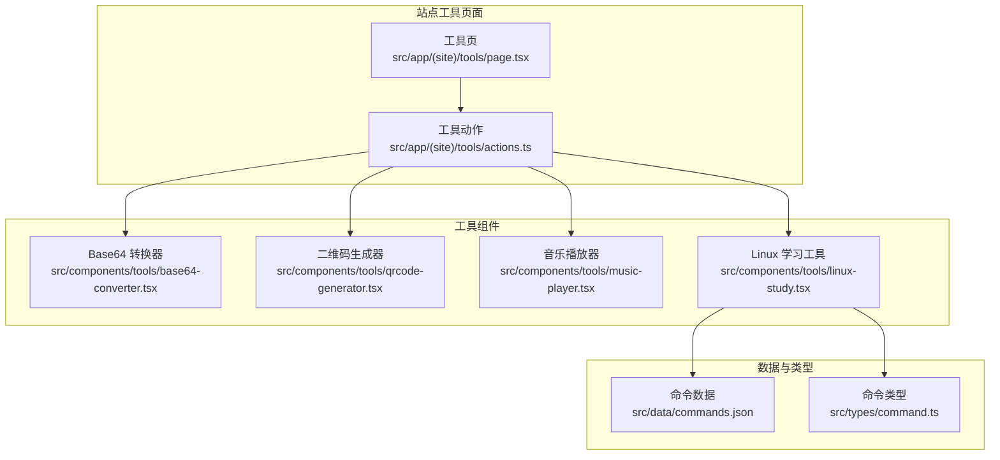
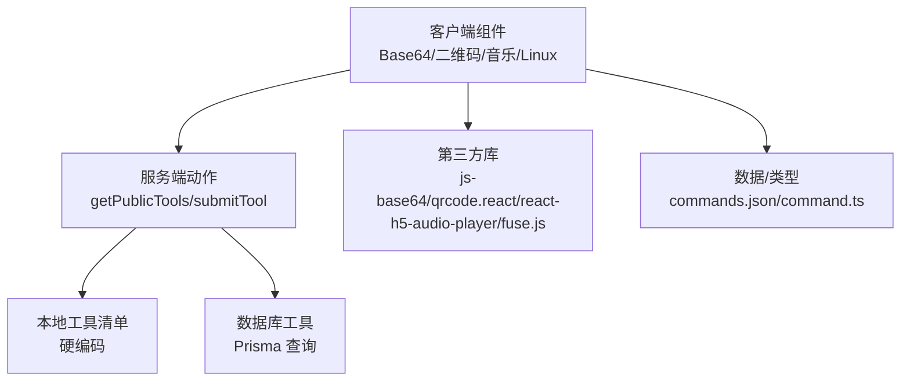
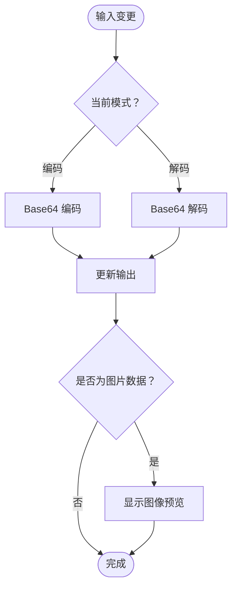
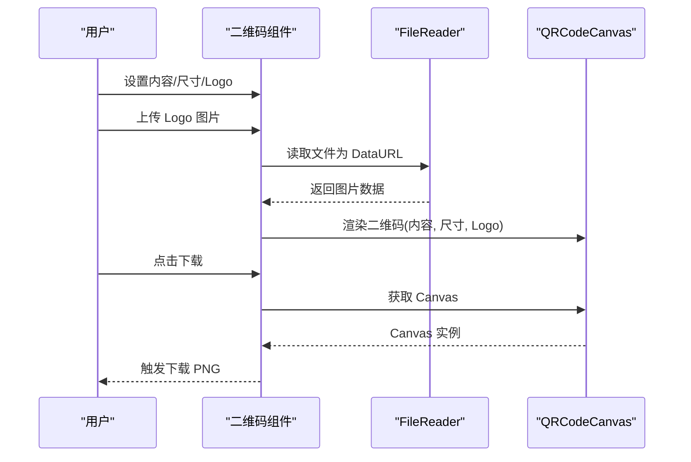
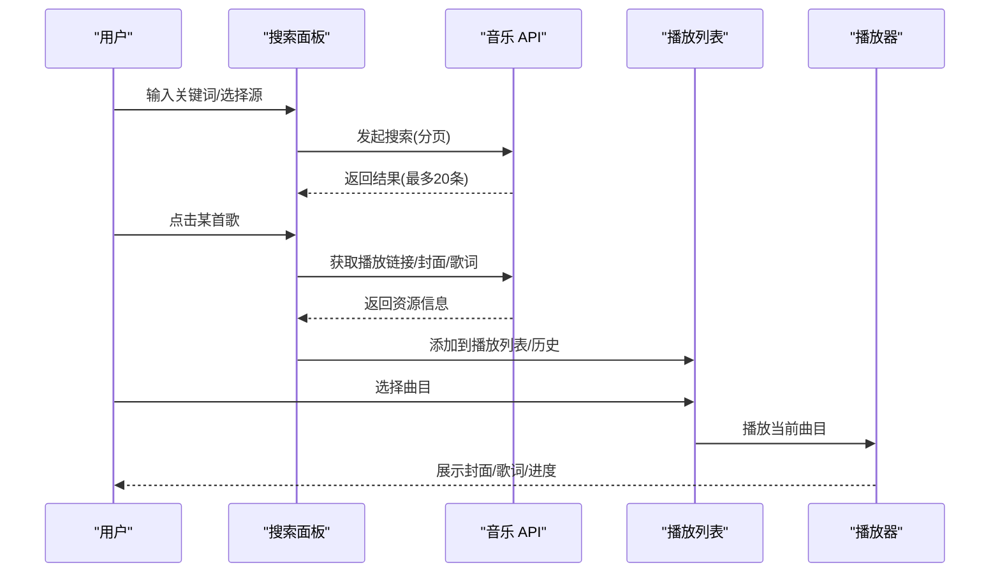
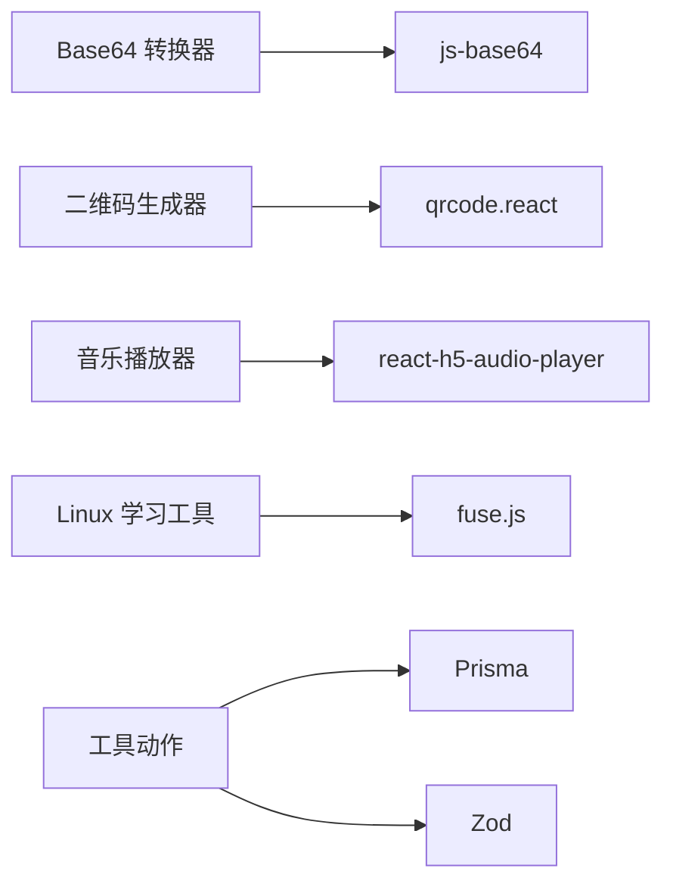

# 工具箱功能

<cite>
**本文引用的文件**
- [src/components/tools/base64-converter.tsx](file://src/components/tools/base64-converter.tsx)
- [src/components/tools/qrcode-generator.tsx](file://src/components/tools/qrcode-generator.tsx)
- [src/components/tools/music-player.tsx](file://src/components/tools/music-player.tsx)
- [src/components/tools/linux-study.tsx](file://src/components/tools/linux-study.tsx)
- [src/data/commands.json](file://src/data/commands.json)
- [src/types/command.ts](file://src/types/command.ts)
- [src/app/(site)/tools/actions.ts](file://src/app/(site)/tools/actions.ts)
- [package.json](file://package.json)
</cite>

## 目录
1. [简介](#简介)
2. [项目结构](#项目结构)
3. [核心组件](#核心组件)
4. [架构概览](#架构概览)
5. [详细组件分析](#详细组件分析)
6. [依赖分析](#依赖分析)
7. [性能考量](#性能考量)
8. [故障排查指南](#故障排查指南)
9. [结论](#结论)
10. [附录](#附录)

## 简介
本文件面向“工具箱”功能，系统性梳理并说明以下实用工具的实现与使用：Base64 转换器、二维码生成器、音乐播放器、Linux 学习工具。文档涵盖技术实现原理、算法逻辑、用户界面设计、工具分类管理机制、新增工具接入流程、性能优化策略、可扩展性设计、使用指南与 API 接口说明、测试策略、兼容性与用户体验优化建议。

## 项目结构
工具箱位于站点路由下的工具模块中，采用按功能拆分的组件化组织方式。核心工具组件均以客户端组件形式实现，配合服务端动作函数进行工具清单聚合与提交审核。

图表来源
- [src/app/(site)/tools/actions.ts](file://src/app/(site)/tools/actions.ts#L1-L77)
- [src/components/tools/base64-converter.tsx:1-157](file://src/components/tools/base64-converter.tsx#L1-L157)
- [src/components/tools/qrcode-generator.tsx:1-169](file://src/components/tools/qrcode-generator.tsx#L1-L169)
- [src/components/tools/music-player.tsx:1-944](file://src/components/tools/music-player.tsx#L1-L944)
- [src/components/tools/linux-study.tsx:1-348](file://src/components/tools/linux-study.tsx#L1-L348)
- [src/data/commands.json:1-384](file://src/data/commands.json#L1-L384)
- [src/types/command.ts:1-13](file://src/types/command.ts#L1-L13)

章节来源
- [src/app/(site)/tools/actions.ts](file://src/app/(site)/tools/actions.ts#L1-L77)
- [src/components/tools/base64-converter.tsx:1-157](file://src/components/tools/base64-converter.tsx#L1-L157)
- [src/components/tools/qrcode-generator.tsx:1-169](file://src/components/tools/qrcode-generator.tsx#L1-L169)
- [src/components/tools/music-player.tsx:1-944](file://src/components/tools/music-player.tsx#L1-L944)
- [src/components/tools/linux-study.tsx:1-348](file://src/components/tools/linux-study.tsx#L1-L348)
- [src/data/commands.json:1-384](file://src/data/commands.json#L1-L384)
- [src/types/command.ts:1-13](file://src/types/command.ts#L1-L13)

## 核心组件
- Base64 转换器：支持文本与文件的双向转换，具备自动转换、文件拖拽上传、图像预览、一键复制等功能。
- 二维码生成器：支持内容输入、尺寸调节、中心 Logo 图片上传与尺寸控制、Canvas 导出下载。
- 音乐播放器：集成在线音乐搜索与播放、本地音频上传、歌词解析与滚动、播放历史、多种播放源。
- Linux 学习工具：基于 Fuse.js 的模糊搜索，支持分类筛选、搜索历史、命令示例一键复制、键盘快捷键。

章节来源
- [src/components/tools/base64-converter.tsx:14-157](file://src/components/tools/base64-converter.tsx#L14-L157)
- [src/components/tools/qrcode-generator.tsx:14-169](file://src/components/tools/qrcode-generator.tsx#L14-L169)
- [src/components/tools/music-player.tsx:53-944](file://src/components/tools/music-player.tsx#L53-L944)
- [src/components/tools/linux-study.tsx:39-348](file://src/components/tools/linux-study.tsx#L39-L348)

## 架构概览
工具箱采用“服务端动作 + 客户端组件”的分层设计：
- 服务端动作负责工具清单聚合（本地工具 + 数据库工具），并处理外部工具提交。
- 客户端组件负责具体工具的交互与渲染，调用第三方库完成计算或渲染任务。
- 数据与类型通过独立文件管理，保证可维护性与可扩展性。

图表来源
- [src/app/(site)/tools/actions.ts](file://src/app/(site)/tools/actions.ts#L49-L76)
- [src/components/tools/base64-converter.tsx:4-4](file://src/components/tools/base64-converter.tsx#L4-L4)
- [src/components/tools/qrcode-generator.tsx:4-4](file://src/components/tools/qrcode-generator.tsx#L4-L4)
- [src/components/tools/music-player.tsx:25-25](file://src/components/tools/music-player.tsx#L25-L25)
- [src/components/tools/linux-study.tsx:4-24](file://src/components/tools/linux-study.tsx#L4-L24)

## 详细组件分析

### Base64 转换器
- 技术实现要点
  - 使用客户端状态管理输入/输出与模式（编码/解码）。
  - 文件上传通过 FileReader 读取为 DataURL，自动切换为“编码”模式并展示预览。
  - 输入变更时自动转换，异常时保持输出以提升体验。
  - 支持复制输入/输出与一键清空。
- 界面设计
  - 三栏布局：模式切换标签、输入区、操作中心（交换）、输出区（含图像预览）。
  - 响应式设计适配移动端与桌面端。
- 性能与可用性
  - 大文件转换可能阻塞 UI，建议限制文件大小或提供进度提示。
  - 输出区域支持长文本自动换行与复制按钮。

图表来源
- [src/components/tools/base64-converter.tsx:20-36](file://src/components/tools/base64-converter.tsx#L20-L36)
- [src/components/tools/base64-converter.tsx:147-151](file://src/components/tools/base64-converter.tsx#L147-L151)

章节来源
- [src/components/tools/base64-converter.tsx:14-157](file://src/components/tools/base64-converter.tsx#L14-L157)

### 二维码生成器
- 技术实现要点
  - 使用 Canvas 绘制二维码，支持尺寸滑块与导出 PNG。
  - 可选中心 Logo，支持图片上传与尺寸控制。
  - 通过 DOM 查询 Canvas 并下载为图片。
- 界面设计
  - 左侧设置面板（内容、尺寸、Logo 开关与上传、Logo 尺寸）。
  - 右侧预览面板（居中展示二维码与下载按钮）。
- 性能与可用性
  - 二维码绘制为 CPU 密集型，建议限制最大尺寸与延迟生成。
  - Logo 上传为本地文件读取，注意跨域与尺寸合理性。

图表来源
- [src/components/tools/qrcode-generator.tsx:22-34](file://src/components/tools/qrcode-generator.tsx#L22-L34)
- [src/components/tools/qrcode-generator.tsx:36-45](file://src/components/tools/qrcode-generator.tsx#L36-L45)
- [src/components/tools/qrcode-generator.tsx:147-157](file://src/components/tools/qrcode-generator.tsx#L147-L157)

章节来源
- [src/components/tools/qrcode-generator.tsx:14-169](file://src/components/tools/qrcode-generator.tsx#L14-L169)

### 音乐播放器
- 技术实现要点
  - 搜索：支持多音乐源（网易云/酷我/JOOX/哔哩哔哩），分页加载与无限滚动。
  - 播放：本地音频上传、播放历史、歌词解析与自动滚动、播放控制（上一首/下一首/暂停/播放）。
  - 歌词：LRC 歌词解析，按时间轴高亮当前行，支持手动滚动与自动跟随。
  - 状态：播放列表、当前索引、播放状态、音量/静音、重复/随机模式。
- 界面设计
  - 左侧搜索结果与播放列表；中央封面/歌词区；右侧播放控制与历史。
  - 深色主题与渐变视觉风格。
- 性能与可用性
  - 搜索与分页需防抖与节流，避免频繁请求。
  - 歌词滚动使用被动事件监听，减少主线程压力。
  - 本地文件使用对象 URL，及时释放内存。

图表来源
- [src/components/tools/music-player.tsx:184-232](file://src/components/tools/music-player.tsx#L184-L232)
- [src/components/tools/music-player.tsx:409-453](file://src/components/tools/music-player.tsx#L409-L453)
- [src/components/tools/music-player.tsx:304-335](file://src/components/tools/music-player.tsx#L304-L335)

章节来源
- [src/components/tools/music-player.tsx:53-944](file://src/components/tools/music-player.tsx#L53-L944)

### Linux 学习工具
- 技术实现要点
  - 使用 Fuse.js 进行模糊搜索，支持关键词、描述与示例注释匹配。
  - 本地搜索历史持久化，支持清除与快捷键（/ 聚焦、Esc 清空）。
  - 分类统计与筛选，命令示例一键复制。
- 界面设计
  - 桌面端左侧分类导航，移动端顶部横向分类条。
  - 响应式网格展示命令卡片。
- 性能与可用性
  - 搜索与过滤使用 useMemo 与 useMemo 初始化，避免重复计算。
  - 本地存储访问失败时优雅降级。

图表来源
- [src/components/tools/linux-study.tsx:58-84](file://src/components/tools/linux-study.tsx#L58-L84)
- [src/components/tools/linux-study.tsx:95-101](file://src/components/tools/linux-study.tsx#L95-L101)
- [src/components/tools/linux-study.tsx:109-121](file://src/components/tools/linux-study.tsx#L109-L121)

章节来源
- [src/components/tools/linux-study.tsx:39-348](file://src/components/tools/linux-study.tsx#L39-L348)
- [src/data/commands.json:1-384](file://src/data/commands.json#L1-L384)
- [src/types/command.ts:1-13](file://src/types/command.ts#L1-L13)

## 依赖分析
- 第三方库
  - Base64：js-base64
  - 二维码：qrcode.react
  - 音频播放：react-h5-audio-player
  - 模糊搜索：fuse.js
- 服务端依赖
  - Prisma：查询工具表
  - Zod：表单校验（工具提交）

图表来源
- [package.json:49-66](file://package.json#L49-L66)
- [src/app/(site)/tools/actions.ts](file://src/app/(site)/tools/actions.ts#L3-L4)

章节来源
- [package.json:11-79](file://package.json#L11-L79)
- [src/app/(site)/tools/actions.ts](file://src/app/(site)/tools/actions.ts#L3-L4)

## 性能考量
- 计算密集型任务
  - 二维码生成：限制最大尺寸、延迟渲染、避免频繁重绘。
  - 歌词解析：对大文件歌词进行分段处理，必要时异步分片解析。
- 内存管理
  - 音乐播放器：移除曲目时更新索引，及时清理对象 URL。
  - Linux 搜索：Fuse.js 实例仅初始化一次，避免重复构建索引。
- 响应速度优化
  - 音乐搜索：防抖与分页加载，滚动到底部再加载下一页。
  - Base64：仅在输入为空或模式切换时重算，错误时不立即清空输出。
- 可扩展性
  - 新增工具：在本地工具清单中注册，或通过数据库工具表管理。
  - 配置化：将第三方库参数、UI 配置抽离为常量或配置文件。

## 故障排查指南
- Base64 解码报错
  - 现象：解码失败但输出未清空。
  - 处理：检查输入是否为合法 Base64 字符串；建议增加错误提示。
- 二维码下载失败
  - 现象：点击下载无反应。
  - 处理：确认 Canvas 是否存在；检查浏览器下载权限与跨域限制。
- 音乐播放器无法播放
  - 现象：搜索结果无法播放或无声音。
  - 处理：检查播放链接有效性；确认网络环境与跨域；尝试更换音乐源。
- Linux 搜索无结果
  - 现象：关键词无法命中命令。
  - 处理：调整阈值与 keys；确认命令数据完整性。

章节来源
- [src/components/tools/base64-converter.tsx:32-35](file://src/components/tools/base64-converter.tsx#L32-L35)
- [src/components/tools/qrcode-generator.tsx:22-34](file://src/components/tools/qrcode-generator.tsx#L22-L34)
- [src/components/tools/music-player.tsx:262-273](file://src/components/tools/music-player.tsx#L262-L273)
- [src/components/tools/linux-study.tsx:69-84](file://src/components/tools/linux-study.tsx#L69-L84)

## 结论
工具箱通过清晰的组件划分与服务端动作聚合，实现了多样化的实用工具。各工具在交互体验、性能优化与可扩展性方面均有针对性设计。后续可在工具分类管理、新增工具接入流程与测试策略方面进一步完善，以提升整体可用性与维护效率。

## 附录

### 工具分类管理机制
- 本地工具清单：硬编码于服务端动作中，统一返回给前端展示。
- 数据库工具：通过 Prisma 查询非待审状态工具，按类别排序。
- 合并策略：前端统一渲染，保持一致的工具入口与交互。

章节来源
- [src/app/(site)/tools/actions.ts](file://src/app/(site)/tools/actions.ts#L49-L61)

### 新增工具接入流程
- 本地工具
  - 在本地工具清单中添加条目（名称、描述、图标、版本、状态、类型、分类、路由）。
  - 确保路由指向正确的客户端组件。
- 外部工具
  - 提交工具信息至数据库，状态为待审。
  - 管理后台审核通过后对外展示。

章节来源
- [src/app/(site)/tools/actions.ts](file://src/app/(site)/tools/actions.ts#L6-L47)
- [src/app/(site)/tools/actions.ts](file://src/app/(site)/tools/actions.ts#L63-L76)

### 使用指南与 API 接口
- 工具清单获取
  - 方法：GET
  - 路由：/tools/actions.ts 中的 getPublicTools
  - 行为：返回本地工具 + 数据库工具（非待审）
- 工具提交
  - 方法：POST
  - 路由：/tools/actions.ts 中的 submitTool
  - 参数：SubmitToolFormValues（经 Zod 校验）
  - 行为：创建外部工具记录，状态为待审

章节来源
- [src/app/(site)/tools/actions.ts](file://src/app/(site)/tools/actions.ts#L49-L76)

### 测试策略与兼容性
- 单元测试
  - Base64：覆盖编码/解码边界与异常路径。
  - 二维码：覆盖尺寸、Logo、导出下载。
  - 音乐：模拟搜索、播放、歌词解析、播放历史。
  - Linux：验证 Fuse.js 匹配、分类筛选、历史存储。
- 兼容性
  - 浏览器：现代浏览器（含移动端）。
  - 第三方库：确保依赖版本稳定，关注安全更新。
- 用户体验
  - 提供加载状态与错误提示。
  - 优化键盘快捷键与无障碍访问。

### 用户界面设计要点
- 统一的卡片式布局与深色主题风格。
- 响应式设计适配不同屏幕尺寸。
- 交互反馈（复制成功、下载完成、搜索中）使用轻提示通知。