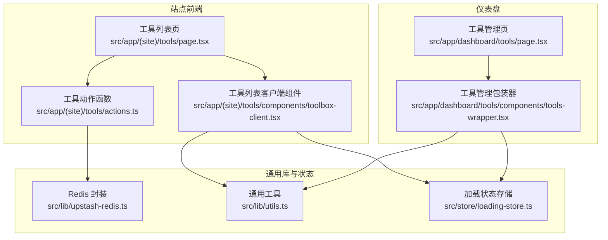
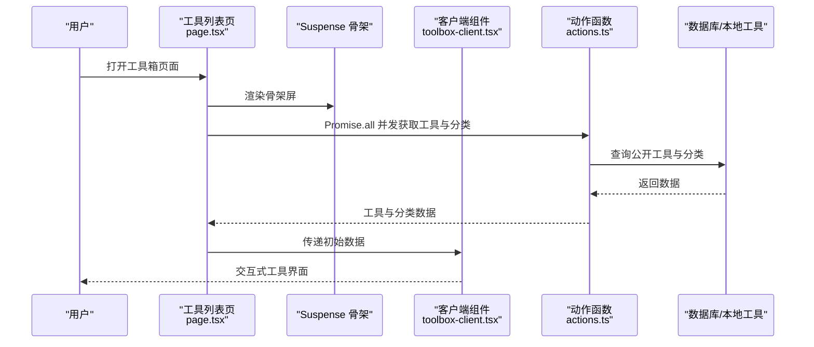
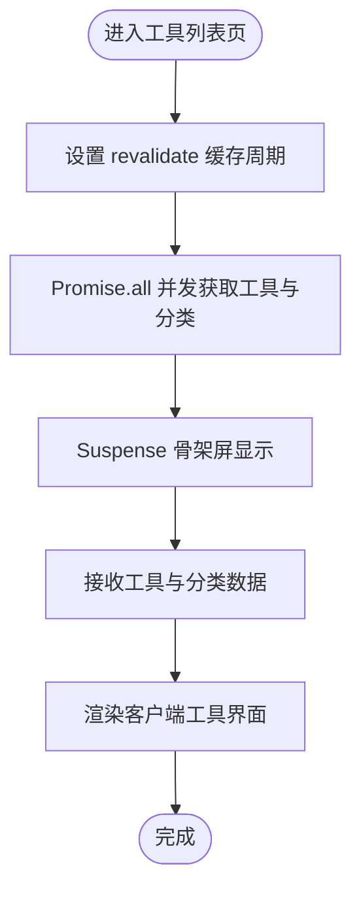
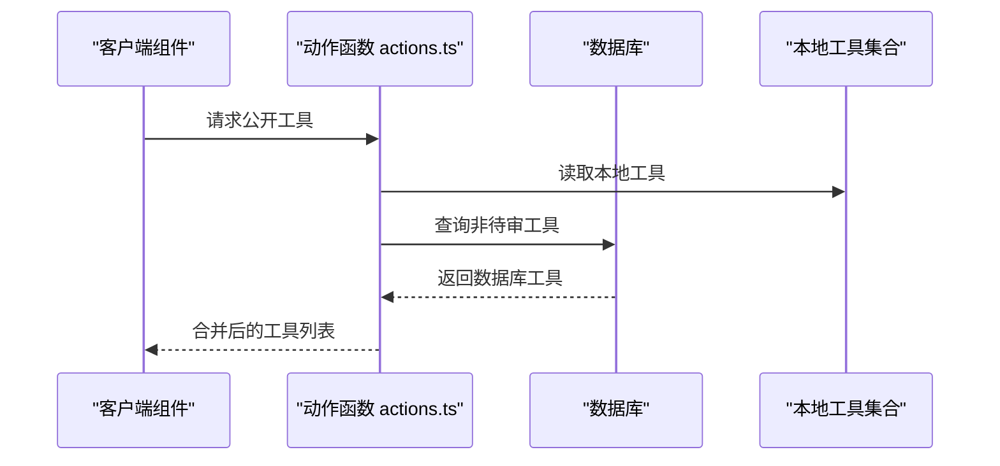
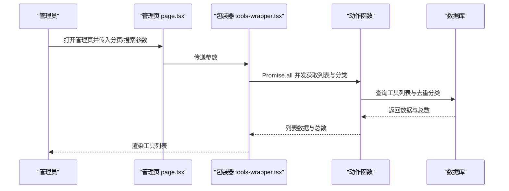
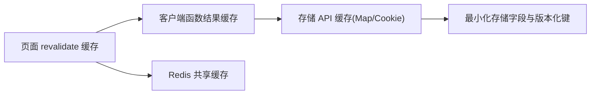
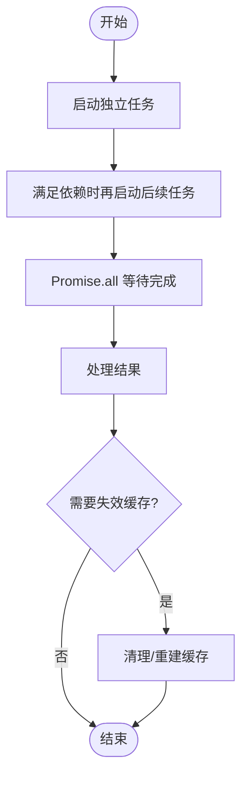
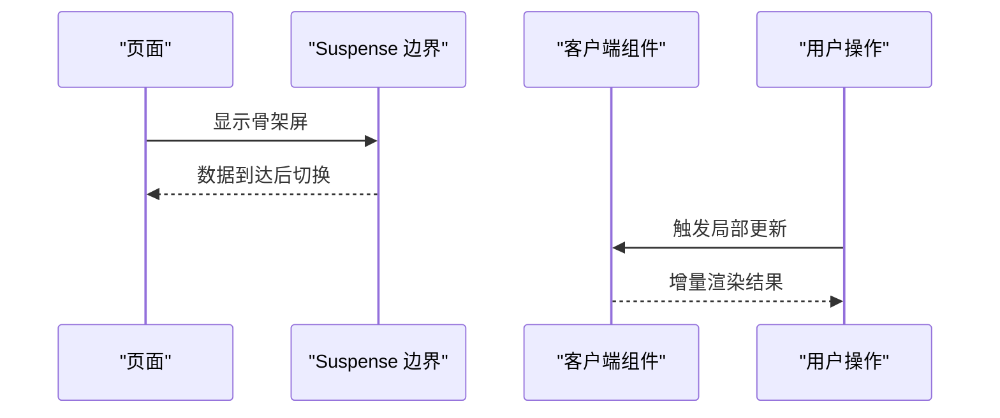
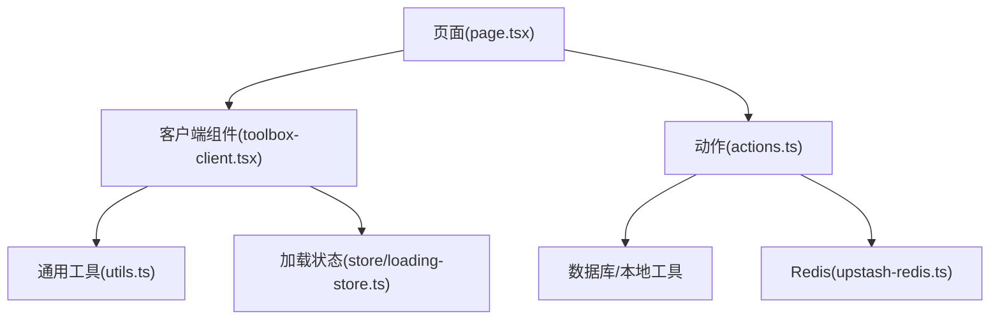

# 性能优化策略

<cite>
**本文引用的文件**
- [src/app/(site)/tools/page.tsx](file://src/app/(site)/tools/page.tsx)
- [src/app/(site)/tools/components/toolbox-client.tsx](file://src/app/(site)/tools/components/toolbox-client.tsx)
- [src/app/(site)/tools/actions.ts](file://src/app/(site)/tools/actions.ts)
- [src/app/dashboard/tools/page.tsx](file://src/app/dashboard/tools/page.tsx)
- [src/app/dashboard/tools/components/tools-wrapper.tsx](file://src/app/dashboard/tools/components/tools-wrapper.tsx)
- [.agents/skills/vercel-react-best-practices/AGENTS.md](file://.agents/skills/vercel-react-best-practices/AGENTS.md)
- [.agents/skills/vercel-react-best-practices/rules/async-parallel.md](file://.agents/skills/vercel-react-best-practices/rules/async-parallel.md)
- [.agents/skills/vercel-react-best-practices/rules/async-dependencies.md](file://.agents/skills/vercel-react-best-practices/rules/async-dependencies.md)
- [.agents/skills/vercel-react-best-practices/rules/async-suspense-boundaries.md](file://.agents/skills/vercel-react-best-practices/rules/async-suspense-boundaries.md)
- [.agents/skills/vercel-react-best-practices/rules/js-cache-function-results.md](file://.agents/skills/vercel-react-best-practices/rules/js-cache-function-results.md)
- [.agents/skills/vercel-react-best-practices/rules/js-cache-storage.md](file://.agents/skills/vercel-react-best-practices/rules/js-cache-storage.md)
- [.agents/skills/vercel-react-best-practices/rules/client-localstorage-schema.md](file://.agents/skills/vercel-react-best-practices/rules/client-localstorage-schema.md)
- [src/lib/upstash-redis.ts](file://src/lib/upstash-redis.ts)
- [src/lib/utils.ts](file://src/lib/utils.ts)
- [src/store/loading-store.ts](file://src/store/loading-store.ts)
</cite>

## 目录
1. [引言](#引言)
2. [项目结构](#项目结构)
3. [核心组件](#核心组件)
4. [架构总览](#架构总览)
5. [详细组件分析](#详细组件分析)
6. [依赖关系分析](#依赖关系分析)
7. [性能考量](#性能考量)
8. [故障排查指南](#故障排查指南)
9. [结论](#结论)
10. [附录](#附录)

## 引言
本文件面向“工具箱”系统的性能优化，聚焦以下目标：
- 计算密集型工具的异步处理与并发执行
- 内存与存储访问优化（含缓存策略）
- 网络请求优化（消除瀑布、并行化、惰性加载）
- 响应时间优化（预计算、懒加载、增量更新）
- 性能监控与分析方法
- 移动端与低性能设备的适配策略

通过对现有代码与最佳实践规则的结合，给出可落地的优化建议与实施路径。

## 项目结构
工具箱页面采用服务端渲染与客户端交互相结合的模式：
- 工具列表页通过服务端并发拉取工具与分类数据，并以 Suspense 提供骨架屏体验
- 客户端组件负责交互与状态管理，避免不必要的重渲染
- 管理后台页同样采用并发数据拉取与骨架屏提升首屏性能

图表来源
- [src/app/(site)/tools/page.tsx:10-28](file://src/app/(site)/tools/page.tsx#L10-L28)
- [src/app/(site)/tools/components/toolbox-client.tsx](file://src/app/(site)/tools/components/toolbox-client.tsx)
- [src/app/(site)/tools/actions.ts:49-76](file://src/app/(site)/tools/actions.ts#L49-L76)
- [src/app/dashboard/tools/page.tsx:1-32](file://src/app/dashboard/tools/page.tsx#L1-L32)
- [src/app/dashboard/tools/components/tools-wrapper.tsx:1-32](file://src/app/dashboard/tools/components/tools-wrapper.tsx#L1-L32)
- [src/lib/upstash-redis.ts](file://src/lib/upstash-redis.ts)
- [src/lib/utils.ts](file://src/lib/utils.ts)
- [src/store/loading-store.ts](file://src/store/loading-store.ts)

章节来源
- [src/app/(site)/tools/page.tsx:10-28](file://src/app/(site)/tools/page.tsx#L10-L28)
- [src/app/dashboard/tools/page.tsx:1-32](file://src/app/dashboard/tools/page.tsx#L1-L32)

## 核心组件
- 工具列表页：使用 revalidate 控制缓存刷新周期；通过 Promise.all 并发获取工具与分类；使用 Suspense 骨架屏提升感知性能。
- 工具动作函数：封装数据库查询与提交逻辑，便于复用与缓存命中。
- 工具管理页：后台分页列表同样采用 Promise.all 并发拉取数据，减少等待时间。
- 通用库与状态：提供 Redis 缓存、通用工具函数与加载状态存储，支撑跨组件的性能优化。

章节来源
- [src/app/(site)/tools/page.tsx:7-8](file://src/app/(site)/tools/page.tsx#L7-L8)
- [src/app/(site)/tools/page.tsx:20-28](file://src/app/(site)/tools/page.tsx#L20-L28)
- [src/app/(site)/tools/actions.ts:49-76](file://src/app/(site)/tools/actions.ts#L49-L76)
- [src/app/dashboard/tools/components/tools-wrapper.tsx:13-20](file://src/app/dashboard/tools/components/tools-wrapper.tsx#L13-L20)

## 架构总览
工具箱的性能优化围绕“并发数据获取 + 惰性加载 + 结果缓存 + 渲染优化”展开。下图展示从页面到数据层的关键调用链与优化点：

图表来源
- [src/app/(site)/tools/page.tsx:20-28](file://src/app/(site)/tools/page.tsx#L20-L28)
- [src/app/(site)/tools/actions.ts:49-76](file://src/app/(site)/tools/actions.ts#L49-L76)

## 详细组件分析

### 工具列表页（并发与缓存）
- revalidate 缓存：通过设置 revalidate 值，限制服务器端缓存刷新频率，降低重复查询成本。
- Promise.all 并发：同时获取工具列表与分类列表，避免串行等待。
- Suspense 骨架：在数据到达前提供骨架屏，改善感知性能。

图表来源
- [src/app/(site)/tools/page.tsx:7-8](file://src/app/(site)/tools/page.tsx#L7-L8)
- [src/app/(site)/tools/page.tsx:20-28](file://src/app/(site)/tools/page.tsx#L20-L28)

章节来源
- [src/app/(site)/tools/page.tsx:7-8](file://src/app/(site)/tools/page.tsx#L7-L8)
- [src/app/(site)/tools/page.tsx:20-28](file://src/app/(site)/tools/page.tsx#L20-L28)

### 工具动作函数（数据聚合与提交）
- 聚合公开工具：合并本地工具与数据库工具，统一返回给客户端。
- 提交工具：对表单数据进行校验后写入数据库，标记状态与类型。

图表来源
- [src/app/(site)/tools/actions.ts:49-76](file://src/app/(site)/tools/actions.ts#L49-L76)

章节来源
- [src/app/(site)/tools/actions.ts:49-76](file://src/app/(site)/tools/actions.ts#L49-L76)

### 工具管理页（后台并发）
- 分页与搜索参数：支持分页与搜索条件，减少一次性传输数据量。
- Promise.all 并发：同时获取列表数据与分类列表，缩短等待时间。

图表来源
- [src/app/dashboard/tools/page.tsx:5-32](file://src/app/dashboard/tools/page.tsx#L5-L32)
- [src/app/dashboard/tools/components/tools-wrapper.tsx:13-20](file://src/app/dashboard/tools/components/tools-wrapper.tsx#L13-L20)

章节来源
- [src/app/dashboard/tools/page.tsx:5-32](file://src/app/dashboard/tools/page.tsx#L5-L32)
- [src/app/dashboard/tools/components/tools-wrapper.tsx:13-20](file://src/app/dashboard/tools/components/tools-wrapper.tsx#L13-L20)

### 缓存策略（结果缓存、配置缓存、静态资源缓存）
- 服务器端缓存：通过 revalidate 控制页面级缓存刷新周期，降低数据库压力。
- 客户端缓存：对重复函数调用与存储 API 进行缓存，减少重复计算与昂贵 I/O。
- 外部缓存：通过 Redis 封装实现跨请求/进程的共享缓存，适合跨请求复用的结果。

图表来源
- [src/app/(site)/tools/page.tsx:7-8](file://src/app/(site)/tools/page.tsx#L7-L8)
- [.agents/skills/vercel-react-best-practices/rules/js-cache-function-results.md:32-42](file://.agents/skills/vercel-react-best-practices/rules/js-cache-function-results.md#L32-L42)
- [.agents/skills/vercel-react-best-practices/rules/js-cache-storage.md:24-36](file://.agents/skills/vercel-react-best-practices/rules/js-cache-storage.md#L24-L36)
- [.agents/skills/vercel-react-best-practices/rules/client-localstorage-schema.md:23-40](file://.agents/skills/vercel-react-best-practices/rules/client-localstorage-schema.md#L23-L40)
- [src/lib/upstash-redis.ts](file://src/lib/upstash-redis.ts)

章节来源
- [src/app/(site)/tools/page.tsx:7-8](file://src/app/(site)/tools/page.tsx#L7-L8)
- [.agents/skills/vercel-react-best-practices/rules/js-cache-function-results.md:32-42](file://.agents/skills/vercel-react-best-practices/rules/js-cache-function-results.md#L32-L42)
- [.agents/skills/vercel-react-best-practices/rules/js-cache-storage.md:24-36](file://.agents/skills/vercel-react-best-practices/rules/js-cache-storage.md#L24-L36)
- [.agents/skills/vercel-react-best-practices/rules/client-localstorage-schema.md:23-40](file://.agents/skills/vercel-react-best-practices/rules/client-localstorage-schema.md#L23-L40)
- [src/lib/upstash-redis.ts](file://src/lib/upstash-redis.ts)

### 并发处理与线程安全
- 并发策略：在 API 路由与组件中尽早启动独立任务，使用 Promise.all 或依赖感知的并行化工具最大化并发。
- 线程安全：客户端缓存使用模块级 Map，避免在事件处理器与工具函数中产生竞态；必要时通过状态存储与可见性事件清理缓存。

图表来源
- [.agents/skills/vercel-react-best-practices/rules/async-parallel.md:20-27](file://.agents/skills/vercel-react-best-practices/rules/async-parallel.md#L20-L27)
- [.agents/skills/vercel-react-best-practices/rules/async-dependencies.md:27-33](file://.agents/skills/vercel-react-best-practices/rules/async-dependencies.md#L27-L33)
- [.agents/skills/vercel-react-best-practices/AGENTS.md:91-132](file://.agents/skills/vercel-react-best-practices/AGENTS.md#L91-L132)

章节来源
- [.agents/skills/vercel-react-best-practices/rules/async-parallel.md:20-27](file://.agents/skills/vercel-react-best-practices/rules/async-parallel.md#L20-L27)
- [.agents/skills/vercel-react-best-practices/rules/async-dependencies.md:27-33](file://.agents/skills/vercel-react-best-practices/rules/async-dependencies.md#L27-L33)
- [.agents/skills/vercel-react-best-practices/AGENTS.md:91-132](file://.agents/skills/vercel-react-best-practices/AGENTS.md#L91-L132)

### 响应时间优化（预计算、懒加载、增量更新）
- 预计算：对稳定不变或低频变更的数据（如分类）进行预计算与缓存。
- 懒加载：使用 Suspense 边界与动态导入，仅在需要时加载重型组件。
- 增量更新：在客户端侧对局部状态进行细粒度更新，避免全量重渲染。

图表来源
- [src/app/(site)/tools/page.tsx:13-15](file://src/app/(site)/tools/page.tsx#L13-L15)
- [.agents/skills/vercel-react-best-practices/rules/async-suspense-boundaries.md:33-55](file://.agents/skills/vercel-react-best-practices/rules/async-suspense-boundaries.md#L33-L55)

章节来源
- [src/app/(site)/tools/page.tsx:13-15](file://src/app/(site)/tools/page.tsx#L13-L15)
- [.agents/skills/vercel-react-best-practices/rules/async-suspense-boundaries.md:33-55](file://.agents/skills/vercel-react-best-practices/rules/async-suspense-boundaries.md#L33-L55)

### 性能监控与分析方法
- 关键指标：首屏时间、TTFB、并发请求数、缓存命中率、客户端渲染耗时、骨架屏停留时长。
- 测试工具：浏览器性能面板、Lighthouse、Vercel/平台内置分析。
- 瓶颈定位：利用 Suspense 边界隔离慢数据源，逐步替换为缓存或预取；对热点函数建立缓存并记录命中率。

章节来源
- [.agents/skills/vercel-react-best-practices/AGENTS.md:91-132](file://.agents/skills/vercel-react-best-practices/AGENTS.md#L91-L132)

### 移动端与低性能设备优化
- 减少主线程阻塞：将计算密集型任务拆分为小块，使用空闲调度或 Web Worker。
- 图片与资源：按设备像素比选择尺寸，启用懒加载与占位符。
- 交互反馈：保持骨架屏与过渡动画简洁，避免复杂动画影响滚动性能。

## 依赖关系分析
工具箱的性能优化涉及前后端协作与多层缓存：
- 页面层：并发获取与缓存控制
- 组件层：懒加载与渲染优化
- 动作层：数据聚合与提交
- 库层：Redis 缓存与通用工具
- 状态层：加载状态与缓存失效

图表来源
- [src/app/(site)/tools/page.tsx:10-28](file://src/app/(site)/tools/page.tsx#L10-L28)
- [src/app/(site)/tools/components/toolbox-client.tsx](file://src/app/(site)/tools/components/toolbox-client.tsx)
- [src/app/(site)/tools/actions.ts:49-76](file://src/app/(site)/tools/actions.ts#L49-L76)
- [src/lib/upstash-redis.ts](file://src/lib/upstash-redis.ts)
- [src/lib/utils.ts](file://src/lib/utils.ts)
- [src/store/loading-store.ts](file://src/store/loading-store.ts)

章节来源
- [src/app/(site)/tools/page.tsx:10-28](file://src/app/(site)/tools/page.tsx#L10-L28)
- [src/app/(site)/tools/actions.ts:49-76](file://src/app/(site)/tools/actions.ts#L49-L76)

## 性能考量
- 网络层面：优先使用 Promise.all 并发，避免瀑布；对可复用数据使用 revalidate 与 Redis 缓存。
- 计算层面：对重复函数调用与存储 API 建立缓存；在客户端侧避免不必要的重渲染。
- 渲染层面：使用 Suspense 边界与骨架屏；对长列表使用虚拟化或内容可见性优化。
- 存储层面：版本化键名与最小化字段，防止 schema 冲突与占用过多空间。

## 故障排查指南
- 缓存未命中：检查 revalidate 周期与 Redis 配置；确认客户端缓存是否正确失效。
- 渲染卡顿：定位大组件与重计算函数，考虑拆分与缓存；减少不必要的状态提升。
- 数据延迟：确认并发策略是否覆盖所有独立请求；检查 Suspense 边界是否正确包裹慢数据源。

章节来源
- [src/app/(site)/tools/page.tsx:7-8](file://src/app/(site)/tools/page.tsx#L7-L8)
- [.agents/skills/vercel-react-best-practices/rules/js-cache-storage.md:56-70](file://.agents/skills/vercel-react-best-practices/rules/js-cache-storage.md#L56-L70)

## 结论
通过“并发数据获取 + 惰性加载 + 结果缓存 + 渲染优化”的组合拳，工具箱可在不牺牲功能的前提下显著提升性能。建议优先落地 Promise.all 并发与 revalidate 缓存，随后引入客户端函数与存储缓存，并在移动端场景中进一步简化渲染与资源加载策略。

## 附录
- 最佳实践参考：消除瀑布、依赖感知并行、Suspense 边界、函数结果缓存、存储缓存与版本化键设计
- 工具与资源：Upstash Redis 封装、通用工具函数、加载状态存储

章节来源
- [.agents/skills/vercel-react-best-practices/AGENTS.md:91-132](file://.agents/skills/vercel-react-best-practices/AGENTS.md#L91-L132)
- [.agents/skills/vercel-react-best-practices/rules/async-suspense-boundaries.md:33-55](file://.agents/skills/vercel-react-best-practices/rules/async-suspense-boundaries.md#L33-L55)
- [.agents/skills/vercel-react-best-practices/rules/js-cache-function-results.md:32-42](file://.agents/skills/vercel-react-best-practices/rules/js-cache-function-results.md#L32-L42)
- [.agents/skills/vercel-react-best-practices/rules/js-cache-storage.md:24-36](file://.agents/skills/vercel-react-best-practices/rules/js-cache-storage.md#L24-L36)
- [.agents/skills/vercel-react-best-practices/rules/client-localstorage-schema.md:23-40](file://.agents/skills/vercel-react-best-practices/rules/client-localstorage-schema.md#L23-L40)
- [src/lib/upstash-redis.ts](file://src/lib/upstash-redis.ts)
- [src/lib/utils.ts](file://src/lib/utils.ts)
- [src/store/loading-store.ts](file://src/store/loading-store.ts)