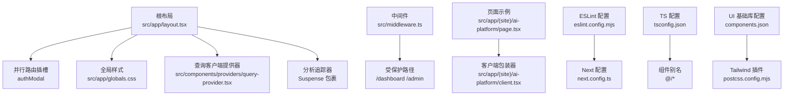
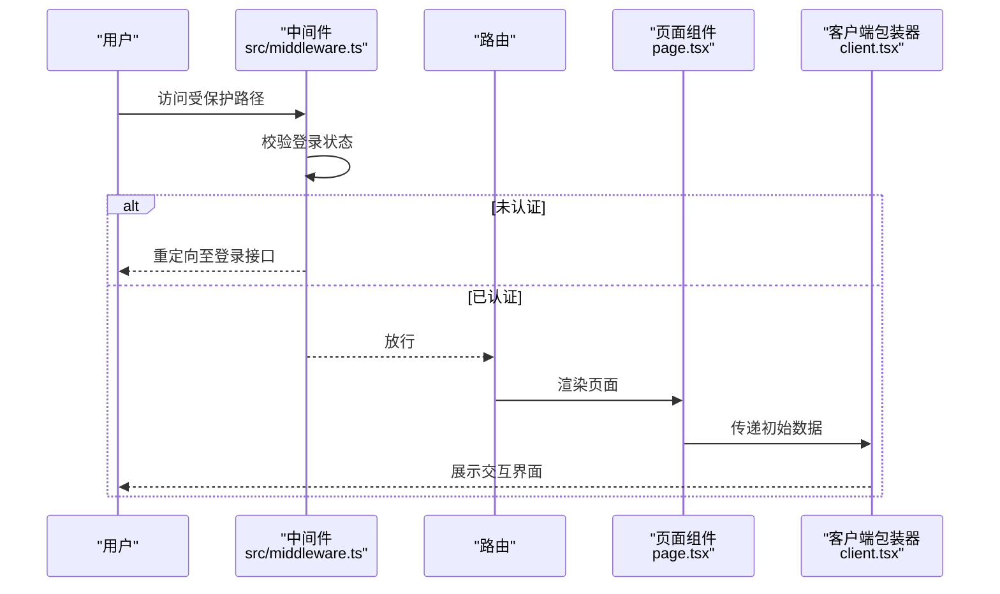
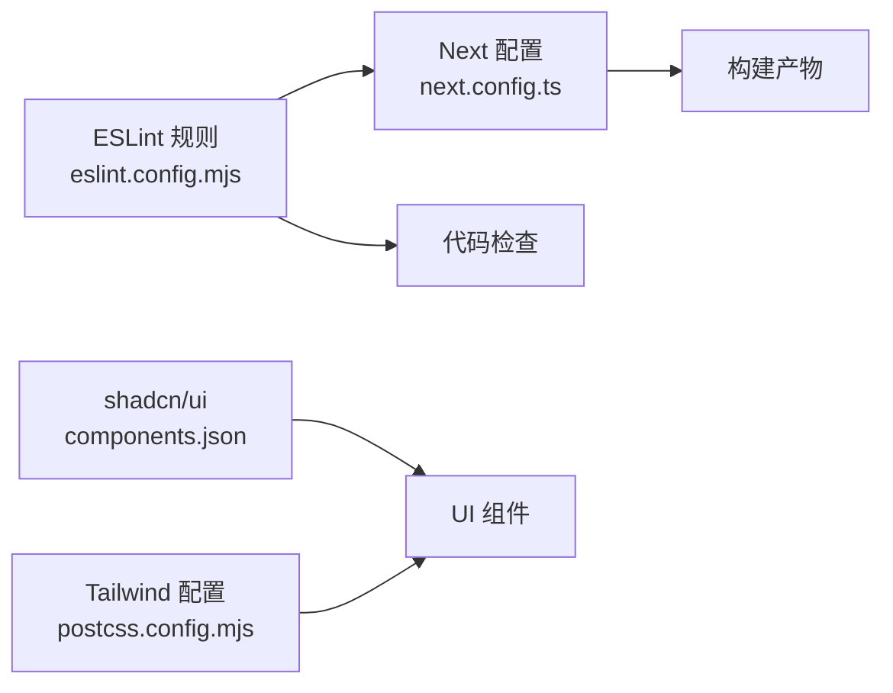

# 代码规范

<cite>
**本文引用的文件**
- [eslint.config.mjs](file://eslint.config.mjs)
- [next.config.ts](file://next.config.ts)
- [tsconfig.json](file://tsconfig.json)
- [package.json](file://package.json)
- [src/app/layout.tsx](file://src/app/layout.tsx)
- [src/app/(site)/ai-platform/page.tsx](file://src/app/(site)/ai-platform/page.tsx)
- [src/app/(site)/ai-platform/client.tsx](file://src/app/(site)/ai-platform/client.tsx)
- [src/components/providers/query-provider.tsx](file://src/components/providers/query-provider.tsx)
- [src/middleware.ts](file://src/middleware.ts)
- [src/lib/utils.ts](file://src/lib/utils.ts)
- [components.json](file://components.json)
- [postcss.config.mjs](file://postcss.config.mjs)
</cite>

## 目录
1. 引言
2. 项目结构
3. 核心组件
4. 架构总览
5. 详细组件分析
6. 依赖分析
7. 性能考虑
8. 故障排查指南
9. 结论
10. 附录

## 引言
本文件面向“一梦五千年”项目，基于现有 ESLint、Next.js 配置与工程实践，系统化制定 TypeScript 编码规范、命名约定、文件组织结构、Next.js 特定规范（App Router 文件约定、Server/Client 组件边界）、代码格式化与注释规范、错误处理模式，并提供 IDE 配置建议与质量检查工具使用指南。目标是统一团队开发体验，提升可维护性与一致性。

## 项目结构
项目采用 Next.js App Router 的分组路由与并行路由结构，结合中间件进行访问控制与重定向；全局布局负责主题、状态提供器与通用 UI 注入；页面层通过 Suspense 提供水合降级体验；客户端逻辑集中在“use client”模块中，配合 TanStack React Query 管理数据缓存。

图表来源
- [src/app/layout.tsx:1-52](file://src/app/layout.tsx#L1-L52)
- [src/components/providers/query-provider.tsx:1-22](file://src/components/providers/query-provider.tsx#L1-L22)
- [src/middleware.ts:1-36](file://src/middleware.ts#L1-L36)
- [src/app/(site)/ai-platform/page.tsx:1-22](file://src/app/(site)/ai-platform/page.tsx#L1-L22)
- [src/app/(site)/ai-platform/client.tsx:1-80](file://src/app/(site)/ai-platform/client.tsx#L1-L80)
- [eslint.config.mjs:1-19](file://eslint.config.mjs#L1-L19)
- [next.config.ts:1-16](file://next.config.ts#L1-L16)
- [tsconfig.json:1-43](file://tsconfig.json#L1-L43)
- [components.json:1-23](file://components.json#L1-L23)
- [postcss.config.mjs:1-8](file://postcss.config.mjs#L1-L8)

章节来源
- [src/app/layout.tsx:1-52](file://src/app/layout.tsx#L1-L52)
- [src/middleware.ts:1-36](file://src/middleware.ts#L1-L36)
- [src/app/(site)/ai-platform/page.tsx:1-22](file://src/app/(site)/ai-platform/page.tsx#L1-L22)
- [src/app/(site)/ai-platform/client.tsx:1-80](file://src/app/(site)/ai-platform/client.tsx#L1-L80)
- [eslint.config.mjs:1-19](file://eslint.config.mjs#L1-L19)
- [next.config.ts:1-16](file://next.config.ts#L1-L16)
- [tsconfig.json:1-43](file://tsconfig.json#L1-L43)
- [components.json:1-23](file://components.json#L1-L23)
- [postcss.config.mjs:1-8](file://postcss.config.mjs#L1-L8)

## 核心组件
- 根布局与全局注入
  - 在根布局中集中注入查询提供器、加载状态提供器、通知组件与分析追踪器，确保全站一致的用户体验与性能策略。
  - 使用 Suspense 包裹分析追踪器，避免阻塞首屏渲染。
- 客户端提供器
  - 查询客户端默认过期时间设定为 60 秒，兼顾实时性与缓存效率。
- 中间件访问控制
  - 对 /dashboard 与 /admin 受保护区域进行登录校验与自动重定向，匹配规则明确。
- 页面与客户端封装
  - 页面层通过 Suspense 提供骨架屏降级，客户端包装器集中处理交互状态与筛选逻辑，遵循“use client”边界。

章节来源
- [src/app/layout.tsx:1-52](file://src/app/layout.tsx#L1-L52)
- [src/components/providers/query-provider.tsx:1-22](file://src/components/providers/query-provider.tsx#L1-L22)
- [src/middleware.ts:1-36](file://src/middleware.ts#L1-L36)
- [src/app/(site)/ai-platform/page.tsx:1-22](file://src/app/(site)/ai-platform/page.tsx#L1-L22)
- [src/app/(site)/ai-platform/client.tsx:1-80](file://src/app/(site)/ai-platform/client.tsx#L1-L80)

## 架构总览
下图展示了从请求到页面渲染的关键流程，包括中间件拦截、权限校验、页面水合与客户端交互。

图表来源
- [src/middleware.ts:1-36](file://src/middleware.ts#L1-L36)
- [src/app/(site)/ai-platform/page.tsx:1-22](file://src/app/(site)/ai-platform/page.tsx#L1-L22)
- [src/app/(site)/ai-platform/client.tsx:1-80](file://src/app/(site)/ai-platform/client.tsx#L1-L80)

## 详细组件分析

### TypeScript 编码规范
- 严格类型与无 emit
  - 启用严格模式、禁止 emit、隔离模块，确保类型安全与构建稳定性。
- 路径别名与模块解析
  - 使用 “@/*” 别名映射到 “./src/*”，统一导入路径风格。
- JSX 与增量编译
  - 使用 react-jsx 与增量编译，提升开发体验与编译速度。
- 外部类型与运行时
  - 允许 JS、跳过库检查，满足混合栈需求。

章节来源
- [tsconfig.json:1-43](file://tsconfig.json#L1-L43)

### 命名约定
- 文件与目录
  - 页面文件统一使用小写加连字符或下划线，如 “page.tsx”、“actions.ts”。
  - 分组路由使用括号包裹，如 “(site)”、“(auth)”。
  - 并行路由插槽使用 “@slot” 前缀，如 “@authModal”。
- 组件导出
  - 默认导出函数组件用于页面；具名导出用于客户端包装器与工具函数。
- 变量与常量
  - 布尔值使用 isXxx/isNotXxx，对象使用 xxx，数组使用 xxxs，函数使用 verbNoun 形式。
- 类型与接口
  - 接口以大写 I 开头，属性使用驼峰，枚举使用名词复数或形容词。
- 路由参数
  - 动态路由参数使用方括号，如 “[id]”、“[slug]”。

章节来源
- [src/app/(site)/ai-platform/page.tsx:1-22](file://src/app/(site)/ai-platform/page.tsx#L1-L22)
- [src/app/(site)/ai-platform/client.tsx:1-80](file://src/app/(site)/ai-platform/client.tsx#L1-L80)
- [src/middleware.ts:1-36](file://src/middleware.ts#L1-L36)

### 文件组织结构
- 根目录
  - 配置类文件：eslint.config.mjs、next.config.ts、tsconfig.json、components.json、postcss.config.mjs。
  - 数据与脚本：prisma/schema、scripts/*。
- src/app
  - 分组路由：(site)、(auth)、@authModal。
  - 并行路由：@authModal/default.tsx。
  - 页面与布局：layout.tsx、loading.tsx、page.tsx。
  - API 路由：api/*。
- src/components
  - UI 组件：ui/*。
  - 布局与通用：layout/*、common/*。
  - 提供器：providers/*。
- src/lib
  - 工具与服务：utils.ts、db.ts、email-service.ts、env.ts、http.ts、logto.ts、mailer.ts、qiniu.ts、r2.ts、session.ts、upstash-redis.ts、api-key.ts。
- src/store
  - 状态管理：loading-store.ts、user-store.ts。
- src/hooks
  - 自定义钩子：use-mobile.ts。
- src/types
  - 类型声明：command.ts。
- src/middleware.ts
  - 访问控制与重定向。

章节来源
- [src/app/layout.tsx:1-52](file://src/app/layout.tsx#L1-L52)
- [src/middleware.ts:1-36](file://src/middleware.ts#L1-L36)
- [components.json:1-23](file://components.json#L1-L23)

### Next.js 特定规范

#### App Router 文件约定
- 页面文件
  - 必须导出默认组件，支持静态生成与服务端渲染。
  - 支持导出 revalidate 控制缓存刷新频率。
- 布局文件
  - 用于共享 UI 结构与上下文提供器，支持嵌套布局。
- 加载指示器
  - 使用 loading.tsx 提供渐进式降级体验。
- 并行路由
  - 使用 “@slot” 命名插槽，如 “@authModal”，在根布局中接收并渲染。
- 动态路由
  - 使用 “[param]” 表达动态段，如 “[id]”、“[slug]”。

章节来源
- [src/app/(site)/ai-platform/page.tsx:1-22](file://src/app/(site)/ai-platform/page.tsx#L1-L22)
- [src/app/layout.tsx:1-52](file://src/app/layout.tsx#L1-L52)

#### Server Components 与 Client Components 使用边界
- “use client” 边界
  - 凡涉及状态、副作用、事件处理器或浏览器 API 的组件需标注 “use client”。
  - 示例：客户端包装器、按钮、输入框等交互组件。
- 服务端职责
  - 页面与布局尽量保持纯函数特性，避免直接使用 DOM 或状态。
  - 数据获取与缓存策略在服务端完成，客户端仅消费数据。
- Provider 注入
  - 将查询客户端、加载状态等提供器置于根布局之下，确保全局可用。

章节来源
- [src/app/(site)/ai-platform/client.tsx:1-80](file://src/app/(site)/ai-platform/client.tsx#L1-L80)
- [src/components/providers/query-provider.tsx:1-22](file://src/components/providers/query-provider.tsx#L1-L22)
- [src/app/layout.tsx:1-52](file://src/app/layout.tsx#L1-L52)

#### Suspense 与水合降级
- 页面层使用 Suspense 包裹异步内容，提供骨架屏降级。
- 分析追踪器等非关键资源使用 Suspense 包裹，避免阻塞首屏。

章节来源
- [src/app/(site)/ai-platform/page.tsx:1-22](file://src/app/(site)/ai-platform/page.tsx#L1-L22)
- [src/app/layout.tsx:1-52](file://src/app/layout.tsx#L1-L52)

### 代码格式化与注释规范
- 格式化工具
  - 使用 ESLint 与 Next 内置规则，确保风格一致。
- 注释规范
  - 函数与复杂逻辑添加简要注释，说明目的与边界条件。
  - 导出项与公共 API 添加 JSDoc 风格注释，便于 IDE 提示与文档生成。

章节来源
- [eslint.config.mjs:1-19](file://eslint.config.mjs#L1-L19)

### 错误处理模式
- 中间件错误处理
  - 对未认证用户重定向至登录接口，避免直接抛错。
- 构建期宽容
  - 生产构建忽略 ESLint 与 TypeScript 错误，降低部署门槛。
- 运行时错误
  - 使用通知组件（如 Toaster）向用户反馈错误信息。
  - 对网络请求与第三方服务调用进行 try/catch 包装。

章节来源
- [src/middleware.ts:1-36](file://src/middleware.ts#L1-L36)
- [next.config.ts:1-16](file://next.config.ts#L1-L16)
- [src/app/layout.tsx:1-52](file://src/app/layout.tsx#L1-L52)

### 代码质量检查工具使用指南
- 运行 ESLint
  - 执行命令：npm run lint 或 pnpm lint。
  - 作用：检查 TypeScript 与 Next 规范，发现潜在问题。
- 构建与类型检查
  - 构建脚本会先生成 Prisma 客户端再执行 Next 构建。
  - 若存在类型错误，可在本地修复后再次构建。

章节来源
- [package.json:1-98](file://package.json#L1-L98)
- [eslint.config.mjs:1-19](file://eslint.config.mjs#L1-L19)
- [next.config.ts:1-16](file://next.config.ts#L1-L16)

### IDE 配置建议
- VS Code
  - 安装推荐扩展：ESLint、TypeScript TSServer、Tailwind CSS IntelliSense。
  - 设置默认 formatter 为 ESLint，启用保存时自动修复。
  - 在工作区设置中启用 TypeScript 严格模式与增量编译。
- 路径别名
  - 确保 tsconfig.json 中的 “@/*” 别名生效，避免导入路径错误。
- Tailwind CSS
  - 使用 postcss.config 与 tailwind.config（如存在）确保类名提示与自动补全。

章节来源
- [tsconfig.json:1-43](file://tsconfig.json#L1-L43)
- [postcss.config.mjs:1-8](file://postcss.config.mjs#L1-L8)
- [components.json:1-23](file://components.json#L1-L23)

## 依赖分析
- ESLint 与 Next 集成
  - 通过 eslint.config.mjs 合并 Next Core Web Vitals 与 TypeScript 规则，覆盖现代 Web 最佳实践。
- 构建宽容策略
  - next.config.ts 中对 ESLint 与 TypeScript 错误进行构建期忽略，保障部署稳定性。
- 组件库与工具链
  - 使用 shadcn/ui（RSC 与 TSX），Tailwind CSS，clsx/tailwind-merge 组合实现样式系统。

图表来源
- [eslint.config.mjs:1-19](file://eslint.config.mjs#L1-L19)
- [next.config.ts:1-16](file://next.config.ts#L1-L16)
- [components.json:1-23](file://components.json#L1-L23)
- [postcss.config.mjs:1-8](file://postcss.config.mjs#L1-L8)

章节来源
- [eslint.config.mjs:1-19](file://eslint.config.mjs#L1-L19)
- [next.config.ts:1-16](file://next.config.ts#L1-L16)
- [components.json:1-23](file://components.json#L1-L23)
- [postcss.config.mjs:1-8](file://postcss.config.mjs#L1-L8)

## 性能考虑
- 查询缓存
  - 查询客户端默认过期时间为 60 秒，减少重复请求。
- 水合降级
  - 页面层使用 Suspense 提供骨架屏，缩短感知加载时间。
- 路由与中间件
  - 明确的匹配规则与早期重定向，避免无效请求进入受保护区域。
- 样式与类名合并
  - 使用 clsx 与 tailwind-merge 合并类名，减少冗余样式。

章节来源
- [src/components/providers/query-provider.tsx:1-22](file://src/components/providers/query-provider.tsx#L1-L22)
- [src/app/(site)/ai-platform/page.tsx:1-22](file://src/app/(site)/ai-platform/page.tsx#L1-L22)
- [src/middleware.ts:1-36](file://src/middleware.ts#L1-L36)
- [src/lib/utils.ts:1-7](file://src/lib/utils.ts#L1-L7)

## 故障排查指南
- ESLint 报错
  - 使用 npm run lint 或 pnpm lint 定位问题；根据规则调整代码风格。
- 构建失败
  - 若因 ESLint 或 TypeScript 错误导致构建失败，可在本地修复后再试。
- 登录重定向循环
  - 检查中间件匹配规则与受保护路径，确认登录状态与 claims 是否正确。
- 客户端状态异常
  - 确认相关组件已标注 “use client”，并在根布局之下正确注入提供器。

章节来源
- [eslint.config.mjs:1-19](file://eslint.config.mjs#L1-L19)
- [next.config.ts:1-16](file://next.config.ts#L1-L16)
- [src/middleware.ts:1-36](file://src/middleware.ts#L1-L36)
- [src/app/layout.tsx:1-52](file://src/app/layout.tsx#L1-L52)

## 结论
本规范以现有 ESLint 与 Next 配置为基础，结合项目实际的 App Router 结构与客户端/服务端边界，制定了统一的 TypeScript 编码、命名、文件组织与质量检查标准。通过明确的边界与工具链配置，团队可以在保证开发效率的同时，维持高质量与可维护性。

## 附录
- 常用脚本
  - 开发：npm run dev 或 pnpm dev
  - 构建：npm run build 或 pnpm build
  - 代码检查：npm run lint 或 pnpm lint
- 关键配置文件
  - ESLint：eslint.config.mjs
  - Next：next.config.ts
  - TypeScript：tsconfig.json
  - 组件库：components.json
  - PostCSS：postcss.config.mjs

章节来源
- [package.json:1-98](file://package.json#L1-L98)
- [eslint.config.mjs:1-19](file://eslint.config.mjs#L1-L19)
- [next.config.ts:1-16](file://next.config.ts#L1-L16)
- [tsconfig.json:1-43](file://tsconfig.json#L1-L43)
- [components.json:1-23](file://components.json#L1-L23)
- [postcss.config.mjs:1-8](file://postcss.config.mjs#L1-L8)