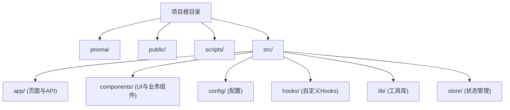
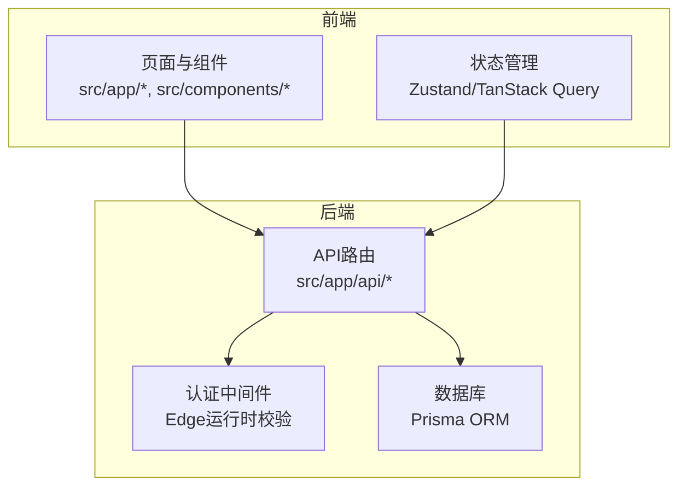
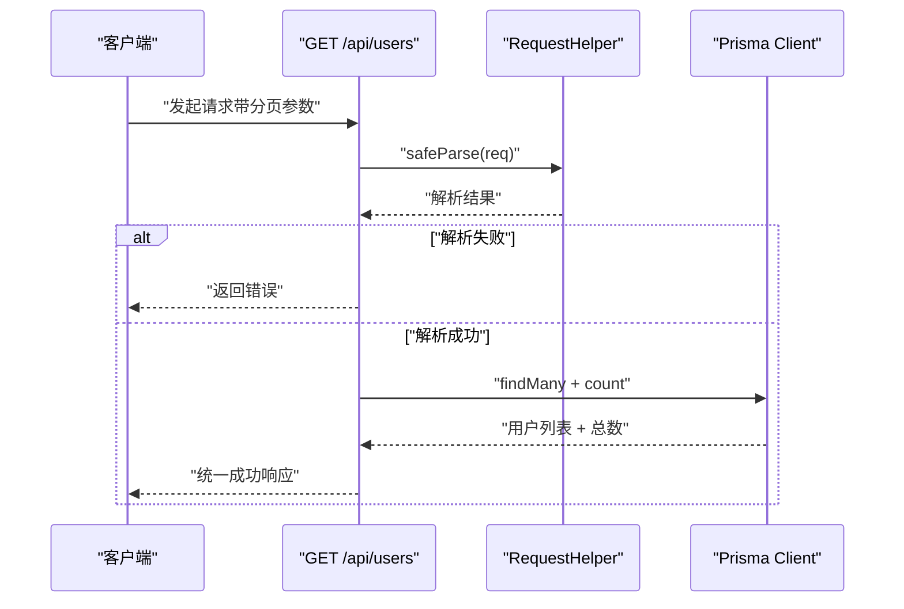
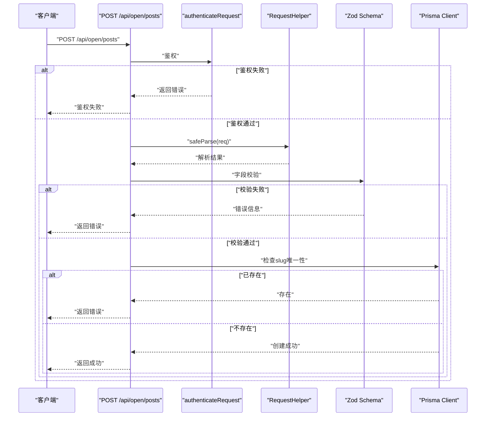
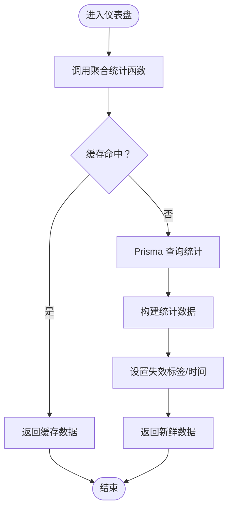
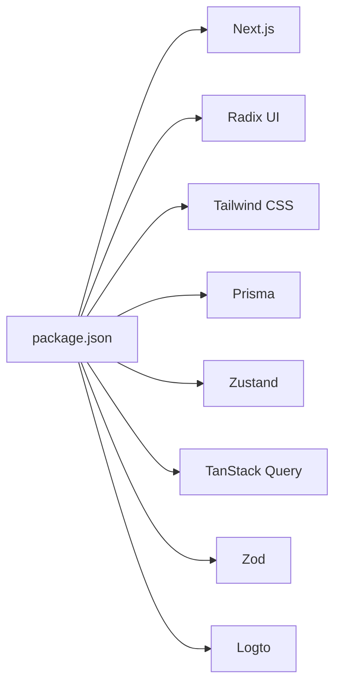

# 团队协作

<cite>
**本文引用的文件**
- [README.md](file://README.md)
- [AGENTS.md](file://AGENTS.md)
- [MAILER_GUIDE.md](file://MAILER_GUIDE.md)
- [package.json](file://package.json)
- [prisma/schema.prisma](file://prisma/schema.prisma)
- [src/app/api/users/route.ts](file://src/app/api/users/route.ts)
- [src/app/api/open/posts/route.ts](file://src/app/api/open/posts/route.ts)
- [src/app/dashboard/overview/actions.ts](file://src/app/dashboard/overview/actions.ts)
- [src/app/dashboard/email-logs/components/email-logs-list.tsx](file://src/app/dashboard/email-logs/components/email-logs-list.tsx)
- [src/app/dashboard/friend-links/components/contact-template.tsx](file://src/app/dashboard/friend-links/components/contact-template.tsx)
- [.agents/skills/nextjs-app-router-patterns/SKILL.md](file://.agents/skills/nextjs-app-router-patterns/SKILL.md)
- [.agents/skills/vercel-react-best-practices/AGENTS.md](file://.agents/skills/vercel-react-best-practices/AGENTS.md)
- [.agents/skills/vercel-react-best-practices/rules/bundle-dynamic-imports.md](file://.agents/skills/vercel-react-best-practices/rules/bundle-dynamic-imports.md)
- [.agents/skills/ui-ux-pro-max/SKILL.md](file://.agents/skills/ui-ux-pro-max/SKILL.md)
- [src/data/commands.json](file://src/data/commands.json)
</cite>

## 目录
1. [引言](#引言)
2. [项目结构](#项目结构)
3. [核心组件](#核心组件)
4. [架构总览](#架构总览)
5. [详细组件分析](#详细组件分析)
6. [依赖关系分析](#依赖关系分析)
7. [性能考量](#性能考量)
8. [故障排查指南](#故障排查指南)
9. [结论](#结论)
10. [附录](#附录)

## 引言
本文件面向“一梦五千年”项目团队，旨在建立统一、可执行的协作规范，覆盖任务分配、进度跟踪、知识分享、代码审查、文档维护、沟通协作、新成员入职与知识传承，以及如何有效利用项目中的AI技能文档与Agent工具，提升整体交付质量与效率。

## 项目结构
项目采用 Next.js App Router 分层组织，核心目录与职责如下：
- prisma：数据库模型与迁移
- public：静态资源
- scripts：运维与诊断脚本
- src/app：页面与API路由（前台、后台、编辑器、API）
- src/components：UI组件与业务组件
- src/config：配置（如后台菜单）
- src/hooks：自定义Hooks
- src/lib：工具库（数据库、认证、会话、邮件、HTTP封装等）
- src/store：全局状态（Zustand）

图表来源
- [AGENTS.md: 第31-67节:31-67](file://AGENTS.md#L31-L67)

章节来源
- [AGENTS.md: 第31-67节:31-67](file://AGENTS.md#L31-L67)
- [README.md: 第54-69节:54-69](file://README.md#L54-L69)

## 核心组件
- 开发工作流：遵循“从 dev 创建功能分支 → 开发与提交 → pnpm lint → 功能测试 → 提交PR → 合并”的闭环
- 代码风格：TypeScript + Prettier（ESLint集成）+ PascalCase组件命名 + kebab-case文件命名
- 路由结构：App Router + 路由分组（auth/site/dashboard）+ API路由位于 app/api/
- 状态管理：Zustand（全局）、TanStack Query（服务端数据缓存）、React Hooks（本地）
- 数据库：Prisma ORM + relationJoins + snake_case字段映射
- 认证与授权：Logto OIDC + 边缘中间件校验 + Cookie会话
- UI组件：Radix UI + Tailwind CSS + Material Design 原则
- 错误处理：生产构建忽略ESLint/TS错误 + Sonner Toast + try-catch
- 代码注释：JSDoc风格 + Prisma字段注释

章节来源
- [AGENTS.md: 第268-288节:268-288](file://AGENTS.md#L268-L288)
- [AGENTS.md: 第132-187节:132-187](file://AGENTS.md#L132-L187)
- [AGENTS.md: 第149-195节:149-195](file://AGENTS.md#L149-L195)
- [README.md: 第115-121节:115-121](file://README.md#L115-L121)

## 架构总览
系统采用前后端同构架构，前端页面与API路由通过 Next.js App Router 组织，数据访问通过 Prisma ORM，认证通过 Logto，缓存策略结合 Next.js 数据缓存与 Prisma 查询优化。

图表来源
- [AGENTS.md: 第191-266节:191-266](file://AGENTS.md#L191-L266)
- [AGENTS.md: 第163-168节:163-168](file://AGENTS.md#L163-L168)

## 详细组件分析

### 任务分配与进度跟踪
- 任务来源：Issue/需求评审 → 任务拆解 → 分配给开发人员
- 分支策略：从 dev 创建功能分支，命名清晰，关联 Issue
- 进度可见：PR 状态（Draft/Ready）+ 里程碑/标签（如 bug/feature/refactor）
- 质量门禁：pnpm lint 通过 + 单元/集成测试通过 + 代码审查通过

章节来源
- [AGENTS.md: 第268-276节:268-276](file://AGENTS.md#L268-L276)

### 代码审查规范
- PR 模板（建议）：标题简明、描述清晰、变更点摘要、风险与回滚预案、测试覆盖说明
- 审查清单（建议）：
  - 代码风格与规范（Prettier/ESLint）
  - 类型安全与边界条件
  - 性能与缓存策略（Next.js缓存/Prisma查询）
  - 安全（认证、授权、输入校验）
  - 可测试性（单元测试/集成测试）
  - 文档与注释（变更说明、JSDoc）
- 反馈处理：逐项回复 + 修改后重新审查 + 关联Issue关闭

章节来源
- [AGENTS.md: 第132-187节:132-187](file://AGENTS.md#L132-L187)

### 文档维护规范
- 技术文档更新：新增/修改功能同步更新 AGENTS.md 与 README.md
- API 文档维护：API路由文件中保留清晰注释与示例，必要时补充 OpenAPI 片段
- 变更日志管理：按版本记录重大变更、修复与破坏性改动，便于升级与回溯

章节来源
- [AGENTS.md: 第268-288节:268-288](file://AGENTS.md#L268-L288)

### 团队沟通协作指南
- 会议制度：站会（每日）、迭代计划/回顾（每周）、发布计划（每迭代）
- 问题跟踪：Issue 分类（bug/feature/task）+ 优先级（P0/P1/P2）+ 责任人
- 经验总结：每次迭代后沉淀最佳实践与反模式，形成知识库

章节来源
- [AGENTS.md: 第268-288节:268-288](file://AGENTS.md#L268-L288)

### 新成员入职与知识传承
- 入职指导：环境搭建（pnpm、数据库、认证配置）→ 核心模块导览（认证/博客/后台/工具）→ 代码规范与工作流
- 知识传承：老带新结对 → 文档与脚本讲解 → Agent工具与AI技能文档使用

章节来源
- [AGENTS.md: 第69-131节:69-131](file://AGENTS.md#L69-L131)

### AI技能文档与Agent工具使用
- Next.js App Router 最佳实践：Server Components + 数据获取 + Suspense + 缓存策略
- React/Next.js 性能规则：动态导入、事件监听优化、懒加载重型组件
- UI/UX 设计系统：Master + Override 层级检索与持久化
- 使用建议：以 .agents/skills 下的规则为基准，结合项目现状进行自动化重构与生成

章节来源
- [.agents/skills/nextjs-app-router-patterns/SKILL.md: 第94-158节:94-158](file://.agents/skills/nextjs-app-router-patterns/SKILL.md#L94-L158)
- [.agents/skills/vercel-react-best-practices/AGENTS.md: 第1-20节:1-20](file://.agents/skills/vercel-react-best-practices/AGENTS.md#L1-L20)
- [.agents/skills/vercel-react-best-practices/rules/bundle-dynamic-imports.md: 第1-36节:1-36](file://.agents/skills/vercel-react-best-practices/rules/bundle-dynamic-imports.md#L1-L36)
- [.agents/skills/ui-ux-pro-max/SKILL.md: 第139-175节:139-175](file://.agents/skills/ui-ux-pro-max/SKILL.md#L139-L175)

### API与数据流示例

#### 用户列表接口（GET /api/users）
该接口演示了分页、过滤、安全解析与统一返回结构。

图表来源
- [src/app/api/users/route.ts: 第1-51节:1-51](file://src/app/api/users/route.ts#L1-L51)

章节来源
- [src/app/api/users/route.ts: 第1-51节:1-51](file://src/app/api/users/route.ts#L1-L51)

#### 开放文章发布接口（POST /api/open/posts）
该接口展示了API Key鉴权、请求体解析、字段校验与唯一性检查。

图表来源
- [src/app/api/open/posts/route.ts: 第118-156节:118-156](file://src/app/api/open/posts/route.ts#L118-L156)

章节来源
- [src/app/api/open/posts/route.ts: 第118-156节:118-156](file://src/app/api/open/posts/route.ts#L118-L156)

#### 数据统计与缓存（仪表盘概览）
该模块展示了基于 Next.js 数据缓存与 Prisma 查询的聚合统计与趋势分析。

图表来源
- [src/app/dashboard/overview/actions.ts: 第67-176节:67-176](file://src/app/dashboard/overview/actions.ts#L67-L176)

章节来源
- [src/app/dashboard/overview/actions.ts: 第67-176节:67-176](file://src/app/dashboard/overview/actions.ts#L67-L176)

## 依赖关系分析
- 包管理：pnpm（工作区配置与锁文件）
- 核心依赖：Next.js、Radix UI、Tailwind CSS、Prisma、Zustand、TanStack Query、Zod、Logto
- 开发依赖：ESLint、TypeScript、Prisma CLI、Tailwind CSS

图表来源
- [package.json: 第1-98节:1-98](file://package.json#L1-L98)

章节来源
- [package.json: 第1-98节:1-98](file://package.json#L1-L98)

## 性能考量
- 缓存策略：列表读使用 Next.js 数据缓存（unstable_cache + revalidateTag），写操作时精准失效
- 数据库优化：开启 relationJoins，将 include 查询合并为单条 JOIN，减少往返
- 区域对齐：Vercel 函数与 Supabase 同区（ap-south-1），显著降低DB往返延迟
- 连接池：运行时使用 Supavisor 事务模式连接池，避免Serverless连接耗尽

章节来源
- [AGENTS.md: 第262-266节:262-266](file://AGENTS.md#L262-L266)

## 故障排查指南
- 邮件功能
  - 环境变量：确认 GMAIL_USER 与 GMAIL_APP_PASSWORD 配置
  - 频率限制：Gmail 对发送频率有限制，避免短时间内大量发送
  - 日志与重试：通过邮件日志页面查看失败记录并重试
- 数据库
  - 连接池与迁移：区分运行时连接池（6543）与迁移直连（5432）
  - 诊断脚本：使用 scripts/test-prisma-standard.ts 进行连接测试
- 认证
  - Logto 会话校验：Edge 中间件保护后台路由，确保会话有效性

章节来源
- [MAILER_GUIDE.md: 第11-189节:11-189](file://MAILER_GUIDE.md#L11-L189)
- [AGENTS.md: 第69-131节:69-131](file://AGENTS.md#L69-L131)
- [src/app/dashboard/email-logs/components/email-logs-list.tsx: 第90-159节:90-159](file://src/app/dashboard/email-logs/components/email-logs-list.tsx#L90-L159)

## 结论
通过统一的任务与进度管理、严格的代码审查与文档规范、高效的沟通协作机制，以及对AI技能文档与Agent工具的有效利用，“一梦五千年”项目能够持续高质量交付。建议团队在实践中不断迭代上述规范，结合项目演进与团队反馈，逐步完善知识库与自动化流程。

## 附录
- 常用命令与脚本
  - 开发：pnpm dev（9527端口）
  - 构建：pnpm build
  - 启动：pnpm start（9526端口）
  - Lint：pnpm lint
  - Prisma：npx prisma generate/migrate dev/studio
  - 邮件测试：npx tsx scripts/test-mailer.ts
- 数据库模型关键表
  - posts、comments、friend_links、ai_tools、tools、site_visits

章节来源
- [AGENTS.md: 第102-131节:102-131](file://AGENTS.md#L102-L131)
- [prisma/schema.prisma: 第111-143节:111-143](file://prisma/schema.prisma#L111-L143)
- [prisma/schema.prisma: 第177-222节:177-222](file://prisma/schema.prisma#L177-L222)