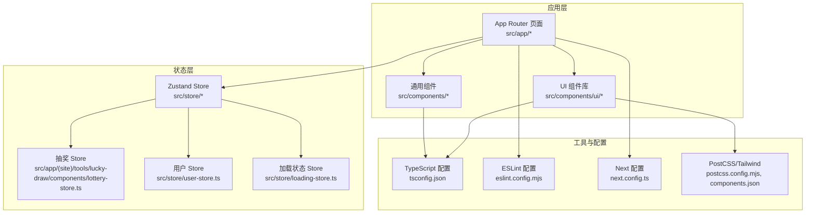
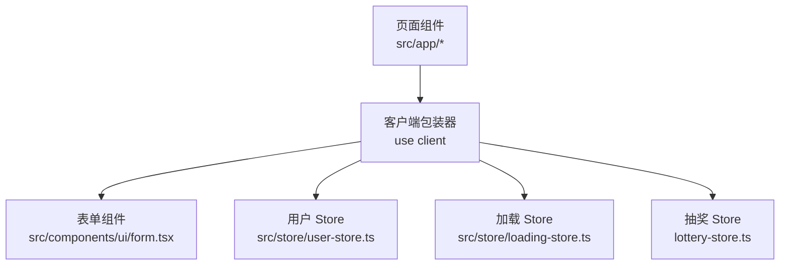
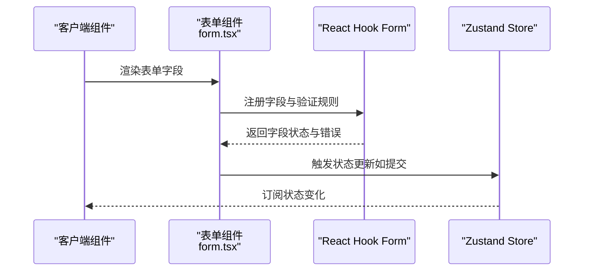
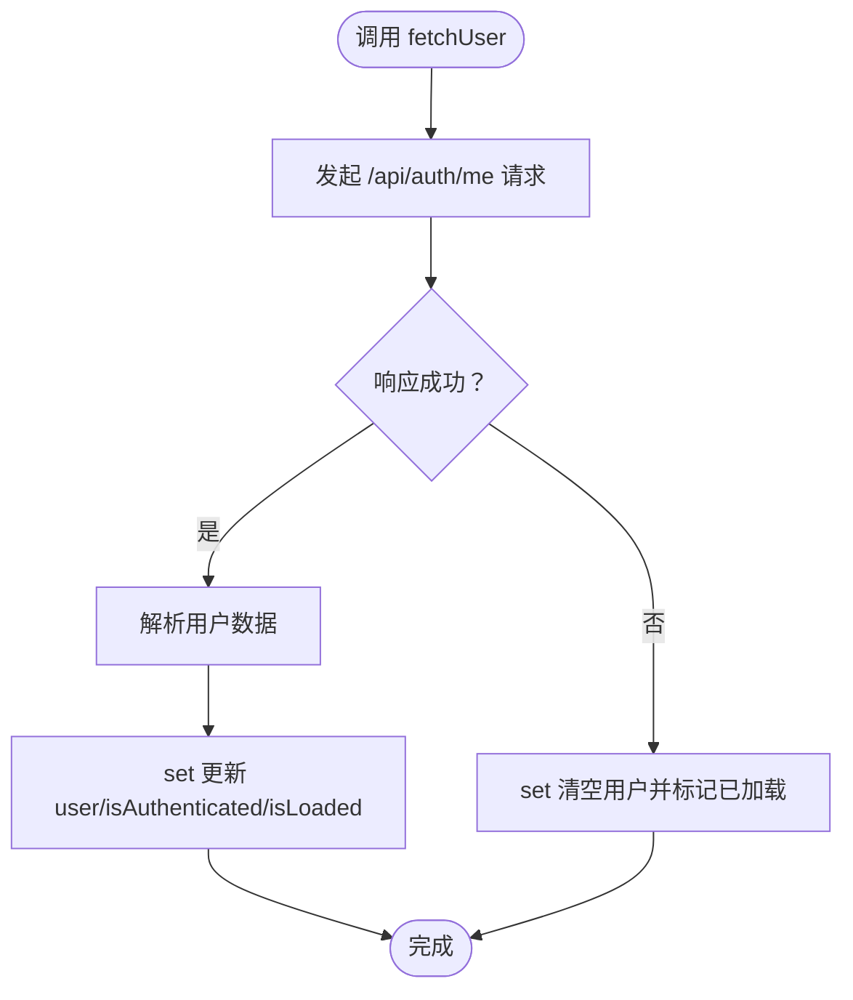
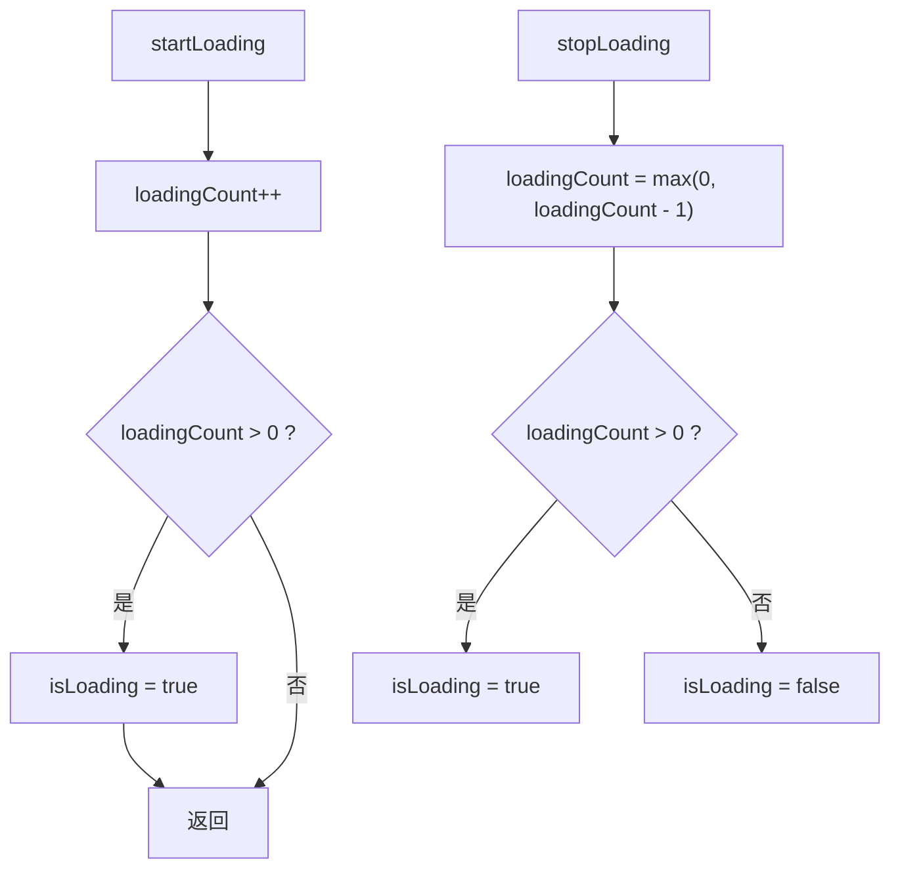
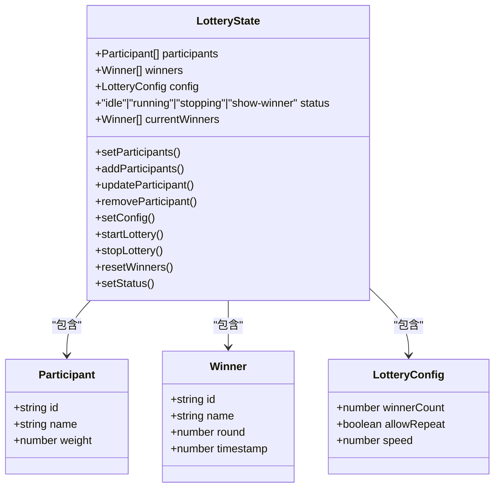
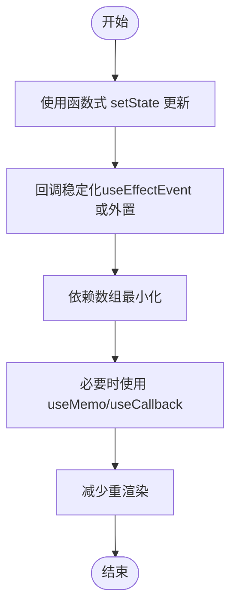
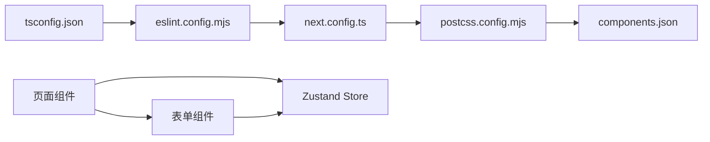
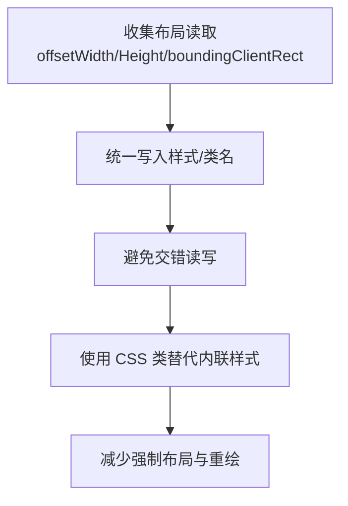

# 开发工具

<cite>
**本文引用的文件**
- [lottery-store.ts](file://src/app/(site)/tools/lucky-draw/components/lottery-store.ts)
- [user-store.ts](file://src/store/user-store.ts)
- [loading-store.ts](file://src/store/loading-store.ts)
- [form.tsx](file://src/components/ui/form.tsx)
- [toolbox-client.tsx](file://src/app/(site)/tools/components/toolbox-client.tsx)
- [rerender-functional-setstate.md](file://.agents/skills/vercel-react-best-practices/rules/rerender-functional-setstate.md)
- [advanced-use-latest.md](file://.agents/skills/vercel-react-best-practices/rules/advanced-use-latest.md)
- [js-batch-dom-css.md](file://.agents/skills/vercel-react-best-practices/rules/js-batch-dom-css.md)
- [rendering-hydration-no-flicker.md](file://.agents/skills/vercel-react-best-practices/rules/rendering-hydration-no-flicker.md)
- [package.json](file://package.json)
- [tsconfig.json](file://tsconfig.json)
- [eslint.config.mjs](file://eslint.config.mjs)
- [next.config.ts](file://next.config.ts)
- [postcss.config.mjs](file://postcss.config.mjs)
- [components.json](file://components.json)
</cite>

## 目录
1. [简介](#简介)
2. [项目结构](#项目结构)
3. [核心组件](#核心组件)
4. [架构总览](#架构总览)
5. [详细组件分析](#详细组件分析)
6. [依赖关系分析](#依赖关系分析)
7. [性能考量](#性能考量)
8. [故障排查指南](#故障排查指南)
9. [结论](#结论)
10. [附录](#附录)

## 简介
本指南面向“一梦五千年”项目的前端与全栈开发者，聚焦以下主题：
- 自定义 Hook 设计模式：useState、useEffect、useMemo、useCallback 的正确用法与常见陷阱
- Zustand 状态管理：store 设计、action 定义、状态订阅与持久化
- TypeScript 类型系统最佳实践：接口设计、泛型使用、类型守卫
- 调试技巧与开发辅助工具：日志、断点、浏览器 DevTools、React DevTools
- 性能分析与优化：重渲染控制、批处理 DOM/CSS、水合无闪烁、懒加载与动态导入
- 现代开发工具链：ESLint、Prettier、TypeScript、Next.js 配置与 Tailwind 工具集

## 项目结构
项目采用 Next.js App Router 结构，按功能域划分页面与组件；状态管理以 Zustand 为主，配合 React Hook Form 实现表单状态；UI 组件基于 Radix UI 与 Tailwind 构建。

图表来源
- [lottery-store.ts](file://src/app/(site)/tools/lucky-draw/components/lottery-store.ts#L1-L54)
- [user-store.ts:1-48](file://src/store/user-store.ts#L1-L48)
- [loading-store.ts:1-27](file://src/store/loading-store.ts#L1-L27)
- [form.tsx:1-167](file://src/components/ui/form.tsx#L1-L167)
- [tsconfig.json](file://tsconfig.json)
- [eslint.config.mjs](file://eslint.config.mjs)
- [next.config.ts](file://next.config.ts)
- [postcss.config.mjs](file://postcss.config.mjs)
- [components.json](file://components.json)

章节来源
- [lottery-store.ts](file://src/app/(site)/tools/lucky-draw/components/lottery-store.ts#L1-L54)
- [user-store.ts:1-48](file://src/store/user-store.ts#L1-L48)
- [loading-store.ts:1-27](file://src/store/loading-store.ts#L1-L27)
- [form.tsx:1-167](file://src/components/ui/form.tsx#L1-L167)
- [tsconfig.json](file://tsconfig.json)
- [eslint.config.mjs](file://eslint.config.mjs)
- [next.config.ts](file://next.config.ts)
- [postcss.config.mjs](file://postcss.config.mjs)
- [components.json](file://components.json)

## 核心组件
- 表单体系：基于 React Hook Form 的受控表单封装，提供字段上下文、错误状态与无障碍属性集成。
- 状态管理：Zustand 多个 store（用户、加载、抽奖），支持 action 定义与状态订阅。
- UI 组件：基于 Radix UI 的语义化组件，结合 Tailwind 提供一致的视觉与交互体验。
- 工具与配置：TypeScript、ESLint、Next.js、Tailwind 工具链统一规范与质量保障。

章节来源
- [form.tsx:1-167](file://src/components/ui/form.tsx#L1-L167)
- [user-store.ts:1-48](file://src/store/user-store.ts#L1-L48)
- [loading-store.ts:1-27](file://src/store/loading-store.ts#L1-L27)
- [lottery-store.ts](file://src/app/(site)/tools/lucky-draw/components/lottery-store.ts#L1-L54)

## 架构总览
下图展示页面、组件与状态之间的交互关系，以及开发工具链在构建期与运行期的作用。

图表来源
- [form.tsx:1-167](file://src/components/ui/form.tsx#L1-L167)
- [user-store.ts:1-48](file://src/store/user-store.ts#L1-L48)
- [loading-store.ts:1-27](file://src/store/loading-store.ts#L1-L27)
- [lottery-store.ts](file://src/app/(site)/tools/lucky-draw/components/lottery-store.ts#L1-L54)

## 详细组件分析

### 表单组件与 Hook 模式
- 字段上下文与控制器：通过 Context 传递字段名，Controller 将字段值与验证状态注入 UI 控件。
- 错误与无障碍：FormMessage 基于错误状态生成可访问的提示文本，并设置 aria-* 属性。
- 使用建议：优先使用受控组件与受控输入，避免直接操作 DOM；在复杂表单中拆分字段组，减少重渲染。

图表来源
- [form.tsx:1-167](file://src/components/ui/form.tsx#L1-L167)

章节来源
- [form.tsx:1-167](file://src/components/ui/form.tsx#L1-L167)

### Zustand 用户状态管理
- Store 设计：清晰分离用户数据、认证状态与加载标志；action 使用函数式更新避免闭包问题。
- 认证流程：fetchUser 异步获取用户信息并更新状态；logout 导航到后端登出接口。
- 最佳实践：使用 set 的函数形式进行派生更新；避免在 action 中直接访问外部副作用，保持纯函数式更新。

图表来源
- [user-store.ts:26-38](file://src/store/user-store.ts#L26-L38)

章节来源
- [user-store.ts:1-48](file://src/store/user-store.ts#L1-L48)

### Zustand 加载状态管理
- 计数式加载：startLoading/increment，stopLoading/decrement，内部维护 loadingCount 并计算 isLoading。
- 使用场景：并发请求或嵌套异步任务时，确保所有任务完成后才关闭全局加载态。

图表来源
- [loading-store.ts:16-26](file://src/store/loading-store.ts#L16-L26)

章节来源
- [loading-store.ts:1-27](file://src/store/loading-store.ts#L1-L27)

### Zustand 抽奖状态管理（含持久化）
- 数据模型：参与者、获奖者、配置（中奖人数、是否允许重复、速度）。
- 动作设计：增删改查参与者、批量添加、启动/停止/重置状态、设置当前轮次获奖者。
- 持久化：使用 persist 中间件将状态保存至本地存储，实现刷新不丢失。

图表来源
- [lottery-store.ts](file://src/app/(site)/tools/lucky-draw/components/lottery-store.ts#L4-L40)

章节来源
- [lottery-store.ts](file://src/app/(site)/tools/lucky-draw/components/lottery-store.ts#L1-L54)

### 自定义 Hook 设计模式与最佳实践
- useState：优先使用函数式更新，避免读取过期状态；在派生逻辑中使用 useMemo 缓存结果。
- useEffect：合理设置依赖数组；对回调稳定化使用 useEffectEvent 或将回调外置。
- useCallback：对作为 props 传递的回调进行稳定化，减少子组件重渲染。
- useMemo：缓存昂贵计算或深层比较对象，注意依赖项完整性。
- 闭包与重渲染：参考“函数式 setState 更新”规则，避免 stale closure 与不必要的回调重建。

图表来源
- [rerender-functional-setstate.md:8-72](file://.agents/skills/vercel-react-best-practices/rules/rerender-functional-setstate.md#L8-L72)
- [advanced-use-latest.md:8-38](file://.agents/skills/vercel-react-best-practices/rules/advanced-use-latest.md#L8-L38)

章节来源
- [rerender-functional-setstate.md:1-75](file://.agents/skills/vercel-react-best-practices/rules/rerender-functional-setstate.md#L1-L75)
- [advanced-use-latest.md:1-40](file://.agents/skills/vercel-react-best-practices/rules/advanced-use-latest.md#L1-L40)

### TypeScript 类型系统最佳实践
- 接口设计：为 store 状态与 API 响应定义明确的接口，避免 any；使用只读与可选字段表达业务约束。
- 泛型使用：在通用组件与工具函数中使用泛型约束，提升复用性与类型安全。
- 类型守卫：对联合类型进行运行时检查，确保分支内的类型收敛；在复杂对象上使用类型守卫函数。
- 配置要点：启用严格模式与合理的编译选项，结合 ESLint 规则保证一致性。

章节来源
- [tsconfig.json](file://tsconfig.json)

### 调试技巧与开发辅助工具
- 浏览器与 React DevTools：检查组件树、状态快照、事件流与重渲染触发点。
- 日志与断点：在 action 与 effect 中插入日志，定位状态变更来源；对异步流程使用断点逐步执行。
- 表单调试：利用 React Hook Form 的错误输出与无障碍属性，快速定位校验失败原因。
- 工具链：ESLint 与 Prettier 统一风格；TypeScript 在构建期捕获类型错误；Tailwind 与 PostCSS 辅助样式调试。

章节来源
- [eslint.config.mjs](file://eslint.config.mjs)
- [form.tsx:1-167](file://src/components/ui/form.tsx#L1-L167)

## 依赖关系分析
- 组件与状态：页面组件通过客户端入口使用多个 Zustand store；表单组件与 store 之间通过状态订阅联动。
- 工具链：TypeScript、ESLint、Next.js 与 Tailwind 共同构成开发与构建基础。

图表来源
- [tsconfig.json](file://tsconfig.json)
- [eslint.config.mjs](file://eslint.config.mjs)
- [next.config.ts](file://next.config.ts)
- [postcss.config.mjs](file://postcss.config.mjs)
- [components.json](file://components.json)

章节来源
- [tsconfig.json](file://tsconfig.json)
- [eslint.config.mjs](file://eslint.config.mjs)
- [next.config.ts](file://next.config.ts)
- [postcss.config.mjs](file://postcss.config.mjs)
- [components.json](file://components.json)

## 性能考量
- 重渲染控制：遵循“函数式 setState 更新”原则，减少回调重建；对 props 进行稳定化与 memo 化。
- DOM/CSS 批处理：先集中读取布局信息，再统一写入样式；优先使用 CSS 类而非内联样式。
- 水合无闪烁：服务端与客户端状态同步，避免首屏闪烁与水合不匹配。
- 资源加载：对重型组件使用动态导入与懒加载；对工具列表等区域采用虚拟滚动或分页。

图表来源
- [js-batch-dom-css.md:47-103](file://.agents/skills/vercel-react-best-practices/rules/js-batch-dom-css.md#L47-L103)
- [rendering-hydration-no-flicker.md:53-80](file://.agents/skills/vercel-react-best-practices/rules/rendering-hydration-no-flicker.md#L53-L80)

章节来源
- [js-batch-dom-css.md:1-108](file://.agents/skills/vercel-react-best-practices/rules/js-batch-dom-css.md#L1-L108)
- [rendering-hydration-no-flicker.md:1-83](file://.agents/skills/vercel-react-best-practices/rules/rendering-hydration-no-flicker.md#L1-L83)

## 故障排查指南
- 表单错误：检查 FormMessage 输出与字段注册，确认验证规则与错误键一致。
- 状态异常：核对 Zustand action 是否使用函数式更新；检查订阅组件是否正确消费状态。
- 重渲染问题：使用 React DevTools Profiler 分析；根据“函数式 setState 更新”规则修正回调与依赖。
- 水合问题：确保客户端脚本在内容渲染前执行，避免主题切换或用户偏好导致的闪烁。
- 工具链问题：检查 ESLint 与 TypeScript 配置是否冲突；确认 Next.js 与 Tailwind 版本兼容。

章节来源
- [form.tsx:1-167](file://src/components/ui/form.tsx#L1-L167)
- [user-store.ts:1-48](file://src/store/user-store.ts#L1-L48)
- [loading-store.ts:1-27](file://src/store/loading-store.ts#L1-L27)
- [lottery-store.ts](file://src/app/(site)/tools/lucky-draw/components/lottery-store.ts#L1-L54)
- [rendering-hydration-no-flicker.md:53-80](file://.agents/skills/vercel-react-best-practices/rules/rendering-hydration-no-flicker.md#L53-L80)

## 结论
通过规范化自定义 Hook 使用、结构化的 Zustand 状态设计、严格的 TypeScript 类型约束与完善的开发工具链，项目能够在复杂功能与良好性能之间取得平衡。建议在新增模块时复用现有模式与最佳实践，持续优化重渲染与资源加载策略。

## 附录
- 现代开发工具链配置要点
  - TypeScript：启用严格模式与合理编译选项，确保类型安全。
  - ESLint：统一代码风格与 React 规范，结合 TypeScript 插件。
  - Next.js：按需开启实验特性，配合 App Router 与客户端组件。
  - Tailwind：使用组件映射与原子类，结合 PostCSS 优化产物。

章节来源
- [tsconfig.json](file://tsconfig.json)
- [eslint.config.mjs](file://eslint.config.mjs)
- [next.config.ts](file://next.config.ts)
- [postcss.config.mjs](file://postcss.config.mjs)
- [components.json](file://components.json)