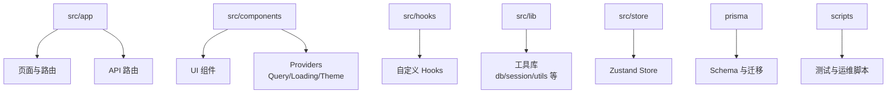
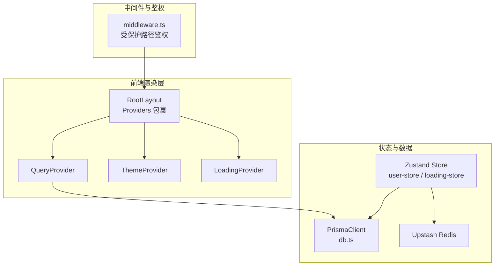
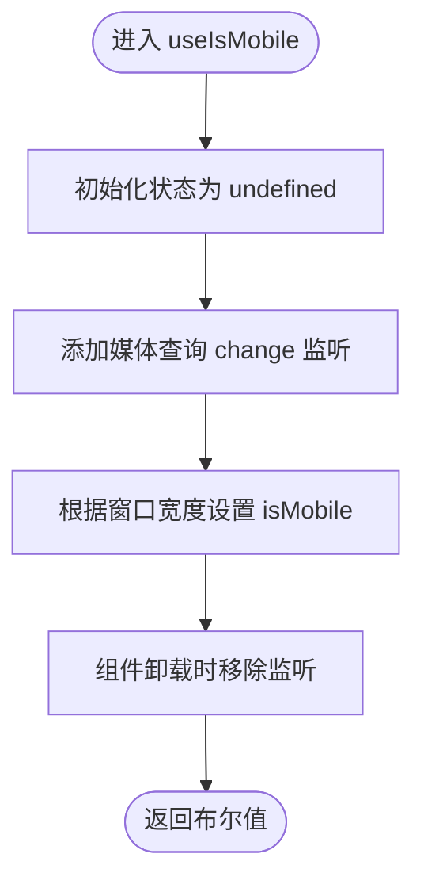
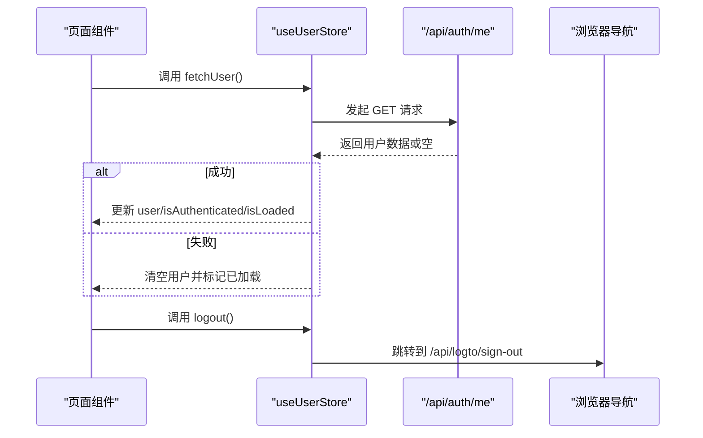
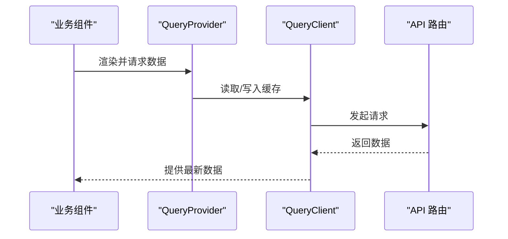
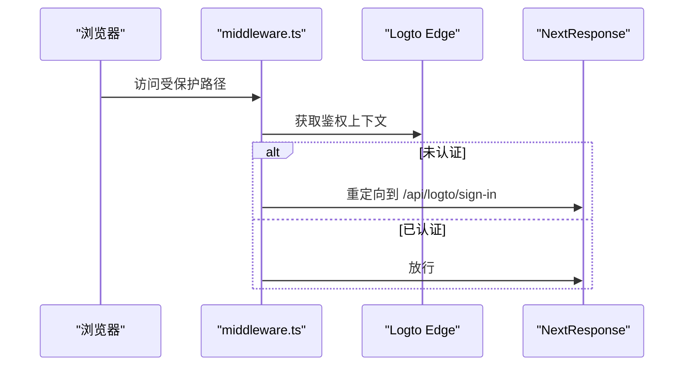
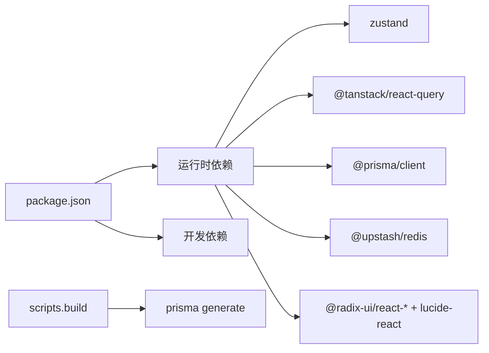

# 开发指南

<cite>
**本文引用的文件**
- [README.md](file://README.md)
- [package.json](file://package.json)
- [tsconfig.json](file://tsconfig.json)
- [eslint.config.mjs](file://eslint.config.mjs)
- [next.config.ts](file://next.config.ts)
- [src/hooks/use-mobile.ts](file://src/hooks/use-mobile.ts)
- [src/store/loading-store.ts](file://src/store/loading-store.ts)
- [src/store/user-store.ts](file://src/store/user-store.ts)
- [src/lib/utils.ts](file://src/lib/utils.ts)
- [src/middleware.ts](file://src/middleware.ts)
- [src/app/layout.tsx](file://src/app/layout.tsx)
- [src/components/providers/query-provider.tsx](file://src/components/providers/query-provider.tsx)
- [src/components/providers/theme-provider.tsx](file://src/components/providers/theme-provider.tsx)
- [src/lib/db.ts](file://src/lib/db.ts)
- [src/lib/session.ts](file://src/lib/session.ts)
</cite>

## 目录
1. [简介](#简介)
2. [项目结构](#项目结构)
3. [核心组件](#核心组件)
4. [架构总览](#架构总览)
5. [详细组件分析](#详细组件分析)
6. [依赖关系分析](#依赖关系分析)
7. [性能考量](#性能考量)
8. [故障排查指南](#故障排查指南)
9. [结论](#结论)
10. [附录](#附录)

## 简介
本指南面向“一梦五千年”项目的核心开发者与贡献者，系统性阐述开发规范、最佳实践、技术选型与实现细节，覆盖以下主题：
- TypeScript 编码规范与类型设计
- 组件命名与文件组织
- 开发流程（分支、评审、发布）
- 自定义 Hooks 设计与实现
- 状态管理（Zustand）与全局状态设计
- 数据获取与缓存（TanStack Query、Redis）
- 调试技巧与开发工具
- 单元与集成测试策略
- 代码重构与遗留代码处理
- 团队协作与知识分享

## 项目结构
项目采用 Next.js App Router 结构，核心目录与职责如下：
- src/app：页面与路由（含分组路由、模态页、API 路由）
- src/components：可复用 UI 组件与 Provider
- src/hooks：自定义 Hooks
- src/lib：工具库与服务封装（数据库、会话、邮件、HTTP 等）
- src/store：Zustand 状态存储
- prisma：数据库模型与迁移
- scripts：开发与运维脚本
- public/static/logo：静态资源
- 配置：tsconfig.json、eslint.config.mjs、next.config.ts、components.json

章节来源
- [README.md:54-69](file://README.md#L54-L69)

## 核心组件
本节聚焦关键基础设施组件及其职责边界。

- 中间件与认证
  - middleware.ts：对受保护路径进行鉴权重定向，Edge 环境下使用 Logto 客户端上下文校验。
- 查询客户端与缓存
  - query-provider.tsx：初始化 TanStack Query，默认查询缓存时间 60 秒。
- 主题提供器
  - theme-provider.tsx：基于 next-themes 提供深浅主题切换。
- 工具函数
  - utils.ts：cn 组合类名，结合 clsx 与 tailwind-merge 实现安全合并。
- 数据库连接
  - db.ts：全局单例 PrismaClient，开发环境下开启日志。
- 会话与用户
  - session.ts：利用 React cache 对同一请求内的多次调用做去重，结合 Logto 与 Prisma 获取当前用户。

章节来源
- [src/middleware.ts:1-36](file://src/middleware.ts#L1-L36)
- [src/components/providers/query-provider.tsx:1-22](file://src/components/providers/query-provider.tsx#L1-L22)
- [src/components/providers/theme-provider.tsx:1-13](file://src/components/providers/theme-provider.tsx#L1-L13)
- [src/lib/utils.ts:1-7](file://src/lib/utils.ts#L1-L7)
- [src/lib/db.ts:1-16](file://src/lib/db.ts#L1-L16)
- [src/lib/session.ts:1-42](file://src/lib/session.ts#L1-L42)

## 架构总览
整体运行时由前端渲染层、中间件鉴权层、状态与数据层构成，并通过 API 路由与数据库交互。

图表来源
- [src/app/layout.tsx:1-52](file://src/app/layout.tsx#L1-L52)
- [src/components/providers/query-provider.tsx:1-22](file://src/components/providers/query-provider.tsx#L1-L22)
- [src/components/providers/theme-provider.tsx:1-13](file://src/components/providers/theme-provider.tsx#L1-L13)
- [src/middleware.ts:1-36](file://src/middleware.ts#L1-L36)
- [src/lib/db.ts:1-16](file://src/lib/db.ts#L1-L16)
- [src/store/user-store.ts:1-49](file://src/store/user-store.ts#L1-L49)
- [src/store/loading-store.ts:1-28](file://src/store/loading-store.ts#L1-L28)

## 详细组件分析

### 自定义 Hooks 设计与实现
- useIsMobile：基于媒体查询监听窗口宽度变化，返回布尔值；注意在卸载时移除事件监听，避免内存泄漏。
- 设计要点
  - 初始化状态使用 undefined 表示未决，首屏渲染更可控。
  - 将变更监听绑定到 useEffect 生命周期内，确保只挂载一次。
  - 返回值统一为布尔，便于条件渲染与样式切换。

图表来源
- [src/hooks/use-mobile.ts:1-20](file://src/hooks/use-mobile.ts#L1-L20)

章节来源
- [src/hooks/use-mobile.ts:1-20](file://src/hooks/use-mobile.ts#L1-L20)

### 状态管理方案（Zustand）
- user-store：封装用户信息、认证状态与加载状态，提供拉取用户、更新用户、登出等动作；登出通过跳转至 API 登出路由实现。
- loading-store：提供全局加载状态与计数器，支持多处并发加载叠加与归零控制，避免闪烁与竞态。
- 设计模式
  - 使用 create 创建 Store，将状态与派生逻辑收敛在单一文件中。
  - 异步动作集中处理错误兜底，保证状态一致性。
  - 通过 startLoading/stopLoading 实现“并发安全”的加载指示。

图表来源
- [src/store/user-store.ts:1-49](file://src/store/user-store.ts#L1-L49)

章节来源
- [src/store/user-store.ts:1-49](file://src/store/user-store.ts#L1-L49)
- [src/store/loading-store.ts:1-28](file://src/store/loading-store.ts#L1-L28)

### 数据获取与缓存（TanStack Query）
- QueryProvider：初始化 QueryClient 并设置默认 staleTime 为 60 秒，减少重复请求与网络抖动影响。
- 使用建议
  - 在页面级或布局级包裹 QueryProvider，确保子树共享缓存。
  - 对高频读取的数据启用合理的 staleTime 与 refetch 策略。
  - 利用 queryClient.invalidateQueries 触发精准刷新。

图表来源
- [src/components/providers/query-provider.tsx:1-22](file://src/components/providers/query-provider.tsx#L1-L22)

章节来源
- [src/components/providers/query-provider.tsx:1-22](file://src/components/providers/query-provider.tsx#L1-L22)

### 中间件与鉴权（Logto Edge）
- middleware.ts：对 /dashboard 与受保护的 /admin 路径进行鉴权；若未认证则重定向至登录回调。
- 关键点
  - 使用 Edge 环境下的 Logto 客户端上下文，减少 SSR 开销。
  - 配置匹配器仅对目标路径生效，降低无关请求开销。

图表来源
- [src/middleware.ts:1-36](file://src/middleware.ts#L1-L36)

章节来源
- [src/middleware.ts:1-36](file://src/middleware.ts#L1-L36)

### 工具函数与通用能力
- cn：组合类名，避免重复与冲突，提升样式维护性。
- db：全局单例 PrismaClient，开发环境开启日志，便于调试。
- session：React cache 去重同一请求内的多次调用，结合 Logto 与 Prisma 获取当前用户。

章节来源
- [src/lib/utils.ts:1-7](file://src/lib/utils.ts#L1-L7)
- [src/lib/db.ts:1-16](file://src/lib/db.ts#L1-L16)
- [src/lib/session.ts:1-42](file://src/lib/session.ts#L1-L42)

## 依赖关系分析
- 运行时依赖
  - Next.js 16、Radix UI + Tailwind CSS 4、Zustand、TanStack Query、Prisma、Nodemailer、Upstash Redis 等。
- 开发依赖
  - TypeScript 5、ESLint Next 配置、TailwindCSS 4、Prisma 工具链。
- 构建与脚本
  - dev/start/build/lint；构建前先执行 prisma generate。

图表来源
- [package.json:1-98](file://package.json#L1-L98)

章节来源
- [package.json:1-98](file://package.json#L1-L98)

## 性能考量
- 加载状态管理
  - 使用 loading-store 的计数器模式，避免并发加载导致的状态闪烁与竞态。
- 查询缓存
  - QueryProvider 设置合理的 staleTime，减少重复请求；对敏感数据可按需禁用缓存或手动失效。
- 样式合并
  - 使用 cn 与 tailwind-merge 避免类名冲突与冗余，减小 CSS 体积。
- 数据库访问
  - 使用 React cache 去重同一请求内的多次会话查询，降低鉴权与数据库压力。
- 中间件
  - Edge 环境鉴权，减少 SSR 阶段的无谓计算。

章节来源
- [src/store/loading-store.ts:1-28](file://src/store/loading-store.ts#L1-L28)
- [src/components/providers/query-provider.tsx:1-22](file://src/components/providers/query-provider.tsx#L1-L22)
- [src/lib/utils.ts:1-7](file://src/lib/utils.ts#L1-L7)
- [src/lib/session.ts:1-42](file://src/lib/session.ts#L1-L42)
- [src/middleware.ts:1-36](file://src/middleware.ts#L1-L36)

## 故障排查指南
- 构建与类型错误
  - next.config.ts 允许构建阶段忽略 ESLint 与 TypeScript 错误，便于部署；如需严格校验，可临时关闭忽略选项。
- 数据库连接
  - 确认 DATABASE_URL 环境变量正确；开发环境日志开启有助于定位慢查询。
- 鉴权问题
  - 检查 middleware.ts 的受保护路径匹配与重定向逻辑；确认 Edge 环境下 Logto 上下文可用。
- 状态异常
  - 用户状态拉取失败时会回退为空，检查 /api/auth/me 接口与网络；Zustand 状态应保持幂等更新。
- 样式冲突
  - 使用 cn 合并类名，避免重复覆盖；确认 Tailwind 配置与组件层级顺序。

章节来源
- [next.config.ts:1-16](file://next.config.ts#L1-L16)
- [src/lib/db.ts:1-16](file://src/lib/db.ts#L1-L16)
- [src/middleware.ts:1-36](file://src/middleware.ts#L1-L36)
- [src/store/user-store.ts:1-49](file://src/store/user-store.ts#L1-L49)
- [src/lib/utils.ts:1-7](file://src/lib/utils.ts#L1-L7)

## 结论
本指南从规范、架构、组件与工具四个维度总结了“一梦五千年”项目的开发实践。建议团队在日常迭代中持续遵循：
- TypeScript 与 ESLint 规范，保持一致的代码风格与类型安全
- Zustand 与 TanStack Query 的清晰边界与最小状态原则
- React cache 与中间件的性能优化策略
- 以文档与脚本驱动的测试与发布流程

## 附录

### TypeScript 编码规范与最佳实践
- 类型设计
  - 优先使用接口表达对象契约，避免过深嵌套；对可选字段明确标注。
  - 使用 Partial<T> 更新用户资料等场景，避免一次性传入整个对象。
- 泛型与类型推导
  - 在自定义 Hooks 与工具函数中合理使用泛型约束，提升复用性。
  - 利用 TS 的类型推导减少冗余声明，保持签名简洁。
- 文件与命名
  - 组件使用 PascalCase，文件名 kebab-case；类型文件置于 src/types 下统一管理。
- 路径别名
  - 使用 @/* 统一导入路径，提升可移植性。

章节来源
- [tsconfig.json:1-43](file://tsconfig.json#L1-L43)
- [src/store/user-store.ts:1-49](file://src/store/user-store.ts#L1-L49)
- [src/lib/utils.ts:1-7](file://src/lib/utils.ts#L1-L7)

### 组件命名约定与文件组织
- 组件命名：PascalCase（如 Button、Card、Dialog）
- 文件命名：kebab-case（如 button.tsx、card.tsx）
- 组织方式：按功能域分层（如 src/components/ui、src/components/site），避免平铺。

章节来源
- [README.md:115-121](file://README.md#L115-L121)

### 开发流程（分支、评审、发布）
- 分支策略
  - 主干保护：master/main 不直接提交，通过 Pull Request 合并。
  - 功能分支：feature/*、fix/*、chore/* 前缀区分用途。
- 代码评审
  - PR 至少一名维护者评审；关注类型安全、状态管理与性能影响。
- 版本发布
  - 使用语义化版本号；构建前执行 prisma generate；CI 中可配置忽略类型/ESLint 错误以保障部署。

章节来源
- [package.json:5-10](file://package.json#L5-L10)
- [next.config.ts:5-12](file://next.config.ts#L5-L12)

### 自定义 Hooks 设计清单
- 输入输出明确：参数与返回值具备清晰类型
- 副作用隔离：在 useEffect 内部处理事件监听与定时器
- 清理逻辑：始终在卸载时移除监听与取消订阅
- 性能优化：必要时使用 useMemo/useCallback，避免不必要的重渲染

章节来源
- [src/hooks/use-mobile.ts:1-20](file://src/hooks/use-mobile.ts#L1-L20)

### 状态管理最佳实践（Zustand）
- 最小状态：仅存放跨组件共享且必要的状态
- 动作聚合：将异步操作封装在 Store 内，统一错误处理
- 持久化：可选地结合本地存储或服务端会话，避免刷新丢失
- 并发安全：使用计数器模式管理全局加载状态

章节来源
- [src/store/loading-store.ts:1-28](file://src/store/loading-store.ts#L1-L28)
- [src/store/user-store.ts:1-49](file://src/store/user-store.ts#L1-L49)

### 调试技巧与开发工具
- ESLint：遵循 next.config.ts 的忽略策略，开发期严格，部署期宽容
- 日志：开发环境开启 Prisma 日志；使用 Query Devtools 辅助观察缓存与失效
- 浏览器工具：React Devtools + Profiler；Network 面板观察请求与缓存命中
- 命令行：使用 npx tsx scripts/* 执行测试脚本与工具

章节来源
- [eslint.config.mjs:1-19](file://eslint.config.mjs#L1-L19)
- [next.config.ts:1-16](file://next.config.ts#L1-L16)
- [src/lib/db.ts:1-16](file://src/lib/db.ts#L1-L16)

### 单元与集成测试策略
- 单元测试
  - 对纯函数与工具函数（如 cn、useIsMobile）编写断言，覆盖边界与异常路径
- 集成测试
  - 使用 Mock 或 Test DB 运行端到端场景；对受保护路由与鉴权流程进行冒烟测试
- 覆盖范围
  - 重点覆盖状态更新、错误回退、并发加载与缓存失效路径

章节来源
- [src/lib/utils.ts:1-7](file://src/lib/utils.ts#L1-L7)
- [src/hooks/use-mobile.ts:1-20](file://src/hooks/use-mobile.ts#L1-L20)
- [src/store/loading-store.ts:1-28](file://src/store/loading-store.ts#L1-L28)
- [src/store/user-store.ts:1-49](file://src/store/user-store.ts#L1-L49)

### 代码重构原则与遗留代码处理
- 原则
  - 保持向后兼容；拆分大函数与复杂组件；引入类型约束与单元测试
- 遗留处理
  - 逐步替换旧实现；为过渡期增加注释与废弃提示；优先处理阻塞问题与性能瓶颈

### 团队协作规范与知识分享
- 规范
  - 统一的命名与文件组织；PR 描述清晰、包含动机与风险评估
- 分享
  - 通过文档与演示推动最佳实践落地；定期回顾与复盘