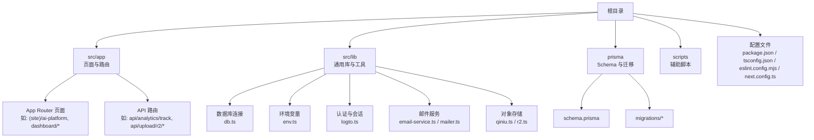
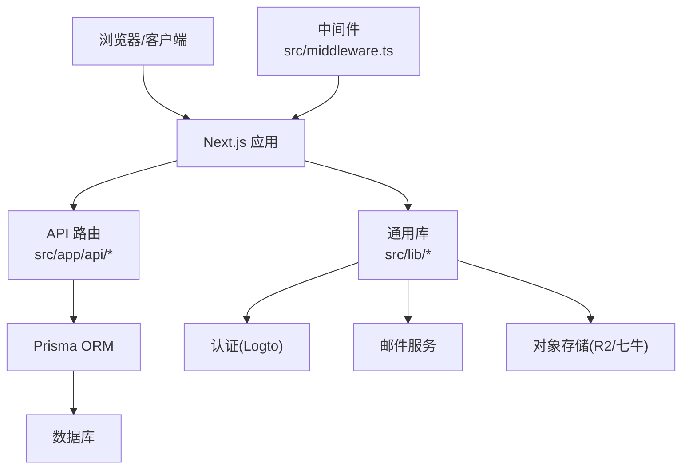
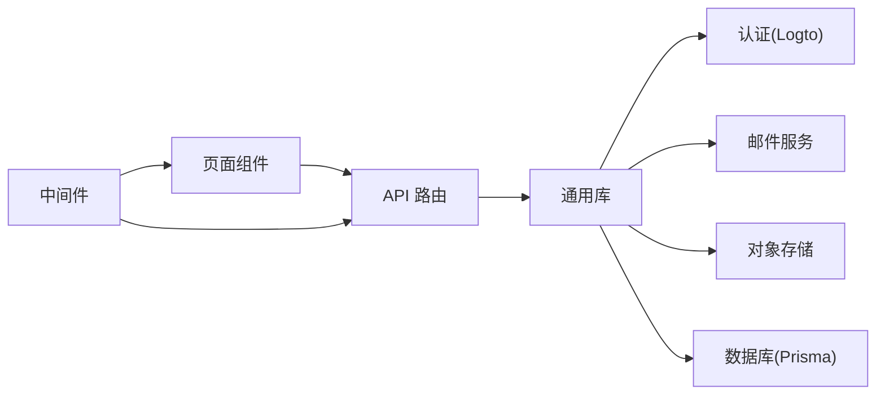

# 开发流程

<cite>
**本文引用的文件**
- [README.md](file://README.md)
- [package.json](file://package.json)
- [next.config.ts](file://next.config.ts)
- [eslint.config.mjs](file://eslint.config.mjs)
- [tsconfig.json](file://tsconfig.json)
- [prisma/schema.prisma](file://prisma/schema.prisma)
- [prisma/migrations/migration_lock.toml](file://prisma/migrations/migration_lock.toml)
- [scripts/set-db-timezone.ts](file://scripts/set-db-timezone.ts)
- [scripts/test-prisma-standard.ts](file://scripts/test-prisma-standard.ts)
- [src/lib/db.ts](file://src/lib/db.ts)
- [src/lib/env.ts](file://src/lib/env.ts)
- [src/lib/logto.ts](file://src/lib/logto.ts)
- [src/lib/email-service.ts](file://src/lib/email-service.ts)
- [src/lib/mailer.ts](file://src/lib/mailer.ts)
- [src/lib/qiniu.ts](file://src/lib/qiniu.ts)
- [src/lib/r2.ts](file://src/lib/r2.ts)
- [src/app/api/analytics/track/route.ts](file://src/app/api/analytics/track/route.ts)
- [src/app/api/auth/me/route.ts](file://src/app/api/auth/me/route.ts)
- [src/app/api/open/posts/route.ts](file://src/app/api/open/posts/route.ts)
- [src/app/api/send/route.ts](file://src/app/api/send/route.ts)
- [src/app/api/upload/r2/upload/route.ts](file://src/app/api/upload/r2/upload/route.ts)
- [src/app/api/upload/r2/token/route.ts](file://src/app/api/upload/r2/token/route.ts)
- [src/app/api/upload/r2/url/route.ts](file://src/app/api/upload/r2/url/route.ts)
- [src/app/admin/login/page.tsx](file://src/app/admin/login/page.tsx)
- [src/app/dashboard/layout.tsx](file://src/app/dashboard/layout.tsx)
- [src/app/(site)/ai-platform/actions.ts](file://src/app/(site)/ai-platform/actions.ts)
- [src/app/(site)/friends/actions.ts](file://src/app/(site)/friends/actions.ts)
- [src/app/dashboard/tools/actions.ts](file://src/app/dashboard/tools/actions.ts)
- [src/app/dashboard/posts/actions.ts](file://src/app/dashboard/posts/actions.ts)
- [src/app/dashboard/categories/actions.ts](file://src/app/dashboard/categories/actions.ts)
- [src/app/dashboard/comments/actions.ts](file://src/app/dashboard/comments/actions.ts)
- [src/app/dashboard/users/actions.ts](file://src/app/dashboard/users/actions.ts)
- [src/app/dashboard/friend-links/actions.ts](file://src/app/dashboard/friend-links/actions.ts)
- [src/app/dashboard/email-logs/actions.ts](file://src/app/dashboard/email-logs/actions.ts)
- [src/middleware.ts](file://src/middleware.ts)
- [.gitignore](file://.gitignore)
</cite>

## 目录
1. [简介](#简介)
2. [项目结构](#项目结构)
3. [核心组件](#核心组件)
4. [架构总览](#架构总览)
5. [详细组件分析](#详细组件分析)
6. [依赖关系分析](#依赖关系分析)
7. [性能考虑](#性能考虑)
8. [故障排查指南](#故障排查指南)
9. [结论](#结论)
10. [附录](#附录)

## 简介
本文件面向“一梦五千年”项目的开发团队与贡献者，提供从环境搭建、分支管理、代码提交、Pull Request 到本地开发至生产部署的全流程规范；同时涵盖版本控制最佳实践（含 commit message 规范、标签与发布流程）、常见开发场景操作指南（新功能开发、Bug 修复、性能优化）以及开发工具链配置与使用方法。内容基于仓库现有实现进行提炼与总结，确保可执行性与一致性。

## 项目结构
项目采用 Next.js App Router 架构，前端页面按功能域组织在 src/app 下，服务端 API 路由位于 src/app/api 子目录中；数据访问通过 Prisma ORM 进行，数据库迁移脚本位于 prisma/migrations；通用库与工具位于 src/lib；开发工具配置集中在根目录的配置文件中。

图表来源
- [next.config.ts:1-200](file://next.config.ts#L1-L200)
- [prisma/schema.prisma:1-200](file://prisma/schema.prisma#L1-L200)
- [src/lib/db.ts:1-200](file://src/lib/db.ts#L1-L200)
- [src/lib/env.ts:1-200](file://src/lib/env.ts#L1-L200)
- [src/lib/logto.ts:1-200](file://src/lib/logto.ts#L1-L200)
- [src/lib/email-service.ts:1-200](file://src/lib/email-service.ts#L1-L200)
- [src/lib/mailer.ts:1-200](file://src/lib/mailer.ts#L1-L200)
- [src/lib/qiniu.ts:1-200](file://src/lib/qiniu.ts#L1-L200)
- [src/lib/r2.ts:1-200](file://src/lib/r2.ts#L1-L200)

章节来源
- [README.md:1-200](file://README.md#L1-L200)
- [package.json:1-200](file://package.json#L1-L200)
- [tsconfig.json:1-200](file://tsconfig.json#L1-L200)
- [eslint.config.mjs:1-200](file://eslint.config.mjs#L1-L200)

## 核心组件
- 应用入口与构建配置：Next.js 配置与打包参数定义于根目录配置文件中，用于统一构建行为与运行时设置。
- 数据层：Prisma Schema 定义实体模型，迁移脚本管理数据库演进；数据库连接封装在通用库中，供各模块复用。
- 认证与会话：基于 Logto 的认证集成，提供登录回调、用户信息查询等 API。
- 上传与对象存储：支持 R2 与第三方对象存储（如七牛），提供上传令牌、直传与 URL 获取接口。
- 邮件服务：封装邮件发送逻辑，便于在业务中调用。
- 工具与脚本：提供数据库时区修正、Prisma 标准测试等辅助脚本，保障开发与运维效率。

章节来源
- [next.config.ts:1-200](file://next.config.ts#L1-L200)
- [prisma/schema.prisma:1-200](file://prisma/schema.prisma#L1-L200)
- [prisma/migrations/migration_lock.toml:1-200](file://prisma/migrations/migration_lock.toml#L1-L200)
- [src/lib/db.ts:1-200](file://src/lib/db.ts#L1-L200)
- [src/lib/logto.ts:1-200](file://src/lib/logto.ts#L1-L200)
- [src/lib/r2.ts:1-200](file://src/lib/r2.ts#L1-L200)
- [src/lib/mailer.ts:1-200](file://src/lib/mailer.ts#L1-L200)
- [scripts/set-db-timezone.ts:1-200](file://scripts/set-db-timezone.ts#L1-L200)
- [scripts/test-prisma-standard.ts:1-200](file://scripts/test-prisma-standard.ts#L1-L200)

## 架构总览
系统采用前后端同构的 Next.js 应用，API 路由集中于 src/app/api，数据访问通过 Prisma ORM，认证采用外部身份提供商，上传能力对接对象存储服务，邮件服务独立封装，中间件统一处理请求拦截与权限校验。

图表来源
- [src/middleware.ts:1-200](file://src/middleware.ts#L1-L200)
- [src/app/api/analytics/track/route.ts:1-200](file://src/app/api/analytics/track/route.ts#L1-L200)
- [src/app/api/auth/me/route.ts:1-200](file://src/app/api/auth/me/route.ts#L1-L200)
- [src/app/api/open/posts/route.ts:1-200](file://src/app/api/open/posts/route.ts#L1-L200)
- [src/app/api/send/route.ts:1-200](file://src/app/api/send/route.ts#L1-L200)
- [src/app/api/upload/r2/upload/route.ts:1-200](file://src/app/api/upload/r2/upload/route.ts#L1-L200)
- [src/lib/db.ts:1-200](file://src/lib/db.ts#L1-L200)
- [src/lib/logto.ts:1-200](file://src/lib/logto.ts#L1-L200)
- [src/lib/email-service.ts:1-200](file://src/lib/email-service.ts#L1-L200)
- [src/lib/r2.ts:1-200](file://src/lib/r2.ts#L1-L200)

## 详细组件分析

### 分支管理策略
- 主分支保护：仅允许通过 Pull Request 合并，禁止直接推送至主分支。
- 分支命名规范：
  - 功能开发：feature/主题或功能名称
  - Bug 修复：fix/问题描述
  - 性能优化：perf/优化点
  - 文档更新：docs/更新内容
  - 破坏性变更：breaking/变更说明
- 合并与清理：合并后保留分支以便追溯，必要时由维护者清理已合并分支。

### 提交与 PR 流程
- 提交前检查：
  - 运行格式化与类型检查
  - 执行单元/集成测试
  - 本地构建验证
- 提交信息规范（参考 Conventional Commits）：
  - 类型：feat、fix、docs、style、refactor、perf、test、build、ci、chore、revert
  - 范围：可选，指明影响范围（如：auth、api、ui）
  - 描述：简明扼要说明变更内容
  - 举例：feat(auth): 添加登录状态持久化；fix(api): 修复空值异常
- PR 要求：
  - 必须关联 Issue 或需求背景
  - 包含变更摘要、影响范围与测试说明
  - 至少一名审查者批准后方可合并

### 本地开发到生产部署
- 环境准备：
  - 安装 Node.js 与包管理器
  - 安装项目依赖
  - 配置数据库与对象存储凭据
- 本地运行：
  - 启动开发服务器
  - 初始化数据库迁移
  - 访问应用进行功能验证
- 构建与测试：
  - 执行构建命令生成静态产物
  - 运行测试套件
- 部署：
  - 将构建产物部署至目标平台
  - 应用数据库迁移
  - 验证核心功能与监控指标

### 版本控制最佳实践
- 标签管理：以语义化版本打标签，遵循 MAJOR.MINOR.PATCH 规则
- 发布流程：在主分支上创建标签并推送，触发 CI/CD 自动发布或手动发布流程
- 历史记录：避免不必要的 rebase 与 amend，保持历史清晰可追溯

### 常见开发场景操作指南
- 新功能开发：
  - 基于 feature 分支进行开发
  - 在 src/app 下新增页面或 API 路由
  - 编写必要的数据模型与迁移
  - 补充测试用例与文档
- Bug 修复：
  - 创建 fix 分支并关联问题单
  - 编写最小化复现步骤与测试
  - 修复后回归测试
- 性能优化：
  - 使用 React Profiler 与浏览器性能面板定位瓶颈
  - 优化懒加载与缓存策略
  - 减少不必要重渲染与网络请求

### 开发工具链配置与使用
- 代码质量：
  - ESLint 配置位于根目录，统一规则与风格
  - TypeScript 配置约束类型安全
- 构建与运行：
  - Next.js 配置集中管理构建参数
  - 包管理与脚本定义于 package.json
- 数据库与迁移：
  - Prisma Schema 定义模型
  - 迁移脚本管理数据库演进
  - 辅助脚本用于初始化与验证

章节来源
- [eslint.config.mjs:1-200](file://eslint.config.mjs#L1-L200)
- [tsconfig.json:1-200](file://tsconfig.json#L1-L200)
- [next.config.ts:1-200](file://next.config.ts#L1-L200)
- [package.json:1-200](file://package.json#L1-L200)
- [prisma/schema.prisma:1-200](file://prisma/schema.prisma#L1-L200)
- [prisma/migrations/migration_lock.toml:1-200](file://prisma/migrations/migration_lock.toml#L1-L200)

## 依赖关系分析
- 组件耦合：
  - API 路由依赖通用库（认证、邮件、存储、数据库）
  - 页面组件依赖 API 路由与状态管理
  - 中间件贯穿请求生命周期，统一处理鉴权与日志
- 外部依赖：
  - 认证：Logto
  - 对象存储：R2 与第三方存储
  - 数据库：Prisma ORM
- 潜在风险：
  - 过度耦合导致测试困难
  - 缺失边界隔离可能引发连锁反应
  - 建议通过接口抽象与模块化降低耦合

图表来源
- [src/middleware.ts:1-200](file://src/middleware.ts#L1-L200)
- [src/app/api/analytics/track/route.ts:1-200](file://src/app/api/analytics/track/route.ts#L1-L200)
- [src/app/api/auth/me/route.ts:1-200](file://src/app/api/auth/me/route.ts#L1-L200)
- [src/app/api/send/route.ts:1-200](file://src/app/api/send/route.ts#L1-L200)
- [src/app/api/upload/r2/upload/route.ts:1-200](file://src/app/api/upload/r2/upload/route.ts#L1-L200)
- [src/lib/logto.ts:1-200](file://src/lib/logto.ts#L1-L200)
- [src/lib/email-service.ts:1-200](file://src/lib/email-service.ts#L1-L200)
- [src/lib/r2.ts:1-200](file://src/lib/r2.ts#L1-L200)
- [src/lib/db.ts:1-200](file://src/lib/db.ts#L1-L200)

章节来源
- [src/middleware.ts:1-200](file://src/middleware.ts#L1-L200)
- [src/lib/logto.ts:1-200](file://src/lib/logto.ts#L1-L200)
- [src/lib/email-service.ts:1-200](file://src/lib/email-service.ts#L1-L200)
- [src/lib/r2.ts:1-200](file://src/lib/r2.ts#L1-L200)
- [src/lib/db.ts:1-200](file://src/lib/db.ts#L1-L200)

## 性能考虑
- 构建与打包：
  - 合理拆分路由与组件，利用动态导入减少首屏体积
  - 关闭未使用的样式与资源，启用压缩与 Tree Shaking
- 运行时性能：
  - 使用 React.memo 与 useMemo 缓存计算结果
  - 控制并发请求与批量更新，避免抖动
- 数据访问：
  - 优化查询与索引，减少 N+1 查询
  - 使用分页与懒加载处理大数据集
- 上传与存储：
  - 优先直传与 CDN 加速，缩短响应时间
  - 合理设置缓存头与过期策略

## 故障排查指南
- 数据库相关：
  - 使用辅助脚本验证连接与时区设置
  - 检查迁移锁与迁移状态，必要时回滚或重试
- 认证与会话：
  - 校验回调地址与状态参数
  - 查看会话存储与 Token 生命周期
- 邮件服务：
  - 校验 SMTP 配置与收件人列表
  - 查看失败队列与重试机制
- 上传与存储：
  - 校验上传令牌与签名算法
  - 检查对象存储桶权限与跨域配置

章节来源
- [scripts/set-db-timezone.ts:1-200](file://scripts/set-db-timezone.ts#L1-L200)
- [scripts/test-prisma-standard.ts:1-200](file://scripts/test-prisma-standard.ts#L1-L200)
- [prisma/migrations/migration_lock.toml:1-200](file://prisma/migrations/migration_lock.toml#L1-L200)
- [src/lib/logto.ts:1-200](file://src/lib/logto.ts#L1-L200)
- [src/lib/mailer.ts:1-200](file://src/lib/mailer.ts#L1-L200)
- [src/lib/r2.ts:1-200](file://src/lib/r2.ts#L1-L200)

## 结论
本流程文档基于仓库现有实现提炼出可落地的开发规范与操作指南，建议团队在日常协作中严格遵循分支与提交规范、PR 审查流程与测试要求，并结合性能与稳定性最佳实践持续优化交付质量。随着项目演进，流程细节可根据实际反馈迭代完善。

## 附录
- 参考文件清单：
  - README.md：项目概述与快速开始
  - package.json：依赖与脚本定义
  - tsconfig.json / eslint.config.mjs：类型与代码规范
  - next.config.ts：构建与运行配置
  - prisma/schema.prisma：数据模型定义
  - prisma/migrations：数据库迁移脚本
  - scripts：辅助脚本与工具
  - src/lib：通用库与工具
  - src/app/api：服务端 API 路由
  - src/middleware.ts：请求中间件

章节来源
- [README.md:1-200](file://README.md#L1-L200)
- [package.json:1-200](file://package.json#L1-L200)
- [tsconfig.json:1-200](file://tsconfig.json#L1-L200)
- [eslint.config.mjs:1-200](file://eslint.config.mjs#L1-L200)
- [next.config.ts:1-200](file://next.config.ts#L1-L200)
- [prisma/schema.prisma:1-200](file://prisma/schema.prisma#L1-L200)
- [prisma/migrations/migration_lock.toml:1-200](file://prisma/migrations/migration_lock.toml#L1-L200)
- [scripts/set-db-timezone.ts:1-200](file://scripts/set-db-timezone.ts#L1-L200)
- [scripts/test-prisma-standard.ts:1-200](file://scripts/test-prisma-standard.ts#L1-L200)
- [src/lib/db.ts:1-200](file://src/lib/db.ts#L1-L200)
- [src/lib/env.ts:1-200](file://src/lib/env.ts#L1-L200)
- [src/lib/logto.ts:1-200](file://src/lib/logto.ts#L1-L200)
- [src/lib/email-service.ts:1-200](file://src/lib/email-service.ts#L1-L200)
- [src/lib/mailer.ts:1-200](file://src/lib/mailer.ts#L1-L200)
- [src/lib/qiniu.ts:1-200](file://src/lib/qiniu.ts#L1-L200)
- [src/lib/r2.ts:1-200](file://src/lib/r2.ts#L1-L200)
- [src/middleware.ts:1-200](file://src/middleware.ts#L1-L200)