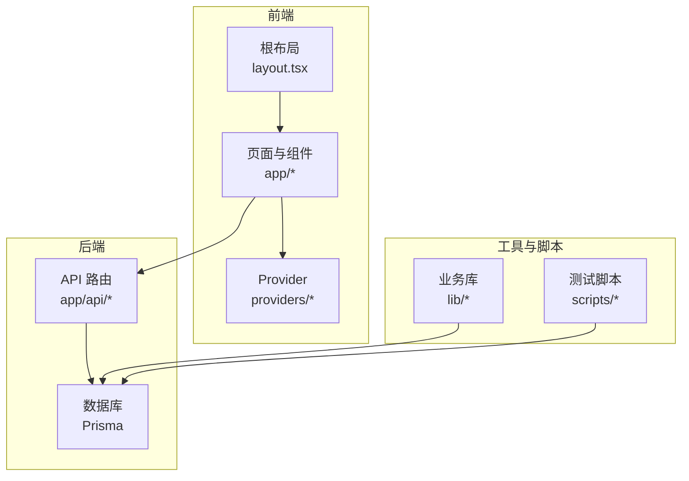
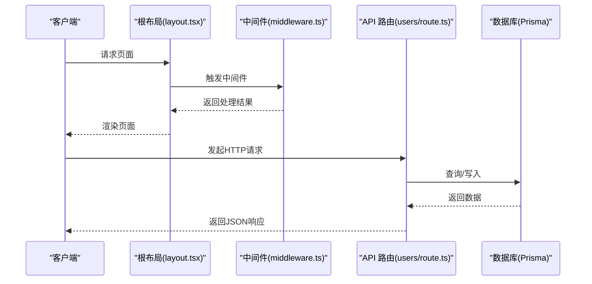
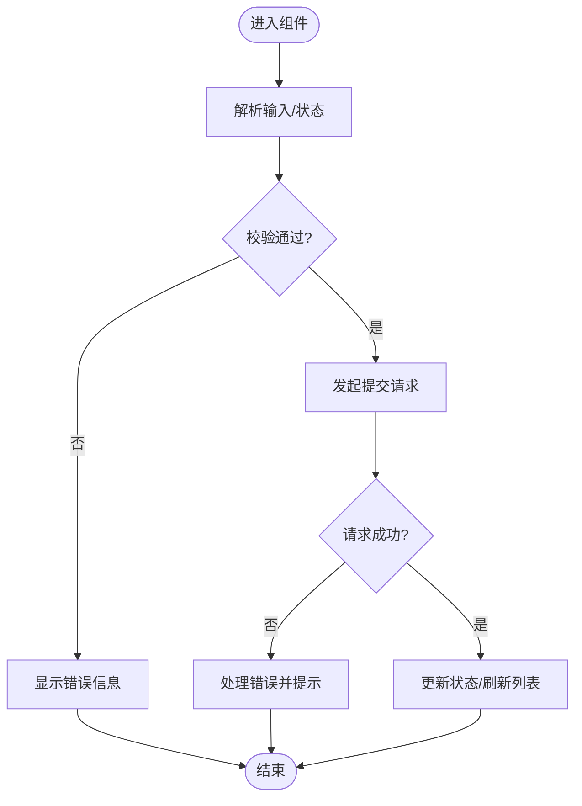
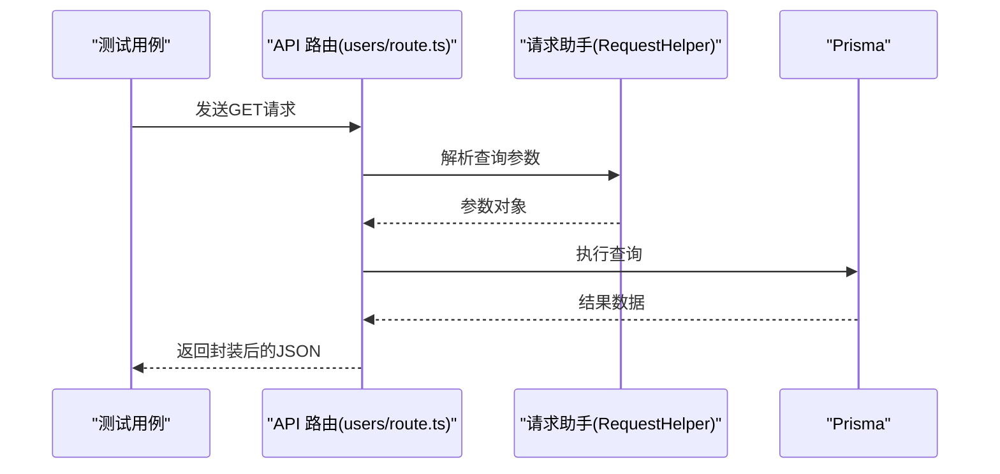
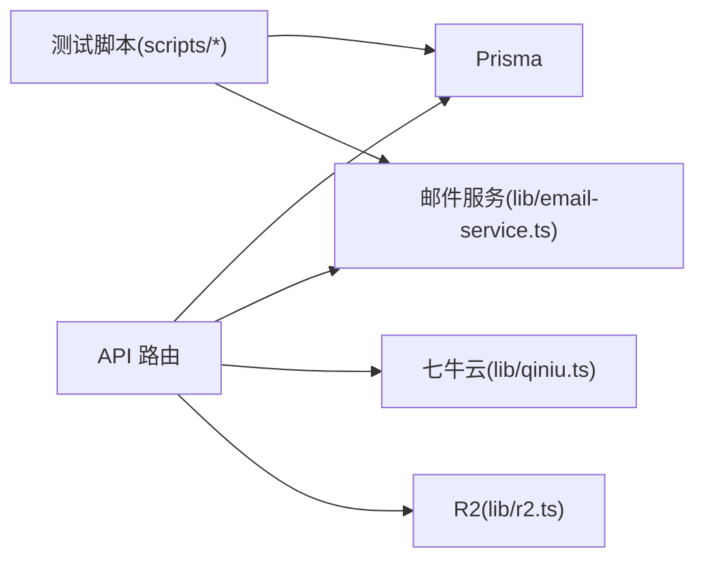

# 测试策略

<cite>
**本文引用的文件**
- [AGENTS.md](file://AGENTS.md)
- [src/app/layout.tsx](file://src/app/layout.tsx)
- [src/app/api/test-db/route.ts](file://src/app/api/test-db/route.ts)
- [src/app/api/users/route.ts](file://src/app/api/users/route.ts)
- [src/app/dashboard/tools/actions.ts](file://src/app/dashboard/tools/actions.ts)
- [src/lib/db.ts](file://src/lib/db.ts)
- [src/lib/email-service.ts](file://src/lib/email-service.ts)
- [src/lib/qiniu.ts](file://src/lib/qiniu.ts)
- [src/lib/r2.ts](file://src/lib/r2.ts)
- [scripts/test-prisma-standard.ts](file://scripts/test-prisma-standard.ts)
- [scripts/test-mailer.ts](file://scripts/test-mailer.ts)
- [src/app/(site)/tools/lucky-draw/components/control-panel.tsx](file://src/app/(site)/tools/lucky-draw/components/control-panel.tsx)
- [src/app/(site)/tools/text-diff/components/text-diff-tool.tsx](file://src/app/(site)/tools/text-diff/components/text-diff-tool.tsx)
- [src/app/(site)/ai-platform/components/ai-grid.tsx](file://src/app/(site)/ai-platform/components/ai-grid.tsx)
- [src/app/(site)/friends/components/friend-link-fab.tsx](file://src/app/(site)/friends/components/friend-link-fab.tsx)
- [src/app/dashboard/posts/components/post-dialog.tsx](file://src/app/dashboard/posts/components/post-dialog.tsx)
- [src/app/dashboard/categories/components/category-dialog.tsx](file://src/app/dashboard/categories/components/category-dialog.tsx)
- [src/app/dashboard/tools/components/tool-dialog.tsx](file://src/app/dashboard/tools/components/tool-dialog.tsx)
- [src/app/dashboard/users/components/user-dialog.tsx](file://src/app/dashboard/users/components/user-dialog.tsx)
- [src/app/(site)/tools/random-data-generator/components/random-data-generator.tsx](file://src/app/(site)/tools/random-data-generator/components/random-data-generator.tsx)
- [src/app/(site)/tools/variable-naming/components/variable-naming-tool.tsx](file://src/app/(site)/tools/variable-naming/components/variable-naming-tool.tsx)
- [src/app/(site)/tools/music/components/music-player.tsx](file://src/app/(site)/tools/music/components/music-player.tsx)
- [src/app/(site)/tools/base64/components/base64-converter.tsx](file://src/app/(site)/tools/base64/components/base64-converter.tsx)
- [src/app/(site)/tools/qrcode/components/qrcode-generator.tsx](file://src/app/(site)/tools/qrcode/components/qrcode-generator.tsx)
- [src/middleware.ts](file://src/middleware.ts)
- [package.json](file://package.json)
- [next.config.ts](file://next.config.ts)
- [tsconfig.json](file://tsconfig.json)
- [eslint.config.mjs](file://eslint.config.mjs)
- [components.json](file://components.json)
</cite>

## 目录
1. [引言](#引言)
2. [项目结构](#项目结构)
3. [核心组件](#核心组件)
4. [架构总览](#架构总览)
5. [详细组件分析](#详细组件分析)
6. [依赖分析](#依赖分析)
7. [性能考虑](#性能考虑)
8. [故障排查指南](#故障排查指南)
9. [结论](#结论)
10. [附录](#附录)

## 引言
本测试策略文档面向“一梦五千年”项目，目标是建立覆盖单元测试、集成测试与端到端测试的完整测试体系，确保 Next.js 应用在 Server Components、Client Components、API 路由等场景下的质量与稳定性。文档同时给出测试环境配置、Mock 策略、测试数据准备、覆盖率要求以及持续集成中的测试流程建议，并补充性能测试与用户体验测试方法。

## 项目结构
项目采用 Next.js App Router 架构，前端页面与功能模块按路由分层组织；后端通过 API 路由对接 Prisma 数据库；全局布局与 Provider 提供统一上下文；部分工具类与业务逻辑位于 src/lib 下；测试辅助脚本位于 scripts 目录。

图表来源
- [src/app/layout.tsx:26-51](file://src/app/layout.tsx#L26-L51)
- [src/app/api/test-db/route.ts:1-14](file://src/app/api/test-db/route.ts#L1-L14)
- [src/lib/db.ts](file://src/lib/db.ts)

章节来源
- [AGENTS.md:17-29](file://AGENTS.md#L17-L29)
- [src/app/layout.tsx:1-51](file://src/app/layout.tsx#L1-L51)

## 核心组件
- 布局与上下文：根布局负责字体、主题、全局 Provider 注入与分析埋点组件挂载。
- API 路由：提供用户列表查询、数据库连通性测试等接口，统一返回封装。
- 业务动作（Server Actions）：仪表盘工具列表的缓存与分页逻辑，体现 Next.js 缓存与数据访问模式。
- 工具组件：站点工具与仪表盘表单组件，包含表单提交与校验逻辑，适合组件级测试。
- 中间件：可扩展鉴权与请求处理逻辑，需纳入集成测试范围。

章节来源
- [src/app/layout.tsx:26-51](file://src/app/layout.tsx#L26-L51)
- [src/app/api/users/route.ts:1-51](file://src/app/api/users/route.ts#L1-L51)
- [src/app/api/test-db/route.ts:1-14](file://src/app/api/test-db/route.ts#L1-L14)
- [src/app/dashboard/tools/actions.ts:1-67](file://src/app/dashboard/tools/actions.ts#L1-L67)
- [src/middleware.ts](file://src/middleware.ts)

## 架构总览
下图展示从浏览器到 API 路由再到数据库的典型调用链路，以及缓存与 Provider 的作用位置。

图表来源
- [src/app/layout.tsx:26-51](file://src/app/layout.tsx#L26-L51)
- [src/middleware.ts](file://src/middleware.ts)
- [src/app/api/users/route.ts:1-51](file://src/app/api/users/route.ts#L1-L51)

## 详细组件分析

### Server Components 测试策略
- 目标：验证页面渲染、布局 Provider 注入、分析埋点组件加载、路由参数解析。
- 关键点：
  - 根布局中 QueryProvider、LoadingProvider、AnalyticsTracker 的存在与顺序。
  - 页面 Suspense 边界与回退行为。
  - 路由动态段与查询参数的处理。
- 建议：
  - 使用 Next.js 内置测试工具或测试框架对页面进行快照与交互测试。
  - 对 Suspense 回退进行边界用例覆盖。

章节来源
- [src/app/layout.tsx:26-51](file://src/app/layout.tsx#L26-L51)

### Client Components 测试策略
- 目标：验证表单提交、字段校验、异步操作、错误提示与用户反馈。
- 典型组件与关注点：
  - 幸运抽奖控制面板：输入解析、名单分割、随机抽取逻辑。
  - 文本对比工具：文本拆分行、差异计算与展示。
  - AI 工具网格：标签过滤、多条件搜索。
  - 友链申请、文章对话框、分类对话框、工具对话框、用户对话框：表单提交、字段校验、提交成功/失败分支。
- 建议：
  - 使用 React Testing Library 或类似库进行组件渲染与交互测试。
  - Mock 表单库与网络请求，隔离第三方依赖。
  - 对异常路径（如网络失败、校验失败）进行断言。

图表来源
- [src/app/(site)/tools/lucky-draw/components/control-panel.tsx](file://src/app/(site)/tools/lucky-draw/components/control-panel.tsx#L33-L50)
- [src/app/(site)/tools/text-diff/components/text-diff-tool.tsx](file://src/app/(site)/tools/text-diff/components/text-diff-tool.tsx#L57-L57)
- [src/app/(site)/ai-platform/components/ai-grid.tsx](file://src/app/(site)/ai-platform/components/ai-grid.tsx#L43-L43)
- [src/app/(site)/friends/components/friend-link-fab.tsx](file://src/app/(site)/friends/components/friend-link-fab.tsx#L59-L131)
- [src/app/dashboard/posts/components/post-dialog.tsx:88-116](file://src/app/dashboard/posts/components/post-dialog.tsx#L88-L116)
- [src/app/dashboard/categories/components/category-dialog.tsx:79-111](file://src/app/dashboard/categories/components/category-dialog.tsx#L79-L111)
- [src/app/dashboard/tools/components/tool-dialog.tsx:108-108](file://src/app/dashboard/tools/components/tool-dialog.tsx#L108-L108)
- [src/app/dashboard/users/components/user-dialog.tsx:101-101](file://src/app/dashboard/users/components/user-dialog.tsx#L101-L101)

章节来源
- [src/app/(site)/tools/lucky-draw/components/control-panel.tsx:33-50](file://src/app/(site)/tools/lucky-draw/components/control-panel.tsx#L33-L50)
- [src/app/(site)/tools/text-diff/components/text-diff-tool.tsx:57-57](file://src/app/(site)/tools/text-diff/components/text-diff-tool.tsx#L57-L57)
- [src/app/(site)/ai-platform/components/ai-grid.tsx:43-43](file://src/app/(site)/ai-platform/components/ai-grid.tsx#L43-L43)
- [src/app/(site)/friends/components/friend-link-fab.tsx:59-131](file://src/app/(site)/friends/components/friend-link-fab.tsx#L59-L131)
- [src/app/dashboard/posts/components/post-dialog.tsx:88-116](file://src/app/dashboard/posts/components/post-dialog.tsx#L88-L116)
- [src/app/dashboard/categories/components/category-dialog.tsx:79-111](file://src/app/dashboard/categories/components/category-dialog.tsx#L79-L111)
- [src/app/dashboard/tools/components/tool-dialog.tsx:108-108](file://src/app/dashboard/tools/components/tool-dialog.tsx#L108-L108)
- [src/app/dashboard/users/components/user-dialog.tsx:101-101](file://src/app/dashboard/users/components/user-dialog.tsx#L101-L101)

### API 路由测试策略
- 目标：验证路由处理函数的请求解析、业务逻辑、错误处理与响应格式。
- 典型路由与关注点：
  - 用户列表查询：分页、排序、字段选择、总数统计。
  - 数据库连通性测试：连接、计数、异常捕获与返回码。
  - 其他 API 路由：回调、上传、验证码发送等，均应具备相同测试维度。
- 建议：
  - 使用 Next.js 测试工具或 fetch 包装模拟请求。
  - Mock Prisma 与外部服务，保证测试稳定与可重复。
  - 覆盖正常路径、边界值与异常路径。

图表来源
- [src/app/api/users/route.ts:1-51](file://src/app/api/users/route.ts#L1-L51)

章节来源
- [src/app/api/users/route.ts:1-51](file://src/app/api/users/route.ts#L1-L51)
- [src/app/api/test-db/route.ts:1-14](file://src/app/api/test-db/route.ts#L1-L14)

### 数据访问与缓存测试策略
- 目标：验证 Server Actions 中的数据访问、缓存策略与分页逻辑。
- 关键点：
  - 分页条件构造、where 条件组合、排序规则。
  - Next.js 缓存（unstable_cache）的命中与失效。
  - 并行查询与聚合统计。
- 建议：
  - Mock Prisma 方法，断言查询参数与返回结构。
  - 验证缓存标签与失效时间是否符合预期。
  - 对空数据、边界页、大列表场景进行压力与正确性测试。

章节来源
- [src/app/dashboard/tools/actions.ts:1-67](file://src/app/dashboard/tools/actions.ts#L1-L67)

### 工具与业务逻辑测试策略
- 目标：验证各类工具组件的算法与交互逻辑。
- 典型组件与关注点：
  - 随机数据生成器：数据类型、数量、格式化。
  - 变量命名工具：命名规范、大小写转换、特殊字符处理。
  - 音乐播放器：播放状态、音量控制、错误处理。
  - Base64 转换器：编码/解码、非法输入处理。
  - 二维码生成器：文本长度限制、字符集支持、输出格式。
- 建议：
  - 单元测试覆盖核心算法与边界条件。
  - 组件测试覆盖用户交互与状态变化。
  - 外部服务（如云存储、CDN）使用 Mock。

章节来源
- [src/app/(site)/tools/random-data-generator/components/random-data-generator.tsx](file://src/app/(site)/tools/random-data-generator/components/random-data-generator.tsx)
- [src/app/(site)/tools/variable-naming/components/variable-naming-tool.tsx](file://src/app/(site)/tools/variable-naming/components/variable-naming-tool.tsx)
- [src/app/(site)/tools/music/components/music-player.tsx](file://src/app/(site)/tools/music/components/music-player.tsx)
- [src/app/(site)/tools/base64/components/base64-converter.tsx](file://src/app/(site)/tools/base64/components/base64-converter.tsx)
- [src/app/(site)/tools/qrcode/components/qrcode-generator.tsx](file://src/app/(site)/tools/qrcode/components/qrcode-generator.tsx)

### 中间件测试策略
- 目标：验证中间件对请求的预处理、鉴权与重定向逻辑。
- 建议：
  - 使用 Next.js 测试工具模拟请求头、Cookie、URL。
  - 覆盖未登录、权限不足、跳转链路等场景。

章节来源
- [src/middleware.ts](file://src/middleware.ts)

## 依赖分析
- 数据库：Prisma 作为 ORM，连接 Supabase PostgreSQL；提供连接测试与标准查询脚本。
- 业务库：邮件服务、七牛云、Cloudflare R2 等外部服务封装，需在测试中 Mock。
- 工具与脚本：测试脚本用于验证数据库与邮件服务可用性。

图表来源
- [src/app/api/test-db/route.ts:1-14](file://src/app/api/test-db/route.ts#L1-L14)
- [scripts/test-prisma-standard.ts:1-20](file://scripts/test-prisma-standard.ts#L1-L20)
- [src/lib/email-service.ts:10-10](file://src/lib/email-service.ts#L10-L10)
- [src/lib/qiniu.ts:30-30](file://src/lib/qiniu.ts#L30-L30)
- [src/lib/r2.ts:31-31](file://src/lib/r2.ts#L31-L31)

章节来源
- [src/lib/db.ts](file://src/lib/db.ts)
- [src/lib/email-service.ts:10-10](file://src/lib/email-service.ts#L10-L10)
- [src/lib/qiniu.ts:30-30](file://src/lib/qiniu.ts#L30-L30)
- [src/lib/r2.ts:31-31](file://src/lib/r2.ts#L31-L31)
- [scripts/test-prisma-standard.ts:1-20](file://scripts/test-prisma-standard.ts#L1-L20)
- [scripts/test-mailer.ts:41-41](file://scripts/test-mailer.ts#L41-L41)

## 性能考虑
- 缓存策略：利用 Next.js 缓存与数据库索引减少重复查询；对高频接口设置合理 revalidate 时间。
- 并发与批处理：批量查询与合并请求，避免 N+1 查询。
- 组件渲染：对长列表使用虚拟滚动、懒加载与条件渲染。
- API 限流：对外部接口与敏感操作添加速率限制与熔断保护。
- 监控与日志：在 API 层记录关键指标，结合埋点组件进行用户体验监控。

## 故障排查指南
- 数据库连通性：通过专用测试路由与脚本验证连接与查询能力。
- 邮件服务：使用测试脚本验证 SMTP 配置与发送流程。
- 外部服务：对七牛云与 R2 的上传/令牌接口进行独立测试，确保 Mock 策略有效。
- 日志与错误：在 API 路由中捕获异常并返回结构化错误，便于定位问题。

章节来源
- [src/app/api/test-db/route.ts:1-14](file://src/app/api/test-db/route.ts#L1-L14)
- [scripts/test-prisma-standard.ts:1-20](file://scripts/test-prisma-standard.ts#L1-L20)
- [scripts/test-mailer.ts:41-41](file://scripts/test-mailer.ts#L41-L41)
- [src/lib/email-service.ts:10-10](file://src/lib/email-service.ts#L10-L10)
- [src/lib/qiniu.ts:30-30](file://src/lib/qiniu.ts#L30-L30)
- [src/lib/r2.ts:31-31](file://src/lib/r2.ts#L31-L31)

## 结论
本测试策略围绕 Next.js 的三大层面（Server Components、Client Components、API 路由）制定系统化的测试方案，并结合项目实际的业务组件与数据访问模式，提出可落地的 Mock 策略、覆盖率目标与持续集成流程建议。通过单元、集成与端到端测试的协同，可显著提升系统的稳定性与可维护性。

## 附录

### 测试环境配置
- 运行时：Node.js 版本与 Next.js 配置保持与生产一致。
- 数据库：使用独立测试数据库或内存数据库（如 SQLite），迁移脚本与种子数据按需准备。
- 外部服务：通过环境变量切换至测试实例或 Mock 服务。
- 工具链：Jest/React Testing Library/Vitest（按团队偏好）、Playwright/Cypress（端到端）。

章节来源
- [next.config.ts](file://next.config.ts)
- [tsconfig.json](file://tsconfig.json)
- [eslint.config.mjs](file://eslint.config.mjs)
- [components.json](file://components.json)

### Mock 策略
- 数据库：使用 Prisma Mock 或内存数据库，断言查询参数与返回值。
- 外部服务：对邮件、云存储等接口进行函数级 Mock，隔离网络波动。
- 路由与中间件：使用 Next.js 测试工具模拟请求与响应，覆盖鉴权与重定向分支。

### 测试数据准备
- 初始化脚本：准备最小化种子数据（用户、文章、工具等），确保测试可重复。
- 动态数据：使用工厂函数生成边界值与异常数据（空值、超长字符串、非法格式）。

### 覆盖率与持续集成
- 覆盖率目标：单元测试行覆盖率≥80%，分支覆盖率≥70%；API 路由与关键工具函数≥90%。
- CI 流程：安装依赖 → 类型检查 → 单元测试（带覆盖率）→ 集成测试 → 端到端测试 → 代码质量扫描。

### 性能测试与用户体验测试
- 性能测试：使用 Lighthouse、WebPageTest 或自定义基准测试，评估首屏时间、交互延迟与资源体积。
- 用户体验测试：通过 Playwright 录制关键用户旅程（登录、发布文章、使用工具），回归自动化。