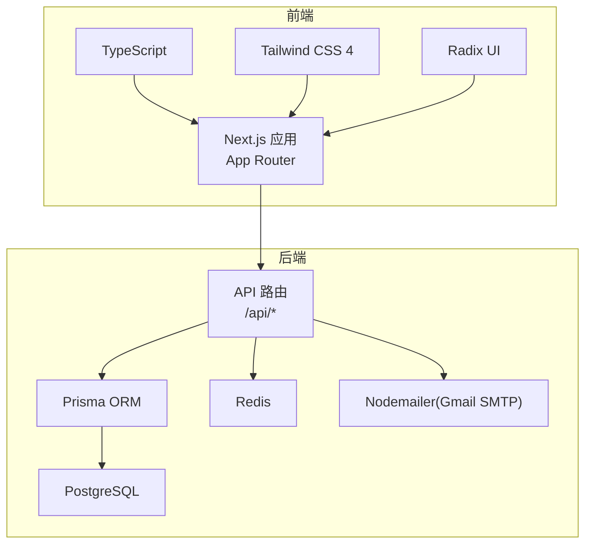
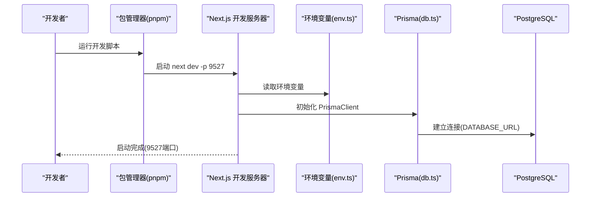
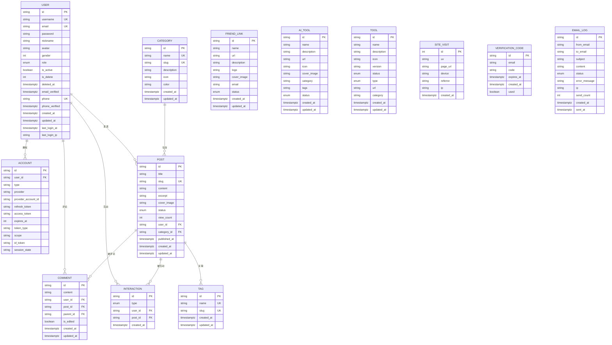
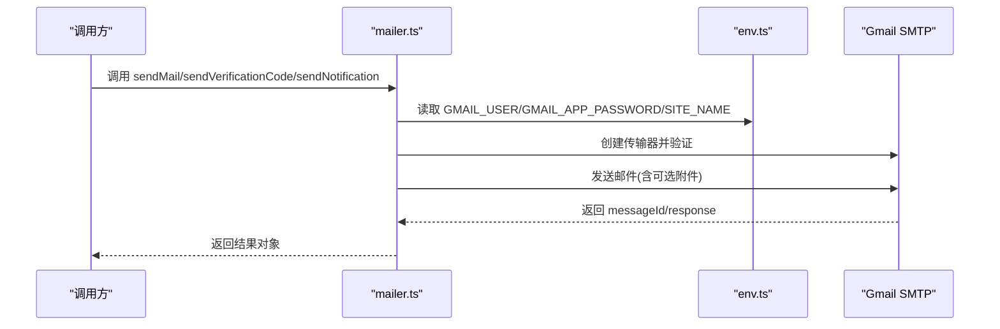
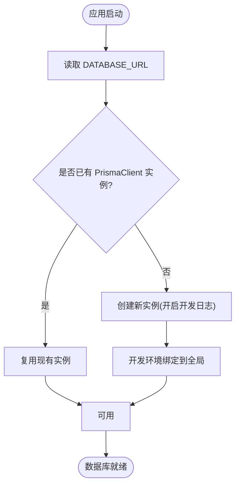
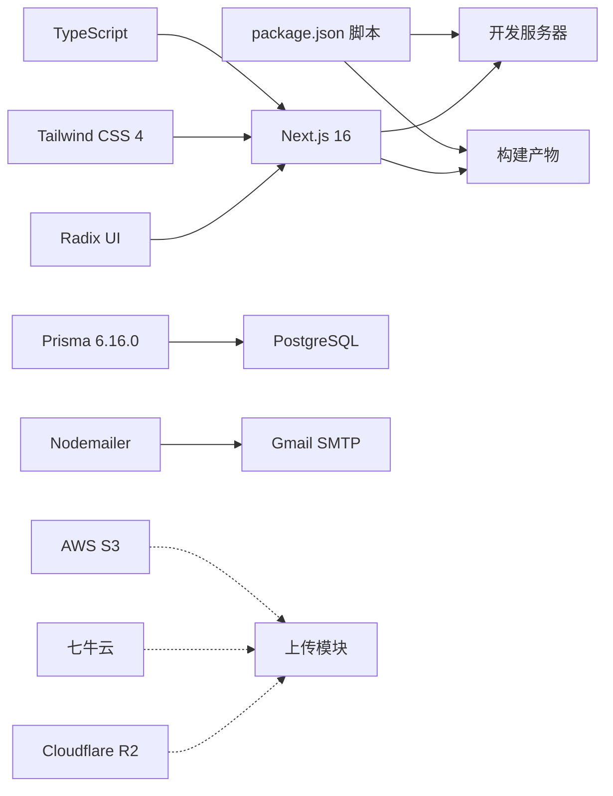

# 快速开始

<cite>
**本文引用的文件**
- [README.md](file://README.md)
- [package.json](file://package.json)
- [next.config.ts](file://next.config.ts)
- [tsconfig.json](file://tsconfig.json)
- [components.json](file://components.json)
- [prisma/schema.prisma](file://prisma/schema.prisma)
- [src/lib/env.ts](file://src/lib/env.ts)
- [src/lib/db.ts](file://src/lib/db.ts)
- [src/lib/mailer.ts](file://src/lib/mailer.ts)
- [MAILER_GUIDE.md](file://MAILER_GUIDE.md)
- [scripts/test-mailer.ts](file://scripts/test-mailer.ts)
- [AGENTS.md](file://AGENTS.md)
</cite>

## 目录
1. [简介](#简介)
2. [项目结构](#项目结构)
3. [核心组件](#核心组件)
4. [架构总览](#架构总览)
5. [详细组件分析](#详细组件分析)
6. [依赖关系分析](#依赖关系分析)
7. [性能考虑](#性能考虑)
8. [故障排除指南](#故障排除指南)
9. [结论](#结论)
10. [附录](#附录)

## 简介
本指南面向首次接触“一梦五千年”项目的开发者，目标是在约30分钟内完成环境准备、依赖安装、数据库初始化与本地开发服务器启动，并能进行基本的功能验证。同时提供生产部署基础步骤与常见问题排查建议，帮助你在最短时间内上手并稳定运行项目。

## 项目结构
项目采用 Next.js 16 App Router 架构，前端使用 TypeScript + Tailwind CSS 4 + Radix UI，后端通过 Prisma ORM 访问 PostgreSQL，集成邮件发送、用户认证、博客管理、AI 工具库、实用工具箱、友链管理、数据分析等模块。

图示来源
- [next.config.ts:1-16](file://next.config.ts#L1-L16)
- [prisma/schema.prisma:1-308](file://prisma/schema.prisma#L1-L308)
- [src/lib/db.ts:1-16](file://src/lib/db.ts#L1-L16)
- [src/lib/mailer.ts:1-156](file://src/lib/mailer.ts#L1-L156)

章节来源
- [README.md:54-69](file://README.md#L54-L69)
- [package.json:1-98](file://package.json#L1-L98)
- [next.config.ts:1-16](file://next.config.ts#L1-L16)
- [tsconfig.json:1-43](file://tsconfig.json#L1-L43)
- [components.json:1-23](file://components.json#L1-L23)

## 核心组件
- 包管理与脚本
  - 使用 pnpm 作为包管理器，提供开发、构建、启动、代码检查等脚本。
- Next.js 配置
  - 生产构建允许 ESLint/TypeScript 错误，便于部署。
- TypeScript 配置
  - 严格模式、路径映射、ESNext 模块解析等。
- Tailwind CSS 配置
  - 使用 shadcn/ui 风格，启用 TSX、RSC 支持。
- 数据库与 ORM
  - Prisma Schema 定义模型与枚举，运行时通过 DATABASE_URL 连接 PostgreSQL。
- 环境变量
  - 集中在 env.ts 中读取，覆盖 Gmail、数据库、Redis、上传提供商、Open API 等配置。
- 邮件服务
  - 基于 Nodemailer + Gmail SMTP，提供普通邮件、验证码、通知三种模板。

章节来源
- [package.json:5-10](file://package.json#L5-L10)
- [next.config.ts:5-12](file://next.config.ts#L5-L12)
- [tsconfig.json:11-29](file://tsconfig.json#L11-L29)
- [components.json:4-22](file://components.json#L4-L22)
- [prisma/schema.prisma:1-13](file://prisma/schema.prisma#L1-L13)
- [src/lib/env.ts:1-40](file://src/lib/env.ts#L1-L40)
- [src/lib/mailer.ts:17-28](file://src/lib/mailer.ts#L17-L28)

## 架构总览
下面的序列图展示了本地开发启动流程：从执行开发脚本到浏览器访问，期间涉及环境变量加载、数据库连接与 Prisma 客户端生成。

图示来源
- [package.json:6](file://package.json#L6)
- [src/lib/env.ts:12](file://src/lib/env.ts#L12)
- [src/lib/db.ts:5-14](file://src/lib/db.ts#L5-L14)

章节来源
- [package.json:6](file://package.json#L6)
- [src/lib/env.ts:1-40](file://src/lib/env.ts#L1-L40)
- [src/lib/db.ts:1-16](file://src/lib/db.ts#L1-L16)

## 详细组件分析

### 环境变量与配置
- 必需项
  - 数据库连接：DATABASE_URL（运行时），可选 DIRECT_URL（迁移直连）。
  - Gmail 邮件：GMAIL_USER、GMAIL_APP_PASSWORD。
  - 网站信息：SITE_NAME、SITE_URL。
  - Redis：REDIS_URL（可选）。
  - 上传提供商：UPLOAD_PROVIDER（默认 r2，可选 qiniu）。
  - Open API：OPEN_API_KEYS、OPEN_API_USER_ID。
- 配置位置
  - 读取入口：src/lib/env.ts
  - 示例模板：README.md 中提供 .env.example 的复制与编辑指引。
- 邮件功能
  - 通过 MAILER_GUIDE.md 了解 Gmail 凭据获取、API 使用方式与测试脚本。

章节来源
- [src/lib/env.ts:1-40](file://src/lib/env.ts#L1-L40)
- [README.md:71-89](file://README.md#L71-L89)
- [MAILER_GUIDE.md:11-31](file://MAILER_GUIDE.md#L11-L31)

### 数据库与 Prisma
- 数据源
  - provider: postgresql
  - 运行时使用 DATABASE_URL，迁移使用 DIRECT_URL
  - relationMode: prisma
- 模型概览
  - 用户(User)、账户(Account)、文章(Post)、分类(Category)、标签(Tag)、评论(Comment)、互动(Interaction)、友链(FriendLink)、AI工具(AiTool)、工具(Tool)、站点访问(SiteVisit)、验证码(VerificationCode)、邮件日志(EmailLog)
- 枚举
  - Role、PostStatus、InteractionType、FriendLinkStatus、AiToolStatus、ToolType、ToolStatus、EmailStatus
- 迁移
  - 仓库包含多个迁移 SQL 文件，涵盖新增表与索引等变更。

图示来源
- [prisma/schema.prisma:15-308](file://prisma/schema.prisma#L15-L308)

章节来源
- [prisma/schema.prisma:1-13](file://prisma/schema.prisma#L1-L13)
- [prisma/schema.prisma:15-308](file://prisma/schema.prisma#L15-L308)

### 邮件发送流程
- 配置与验证
  - 通过 src/lib/mailer.ts 创建 SMTP 传输器并验证连接。
  - 发送前校验环境变量是否齐全。
- 模板与接口
  - 普通邮件、验证码邮件、通知邮件三类模板。
  - 支持附件参数扩展。
- 测试
  - 提供 scripts/test-mailer.ts 脚本，一键测试三类邮件。

图示来源
- [src/lib/mailer.ts:31-64](file://src/lib/mailer.ts#L31-L64)
- [src/lib/mailer.ts:67-120](file://src/lib/mailer.ts#L67-L120)
- [src/lib/mailer.ts:123-156](file://src/lib/mailer.ts#L123-L156)
- [src/lib/env.ts:3-5](file://src/lib/env.ts#L3-L5)

章节来源
- [src/lib/mailer.ts:1-156](file://src/lib/mailer.ts#L1-L156)
- [MAILER_GUIDE.md:43-79](file://MAILER_GUIDE.md#L43-L79)
- [scripts/test-mailer.ts:1-51](file://scripts/test-mailer.ts#L1-L51)

### 数据库连接与 Prisma 客户端
- 连接策略
  - 开发环境下输出 query/error/warn 日志，便于调试。
  - 通过 DATABASE_URL 注入数据源 URL。
- 客户端生命周期
  - 使用全局单例避免重复实例化，开发环境绑定到全局对象。

图示来源
- [src/lib/db.ts:5-14](file://src/lib/db.ts#L5-L14)

章节来源
- [src/lib/db.ts:1-16](file://src/lib/db.ts#L1-L16)

## 依赖关系分析
- 包管理与脚本
  - pnpm 作为首选包管理器，提供 dev/start/build/lint 等脚本。
- Next.js 与配置
  - Next 配置允许构建阶段忽略 ESLint/TS 错误，降低部署门槛。
- TypeScript 与路径映射
  - 严格模式、bundler 解析、路径别名 @/* 指向 src/*。
- UI 框架
  - Tailwind CSS 4 + Radix UI，配合 shadcn/ui 使用。
- 数据库与 ORM
  - Prisma 6.16.0，关系联接预览特性 relationJoins。
- 邮件与第三方
  - Nodemailer + Gmail SMTP；AWS S3、七牛云、Cloudflare R2 上传能力；腾讯云翻译等。

图示来源
- [package.json:5-10](file://package.json#L5-L10)
- [package.json:11-79](file://package.json#L11-L79)
- [next.config.ts:5-12](file://next.config.ts#L5-L12)
- [tsconfig.json:11-29](file://tsconfig.json#L11-L29)
- [components.json:4-22](file://components.json#L4-L22)
- [prisma/schema.prisma:1-5](file://prisma/schema.prisma#L1-L5)

章节来源
- [package.json:1-98](file://package.json#L1-L98)
- [next.config.ts:1-16](file://next.config.ts#L1-L16)
- [tsconfig.json:1-43](file://tsconfig.json#L1-L43)
- [components.json:1-23](file://components.json#L1-L23)
- [prisma/schema.prisma:1-5](file://prisma/schema.prisma#L1-L5)

## 性能考虑
- 开发体验
  - 开发日志仅在开发环境开启，减少生产噪音。
  - 构建阶段允许 ESLint/TS 错误，提升部署灵活性。
- 数据库
  - 使用 Prisma previewFeatures relationJoins 优化关联查询。
  - 通过索引与字段映射减少查询成本。
- 前端
  - Tailwind CSS 4 + Radix UI 提升组件复用与渲染效率。
  - App Router 按需加载与服务端渲染优化首屏性能。

章节来源
- [next.config.ts:5-12](file://next.config.ts#L5-L12)
- [prisma/schema.prisma:3-4](file://prisma/schema.prisma#L3-L4)

## 故障排除指南
- 环境变量未生效
  - 确认已复制 .env.example 并命名为 .env，且值正确。
  - 检查 src/lib/env.ts 中对应键名是否一致。
- 数据库连接失败
  - 核对 DATABASE_URL/DIRECT_URL 格式与可达性。
  - 开发环境可观察 PrismaClient 日志定位问题。
- 邮件发送失败
  - 检查 GMAIL_USER 与 GMAIL_APP_PASSWORD 是否正确。
  - 使用 scripts/test-mailer.ts 进行端到端测试。
  - 参考 MAILER_GUIDE.md 的常见问题章节。
- 构建或启动报错
  - 优先确认 pnpm install 成功且版本匹配。
  - 若 ESLint/TS 错误导致构建失败，可参考 next.config.ts 的忽略策略。
- 端口占用
  - 开发默认 9527，生产默认 9526；如冲突请调整 PORT 或释放端口。

章节来源
- [README.md:71-89](file://README.md#L71-L89)
- [src/lib/env.ts:1-40](file://src/lib/env.ts#L1-L40)
- [src/lib/db.ts:8](file://src/lib/db.ts#L8)
- [MAILER_GUIDE.md:174-189](file://MAILER_GUIDE.md#L174-L189)
- [scripts/test-mailer.ts:1-51](file://scripts/test-mailer.ts#L1-L51)
- [next.config.ts:5-12](file://next.config.ts#L5-L12)

## 结论
通过本指南，你可以快速完成环境准备、依赖安装、数据库初始化与本地开发服务器启动，并掌握邮件功能测试与常见问题排查方法。建议在本地验证通过后再按生产部署步骤进行上线。

## 附录

### 环境要求与安装步骤
- Node.js 与包管理器
  - 推荐使用 Node.js LTS 版本，包管理器选择 pnpm。
- 依赖安装
  - 在项目根目录执行安装命令。
- 环境变量配置
  - 复制 .env.example 并重命名为 .env，按需填写数据库、Gmail、Redis、上传提供商等配置。
- 数据库初始化
  - 生成 Prisma 客户端并运行迁移，打开 Prisma Studio 进行可视化管理。
- 启动开发服务器
  - 运行开发脚本并在浏览器访问指定端口。
- 常用开发命令
  - 代码检查、构建、启动、Prisma 相关命令等。

章节来源
- [README.md:91-101](file://README.md#L91-L101)
- [AGENTS.md:88-131](file://AGENTS.md#L88-L131)
- [package.json:5-10](file://package.json#L5-L10)

### 本地开发服务器启动指南
- 启动开发服务器
  - 执行开发脚本，等待编译完成。
- 访问应用
  - 默认端口 9527，根据提示在浏览器打开。
- 验证数据库
  - 使用 Prisma Studio 查看数据模型与记录。
- 验证邮件功能
  - 使用测试脚本发送三类邮件，确认收件箱与日志。

章节来源
- [package.json:6](file://package.json#L6)
- [AGENTS.md:102-113](file://AGENTS.md#L102-L113)
- [MAILER_GUIDE.md:150-158](file://MAILER_GUIDE.md#L150-L158)
- [scripts/test-mailer.ts:1-51](file://scripts/test-mailer.ts#L1-L51)

### 生产环境部署基础步骤
- 构建
  - 执行构建脚本生成静态产物。
- 启动
  - 使用生产脚本启动服务器。
- 环境变量
  - 确保生产环境变量与开发环境一致，尤其是数据库、邮件、上传提供商等。
- 监控与日志
  - 关注 Prisma 日志与应用日志，及时发现异常。

章节来源
- [package.json:7](file://package.json#L7)
- [AGENTS.md:115-123](file://AGENTS.md#L115-L123)
- [next.config.ts:5-12](file://next.config.ts#L5-L12)