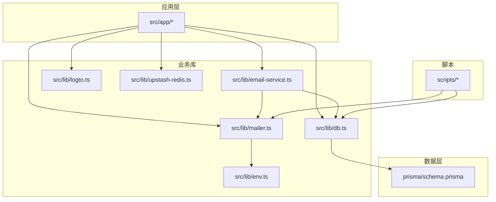
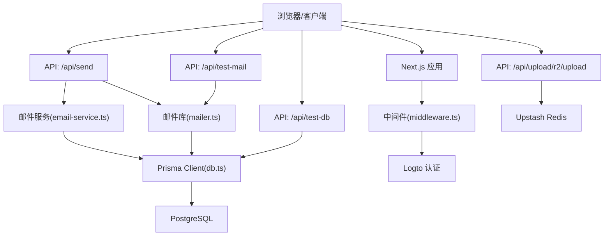
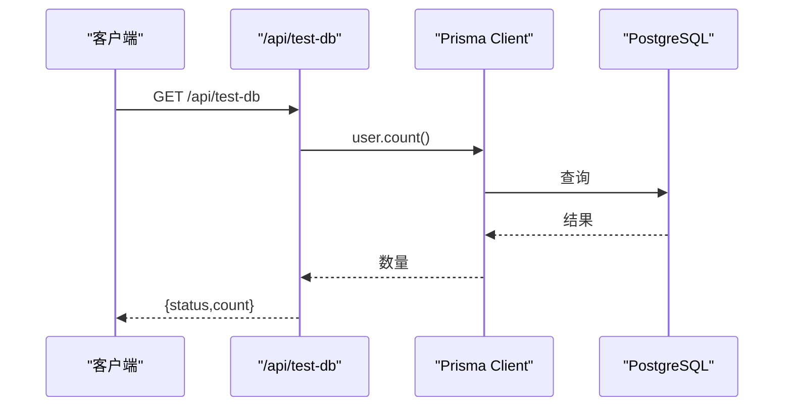
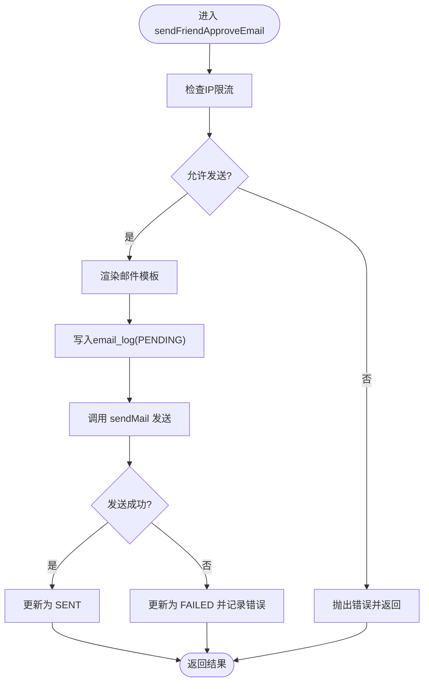
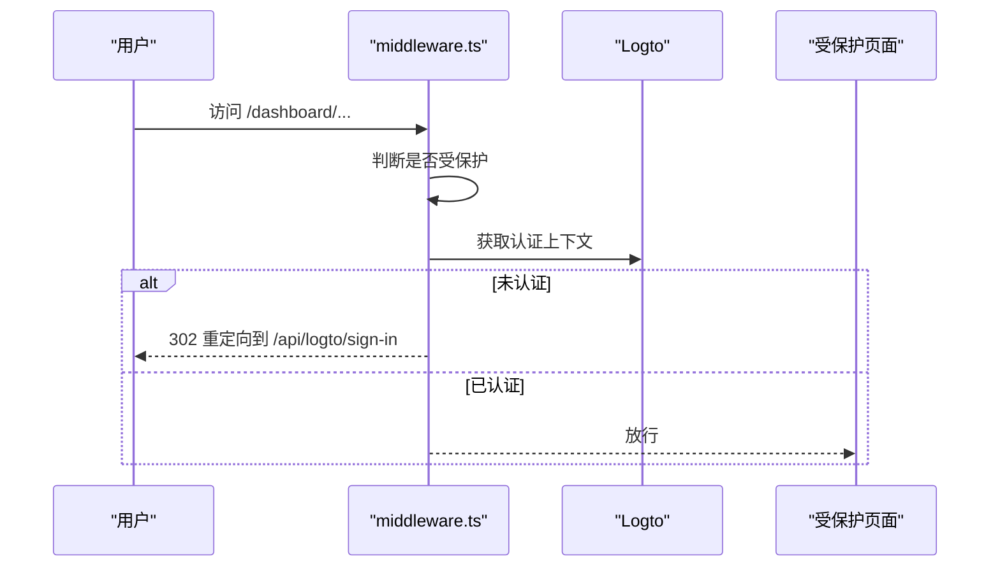
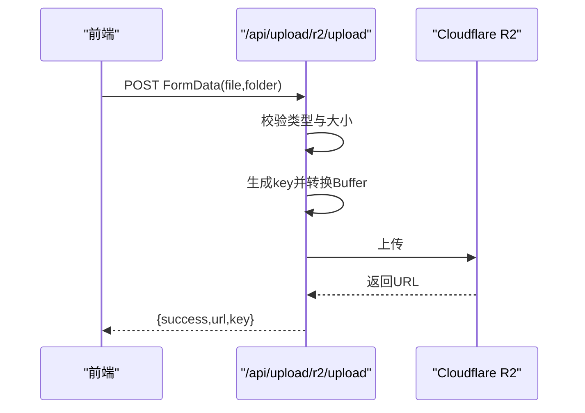
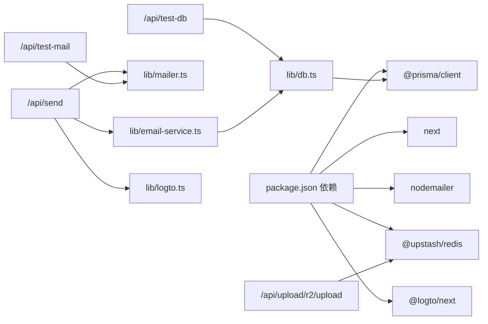

# 故障排除

<cite>
**本文引用的文件**
- [README.md](file://README.md)
- [package.json](file://package.json)
- [MAILER_GUIDE.md](file://MAILER_GUIDE.md)
- [src/lib/db.ts](file://src/lib/db.ts)
- [src/lib/env.ts](file://src/lib/env.ts)
- [src/lib/mailer.ts](file://src/lib/mailer.ts)
- [src/lib/email-service.ts](file://src/lib/email-service.ts)
- [src/app/api/test-db/route.ts](file://src/app/api/test-db/route.ts)
- [src/app/api/test-mail/route.ts](file://src/app/api/test-mail/route.ts)
- [src/app/api/send/route.ts](file://src/app/api/send/route.ts)
- [src/app/api/upload/r2/upload/route.ts](file://src/app/api/upload/r2/upload/route.ts)
- [src/lib/upstash-redis.ts](file://src/lib/upstash-redis.ts)
- [src/lib/logto.ts](file://src/lib/logto.ts)
- [src/middleware.ts](file://src/middleware.ts)
- [prisma/schema.prisma](file://prisma/schema.prisma)
- [scripts/test-mailer.ts](file://scripts/test-mailer.ts)
- [scripts/test-prisma-standard.ts](file://scripts/test-prisma-standard.ts)
- [scripts/set-db-timezone.ts](file://scripts/set-db-timezone.ts)
</cite>

## 目录
1. [引言](#引言)
2. [项目结构](#项目结构)
3. [核心组件](#核心组件)
4. [架构总览](#架构总览)
5. [详细组件分析](#详细组件分析)
6. [依赖关系分析](#依赖关系分析)
7. [性能考虑](#性能考虑)
8. [故障排除指南](#故障排除指南)
9. [结论](#结论)
10. [附录](#附录)

## 引言
本手册面向“一梦五千年”项目的运维与开发人员，系统化梳理常见故障场景与排障流程，覆盖数据库连接、认证异常、API 调用错误、邮件发送失败、网络与代理、安全与监控告警、性能与并发、以及紧急预案与恢复策略。目标是以最小成本定位问题、快速修复并降低对业务的影响。

## 项目结构
项目采用 Next.js App Router 架构，核心模块包括：
- 应用层：页面与 API 路由位于 src/app 下，按功能分组组织
- 业务库：src/lib 下封装数据库、邮件、环境变量、认证、缓存等通用能力
- 数据模型：prisma/schema.prisma 定义数据模型与索引
- 脚本：scripts 目录提供数据库时区设置、邮件与 Prisma 标准性测试等辅助工具
- 配置：.env.example 提供环境变量模板，README 与 MAILER_GUIDE.md 提供配置说明

图表来源
- [src/app/api/send/route.ts:1-150](file://src/app/api/send/route.ts#L1-L150)
- [src/lib/db.ts:1-16](file://src/lib/db.ts#L1-L16)
- [src/lib/env.ts:1-40](file://src/lib/env.ts#L1-L40)
- [src/lib/mailer.ts:1-156](file://src/lib/mailer.ts#L1-L156)
- [src/lib/email-service.ts:1-215](file://src/lib/email-service.ts#L1-L215)
- [src/lib/logto.ts:1-13](file://src/lib/logto.ts#L1-L13)
- [src/lib/upstash-redis.ts:1-15](file://src/lib/upstash-redis.ts#L1-L15)
- [prisma/schema.prisma:1-308](file://prisma/schema.prisma#L1-L308)
- [scripts/test-mailer.ts](file://scripts/test-mailer.ts)

章节来源
- [README.md:54-69](file://README.md#L54-L69)
- [package.json:1-98](file://package.json#L1-L98)

## 核心组件
- 数据库与 ORM：Prisma Client，开发模式下开启 query/error/warn 日志，生产仅记录 error
- 邮件系统：Nodemailer + Gmail SMTP，支持验证码、通知与自定义邮件，带 IP 限流与失败重试
- 认证与会话：Logto Next Edge 客户端中间件保护受保护路由
- 缓存与存储：Upstash Redis（可选），Cloudflare R2 上传中转
- 环境变量：统一从 env.ts 读取，包含数据库、邮件、对象存储、Open API 等配置

章节来源
- [src/lib/db.ts:1-16](file://src/lib/db.ts#L1-L16)
- [src/lib/mailer.ts:1-156](file://src/lib/mailer.ts#L1-L156)
- [src/lib/email-service.ts:1-215](file://src/lib/email-service.ts#L1-L215)
- [src/lib/logto.ts:1-13](file://src/lib/logto.ts#L1-L13)
- [src/lib/env.ts:1-40](file://src/lib/env.ts#L1-L40)
- [src/lib/upstash-redis.ts:1-15](file://src/lib/upstash-redis.ts#L1-L15)

## 架构总览

图表来源
- [src/middleware.ts:1-36](file://src/middleware.ts#L1-L36)
- [src/app/api/send/route.ts:1-150](file://src/app/api/send/route.ts#L1-L150)
- [src/app/api/test-db/route.ts:1-15](file://src/app/api/test-db/route.ts#L1-L15)
- [src/app/api/test-mail/route.ts:1-20](file://src/app/api/test-mail/route.ts#L1-L20)
- [src/app/api/upload/r2/upload/route.ts:1-60](file://src/app/api/upload/r2/upload/route.ts#L1-L60)
- [src/lib/mailer.ts:1-156](file://src/lib/mailer.ts#L1-L156)
- [src/lib/email-service.ts:1-215](file://src/lib/email-service.ts#L1-L215)
- [src/lib/db.ts:1-16](file://src/lib/db.ts#L1-L16)
- [src/lib/upstash-redis.ts:1-15](file://src/lib/upstash-redis.ts#L1-L15)
- [src/lib/logto.ts:1-13](file://src/lib/logto.ts#L1-L13)

## 详细组件分析

### 数据库连接与日志
- 连接配置：通过 DATABASE_URL 初始化 Prisma Client；开发模式启用 query/error/warn 日志，生产仅 error
- 健康检查：提供 /api/test-db 路由，执行计数查询并返回状态与用户数量
- 迁移与连接池：schema.prisma 指定运行时与直连端口差异，确保迁移与运行分离

图表来源
- [src/app/api/test-db/route.ts:1-15](file://src/app/api/test-db/route.ts#L1-L15)
- [src/lib/db.ts:1-16](file://src/lib/db.ts#L1-L16)
- [prisma/schema.prisma:7-13](file://prisma/schema.prisma#L7-L13)

章节来源
- [src/lib/db.ts:1-16](file://src/lib/db.ts#L1-L16)
- [src/app/api/test-db/route.ts:1-15](file://src/app/api/test-db/route.ts#L1-L15)
- [prisma/schema.prisma:7-13](file://prisma/schema.prisma#L7-L13)

### 邮件发送与重试
- 配置与校验：Gmail SMTP，应用专用密码，启动前验证连接
- 限流策略：同一 IP 小时内最多 3 封；2 小时内存在失败记录时允许重试
- 日志与重试：失败记录写入 email_logs，支持在管理端重试
- API：/api/send 提供普通邮件、验证码、通知三类接口，含参数校验

图表来源
- [src/lib/email-service.ts:57-123](file://src/lib/email-service.ts#L57-L123)
- [src/lib/mailer.ts:31-64](file://src/lib/mailer.ts#L31-L64)
- [prisma/schema.prisma:243-260](file://prisma/schema.prisma#L243-L260)

章节来源
- [src/lib/email-service.ts:1-215](file://src/lib/email-service.ts#L1-L215)
- [src/lib/mailer.ts:1-156](file://src/lib/mailer.ts#L1-L156)
- [src/app/api/send/route.ts:1-150](file://src/app/api/send/route.ts#L1-L150)
- [MAILER_GUIDE.md:1-189](file://MAILER_GUIDE.md#L1-L189)

### 认证与会话中间件
- 受保护路径：/dashboard 与 /admin（除 /admin/login）
- 未认证跳转：重定向至 /api/logto/sign-in
- Cookie 安全：生产环境启用 secure

图表来源
- [src/middleware.ts:1-36](file://src/middleware.ts#L1-L36)
- [src/lib/logto.ts:1-13](file://src/lib/logto.ts#L1-L13)

章节来源
- [src/middleware.ts:1-36](file://src/middleware.ts#L1-L36)
- [src/lib/logto.ts:1-13](file://src/lib/logto.ts#L1-L13)

### 存储与上传（R2 中转）
- 中转上传：前端提交 FormData，后端将 Buffer 转换后上传至 R2
- 校验：仅图片类型，最大 10MB
- 错误处理：捕获异常并返回 500

图表来源
- [src/app/api/upload/r2/upload/route.ts:1-60](file://src/app/api/upload/r2/upload/route.ts#L1-L60)

章节来源
- [src/app/api/upload/r2/upload/route.ts:1-60](file://src/app/api/upload/r2/upload/route.ts#L1-L60)

## 依赖关系分析
- 运行时依赖：Next.js、Prisma Client、Nodemailer、Upstash Redis、Logto 等
- 开发依赖：Prisma、ESLint、TypeScript 等
- 关键耦合点：API 路由依赖邮件库与邮件服务；邮件服务依赖数据库与环境变量；中间件依赖 Logto；上传路由依赖 Redis（可选）

图表来源
- [package.json:11-96](file://package.json#L11-L96)
- [src/app/api/send/route.ts:1-150](file://src/app/api/send/route.ts#L1-L150)
- [src/app/api/test-db/route.ts:1-15](file://src/app/api/test-db/route.ts#L1-L15)
- [src/app/api/test-mail/route.ts:1-20](file://src/app/api/test-mail/route.ts#L1-L20)
- [src/app/api/upload/r2/upload/route.ts:1-60](file://src/app/api/upload/r2/upload/route.ts#L1-L60)
- [src/lib/mailer.ts:1-156](file://src/lib/mailer.ts#L1-L156)
- [src/lib/email-service.ts:1-215](file://src/lib/email-service.ts#L1-L215)
- [src/lib/db.ts:1-16](file://src/lib/db.ts#L1-L16)
- [src/lib/logto.ts:1-13](file://src/lib/logto.ts#L1-L13)

章节来源
- [package.json:1-98](file://package.json#L1-L98)

## 性能考虑
- 数据库查询
  - 使用 Prisma Client 的 relationJoins 预览特性减少往返
  - 为高频字段建立索引（如 email_logs.ip、email_logs.created_at、email_logs.status）
- 缓存
  - Upstash Redis 提供可选缓存能力，注意令牌与 URL 配置
- 上传
  - R2 中转上传避免跨域与前端直传复杂度，但需关注带宽与延迟
- 日志
  - 开发模式开启 query 日志便于定位慢查询，生产关闭以减少 IO

章节来源
- [prisma/schema.prisma:1-5](file://prisma/schema.prisma#L1-L5)
- [src/lib/db.ts:1-16](file://src/lib/db.ts#L1-L16)
- [src/lib/upstash-redis.ts:1-15](file://src/lib/upstash-redis.ts#L1-L15)
- [src/app/api/upload/r2/upload/route.ts:1-60](file://src/app/api/upload/r2/upload/route.ts#L1-L60)

## 故障排除指南

### 一、数据库连接失败
- 现象
  - /api/test-db 返回错误，控制台打印连接失败
  - Prisma 日志显示连接超时或鉴权失败
- 诊断步骤
  - 检查 DATABASE_URL 是否正确（含主机、端口、数据库名、凭据）
  - 使用 scripts/test-prisma-standard.ts 验证 Prisma 标准性与可用性
  - 若时区异常，运行 scripts/set-db-timezone.ts 设置时区
  - 生产环境确认无 query 日志噪声，仅保留 error
- 修复建议
  - 修正 .env 中 DATABASE_URL
  - 确认数据库可达与防火墙放行
  - 如使用 Docker，核对容器网络与端口映射
- 相关文件
  - [src/app/api/test-db/route.ts:1-15](file://src/app/api/test-db/route.ts#L1-L15)
  - [src/lib/db.ts:1-16](file://src/lib/db.ts#L1-L16)
  - [scripts/test-prisma-standard.ts](file://scripts/test-prisma-standard.ts)
  - [scripts/set-db-timezone.ts](file://scripts/set-db-timezone.ts)
  - [prisma/schema.prisma:7-13](file://prisma/schema.prisma#L7-L13)

章节来源
- [src/app/api/test-db/route.ts:1-15](file://src/app/api/test-db/route.ts#L1-L15)
- [src/lib/db.ts:1-16](file://src/lib/db.ts#L1-L16)
- [scripts/test-prisma-standard.ts](file://scripts/test-prisma-standard.ts)
- [scripts/set-db-timezone.ts](file://scripts/set-db-timezone.ts)
- [prisma/schema.prisma:7-13](file://prisma/schema.prisma#L7-L13)

### 二、认证异常（受保护页面无法访问）
- 现象
  - 访问 /dashboard 或 /admin 重定向到 /api/logto/sign-in
  - 生产环境 Cookie 未携带或被拦截
- 诊断步骤
  - 检查 Logto 环境变量是否齐全（endpoint、appId、baseUrl、cookieSecret）
  - 确认浏览器 Cookie 设置与第三方域名跨域策略
  - 查看中间件日志判断 isProtected 匹配与认证上下文
- 修复建议
  - 补充缺失的环境变量
  - 生产环境启用 HTTPS 并确保 Cookie Secure 属性生效
  - 核对 baseUrl 与部署域名一致
- 相关文件
  - [src/middleware.ts:1-36](file://src/middleware.ts#L1-L36)
  - [src/lib/logto.ts:1-13](file://src/lib/logto.ts#L1-L13)

章节来源
- [src/middleware.ts:1-36](file://src/middleware.ts#L1-L36)
- [src/lib/logto.ts:1-13](file://src/lib/logto.ts#L1-L13)

### 三、API 调用错误
- 常见错误
  - 参数校验失败（Zod）：返回 400，包含 issues
  - 服务器内部错误：返回 500，包含错误消息
- 诊断步骤
  - 查看 API 路由中的错误分支与状态码
  - 检查请求体结构与必填项
- 修复建议
  - 严格遵循 /api/send 的请求体 Schema
  - 对外暴露的 API 增加统一错误包装与日志
- 相关文件
  - [src/app/api/send/route.ts:1-150](file://src/app/api/send/route.ts#L1-L150)

章节来源
- [src/app/api/send/route.ts:1-150](file://src/app/api/send/route.ts#L1-L150)

### 四、邮件发送失败
- 现象
  - 控制台打印“邮件发送失败”
  - 邮件日志状态为 FAILED
- 诊断步骤
  - 确认 GMAIL_USER 与 GMAIL_APP_PASSWORD 已配置且有效
  - 使用 /api/test-mail 验证发送链路
  - 检查 IP 限流：同一 IP 小时内超过 3 封或 2 小时内无失败重试将被阻止
  - 查看 email_logs 表记录与错误信息
- 修复建议
  - 重新生成应用专用密码并更新 .env
  - 降低发送频率或等待冷却期
  - 在管理端重试失败邮件
- 相关文件
  - [src/lib/mailer.ts:31-64](file://src/lib/mailer.ts#L31-L64)
  - [src/lib/email-service.ts:57-123](file://src/lib/email-service.ts#L57-L123)
  - [src/app/api/test-mail/route.ts:1-20](file://src/app/api/test-mail/route.ts#L1-L20)
  - [MAILER_GUIDE.md:174-189](file://MAILER_GUIDE.md#L174-L189)
  - [prisma/schema.prisma:243-260](file://prisma/schema.prisma#L243-L260)

章节来源
- [src/lib/mailer.ts:31-64](file://src/lib/mailer.ts#L31-L64)
- [src/lib/email-service.ts:57-123](file://src/lib/email-service.ts#L57-L123)
- [src/app/api/test-mail/route.ts:1-20](file://src/app/api/test-mail/route.ts#L1-L20)
- [MAILER_GUIDE.md:174-189](file://MAILER_GUIDE.md#L174-L189)
- [prisma/schema.prisma:243-260](file://prisma/schema.prisma#L243-L260)

### 五、网络问题（DNS、代理、防火墙）
- DNS 解析
  - Gmail SMTP: smtp.gmail.com
  - R2: 根据配置域名访问
- 代理与出站
  - 如需代理，确保应用运行环境具备出站访问权限
- 防火墙
  - 放行 465（Gmail SSL）与数据库端口
- 诊断工具
  - dig/nslookup 验证域名解析
  - telnet/nc 测试端口连通性
  - curl/浏览器开发者工具观察网络错误
- 相关文件
  - [src/lib/mailer.ts:18-28](file://src/lib/mailer.ts#L18-L28)
  - [src/lib/env.ts:1-40](file://src/lib/env.ts#L1-L40)

章节来源
- [src/lib/mailer.ts:18-28](file://src/lib/mailer.ts#L18-L28)
- [src/lib/env.ts:1-40](file://src/lib/env.ts#L1-L40)

### 六、安全问题排查与防护
- 凭据管理
  - 使用应用专用密码而非账户密码
  - 限制环境变量可见范围，避免泄露
- 频率限制与滥用防护
  - IP 限流与失败重试窗口
  - 邮件模板与内容审核
- Cookie 安全
  - 生产环境启用 Cookie Secure
- 相关文件
  - [MAILER_GUIDE.md:160-166](file://MAILER_GUIDE.md#L160-L166)
  - [src/lib/email-service.ts:11-55](file://src/lib/email-service.ts#L11-L55)
  - [src/lib/logto.ts:11-12](file://src/lib/logto.ts#L11-L12)

章节来源
- [MAILER_GUIDE.md:160-166](file://MAILER_GUIDE.md#L160-L166)
- [src/lib/email-service.ts:11-55](file://src/lib/email-service.ts#L11-L55)
- [src/lib/logto.ts:11-12](file://src/lib/logto.ts#L11-L12)

### 七、监控告警与日志分析
- 日志级别
  - 开发：query/error/warn；生产：error
- 建议指标
  - 数据库连接失败次数、邮件发送成功率与失败原因分布、R2 上传耗时与失败率
- 建议工具
  - 应用日志聚合（如 ELK/Cloud Logging）
  - 基础设施监控（CPU、内存、网络、磁盘）
- 相关文件
  - [src/lib/db.ts:8-8](file://src/lib/db.ts#L8-L8)
  - [src/app/api/send/route.ts:52-73](file://src/app/api/send/route.ts#L52-L73)

章节来源
- [src/lib/db.ts:8-8](file://src/lib/db.ts#L8-L8)
- [src/app/api/send/route.ts:52-73](file://src/app/api/send/route.ts#L52-L73)

### 八、性能问题识别与优化
- 慢查询分析
  - 开发模式开启 query 日志，定位慢 SQL
  - 使用 Prisma 的 relationJoins 减少往返
  - 为高频查询字段建立索引
- 内存泄漏检测
  - 使用 Node.js Profiling 工具（如 v8 profiler）定位异常增长
- 并发问题处理
  - 控制并发发送速率，避免触发 Gmail 限流
  - 使用 Upstash Redis 实现分布式锁或速率限制
- 相关文件
  - [src/lib/db.ts:8-8](file://src/lib/db.ts#L8-L8)
  - [prisma/schema.prisma:1-5](file://prisma/schema.prisma#L1-L5)
  - [src/lib/upstash-redis.ts:1-15](file://src/lib/upstash-redis.ts#L1-L15)

章节来源
- [src/lib/db.ts:8-8](file://src/lib/db.ts#L8-L8)
- [prisma/schema.prisma:1-5](file://prisma/schema.prisma#L1-L5)
- [src/lib/upstash-redis.ts:1-15](file://src/lib/upstash-redis.ts#L1-L15)

### 九、紧急情况与应急处理
- 应急预案
  - 立即冻结邮件发送（临时禁用 /api/send 或注释发送逻辑）
  - 降级到本地日志与最小化功能
  - 回滚最近变更（数据库迁移、邮件模板、认证配置）
- 恢复策略
  - 修复凭据与网络后逐步放开发送
  - 重启应用与数据库连接池
  - 验证 /api/test-db 与 /api/test-mail 正常
- 相关文件
  - [src/app/api/test-db/route.ts:1-15](file://src/app/api/test-db/route.ts#L1-L15)
  - [src/app/api/test-mail/route.ts:1-20](file://src/app/api/test-mail/route.ts#L1-L20)
  - [src/lib/mailer.ts:31-64](file://src/lib/mailer.ts#L31-L64)

章节来源
- [src/app/api/test-db/route.ts:1-15](file://src/app/api/test-db/route.ts#L1-L15)
- [src/app/api/test-mail/route.ts:1-20](file://src/app/api/test-mail/route.ts#L1-L20)
- [src/lib/mailer.ts:31-64](file://src/lib/mailer.ts#L31-L64)

## 结论
本手册提供了从基础设施到业务逻辑的系统化排障路径。建议团队在日常运维中：
- 建立标准化的环境变量与凭据管理流程
- 在开发阶段充分利用日志与测试 API
- 对关键路径（数据库、邮件、认证）进行压测与容量规划
- 制定并演练应急响应流程，确保快速恢复

## 附录
- 环境变量清单（摘自 env.ts）
  - Gmail：GMAIL_USER、GMAIL_APP_PASSWORD
  - 网站：SITE_NAME、SITE_URL
  - 数据库：DATABASE_URL
  - 缓存：REDIS_URL（可选）
  - 对象存储：QINIU_*、R2_*、UPLOAD_PROVIDER
  - Open API：OPEN_API_KEYS、OPEN_API_USER_ID
- 常用测试命令
  - 邮件测试：npx tsx scripts/test-mailer.ts
  - Prisma 标准性：参考 scripts/test-prisma-standard.ts
  - 数据库时区：scripts/set-db-timezone.ts

章节来源
- [src/lib/env.ts:1-40](file://src/lib/env.ts#L1-L40)
- [scripts/test-mailer.ts](file://scripts/test-mailer.ts)
- [scripts/test-prisma-standard.ts](file://scripts/test-prisma-standard.ts)
- [scripts/set-db-timezone.ts](file://scripts/set-db-timezone.ts)