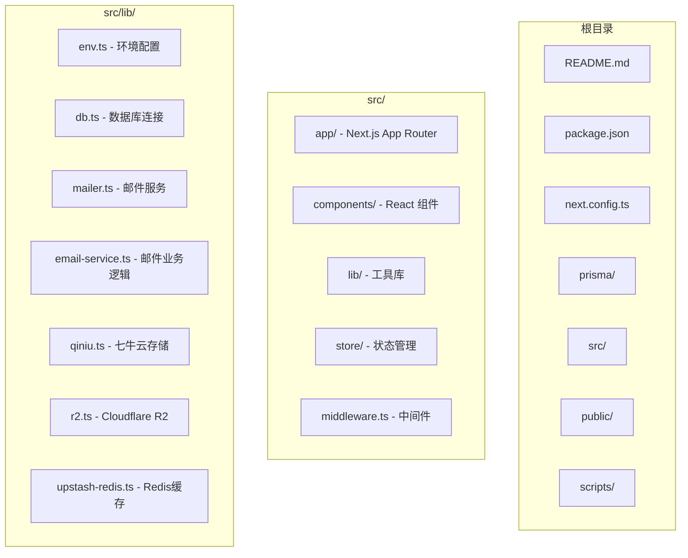
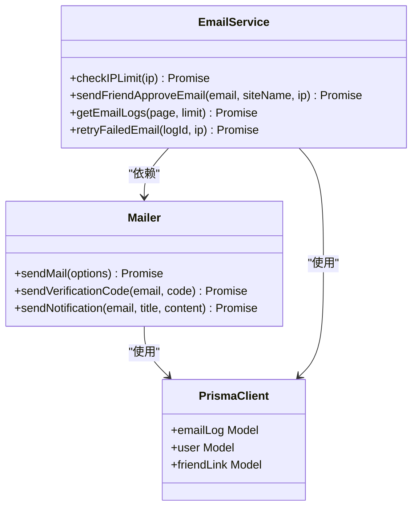
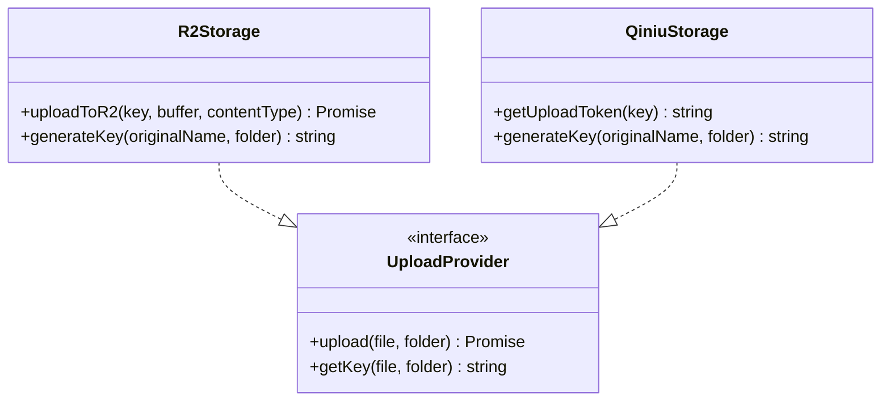
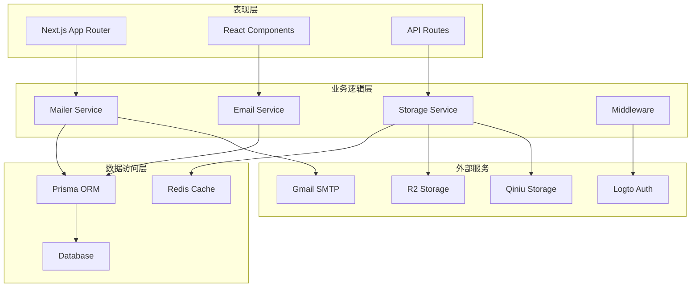
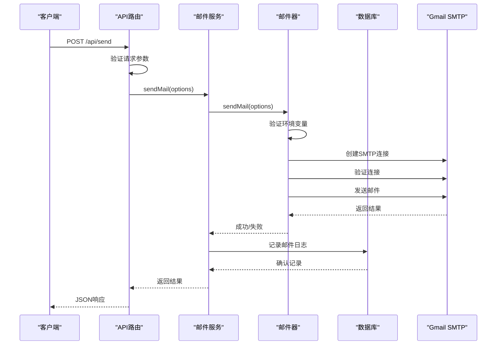
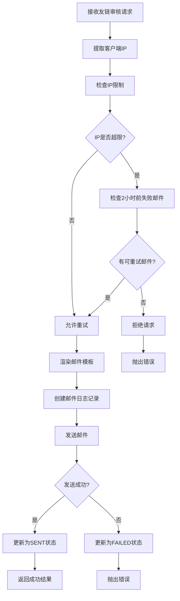
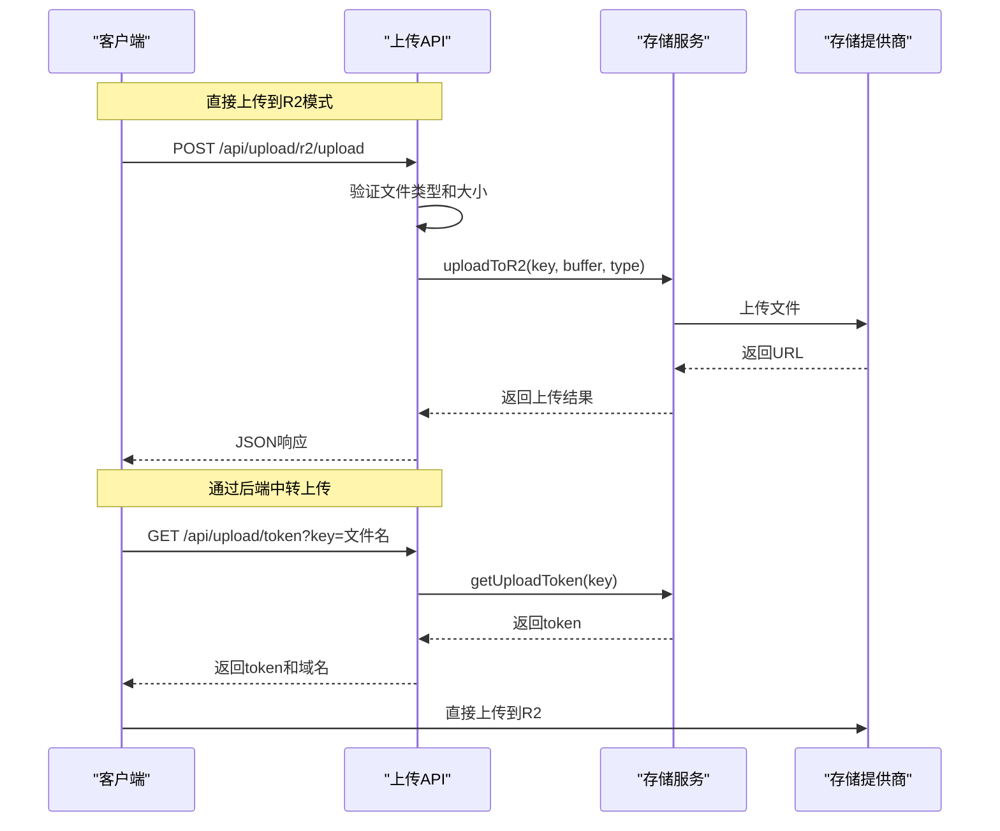
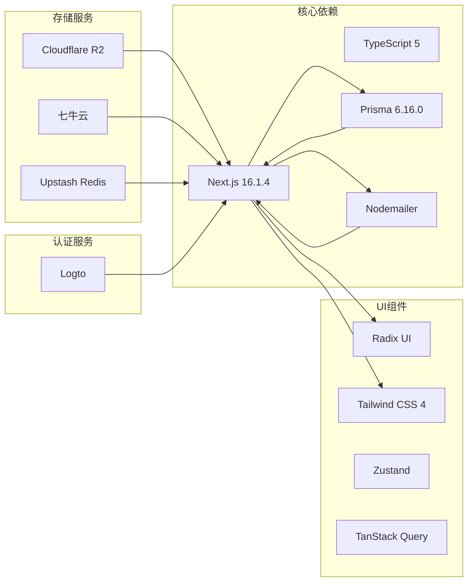

# 故障排除指南

<cite>
**本文档引用的文件**
- [README.md](file://README.md)
- [package.json](file://package.json)
- [next.config.ts](file://next.config.ts)
- [src/lib/env.ts](file://src/lib/env.ts)
- [prisma/schema.prisma](file://prisma/schema.prisma)
- [src/lib/mailer.ts](file://src/lib/mailer.ts)
- [src/lib/email-service.ts](file://src/lib/email-service.ts)
- [src/lib/db.ts](file://src/lib/db.ts)
- [src/lib/upstash-redis.ts](file://src/lib/upstash-redis.ts)
- [src/lib/qiniu.ts](file://src/lib/qiniu.ts)
- [src/app/api/send/route.ts](file://src/app/api/send/route.ts)
- [src/app/api/send-friend-approval/route.ts](file://src/app/api/send-friend-approval/route.ts)
- [src/app/api/upload/r2/upload/route.ts](file://src/app/api/upload/r2/upload/route.ts)
- [src/app/api/upload/token/route.ts](file://src/app/api/upload/token/route.ts)
- [src/middleware.ts](file://src/middleware.ts)
</cite>

## 目录
1. [简介](#简介)
2. [项目结构](#项目结构)
3. [核心组件](#核心组件)
4. [架构概览](#架构概览)
5. [详细组件分析](#详细组件分析)
6. [依赖关系分析](#依赖关系分析)
7. [性能考虑](#性能考虑)
8. [故障排除指南](#故障排除指南)
9. [结论](#结论)

## 简介

Ground Hog 是一个基于 Next.js 16.1.4 的现代化工具平台和博客系统，集成了用户认证、博客管理、AI 工具库、实用工具箱等功能。该项目采用了现代化的技术栈，包括 TypeScript 5、Radix UI + Tailwind CSS 4、PostgreSQL 数据库、Redis 缓存等。

## 项目结构

项目采用标准的 Next.js App Router 结构，主要分为以下几个部分：

**图表来源**
- [package.json:1-98](file://package.json#L1-L98)
- [next.config.ts:1-24](file://next.config.ts#L1-L24)

**章节来源**
- [README.md:54-69](file://README.md#L54-L69)
- [package.json:1-98](file://package.json#L1-L98)

## 核心组件

### 邮件系统组件

邮件系统是该项目的核心功能之一，包含完整的邮件发送、验证码发送、通知邮件发送以及友链审核邮件发送功能。

**图表来源**
- [src/lib/mailer.ts:1-156](file://src/lib/mailer.ts#L1-L156)
- [src/lib/email-service.ts:1-215](file://src/lib/email-service.ts#L1-L215)
- [prisma/schema.prisma:243-260](file://prisma/schema.prisma#L243-L260)

### 存储组件

项目支持多种存储方案，包括 Cloudflare R2 和七牛云存储，提供灵活的文件上传解决方案。

**图表来源**
- [src/lib/qiniu.ts:1-33](file://src/lib/qiniu.ts#L1-L33)
- [src/app/api/upload/r2/upload/route.ts:1-60](file://src/app/api/upload/r2/upload/route.ts#L1-L60)

**章节来源**
- [src/lib/mailer.ts:1-156](file://src/lib/mailer.ts#L1-L156)
- [src/lib/email-service.ts:1-215](file://src/lib/email-service.ts#L1-L215)
- [src/lib/qiniu.ts:1-33](file://src/lib/qiniu.ts#L1-L33)

## 架构概览

项目采用分层架构设计，包含表现层、业务逻辑层、数据访问层和外部服务集成层。

**图表来源**
- [src/middleware.ts:1-36](file://src/middleware.ts#L1-L36)
- [src/lib/db.ts:1-16](file://src/lib/db.ts#L1-L16)
- [src/lib/upstash-redis.ts:1-15](file://src/lib/upstash-redis.ts#L1-L15)

## 详细组件分析

### 邮件发送流程

邮件发送是系统中最复杂的流程之一，涉及多个步骤和错误处理机制。

**图表来源**
- [src/app/api/send/route.ts:1-150](file://src/app/api/send/route.ts#L1-L150)
- [src/lib/mailer.ts:31-64](file://src/lib/mailer.ts#L31-L64)
- [src/lib/email-service.ts:74-123](file://src/lib/email-service.ts#L74-L123)

### 友链审核邮件流程

友链审核邮件具有特殊的IP限制和重试机制。

**图表来源**
- [src/lib/email-service.ts:11-55](file://src/lib/email-service.ts#L11-L55)
- [src/lib/email-service.ts:57-123](file://src/lib/email-service.ts#L57-L123)

**章节来源**
- [src/app/api/send/route.ts:1-150](file://src/app/api/send/route.ts#L1-L150)
- [src/lib/email-service.ts:1-215](file://src/lib/email-service.ts#L1-L215)

### 存储上传流程

存储上传支持两种模式：直接上传到R2和通过后端中转上传。

**图表来源**
- [src/app/api/upload/r2/upload/route.ts:1-60](file://src/app/api/upload/r2/upload/route.ts#L1-L60)
- [src/app/api/upload/token/route.ts:1-38](file://src/app/api/upload/token/route.ts#L1-L38)
- [src/lib/qiniu.ts:10-21](file://src/lib/qiniu.ts#L10-L21)

**章节来源**
- [src/app/api/upload/r2/upload/route.ts:1-60](file://src/app/api/upload/r2/upload/route.ts#L1-L60)
- [src/app/api/upload/token/route.ts:1-38](file://src/app/api/upload/token/route.ts#L1-L38)
- [src/lib/qiniu.ts:1-33](file://src/lib/qiniu.ts#L1-L33)

## 依赖关系分析

项目的主要依赖关系如下：

**图表来源**
- [package.json:11-79](file://package.json#L11-L79)
- [next.config.ts:1-24](file://next.config.ts#L1-L24)

**章节来源**
- [package.json:1-98](file://package.json#L1-L98)
- [next.config.ts:1-24](file://next.config.ts#L1-L24)

## 性能考虑

### 数据库性能优化

项目使用了 Prisma 的 relationJoins 预览功能来优化关联查询性能：

- 使用单条 LATERAL JOIN 取关联数据，避免每个 include 各发一次往返
- 在开发环境中启用详细的数据库日志记录
- 生产环境中仅记录错误级别的日志

### 缓存策略

- 使用 Upstash Redis 作为缓存层
- 邮件日志使用 Next.js 的 unstable_cache 进行缓存
- 缓存标签用于精确的缓存失效控制

### 图片优化

- 配置了特定的远程图片源进行优化
- 支持多种图片格式的处理

## 故障排除指南

### 环境配置问题

**常见问题1：Gmail 配置错误**
- 检查 `.env` 文件中的 `GMAIL_USER` 和 `GMAIL_APP_PASSWORD` 设置
- 确保使用应用专用密码而非账户密码
- 验证 Gmail SMTP 设置是否正确

**常见问题2：数据库连接失败**
- 检查 `DATABASE_URL` 环境变量格式
- 确认数据库服务正在运行
- 验证网络连接和防火墙设置

**常见问题3：Redis 连接问题**
- 检查 `UPSTASH_REDIS_REST_URL` 和 `UPSTASH_REDIS_REST_TOKEN` 设置
- 确认 Upstash Redis 服务可用性

**章节来源**
- [src/lib/env.ts:1-40](file://src/lib/env.ts#L1-L40)
- [src/lib/db.ts:1-16](file://src/lib/db.ts#L1-L16)
- [src/lib/upstash-redis.ts:1-15](file://src/lib/upstash-redis.ts#L1-L15)

### 邮件发送问题

**问题1：邮件发送失败**
- 检查 SMTP 连接验证是否通过
- 确认邮件模板渲染正常
- 查看数据库中的邮件日志记录

**问题2：IP 限制导致发送被阻止**
- 检查同一IP地址的邮件发送频率
- 查看2小时内是否有可重试的失败邮件
- 等待2小时后重试或使用不同IP

**问题3：验证码邮件格式错误**
- 验证验证码长度为6位数字
- 检查邮件模板中的验证码显示格式
- 确认验证码的有效期设置

**章节来源**
- [src/lib/mailer.ts:31-64](file://src/lib/mailer.ts#L31-L64)
- [src/lib/email-service.ts:11-55](file://src/lib/email-service.ts#L11-L55)
- [src/app/api/send/route.ts:52-74](file://src/app/api/send/route.ts#L52-L74)

### 存储上传问题

**问题1：R2 上传失败**
- 检查文件类型是否为图片格式
- 验证文件大小不超过10MB限制
- 确认 Cloudflare R2 凭证配置正确

**问题2：七牛云上传凭证获取失败**
- 验证 `key` 参数是否正确传递
- 检查七牛云访问密钥配置
- 确认存储桶名称和域名设置

**问题3：前端直传到七牛云失败**
- 验证上传token的有效期
- 检查网络连接和跨域设置
- 确认文件路径格式正确

**章节来源**
- [src/app/api/upload/r2/upload/route.ts:8-60](file://src/app/api/upload/r2/upload/route.ts#L8-L60)
- [src/app/api/upload/token/route.ts:10-38](file://src/app/api/upload/token/route.ts#L10-L38)
- [src/lib/qiniu.ts:10-21](file://src/lib/qiniu.ts#L10-L21)

### 认证和中间件问题

**问题1：仪表板访问被重定向到登录页**
- 检查 Logto 认证状态
- 验证用户身份验证令牌
- 确认用户角色权限

**问题2：特定路由无法访问**
- 检查中间件配置规则
- 验证受保护路由的匹配模式
- 确认认证上下文获取正常

**章节来源**
- [src/middleware.ts:8-28](file://src/middleware.ts#L8-L28)

### API 路由问题

**问题1：邮件发送 API 返回参数验证错误**
- 检查请求体格式是否符合 Zod 验证规则
- 确认必填字段完整
- 验证邮箱格式和验证码长度

**问题2：友链审核邮件发送失败**
- 检查请求参数是否包含 `email` 和 `siteName`
- 验证客户端IP获取逻辑
- 确认数据库连接正常

**章节来源**
- [src/app/api/send/route.ts:1-150](file://src/app/api/send/route.ts#L1-L150)
- [src/app/api/send-friend-approval/route.ts:1-44](file://src/app/api/send-friend-approval/route.ts#L1-L44)

### 数据库迁移问题

**问题1：Prisma 迁移失败**
- 检查数据库连接字符串
- 验证迁移文件语法
- 确认数据库版本兼容性

**问题2：模型定义错误**
- 检查实体关系映射
- 验证索引定义
- 确认枚举值设置

**章节来源**
- [prisma/schema.prisma:1-308](file://prisma/schema.prisma#L1-L308)

## 结论

Ground Hog 项目是一个功能完整、架构清晰的现代化 Web 应用。通过本文档提供的故障排除指南，开发者可以快速识别和解决常见的配置、连接和功能问题。

主要的故障排除要点包括：

1. **环境配置**：确保所有必需的环境变量正确设置
2. **依赖服务**：验证外部服务（数据库、邮件、存储）的连接状态
3. **API 验证**：遵循严格的输入验证和错误处理
4. **缓存策略**：合理使用缓存以提高性能
5. **监控日志**：利用详细的日志记录进行问题诊断

通过遵循这些最佳实践和故障排除步骤，可以确保系统的稳定运行和良好的用户体验。