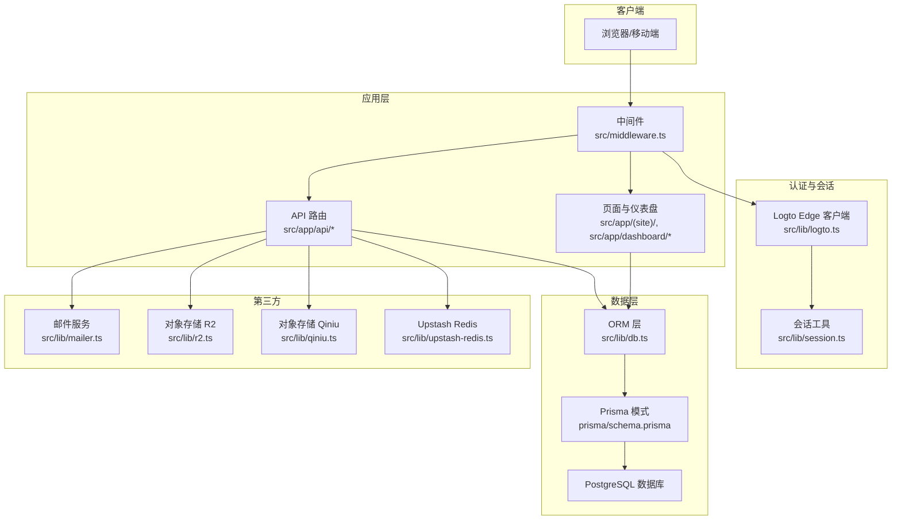
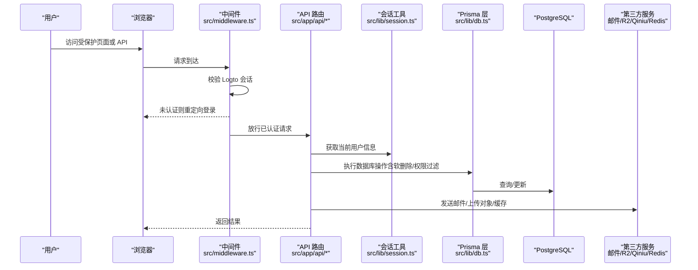
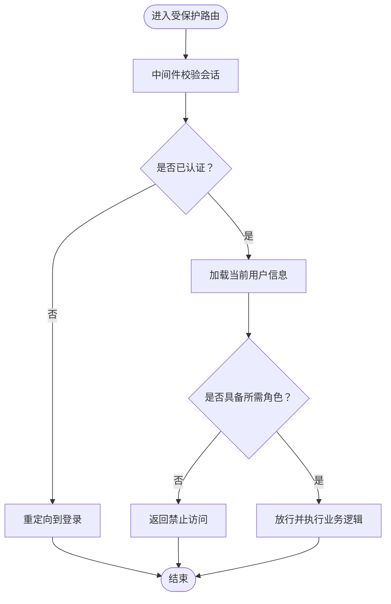
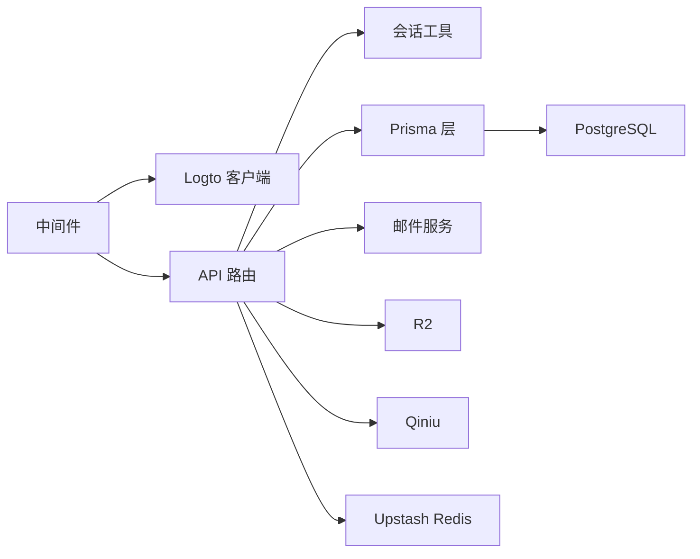

# 数据安全

<cite>
**本文引用的文件**
- [prisma/schema.prisma](file://prisma/schema.prisma)
- [prisma/migrations/20260122003154_add_miss_table/migration.sql](file://prisma/migrations/20260122003154_add_miss_table/migration.sql)
- [src/middleware.ts](file://src/middleware.ts)
- [src/lib/logto.ts](file://src/lib/logto.ts)
- [src/lib/session.ts](file://src/lib/session.ts)
- [src/app/api/logto/sign-in/route.ts](file://src/app/api/logto/sign-in/route.ts)
- [src/app/api/logto/callback/route.ts](file://src/app/api/logto/callback/route.ts)
- [src/app/api/logto/sign-out/route.ts](file://src/app/api/logto/sign-out/route.ts)
- [src/app/api/auth/me/route.ts](file://src/app/api/auth/me/route.ts)
- [src/app/api/users/[id]/route.ts](file://src/app/api/users/[id]/route.ts)
- [src/app/dashboard/users/actions.ts](file://src/app/dashboard/users/actions.ts)
- [src/app/dashboard/layout.tsx](file://src/app/dashboard/layout.tsx)
- [src/app/dashboard/users/components/user-list.tsx](file://src/app/dashboard/users/components/user-list.tsx)
- [src/app/dashboard/email-logs/components/email-logs-wrapper.tsx](file://src/app/dashboard/email-logs/components/email-logs-wrapper.tsx)
- [src/lib/email-service.ts](file://src/lib/email-service.ts)
- [src/lib/mailer.ts](file://src/lib/mailer.ts)
- [src/lib/r2.ts](file://src/lib/r2.ts)
- [src/lib/qiniu.ts](file://src/lib/qiniu.ts)
- [src/lib/upstash-redis.ts](file://src/lib/upstash-redis.ts)
- [src/lib/db.ts](file://src/lib/db.ts)
- [AGENTS.md](file://AGENTS.md)
- [MAILER_GUIDE.md](file://MAILER_GUIDE.md)
- [README.md](file://README.md)
- [.agents/skills/vercel-react-best-practices/rules/server-auth-actions.md](file://.agents/skills/vercel-react-best-practices/rules/server-auth-actions.md)
</cite>

## 目录
1. [引言](#引言)
2. [项目结构](#项目结构)
3. [核心组件](#核心组件)
4. [架构总览](#架构总览)
5. [详细组件分析](#详细组件分析)
6. [依赖关系分析](#依赖关系分析)
7. [性能考量](#性能考量)
8. [故障排查指南](#故障排查指南)
9. [结论](#结论)
10. [附录](#附录)

## 引言
本文件面向“一梦五千年”项目，提供一套系统化的数据安全文档，覆盖数据库安全、用户隐私保护、访问控制、数据备份与审计、安全防护（SQL 注入、XSS、CSRF）、第三方服务集成安全以及数据泄露应急响应与处置流程。内容基于仓库中实际实现与配置进行梳理，并结合最佳实践给出改进建议。

## 项目结构
项目采用 Next.js 应用结构，前端路由与 API 路由并行组织，认证围绕 Logto OIDC 实现，数据库使用 Prisma + PostgreSQL，部分静态资源与媒体通过 R2/Qiniu 等对象存储承载。中间件在 Edge 运行时进行会话校验，保护受保护路径。

图表来源
- [src/middleware.ts:1-35](file://src/middleware.ts#L1-L35)
- [src/lib/logto.ts](file://src/lib/logto.ts)
- [src/lib/session.ts](file://src/lib/session.ts)
- [src/lib/db.ts](file://src/lib/db.ts)
- [prisma/schema.prisma:1-114](file://prisma/schema.prisma#L1-L114)
- [src/lib/mailer.ts](file://src/lib/mailer.ts)
- [src/lib/r2.ts](file://src/lib/r2.ts)
- [src/lib/qiniu.ts](file://src/lib/qiniu.ts)
- [src/lib/upstash-redis.ts](file://src/lib/upstash-redis.ts)

章节来源
- [AGENTS.md:149-195](file://AGENTS.md#L149-L195)
- [AGENTS.md:254-266](file://AGENTS.md#L254-L266)

## 核心组件
- 认证与会话：基于 Logto 的 OIDC，Edge 中间件校验会话，客户端通过加密 Cookie 维持会话。
- 数据访问：Prisma ORM + PostgreSQL，使用连接池与直连分离（运行时 6543 连接池 + 迁移 5432 直连）。
- 数据模型：用户、账户、文章、分类、标签等，支持软删除字段与索引。
- API 与权限：受保护路由与 API，管理员角色控制，服务端动作需内嵌鉴权。
- 第三方集成：邮件服务、R2/Qiniu 对象存储、Redis 缓存。

章节来源
- [AGENTS.md:163-168](file://AGENTS.md#L163-L168)
- [prisma/schema.prisma:1-114](file://prisma/schema.prisma#L1-L114)
- [src/middleware.ts:1-35](file://src/middleware.ts#L1-L35)

## 架构总览
下图展示从浏览器到数据库与第三方服务的整体调用链，以及关键安全控制点（会话校验、鉴权、API 限流与输入校验）。

图表来源
- [src/middleware.ts:8-27](file://src/middleware.ts#L8-L27)
- [src/app/api/auth/me/route.ts:1-5](file://src/app/api/auth/me/route.ts#L1-L5)
- [src/lib/session.ts](file://src/lib/session.ts)
- [src/lib/db.ts](file://src/lib/db.ts)
- [prisma/schema.prisma:15-82](file://prisma/schema.prisma#L15-L82)

## 详细组件分析

### 数据库安全与加密
- 存储加密
  - 数据库存储层面未见显式的透明数据加密（TDE）配置片段；建议在数据库侧启用 TDE，并对敏感字段（如密码列）进行额外加密或脱敏。
  - 密码字段在模式中存在，但未标注加密策略；建议仅保存不可逆哈希值，不落库明文。
- 字段级加密
  - 代码中未发现字段级加密实现；若需满足强合规要求，可在应用层对敏感字段（如邮箱、昵称、头像 URL 等）进行对称加密存储，密钥由密钥管理服务（KMS）轮换与托管。
- 传输加密
  - 数据库连接字符串使用 PostgreSQL 协议，未见 TLS 参数；建议在连接串中启用 SSL/TLS，并强制加密传输。
- 软删除与索引
  - 用户模型包含软删除字段与索引，查询默认过滤 isDelete=0，避免误读取已删除记录。

章节来源
- [prisma/schema.prisma:15-82](file://prisma/schema.prisma#L15-L82)
- [prisma/migrations/20260122003154_add_miss_table/migration.sql:40-93](file://prisma/migrations/20260122003154_add_miss_table/migration.sql#L40-L93)
- [src/app/api/users/[id]/route.ts:50-L70](file://src/app/api/users/[id]/route.ts#L50-L70)
- [src/app/dashboard/users/actions.ts:125-148](file://src/app/dashboard/users/actions.ts#L125-L148)

### 用户隐私保护
- 数据最小化
  - API 返回用户信息时仅暴露必要字段，避免泄露内部标识或敏感属性。
- 数据保留与删除
  - 删除采用软删除（isDelete=2 并记录 deletedAt），便于审计与恢复；硬删除应遵循最小化原则并在合规期满后执行。
- 访问控制
  - 管理员角色具备更高权限，普通用户仅能修改自身资料；删除他人账户需管理员身份。

章节来源
- [src/app/api/users/[id]/route.ts:50-L70](file://src/app/api/users/[id]/route.ts#L50-L70)
- [src/app/dashboard/users/actions.ts:125-148](file://src/app/dashboard/users/actions.ts#L125-L148)
- [src/app/dashboard/layout.tsx:15-15](file://src/app/dashboard/layout.tsx#L15-L15)

### 访问控制策略
- 中间件保护
  - Edge 中间件拦截受保护路径，校验会话有效性，未认证跳转登录。
- 角色权限管理
  - 用户模型包含 role 字段，默认 USER；管理员可访问仪表盘与用户管理。
- API 访问限制
  - 服务端动作需在函数内部进行鉴权与授权校验，防止被直接调用。

图表来源
- [src/middleware.ts:15-27](file://src/middleware.ts#L15-L27)
- [src/app/dashboard/layout.tsx:15-15](file://src/app/dashboard/layout.tsx#L15-L15)
- [.agents/skills/vercel-react-best-practices/rules/server-auth-actions.md:8-14](file://.agents/skills/vercel-react-best-practices/rules/server-auth-actions.md#L8-L14)

章节来源
- [src/middleware.ts:1-35](file://src/middleware.ts#L1-L35)
- [src/app/dashboard/layout.tsx:15-15](file://src/app/dashboard/layout.tsx#L15-L15)
- [.agents/skills/vercel-react-best-practices/rules/server-auth-actions.md:8-14](file://.agents/skills/vercel-react-best-practices/rules/server-auth-actions.md#L8-L14)

### 数据备份与审计
- 备份
  - 数据库迁移脚本与模式定义位于 prisma 目录，建议定期导出模式与迁移历史，配合数据库快照进行备份演练。
- 审计日志
  - 项目中未发现集中式审计日志表或写入逻辑；建议新增审计表记录关键操作（用户 CRUD、角色变更、软删除）与操作者、时间、IP、UA 等上下文。
- 合规性
  - 项目未包含明确的合规性声明；建议根据部署地区（如适用）补充 GDPR/CCPA 等合规要求映射。

章节来源
- [prisma/schema.prisma:1-114](file://prisma/schema.prisma#L1-L114)
- [prisma/migrations/20260122003154_add_miss_table/migration.sql:40-93](file://prisma/migrations/20260122003154_add_miss_table/migration.sql#L40-L93)

### 安全防护：SQL 注入、XSS、CSRF
- SQL 注入
  - 数据库访问通过 Prisma ORM 执行，避免原生 SQL 拼接；建议保持此实践，严格限制动态参数来源。
- XSS
  - 项目中未发现专门的 XSS 防护配置；建议在渲染侧对用户输入进行转义或使用安全的富文本库，并在服务端输出时统一编码策略。
- CSRF
  - 项目未检测到显式的 CSRF Token 管控；建议在表单提交与关键 API 调用中引入 CSRF Token 校验，并在同源策略与安全响应头基础上强化防护。

章节来源
- [prisma/schema.prisma:1-114](file://prisma/schema.prisma#L1-L114)

### 第三方服务集成安全
- 邮件服务
  - 邮件配置示例位于文档与环境变量中，建议将凭据置于受控密钥管理服务中，启用最小权限与轮换策略。
- 对象存储
  - R2 与 Qiniu 上传/令牌接口存在于 API 路由中，建议对上传策略进行白名单校验、大小限制与内容类型检查，并生成短期有效签名。
- 缓存
  - Upstash Redis 用于缓存，建议启用访问密钥与网络隔离，限制公网暴露。

章节来源
- [MAILER_GUIDE.md:29-29](file://MAILER_GUIDE.md#L29-L29)
- [README.md:81-84](file://README.md#L81-L84)
- [src/lib/r2.ts](file://src/lib/r2.ts)
- [src/lib/qiniu.ts](file://src/lib/qiniu.ts)
- [src/lib/upstash-redis.ts](file://src/lib/upstash-redis.ts)

### 数据泄露应急响应与处置流程
- 快速评估
  - 确认受影响范围（用户、数据集、API）、泄露途径与影响面。
- 隔离与修复
  - 暂停相关 API、撤销异常令牌、修复漏洞并回滚风险变更。
- 通知与补救
  - 对高风险账户执行强制重置，向监管与受影响用户发出通知。
- 审计与改进
  - 全量审计日志回溯、完善监控告警、加固访问控制与加密策略。

[本节为通用流程说明，不直接分析具体文件]

## 依赖关系分析
- 认证链路
  - 中间件依赖 Logto Edge 客户端校验会话；API 路由依赖会话工具获取当前用户；服务端动作需内嵌鉴权。
- 数据访问链路
  - 页面与 API 通过 Prisma 访问数据库；数据库连接使用运行时连接池与直连分离。
- 第三方集成
  - 邮件、对象存储、缓存通过独立模块封装，API 路由按需调用。

图表来源
- [src/middleware.ts:1-35](file://src/middleware.ts#L1-L35)
- [src/lib/logto.ts](file://src/lib/logto.ts)
- [src/lib/session.ts](file://src/lib/session.ts)
- [src/lib/db.ts](file://src/lib/db.ts)
- [src/lib/mailer.ts](file://src/lib/mailer.ts)
- [src/lib/r2.ts](file://src/lib/r2.ts)
- [src/lib/qiniu.ts](file://src/lib/qiniu.ts)
- [src/lib/upstash-redis.ts](file://src/lib/upstash-redis.ts)

章节来源
- [AGENTS.md:163-168](file://AGENTS.md#L163-L168)
- [AGENTS.md:155-161](file://AGENTS.md#L155-L161)

## 性能考量
- 连接池与迁移分离：运行时使用 6543 连接池，迁移使用 5432 直连，降低冷启动与连接竞争。
- 关联查询优化：启用 relationJoins 预览特性，合并 include 查询为单条 LATERAL JOIN，减少往返。
- 缓存策略：列表读使用稳定缓存与标签失效，写操作时精准失效，提升响应速度。

章节来源
- [AGENTS.md:254-266](file://AGENTS.md#L254-L266)
- [prisma/schema.prisma:1-5](file://prisma/schema.prisma#L1-L5)

## 故障排查指南
- 认证失败
  - 检查中间件是否正确重定向登录；确认 Logto 回调地址与配置一致；核对会话 Cookie 是否加密传输。
- 数据访问异常
  - 核对 Prisma 连接串与数据库可达性；检查软删除过滤条件与索引是否生效。
- 邮件发送失败
  - 校验凭据与应用密码配置；检查网络与第三方 SMTP 白名单。
- 对象存储上传失败
  - 校验签名有效期、桶权限与上传策略；确认 CDN/域名解析。

章节来源
- [src/middleware.ts:1-35](file://src/middleware.ts#L1-L35)
- [src/app/api/logto/callback/route.ts](file://src/app/api/logto/callback/route.ts)
- [src/lib/email-service.ts](file://src/lib/email-service.ts)
- [src/lib/mailer.ts](file://src/lib/mailer.ts)
- [src/lib/r2.ts](file://src/lib/r2.ts)
- [src/lib/qiniu.ts](file://src/lib/qiniu.ts)

## 结论
本项目在认证与访问控制方面具备良好基础（Logto OIDC、Edge 中间件、角色权限），数据库与传输加密、字段级加密尚未在代码中体现，建议尽快补齐。同时应建立审计日志与合规基线，完善 XSS/CSRF 防护与第三方集成安全策略，并制定数据泄露应急响应流程以满足生产级安全要求。

[本节为总结性内容，不直接分析具体文件]

## 附录
- 环境变量与部署要点
  - 生产环境变量包含数据库连接串与直连 URL，迁移使用直连；建议在 CI/CD 中对敏感变量进行加密与轮换。
- 邮件与对象存储配置
  - 邮件服务凭据与第三方存储密钥应置于密钥管理服务，最小权限与短期凭证优先。

章节来源
- [AGENTS.md:74-75](file://AGENTS.md#L74-L75)
- [AGENTS.md:257-260](file://AGENTS.md#L257-L260)
- [MAILER_GUIDE.md:29-29](file://MAILER_GUIDE.md#L29-L29)
- [README.md:81-84](file://README.md#L81-L84)