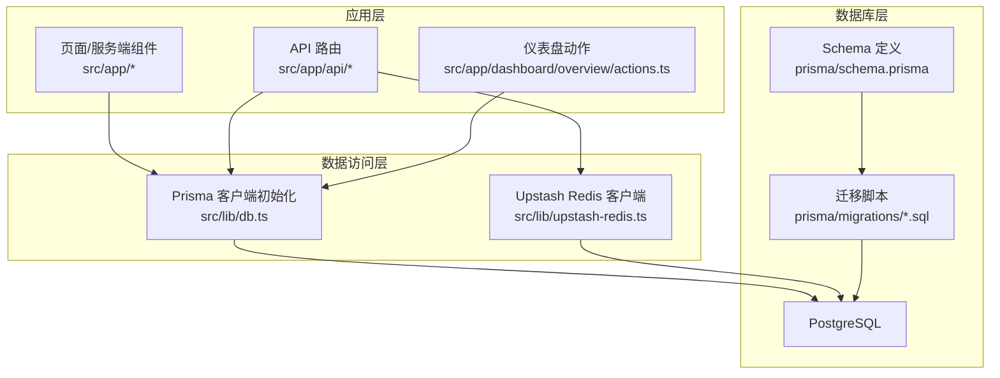
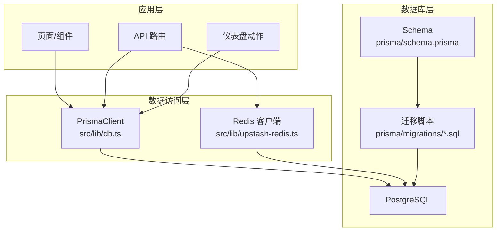
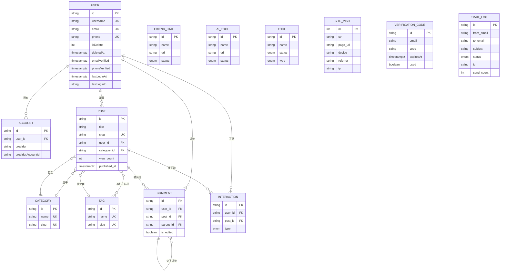
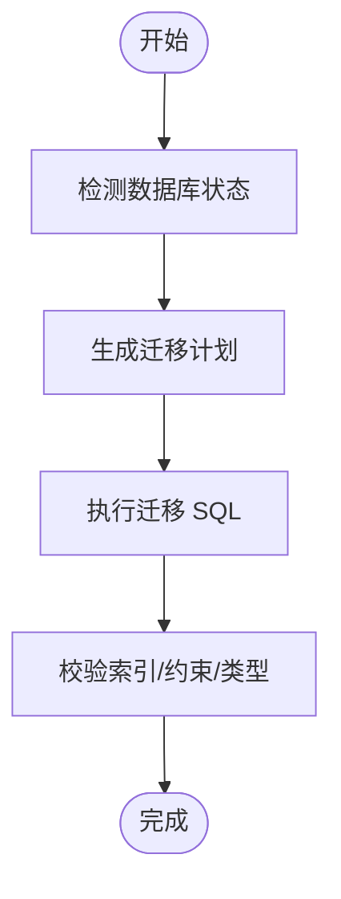
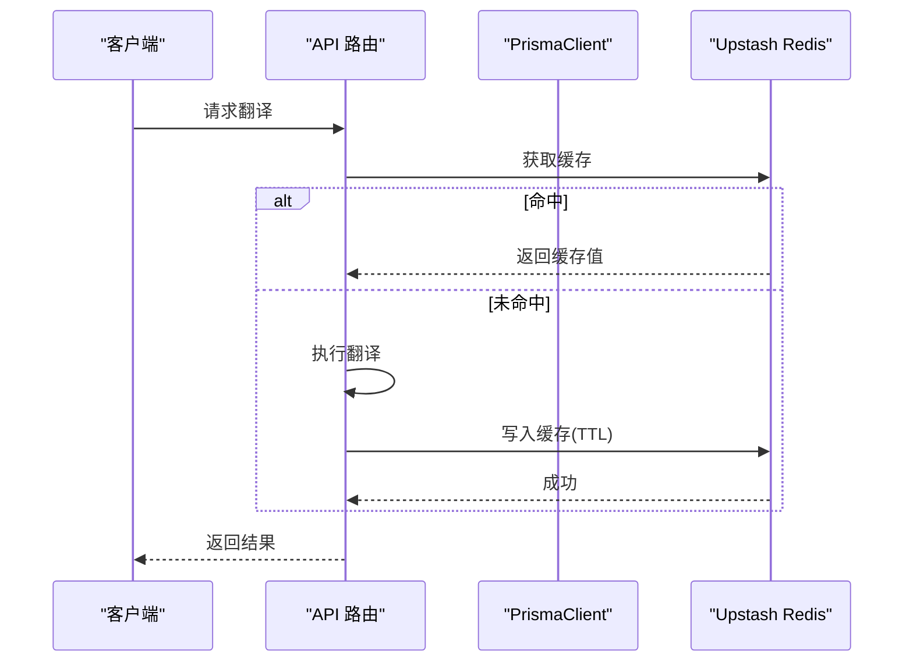
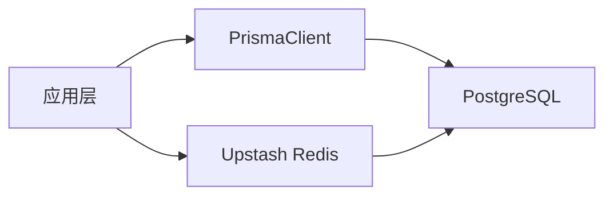

# 数据库设计

<cite>
**本文引用的文件**
- [prisma/schema.prisma](file://prisma/schema.prisma)
- [prisma/migrations/20260122003154_add_miss_table/migration.sql](file://prisma/migrations/20260122003154_add_miss_table/migration.sql)
- [prisma/migrations/20260122005608_add_site_visit/migration.sql](file://prisma/migrations/20260122005608_add_site_visit/migration.sql)
- [prisma/migrations/20260201111652_fix_timezone/migration.sql](file://prisma/migrations/20260201111652_fix_timezone/migration.sql)
- [src/lib/db.ts](file://src/lib/db.ts)
- [scripts/set-db-timezone.ts](file://scripts/set-db-timezone.ts)
- [src/app/dashboard/overview/actions.ts](file://src/app/dashboard/overview/actions.ts)
- [src/app/api/test-db/route.ts](file://src/app/api/test-db/route.ts)
- [src/lib/upstash-redis.ts](file://src/lib/upstash-redis.ts)
- [src/app/api/rcode/route.ts](file://src/app/api/rcode/route.ts)
</cite>

## 目录
1. [引言](#引言)
2. [项目结构](#项目结构)
3. [核心组件](#核心组件)
4. [架构概览](#架构概览)
5. [详细组件分析](#详细组件分析)
6. [依赖分析](#依赖分析)
7. [性能考虑](#性能考虑)
8. [故障排查指南](#故障排查指南)
9. [结论](#结论)
10. [附录](#附录)

## 引言
本文件为“一梦五千年”项目的数据库设计与实现文档，聚焦于基于 Prisma ORM 的数据模型设计、迁移与版本管理、索引与查询优化、数据完整性与外键关系、时区处理与隐私保护、缓存与事务策略、以及扩展性与运维最佳实践。文档内容严格依据仓库中的 Prisma Schema、迁移脚本与应用侧数据库访问代码整理而成，旨在帮助开发者快速理解并高效维护数据库层。

## 项目结构
数据库相关的核心位置如下：
- 数据模型定义：prisma/schema.prisma
- 迁移脚本：prisma/migrations 下的 SQL 文件
- 应用侧数据库客户端初始化：src/lib/db.ts
- 时区设置脚本：scripts/set-db-timezone.ts
- 数据访问示例（仪表盘趋势与站点访问）：src/app/dashboard/overview/actions.ts
- 基础连通性测试：src/app/api/test-db/route.ts
- 缓存集成（Upstash Redis）：src/lib/upstash-redis.ts、src/app/api/rcode/route.ts

**图表来源**
- [prisma/schema.prisma:1-308](file://prisma/schema.prisma#L1-L308)
- [prisma/migrations/20260122003154_add_miss_table/migration.sql:1-253](file://prisma/migrations/20260122003154_add_miss_table/migration.sql#L1-L253)
- [prisma/migrations/20260122005608_add_site_visit/migration.sql:1-21](file://prisma/migrations/20260122005608_add_site_visit/migration.sql#L1-L21)
- [prisma/migrations/20260201111652_fix_timezone/migration.sql:1-42](file://prisma/migrations/20260201111652_fix_timezone/migration.sql#L1-L42)
- [src/lib/db.ts:1-16](file://src/lib/db.ts#L1-L16)
- [src/lib/upstash-redis.ts:1-14](file://src/lib/upstash-redis.ts#L1-L14)
- [src/app/dashboard/overview/actions.ts:1-100](file://src/app/dashboard/overview/actions.ts#L1-L100)

**章节来源**
- [prisma/schema.prisma:1-308](file://prisma/schema.prisma#L1-L308)
- [prisma/migrations/20260122003154_add_miss_table/migration.sql:1-253](file://prisma/migrations/20260122003154_add_miss_table/migration.sql#L1-L253)
- [prisma/migrations/20260122005608_add_site_visit/migration.sql:1-21](file://prisma/migrations/20260122005608_add_site_visit/migration.sql#L1-L21)
- [prisma/migrations/20260201111652_fix_timezone/migration.sql:1-42](file://prisma/migrations/20260201111652_fix_timezone/migration.sql#L1-L42)
- [src/lib/db.ts:1-16](file://src/lib/db.ts#L1-L16)
- [src/lib/upstash-redis.ts:1-14](file://src/lib/upstash-redis.ts#L1-L14)
- [src/app/dashboard/overview/actions.ts:1-100](file://src/app/dashboard/overview/actions.ts#L1-L100)
- [src/app/api/test-db/route.ts:1-14](file://src/app/api/test-db/route.ts#L1-L14)

## 核心组件
本节概述数据库中最重要的实体及其职责与关键字段映射。

- User（用户）
  - 关键字段：用户名、邮箱、昵称、头像、性别、角色、激活状态、删除标记与时间、邮箱/手机验证时间、注册/更新/最后登录时间与IP等
  - 约束与索引：唯一用户名/邮箱/手机号；复合索引(email, username)；软删除索引(isDelete)
  - 关系：一对多(posts/comments/interactions)，一对一(Account)
- Account（第三方账户）
  - 关键字段：provider/providerAccountId 唯一键；令牌与过期时间；用户外键
  - 约束与索引：唯一(provider, providerAccountId)；索引(userId)
  - 关系：多对一(User)
- Category（分类）
  - 关键字段：名称、slug、图标、颜色、描述
  - 约束与索引：唯一(name/slug)
- Tag（标签）
  - 关键字段：名称、slug
  - 约束与索引：唯一(name/slug)
- Post（文章）
  - 关键字段：标题、slug、内容、摘要、封面、状态、浏览计数、发布/创建/更新时间、作者与分类
  - 约束与索引：唯一(slug)；索引(userId/categoryId)
  - 关系：多对一(User/Category)，多对多(Tag)，一对多(Comments/Interactions)
- Comment（评论）
  - 关键字段：内容、用户/文章外键、父评论ID（自关联）、编辑标记
  - 约束与索引：索引(postId/userId/parentId)
  - 关系：多对一(User/Post)，自关联(父子评论)
- Interaction（互动）
  - 关键字段：类型(LIKE/FAVORITE)、用户/文章外键
  - 约举证与索引：唯一(user, post, type)；索引(postId/userId)
  - 关系：多对一(User/Post)
- FriendLink（友链）
  - 关键字段：名称、URL、描述、Logo、封面、联系邮箱、状态
- AiTool（AI工具）
  - 关键字段：名称、描述、URL、图标、封面、分类、标签、状态
- Tool（工具）
  - 关键字段：名称、描述、图标、版本、状态、类型(Local/External)、URL、分类
- SiteVisit（站点访问）
  - 关键字段：UV、页面URL、设备、来源、IP、创建时间
  - 约束与索引：多列索引(uv/page_url/created_at)
- VerificationCode（验证码）
  - 关键字段：邮箱、验证码、过期时间、创建时间、使用标记
  - 约束与索引：复合索引(email, createdAt)
- EmailLog（邮件日志）
  - 关键字段：发件人/收件人、主题、内容、状态、错误信息、发送IP、发送次数、创建/发送时间
  - 约束与索引：索引(ip/createdAt/status)

**章节来源**
- [prisma/schema.prisma:15-308](file://prisma/schema.prisma#L15-L308)

## 架构概览
下图展示数据库层与应用层的交互关系，以及迁移与时区修正流程。

**图表来源**
- [src/lib/db.ts:1-16](file://src/lib/db.ts#L1-L16)
- [src/lib/upstash-redis.ts:1-14](file://src/lib/upstash-redis.ts#L1-L14)
- [prisma/schema.prisma:1-308](file://prisma/schema.prisma#L1-L308)
- [prisma/migrations/20260122003154_add_miss_table/migration.sql:1-253](file://prisma/migrations/20260122003154_add_miss_table/migration.sql#L1-L253)
- [prisma/migrations/20260122005608_add_site_visit/migration.sql:1-21](file://prisma/migrations/20260122005608_add_site_visit/migration.sql#L1-L21)
- [prisma/migrations/20260201111652_fix_timezone/migration.sql:1-42](file://prisma/migrations/20260201111652_fix_timezone/migration.sql#L1-L42)

## 详细组件分析

### 实体关系图（ERD）
以下 ERD 基于 Prisma Schema 中的模型与关系定义绘制，展示核心实体之间的主从与多对多关系。

**图表来源**
- [prisma/schema.prisma:15-308](file://prisma/schema.prisma#L15-L308)

**章节来源**
- [prisma/schema.prisma:15-308](file://prisma/schema.prisma#L15-L308)

### 迁移策略与版本管理
- 迁移文件组织：按时间戳命名的 SQL 文件，分别负责新增表、索引与字段类型修正。
- 典型迁移步骤：
  - 新增缺失表与索引：创建 users/accounts/categories/tags/posts/comments/interactions/tools/_PostToTag 等，并建立唯一与复合索引。
  - 新增站点访问表：创建 site_visits 表及多列索引。
  - 时区修正：将 users/ai_tools/categories/comments/friend_links/interactions/posts/site_visits/tags/tools 等表的时间字段统一为 TIMESTAMPTZ。
- 版本控制：迁移锁文件 migration_lock.toml 存在于迁移目录中，确保并发迁移安全。

**图表来源**
- [prisma/migrations/20260122003154_add_miss_table/migration.sql:1-253](file://prisma/migrations/20260122003154_add_miss_table/migration.sql#L1-L253)
- [prisma/migrations/20260122005608_add_site_visit/migration.sql:1-21](file://prisma/migrations/20260122005608_add_site_visit/migration.sql#L1-L21)
- [prisma/migrations/20260201111652_fix_timezone/migration.sql:1-42](file://prisma/migrations/20260201111652_fix_timezone/migration.sql#L1-L42)

**章节来源**
- [prisma/migrations/20260122003154_add_miss_table/migration.sql:1-253](file://prisma/migrations/20260122003154_add_miss_table/migration.sql#L1-L253)
- [prisma/migrations/20260122005608_add_site_visit/migration.sql:1-21](file://prisma/migrations/20260122005608_add_site_visit/migration.sql#L1-L21)
- [prisma/migrations/20260201111652_fix_timezone/migration.sql:1-42](file://prisma/migrations/20260201111652_fix_timezone/migration.sql#L1-L42)

### 索引设计原则与查询优化
- 唯一索引
  - 用户：username/email/phone 唯一键
  - 分类/标签：name/slug 唯一键
  - 第三方账户：provider+providerAccountId 唯一键
- 复合与单列索引
  - 用户：email+username 组合索引；isDelete 单列索引
  - 文章：slug 唯一索引；userId/categoryId 索引
  - 评论：postId/userId/parentId 索引
  - 互动：postId/userId 唯一键（三元唯一）
  - 站点访问：uv/page_url/created_at 多列索引
  - 验证码：email+createdAt 复合索引
  - 邮件日志：ip/createdAt/status 索引
- 查询优化建议
  - 使用 Prisma 的 relationJoins 预览特性减少 N+1 查询往返
  - 对高频过滤字段（如 created_at、status、userId）建立合适索引
  - 利用复合索引覆盖常见查询条件（如 email+username）

**章节来源**
- [prisma/schema.prisma:59-61](file://prisma/schema.prisma#L59-L61)
- [prisma/schema.prisma:129-131](file://prisma/schema.prisma#L129-L131)
- [prisma/schema.prisma:148-150](file://prisma/schema.prisma#L148-L150)
- [prisma/schema.prisma:163-166](file://prisma/schema.prisma#L163-L166)
- [prisma/schema.prisma:225-228](file://prisma/schema.prisma#L225-L228)
- [prisma/schema.prisma:239](file://prisma/schema.prisma#L239)
- [prisma/schema.prisma:256-258](file://prisma/schema.prisma#L256-L258)
- [prisma/schema.prisma:1-5](file://prisma/schema.prisma#L1-L5)

### 数据完整性约束、外键关系与级联规则
- 外键与级联
  - Account.userId -> User.id（级联删除）
  - Comment.userId/postId -> User/Post（级联删除）
  - Interaction.userId/postId -> User/Post（级联删除）
  - 评论自关联 parent_id -> Comment.id（限制删除/更新）
- 唯一性与非空
  - username/email/phone 唯一；slug 唯一；provider+providerAccountId 唯一
  - 多个字段使用 @default 或 @map 映射到数据库真实列名
- 软删除
  - User.isDelete 与 deletedAt 支持软删除策略

**章节来源**
- [prisma/schema.prisma:77](file://prisma/schema.prisma#L77)
- [prisma/schema.prisma:143-146](file://prisma/schema.prisma#L143-L146)
- [prisma/schema.prisma:160-161](file://prisma/schema.prisma#L160-L161)

### 数据访问模式、缓存策略与事务处理
- 数据访问模式
  - 应用通过 PrismaClient 在 src/lib/db.ts 初始化，开发环境开启 query 日志便于调试
  - 仪表盘趋势与汇总使用原生 SQL 查询与 Next.js 缓存（unstable_cache）进行跨请求缓存
- 缓存策略
  - Upstash Redis 作为外部缓存，支持键前缀与 TTL 管理
  - 文本翻译接口对翻译结果进行缓存，提升重复请求命中率
- 事务处理
  - 项目未显式展示复杂事务逻辑；建议在需要强一致性的批量写入场景引入 Prisma 事务包裹

**图表来源**
- [src/app/api/rcode/route.ts:155-177](file://src/app/api/rcode/route.ts#L155-L177)
- [src/lib/upstash-redis.ts:1-14](file://src/lib/upstash-redis.ts#L1-L14)

**章节来源**
- [src/lib/db.ts:1-16](file://src/lib/db.ts#L1-L16)
- [src/app/dashboard/overview/actions.ts:67-95](file://src/app/dashboard/overview/actions.ts#L67-L95)
- [src/lib/upstash-redis.ts:1-14](file://src/lib/upstash-redis.ts#L1-L14)
- [src/app/api/rcode/route.ts:155-177](file://src/app/api/rcode/route.ts#L155-L177)

### 时区处理、数据加密与隐私保护
- 时区处理
  - 迁移将大量时间字段转换为 TIMESTAMPTZ 类型，保证时区一致性
  - 提供设置数据库全局时区脚本，便于统一时区基准
- 数据加密与隐私
  - 用户密码字段允许为空（支持第三方登录），敏感字段未见显式加密存储
  - 建议对密码采用强哈希算法并在传输层启用 HTTPS

**章节来源**
- [prisma/migrations/20260201111652_fix_timezone/migration.sql:1-42](file://prisma/migrations/20260201111652_fix_timezone/migration.sql#L1-L42)
- [scripts/set-db-timezone.ts:1-28](file://scripts/set-db-timezone.ts#L1-L28)
- [prisma/schema.prisma:22-23](file://prisma/schema.prisma#L22-L23)

### 数据备份与恢复策略
- 建议采用 PostgreSQL 原生命令或托管服务提供的备份工具进行定期全量/增量备份
- 结合迁移脚本与 schema.prisma，可在新环境中重建数据库结构与索引
- 备份恢复验证：通过测试路由确认连接可用与基础查询正常

**章节来源**
- [src/app/api/test-db/route.ts:1-14](file://src/app/api/test-db/route.ts#L1-L14)

### 监控指标与维护最佳实践
- 监控指标
  - 访问趋势：基于 site_visits 的 UV/PV 统计与分组聚合
  - 连接健康：测试路由返回数据库连接状态
- 维护最佳实践
  - 使用迁移脚本管理结构变更，避免直接手工修改生产库
  - 对高频查询字段保持索引有效性，定期评估索引使用情况
  - 开发环境开启 Prisma 查询日志，生产环境关闭或降级

**章节来源**
- [src/app/dashboard/overview/actions.ts:67-95](file://src/app/dashboard/overview/actions.ts#L67-L95)
- [src/app/api/test-db/route.ts:1-14](file://src/app/api/test-db/route.ts#L1-L14)

### 扩展性设计与读写分离
- 当前未实现读写分离与连接池独立配置
- 建议方向
  - 使用 Prisma 的 relationJoins 减少往返
  - 引入只读副本与读写分离中间件
  - 对热点表（如 posts/comments/interactions）进行分表或分区

**章节来源**
- [prisma/schema.prisma:1-5](file://prisma/schema.prisma#L1-L5)

## 依赖分析
- 组件耦合
  - 应用层通过 PrismaClient 访问数据库，耦合度低
  - 缓存层与数据库层解耦，通过独立客户端接入
- 外部依赖
  - PostgreSQL 作为持久化存储
  - Upstash Redis 作为缓存存储
- 潜在风险
  - 迁移锁与并发迁移需谨慎管理
  - 时间字段统一为 TIMESTAMPTZ，避免时区偏差

**图表来源**
- [src/lib/db.ts:1-16](file://src/lib/db.ts#L1-L16)
- [src/lib/upstash-redis.ts:1-14](file://src/lib/upstash-redis.ts#L1-L14)

**章节来源**
- [src/lib/db.ts:1-16](file://src/lib/db.ts#L1-L16)
- [src/lib/upstash-redis.ts:1-14](file://src/lib/upstash-redis.ts#L1-L14)

## 性能考虑
- 查询路径优化
  - 使用 relationJoins 减少关联查询往返
  - 为高频过滤字段建立合适索引
- 缓存利用
  - 对热点数据与翻译结果使用 Redis 缓存
- 事务与并发
  - 在需要强一致性的场景使用事务包裹
  - 控制并发迁移，避免锁冲突

[本节为通用指导，无需具体文件引用]

## 故障排查指南
- 连接失败
  - 检查 DATABASE_URL/DIRECT_URL 配置是否正确
  - 使用测试路由验证连接与基本查询
- 迁移异常
  - 查看迁移锁文件与迁移 SQL 是否完整
  - 确认时区修正迁移已执行
- 缓存问题
  - 检查 UPSTASH_REDIS_REST_URL/TOKEN 是否配置
  - 验证键前缀与 TTL 设置

**章节来源**
- [src/app/api/test-db/route.ts:1-14](file://src/app/api/test-db/route.ts#L1-L14)
- [prisma/migrations/20260201111652_fix_timezone/migration.sql:1-42](file://prisma/migrations/20260201111652_fix_timezone/migration.sql#L1-L42)
- [src/lib/upstash-redis.ts:1-14](file://src/lib/upstash-redis.ts#L1-L14)

## 结论
本项目采用 Prisma ORM 管理数据模型与迁移，结合 PostgreSQL 与 Upstash Redis 实现稳定的数据与缓存能力。通过合理的索引设计、时区统一与缓存策略，满足了博客、工具与社交功能的业务需求。建议后续在读写分离、连接池与事务治理方面进一步完善，以支撑更高并发与更复杂的业务场景。

## 附录
- 关键实现参考路径
  - 数据模型与关系：[prisma/schema.prisma](file://prisma/schema.prisma)
  - 迁移脚本：[prisma/migrations/20260122003154_add_miss_table/migration.sql](file://prisma/migrations/20260122003154_add_miss_table/migration.sql)、[prisma/migrations/20260122005608_add_site_visit/migration.sql](file://prisma/migrations/20260122005608_add_site_visit/migration.sql)、[prisma/migrations/20260201111652_fix_timezone/migration.sql](file://prisma/migrations/20260201111652_fix_timezone/migration.sql)
  - 数据库客户端：[src/lib/db.ts](file://src/lib/db.ts)
  - 时区设置脚本：[scripts/set-db-timezone.ts](file://scripts/set-db-timezone.ts)
  - 仪表盘趋势与汇总：[src/app/dashboard/overview/actions.ts](file://src/app/dashboard/overview/actions.ts)
  - 连通性测试：[src/app/api/test-db/route.ts](file://src/app/api/test-db/route.ts)
  - Redis 缓存封装：[src/lib/upstash-redis.ts](file://src/lib/upstash-redis.ts)
  - 翻译缓存示例：[src/app/api/rcode/route.ts](file://src/app/api/rcode/route.ts)