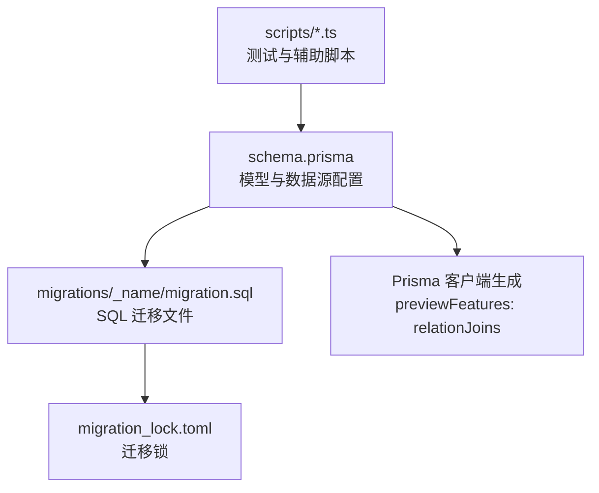
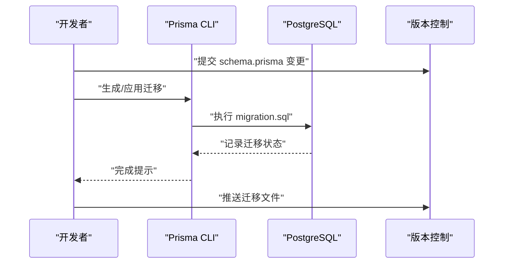
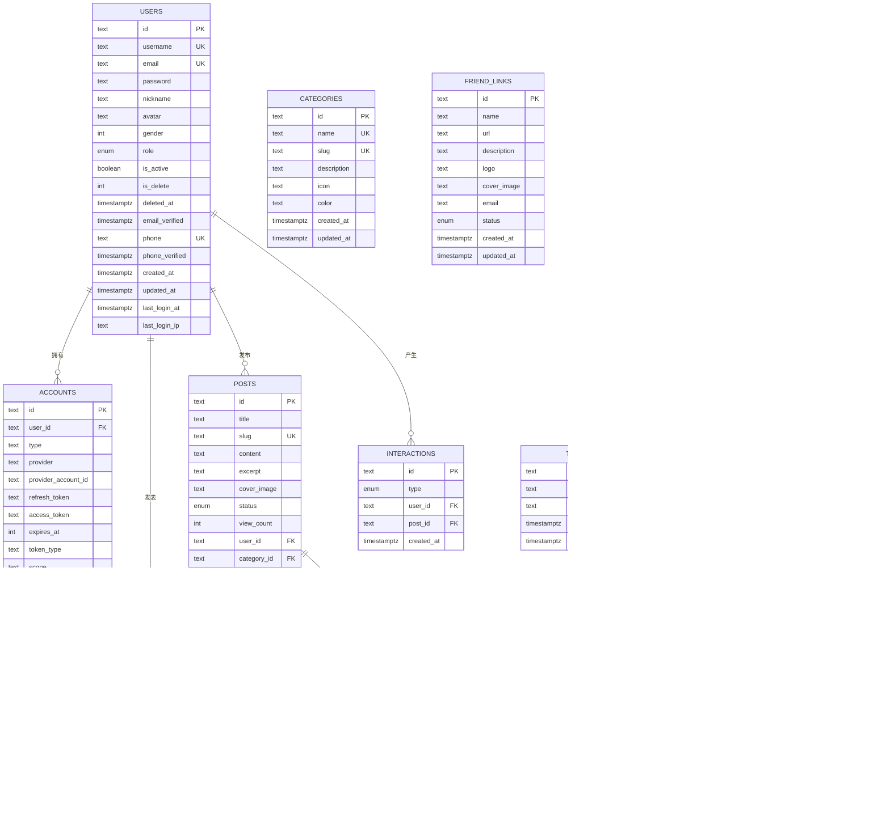
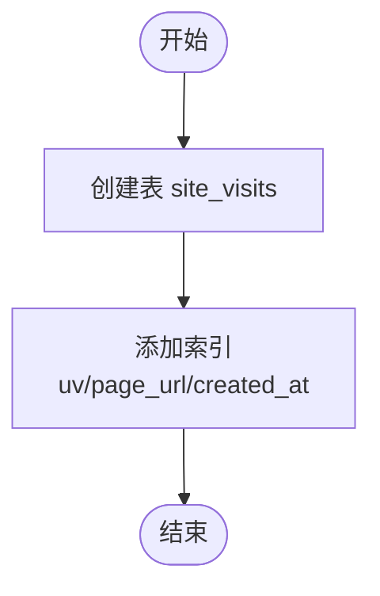
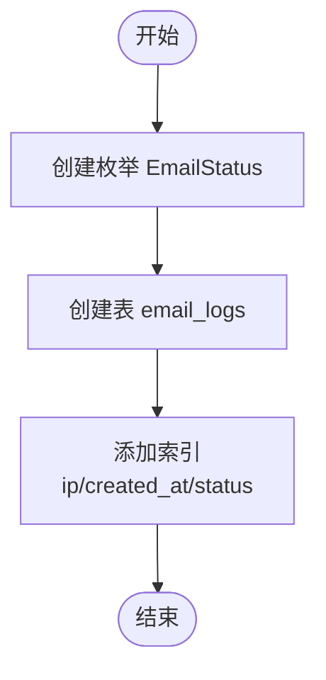
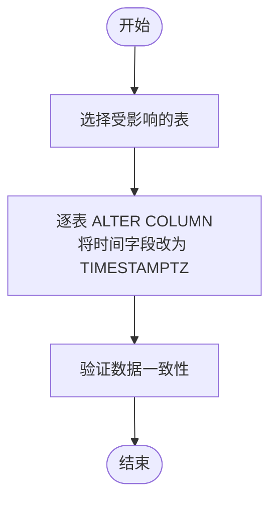
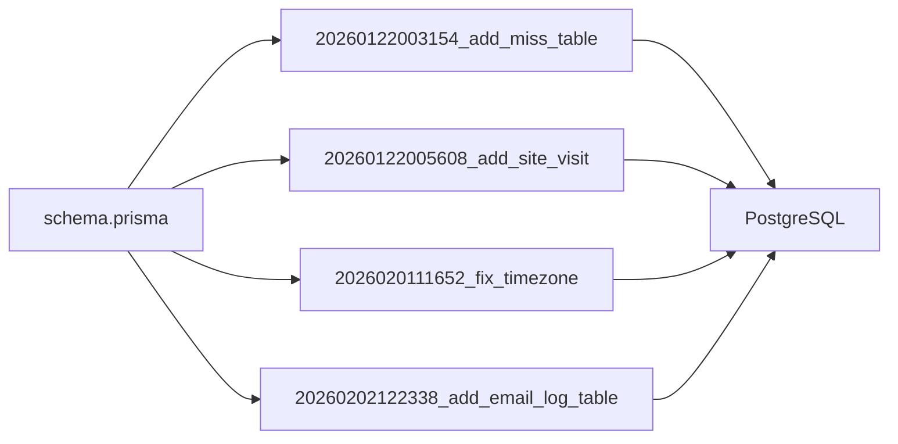

# 数据库迁移

<cite>
**本文引用的文件**
- [schema.prisma](file://prisma/schema.prisma)
- [20260122003154_add_miss_table/migration.sql](file://prisma/migrations/20260122003154_add_miss_table/migration.sql)
- [20260122005608_add_site_visit/migration.sql](file://prisma/migrations/20260122005608_add_site_visit/migration.sql)
- [20260201111652_fix_timezone/migration.sql](file://prisma/migrations/20260201111652_fix_timezone/migration.sql)
- [20260202122338_add_email_log_table/migration.sql](file://prisma/migrations/20260202122338_add_email_log_table/migration.sql)
- [migration_lock.toml](file://prisma/migrations/migration_lock.toml)
- [AGENTS.md](file://AGENTS.md)
- [set-db-timezone.ts](file://scripts/set-db-timezone.ts)
- [test-prisma-standard.ts](file://scripts/test-prisma-standard.ts)
- [test-mailer.ts](file://scripts/test-mailer.ts)
</cite>

## 目录
1. [引言](#引言)
2. [项目结构](#项目结构)
3. [核心组件](#核心组件)
4. [架构总览](#架构总览)
5. [详细组件分析](#详细组件分析)
6. [依赖关系分析](#依赖关系分析)
7. [性能考量](#性能考量)
8. [故障排除指南](#故障排除指南)
9. [结论](#结论)
10. [附录](#附录)

## 引言
本文件面向“一梦五千年”项目的数据库迁移管理，系统性阐述 Prisma 迁移体系的使用方法与最佳实践，覆盖迁移文件命名规范、版本控制策略、回滚机制、执行流程、环境差异处理与生产部署策略，并结合仓库中现有的迁移文件（新增表与字段类型调整），给出可落地的操作指引与排障建议。

## 项目结构
Prisma 迁移相关的核心位置如下：
- 模型定义与数据源配置：prisma/schema.prisma
- 迁移文件：prisma/migrations/<timestamp>_<name>/migration.sql
- 迁移锁文件：prisma/migrations/migration_lock.toml
- 测试与辅助脚本：scripts/*.ts（如设置时区、Prisma 标准测试、邮件发送测试）

图表来源
- [schema.prisma:1-13](file://prisma/schema.prisma#L1-L13)
- [20260122003154_add_miss_table/migration.sql:1-254](file://prisma/migrations/20260122003154_add_miss_table/migration.sql#L1-L254)
- [migration_lock.toml:1-4](file://prisma/migrations/migration_lock.toml#L1-L4)

章节来源
- [schema.prisma:1-13](file://prisma/schema.prisma#L1-L13)
- [20260122003154_add_miss_table/migration.sql:1-254](file://prisma/migrations/20260122003154_add_miss_table/migration.sql#L1-L254)
- [20260122005608_add_site_visit/migration.sql:1-22](file://prisma/migrations/20260122005608_add_site_visit/migration.sql#L1-L22)
- [20260201111652_fix_timezone/migration.sql:1-43](file://prisma/migrations/20260201111652_fix_timezone/migration.sql#L1-L43)
- [20260202122338_add_email_log_table/migration.sql:1-29](file://prisma/migrations/20260202122338_add_email_log_table/migration.sql#L1-L29)
- [migration_lock.toml:1-4](file://prisma/migrations/migration_lock.toml#L1-L4)

## 核心组件
- 数据源与客户端
  - 数据源：PostgreSQL，运行时通过 DATABASE_URL，迁移直连通过 DIRECT_URL
  - 客户端：启用 previewFeatures: relationJoins，提升关联查询性能
- 迁移系统
  - 使用 SQL 迁移文件，按时间戳命名，确保顺序与幂等
  - 迁移锁文件锁定 provider，防止误用其他数据库
- 关键迁移对象
  - 新增多张业务表（用户、账户、分类、标签、文章、评论、互动、友链、AI 工具、工具、站点访问、邮件日志）
  - 字段类型与时区修复（TIMESTAMPTZ）

章节来源
- [schema.prisma:1-13](file://prisma/schema.prisma#L1-L13)
- [schema.prisma:15-308](file://prisma/schema.prisma#L15-L308)
- [migration_lock.toml:1-4](file://prisma/migrations/migration_lock.toml#L1-L4)

## 架构总览
下图展示 Prisma 迁移在开发到生产的整体流程与关键节点：

图表来源
- [schema.prisma:1-13](file://prisma/schema.prisma#L1-L13)
- [20260122003154_add_miss_table/migration.sql:1-254](file://prisma/migrations/20260122003154_add_miss_table/migration.sql#L1-L254)
- [20260122005608_add_site_visit/migration.sql:1-22](file://prisma/migrations/20260122005608_add_site_visit/migration.sql#L1-L22)
- [20260201111652_fix_timezone/migration.sql:1-43](file://prisma/migrations/20260201111652_fix_timezone/migration.sql#L1-L43)
- [20260202122338_add_email_log_table/migration.sql:1-29](file://prisma/migrations/20260202122338_add_email_log_table/migration.sql#L1-L29)

## 详细组件分析

### 迁移命名规范与版本控制策略
- 命名规范
  - 使用时间戳前缀（YYYYMMDDHHMMSS）+ 下划线 + 动作或目标名称，保证自然排序即正确顺序
  - 示例：20260122003154_add_miss_table、20260201111652_fix_timezone
- 版本控制
  - 将迁移文件纳入 VCS，确保团队共享与可追溯
  - 迁移锁文件 migration_lock.toml 锁定 provider，避免误用其他数据库
- 幂等性
  - SQL 迁移文件应具备幂等特性，避免重复执行导致错误
  - 若需回滚，应在 PR 中同步提供逆向迁移文件

章节来源
- [20260122003154_add_miss_table/migration.sql:1-254](file://prisma/migrations/20260122003154_add_miss_table/migration.sql#L1-L254)
- [20260122005608_add_site_visit/migration.sql:1-22](file://prisma/migrations/20260122005608_add_site_visit/migration.sql#L1-L22)
- [20260201111652_fix_timezone/migration.sql:1-43](file://prisma/migrations/20260201111652_fix_timezone/migration.sql#L1-L43)
- [20260202122338_add_email_log_table/migration.sql:1-29](file://prisma/migrations/20260202122338_add_email_log_table/migration.sql#L1-L29)
- [migration_lock.toml:1-4](file://prisma/migrations/migration_lock.toml#L1-L4)

### 迁移执行流程
- 开发阶段
  - 修改 schema.prisma 后，生成迁移并应用至本地数据库
  - 通过 Prisma CLI 的 dev 或 deploy 命令执行
- 生产阶段
  - 在部署流水线中以只读方式连接数据库，使用 DIRECT_URL 应用迁移
  - 确保迁移在上线前完成，避免运行时 schema 不一致

章节来源
- [AGENTS.md:108](file://AGENTS.md#L108)
- [AGENTS.md:258](file://AGENTS.md#L258)
- [schema.prisma:7-13](file://prisma/schema.prisma#L7-L13)

### 回滚机制
- 建议
  - 为每个迁移提供逆向 SQL 文件，置于同级目录并命名为 migration.rollback.sql
  - 在回滚前进行数据备份与影响评估
- 注意
  - 仅对可逆变更提供回滚；破坏性变更需谨慎处理

（本节为通用实践说明，不直接分析具体文件）

### 新增 miss_table（初始建模）
该迁移文件包含大量枚举与表的创建，以及索引建立，覆盖用户、社交、内容与工具相关的核心实体。

图表来源
- [20260122003154_add_miss_table/migration.sql:22-254](file://prisma/migrations/20260122003154_add_miss_table/migration.sql#L22-L254)

章节来源
- [20260122003154_add_miss_table/migration.sql:1-254](file://prisma/migrations/20260122003154_add_miss_table/migration.sql#L1-L254)

### 新增表 site_visit
- 表名：site_visits
- 字段要点：自增主键、UV、页面 URL、设备、来源、IP、创建时间
- 索引：UV、页面 URL、创建时间

图表来源
- [20260122005608_add_site_visit/migration.sql:1-22](file://prisma/migrations/20260122005608_add_site_visit/migration.sql#L1-L22)

章节来源
- [20260122005608_add_site_visit/migration.sql:1-22](file://prisma/migrations/20260122005608_add_site_visit/migration.sql#L1-L22)

### 新增表 email_log_table
- 枚举：EmailStatus（PENDING、SENT、FAILED）
- 表名：email_logs
- 字段要点：发件人、收件人、主题、内容、状态、错误信息、IP、发送次数、创建时间、发送时间
- 索引：IP、创建时间、状态

图表来源
- [20260202122338_add_email_log_table/migration.sql:1-29](file://prisma/migrations/20260202122338_add_email_log_table/migration.sql#L1-L29)

章节来源
- [20260202122338_add_email_log_table/migration.sql:1-29](file://prisma/migrations/20260202122338_add_email_log_table/migration.sql#L1-L29)

### 时区修复（字段类型调整）
- 目标：将多张表的若干时间字段从 TIMESTAMP 改为 TIMESTAMPTZ，统一时区存储
- 影响范围：用户、文章、评论、互动、分类、标签、工具、AI 工具、站点访问等

图表来源
- [20260201111652_fix_timezone/migration.sql:1-43](file://prisma/migrations/20260201111652_fix_timezone/migration.sql#L1-L43)

章节来源
- [20260201111652_fix_timezone/migration.sql:1-43](file://prisma/migrations/20260201111652_fix_timezone/migration.sql#L1-L43)

### 迁移执行与环境差异处理
- 开发环境
  - 使用 DATABASE_URL 连接池进行日常开发与测试
- 生产环境
  - 使用 DIRECT_URL 直连执行迁移，避免连接池干扰
  - 在 CI/CD 中以只读方式连接数据库，确保迁移幂等与安全

章节来源
- [schema.prisma:7-13](file://prisma/schema.prisma#L7-L13)
- [AGENTS.md:258](file://AGENTS.md#L258)

### 迁移自动化与 CI/CD 集成
- 自动化脚本
  - set-db-timezone.ts：设置数据库时区，确保与应用时区一致
  - test-prisma-standard.ts：标准 Prisma 测试脚本
  - test-mailer.ts：邮件发送测试脚本
- CI/CD 建议
  - 在构建后、部署前执行迁移
  - 使用只读连接校验迁移是否已完成
  - 对破坏性变更增加人工审批与回滚预案

章节来源
- [set-db-timezone.ts](file://scripts/set-db-timezone.ts)
- [test-prisma-standard.ts](file://scripts/test-prisma-standard.ts)
- [test-mailer.ts](file://scripts/test-mailer.ts)
- [AGENTS.md:258](file://AGENTS.md#L258)

## 依赖关系分析
- 模型到迁移
  - schema.prisma 中的 model 定义与迁移文件中的 CREATE TABLE/INDEX 对应
- 迁移之间的依赖
  - 时间戳前缀决定执行顺序，先创建基础表再创建依赖表
- 外部依赖
  - PostgreSQL 提供 SQL 兼容能力
  - Prisma 客户端生成与 previewFeatures 优化关联查询

图表来源
- [schema.prisma:15-308](file://prisma/schema.prisma#L15-L308)
- [20260122003154_add_miss_table/migration.sql:1-254](file://prisma/migrations/20260122003154_add_miss_table/migration.sql#L1-L254)
- [20260122005608_add_site_visit/migration.sql:1-22](file://prisma/migrations/20260122005608_add_site_visit/migration.sql#L1-L22)
- [20260201111652_fix_timezone/migration.sql:1-43](file://prisma/migrations/20260201111652_fix_timezone/migration.sql#L1-L43)
- [20260202122338_add_email_log_table/migration.sql:1-29](file://prisma/migrations/20260202122338_add_email_log_table/migration.sql#L1-L29)

章节来源
- [schema.prisma:15-308](file://prisma/schema.prisma#L15-L308)
- [20260122003154_add_miss_table/migration.sql:1-254](file://prisma/migrations/20260122003154_add_miss_table/migration.sql#L1-L254)
- [20260122005608_add_site_visit/migration.sql:1-22](file://prisma/migrations/20260122005608_add_site_visit/migration.sql#L1-L22)
- [20260201111652_fix_timezone/migration.sql:1-43](file://prisma/migrations/20260201111652_fix_timezone/migration.sql#L1-L43)
- [20260202122338_add_email_log_table/migration.sql:1-29](file://prisma/migrations/20260202122338_add_email_log_table/migration.sql#L1-L29)

## 性能考量
- 索引设计
  - 为高频查询字段建立索引（如 UV、URL、创建时间、状态等）
- 查询优化
  - 利用 previewFeatures: relationJoins 减少 N+1 查询往返
- 时间字段
  - 统一使用 TIMESTAMPTZ，避免时区转换带来的额外开销与误差

章节来源
- [20260122005608_add_site_visit/migration.sql:14-21](file://prisma/migrations/20260122005608_add_site_visit/migration.sql#L14-L21)
- [20260202122338_add_email_log_table/migration.sql:21-28](file://prisma/migrations/20260202122338_add_email_log_table/migration.sql#L21-L28)
- [schema.prisma:1-5](file://prisma/schema.prisma#L1-L5)
- [20260201111652_fix_timezone/migration.sql:1-43](file://prisma/migrations/20260201111652_fix_timezone/migration.sql#L1-L43)

## 故障排除指南
- 迁移失败
  - 检查迁移文件是否幂等，确认无重复创建
  - 校验数据库连接参数（DATABASE_URL/DIRECT_URL）
- 时区问题
  - 使用 set-db-timezone.ts 设置数据库时区，确保与应用一致
- 邮件功能异常
  - 使用 test-mailer.ts 进行端到端验证
- 回滚准备
  - 为破坏性变更准备逆向迁移文件，提前演练回滚流程

章节来源
- [AGENTS.md:258](file://AGENTS.md#L258)
- [set-db-timezone.ts](file://scripts/set-db-timezone.ts)
- [test-mailer.ts](file://scripts/test-mailer.ts)

## 结论
本项目采用 SQL 迁移文件配合 Prisma 管理数据库演进，遵循时间戳命名与版本控制策略，结合索引与时区统一等实践，保障了迁移的可追溯性与稳定性。建议在 CI/CD 中固化迁移流程，并为破坏性变更准备回滚预案，持续优化查询与索引设计，确保生产环境的可靠性与性能。

## 附录
- 关键文件清单
  - schema.prisma：模型与数据源配置
  - migrations/*：SQL 迁移文件
  - migration_lock.toml：迁移锁
  - scripts/*：测试与辅助脚本

章节来源
- [schema.prisma:1-13](file://prisma/schema.prisma#L1-L13)
- [20260122003154_add_miss_table/migration.sql:1-254](file://prisma/migrations/20260122003154_add_miss_table/migration.sql#L1-L254)
- [20260122005608_add_site_visit/migration.sql:1-22](file://prisma/migrations/20260122005608_add_site_visit/migration.sql#L1-L22)
- [20260201111652_fix_timezone/migration.sql:1-43](file://prisma/migrations/20260201111652_fix_timezone/migration.sql#L1-L43)
- [20260202122338_add_email_log_table/migration.sql:1-29](file://prisma/migrations/20260202122338_add_email_log_table/migration.sql#L1-L29)
- [migration_lock.toml:1-4](file://prisma/migrations/migration_lock.toml#L1-L4)
- [AGENTS.md:108](file://AGENTS.md#L108)
- [AGENTS.md:258](file://AGENTS.md#L258)
- [set-db-timezone.ts](file://scripts/set-db-timezone.ts)
- [test-prisma-standard.ts](file://scripts/test-prisma-standard.ts)
- [test-mailer.ts](file://scripts/test-mailer.ts)